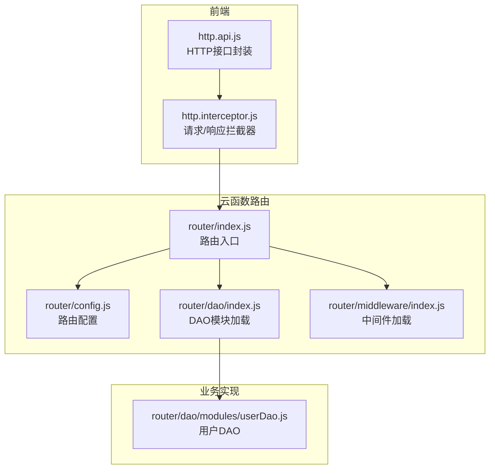
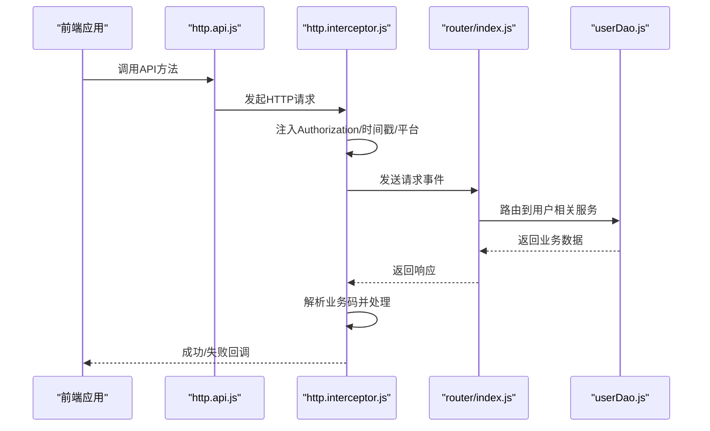
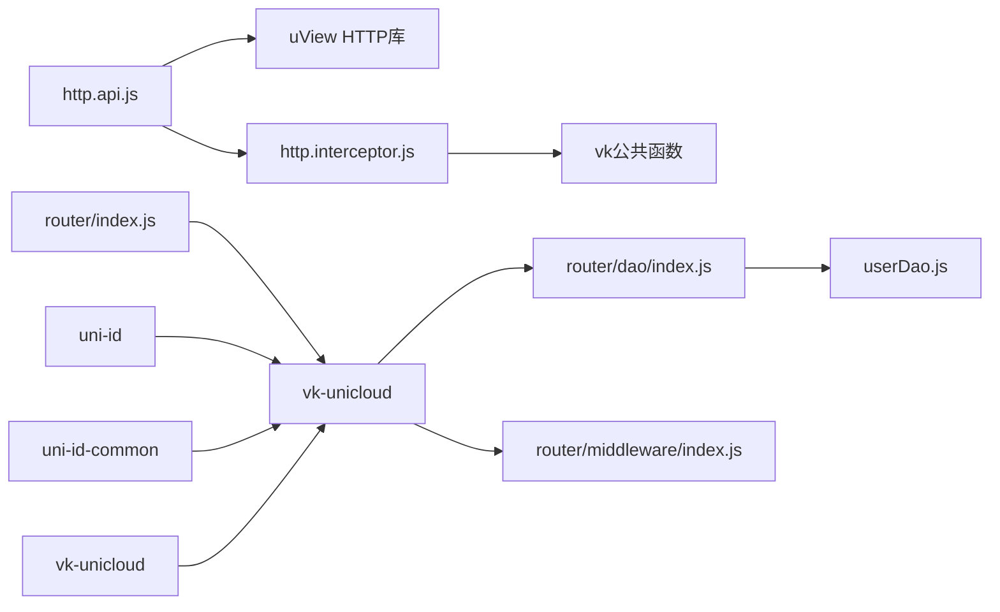

# API接口文档

<cite>
**本文引用的文件**
- [http.api.js](file://apis/http.api.js)
- [http.interceptor.js](file://apis/http.interceptor.js)
- [router/index.js](file://uniCloud-aliyun/cloudfunctions/router/index.js)
- [router/dao/index.js](file://uniCloud-aliyun/cloudfunctions/router/dao/index.js)
- [router/dao/modules/userDao.js](file://uniCloud-aliyun/cloudfunctions/router/dao/modules/userDao.js)
- [router/middleware/index.js](file://uniCloud-aliyun/cloudfunctions/router/middleware/index.js)
- [router/config.js](file://uniCloud-aliyun/cloudfunctions/router/config.js)
- [uni_modules/uni-id-common/uniCloud/cloudfunctions/common/uni-id-common/package.json](file://uni_modules/uni-id-common/uniCloud/cloudfunctions/common/uni-id-common/package.json)
- [uni_modules/uni-id/uniCloud/cloudfunctions/common/uni-id/package.json](file://uni_modules/uni-id/uniCloud/cloudfunctions/common/uni-id/package.json)
- [uni_modules/vk-unicloud/uniCloud/cloudfunctions/common/vk-unicloud/package.json](file://uni_modules/vk-unicloud/uniCloud/cloudfunctions/common/vk-unicloud/package.json)
</cite>

## 目录
1. [简介](#简介)
2. [项目结构](#项目结构)
3. [核心组件](#核心组件)
4. [架构总览](#架构总览)
5. [详细组件分析](#详细组件分析)
6. [依赖关系分析](#依赖关系分析)
7. [性能考虑](#性能考虑)
8. [故障排查指南](#故障排查指南)
9. [结论](#结论)
10. [附录](#附录)

## 简介
本文件为“挪车助手”项目的API接口文档，覆盖前端HTTP API与云函数接口的规范说明。内容包括：
- 用户相关接口（登录、获取用户信息、绑定/解绑第三方账号等）
- 认证机制与权限控制
- 请求参数、响应格式与错误码
- 接口调用示例、SDK使用方法与集成指南
- 接口测试方法、性能优化建议与版本管理策略

## 项目结构
前端通过统一的HTTP封装与拦截器进行请求管理，云函数通过vk-unicloud路由框架统一调度，DAO层负责数据库操作，中间件层提供通用过滤器。

图表来源
- [http.api.js:1-32](file://apis/http.api.js#L1-L32)
- [http.interceptor.js:1-116](file://apis/http.interceptor.js#L1-L116)
- [router/index.js:1-8](file://uniCloud-aliyun/cloudfunctions/router/index.js#L1-L8)
- [router/dao/index.js:1-36](file://uniCloud-aliyun/cloudfunctions/router/dao/index.js#L1-L36)
- [router/middleware/index.js:1-34](file://uniCloud-aliyun/cloudfunctions/router/middleware/index.js#L1-L34)
- [router/dao/modules/userDao.js:1-568](file://uniCloud-aliyun/cloudfunctions/router/dao/modules/userDao.js#L1-L568)

章节来源
- [http.api.js:1-32](file://apis/http.api.js#L1-L32)
- [http.interceptor.js:1-116](file://apis/http.interceptor.js#L1-L116)
- [router/index.js:1-8](file://uniCloud-aliyun/cloudfunctions/router/index.js#L1-L8)
- [router/dao/index.js:1-36](file://uniCloud-aliyun/cloudfunctions/router/dao/index.js#L1-L36)
- [router/middleware/index.js:1-34](file://uniCloud-aliyun/cloudfunctions/router/middleware/index.js#L1-L34)
- [router/dao/modules/userDao.js:1-568](file://uniCloud-aliyun/cloudfunctions/router/dao/modules/userDao.js#L1-L568)

## 核心组件
- HTTP接口封装：提供统一的API方法，如获取openid、获取手机号、获取用户信息等。
- 请求/响应拦截器：统一注入Authorization头、时间戳、客户端平台信息；按业务码处理错误与成功响应。
- 云函数路由入口：通过vk-unicloud实例化路由，转发事件到对应服务。
- DAO层：提供用户表的增删改查、统计聚合、邀请码生成、账号注销/恢复等业务方法。
- 中间件层：集中加载并合并中间件模块，用于登录校验、加密过滤、错误处理等。

章节来源
- [http.api.js:19-28](file://apis/http.api.js#L19-L28)
- [http.interceptor.js:37-114](file://apis/http.interceptor.js#L37-L114)
- [router/index.js:5-7](file://uniCloud-aliyun/cloudfunctions/router/index.js#L5-L7)
- [router/dao/index.js:16-34](file://uniCloud-aliyun/cloudfunctions/router/dao/index.js#L16-L34)
- [router/middleware/index.js:14-32](file://uniCloud-aliyun/cloudfunctions/router/middleware/index.js#L14-L32)

## 架构总览
前端通过http.api.js发起HTTP请求，经由http.interceptor.js统一注入头与错误处理；云函数路由入口将请求交由vk-unicloud处理，DAO层完成数据库操作，最终返回统一格式的业务响应。

图表来源
- [http.api.js:17-28](file://apis/http.api.js#L17-L28)
- [http.interceptor.js:37-114](file://apis/http.interceptor.js#L37-L114)
- [router/index.js:5-7](file://uniCloud-aliyun/cloudfunctions/router/index.js#L5-L7)
- [router/dao/modules/userDao.js:147-167](file://uniCloud-aliyun/cloudfunctions/router/dao/modules/userDao.js#L147-L167)

## 详细组件分析

### HTTP接口封装（apis/http.api.js）
- 环境配置：支持prod/pre/test三套环境，动态选择基础URL。
- 方法封装：通过统一req工厂方法生成HTTP请求函数，减少重复代码。
- 已定义接口：
  - 获取openid：POST /userEntity/wxLogins
  - 获取手机号：POST /loginWx
  - 获取用户信息：GET /getSysUserInfo

章节来源
- [http.api.js:1-32](file://apis/http.api.js#L1-L32)

### 请求/响应拦截器（apis/http.interceptor.js）
- 请求拦截：
  - 从本地存储读取令牌并注入Authorization头。
  - 注入x-timestamp与x-client-platform请求头。
- 响应拦截：
  - 从响应体提取业务数据（uView Pro约定在data字段）。
  - 业务码处理：
    - 0：业务失败，弹窗提示并可复制错误摘要。
    - 1：业务成功，透传业务数据。
    - 200：兼容HTTP 200成功。
    - 401：未登录或登录过期，提示并引导重新登录。
    - 403：无权限访问。
    - 500：服务器错误。
  - 未处理的业务码会输出警告日志。

章节来源
- [http.interceptor.js:37-114](file://apis/http.interceptor.js#L37-L114)

### 云函数路由入口（router/index.js）
- 通过vk-unicloud创建实例并调用路由分发。
- 将云函数事件与上下文传递给vk实例，实现统一路由。

章节来源
- [router/index.js:1-8](file://uniCloud-aliyun/cloudfunctions/router/index.js#L1-L8)

### DAO层（router/dao/modules/userDao.js）
- 表字段默认过滤：不返回token与password字段。
- 基础能力：findById、findByWhereJson、add、adds、updateById、update、deleteById、del、count、sum/max/min/avg、select/selects/getTableData等。
- 用户业务方法：
  - findByInviteCode：根据邀请码查询用户。
  - add/adds：新增用户，取消自动添加创建时间（使用register_date）。
  - findByUserInfo：支持按多种字段组合查询。
  - listByIds：批量查询用户列表。
  - registerUserByMobile：手机号一键注册并登录（含验证码设置与登录流程）。
  - resetPwd：重置用户密码。
  - getValidInviteCode：生成唯一7位邀请码。
  - closeAccount：账号注销（支持立即注销与延迟注销，带冷静期逻辑）。
  - openAccount：恢复未确认注销的账号。

章节来源
- [router/dao/modules/userDao.js:16-568](file://uniCloud-aliyun/cloudfunctions/router/dao/modules/userDao.js#L16-L568)

### 中间件层（router/middleware/index.js）
- 动态扫描并加载中间件模块，合并为中间件列表。
- 用于登录校验、错误处理、加密过滤等通用逻辑。

章节来源
- [router/middleware/index.js:1-34](file://uniCloud-aliyun/cloudfunctions/router/middleware/index.js#L1-L34)

### 路由配置（router/config.js）
- 提供vk-unicloud路由配置项，用于初始化路由实例。

章节来源
- [router/config.js](file://uniCloud-aliyun/cloudfunctions/router/config.js)

## 依赖关系分析
- 外部依赖：
  - vk-unicloud：云函数路由与工具库。
  - uni-id、uni-id-common：统一用户中心与通用能力。
- 内部依赖：
  - http.api.js依赖uView HTTP库进行请求封装。
  - http.interceptor.js依赖vk公共函数进行错误摘要构建与剪贴板复制。
  - router/index.js依赖vk-unicloud进行路由分发。
  - dao/index.js与middleware/index.js分别负责DAO与中间件的模块化加载。

图表来源
- [http.api.js:17-28](file://apis/http.api.js#L17-L28)
- [http.interceptor.js:26-28](file://apis/http.interceptor.js#L26-L28)
- [router/index.js:3-7](file://uniCloud-aliyun/cloudfunctions/router/index.js#L3-L7)
- [router/dao/index.js:16-34](file://uniCloud-aliyun/cloudfunctions/router/dao/index.js#L16-L34)
- [router/middleware/index.js:14-32](file://uniCloud-aliyun/cloudfunctions/router/middleware/index.js#L14-L32)
- [router/dao/modules/userDao.js:16-568](file://uniCloud-aliyun/cloudfunctions/router/dao/modules/userDao.js#L16-L568)
- [uni_modules/uni-id/uniCloud/cloudfunctions/common/uni-id/package.json](file://uni_modules/uni-id/uniCloud/cloudfunctions/common/uni-id/package.json)
- [uni_modules/uni-id-common/uniCloud/cloudfunctions/common/uni-id-common/package.json](file://uni_modules/uni-id-common/uniCloud/cloudfunctions/common/uni-id-common/package.json)
- [uni_modules/vk-unicloud/uniCloud/cloudfunctions/common/vk-unicloud/package.json](file://uni_modules/vk-unicloud/uniCloud/cloudfunctions/common/vk-unicloud/package.json)

章节来源
- [http.api.js:17-28](file://apis/http.api.js#L17-L28)
- [http.interceptor.js:26-28](file://apis/http.interceptor.js#L26-L28)
- [router/index.js:3-7](file://uniCloud-aliyun/cloudfunctions/router/index.js#L3-L7)
- [router/dao/index.js:16-34](file://uniCloud-aliyun/cloudfunctions/router/dao/index.js#L16-L34)
- [router/middleware/index.js:14-32](file://uniCloud-aliyun/cloudfunctions/router/middleware/index.js#L14-L32)
- [router/dao/modules/userDao.js:16-568](file://uniCloud-aliyun/cloudfunctions/router/dao/modules/userDao.js#L16-L568)
- [uni_modules/uni-id/uniCloud/cloudfunctions/common/uni-id/package.json](file://uni_modules/uni-id/uniCloud/cloudfunctions/common/uni-id/package.json)
- [uni_modules/uni-id-common/uniCloud/cloudfunctions/common/uni-id-common/package.json](file://uni_modules/uni-id-common/uniCloud/cloudfunctions/common/uni-id-common/package.json)
- [uni_modules/vk-unicloud/uniCloud/cloudfunctions/common/vk-unicloud/package.json](file://uni_modules/vk-unicloud/uniCloud/cloudfunctions/common/vk-unicloud/package.json)

## 性能考虑
- 请求头注入：每次请求附加时间戳与平台信息，便于追踪与限流策略实施。
- 统一错误处理：拦截器集中处理业务码，避免前端重复判断，降低分支复杂度。
- DAO层方法：优先使用select而非selects以提升查询性能；必要时再使用selects进行联表查询。
- 令牌缓存：拦截器从本地存储读取令牌，减少重复鉴权开销。
- 未处理业务码：拦截器输出警告日志，便于定位异常响应。

[本节为通用性能建议，不涉及具体文件分析]

## 故障排查指南
- 登录过期（401）：拦截器会提示“登录已过期,请重新登录”，建议在前端触发重新登录流程。
- 业务失败（0）：弹窗显示错误信息，可选择复制错误摘要到剪贴板以便快速定位问题。
- 无权限（403）：检查用户角色与权限配置，确保具备访问资源的权限。
- 服务器错误（500）：检查云函数日志与数据库连接状态，确认服务可用性。
- 未处理业务码：拦截器会输出警告日志，建议补充相应处理逻辑。

章节来源
- [http.interceptor.js:70-113](file://apis/http.interceptor.js#L70-L113)

## 结论
本项目通过统一的HTTP封装与拦截器、基于vk-unicloud的云函数路由以及模块化的DAO与中间件，实现了清晰的前后端分离与可扩展的API体系。建议在后续迭代中完善更多业务接口的文档与测试用例，并持续优化DAO查询性能与错误处理策略。

[本节为总结性内容，不涉及具体文件分析]

## 附录

### 接口清单与规范

- 获取openid
  - 方法：POST
  - URL：/userEntity/wxLogins
  - 请求参数：由前端调用方传入
  - 响应格式：业务码与业务数据
  - 错误码：参考“响应拦截器”中的业务码处理
  - 认证：无需
  - 权限：无需

- 获取手机号
  - 方法：POST
  - URL：/loginWx
  - 请求参数：由前端调用方传入
  - 响应格式：业务码与业务数据
  - 错误码：参考“响应拦截器”中的业务码处理
  - 认证：无需
  - 权限：无需

- 获取用户信息
  - 方法：GET
  - URL：/getSysUserInfo
  - 请求参数：无
  - 响应格式：业务码与业务数据
  - 错误码：参考“响应拦截器”中的业务码处理
  - 认证：需要（Authorization头）
  - 权限：需具备用户信息访问权限

章节来源
- [http.api.js:19-28](file://apis/http.api.js#L19-L28)
- [http.interceptor.js:37-114](file://apis/http.interceptor.js#L37-L114)

### 认证机制与权限控制
- 认证方式：Bearer Token
  - 令牌来源：登录成功后返回的token
  - 注入位置：请求头Authorization
- 权限控制：
  - 通过中间件与服务端权限校验实现
  - 401：未登录或登录过期
  - 403：无权限访问

章节来源
- [http.interceptor.js:40-41](file://apis/http.interceptor.js#L40-L41)
- [http.interceptor.js:70-97](file://apis/http.interceptor.js#L70-L97)

### 数据验证规则
- 基础字段过滤：DAO层默认不返回token与password字段，保障敏感信息安全。
- 邀请码生成：使用7位字符集（排除易混淆字符），保证唯一性并限制重试次数。
- 账号注销：支持立即注销与延迟注销，延迟注销需经过冷静期判断。

章节来源
- [router/dao/modules/userDao.js:6-9](file://uniCloud-aliyun/cloudfunctions/router/dao/modules/userDao.js#L6-L9)
- [router/dao/modules/userDao.js:415-440](file://uniCloud-aliyun/cloudfunctions/router/dao/modules/userDao.js#L415-L440)
- [router/dao/modules/userDao.js:456-532](file://uniCloud-aliyun/cloudfunctions/router/dao/modules/userDao.js#L456-L532)

### 接口调用示例
- 使用http.api.js调用示例（路径参考）
  - 获取openid：[http.api.js:21](file://apis/http.api.js#L21)
  - 获取手机号：[http.api.js:24](file://apis/http.api.js#L24)
  - 获取用户信息：[http.api.js:27](file://apis/http.api.js#L27)

章节来源
- [http.api.js:19-28](file://apis/http.api.js#L19-L28)

### SDK使用方法与集成指南
- 初始化
  - 在应用启动时安装HTTP配置与拦截器
  - 参考：[http.api.js:11-14](file://apis/http.api.js#L11-L14)，[http.interceptor.js:37](file://apis/http.interceptor.js#L37)
- 调用API
  - 通过全局api对象调用各接口
  - 参考：[http.api.js:19-28](file://apis/http.api.js#L19-L28)
- 云函数集成
  - 云函数入口通过vk-unicloud路由
  - 参考：[router/index.js:5-7](file://uniCloud-aliyun/cloudfunctions/router/index.js#L5-L7)
- DAO与中间件
  - DAO模块自动加载与初始化
  - 中间件模块集中加载
  - 参考：[router/dao/index.js:25-34](file://uniCloud-aliyun/cloudfunctions/router/dao/index.js#L25-L34)，[router/middleware/index.js:28-32](file://uniCloud-aliyun/cloudfunctions/router/middleware/index.js#L28-L32)

章节来源
- [http.api.js:11-14](file://apis/http.api.js#L11-L14)
- [http.interceptor.js:37](file://apis/http.interceptor.js#L37)
- [router/index.js:5-7](file://uniCloud-aliyun/cloudfunctions/router/index.js#L5-L7)
- [router/dao/index.js:25-34](file://uniCloud-aliyun/cloudfunctions/router/dao/index.js#L25-L34)
- [router/middleware/index.js:28-32](file://uniCloud-aliyun/cloudfunctions/router/middleware/index.js#L28-L32)

### 接口测试方法
- 单元测试：针对DAO层方法编写测试用例，覆盖新增、查询、更新、删除与业务方法。
- 集成测试：通过mock请求与拦截器，验证业务码处理与错误提示。
- 性能测试：对高频查询接口（如select）进行压力测试，评估数据库与网络瓶颈。
- 日志与监控：结合拦截器日志与云函数日志，定位异常响应与性能问题。

[本节为通用测试建议，不涉及具体文件分析]

### 版本管理策略
- 环境切换：通过http.api.js中的ENV_MAP与currentEnvironment进行环境切换。
- 版本升级：云函数路由通过vk-unicloud版本管理，确保向后兼容。
- 文档同步：接口变更时同步更新API文档与SDK使用说明。

章节来源
- [http.api.js:1-8](file://apis/http.api.js#L1-L8)