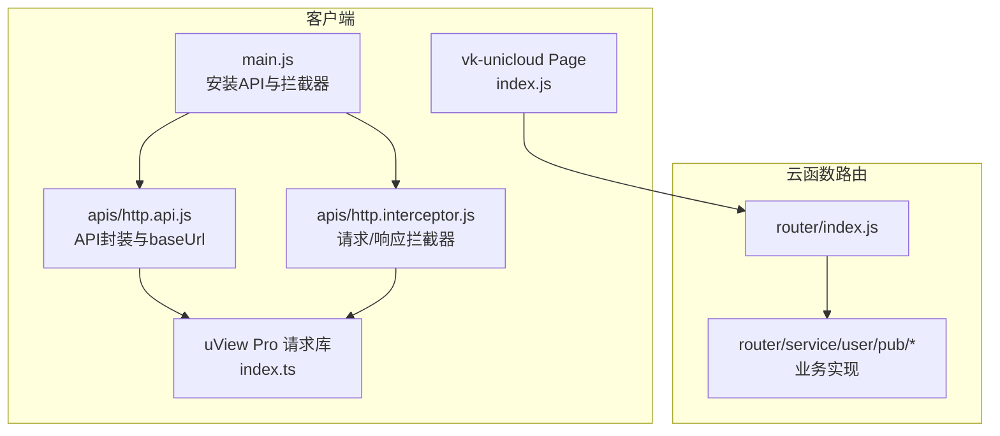
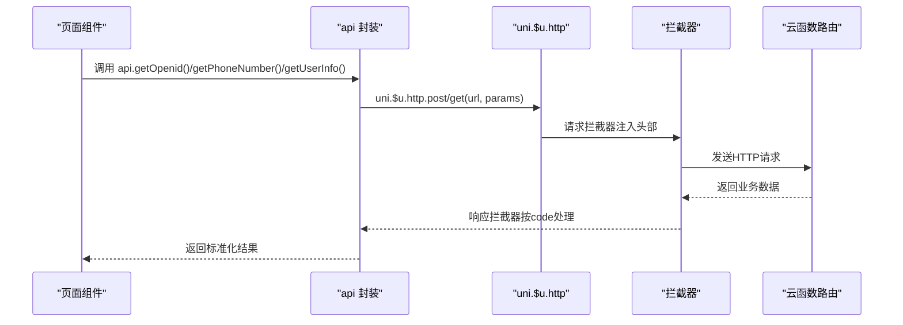
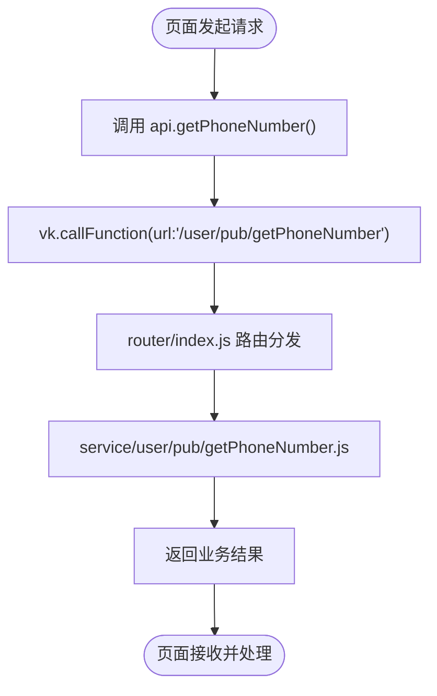
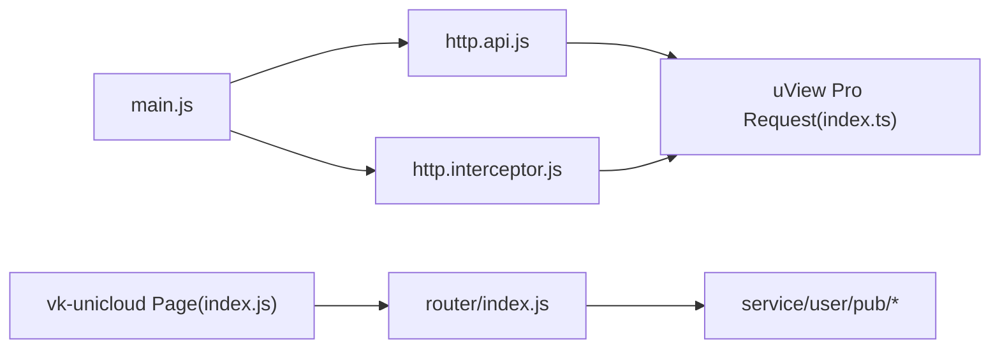

# HTTP API封装

<cite>
**本文档引用的文件**
- [http.api.js](file://apis/http.api.js)
- [http.interceptor.js](file://apis/http.interceptor.js)
- [main.js](file://main.js)
- [app.config.js](file://app.config.js)
- [index.js](file://uni_modules/uview-pro/libs/request/index.ts)
- [vk-unicloud-page/index.js](file://uni_modules/vk-unicloud/vk_modules/vk-unicloud-page/index.js)
- [vk-unicloud-callFunctionUtil.js](file://uni_modules/vk-unicloud/vk_modules/vk-unicloud-page/libs/vk-unicloud/vk-unicloud-callFunctionUtil.js)
- [code2SessionWeixin.js](file://uniCloud-aliyun/cloudfunctions/router/service/user/pub/code2SessionWeixin.js)
- [getPhoneNumber.js](file://uniCloud-aliyun/cloudfunctions/router/service/user/pub/getPhoneNumber.js)
- [loginByToken.js](file://uniCloud-aliyun/cloudfunctions/router/service/user/pub/loginByToken.js)
- [index.js](file://uniCloud-aliyun/cloudfunctions/router/index.js)
</cite>

## 目录
1. [简介](#简介)
2. [项目结构](#项目结构)
3. [核心组件](#核心组件)
4. [架构总览](#架构总览)
5. [详细组件分析](#详细组件分析)
6. [依赖关系分析](#依赖关系分析)
7. [性能考虑](#性能考虑)
8. [故障排查指南](#故障排查指南)
9. [结论](#结论)
10. [附录](#附录)

## 简介
本文件面向挪车助手项目的HTTP API封装，系统性说明基于uView Pro与vk-unicloud的请求封装机制，涵盖环境配置、基础URL设置、请求方法封装、全局拦截器、错误处理策略，以及已实现的API接口（如获取openid、获取手机号码、获取用户信息）的使用方法、参数说明、响应格式与最佳实践。读者无需深入源码即可理解如何正确使用与扩展该封装。

## 项目结构
- API封装位于 apis/http.api.js 与 apis/http.interceptor.js
- 应用启动时在 main.js 中安装API与拦截器
- uView Pro 提供统一请求库，vk-unicloud 提供云函数调用能力
- 云函数路由入口位于 uniCloud-aliyun/cloudfunctions/router/index.js，具体业务实现位于 router/service/user/pub 下

**图表来源**
- [main.js:41-45](file://main.js#L41-L45)
- [http.api.js:11-14](file://apis/http.api.js#L11-L14)
- [http.interceptor.js:37-47](file://apis/http.interceptor.js#L37-L47)
- [index.js:274-295](file://uni_modules/uview-pro/libs/request/index.ts#L274-L295)
- [vk-unicloud-page/index.js:43-52](file://uni_modules/vk-unicloud/vk_modules/vk-unicloud-page/index.js#L43-L52)
- [index.js:5-7](file://uniCloud-aliyun/cloudfunctions/router/index.js#L5-L7)

**章节来源**
- [main.js:41-45](file://main.js#L41-L45)
- [http.api.js:11-14](file://apis/http.api.js#L11-L14)
- [http.interceptor.js:37-47](file://apis/http.interceptor.js#L37-L47)
- [index.js:274-295](file://uni_modules/uview-pro/libs/request/index.ts#L274-L295)
- [vk-unicloud-page/index.js:43-52](file://uni_modules/vk-unicloud/vk_modules/vk-unicloud-page/index.js#L43-L52)
- [index.js:5-7](file://uniCloud-aliyun/cloudfunctions/router/index.js#L5-L7)

## 核心组件
- 环境与基础URL配置：通过 ENV_MAP 与 currentEnvironment 控制不同环境的基础URL，最终注入到 uni.$u.http.setConfig
- API封装：通过高阶函数 req(method, url) 生成具体API方法，统一使用 uni.$u.http[method](url, params)
- 请求拦截器：自动注入 Authorization、x-timestamp、x-client-platform 等头部
- 响应拦截器：按业务码（0/1/200/401/403/500）分发处理，统一错误提示与登录过期处理

**章节来源**
- [http.api.js:1-14](file://apis/http.api.js#L1-L14)
- [http.api.js:17-28](file://apis/http.api.js#L17-L28)
- [http.interceptor.js:37-114](file://apis/http.interceptor.js#L37-L114)

## 架构总览
HTTP请求从页面组件发起，经由封装的 api 对象，统一走 uni.$u.http 请求库；请求拦截器注入通用头部，响应拦截器根据业务码统一处理结果与错误提示。

**图表来源**
- [http.api.js:17-28](file://apis/http.api.js#L17-L28)
- [http.interceptor.js:37-114](file://apis/http.interceptor.js#L37-L114)
- [index.js:224-272](file://uni_modules/uview-pro/libs/request/index.ts#L224-L272)

## 详细组件分析

### 环境配置与基础URL设置
- 环境映射 ENV_MAP 包含 prod/pre/test 三套基础URL
- currentEnvironment 指定当前环境，默认 prod
- BASE_URL 由 ENV_MAP[currentEnvironment] 或 ENV_MAP.pre 决定
- install(app) 将 baseUrl 注入 uni.$u.http.setConfig，使后续所有请求使用该基础URL

最佳实践
- 在构建/部署时通过修改 currentEnvironment 切换环境
- 如需临时覆盖，可在运行时动态修改 globalThis.api 或 BASE_URL

**章节来源**
- [http.api.js:1-14](file://apis/http.api.js#L1-L14)
- [http.api.js:11-14](file://apis/http.api.js#L11-L14)

### 请求方法封装
- req(method, url) 返回一个函数，接收参数对象 p 并调用 uni.$u.http[method](url, p)
- api 对象集中暴露 getOpenid/post、getPhoneNumber/post、getUserInfo/get 等方法
- 该封装屏蔽了底层HTTP细节，便于统一管理与扩展

使用建议
- 新增接口时，优先在 api 对象中添加对应方法，保持命名一致
- 参数传递遵循 uni.$u.http 的约定，支持 data、header、meta 等选项

**章节来源**
- [http.api.js:17-28](file://apis/http.api.js#L17-L28)
- [index.js:224-272](file://uni_modules/uview-pro/libs/request/index.ts#L224-L272)

### 全局请求拦截器
- 自动注入 Authorization 头部（若存在 token）
- 注入 x-timestamp（毫秒时间戳）
- 注入 x-client-platform（设备平台）
- 可扩展：在 install 中追加更多头部或鉴权逻辑

注意
- token 存储键名固定为 uni_id_token
- 若需跨域携带cookie，需在 setConfig 中配置 withCredentials

**章节来源**
- [http.interceptor.js:37-47](file://apis/http.interceptor.js#L37-L47)

### 全局响应拦截器
- 业务数据统一从 res.data 中提取
- 业务码映射：
  - 0：业务失败，统一弹窗提示并拒绝Promise
  - 1：业务成功，透传业务数据
  - 200：兼容HTTP 200的成功场景
  - 401：未登录/登录过期，统一提示并可触发跳转（当前注释掉，保留扩展点）
  - 403：无权限访问
  - 500：服务器错误
- 未识别业务码：记录警告并透传原始响应

错误处理策略
- 显示模态框并支持复制错误摘要（可配置）
- 隐藏loading（如存在），避免界面卡顿
- 对于401场景，可结合业务需求恢复登录流程

**章节来源**
- [http.interceptor.js:49-114](file://apis/http.interceptor.js#L49-L114)

### 已实现API接口与使用方法

#### 获取openid
- 方法：api.getOpenid(params)
- 请求方式：POST
- 基础路径：/userEntity/wxLogins
- 用途：换取用户标识，配合手机号授权流程
- 参数说明（示例）：
  - wxCode：微信登录返回的code
  - channelCode：渠道编码
- 响应格式：业务码 + 数据（包含openId/unionId等）
- 云函数实现参考：router/service/user/pub/code2SessionWeixin.js

使用示例（流程示意）
- 页面通过 uni.login 获取 wxCode
- 调用 api.getOpenid({ wxCode, channelCode }) 获取openId/unionId
- 保存至本地存储，用于后续手机号授权

**章节来源**
- [http.api.js:20-21](file://apis/http.api.js#L20-L21)
- [code2SessionWeixin.js:18-33](file://uniCloud-aliyun/cloudfunctions/router/service/user/pub/code2SessionWeixin.js#L18-L33)

#### 获取手机号码
- 方法：api.getPhoneNumber(params)
- 请求方式：POST
- 基础路径：/loginWx
- 用途：获取用户已授权的手机号
- 参数说明（示例）：
  - openId/unionId：来自获取openid流程
  - phoneCode：微信手机号授权事件返回的code
  - channelCode：渠道编码
- 响应格式：业务码 + 数据（包含token/用户信息等）
- 云函数实现参考：router/service/user/pub/getPhoneNumber.js

使用示例（流程示意）
- 页面通过 open-type="getPhoneNumber" 获取 phoneCode
- 调用 api.getPhoneNumber({ openId, unionId, phoneCode, channelCode })
- 成功后保存 token 至本地存储，用于后续请求鉴权

**章节来源**
- [http.api.js:23-24](file://apis/http.api.js#L23-L24)
- [getPhoneNumber.js:13-33](file://uniCloud-aliyun/cloudfunctions/router/service/user/pub/getPhoneNumber.js#L13-L33)

#### 获取用户信息
- 方法：api.getUserInfo(params)
- 请求方式：GET
- 基础路径：/getSysUserInfo
- 用途：获取当前登录用户的系统信息
- 参数说明：无（或由拦截器自动注入token）
- 响应格式：业务码 + 用户信息对象
- 云函数实现参考：router/service/user/pub/loginByToken.js（登录相关流程）

使用示例（流程示意）
- 已持有有效token时，调用 api.getUserInfo()
- 成功后更新本地用户状态，渲染页面

**章节来源**
- [http.api.js:26-27](file://apis/http.api.js#L26-L27)
- [loginByToken.js:9-95](file://uniCloud-aliyun/cloudfunctions/router/service/user/pub/loginByToken.js#L9-L95)

### 云函数路由与业务实现
- 路由入口：router/index.js 通过 vk.router 分发请求
- 业务实现：router/service/user/pub/* 下的云函数模块
- vk-unicloud Page：提供 vk.callFunction 统一调用云函数的能力

**图表来源**
- [vk-unicloud-callFunctionUtil.js:321-343](file://uni_modules/vk-unicloud/vk_modules/vk-unicloud-page/libs/vk-unicloud/vk-unicloud-callFunctionUtil.js#L321-L343)
- [index.js:5-7](file://uniCloud-aliyun/cloudfunctions/router/index.js#L5-L7)
- [getPhoneNumber.js:13-33](file://uniCloud-aliyun/cloudfunctions/router/service/user/pub/getPhoneNumber.js#L13-L33)

**章节来源**
- [vk-unicloud-callFunctionUtil.js:321-343](file://uni_modules/vk-unicloud/vk_modules/vk-unicloud-page/libs/vk-unicloud/vk-unicloud-callFunctionUtil.js#L321-L343)
- [index.js:5-7](file://uniCloud-aliyun/cloudfunctions/router/index.js#L5-L7)
- [getPhoneNumber.js:13-33](file://uniCloud-aliyun/cloudfunctions/router/service/user/pub/getPhoneNumber.js#L13-L33)

## 依赖关系分析

**图表来源**
- [main.js:41-45](file://main.js#L41-L45)
- [http.api.js:11-14](file://apis/http.api.js#L11-L14)
- [http.interceptor.js:37-47](file://apis/http.interceptor.js#L37-L47)
- [index.js:274-295](file://uni_modules/uview-pro/libs/request/index.ts#L274-L295)
- [vk-unicloud-page/index.js:43-52](file://uni_modules/vk-unicloud/vk_modules/vk-unicloud-page/index.js#L43-L52)
- [index.js:5-7](file://uniCloud-aliyun/cloudfunctions/router/index.js#L5-L7)

**章节来源**
- [main.js:41-45](file://main.js#L41-L45)
- [http.api.js:11-14](file://apis/http.api.js#L11-L14)
- [http.interceptor.js:37-47](file://apis/http.interceptor.js#L37-L47)
- [index.js:274-295](file://uni_modules/uview-pro/libs/request/index.ts#L274-L295)
- [vk-unicloud-page/index.js:43-52](file://uni_modules/vk-unicloud/vk_modules/vk-unicloud-page/index.js#L43-L52)
- [index.js:5-7](file://uniCloud-aliyun/cloudfunctions/router/index.js#L5-L7)

## 性能考虑
- 请求拦截器注入的头部字段较少，对性能影响可忽略
- 响应拦截器按业务码分支处理，建议在云函数侧尽量返回标准业务码，减少前端分支判断
- 对频繁调用的接口，可在业务层增加缓存策略（如用户信息）
- 避免在拦截器中执行耗时操作，确保请求链路流畅

## 故障排查指南
常见问题与处理
- 401 未登录/登录过期
  - 现象：统一弹窗提示“登录已过期,请重新登录”
  - 处理：引导用户重新登录，刷新token
- 403 无权限
  - 现象：提示“暂无权限访问”
  - 处理：检查用户角色/权限配置
- 500 服务器错误
  - 现象：提示“服务器错误,请稍后重试”
  - 处理：查看云函数日志，修复后重试
- 业务码0
  - 现象：业务失败，弹窗提示具体msg
  - 处理：根据msg调整参数或引导用户重试

调试建议
- 打开控制台查看拦截器输出的日志
- 在响应拦截器中打印 res 结构，确认业务码与消息字段
- 使用 vk.callFunction 的 retryCount 参数进行查询类请求的重试（提交类请求谨慎使用）

**章节来源**
- [http.interceptor.js:49-114](file://apis/http.interceptor.js#L49-L114)

## 结论
该HTTP API封装以uView Pro为基础，结合vk-unicloud实现统一的请求与云函数调用，通过环境配置、请求/响应拦截器与标准化的业务码处理，提供了清晰、可维护且易扩展的前端请求体系。建议在新功能开发中遵循现有命名与封装风格，确保一致性与可测试性。

## 附录

### 环境变量与配置
- 环境映射：ENV_MAP
- 当前环境：currentEnvironment
- 基础URL：BASE_URL
- 安装入口：install(app)

**章节来源**
- [http.api.js:1-14](file://apis/http.api.js#L1-L14)
- [http.api.js:11-14](file://apis/http.api.js#L11-L14)

### 请求与响应拦截器配置
- 请求拦截器：自动注入 Authorization、x-timestamp、x-client-platform
- 响应拦截器：按业务码分发处理，统一错误提示与登录过期处理

**章节来源**
- [http.interceptor.js:37-114](file://apis/http.interceptor.js#L37-L114)

### API清单与调用要点
- 获取openid：POST /userEntity/wxLogins
- 获取手机号码：POST /loginWx
- 获取用户信息：GET /getSysUserInfo

调用建议
- 参数命名与云函数期望一致
- 成功后及时保存token，失败时提示用户重试
- 对敏感接口使用拦截器注入token

**章节来源**
- [http.api.js:17-28](file://apis/http.api.js#L17-L28)