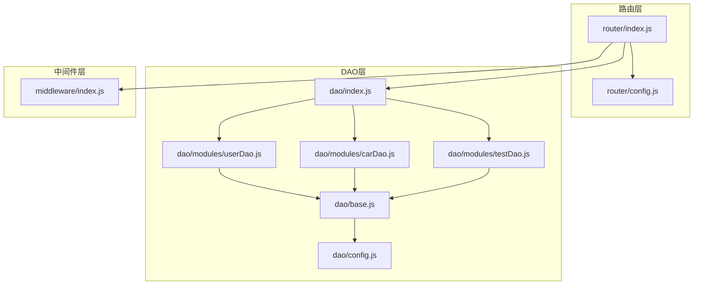
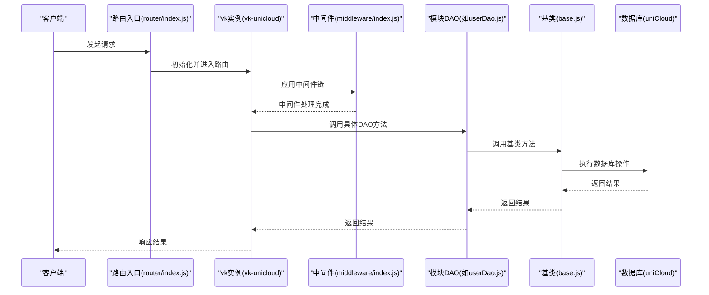
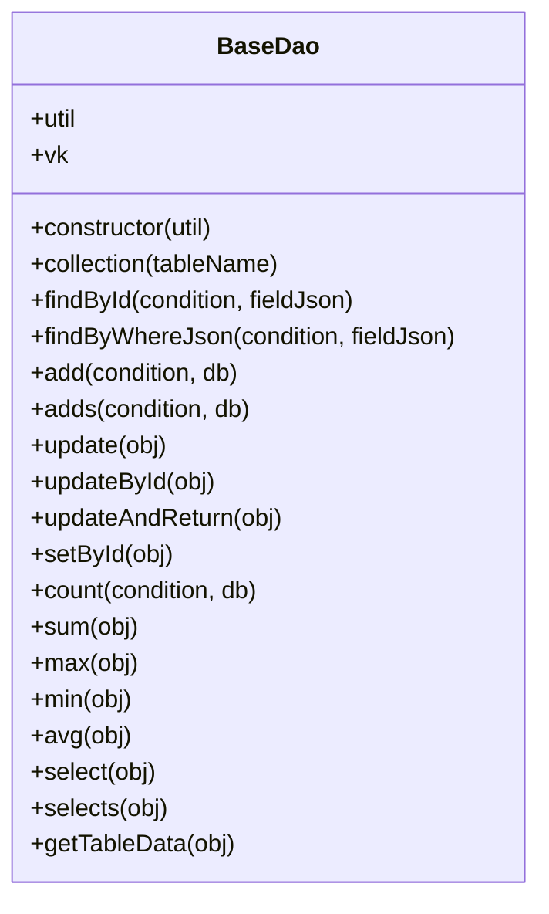
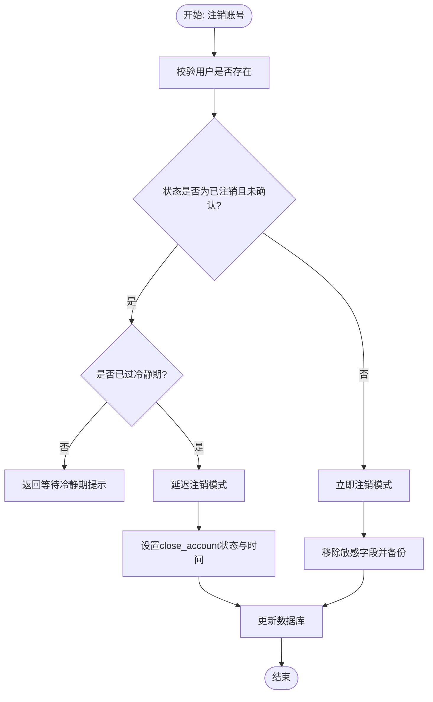
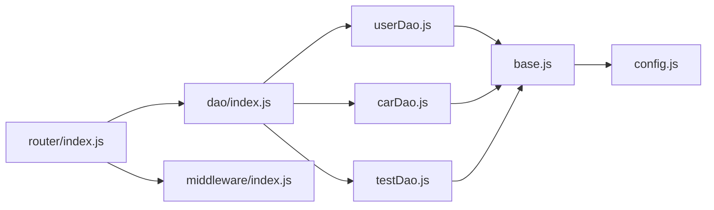

# DAO数据访问层

<cite>
**本文档引用的文件**
- [base.js](file://uniCloud-aliyun/cloudfunctions/router/dao/base.js)
- [config.js](file://uniCloud-aliyun/cloudfunctions/router/dao/config.js)
- [index.js](file://uniCloud-aliyun/cloudfunctions/router/dao/index.js)
- [userDao.js](file://uniCloud-aliyun/cloudfunctions/router/dao/modules/userDao.js)
- [carDao.js](file://uniCloud-aliyun/cloudfunctions/router/dao/modules/carDao.js)
- [testDao.js](file://uniCloud-aliyun/cloudfunctions/router/dao/modules/testDao.js)
- [middleware/index.js](file://uniCloud-aliyun/cloudfunctions/router/middleware/index.js)
- [router/index.js](file://uniCloud-aliyun/cloudfunctions/router/index.js)
- [router/config.js](file://uniCloud-aliyun/cloudfunctions/router/config.js)
</cite>

## 目录
1. [简介](#简介)
2. [项目结构](#项目结构)
3. [核心组件](#核心组件)
4. [架构总览](#架构总览)
5. [详细组件分析](#详细组件分析)
6. [依赖关系分析](#依赖关系分析)
7. [性能考量](#性能考量)
8. [故障排查指南](#故障排查指南)
9. [结论](#结论)
10. [附录](#附录)

## 简介
本文件为DAO数据访问层的全面设计文档，聚焦于基于 vk-unicloud 的云开发架构下的DAO层设计与实现。内容涵盖：
- DAO基类与模块化组织
- 数据模型映射与查询能力
- 数据库连接与事务支持
- 查询优化策略与扩展机制
- 数据安全、访问控制与一致性保障
- 复杂业务逻辑的数据处理方案

## 项目结构
DAO层位于云函数路由模块之下，采用“基类 + 模块化DAO + 配置”的分层组织方式：
- 基类：提供通用CRUD、聚合查询、联表查询、事务支持等能力
- 模块DAO：按业务表划分，继承基类并绑定具体表名
- 配置：集中管理数据库表名常量
- 自动装载：通过index.js动态加载模块DAO
- 中间件：提供登录校验、错误拦截、加解密等横切能力
- 路由入口：通过vk-unicloud统一入口接入云函数

**图表来源**
- [router/index.js:1-8](file://uniCloud-aliyun/cloudfunctions/router/index.js#L1-L8)
- [router/config.js:1-9](file://uniCloud-aliyun/cloudfunctions/router/config.js#L1-L9)
- [dao/index.js:1-36](file://uniCloud-aliyun/cloudfunctions/router/dao/index.js#L1-L36)
- [base.js:1-697](file://uniCloud-aliyun/cloudfunctions/router/dao/base.js#L1-L697)
- [config.js:1-67](file://uniCloud-aliyun/cloudfunctions/router/dao/config.js#L1-L67)
- [userDao.js:1-568](file://uniCloud-aliyun/cloudfunctions/router/dao/modules/userDao.js#L1-L568)
- [carDao.js:1-19](file://uniCloud-aliyun/cloudfunctions/router/dao/modules/carDao.js#L1-L19)
- [testDao.js:1-151](file://uniCloud-aliyun/cloudfunctions/router/dao/modules/testDao.js#L1-L151)
- [middleware/index.js:1-34](file://uniCloud-aliyun/cloudfunctions/router/middleware/index.js#L1-L34)

**章节来源**
- [router/index.js:1-8](file://uniCloud-aliyun/cloudfunctions/router/index.js#L1-L8)
- [router/config.js:1-9](file://uniCloud-aliyun/cloudfunctions/router/config.js#L1-L9)
- [dao/index.js:1-36](file://uniCloud-aliyun/cloudfunctions/router/dao/index.js#L1-L36)
- [base.js:1-697](file://uniCloud-aliyun/cloudfunctions/router/dao/base.js#L1-L697)
- [config.js:1-67](file://uniCloud-aliyun/cloudfunctions/router/dao/config.js#L1-L67)
- [userDao.js:1-568](file://uniCloud-aliyun/cloudfunctions/router/dao/modules/userDao.js#L1-L568)
- [carDao.js:1-19](file://uniCloud-aliyun/cloudfunctions/router/dao/modules/carDao.js#L1-L19)
- [testDao.js:1-151](file://uniCloud-aliyun/cloudfunctions/router/dao/modules/testDao.js#L1-L151)
- [middleware/index.js:1-34](file://uniCloud-aliyun/cloudfunctions/router/middleware/index.js#L1-L34)

## 核心组件
- BaseDao（数据访问基类）
  - 封装vk.baseDao，提供统一的CRUD、聚合、联表、事务接口
  - 通过this.tableName绑定具体表，避免重复传参
  - 提供collection、findById、findByWhereJson、add/adds、del/deleteById、update/updateById/updateAndReturn/setById、count/sum/max/min/avg、select/selects/getTableData等方法
- 模块DAO（业务DAO）
  - UserDao：用户表专用，重写字段过滤、注册/登录、注销/恢复、邀请码生成等业务方法
  - CarDao：车辆信息表，提供按车牌与用户ID的查询
  - TestDao：测试表，展示标准DAO使用范式
- 配置模块（Tables）
  - 统一维护表名常量，便于跨模块引用
- 自动装载（dao/index.js）
  - 动态扫描modules目录，按约定加载所有Dao模块
- 中间件（middleware/index.js）
  - 提供登录校验、错误拦截、加解密、返回用户信息等横切能力

**章节来源**
- [base.js:11-697](file://uniCloud-aliyun/cloudfunctions/router/dao/base.js#L11-L697)
- [userDao.js:16-568](file://uniCloud-aliyun/cloudfunctions/router/dao/modules/userDao.js#L16-L568)
- [carDao.js:3-19](file://uniCloud-aliyun/cloudfunctions/router/dao/modules/carDao.js#L3-L19)
- [testDao.js:10-151](file://uniCloud-aliyun/cloudfunctions/router/dao/modules/testDao.js#L10-L151)
- [config.js:37-67](file://uniCloud-aliyun/cloudfunctions/router/dao/config.js#L37-L67)
- [dao/index.js:1-36](file://uniCloud-aliyun/cloudfunctions/router/dao/index.js#L1-L36)
- [middleware/index.js:1-34](file://uniCloud-aliyun/cloudfunctions/router/middleware/index.js#L1-L34)

## 架构总览
DAO层围绕vk-unicloud提供的vk实例展开，通过路由入口统一接入，中间件负责前置处理，DAO模块专注数据访问。

**图表来源**
- [router/index.js:5-7](file://uniCloud-aliyun/cloudfunctions/router/index.js#L5-L7)
- [middleware/index.js:14-32](file://uniCloud-aliyun/cloudfunctions/router/middleware/index.js#L14-L32)
- [userDao.js:147-167](file://uniCloud-aliyun/cloudfunctions/router/dao/modules/userDao.js#L147-L167)
- [base.js:92-109](file://uniCloud-aliyun/cloudfunctions/router/dao/base.js#L92-L109)
- [router/config.js:4-7](file://uniCloud-aliyun/cloudfunctions/router/config.js#L4-L7)

## 详细组件分析

### BaseDao 类设计
- 设计要点
  - 通过vk.baseDao封装底层能力，统一CRUD与聚合查询接口
  - 通过db.command与db.command.aggregate提供查询与聚合表达式
  - 通过collection直接获取集合引用，支持复杂场景
  - 提供事务兼容的参数结构，支持db参数透传
- 关键方法族
  - 读取：findById、findByWhereJson、select、selects、getTableData、count/sum/max/min/avg
  - 写入：add、adds、update、updateById、updateAndReturn、setById、del、deleteById
  - 高级：collection、事务参数透传
- 复杂度与性能
  - select/selects对大数据量提供分页与selectAll模式
  - 聚合查询支持多表联接、分组、树形结构、地理查询等
- 错误处理
  - 未设置tableName时抛出异常
  - 通过vk-unicloud统一错误传播

**图表来源**
- [base.js:11-697](file://uniCloud-aliyun/cloudfunctions/router/dao/base.js#L11-L697)

**章节来源**
- [base.js:11-697](file://uniCloud-aliyun/cloudfunctions/router/dao/base.js#L11-L697)

### UserDao 业务定制
- 字段安全
  - 默认屏蔽token与password字段，避免敏感信息泄露
- 业务方法
  - findByInviteCode：根据邀请码查询用户
  - add/adds：取消自动添加创建时间，使用register_date
  - findByUserInfo：支持多种字段的OR组合查询
  - listByIds：按ID数组查询用户列表
  - registerUserByMobile：短信验证码注册与登录一体化
  - resetPwd：重置密码
  - getValidInviteCode：生成唯一邀请码
  - closeAccount/openAccount：注销/恢复账号流程
- 事务与一致性
  - 通过db参数透传支持事务上下文
  - 注销/恢复通过原子更新保证状态一致性

**图表来源**
- [userDao.js:456-532](file://uniCloud-aliyun/cloudfunctions/router/dao/modules/userDao.js#L456-L532)

**章节来源**
- [userDao.js:16-568](file://uniCloud-aliyun/cloudfunctions/router/dao/modules/userDao.js#L16-L568)

### CarDao 简化示例
- 绑定表名：carInfo
- 自定义查询：按车牌（大写）与用户ID查询

**章节来源**
- [carDao.js:3-19](file://uniCloud-aliyun/cloudfunctions/router/dao/modules/carDao.js#L3-L19)

### TestDao 模板示例
- 展示标准DAO使用方式与可扩展点
- 可在此基础上添加自定义查询与业务逻辑

**章节来源**
- [testDao.js:10-151](file://uniCloud-aliyun/cloudfunctions/router/dao/modules/testDao.js#L10-L151)

### DAO模块自动装载
- 动态扫描modules目录，加载所有Dao模块
- 支持init回调初始化，便于注入util/db等依赖

**章节来源**
- [dao/index.js:1-36](file://uniCloud-aliyun/cloudfunctions/router/dao/index.js#L1-L36)

### 中间件与安全控制
- 登录校验、错误拦截、加解密、返回用户信息等
- 通过中间件链在DAO层之前完成鉴权与预处理

**章节来源**
- [middleware/index.js:1-34](file://uniCloud-aliyun/cloudfunctions/router/middleware/index.js#L1-L34)

## 依赖关系分析
- 模块依赖
  - UserDao/CarDao/TestDao均依赖BaseDao与Tables
  - BaseDao依赖vk.baseDao与uniCloud db命令
  - dao/index.js依赖fs动态加载模块
  - router/index.js通过vk-unicloud统一入口
- 耦合与内聚
  - DAO模块内聚于各自业务表，耦合通过BaseDao与Tables降低
  - 中间件与DAO解耦，通过路由串联
- 循环依赖
  - 未见循环依赖迹象，结构清晰

**图表来源**
- [userDao.js](file://uniCloud-aliyun/cloudfunctions/router/dao/modules/userDao.js#L3)
- [carDao.js](file://uniCloud-aliyun/cloudfunctions/router/dao/modules/carDao.js#L1)
- [testDao.js](file://uniCloud-aliyun/cloudfunctions/router/dao/modules/testDao.js#L3)
- [base.js](file://uniCloud-aliyun/cloudfunctions/router/dao/base.js#L1)
- [config.js](file://uniCloud-aliyun/cloudfunctions/router/dao/config.js#L1)
- [dao/index.js:1-36](file://uniCloud-aliyun/cloudfunctions/router/dao/index.js#L1-L36)
- [router/index.js:1-8](file://uniCloud-aliyun/cloudfunctions/router/index.js#L1-L8)
- [middleware/index.js:1-34](file://uniCloud-aliyun/cloudfunctions/router/middleware/index.js#L1-L34)

**章节来源**
- [userDao.js](file://uniCloud-aliyun/cloudfunctions/router/dao/modules/userDao.js#L3)
- [carDao.js](file://uniCloud-aliyun/cloudfunctions/router/dao/modules/carDao.js#L1)
- [testDao.js](file://uniCloud-aliyun/cloudfunctions/router/dao/modules/testDao.js#L3)
- [base.js](file://uniCloud-aliyun/cloudfunctions/router/dao/base.js#L1)
- [config.js](file://uniCloud-aliyun/cloudfunctions/router/dao/config.js#L1)
- [dao/index.js:1-36](file://uniCloud-aliyun/cloudfunctions/router/dao/index.js#L1-L36)
- [router/index.js:1-8](file://uniCloud-aliyun/cloudfunctions/router/index.js#L1-L8)
- [middleware/index.js:1-34](file://uniCloud-aliyun/cloudfunctions/router/middleware/index.js#L1-L34)

## 性能考量
- 查询模式选择
  - select适用于单表、高性能场景；selects适用于联表、聚合、树形等复杂场景
- 分页与批量
  - select对pageSize>1000自动切换selectAll模式；批量插入超过10万条默认不返回ids以提升性能
- 聚合优化
  - supports多表联接、分组、数组拆分、地理查询；慎用lastWhereJson/lastSortArr，避免全聚合后再过滤
- 字段裁剪
  - 通过fieldJson仅返回必要字段，减少网络与序列化开销
- 缓存策略
  - 建议在服务层引入缓存（如Redis）缓存热点查询结果，DAO层保持无状态
- 事务与锁
  - 对关键写入使用事务；对并发读取尽量避免长事务

[本节为通用性能指导，不直接分析具体文件]

## 故障排查指南
- 常见问题
  - 未设置tableName：调用collection时抛出异常
  - 误删风险：del必须传入whereJson，避免全表删除
  - 聚合性能：大量数据的lastWhereJson/lastSortArr可能导致性能下降
- 定位手段
  - 使用debug参数获取数据库执行耗时
  - 通过中间件链定位鉴权与参数校验阶段的问题
- 修复建议
  - 明确where条件与排序规则
  - 对大数据量采用分页或selectAll模式
  - 对敏感字段使用默认过滤策略

**章节来源**
- [base.js:62-68](file://uniCloud-aliyun/cloudfunctions/router/dao/base.js#L62-L68)
- [base.js:242-249](file://uniCloud-aliyun/cloudfunctions/router/dao/base.js#L242-L249)
- [base.js:551-558](file://uniCloud-aliyun/cloudfunctions/router/dao/base.js#L551-L558)

## 结论
DAO层通过“基类 + 模块化 + 配置 + 自动装载 + 中间件”的架构，实现了：
- 统一的数据访问抽象与强事务支持
- 面向业务的可扩展DAO模块
- 清晰的安全与一致性边界
- 可落地的性能优化路径
建议在服务层补充缓存与监控，持续完善复杂业务场景下的DAO扩展点。

[本节为总结性内容，不直接分析具体文件]

## 附录

### DAO层扩展机制
- 新增业务DAO
  - 在modules目录新增Dao文件，继承BaseDao并绑定表名
  - 如需业务定制，在子类中重写或新增方法
- 自定义查询
  - 可在DAO中使用this.collection直接调用原生集合API
  - 或通过select/selects/getTableData组合复杂条件
- 事务集成
  - 通过参数透传db对象，实现事务上下文内的读写一致性

**章节来源**
- [userDao.js:147-167](file://uniCloud-aliyun/cloudfunctions/router/dao/modules/userDao.js#L147-L167)
- [carDao.js:9-15](file://uniCloud-aliyun/cloudfunctions/router/dao/modules/carDao.js#L9-L15)
- [base.js:92-109](file://uniCloud-aliyun/cloudfunctions/router/dao/base.js#L92-L109)

### 数据安全与访问控制
- 默认字段过滤：UserDao默认屏蔽token/password
- 中间件：登录校验、错误拦截、加解密
- 事务：关键写入使用事务，避免部分更新
- 一致性：注销/恢复等流程通过原子更新保证状态一致

**章节来源**
- [userDao.js:6-9](file://uniCloud-aliyun/cloudfunctions/router/dao/modules/userDao.js#L6-L9)
- [userDao.js:456-532](file://uniCloud-aliyun/cloudfunctions/router/dao/modules/userDao.js#L456-L532)
- [middleware/index.js:1-34](file://uniCloud-aliyun/cloudfunctions/router/middleware/index.js#L1-L34)