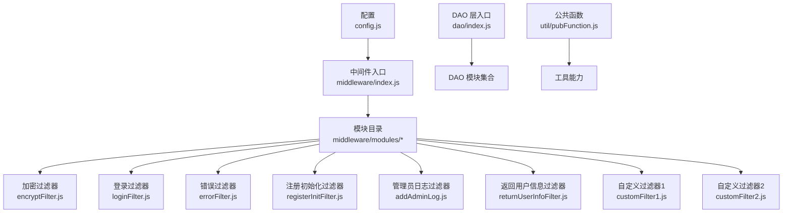
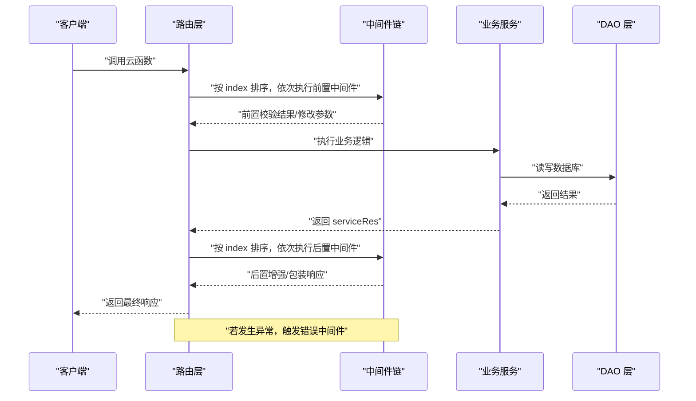
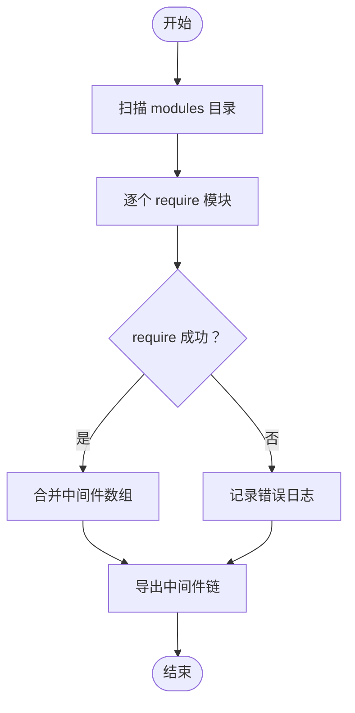
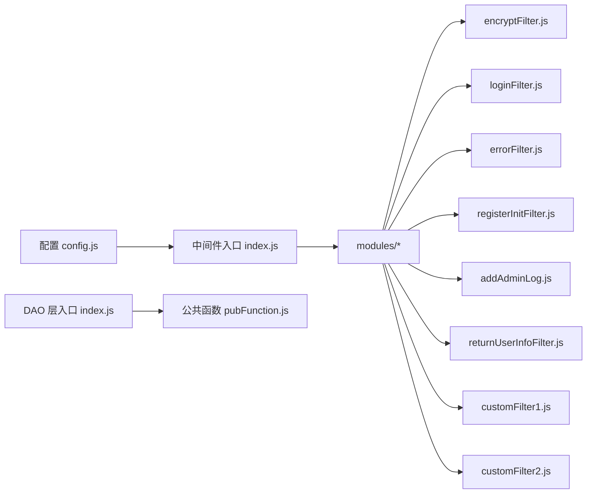

# 中间件系统

<cite>
**本文引用的文件**
- [中间件入口 index.js](file://uniCloud-aliyun/cloudfunctions/router/middleware/index.js)
- [加密过滤器 encryptFilter.js](file://uniCloud-aliyun/cloudfunctions/router/middleware/modules/encryptFilter.js)
- [登录过滤器 loginFilter.js](file://uniCloud-aliyun/cloudfunctions/router/middleware/modules/loginFilter.js)
- [错误过滤器 errorFilter.js](file://uniCloud-aliyun/cloudfunctions/router/middleware/modules/errorFilter.js)
- [注册初始化过滤器 registerInitFilter.js](file://uniCloud-aliyun/cloudfunctions/router/middleware/modules/registerInitFilter.js)
- [管理员日志过滤器 addAdminLog.js](file://uniCloud-aliyun/cloudfunctions/router/middleware/modules/addAdminLog.js)
- [返回用户信息过滤器 returnUserInfoFilter.js](file://uniCloud-aliyun/cloudfunctions/router/middleware/modules/returnUserInfoFilter.js)
- [自定义过滤器1 customFilter1.js](file://uniCloud-aliyun/cloudfunctions/router/middleware/modules/customFilter1.js)
- [自定义过滤器2 customFilter2.js](file://uniCloud-aliyun/cloudfunctions/router/middleware/modules/customFilter2.js)
- [DAO 层入口 index.js](file://uniCloud-aliyun/cloudfunctions/router/dao/index.js)
- [公共函数 pubFunction.js](file://uniCloud-aliyun/cloudfunctions/router/util/pubFunction.js)
- [配置 config.js](file://uniCloud-aliyun/cloudfunctions/router/config.js)
</cite>

## 目录
1. [简介](#简介)
2. [项目结构](#项目结构)
3. [核心组件](#核心组件)
4. [架构总览](#架构总览)
5. [详细组件分析](#详细组件分析)
6. [依赖关系分析](#依赖关系分析)
7. [性能考虑](#性能考虑)
8. [故障排查指南](#故障排查指南)
9. [结论](#结论)
10. [附录](#附录)

## 简介
本文件面向云函数中间件系统，系统性阐述中间件的执行顺序、配置方式与自定义扩展机制；全面记录内置中间件的功能边界，包括登录验证、权限检查、请求过滤、错误处理等；提供中间件开发指南、配置示例与最佳实践；并给出性能优化、异常处理与调试方法，以及如何创建自定义中间件与组合中间件链。

## 项目结构
中间件系统位于云函数路由目录下，采用“模块化 + 动态加载”的组织方式：
- 中间件入口负责扫描 modules 目录下的中间件模块，动态聚合为中间件链
- 每个中间件模块导出一个或多个中间件条目，每个条目包含匹配规则、执行时机、优先级、启用开关与主逻辑
- DAO 层与工具类提供数据访问与公共能力支撑
- 配置文件提供基础路径与加载函数

图表来源
- [中间件入口 index.js:1-34](file://uniCloud-aliyun/cloudfunctions/router/middleware/index.js#L1-L34)
- [DAO 层入口 index.js:1-36](file://uniCloud-aliyun/cloudfunctions/router/dao/index.js#L1-L36)
- [公共函数 pubFunction.js:1-24](file://uniCloud-aliyun/cloudfunctions/router/util/pubFunction.js#L1-L24)
- [配置 config.js:1-9](file://uniCloud-aliyun/cloudfunctions/router/config.js#L1-L9)

章节来源
- [中间件入口 index.js:1-34](file://uniCloud-aliyun/cloudfunctions/router/middleware/index.js#L1-L34)
- [DAO 层入口 index.js:1-36](file://uniCloud-aliyun/cloudfunctions/router/dao/index.js#L1-L36)
- [公共函数 pubFunction.js:1-24](file://uniCloud-aliyun/cloudfunctions/router/util/pubFunction.js#L1-L24)
- [配置 config.js:1-9](file://uniCloud-aliyun/cloudfunctions/router/config.js#L1-L9)

## 核心组件
- 中间件入口与聚合
  - 扫描 modules 目录，收集各模块导出的中间件数组，合并为全局中间件链
  - 提供统一导出，供路由层按序调度
- 中间件条目规范
  - id：唯一标识
  - regExp：正则匹配规则，决定命中范围
  - description：用途说明
  - index：执行优先级（数值越小越先执行）
  - mode：执行时机（前置 onActionExecuting / 后置 onActionExecuted / 错误 onActionError）
  - enable：启用开关
  - main：主逻辑函数（前置接收 event；后置接收 event 与 serviceRes；错误接收 event 与 serviceRes）
  - returnMode：后置返回值模式（0 合并，1 替换）
- 内置中间件
  - 加密过滤器：强制某些云函数使用加密通信
  - 登录过滤器：控制登录/注册相关接口的可用性
  - 错误过滤器：全局异常捕获与持久化
  - 注册初始化过滤器：注册后统一初始化用户字段
  - 管理员日志过滤器：对特定管理接口记录操作日志
  - 返回用户信息过滤器：统一返回最新用户信息与令牌包装
  - 自定义过滤器：演示前置与后置用法

章节来源
- [中间件入口 index.js:14-32](file://uniCloud-aliyun/cloudfunctions/router/middleware/index.js#L14-L32)
- [加密过滤器 encryptFilter.js:7-33](file://uniCloud-aliyun/cloudfunctions/router/middleware/modules/encryptFilter.js#L7-L33)
- [登录过滤器 loginFilter.js:27-52](file://uniCloud-aliyun/cloudfunctions/router/middleware/modules/loginFilter.js#L27-L52)
- [错误过滤器 errorFilter.js:4-59](file://uniCloud-aliyun/cloudfunctions/router/middleware/modules/errorFilter.js#L4-L59)
- [注册初始化过滤器 registerInitFilter.js:5-44](file://uniCloud-aliyun/cloudfunctions/router/middleware/modules/registerInitFilter.js#L5-L44)
- [管理员日志过滤器 addAdminLog.js:18-70](file://uniCloud-aliyun/cloudfunctions/router/middleware/modules/addAdminLog.js#L18-L70)
- [返回用户信息过滤器 returnUserInfoFilter.js:7-92](file://uniCloud-aliyun/cloudfunctions/router/middleware/modules/returnUserInfoFilter.js#L7-L92)
- [自定义过滤器1 customFilter1.js:5-23](file://uniCloud-aliyun/cloudfunctions/router/middleware/modules/customFilter1.js#L5-L23)
- [自定义过滤器2 customFilter2.js:5-21](file://uniCloud-aliyun/cloudfunctions/router/middleware/modules/customFilter2.js#L5-L21)

## 架构总览
中间件系统通过“模块化 + 动态聚合 + 有序调度”实现请求生命周期的多阶段拦截与增强。执行顺序由 index 决定，越小越先执行；执行时机分为前置、后置与错误三种；匹配规则基于正则表达式；启用开关支持按模块灵活关闭。

图表来源
- [中间件入口 index.js:28-32](file://uniCloud-aliyun/cloudfunctions/router/middleware/index.js#L28-L32)
- [错误过滤器 errorFilter.js:12-57](file://uniCloud-aliyun/cloudfunctions/router/middleware/modules/errorFilter.js#L12-L57)

## 详细组件分析

### 中间件入口与聚合
- 职责
  - 扫描 modules 目录，收集各模块导出的中间件数组
  - 将多个模块的中间件合并为单一数组，按模块名标注来源
  - 统一导出中间件链，供路由层使用
- 关键点
  - 异常捕获：模块加载失败会输出错误日志
  - 合并策略：直接拼接多个模块的中间件数组

图表来源
- [中间件入口 index.js:8-32](file://uniCloud-aliyun/cloudfunctions/router/middleware/index.js#L8-L32)

章节来源
- [中间件入口 index.js:1-34](file://uniCloud-aliyun/cloudfunctions/router/middleware/index.js#L1-L34)

### 加密过滤器（前置）
- 功能
  - 对指定前缀的云函数强制要求加密通信
  - 未使用加密通信时直接拦截并返回错误码
- 匹配与优先级
  - 正则规则限定函数前缀
  - index 建议较小，确保尽早执行
- 返回值
  - 通过：code=0
  - 拦截：返回带错误码与原因的消息

章节来源
- [加密过滤器 encryptFilter.js:7-33](file://uniCloud-aliyun/cloudfunctions/router/middleware/modules/encryptFilter.js#L7-L33)

### 登录过滤器（前置）
- 功能
  - 控制登录/注册相关接口的可用性
  - 通过预设规则表判断某登录方式是否启用
- 匹配与优先级
  - 针对用户模块的登录/注册/注销/恢复等 URL
  - index 大于 300，确保在通用登录检查之后执行
- 返回值
  - 未启用：返回错误码与提示
  - 启用：返回通过

章节来源
- [登录过滤器 loginFilter.js:27-52](file://uniCloud-aliyun/cloudfunctions/router/middleware/modules/loginFilter.js#L27-L52)

### 错误过滤器（错误）
- 功能
  - 全局异常拦截与持久化
  - 在云端运行时将错误信息去重并写入数据库
- 匹配与优先级
  - 正则匹配所有云函数
  - index 较大，确保最后执行
- 行为
  - 可选择是否入库
  - 可通过返回 serviceRes 截断后续中间件执行

章节来源
- [错误过滤器 errorFilter.js:4-59](file://uniCloud-aliyun/cloudfunctions/router/middleware/modules/errorFilter.js#L4-L59)

### 注册初始化过滤器（后置）
- 功能
  - 在用户注册成功后统一初始化字段
  - 支持根据配置移除特定字段
- 触发条件
  - serviceRes.code=0 且类型为注册且存在 uid
- 返回值
  - 更新用户信息并返回最新 userInfo

章节来源
- [注册初始化过滤器 registerInitFilter.js:5-44](file://uniCloud-aliyun/cloudfunctions/router/middleware/modules/registerInitFilter.js#L5-L44)

### 管理员日志过滤器（后置）
- 功能
  - 对指定管理接口的成功请求记录操作日志
  - 使用 try/catch 保证日志异常不影响业务
- 触发条件
  - serviceRes.code=0
- 行为
  - 从上下文提取请求 ID、客户端 IP、请求参数与响应
  - 从用户信息缓存中补充用户详情并入库

章节来源
- [管理员日志过滤器 addAdminLog.js:18-70](file://uniCloud-aliyun/cloudfunctions/router/middleware/modules/addAdminLog.js#L18-L70)

### 返回用户信息过滤器（后置）
- 功能
  - 统一返回最新用户信息与令牌包装
  - 登录场景下按配置淘汰过期令牌
  - 清理敏感字段，避免泄露
- 触发条件
  - serviceRes.code=0
- 行为
  - 优先从响应中补全 userInfo
  - 登录时按上限清理 token
  - 包装 vk_uni_token 并删除冗余字段

章节来源
- [返回用户信息过滤器 returnUserInfoFilter.js:7-92](file://uniCloud-aliyun/cloudfunctions/router/middleware/modules/returnUserInfoFilter.js#L7-L92)

### 自定义过滤器（演示）
- 自定义过滤器1（前置）
  - 演示如何通过正则拦截特定前缀的云函数
  - 返回拦截原因
- 自定义过滤器2（后置）
  - 演示后置中间件如何修改 serviceRes
  - 支持返回值合并或替换模式

章节来源
- [自定义过滤器1 customFilter1.js:5-23](file://uniCloud-aliyun/cloudfunctions/router/middleware/modules/customFilter1.js#L5-L23)
- [自定义过滤器2 customFilter2.js:5-21](file://uniCloud-aliyun/cloudfunctions/router/middleware/modules/customFilter2.js#L5-L21)

## 依赖关系分析
- 中间件入口依赖文件系统扫描模块目录，动态 require 各中间件模块
- 中间件条目依赖 util/db/_ 等上下文能力（由路由层注入）
- DAO 层提供统一的数据访问入口，供中间件与业务服务调用
- 配置文件提供基础路径与 require 函数，辅助模块加载

图表来源
- [中间件入口 index.js:1-34](file://uniCloud-aliyun/cloudfunctions/router/middleware/index.js#L1-L34)
- [DAO 层入口 index.js:1-36](file://uniCloud-aliyun/cloudfunctions/router/dao/index.js#L1-L36)
- [公共函数 pubFunction.js:1-24](file://uniCloud-aliyun/cloudfunctions/router/util/pubFunction.js#L1-L24)
- [配置 config.js:1-9](file://uniCloud-aliyun/cloudfunctions/router/config.js#L1-L9)

章节来源
- [中间件入口 index.js:1-34](file://uniCloud-aliyun/cloudfunctions/router/middleware/index.js#L1-L34)
- [DAO 层入口 index.js:1-36](file://uniCloud-aliyun/cloudfunctions/router/dao/index.js#L1-L36)
- [公共函数 pubFunction.js:1-24](file://uniCloud-aliyun/cloudfunctions/router/util/pubFunction.js#L1-L24)
- [配置 config.js:1-9](file://uniCloud-aliyun/cloudfunctions/router/config.js#L1-L9)

## 性能考虑
- 优先级与短路
  - 将高成本或高频拦截前置（如加密过滤器），尽早失败减少后续开销
  - 合理设置 index，避免不必要的后置处理
- 正则匹配
  - 使用精确前缀或具体路径正则，减少模糊匹配带来的计算负担
- 异常处理
  - 错误中间件应尽量轻量，避免二次 IO；必要时异步落库
- 数据访问
  - DAO 层统一入口，避免重复初始化；在中间件中按需查询，避免全表扫描
- 令牌与用户信息
  - 登录场景下按上限清理 token，降低存储膨胀与查询压力

## 故障排查指南
- 模块加载异常
  - 现象：控制台输出模块加载错误日志
  - 排查：检查模块文件是否存在语法错误、依赖缺失或路径不正确
- 中间件未生效
  - 现象：规则未命中或未按预期执行
  - 排查：确认 regExp 是否与目标 URL 匹配；检查 index 顺序是否影响执行；确认 enable 是否为 true
- 响应未按预期增强
  - 现象：后置中间件未修改 serviceRes 或返回值模式不符合预期
  - 排查：检查 returnMode（0 合并/1 替换）；确认触发条件（如注册成功、登录成功）是否满足
- 错误未入库
  - 现象：异常未记录到数据库
  - 排查：确认云端运行环境变量；检查入库开关与去重逻辑；确认数据库表存在且字段一致

章节来源
- [中间件入口 index.js:21-25](file://uniCloud-aliyun/cloudfunctions/router/middleware/index.js#L21-L25)
- [错误过滤器 errorFilter.js:31-53](file://uniCloud-aliyun/cloudfunctions/router/middleware/modules/errorFilter.js#L31-L53)

## 结论
该中间件系统通过模块化与动态聚合实现了高扩展性的请求生命周期拦截与增强。内置中间件覆盖了加密、登录、错误、初始化、日志与用户信息返回等关键场景。通过合理的优先级、匹配规则与启用开关，开发者可以快速构建稳定、可维护的中间件链，并结合 DAO 与工具类实现复杂业务需求。

## 附录

### 中间件开发指南
- 新建中间件模块
  - 在 modules 目录下新建文件，导出一个或多个中间件条目
  - 明确 id、regExp、description、index、mode、enable、main 等字段
- 设计执行时机
  - 前置：用于参数校验、鉴权、限流
  - 后置：用于响应增强、日志、缓存更新
  - 错误：用于异常统一处理与持久化
- 正则匹配建议
  - 使用精确前缀或具体路径，避免过度宽泛导致性能问题
- 返回值与短路
  - 前置返回非 0 即可短路后续执行
  - 后置可通过 returnMode 控制合并或替换
- 启用与禁用
  - 通过 enable 开关快速关闭中间件，便于灰度与排障

### 配置示例与最佳实践
- 加密过滤器
  - 将需要强制加密的函数前缀加入正则规则
  - 将 index 设为较小值，确保尽早拦截
- 登录过滤器
  - 在规则表中按需禁用特定登录方式
  - 将 index 设为大于 300，避免与通用登录检查冲突
- 错误过滤器
  - 在云端运行时开启入库，本地开发可关闭
  - 如需截断后续中间件，可在 main 中返回 serviceRes
- 注册初始化过滤器
  - 在注册成功后统一初始化字段，避免分散处理
- 管理员日志过滤器
  - 仅对关键管理接口启用，避免日志风暴
- 返回用户信息过滤器
  - 登录场景按上限清理 token，防止令牌过多
  - 清理敏感字段，避免前端缓存敏感信息

### 中间件链组合使用
- 顺序原则
  - 前置：加密 -> 登录 -> 其他校验
  - 后置：日志 -> 初始化 -> 用户信息包装
  - 错误：全局错误处理置于末尾
- 组合策略
  - 将高优先级、低耦合的中间件前置，降低后续处理成本
  - 将强依赖的中间件后置，确保前置已准备就绪
  - 使用 enable 开关实现按需组合与灰度发布