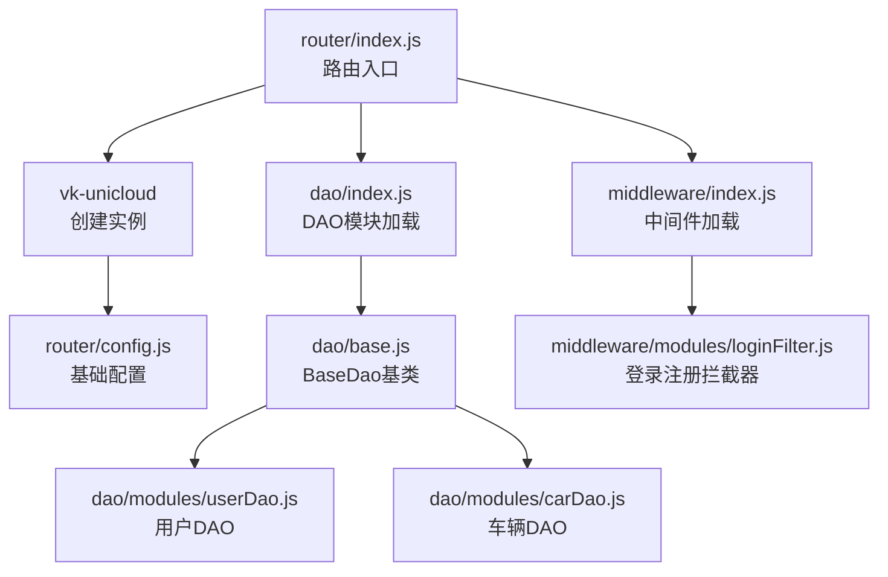
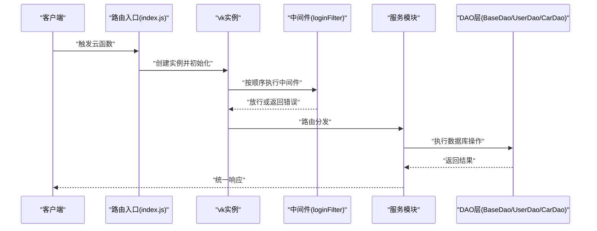
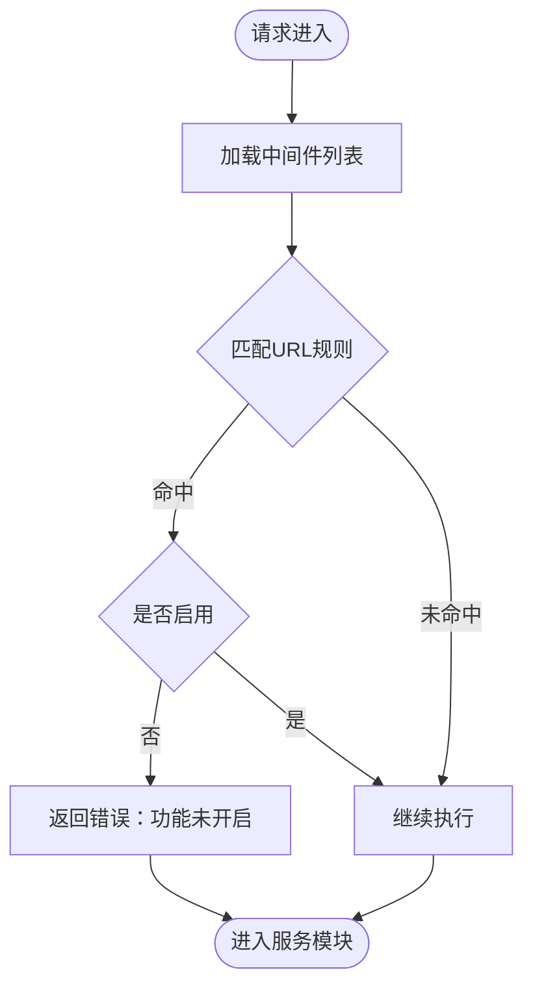
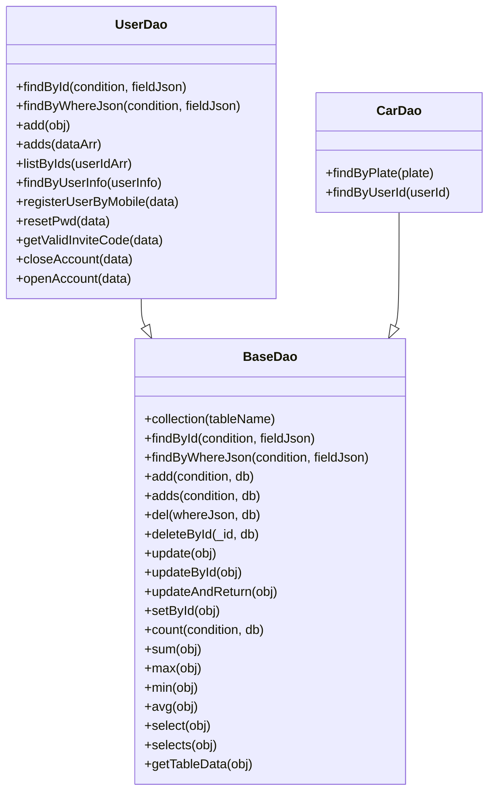
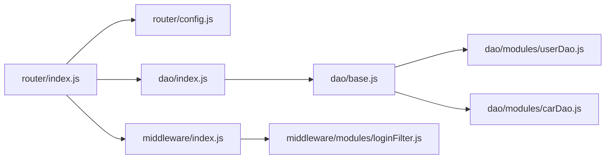

# 云函数API

<cite>
**本文档引用的文件**
- [router/index.js](file://uniCloud-aliyun/cloudfunctions/router/index.js)
- [router/config.js](file://uniCloud-aliyun/cloudfunctions/router/config.js)
- [router/dao/index.js](file://uniCloud-aliyun/cloudfunctions/router/dao/index.js)
- [router/dao/base.js](file://uniCloud-aliyun/cloudfunctions/router/dao/base.js)
- [router/dao/modules/userDao.js](file://uniCloud-aliyun/cloudfunctions/router/dao/modules/userDao.js)
- [router/dao/modules/carDao.js](file://uniCloud-aliyun/cloudfunctions/router/dao/modules/carDao.js)
- [router/middleware/index.js](file://uniCloud-aliyun/cloudfunctions/router/middleware/index.js)
- [router/middleware/modules/loginFilter.js](file://uniCloud-aliyun/cloudfunctions/router/middleware/modules/loginFilter.js)
</cite>

## 目录
1. [简介](#简介)
2. [项目结构](#项目结构)
3. [核心组件](#核心组件)
4. [架构总览](#架构总览)
5. [详细组件分析](#详细组件分析)
6. [依赖关系分析](#依赖关系分析)
7. [性能考虑](#性能考虑)
8. [故障排查指南](#故障排查指南)
9. [结论](#结论)
10. [附录](#附录)

## 简介
本文件为“挪车助手”项目的云函数API接口文档，聚焦于基于 vk-unicloud 路由框架的云函数体系，涵盖用户相关接口、车辆管理接口、联系功能接口、系统配置接口等。文档从架构设计、中间件机制、权限控制、数据访问层（DAO）到部署配置、性能优化与调试方法进行系统化说明，并提供接口分类、参数校验与错误处理策略，帮助开发者快速理解与集成。

## 项目结构
云函数采用“路由入口 + DAO层 + 中间件”的分层组织方式：
- 路由入口：负责接收事件、创建 vk 实例并交由路由框架处理
- DAO层：对 uniCloud 数据库进行统一封装，提供 CRUD、聚合、联表查询、事务支持等能力
- 中间件：统一拦截请求，实现登录注册规则控制、错误过滤、返回信息过滤等

图表来源
- [router/index.js:1-8](file://uniCloud-aliyun/cloudfunctions/router/index.js#L1-L8)
- [router/config.js:1-9](file://uniCloud-aliyun/cloudfunctions/router/config.js#L1-L9)
- [router/dao/index.js:1-36](file://uniCloud-aliyun/cloudfunctions/router/dao/index.js#L1-L36)
- [router/dao/base.js:1-697](file://uniCloud-aliyun/cloudfunctions/router/dao/base.js#L1-L697)
- [router/dao/modules/userDao.js:1-568](file://uniCloud-aliyun/cloudfunctions/router/dao/modules/userDao.js#L1-L568)
- [router/dao/modules/carDao.js:1-19](file://uniCloud-aliyun/cloudfunctions/router/dao/modules/carDao.js#L1-L19)
- [router/middleware/index.js:1-34](file://uniCloud-aliyun/cloudfunctions/router/middleware/index.js#L1-L34)
- [router/middleware/modules/loginFilter.js:1-53](file://uniCloud-aliyun/cloudfunctions/router/middleware/modules/loginFilter.js#L1-L53)

章节来源
- [router/index.js:1-8](file://uniCloud-aliyun/cloudfunctions/router/index.js#L1-L8)
- [router/config.js:1-9](file://uniCloud-aliyun/cloudfunctions/router/config.js#L1-L9)
- [router/dao/index.js:1-36](file://uniCloud-aliyun/cloudfunctions/router/dao/index.js#L1-L36)
- [router/middleware/index.js:1-34](file://uniCloud-aliyun/cloudfunctions/router/middleware/index.js#L1-L34)

## 核心组件
- 路由入口与实例创建
  - 通过 vk-unicloud 创建 vk 实例，注入配置后交由路由框架处理请求
- DAO层
  - BaseDao 提供统一的 CRUD、聚合、联表查询、事务支持
  - UserDao、CarDao 等具体表的 DAO，继承 BaseDao 并绑定对应表名
- 中间件
  - middleware/index.js 动态加载 modules 下的中间件
  - loginFilter 控制登录/注册方式的启用与拦截

章节来源
- [router/index.js:1-8](file://uniCloud-aliyun/cloudfunctions/router/index.js#L1-L8)
- [router/dao/base.js:1-697](file://uniCloud-aliyun/cloudfunctions/router/dao/base.js#L1-L697)
- [router/dao/modules/userDao.js:1-568](file://uniCloud-aliyun/cloudfunctions/router/dao/modules/userDao.js#L1-L568)
- [router/dao/modules/carDao.js:1-19](file://uniCloud-aliyun/cloudfunctions/router/dao/modules/carDao.js#L1-L19)
- [router/middleware/index.js:1-34](file://uniCloud-aliyun/cloudfunctions/router/middleware/index.js#L1-L34)
- [router/middleware/modules/loginFilter.js:1-53](file://uniCloud-aliyun/cloudfunctions/router/middleware/modules/loginFilter.js#L1-L53)

## 架构总览
云函数请求处理流程如下：
- 客户端/小程序/前端调用云函数
- 路由入口接收事件，创建 vk 实例
- 中间件按顺序执行（如登录注册拦截）
- 路由根据请求路径定位服务模块
- 服务模块调用 DAO 层完成数据库操作
- 返回统一格式的结果

图表来源
- [router/index.js:1-8](file://uniCloud-aliyun/cloudfunctions/router/index.js#L1-L8)
- [router/middleware/modules/loginFilter.js:1-53](file://uniCloud-aliyun/cloudfunctions/router/middleware/modules/loginFilter.js#L1-L53)
- [router/dao/base.js:1-697](file://uniCloud-aliyun/cloudfunctions/router/dao/base.js#L1-L697)
- [router/dao/modules/userDao.js:1-568](file://uniCloud-aliyun/cloudfunctions/router/dao/modules/userDao.js#L1-L568)
- [router/dao/modules/carDao.js:1-19](file://uniCloud-aliyun/cloudfunctions/router/dao/modules/carDao.js#L1-L19)

## 详细组件分析

### 路由与中间件机制
- 路由入口
  - 通过 vk-unicloud 创建实例并调用路由框架
- 中间件加载
  - middleware/index.js 动态扫描 modules 目录，收集中间件并扁平化为列表
- 登录注册拦截器
  - loginFilter 定义可启用/禁用的登录/注册方式，按 URL 规则匹配并返回拦截结果

图表来源
- [router/middleware/index.js:1-34](file://uniCloud-aliyun/cloudfunctions/router/middleware/index.js#L1-L34)
- [router/middleware/modules/loginFilter.js:1-53](file://uniCloud-aliyun/cloudfunctions/router/middleware/modules/loginFilter.js#L1-L53)

章节来源
- [router/index.js:1-8](file://uniCloud-aliyun/cloudfunctions/router/index.js#L1-L8)
- [router/middleware/index.js:1-34](file://uniCloud-aliyun/cloudfunctions/router/middleware/index.js#L1-L34)
- [router/middleware/modules/loginFilter.js:1-53](file://uniCloud-aliyun/cloudfunctions/router/middleware/modules/loginFilter.js#L1-L53)

### 数据访问层（DAO）
- BaseDao
  - 统一封装 CRUD、聚合、联表查询、事务支持
  - 提供 findById、findByWhereJson、add、adds、del、deleteById、update、updateById、count、sum、max、min、avg、select、selects、getTableData 等方法
  - 支持简易/完整两种调用模式，完整模式支持事务 db 对象注入
- UserDao
  - 绑定用户表，提供 findById、findByWhereJson、add、adds、listByIds、findByUserInfo、registerUserByMobile、resetPwd、getValidInviteCode、closeAccount、openAccount 等业务方法
  - 默认字段过滤：不返回 token 与 password
- CarDao
  - 绑定车辆表，提供 findByPlate、findByUserId 等查询方法

图表来源
- [router/dao/base.js:1-697](file://uniCloud-aliyun/cloudfunctions/router/dao/base.js#L1-L697)
- [router/dao/modules/userDao.js:1-568](file://uniCloud-aliyun/cloudfunctions/router/dao/modules/userDao.js#L1-L568)
- [router/dao/modules/carDao.js:1-19](file://uniCloud-aliyun/cloudfunctions/router/dao/modules/carDao.js#L1-L19)

章节来源
- [router/dao/base.js:1-697](file://uniCloud-aliyun/cloudfunctions/router/dao/base.js#L1-L697)
- [router/dao/modules/userDao.js:1-568](file://uniCloud-aliyun/cloudfunctions/router/dao/modules/userDao.js#L1-L568)
- [router/dao/modules/carDao.js:1-19](file://uniCloud-aliyun/cloudfunctions/router/dao/modules/carDao.js#L1-L19)

### 用户相关接口（按功能模块）
- 用户信息查询
  - 方法：findById、findByWhereJson、listByIds、findByUserInfo
  - 字段过滤：默认不返回 token 与 password
- 用户注册与登录
  - registerUserByMobile：手机号验证码登录/注册一体化
  - resetPwd：重置密码
- 邀请码与注销
  - getValidInviteCode：生成唯一邀请码
  - closeAccount：注销账号（支持延迟注销与冷静期）
  - openAccount：恢复账号（仅未确认注销时）

参数与返回要点（示例性说明）
- registerUserByMobile
  - 输入：mobile、password（可选）、inviteCode（可选）、myInviteCode（可选）、needPermission（可选）
  - 输出：包含 uid、token、userInfo 等
- closeAccount
  - 输入：uid、delay（秒）、reason（可选）
  - 输出：code、msg、destroyed（或 close_account 冷静期信息）
- openAccount
  - 输入：uid
  - 输出：code、msg

章节来源
- [router/dao/modules/userDao.js:1-568](file://uniCloud-aliyun/cloudfunctions/router/dao/modules/userDao.js#L1-L568)

### 车辆管理接口（按功能模块）
- 车辆信息查询
  - findByPlate：按车牌查询
  - findByUserId：按用户ID查询

参数与返回要点（示例性说明）
- findByPlate
  - 输入：plate（大小写统一处理）
  - 输出：单条车辆记录
- findByUserId
  - 输入：userId
  - 输出：该用户的车辆记录

章节来源
- [router/dao/modules/carDao.js:1-19](file://uniCloud-aliyun/cloudfunctions/router/dao/modules/carDao.js#L1-L19)

### 联系功能接口（按功能模块）
- 通过 UserDao 提供的 findByUserInfo，可按多种维度（如 _id、username、mobile、email、各平台 openid/unionid、my_invite_code）查询用户信息，便于联系与协作场景

参数与返回要点（示例性说明）
- findByUserInfo
  - 输入：userInfo（任选上述字段）
  - 输出：单条用户记录（默认不返回 token 与 password）

章节来源
- [router/dao/modules/userDao.js:1-568](file://uniCloud-aliyun/cloudfunctions/router/dao/modules/userDao.js#L1-L568)

### 系统配置接口（按功能模块）
- 登录注册方式控制
  - loginFilter 中的 loginRules 定义了各登录/注册方式的启用状态与 URL 映射
  - 通过 enable 字段可全局开关某项功能

参数与返回要点（示例性说明）
- loginRules
  - 字段：type、url、enable、title
  - 返回：命中且 disable 时返回错误提示

章节来源
- [router/middleware/modules/loginFilter.js:1-53](file://uniCloud-aliyun/cloudfunctions/router/middleware/modules/loginFilter.js#L1-L53)

## 依赖关系分析
- 路由入口依赖 vk-unicloud 与 router/config.js
- DAO层依赖 uniCloud 数据库与 vk.baseDao
- 中间件动态加载，按模块目录结构组织
- 服务模块通过 vk.daoCenter 访问 DAO

图表来源
- [router/index.js:1-8](file://uniCloud-aliyun/cloudfunctions/router/index.js#L1-L8)
- [router/config.js:1-9](file://uniCloud-aliyun/cloudfunctions/router/config.js#L1-L9)
- [router/dao/index.js:1-36](file://uniCloud-aliyun/cloudfunctions/router/dao/index.js#L1-L36)
- [router/dao/base.js:1-697](file://uniCloud-aliyun/cloudfunctions/router/dao/base.js#L1-L697)
- [router/dao/modules/userDao.js:1-568](file://uniCloud-aliyun/cloudfunctions/router/dao/modules/userDao.js#L1-L568)
- [router/dao/modules/carDao.js:1-19](file://uniCloud-aliyun/cloudfunctions/router/dao/modules/carDao.js#L1-L19)
- [router/middleware/index.js:1-34](file://uniCloud-aliyun/cloudfunctions/router/middleware/index.js#L1-L34)
- [router/middleware/modules/loginFilter.js:1-53](file://uniCloud-aliyun/cloudfunctions/router/middleware/modules/loginFilter.js#L1-L53)

章节来源
- [router/index.js:1-8](file://uniCloud-aliyun/cloudfunctions/router/index.js#L1-L8)
- [router/dao/index.js:1-36](file://uniCloud-aliyun/cloudfunctions/router/dao/index.js#L1-L36)
- [router/middleware/index.js:1-34](file://uniCloud-aliyun/cloudfunctions/router/middleware/index.js#L1-L34)

## 性能考虑
- 查询性能
  - BaseDao 的 select 支持 pageSize > 1000 时自动切换为分批查询模式
  - selects 支持联表、分组、树形结构等高级查询，注意在 getCount=false 时可能影响性能
- 字段控制
  - UserDao 默认字段过滤减少敏感信息传输，同时降低网络开销
- 批量操作
  - adds 默认自动添加时间戳，超过一定规模时可避免返回大量 ids 以提升性能
- 调试与监控
  - BaseDao 提供 debug 模式返回数据库执行耗时，便于定位慢查询

章节来源
- [router/dao/base.js:1-697](file://uniCloud-aliyun/cloudfunctions/router/dao/base.js#L1-L697)
- [router/dao/modules/userDao.js:1-568](file://uniCloud-aliyun/cloudfunctions/router/dao/modules/userDao.js#L1-L568)

## 故障排查指南
- 中间件拦截
  - loginFilter 命中 URL 但未启用时会直接返回错误，需检查 loginRules 的 enable 状态
- DAO异常
  - dao/index.js 在加载模块时捕获异常并打印错误日志，便于定位模块加载问题
- 常见错误场景
  - 注销冷静期内重复提交：closeAccount 会返回冷静期剩余时间
  - 已注销账号无法恢复：openAccount 会提示无法恢复
  - DAO未设置 tableName：collection 会抛出异常

章节来源
- [router/middleware/modules/loginFilter.js:1-53](file://uniCloud-aliyun/cloudfunctions/router/middleware/modules/loginFilter.js#L1-L53)
- [router/dao/index.js:1-36](file://uniCloud-aliyun/cloudfunctions/router/dao/index.js#L1-L36)
- [router/dao/base.js:1-697](file://uniCloud-aliyun/cloudfunctions/router/dao/base.js#L1-L697)
- [router/dao/modules/userDao.js:1-568](file://uniCloud-aliyun/cloudfunctions/router/dao/modules/userDao.js#L1-L568)

## 结论
本云函数API以 vk-unicloud 为基础，结合统一的 DAO 层与中间件机制，提供了清晰的用户与车辆管理能力，并通过中间件实现登录注册方式的灵活控制。DAO 层提供丰富的查询与聚合能力，配合字段过滤与分页策略，兼顾安全与性能。建议在生产环境中结合中间件规则与 DAO 的 debug 模式进行持续优化与监控。

## 附录
- 部署配置
  - 路由入口与配置：参考 router/index.js 与 router/config.js
  - DAO模块加载：参考 dao/index.js
  - 中间件加载：参考 middleware/index.js
- 调试方法
  - 开启 BaseDao 的 debug 模式查看数据库执行耗时
  - 检查中间件日志与异常捕获
  - 使用 DAO 的默认字段过滤与分页参数进行压测与验证

章节来源
- [router/index.js:1-8](file://uniCloud-aliyun/cloudfunctions/router/index.js#L1-L8)
- [router/config.js:1-9](file://uniCloud-aliyun/cloudfunctions/router/config.js#L1-L9)
- [router/dao/index.js:1-36](file://uniCloud-aliyun/cloudfunctions/router/dao/index.js#L1-L36)
- [router/middleware/index.js:1-34](file://uniCloud-aliyun/cloudfunctions/router/middleware/index.js#L1-L34)
- [router/dao/base.js:1-697](file://uniCloud-aliyun/cloudfunctions/router/dao/base.js#L1-L697)