# 插件服务API

<cite>
**本文引用的文件**
- [router/index.js](file://uniCloud-aliyun/cloudfunctions/router/index.js)
- [router/config.js](file://uniCloud-aliyun/cloudfunctions/router/config.js)
- [plugs/插件.md](file://uniCloud-aliyun/cloudfunctions/router/service/plugs/插件.md)
- [template/云函数示例模板.md](file://uniCloud-aliyun/cloudfunctions/router/service/template/云函数示例模板.md)
- [dao/index.js](file://uniCloud-aliyun/cloudfunctions/router/dao/index.js)
- [middleware/index.js](file://uniCloud-aliyun/cloudfunctions/router/middleware/index.js)
- [database/vk-lucky-draw-activity.schema.json](file://uniCloud-aliyun/database/vk-lucky-draw-activity.schema.json)
- [database/vk-components-dynamic.schema.json](file://uniCloud-aliyun/database/vk-components-dynamic.schema.json)
- [database/opendb-app-list.schema.json](file://uniCloud-aliyun/database/opendb-app-list.schema.json)
- [database/opendb-app-versions.schema.json](file://uniCloud-aliyun/database/opendb-app-versions.schema.json)
- [database/uni-id-permissions.schema.json](file://uniCloud-aliyun/database/uni-id-permissions.schema.json)
- [database/uni-id-roles.schema.json](file://uniCloud-aliyun/database/uni-id-roles.schema.json)
- [database/uni-id-users.schema.json](file://uniCloud-aliyun/database/uni-id-users.schema.json)
- [database/vk-error-log.schema.json](file://uniCloud-aliyun/database/vk-error-log.schema.json)
- [database/vk-global-data.schema.json](file://uniCloud-aliyun/database/vk-global-data.schema.json)
- [database/vk-pay-orders.schema.json](file://uniCloud-aliyun/database/vk-pay-orders.schema.json)
- [database/vk-files.schema.json](file://uniCloud-aliyun/database/vk-files.schema.json)
- [database/vk-ws-connection.schema.json](file://uniCloud-aliyun/database/vk-ws-connection.schema.json)
</cite>

## 目录
1. [简介](#简介)
2. [项目结构](#项目结构)
3. [核心组件](#核心组件)
4. [架构总览](#架构总览)
5. [详细组件分析](#详细组件分析)
6. [依赖关系分析](#依赖关系分析)
7. [性能考虑](#性能考虑)
8. [故障排查指南](#故障排查指南)
9. [结论](#结论)
10. [附录](#附录)

## 简介
本文件面向插件服务API，聚焦于可扩展插件功能的云函数接口，覆盖幸运抽奖、动态组件、第三方插件等场景。文档从系统架构、组件职责、数据模型、接口流程与依赖关系等方面进行系统化梳理，并提供插件开发规范、接口约定与集成指南，帮助开发者快速接入与扩展插件能力。

## 项目结构
插件服务位于 uniCloud-aliyun 的 router 云函数体系中，采用 vk-unicloud 框架作为统一入口，通过路由分发到 service 层具体业务模块。插件相关能力主要分布在 plugs 目录（插件逻辑）、service/admin/system/app（应用与版本管理）、以及数据库 schema 定义中。

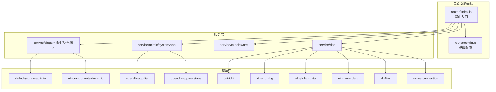

图表来源
- [router/index.js:1-8](file://uniCloud-aliyun/cloudfunctions/router/index.js#L1-L8)
- [router/config.js:1-9](file://uniCloud-aliyun/cloudfunctions/router/config.js#L1-L9)
- [plugs/插件.md:1-18](file://uniCloud-aliyun/cloudfunctions/router/service/plugs/插件.md#L1-L18)

章节来源
- [router/index.js:1-8](file://uniCloud-aliyun/cloudfunctions/router/index.js#L1-L8)
- [router/config.js:1-9](file://uniCloud-aliyun/cloudfunctions/router/config.js#L1-L9)
- [plugs/插件.md:1-18](file://uniCloud-aliyun/cloudfunctions/router/service/plugs/插件.md#L1-L18)

## 核心组件
- 路由入口与实例化
  - 通过 vk-unicloud 创建 vk 实例，统一处理 event/context 并交由路由分发器处理请求。
- 配置中心
  - 提供 baseDir 与 requireFn，确保服务层按约定加载。
- 插件目录结构
  - plugs 下按插件维度划分 admin/client 两端逻辑，便于插件独立开发与维护。
- DAO 层与中间件
  - DAO 提供数据访问抽象；中间件负责鉴权、日志、过滤等横切关注点。
- 数据模型
  - 幸运抽奖、动态组件、应用与版本、用户权限、全局数据、支付订单、文件、错误日志、WebSocket 连接等 schema 定义支撑插件数据管理。

章节来源
- [router/index.js:1-8](file://uniCloud-aliyun/cloudfunctions/router/index.js#L1-L8)
- [router/config.js:1-9](file://uniCloud-aliyun/cloudfunctions/router/config.js#L1-L9)
- [plugs/插件.md:1-18](file://uniCloud-aliyun/cloudfunctions/router/service/plugs/插件.md#L1-L18)
- [dao/index.js](file://uniCloud-aliyun/cloudfunctions/router/dao/index.js)
- [middleware/index.js](file://uniCloud-aliyun/cloudfunctions/router/middleware/index.js)

## 架构总览
插件服务采用“路由入口 -> 服务层 -> DAO/中间件 -> 数据库”的分层架构。插件逻辑以模块化方式组织，支持 admin 端后台管理与 client 端业务调用。

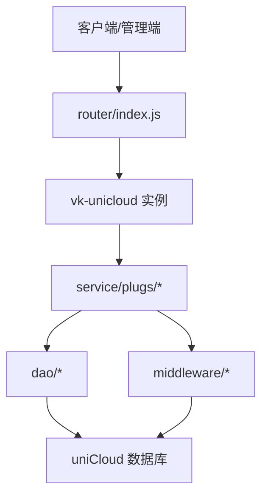

图表来源
- [router/index.js:1-8](file://uniCloud-aliyun/cloudfunctions/router/index.js#L1-L8)
- [dao/index.js](file://uniCloud-aliyun/cloudfunctions/router/dao/index.js)
- [middleware/index.js](file://uniCloud-aliyun/cloudfunctions/router/middleware/index.js)

## 详细组件分析

### 路由与实例化
- 入口文件负责创建 vk 实例并交由路由分发器处理请求事件。
- 配置文件提供基础路径与模块加载策略，保证服务层按约定解析。

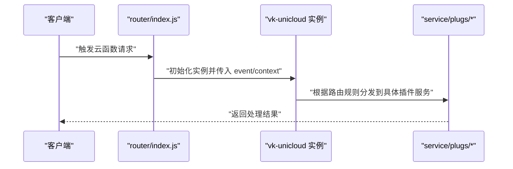

图表来源
- [router/index.js:1-8](file://uniCloud-aliyun/cloudfunctions/router/index.js#L1-L8)
- [router/config.js:1-9](file://uniCloud-aliyun/cloudfunctions/router/config.js#L1-L9)

章节来源
- [router/index.js:1-8](file://uniCloud-aliyun/cloudfunctions/router/index.js#L1-L8)
- [router/config.js:1-9](file://uniCloud-aliyun/cloudfunctions/router/config.js#L1-L9)

### 插件目录与组织
- plugs 目录用于存放各插件的 admin/client 两端实现，便于插件独立开发与部署。
- 插件开发建议遵循 admin 与 client 分离、接口幂等、参数校验、错误码规范等原则。

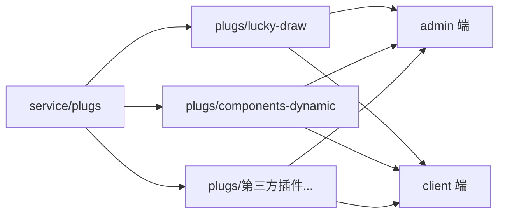

图表来源
- [plugs/插件.md:1-18](file://uniCloud-aliyun/cloudfunctions/router/service/plugs/插件.md#L1-L18)

章节来源
- [plugs/插件.md:1-18](file://uniCloud-aliyun/cloudfunctions/router/service/plugs/插件.md#L1-L18)

### 幸运抽奖插件
- 数据模型：活动表定义了活动基本信息与状态字段，支持插件对活动的增删改查与状态变更。
- 接口建议：
  - 获取活动列表/详情
  - 创建/编辑活动
  - 启用/禁用活动
  - 参与抽奖（幂等）
  - 查询中奖记录
- 权限控制：仅管理员可创建/编辑/启停活动；普通用户可参与抽奖。

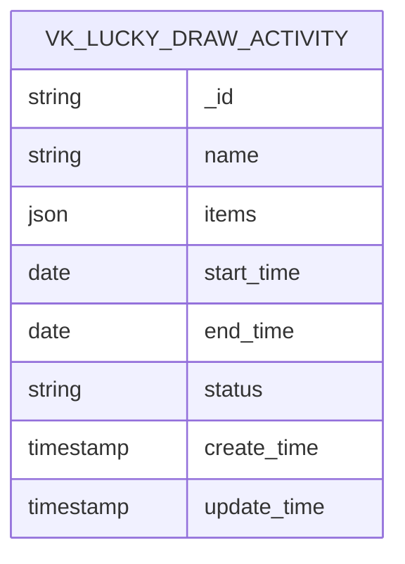

图表来源
- [database/vk-lucky-draw-activity.schema.json](file://uniCloud-aliyun/database/vk-lucky-draw-activity.schema.json)

章节来源
- [database/vk-lucky-draw-activity.schema.json](file://uniCloud-aliyun/database/vk-lucky-draw-activity.schema.json)

### 动态组件插件
- 数据模型：动态组件表用于存储组件元数据、渲染配置与状态。
- 接口建议：
  - 获取组件列表/详情
  - 新增/更新组件配置
  - 上线/下线组件
  - 渲染组件（按需拉取最新配置）
- 权限控制：仅管理员可发布/下线；前端按权限渲染。

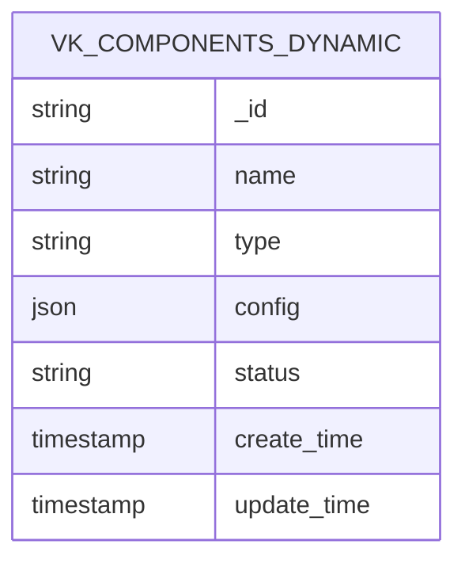

图表来源
- [database/vk-components-dynamic.schema.json](file://uniCloud-aliyun/database/vk-components-dynamic.schema.json)

章节来源
- [database/vk-components-dynamic.schema.json](file://uniCloud-aliyun/database/vk-components-dynamic.schema.json)

### 应用与版本管理
- 应用列表：记录已接入的应用信息，支持插件市场展示与版本选择。
- 版本管理：记录应用版本号、下载链接、更新日志与强制更新标记。
- 接口建议：
  - 获取应用列表
  - 获取应用详情与版本列表
  - 发布新版本
  - 设置强制更新

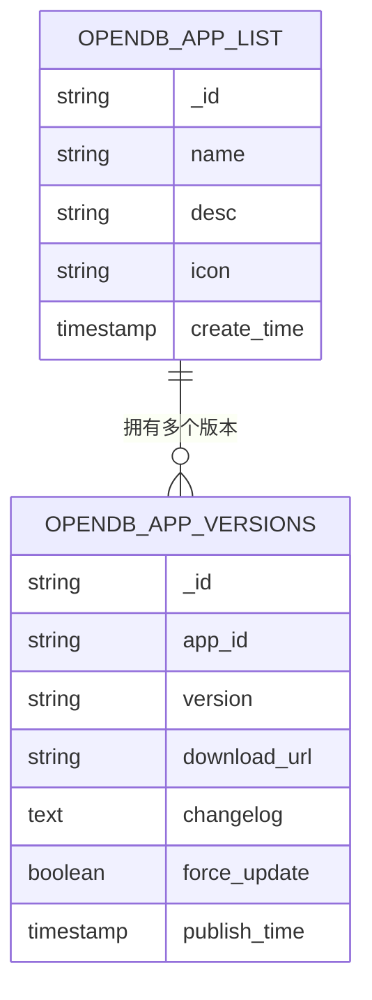

图表来源
- [database/opendb-app-list.schema.json](file://uniCloud-aliyun/database/opendb-app-list.schema.json)
- [database/opendb-app-versions.schema.json](file://uniCloud-aliyun/database/opendb-app-versions.schema.json)

章节来源
- [database/opendb-app-list.schema.json](file://uniCloud-aliyun/database/opendb-app-list.schema.json)
- [database/opendb-app-versions.schema.json](file://uniCloud-aliyun/database/opendb-app-versions.schema.json)

### 用户与权限体系
- 用户、角色、权限三张表构成权限控制基础，支持插件按用户角色与权限位进行细粒度控制。
- 接口建议：
  - 用户登录/登出
  - 角色分配与权限授权
  - 基于角色的菜单/接口访问控制

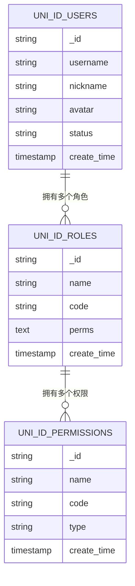

图表来源
- [database/uni-id-users.schema.json](file://uniCloud-aliyun/database/uni-id-users.schema.json)
- [database/uni-id-roles.schema.json](file://uniCloud-aliyun/database/uni-id-roles.schema.json)
- [database/uni-id-permissions.schema.json](file://uniCloud-aliyun/database/uni-id-permissions.schema.json)

章节来源
- [database/uni-id-users.schema.json](file://uniCloud-aliyun/database/uni-id-users.schema.json)
- [database/uni-id-roles.schema.json](file://uniCloud-aliyun/database/uni-id-roles.schema.json)
- [database/uni-id-permissions.schema.json](file://uniCloud-aliyun/database/uni-id-permissions.schema.json)

### 错误日志与全局数据
- 错误日志：记录插件运行异常，便于问题定位与回溯。
- 全局数据：用于插件共享配置或开关，支持跨插件读写。
- 接口建议：
  - 写入错误日志
  - 读取/更新全局数据

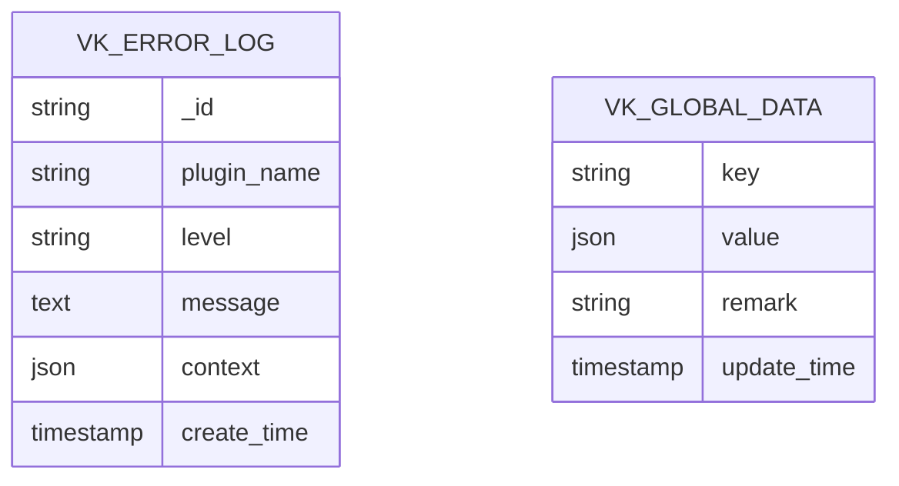

图表来源
- [database/vk-error-log.schema.json](file://uniCloud-aliyun/database/vk-error-log.schema.json)
- [database/vk-global-data.schema.json](file://uniCloud-aliyun/database/vk-global-data.schema.json)

章节来源
- [database/vk-error-log.schema.json](file://uniCloud-aliyun/database/vk-error-log.schema.json)
- [database/vk-global-data.schema.json](file://uniCloud-aliyun/database/vk-global-data.schema.json)

### 支付与文件管理
- 支付订单：记录支付流水，支持插件发起支付与回调处理。
- 文件管理：统一文件分类与存储，支持插件上传/下载与归档。
- 接口建议：
  - 创建支付订单
  - 查询订单状态
  - 上传文件/获取下载链接
  - 归档/清理历史文件

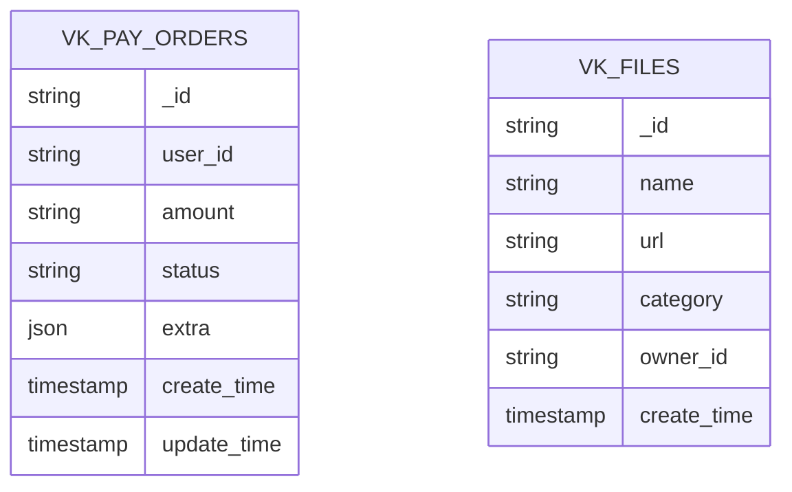

图表来源
- [database/vk-pay-orders.schema.json](file://uniCloud-aliyun/database/vk-pay-orders.schema.json)
- [database/vk-files.schema.json](file://uniCloud-aliyun/database/vk-files.schema.json)

章节来源
- [database/vk-pay-orders.schema.json](file://uniCloud-aliyun/database/vk-pay-orders.schema.json)
- [database/vk-files.schema.json](file://uniCloud-aliyun/database/vk-files.schema.json)

### WebSocket 连接与监控
- 连接状态：记录用户连接状态，支持插件推送与实时通信。
- 监控建议：
  - 记录连接/断开事件
  - 统计在线人数与活跃度
  - 异常告警与重连策略

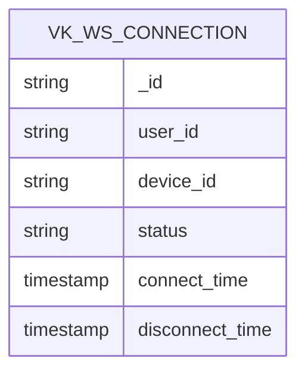

图表来源
- [database/vk-ws-connection.schema.json](file://uniCloud-aliyun/database/vk-ws-connection.schema.json)

章节来源
- [database/vk-ws-connection.schema.json](file://uniCloud-aliyun/database/vk-ws-connection.schema.json)

## 依赖关系分析
- 组件耦合
  - 路由层与服务层解耦，通过 vk-unicloud 统一分发。
  - DAO 层与中间件提供横切能力，降低服务层重复逻辑。
- 外部依赖
  - 依赖 uniCloud 数据库与 uni-id 权限体系。
  - 插件间通过全局数据与文件中心进行弱耦合协作。
- 循环依赖
  - 当前结构未见明显循环依赖迹象。

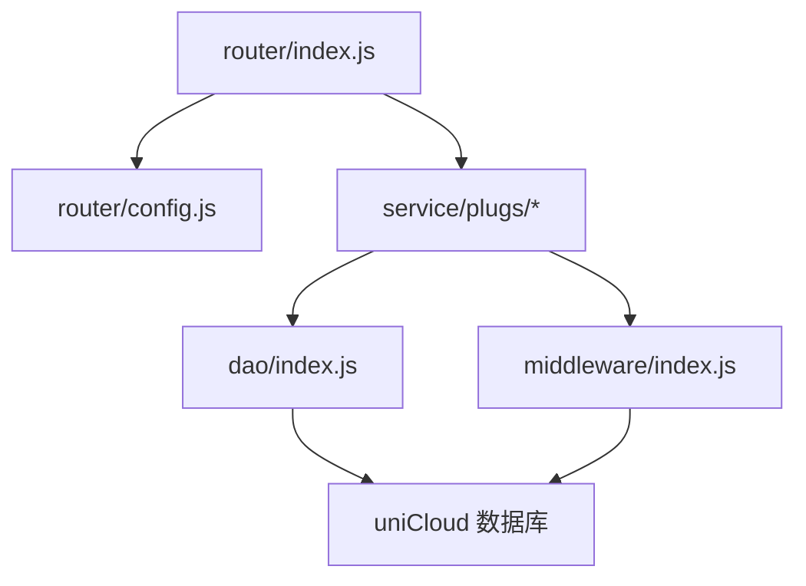

图表来源
- [router/index.js:1-8](file://uniCloud-aliyun/cloudfunctions/router/index.js#L1-L8)
- [router/config.js:1-9](file://uniCloud-aliyun/cloudfunctions/router/config.js#L1-L9)
- [dao/index.js](file://uniCloud-aliyun/cloudfunctions/router/dao/index.js)
- [middleware/index.js](file://uniCloud-aliyun/cloudfunctions/router/middleware/index.js)

章节来源
- [router/index.js:1-8](file://uniCloud-aliyun/cloudfunctions/router/index.js#L1-L8)
- [router/config.js:1-9](file://uniCloud-aliyun/cloudfunctions/router/config.js#L1-L9)
- [dao/index.js](file://uniCloud-aliyun/cloudfunctions/router/dao/index.js)
- [middleware/index.js](file://uniCloud-aliyun/cloudfunctions/router/middleware/index.js)

## 性能考虑
- 缓存策略：对高频读取的插件配置与组件元数据使用缓存，减少数据库压力。
- 分页与索引：对列表查询添加合理索引与分页，避免全表扫描。
- 并发控制：对关键操作（如抽奖）使用分布式锁或幂等设计，防止超发。
- 日志分级：区分 info/warn/error，避免过多 debug 日志影响性能。
- 中间件前置：在 DAO 层之前完成鉴权与限流，降低无效请求对数据库的压力。

## 故障排查指南
- 常见问题
  - 权限不足：检查用户角色与权限位是否匹配接口要求。
  - 参数缺失：核对必填字段与格式，参考 schema 定义。
  - 数据不一致：检查事务与幂等设计，必要时引入补偿机制。
- 日志定位
  - 使用错误日志表定位异常堆栈与上下文。
  - 结合 WebSocket 连接表排查实时通信问题。
- 回滚与恢复
  - 对重要变更保留版本记录，支持快速回滚。
  - 对支付与文件类操作保留审计轨迹。

章节来源
- [database/vk-error-log.schema.json](file://uniCloud-aliyun/database/vk-error-log.schema.json)
- [database/vk-ws-connection.schema.json](file://uniCloud-aliyun/database/vk-ws-connection.schema.json)

## 结论
插件服务基于 vk-unicloud 提供统一入口，结合 DAO 与中间件实现横切能力，配合完善的数据库 schema 支撑插件的数据管理需求。通过 admin/client 分离与权限体系，插件可在安全可控的前提下实现灵活扩展。建议在开发中严格遵循接口约定与开发规范，确保插件的稳定性与可维护性。

## 附录

### 插件开发规范与接口约定
- 目录结构
  - admin 端：后台管理接口，负责配置与运营。
  - client 端：业务接口，面向终端用户。
- 接口设计
  - 请求参数：明确必填/选填字段，提供默认值与校验规则。
  - 返回结构：统一包含状态码、消息与数据体。
  - 幂等性：对重复请求保持一致结果。
- 权限控制
  - 基于角色与权限位进行细粒度控制。
  - 对敏感操作增加二次确认或审批流程。
- 错误处理
  - 明确错误码与提示语，便于前端展示与用户理解。
  - 记录错误日志并保留上下文信息。
- 版本管理
  - 采用语义化版本，发布前进行兼容性测试。
  - 提供升级迁移脚本与降级方案。

章节来源
- [plugs/插件.md:1-18](file://uniCloud-aliyun/cloudfunctions/router/service/plugs/插件.md#L1-L18)
- [template/云函数示例模板.md](file://uniCloud-aliyun/cloudfunctions/router/service/template/云函数示例模板.md)