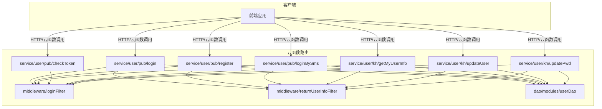
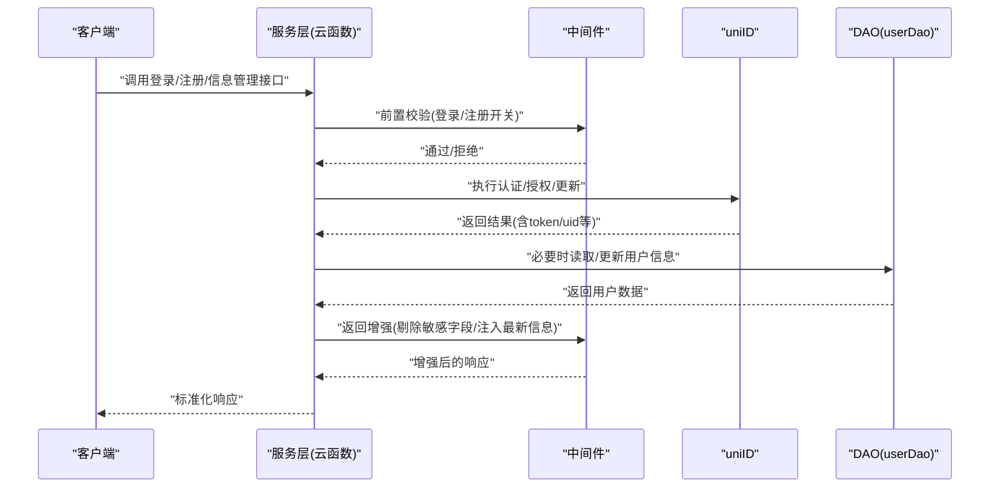
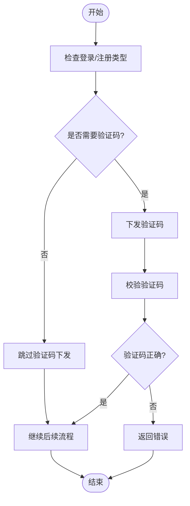
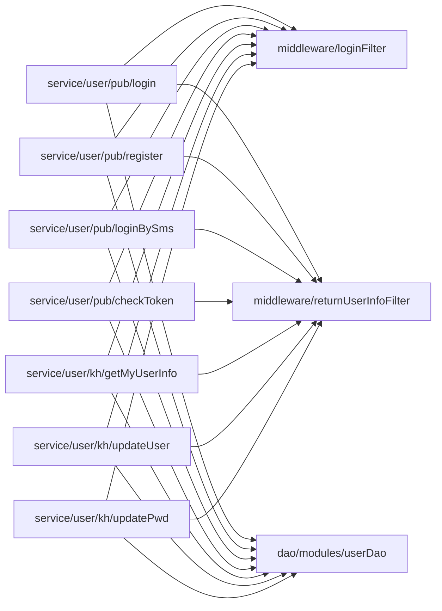

# 用户服务API

<cite>
**本文引用的文件**
- [userDao.js](file://uniCloud-aliyun/cloudfunctions/router/dao/modules/userDao.js)
- [login.js](file://uniCloud-aliyun/cloudfunctions/router/service/user/pub/login.js)
- [register.js](file://uniCloud-aliyun/cloudfunctions/router/service/user/pub/register.js)
- [loginBySms.js](file://uniCloud-aliyun/cloudfunctions/router/service/user/pub/loginBySms.js)
- [checkToken.js](file://uniCloud-aliyun/cloudfunctions/router/service/user/pub/checkToken.js)
- [getMyUserInfo.js](file://uniCloud-aliyun/cloudfunctions/router/service/user/kh/getMyUserInfo.js)
- [updateUser.js](file://uniCloud-aliyun/cloudfunctions/router/service/user/kh/updateUser.js)
- [updatePwd.js](file://uniCloud-aliyun/cloudfunctions/router/service/user/kh/updatePwd.js)
- [loginFilter.js](file://uniCloud-aliyun/cloudfunctions/router/middleware/modules/loginFilter.js)
- [returnUserInfoFilter.js](file://uniCloud-aliyun/cloudfunctions/router/middleware/modules/returnUserInfoFilter.js)
</cite>

## 目录
1. [简介](#简介)
2. [项目结构](#项目结构)
3. [核心组件](#核心组件)
4. [架构总览](#架构总览)
5. [详细组件分析](#详细组件分析)
6. [依赖关系分析](#依赖关系分析)
7. [性能考虑](#性能考虑)
8. [故障排查指南](#故障排查指南)
9. [结论](#结论)
10. [附录](#附录)

## 简介
本文件为“用户服务API”的权威接口文档，覆盖用户注册、登录、个人信息管理、账户安全、第三方登录、验证码发送等能力。文档从系统架构、组件职责、数据流、处理逻辑、权限与安全、错误码与响应规范、性能优化与故障排查等方面进行全面阐述，并提供面向开发与测试的参考路径。

## 项目结构
用户服务相关代码主要位于 uniCloud 云函数路由模块中，采用“服务层（service）+ 中间件（middleware）+ DAO（数据访问）”分层组织：
- 服务层：按功能域划分，如 user/pub（公开接口）、user/kh（客户端私有接口）
- 中间件层：登录/注册前置校验、返回用户信息增强
- DAO 层：用户表统一的数据访问封装，屏蔽底层差异

图表来源
- [login.js:1-58](file://uniCloud-aliyun/cloudfunctions/router/service/user/pub/login.js#L1-L58)
- [register.js:1-54](file://uniCloud-aliyun/cloudfunctions/router/service/user/pub/register.js#L1-L54)
- [loginBySms.js:1-66](file://uniCloud-aliyun/cloudfunctions/router/service/user/pub/loginBySms.js#L1-L66)
- [checkToken.js:1-29](file://uniCloud-aliyun/cloudfunctions/router/service/user/pub/checkToken.js#L1-L29)
- [getMyUserInfo.js:1-17](file://uniCloud-aliyun/cloudfunctions/router/service/user/kh/getMyUserInfo.js#L1-L17)
- [updateUser.js:1-33](file://uniCloud-aliyun/cloudfunctions/router/service/user/kh/updateUser.js#L1-L33)
- [updatePwd.js:1-27](file://uniCloud-aliyun/cloudfunctions/router/service/user/kh/updatePwd.js#L1-L27)
- [loginFilter.js:1-53](file://uniCloud-aliyun/cloudfunctions/router/middleware/modules/loginFilter.js#L1-L53)
- [returnUserInfoFilter.js:1-93](file://uniCloud-aliyun/cloudfunctions/router/middleware/modules/returnUserInfoFilter.js#L1-L93)
- [userDao.js:1-568](file://uniCloud-aliyun/cloudfunctions/router/dao/modules/userDao.js#L1-L568)

章节来源
- [login.js:1-58](file://uniCloud-aliyun/cloudfunctions/router/service/user/pub/login.js#L1-L58)
- [register.js:1-54](file://uniCloud-aliyun/cloudfunctions/router/service/user/pub/register.js#L1-L54)
- [loginBySms.js:1-66](file://uniCloud-aliyun/cloudfunctions/router/service/user/pub/loginBySms.js#L1-L66)
- [checkToken.js:1-29](file://uniCloud-aliyun/cloudfunctions/router/service/user/pub/checkToken.js#L1-L29)
- [getMyUserInfo.js:1-17](file://uniCloud-aliyun/cloudfunctions/router/service/user/kh/getMyUserInfo.js#L1-L17)
- [updateUser.js:1-33](file://uniCloud-aliyun/cloudfunctions/router/service/user/kh/updateUser.js#L1-L33)
- [updatePwd.js:1-27](file://uniCloud-aliyun/cloudfunctions/router/service/user/kh/updatePwd.js#L1-L27)
- [loginFilter.js:1-53](file://uniCloud-aliyun/cloudfunctions/router/middleware/modules/loginFilter.js#L1-L53)
- [returnUserInfoFilter.js:1-93](file://uniCloud-aliyun/cloudfunctions/router/middleware/modules/returnUserInfoFilter.js#L1-L93)
- [userDao.js:1-568](file://uniCloud-aliyun/cloudfunctions/router/dao/modules/userDao.js#L1-L568)

## 核心组件
- 服务层（service）
  - 公开接口：账号密码登录、账号密码注册、短信验证码登录、token校验
  - 客户端私有接口：获取我的信息、修改用户信息、修改密码
- 中间件（middleware）
  - 登录/注册前置校验：按URL白名单控制各登录/注册方式开关
  - 返回用户信息增强：统一剔除敏感字段、注入最新用户信息、自动缓存token
- DAO 层（userDao）
  - 用户表统一CRUD、默认字段过滤、邀请码生成、账号注销/恢复、手机号快捷注册等

章节来源
- [login.js:1-58](file://uniCloud-aliyun/cloudfunctions/router/service/user/pub/login.js#L1-L58)
- [register.js:1-54](file://uniCloud-aliyun/cloudfunctions/router/service/user/pub/register.js#L1-L54)
- [loginBySms.js:1-66](file://uniCloud-aliyun/cloudfunctions/router/service/user/pub/loginBySms.js#L1-L66)
- [checkToken.js:1-29](file://uniCloud-aliyun/cloudfunctions/router/service/user/pub/checkToken.js#L1-L29)
- [getMyUserInfo.js:1-17](file://uniCloud-aliyun/cloudfunctions/router/service/user/kh/getMyUserInfo.js#L1-L17)
- [updateUser.js:1-33](file://uniCloud-aliyun/cloudfunctions/router/service/user/kh/updateUser.js#L1-L33)
- [updatePwd.js:1-27](file://uniCloud-aliyun/cloudfunctions/router/service/user/kh/updatePwd.js#L1-L27)
- [loginFilter.js:1-53](file://uniCloud-aliyun/cloudfunctions/router/middleware/modules/loginFilter.js#L1-L53)
- [returnUserInfoFilter.js:1-93](file://uniCloud-aliyun/cloudfunctions/router/middleware/modules/returnUserInfoFilter.js#L1-L93)
- [userDao.js:1-568](file://uniCloud-aliyun/cloudfunctions/router/dao/modules/userDao.js#L1-L568)

## 架构总览
用户服务采用“云函数路由 + 中间件 + DAO”的分层设计，所有用户相关操作均通过服务层入口调用 uniID 能力完成认证与授权，DAO 层负责用户表的统一访问与默认字段过滤，中间件负责统一鉴权、日志与返回增强。

图表来源
- [login.js:15-56](file://uniCloud-aliyun/cloudfunctions/router/service/user/pub/login.js#L15-L56)
- [register.js:16-52](file://uniCloud-aliyun/cloudfunctions/router/service/user/pub/register.js#L16-L52)
- [loginBySms.js:19-64](file://uniCloud-aliyun/cloudfunctions/router/service/user/pub/loginBySms.js#L19-L64)
- [checkToken.js:15-27](file://uniCloud-aliyun/cloudfunctions/router/service/user/pub/checkToken.js#L15-L27)
- [getMyUserInfo.js:6-15](file://uniCloud-aliyun/cloudfunctions/router/service/user/kh/getMyUserInfo.js#L6-L15)
- [updateUser.js:14-31](file://uniCloud-aliyun/cloudfunctions/router/service/user/kh/updateUser.js#L14-L31)
- [updatePwd.js:14-25](file://uniCloud-aliyun/cloudfunctions/router/service/user/kh/updatePwd.js#L14-L25)
- [loginFilter.js:35-50](file://uniCloud-aliyun/cloudfunctions/router/middleware/modules/loginFilter.js#L35-L50)
- [returnUserInfoFilter.js:27-90](file://uniCloud-aliyun/cloudfunctions/router/middleware/modules/returnUserInfoFilter.js#L27-L90)
- [userDao.js:147-167](file://uniCloud-aliyun/cloudfunctions/router/dao/modules/userDao.js#L147-L167)

## 详细组件分析

### 1) 用户认证与会话管理
- 接口概览
  - 账号密码登录：user/pub/login
  - 账号密码注册：user/pub/register
  - 短信验证码登录：user/pub/loginBySms
  - Token 校验：user/pub/checkToken
- 关键行为
  - 登录成功后返回 token 与过期时间，中间件自动注入 vk_uni_token 并剔除原始 token 字段，便于前端统一缓存
  - 登录/注册前置校验中间件根据 URL 白名单控制各登录方式启用状态
  - 登录成功后可记录登录日志（不同登录方式）
- 安全要点
  - 默认字段过滤：返回用户信息不包含 token/password
  - token 数量上限控制：超过上限将淘汰旧 token，避免无限增长
  - 密码修改受控：部分账号可能禁止修改密码

章节来源
- [login.js:15-56](file://uniCloud-aliyun/cloudfunctions/router/service/user/pub/login.js#L15-L56)
- [register.js:16-52](file://uniCloud-aliyun/cloudfunctions/router/service/user/pub/register.js#L16-L52)
- [loginBySms.js:19-64](file://uniCloud-aliyun/cloudfunctions/router/service/user/pub/loginBySms.js#L19-L64)
- [checkToken.js:15-27](file://uniCloud-aliyun/cloudfunctions/router/service/user/pub/checkToken.js#L15-L27)
- [loginFilter.js:35-50](file://uniCloud-aliyun/cloudfunctions/router/middleware/modules/loginFilter.js#L35-L50)
- [returnUserInfoFilter.js:46-87](file://uniCloud-aliyun/cloudfunctions/router/middleware/modules/returnUserInfoFilter.js#L46-L87)
- [userDao.js:147-167](file://uniCloud-aliyun/cloudfunctions/router/dao/modules/userDao.js#L147-L167)

### 2) 个人信息管理
- 接口概览
  - 获取我的信息：user/kh/getMyUserInfo
  - 修改用户信息：user/kh/updateUser
  - 修改密码：user/kh/updatePwd
- 关键行为
  - 获取我的信息直接返回当前用户上下文中的 userInfo
  - 修改用户信息支持昵称、头像、性别、社交信息等字段
  - 修改密码需提供旧密码与新密码，支持二次确认
- 安全要点
  - 默认字段过滤：返回信息不包含 token/password
  - 部分账号禁止修改密码

章节来源
- [getMyUserInfo.js:6-15](file://uniCloud-aliyun/cloudfunctions/router/service/user/kh/getMyUserInfo.js#L6-L15)
- [updateUser.js:14-31](file://uniCloud-aliyun/cloudfunctions/router/service/user/kh/updateUser.js#L14-L31)
- [updatePwd.js:14-25](file://uniCloud-aliyun/cloudfunctions/router/service/user/kh/updatePwd.js#L14-L25)
- [returnUserInfoFilter.js:74-76](file://uniCloud-aliyun/cloudfunctions/router/middleware/modules/returnUserInfoFilter.js#L74-L76)

### 3) 账户安全与注销/恢复
- 功能点
  - 生成有效邀请码：保证7位唯一性
  - 账号注销：支持立即注销与延迟注销（冷静期）
  - 账号恢复：仅未确认注销状态下可恢复
- 关键行为
  - 注销时清理敏感字段并备份原值，记录注销状态与原因
  - 恢复时回滚到注销前状态
- 安全要点
  - 注销冷静期保护：重复申请需等待冷却到期
  - 注销确认标记：已确认注销不可恢复

章节来源
- [userDao.js:415-440](file://uniCloud-aliyun/cloudfunctions/router/dao/modules/userDao.js#L415-L440)
- [userDao.js:456-532](file://uniCloud-aliyun/cloudfunctions/router/dao/modules/userDao.js#L456-L532)
- [userDao.js:544-564](file://uniCloud-aliyun/cloudfunctions/router/dao/modules/userDao.js#L544-L564)

### 4) 第三方登录与绑定
- 支持方式（由登录前置校验中间件控制开关）
  - 微信登录、微信手机号一键登录
  - 抖音登录、抖音手机号一键登录
  - QQ 登录
  - 支付宝登录
  - 华为登录、华为手机号一键登录
  - 本机号码一键登录
  - 手机短信登录
  - 邮箱登录
  - 账号密码登录/注册
- 使用建议
  - 通过中间件配置按需启用/禁用各登录方式
  - 登录成功后统一返回最新用户信息与 token 缓存

章节来源
- [loginFilter.js:5-21](file://uniCloud-aliyun/cloudfunctions/router/middleware/modules/loginFilter.js#L5-L21)
- [login.js:32-37](file://uniCloud-aliyun/cloudfunctions/router/service/user/pub/login.js#L32-L37)
- [loginBySms.js:26-33](file://uniCloud-aliyun/cloudfunctions/router/service/user/pub/loginBySms.js#L26-L33)

### 5) 验证码发送与校验
- 说明
  - 短信验证码登录会触发验证码下发与校验流程
  - 部分登录/注册场景会自动设置临时验证码供登录使用
- 流程示意

图表来源
- [loginBySms.js:26-33](file://uniCloud-aliyun/cloudfunctions/router/service/user/pub/loginBySms.js#L26-L33)
- [userDao.js:355-382](file://uniCloud-aliyun/cloudfunctions/router/dao/modules/userDao.js#L355-L382)

## 依赖关系分析
- 组件耦合
  - 服务层依赖中间件进行前置校验与返回增强
  - 服务层通过 uniID 完成认证、授权与用户信息更新
  - DAO 层提供统一用户数据访问，屏蔽字段过滤与默认查询
- 外部依赖
  - uniID：统一身份认证与用户生命周期管理
  - 数据库：uni-id-users 等用户相关表

图表来源
- [login.js:1-58](file://uniCloud-aliyun/cloudfunctions/router/service/user/pub/login.js#L1-L58)
- [register.js:1-54](file://uniCloud-aliyun/cloudfunctions/router/service/user/pub/register.js#L1-L54)
- [loginBySms.js:1-66](file://uniCloud-aliyun/cloudfunctions/router/service/user/pub/loginBySms.js#L1-L66)
- [checkToken.js:1-29](file://uniCloud-aliyun/cloudfunctions/router/service/user/pub/checkToken.js#L1-L29)
- [getMyUserInfo.js:1-17](file://uniCloud-aliyun/cloudfunctions/router/service/user/kh/getMyUserInfo.js#L1-L17)
- [updateUser.js:1-33](file://uniCloud-aliyun/cloudfunctions/router/service/user/kh/updateUser.js#L1-L33)
- [updatePwd.js:1-27](file://uniCloud-aliyun/cloudfunctions/router/service/user/kh/updatePwd.js#L1-L27)
- [loginFilter.js:1-53](file://uniCloud-aliyun/cloudfunctions/router/middleware/modules/loginFilter.js#L1-L53)
- [returnUserInfoFilter.js:1-93](file://uniCloud-aliyun/cloudfunctions/router/middleware/modules/returnUserInfoFilter.js#L1-L93)
- [userDao.js:1-568](file://uniCloud-aliyun/cloudfunctions/router/dao/modules/userDao.js#L1-L568)

## 性能考虑
- 字段过滤与返回精简：默认不返回 token/password，减少网络传输与前端缓存压力
- token 数量上限：超过上限自动淘汰旧 token，避免无限增长导致查询/更新开销增大
- 查询优化：DAO 提供 select/selects/tableData 等高性能查询封装，建议优先使用 select 进行列表查询
- 中间件顺序：前置校验与返回增强的 index 设计确保在合适阶段介入，避免重复计算

章节来源
- [returnUserInfoFilter.js:47-70](file://uniCloud-aliyun/cloudfunctions/router/middleware/modules/returnUserInfoFilter.js#L47-L70)
- [userDao.js:88-127](file://uniCloud-aliyun/cloudfunctions/router/dao/modules/userDao.js#L88-L127)

## 故障排查指南
- 常见错误码与含义
  - code: 0 表示成功
  - 其他负值表示失败，具体错误信息在 msg 中体现
- 常见问题定位
  - 登录/注册被禁用：检查登录前置校验中间件中对应 URL 的 enable 状态
  - token 缓存异常：确认中间件是否注入 vk_uni_token 并剔除了原始 token 字段
  - 密码修改失败：确认账号是否禁止修改密码
  - 注销/恢复异常：检查用户状态与注销确认标记
- 建议排查步骤
  - 核对服务层入参与返回结构
  - 检查中间件是否正确执行
  - 核对 DAO 层默认字段过滤与查询条件

章节来源
- [loginFilter.js:40-45](file://uniCloud-aliyun/cloudfunctions/router/middleware/modules/loginFilter.js#L40-L45)
- [returnUserInfoFilter.js:77-87](file://uniCloud-aliyun/cloudfunctions/router/middleware/modules/returnUserInfoFilter.js#L77-L87)
- [updatePwd.js:19-21](file://uniCloud-aliyun/cloudfunctions/router/service/user/kh/updatePwd.js#L19-L21)
- [userDao.js:456-532](file://uniCloud-aliyun/cloudfunctions/router/dao/modules/userDao.js#L456-L532)

## 结论
本用户服务API以“云函数路由 + 中间件 + DAO”为核心架构，围绕 uniID 提供统一认证与授权能力，结合中间件实现登录/注册开关控制、token 管理与用户信息返回增强。通过 DAO 的默认字段过滤与高性能查询封装，兼顾安全性与性能。建议在生产环境中配合中间件开关策略与合理的 token 上限配置，保障系统稳定与安全。

## 附录

### A. 接口清单与说明
- 用户登录
  - 地址：user/pub/login
  - 方法：POST
  - 参数：username、password、needPermission、queryField
  - 返回：code、msg、token、tokenExpired、uid、userInfo
- 用户注册
  - 地址：user/pub/register
  - 方法：POST
  - 参数：username、password、needPermission
  - 返回：code、msg、token、tokenExpired、uid、userInfo
- 短信登录
  - 地址：user/pub/loginBySms
  - 方法：POST
  - 参数：mobile、code、type、password、inviteCode、needPermission
  - 返回：code、msg、token、tokenExpired、uid、userInfo
- Token 校验
  - 地址：user/pub/checkToken
  - 方法：POST
  - 参数：uniIdToken
  - 返回：code、msg、uid、userInfo、role、permission
- 获取我的信息
  - 地址：user/kh/getMyUserInfo
  - 方法：POST
  - 参数：无
  - 返回：code、msg、userInfo
- 修改用户信息
  - 地址：user/kh/updateUser
  - 方法：POST
  - 参数：nickname、avatar、gender、social_info
  - 返回：code、msg
- 修改密码
  - 地址：user/kh/updatePwd
  - 方法：POST
  - 参数：oldPassword、newPassword、passwordConfirmation
  - 返回：code、msg

章节来源
- [login.js:6-14](file://uniCloud-aliyun/cloudfunctions/router/service/user/pub/login.js#L6-L14)
- [register.js:6-14](file://uniCloud-aliyun/cloudfunctions/router/service/user/pub/register.js#L6-L14)
- [loginBySms.js:6-18](file://uniCloud-aliyun/cloudfunctions/router/service/user/pub/loginBySms.js#L6-L18)
- [checkToken.js:6-14](file://uniCloud-aliyun/cloudfunctions/router/service/user/pub/checkToken.js#L6-L14)
- [getMyUserInfo.js:3-5](file://uniCloud-aliyun/cloudfunctions/router/service/user/kh/getMyUserInfo.js#L3-L5)
- [updateUser.js:3-13](file://uniCloud-aliyun/cloudfunctions/router/service/user/kh/updateUser.js#L3-L13)
- [updatePwd.js:3-13](file://uniCloud-aliyun/cloudfunctions/router/service/user/kh/updatePwd.js#L3-L13)

### B. 数据模型与字段说明
- 用户信息（返回时默认剔除 token/password）
  - 关键字段：_id、username、mobile、email、nickname、avatar、gender、social_info、status、close_account 等
- token 管理
  - 通过中间件自动注入 vk_uni_token 并维护 token 数量上限
- 注销状态
  - close_account：包含 confirmed、apply_time、close_time、status、reason、backup 等字段

章节来源
- [returnUserInfoFilter.js:74-76](file://uniCloud-aliyun/cloudfunctions/router/middleware/modules/returnUserInfoFilter.js#L74-L76)
- [userDao.js:480-520](file://uniCloud-aliyun/cloudfunctions/router/dao/modules/userDao.js#L480-L520)

### C. 安全与合规建议
- 输入校验
  - 前端与服务端双重校验，用户名与密码遵循相应规则
- 传输安全
  - 建议在 HTTPS 下调用，避免明文传输
- 存储安全
  - 密码加密存储，不返回明文
  - 注销时清理敏感字段并备份
- 访问控制
  - 通过中间件控制登录/注册方式开关
  - 对私有接口（user/kh/*）确保携带有效 token

章节来源
- [register.js:27-43](file://uniCloud-aliyun/cloudfunctions/router/service/user/pub/register.js#L27-L43)
- [returnUserInfoFilter.js:74-76](file://uniCloud-aliyun/cloudfunctions/router/middleware/modules/returnUserInfoFilter.js#L74-L76)
- [userDao.js:496-519](file://uniCloud-aliyun/cloudfunctions/router/dao/modules/userDao.js#L496-L519)