# 系统服务API

<cite>
**本文引用的文件**
- [router/index.js](file://uniCloud-aliyun/cloudfunctions/router/index.js)
- [router/config.js](file://uniCloud-aliyun/cloudfunctions/router/config.js)
- [router/dao/index.js](file://uniCloud-aliyun/cloudfunctions/router/dao/index.js)
- [router/middleware/index.js](file://uniCloud-aliyun/cloudfunctions/router/middleware/index.js)
- [router/service/逻辑层目录说明.md](file://uniCloud-aliyun/cloudfunctions/router/service/逻辑层目录说明.md)
- [router/service/admin/后台PC管理端.md](file://uniCloud-aliyun/cloudfunctions/router/service/admin/后台PC管理端.md)
- [router/service/template/云函数示例模板.md](file://uniCloud-aliyun/cloudfunctions/router/service/template/云函数示例模板.md)
- [uni_modules/uni-id/readme.md](file://uni_modules/uni-id/readme.md)
- [uni_modules/uni-config-center/readme.md](file://uni_modules/uni-config-center/readme.md)
- [uni_modules/vk-unicloud/package.json](file://uni_modules/vk-unicloud/package.json)
</cite>

## 目录
1. [简介](#简介)
2. [项目结构](#项目结构)
3. [核心组件](#核心组件)
4. [架构总览](#架构总览)
5. [详细组件分析](#详细组件分析)
6. [依赖关系分析](#依赖关系分析)
7. [性能考虑](#性能考虑)
8. [故障排查指南](#故障排查指南)
9. [结论](#结论)
10. [附录](#附录)

## 简介
本文件为系统服务API的全面接口文档，聚焦于后台管理系统相关的云函数接口，覆盖菜单管理、角色权限、系统配置、日志管理等核心功能，并对管理员操作接口与系统监控接口进行说明。文档同时涵盖系统数据的增删改查、批量操作、权限控制与审计日志，以及系统配置接口、文件管理接口、定时任务接口等的完整说明；并提供系统安全机制、数据备份恢复与性能监控方案的指导。

## 项目结构
系统采用“云函数路由 + 逻辑层 + DAO层 + 中间件 + 配置”的分层架构，通过 vk-unicloud 提供统一的路由与执行环境，服务按 admin（后台）、client（客户端）、user（统一用户中心）、plugs（插件）等维度组织。

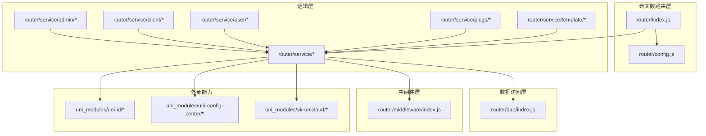

**图表来源**
- [router/index.js:1-8](file://uniCloud-aliyun/cloudfunctions/router/index.js#L1-L8)
- [router/config.js:1-9](file://uniCloud-aliyun/cloudfunctions/router/config.js#L1-L9)
- [router/dao/index.js:1-36](file://uniCloud-aliyun/cloudfunctions/router/dao/index.js#L1-L36)
- [router/service/逻辑层目录说明.md:1-40](file://uniCloud-aliyun/cloudfunctions/router/service/逻辑层目录说明.md#L1-L40)
- [router/service/admin/后台PC管理端.md:1-20](file://uniCloud-aliyun/cloudfunctions/router/service/admin/后台PC管理端.md#L1-L20)
- [uni_modules/uni-id/readme.md](file://uni_modules/uni-id/readme.md)
- [uni_modules/uni-config-center/readme.md](file://uni_modules/uni-config-center/readme.md)
- [uni_modules/vk-unicloud/package.json](file://uni_modules/vk-unicloud/package.json)

**章节来源**
- [router/index.js:1-8](file://uniCloud-aliyun/cloudfunctions/router/index.js#L1-L8)
- [router/config.js:1-9](file://uniCloud-aliyun/cloudfunctions/router/config.js#L1-L9)
- [router/dao/index.js:1-36](file://uniCloud-aliyun/cloudfunctions/router/dao/index.js#L1-L36)
- [router/service/逻辑层目录说明.md:1-40](file://uniCloud-aliyun/cloudfunctions/router/service/逻辑层目录说明.md#L1-L40)
- [router/service/admin/后台PC管理端.md:1-20](file://uniCloud-aliyun/cloudfunctions/router/service/admin/后台PC管理端.md#L1-L20)

## 核心组件
- 云函数路由入口：负责初始化 vk-unicloud 实例并通过统一路由器分发请求。
- 逻辑层：按 admin、client、user、plugs 等域划分，承载业务逻辑与接口编排。
- DAO层：动态加载模块化的数据访问对象，支持初始化与扩展。
- 中间件：提供登录校验、权限过滤、加密处理、错误拦截、返回信息封装等横切能力。
- 配置中心：集中化配置管理，支持 uni-id、支付等能力的配置注入。
- 外部能力：基于 uni-id 的统一用户体系、vk-unicloud 的云函数运行时与路由能力。

**章节来源**
- [router/index.js:1-8](file://uniCloud-aliyun/cloudfunctions/router/index.js#L1-L8)
- [router/dao/index.js:1-36](file://uniCloud-aliyun/cloudfunctions/router/dao/index.js#L1-L36)
- [router/service/逻辑层目录说明.md:1-40](file://uniCloud-aliyun/cloudfunctions/router/service/逻辑层目录说明.md#L1-L40)
- [router/service/admin/后台PC管理端.md:1-20](file://uniCloud-aliyun/cloudfunctions/router/service/admin/后台PC管理端.md#L1-L20)
- [uni_modules/uni-id/readme.md](file://uni_modules/uni-id/readme.md)
- [uni_modules/uni-config-center/readme.md](file://uni_modules/uni-config-center/readme.md)
- [uni_modules/vk-unicloud/package.json](file://uni_modules/vk-unicloud/package.json)

## 架构总览
系统通过 router/index.js 将云函数请求交由 vk-unicloud 路由器处理，结合 service 层的业务逻辑、dao 层的数据访问、middleware 层的横切处理与 config 的运行参数，形成清晰的职责边界与可扩展的接口体系。

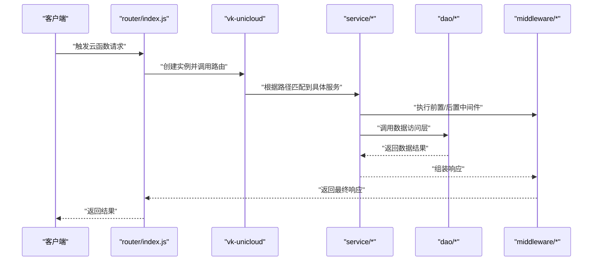

**图表来源**
- [router/index.js:1-8](file://uniCloud-aliyun/cloudfunctions/router/index.js#L1-L8)
- [router/config.js:1-9](file://uniCloud-aliyun/cloudfunctions/router/config.js#L1-L9)
- [router/dao/index.js:1-36](file://uniCloud-aliyun/cloudfunctions/router/dao/index.js#L1-L36)
- [router/middleware/index.js](file://uniCloud-aliyun/cloudfunctions/router/middleware/index.js)

## 详细组件分析

### 菜单管理接口
- 接口定位：位于 admin.system 路径下的菜单相关服务，用于后台管理端的菜单增删改查与树形结构维护。
- 关键流程：请求进入 router，经 middleware 过滤后，由 service 层菜单服务处理，DAO 层持久化，返回统一格式。
- 权限控制：需具备管理员身份与相应菜单权限方可访问。
- 批量操作：支持批量启用/禁用、批量删除、批量排序等。
- 审计日志：建议接入 addAdminLog 中间件记录管理员操作轨迹。

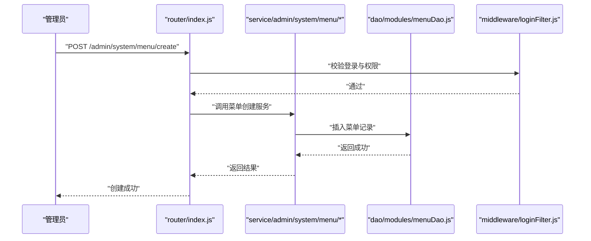

**图表来源**
- [router/index.js:1-8](file://uniCloud-aliyun/cloudfunctions/router/index.js#L1-L8)
- [router/middleware/index.js](file://uniCloud-aliyun/cloudfunctions/router/middleware/index.js)
- [router/dao/index.js:1-36](file://uniCloud-aliyun/cloudfunctions/router/dao/index.js#L1-L36)
- [router/service/admin/后台PC管理端.md:1-20](file://uniCloud-aliyun/cloudfunctions/router/service/admin/后台PC管理端.md#L1-L20)

**章节来源**
- [router/service/admin/后台PC管理端.md:1-20](file://uniCloud-aliyun/cloudfunctions/router/service/admin/后台PC管理端.md#L1-L20)
- [router/middleware/index.js](file://uniCloud-aliyun/cloudfunctions/router/middleware/index.js)
- [router/dao/index.js:1-36](file://uniCloud-aliyun/cloudfunctions/router/dao/index.js#L1-L36)

### 角色权限接口
- 接口定位：admin.system.role 与 admin.system.permission 下的角色与权限管理。
- 关键流程：角色创建/更新/删除 → 权限分配/回收 → 角色绑定用户 → 生效与缓存刷新。
- 权限控制：基于角色的 RBAC 模型，支持菜单权限与数据权限。
- 审计日志：建议通过 addAdminLog 记录角色变更与权限调整。

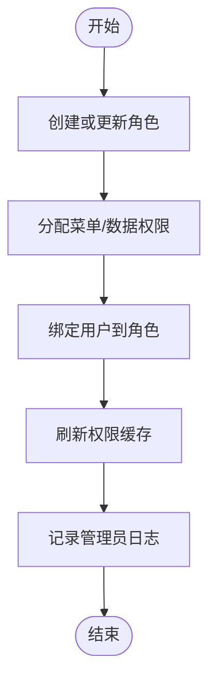

**图表来源**
- [router/service/admin/后台PC管理端.md:1-20](file://uniCloud-aliyun/cloudfunctions/router/service/admin/后台PC管理端.md#L1-L20)

**章节来源**
- [router/service/admin/后台PC管理端.md:1-20](file://uniCloud-aliyun/cloudfunctions/router/service/admin/后台PC管理端.md#L1-L20)

### 系统配置接口
- 接口定位：admin.system.app 与 system_uni 下的系统配置与全局参数管理。
- 关键流程：配置项读取/更新 → uni-config-center 注入 → 缓存/持久化 → 生效。
- 安全机制：仅管理员可修改，修改记录纳入审计日志。

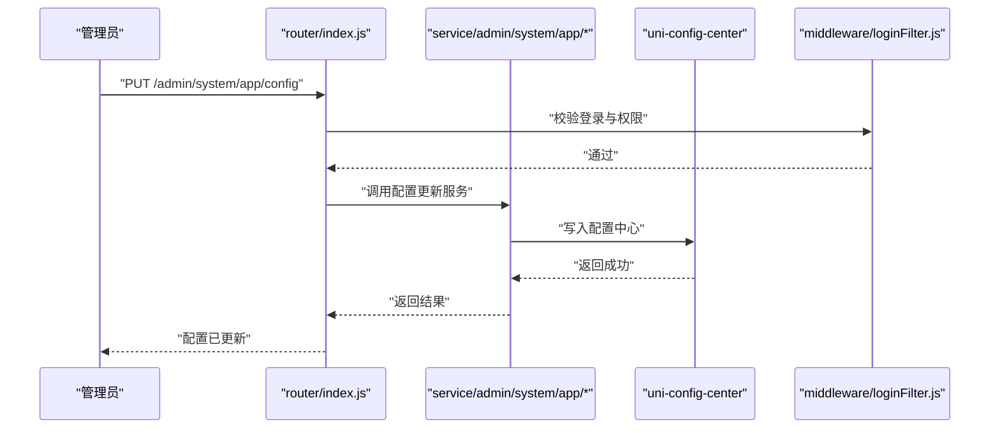

**图表来源**
- [router/index.js:1-8](file://uniCloud-aliyun/cloudfunctions/router/index.js#L1-L8)
- [router/middleware/index.js](file://uniCloud-aliyun/cloudfunctions/router/middleware/index.js)
- [uni_modules/uni-config-center/readme.md](file://uni_modules/uni-config-center/readme.md)

**章节来源**
- [router/index.js:1-8](file://uniCloud-aliyun/cloudfunctions/router/index.js#L1-L8)
- [uni_modules/uni-config-center/readme.md](file://uni_modules/uni-config-center/readme.md)

### 日志管理接口
- 接口定位：admin.system_uni.admin-log、admin.system_uni.error-log、admin.system_uni.uni-id-log 等。
- 功能范围：后台操作日志、系统错误日志、用户行为日志的查询、导出与清理。
- 审计要求：保留原始请求上下文、操作人、时间、IP、UA 等字段，支持分页与条件筛选。

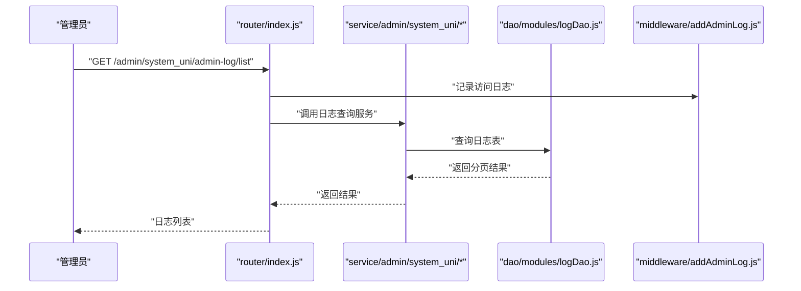

**图表来源**
- [router/index.js:1-8](file://uniCloud-aliyun/cloudfunctions/router/index.js#L1-L8)
- [router/middleware/index.js](file://uniCloud-aliyun/cloudfunctions/router/middleware/index.js)
- [router/dao/index.js:1-36](file://uniCloud-aliyun/cloudfunctions/router/dao/index.js#L1-L36)

**章节来源**
- [router/index.js:1-8](file://uniCloud-aliyun/cloudfunctions/router/index.js#L1-L8)
- [router/middleware/index.js](file://uniCloud-aliyun/cloudfunctions/router/middleware/index.js)
- [router/dao/index.js:1-36](file://uniCloud-aliyun/cloudfunctions/router/dao/index.js#L1-L36)

### 管理员操作接口
- 接口定位：admin.user 下的用户管理、角色绑定、状态变更等。
- 关键流程：用户信息维护 → 角色/权限同步 → 登录态失效与缓存更新 → 审计日志。
- 安全机制：密码加密存储、登录态校验、敏感操作二次确认。

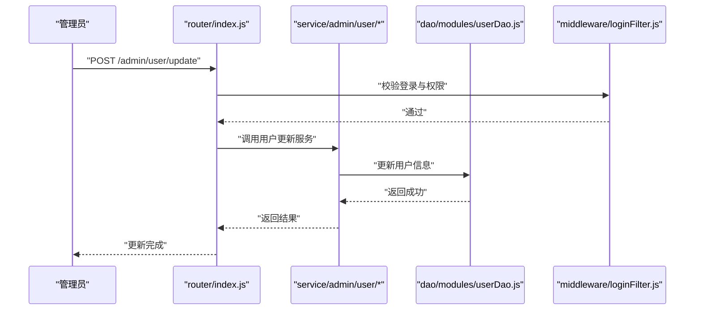

**图表来源**
- [router/index.js:1-8](file://uniCloud-aliyun/cloudfunctions/router/index.js#L1-L8)
- [router/middleware/index.js](file://uniCloud-aliyun/cloudfunctions/router/middleware/index.js)
- [router/dao/index.js:1-36](file://uniCloud-aliyun/cloudfunctions/router/dao/index.js#L1-L36)

**章节来源**
- [router/index.js:1-8](file://uniCloud-aliyun/cloudfunctions/router/index.js#L1-L8)
- [router/middleware/index.js](file://uniCloud-aliyun/cloudfunctions/router/middleware/index.js)
- [router/dao/index.js:1-36](file://uniCloud-aliyun/cloudfunctions/router/dao/index.js#L1-L36)

### 系统监控接口
- 接口定位：admin.system_uni.ws-connection、admin.system_uni.pay-orders、admin.system_uni.global-data 等。
- 功能范围：在线连接数统计、支付订单监控、全局数据指标查询。
- 性能监控：建议结合定时任务定期采集指标并落库，提供可视化看板。

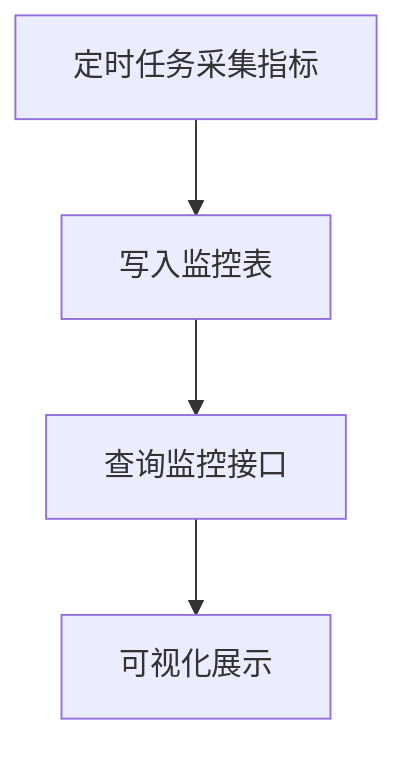

**图表来源**
- [router/service/逻辑层目录说明.md:1-40](file://uniCloud-aliyun/cloudfunctions/router/service/逻辑层目录说明.md#L1-L40)

**章节来源**
- [router/service/逻辑层目录说明.md:1-40](file://uniCloud-aliyun/cloudfunctions/router/service/逻辑层目录说明.md#L1-L40)

### 文件管理接口
- 接口定位：admin.system_uni.uni-id-files 下的文件上传、分类、删除与下载。
- 关键流程：生成上传凭证 → 上传至对象存储 → 记录元数据 → 返回访问链接。
- 安全机制：限制文件类型与大小、鉴权访问、敏感文件隔离。

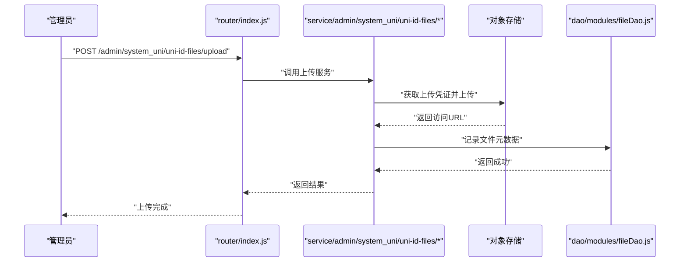

**图表来源**
- [router/index.js:1-8](file://uniCloud-aliyun/cloudfunctions/router/index.js#L1-L8)
- [router/dao/index.js:1-36](file://uniCloud-aliyun/cloudfunctions/router/dao/index.js#L1-L36)

**章节来源**
- [router/index.js:1-8](file://uniCloud-aliyun/cloudfunctions/router/index.js#L1-L8)
- [router/dao/index.js:1-36](file://uniCloud-aliyun/cloudfunctions/router/dao/index.js#L1-L36)

### 定时任务接口
- 接口定位：crontab 下的任务调度与执行。
- 关键流程：任务配置 → 定时触发 → 执行业务逻辑 → 记录执行日志 → 失败重试。
- 建议：使用独立任务队列与幂等设计，避免重复执行。

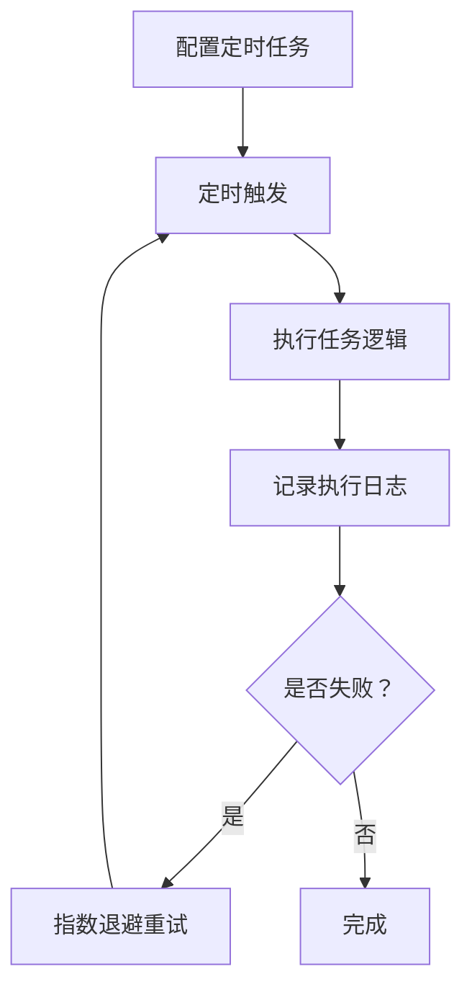

**图表来源**
- [router/service/逻辑层目录说明.md:1-40](file://uniCloud-aliyun/cloudfunctions/router/service/逻辑层目录说明.md#L1-L40)

**章节来源**
- [router/service/逻辑层目录说明.md:1-40](file://uniCloud-aliyun/cloudfunctions/router/service/逻辑层目录说明.md#L1-L40)

### 统一用户中心接口
- 接口定位：user.kh、user.pub、user.sys 下的用户登录、注册、信息维护与系统内部调用。
- 关键流程：uni-id 统一认证 → token 签发与校验 → 用户信息缓存 → 业务授权。
- 安全机制：token 加密、过期策略、防刷与风控。

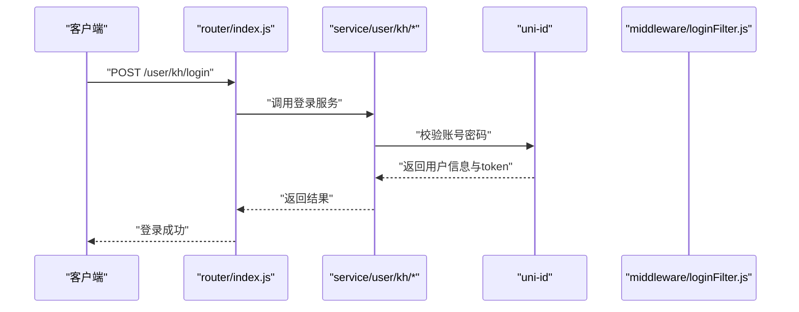

**图表来源**
- [router/index.js:1-8](file://uniCloud-aliyun/cloudfunctions/router/index.js#L1-L8)
- [uni_modules/uni-id/readme.md](file://uni_modules/uni-id/readme.md)

**章节来源**
- [router/index.js:1-8](file://uniCloud-aliyun/cloudfunctions/router/index.js#L1-L8)
- [uni_modules/uni-id/readme.md](file://uni_modules/uni-id/readme.md)

## 依赖关系分析
- 组件耦合：router 仅负责入口与路由分发，service 与 dao 解耦，middleware 提供横切能力，降低耦合度。
- 外部依赖：依赖 vk-unicloud 提供统一运行时，依赖 uni-id 提供用户体系，依赖 uni-config-center 提供配置中心。
- 可扩展性：通过 service 与 dao 的模块化设计，可快速扩展新功能域与数据模型。

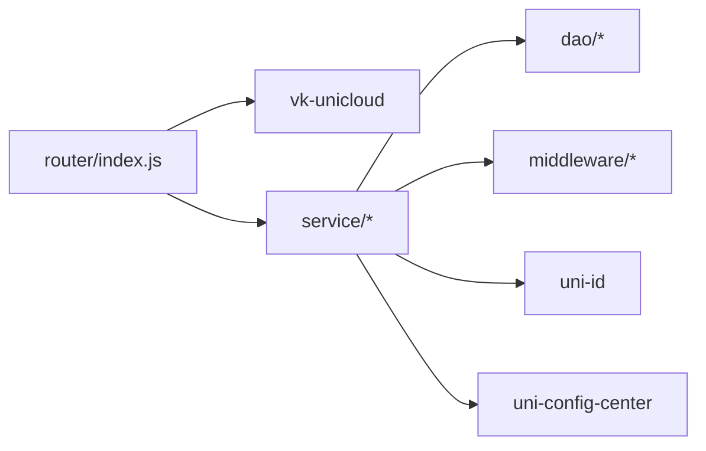

**图表来源**
- [router/index.js:1-8](file://uniCloud-aliyun/cloudfunctions/router/index.js#L1-L8)
- [uni_modules/vk-unicloud/package.json](file://uni_modules/vk-unicloud/package.json)
- [uni_modules/uni-id/readme.md](file://uni_modules/uni-id/readme.md)
- [uni_modules/uni-config-center/readme.md](file://uni_modules/uni-config-center/readme.md)

**章节来源**
- [router/index.js:1-8](file://uniCloud-aliyun/cloudfunctions/router/index.js#L1-L8)
- [uni_modules/vk-unicloud/package.json](file://uni_modules/vk-unicloud/package.json)
- [uni_modules/uni-id/readme.md](file://uni_modules/uni-id/readme.md)
- [uni_modules/uni-config-center/readme.md](file://uni_modules/uni-config-center/readme.md)

## 性能考虑
- 请求链路优化：减少不必要的中间件层级，优先在 service 层做数据聚合。
- 缓存策略：热点数据与配置类数据使用缓存，设置合理过期时间与失效策略。
- 并发控制：对高并发接口增加限流与排队机制，避免数据库抖动。
- 存储优化：大文件走对象存储，数据库仅存元数据；索引与分页查询需结合实际场景评估。
- 监控与告警：建立关键接口的 P95/P99 与错误率阈值，及时发现性能瓶颈。

## 故障排查指南
- 登录与权限问题：检查 loginFilter 与权限中间件是否正确配置，核对用户角色与菜单权限映射。
- DAO 初始化异常：检查 dao/modules 下模块命名与导出规范，确保模块名以 Dao.js 结尾。
- 配置不生效：确认 uni-config-center 的配置项是否正确写入，服务重启后是否重新加载。
- 审计日志缺失：确认 addAdminLog 中间件是否启用，数据库表结构与索引是否完善。
- 文件上传失败：检查上传凭证生成逻辑与对象存储权限，关注网络与超时配置。

**章节来源**
- [router/middleware/index.js](file://uniCloud-aliyun/cloudfunctions/router/middleware/index.js)
- [router/dao/index.js:1-36](file://uniCloud-aliyun/cloudfunctions/router/dao/index.js#L1-L36)
- [uni_modules/uni-config-center/readme.md](file://uni_modules/uni-config-center/readme.md)

## 结论
本系统通过清晰的分层架构与中间件机制，提供了可扩展、可维护的云函数接口体系。围绕菜单管理、角色权限、系统配置、日志管理等后台核心功能，配合统一用户中心与配置中心，能够满足复杂后台管理场景的需求。建议在生产环境中进一步完善监控告警、安全加固与灾备方案，持续提升系统的稳定性与安全性。

## 附录
- 云函数模板：参考 router/service/template 提供的示例，快速实现新的业务接口。
- 开发规范：遵循 service/逻辑层目录说明中的建议，保持目录结构与职责边界清晰。

**章节来源**
- [router/service/template/云函数示例模板.md:1-13](file://uniCloud-aliyun/cloudfunctions/router/service/template/云函数示例模板.md#L1-L13)
- [router/service/逻辑层目录说明.md:1-40](file://uniCloud-aliyun/cloudfunctions/router/service/逻辑层目录说明.md#L1-L40)