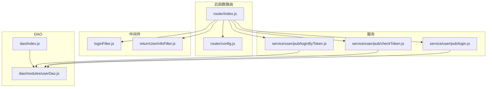
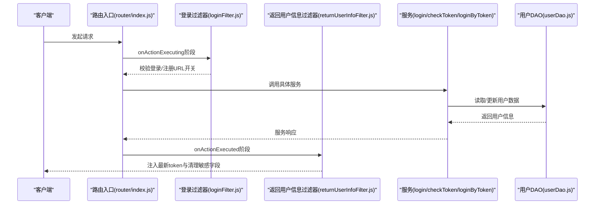
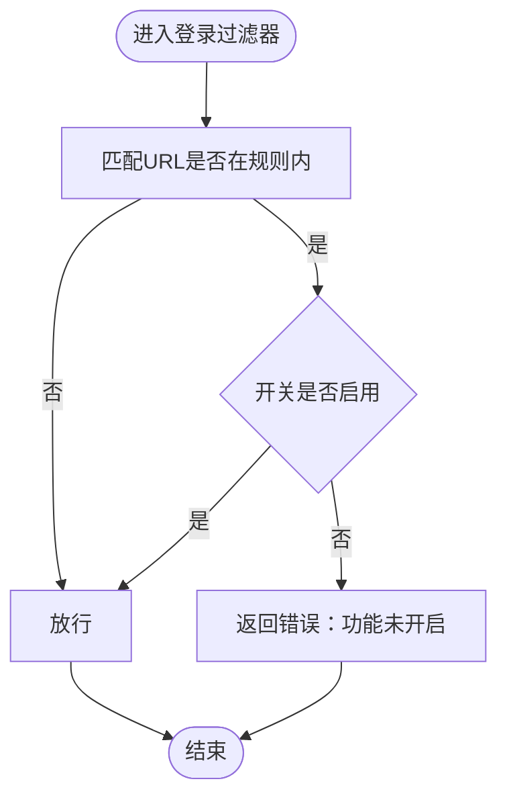
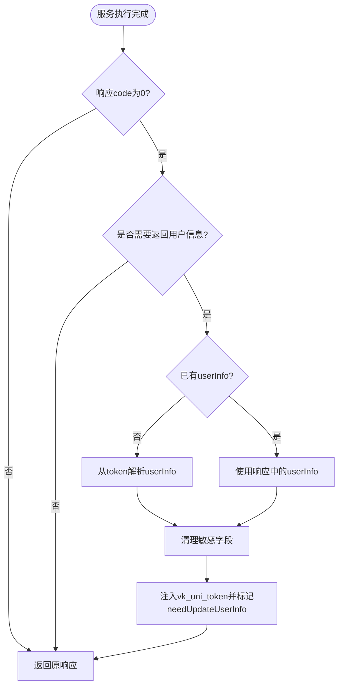
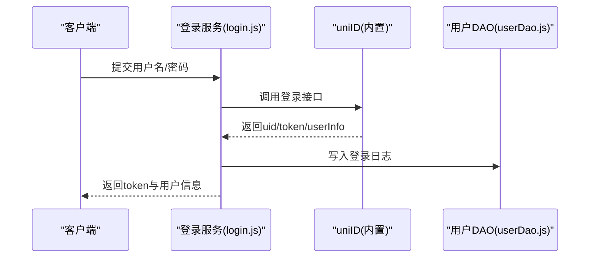
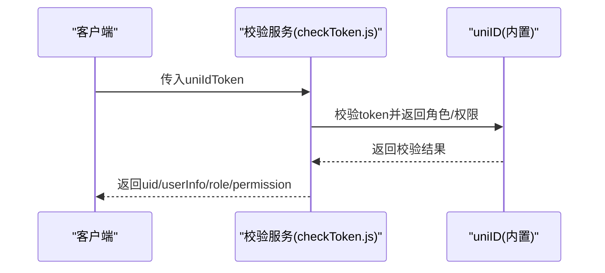
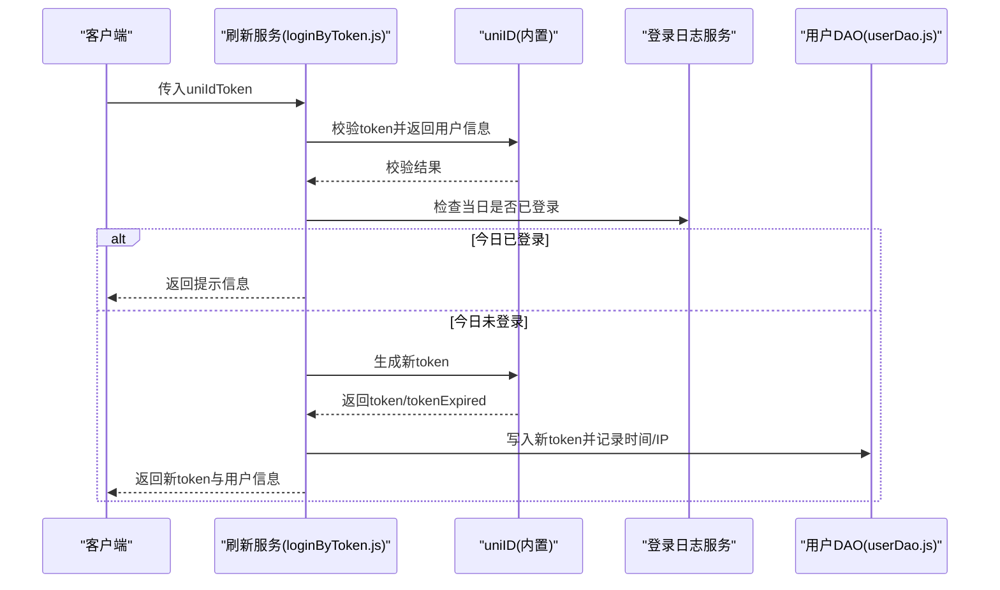
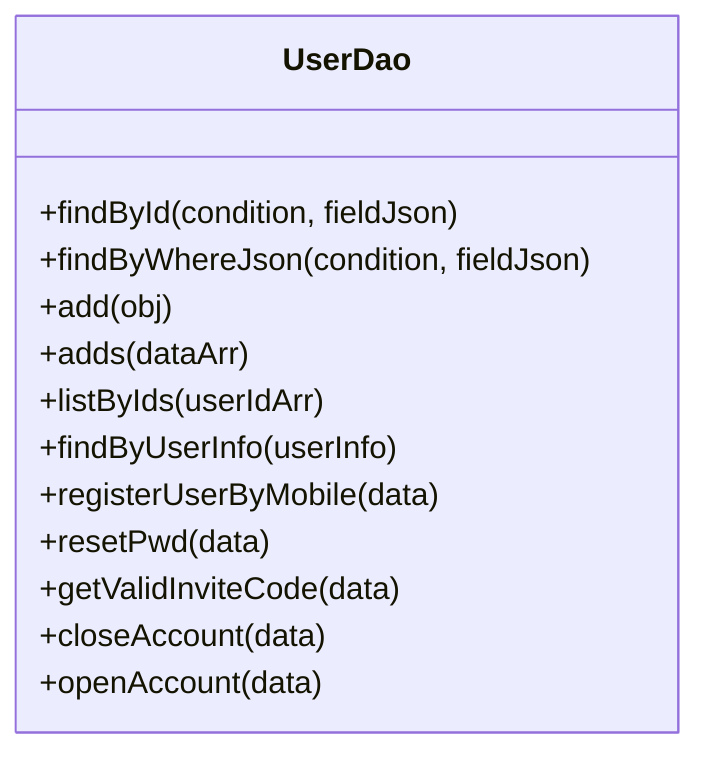
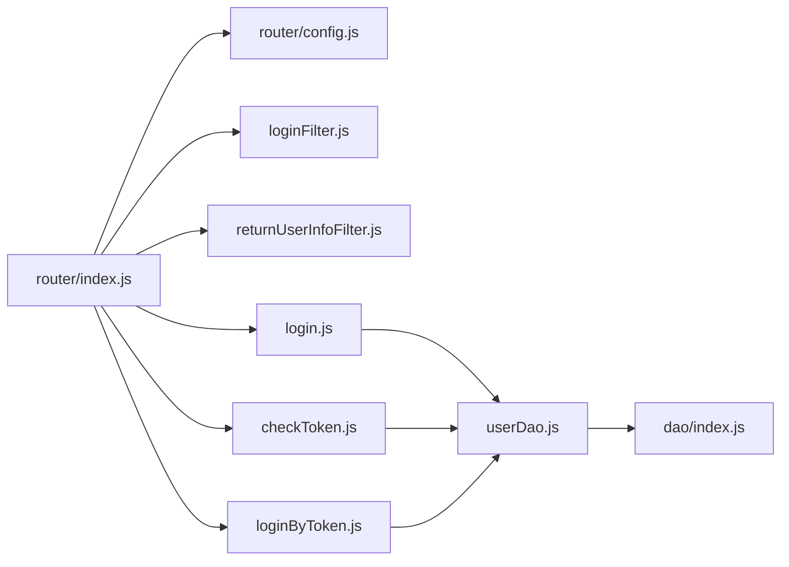

# 接口认证与权限

<cite>
**本文引用的文件**
- [router/index.js](file://uniCloud-aliyun/cloudfunctions/router/index.js)
- [router/config.js](file://uniCloud-aliyun/cloudfunctions/router/config.js)
- [router/dao/index.js](file://uniCloud-aliyun/cloudfunctions/router/dao/index.js)
- [router/dao/modules/userDao.js](file://uniCloud-aliyun/cloudfunctions/router/dao/modules/userDao.js)
- [router/middleware/modules/loginFilter.js](file://uniCloud-aliyun/cloudfunctions/router/middleware/modules/loginFilter.js)
- [router/middleware/modules/returnUserInfoFilter.js](file://uniCloud-aliyun/cloudfunctions/router/middleware/modules/returnUserInfoFilter.js)
- [router/service/user/pub/login.js](file://uniCloud-aliyun/cloudfunctions/router/service/user/pub/login.js)
- [router/service/user/pub/checkToken.js](file://uniCloud-aliyun/cloudfunctions/router/service/user/pub/checkToken.js)
- [router/service/user/pub/loginByToken.js](file://uniCloud-aliyun/cloudfunctions/router/service/user/pub/loginByToken.js)
</cite>

## 目录
1. [简介](#简介)
2. [项目结构](#项目结构)
3. [核心组件](#核心组件)
4. [架构总览](#架构总览)
5. [详细组件分析](#详细组件分析)
6. [依赖关系分析](#依赖关系分析)
7. [性能考量](#性能考量)
8. [故障排查指南](#故障排查指南)
9. [结论](#结论)
10. [附录](#附录)

## 简介
本文件系统性梳理挪车助手项目的API认证与权限控制体系，覆盖以下要点：
- 用户身份认证机制与token验证流程
- 登录过滤器与“返回用户信息”过滤器的工作原理与配置方法
- JWT风格token的生成、验证与刷新机制
- 权限分级、角色管理与访问控制的实现思路
- 认证失败的错误处理与安全防护措施
- 完整认证流程示例与最佳安全实践

## 项目结构
本项目采用“云函数路由 + 中间件 + DAO + 服务”的分层架构。认证与权限控制主要集中在：
- 路由入口与基础配置
- 中间件层：登录过滤器、返回用户信息过滤器
- 服务层：登录、token校验、token刷新等用户相关接口
- DAO层：用户数据访问与字段过滤

图表来源
- [router/index.js:1-8](file://uniCloud-aliyun/cloudfunctions/router/index.js#L1-L8)
- [router/config.js:1-9](file://uniCloud-aliyun/cloudfunctions/router/config.js#L1-L9)
- [router/middleware/modules/loginFilter.js:1-53](file://uniCloud-aliyun/cloudfunctions/router/middleware/modules/loginFilter.js#L1-L53)
- [router/middleware/modules/returnUserInfoFilter.js:1-93](file://uniCloud-aliyun/cloudfunctions/router/middleware/modules/returnUserInfoFilter.js#L1-L93)
- [router/service/user/pub/login.js:1-58](file://uniCloud-aliyun/cloudfunctions/router/service/user/pub/login.js#L1-L58)
- [router/service/user/pub/checkToken.js:1-29](file://uniCloud-aliyun/cloudfunctions/router/service/user/pub/checkToken.js#L1-L29)
- [router/service/user/pub/loginByToken.js:1-95](file://uniCloud-aliyun/cloudfunctions/router/service/user/pub/loginByToken.js#L1-L95)
- [router/dao/index.js:1-36](file://uniCloud-aliyun/cloudfunctions/router/dao/index.js#L1-L36)
- [router/dao/modules/userDao.js:1-568](file://uniCloud-aliyun/cloudfunctions/router/dao/modules/userDao.js#L1-L568)

章节来源
- [router/index.js:1-8](file://uniCloud-aliyun/cloudfunctions/router/index.js#L1-L8)
- [router/config.js:1-9](file://uniCloud-aliyun/cloudfunctions/router/config.js#L1-L9)
- [router/dao/index.js:1-36](file://uniCloud-aliyun/cloudfunctions/router/dao/index.js#L1-L36)

## 核心组件
- 路由入口与实例化
  - 通过路由入口创建vk实例并交由统一路由器处理请求，确保中间件与服务层的统一调度。
- 中间件层
  - 登录过滤器：在登录/注册等关键URL执行前进行开关控制与快速拦截。
  - 返回用户信息过滤器：在服务执行后统一注入最新用户信息、token与token过期时间，并进行字段清理与并发token上限管理。
- 服务层
  - 登录：基于用户名/密码登录，返回token与用户信息。
  - Token校验：校验token有效性并返回用户角色与权限。
  - Token刷新：基于现有token生成新token并写回，同时记录登录日志。
- DAO层
  - 用户DAO：统一对用户表进行查询与更新，屏蔽token与密码字段的默认返回，保障安全。

章节来源
- [router/index.js:1-8](file://uniCloud-aliyun/cloudfunctions/router/index.js#L1-L8)
- [router/middleware/modules/loginFilter.js:1-53](file://uniCloud-aliyun/cloudfunctions/router/middleware/modules/loginFilter.js#L1-L53)
- [router/middleware/modules/returnUserInfoFilter.js:1-93](file://uniCloud-aliyun/cloudfunctions/router/middleware/modules/returnUserInfoFilter.js#L1-L93)
- [router/service/user/pub/login.js:1-58](file://uniCloud-aliyun/cloudfunctions/router/service/user/pub/login.js#L1-L58)
- [router/service/user/pub/checkToken.js:1-29](file://uniCloud-aliyun/cloudfunctions/router/service/user/pub/checkToken.js#L1-L29)
- [router/service/user/pub/loginByToken.js:1-95](file://uniCloud-aliyun/cloudfunctions/router/service/user/pub/loginByToken.js#L1-L95)
- [router/dao/modules/userDao.js:1-568](file://uniCloud-aliyun/cloudfunctions/router/dao/modules/userDao.js#L1-L568)

## 架构总览
下图展示从客户端到云函数、再到中间件与服务层的整体调用链路与职责分工。

图表来源
- [router/index.js:1-8](file://uniCloud-aliyun/cloudfunctions/router/index.js#L1-L8)
- [router/middleware/modules/loginFilter.js:27-52](file://uniCloud-aliyun/cloudfunctions/router/middleware/modules/loginFilter.js#L27-L52)
- [router/middleware/modules/returnUserInfoFilter.js:7-93](file://uniCloud-aliyun/cloudfunctions/router/middleware/modules/returnUserInfoFilter.js#L7-L93)
- [router/service/user/pub/login.js:15-58](file://uniCloud-aliyun/cloudfunctions/router/service/user/pub/login.js#L15-L58)
- [router/service/user/pub/checkToken.js:15-29](file://uniCloud-aliyun/cloudfunctions/router/service/user/pub/checkToken.js#L15-L29)
- [router/service/user/pub/loginByToken.js:9-95](file://uniCloud-aliyun/cloudfunctions/router/service/user/pub/loginByToken.js#L9-L95)
- [router/dao/modules/userDao.js:147-167](file://uniCloud-aliyun/cloudfunctions/router/dao/modules/userDao.js#L147-L167)

## 详细组件分析

### 登录过滤器（loginFilter）
- 功能定位
  - 在登录/注册等URL执行前进行开关控制，避免未启用的登录方式被调用。
- 关键点
  - 通过规则数组定义受控URL与开关状态，匹配失败则直接返回错误。
  - 执行时机为“即将执行动作”，索引需大于300以保证在通用登录检测之后执行。
- 配置方法
  - 在规则数组中增删改URL与开关状态，即可控制对应登录方式的可用性。
- 典型场景
  - 禁用某第三方登录方式或临时下线短信登录。

图表来源
- [router/middleware/modules/loginFilter.js:23-45](file://uniCloud-aliyun/cloudfunctions/router/middleware/modules/loginFilter.js#L23-L45)

章节来源
- [router/middleware/modules/loginFilter.js:1-53](file://uniCloud-aliyun/cloudfunctions/router/middleware/modules/loginFilter.js#L1-L53)

### 返回用户信息过滤器（returnUserInfoFilter）
- 功能定位
  - 在服务执行完成后统一注入最新用户信息、token与过期时间，并清理敏感字段。
- 关键点
  - 仅对命中正则的服务生效（登录、注册、绑定、解绑、更新、设置、获取用户信息等）。
  - 登录类型响应时，根据配置的tokenMaxLimit淘汰旧token，避免token无限增长。
  - 将token与过期时间封装为vk_uni_token，便于前端统一缓存。
- 配置方法
  - 通过正则数组控制哪些服务需要触发该过滤器。
  - 通过配置项tokenMaxLimit控制每个用户的token上限（设为0代表不限制）。

图表来源
- [router/middleware/modules/returnUserInfoFilter.js:27-90](file://uniCloud-aliyun/cloudfunctions/router/middleware/modules/returnUserInfoFilter.js#L27-L90)

章节来源
- [router/middleware/modules/returnUserInfoFilter.js:1-93](file://uniCloud-aliyun/cloudfunctions/router/middleware/modules/returnUserInfoFilter.js#L1-L93)

### 用户登录服务（login）
- 功能定位
  - 基于用户名/密码进行登录，返回token与用户信息，并记录登录日志。
- 关键点
  - 支持多种查询字段（用户名/邮箱/手机号），提升兼容性。
  - 登录成功后写入登录日志，便于后续审计与统计。
- 典型调用
  - 前端调用user/pub/login，传入用户名与密码。

图表来源
- [router/service/user/pub/login.js:15-58](file://uniCloud-aliyun/cloudfunctions/router/service/user/pub/login.js#L15-L58)
- [router/dao/modules/userDao.js:147-167](file://uniCloud-aliyun/cloudfunctions/router/dao/modules/userDao.js#L147-L167)

章节来源
- [router/service/user/pub/login.js:1-58](file://uniCloud-aliyun/cloudfunctions/router/service/user/pub/login.js#L1-L58)

### Token校验服务（checkToken）
- 功能定位
  - 校验token有效性，返回uid、userInfo、角色与权限。
- 关键点
  - 默认开启needPermission与needUserInfo，确保返回完整上下文。
- 典型调用
  - 前端调用user/pub/checkToken，传入uniIdToken。

图表来源
- [router/service/user/pub/checkToken.js:15-29](file://uniCloud-aliyun/cloudfunctions/router/service/user/pub/checkToken.js#L15-L29)

章节来源
- [router/service/user/pub/checkToken.js:1-29](file://uniCloud-aliyun/cloudfunctions/router/service/user/pub/checkToken.js#L1-L29)

### Token刷新服务（loginByToken）
- 功能定位
  - 基于现有token生成新token，用于长周期token场景下的每日登录统计与token续期。
- 关键点
  - 校验token合法性并返回用户信息。
  - 每日仅允许一次token刷新（通过登录日志检查），避免滥用。
  - 写入新token并记录登录时间与IP。
  - tokenMaxLimit在token刷新场景下不得为1，避免并发请求导致频繁跳转登录。
- 典型调用
  - 前端定时调用user/pub/loginByToken，携带uniIdToken。

图表来源
- [router/service/user/pub/loginByToken.js:9-95](file://uniCloud-aliyun/cloudfunctions/router/service/user/pub/loginByToken.js#L9-L95)

章节来源
- [router/service/user/pub/loginByToken.js:1-95](file://uniCloud-aliyun/cloudfunctions/router/service/user/pub/loginByToken.js#L1-L95)

### 用户DAO（userDao）
- 功能定位
  - 统一管理用户表的CRUD与业务方法，屏蔽token与password字段的默认返回。
- 关键点
  - findById/findByWhereJson默认过滤token与password字段，降低泄露风险。
  - 提供批量查询、邀请码查询、注册/重置密码、注销/恢复账号等业务方法。
- 典型调用
  - 登录/刷新后读取最新用户信息，或在过滤器中按需查询。

图表来源
- [router/dao/modules/userDao.js:16-568](file://uniCloud-aliyun/cloudfunctions/router/dao/modules/userDao.js#L16-L568)

章节来源
- [router/dao/modules/userDao.js:1-568](file://uniCloud-aliyun/cloudfunctions/router/dao/modules/userDao.js#L1-L568)

## 依赖关系分析
- 路由入口依赖配置与中间件，统一调度服务层。
- 服务层依赖DAO层进行数据访问，并通过uniID进行认证与token管理。
- 中间件层在路由前后对请求与响应进行增强与约束。
- DAO层提供统一的数据访问能力与字段安全策略。

图表来源
- [router/index.js:1-8](file://uniCloud-aliyun/cloudfunctions/router/index.js#L1-L8)
- [router/config.js:1-9](file://uniCloud-aliyun/cloudfunctions/router/config.js#L1-L9)
- [router/middleware/modules/loginFilter.js:1-53](file://uniCloud-aliyun/cloudfunctions/router/middleware/modules/loginFilter.js#L1-L53)
- [router/middleware/modules/returnUserInfoFilter.js:1-93](file://uniCloud-aliyun/cloudfunctions/router/middleware/modules/returnUserInfoFilter.js#L1-L93)
- [router/service/user/pub/login.js:1-58](file://uniCloud-aliyun/cloudfunctions/router/service/user/pub/login.js#L1-L58)
- [router/service/user/pub/checkToken.js:1-29](file://uniCloud-aliyun/cloudfunctions/router/service/user/pub/checkToken.js#L1-L29)
- [router/service/user/pub/loginByToken.js:1-95](file://uniCloud-aliyun/cloudfunctions/router/service/user/pub/loginByToken.js#L1-L95)
- [router/dao/index.js:1-36](file://uniCloud-aliyun/cloudfunctions/router/dao/index.js#L1-L36)
- [router/dao/modules/userDao.js:1-568](file://uniCloud-aliyun/cloudfunctions/router/dao/modules/userDao.js#L1-L568)

章节来源
- [router/index.js:1-8](file://uniCloud-aliyun/cloudfunctions/router/index.js#L1-L8)
- [router/dao/index.js:1-36](file://uniCloud-aliyun/cloudfunctions/router/dao/index.js#L1-L36)

## 性能考量
- token上限管理
  - 过滤器在登录时根据配置淘汰旧token，避免token列表无限增长，减少查询与写入开销。
- 并发与刷新
  - token刷新场景下tokenMaxLimit不得为1，避免并发请求导致频繁跳转登录。
- 字段过滤
  - DAO默认屏蔽token与password字段，减少网络传输与内存占用。
- 日志与审计
  - 登录日志用于统计与审计，建议合理设置存储与清理策略，避免日志膨胀。

## 故障排查指南
- 登录/注册被禁用
  - 现象：返回“功能未开启”。
  - 排查：检查登录过滤器规则数组中对应URL的开关状态。
- token无效或过期
  - 现象：校验失败或返回空uid。
  - 排查：确认前端携带的uniIdToken是否正确；必要时调用token刷新服务生成新token。
- token过多导致异常
  - 现象：登录后出现频繁跳转或响应缓慢。
  - 排查：检查tokenMaxLimit配置；过滤器会自动淘汰旧token，但需确保配置合理。
- 前端缓存问题
  - 现象：userInfo未及时更新。
  - 排查：确认过滤器已注入vk_uni_token并清理敏感字段；前端应优先使用vk_uni_token进行缓存。

章节来源
- [router/middleware/modules/loginFilter.js:35-45](file://uniCloud-aliyun/cloudfunctions/router/middleware/modules/loginFilter.js#L35-L45)
- [router/middleware/modules/returnUserInfoFilter.js:32-88](file://uniCloud-aliyun/cloudfunctions/router/middleware/modules/returnUserInfoFilter.js#L32-L88)
- [router/service/user/pub/checkToken.js:15-29](file://uniCloud-aliyun/cloudfunctions/router/service/user/pub/checkToken.js#L15-L29)
- [router/service/user/pub/loginByToken.js:68-72](file://uniCloud-aliyun/cloudfunctions/router/service/user/pub/loginByToken.js#L68-L72)

## 结论
本项目通过“路由 + 中间件 + 服务 + DAO”的分层设计，实现了完善的认证与权限控制：
- 登录过滤器提供灵活的登录方式开关；
- 返回用户信息过滤器统一处理token与用户信息注入；
- 服务层围绕登录、校验、刷新形成闭环；
- DAO层确保字段安全与业务方法的可扩展性。

配合合理的token上限与日志策略，可在保证安全性的同时兼顾性能与用户体验。

## 附录
- 最佳安全实践
  - 严格控制登录方式开关，避免未启用渠道被滥用。
  - 合理设置tokenMaxLimit，避免token无限增长。
  - 使用vk_uni_token统一缓存，减少重复登录与token泄露风险。
  - 对token刷新场景进行每日限制，防止滥用。
  - 定期清理过期日志与无用数据，保持系统整洁。