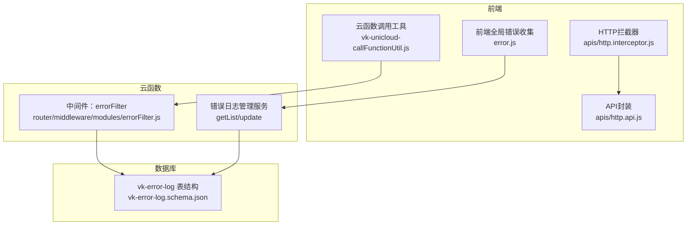
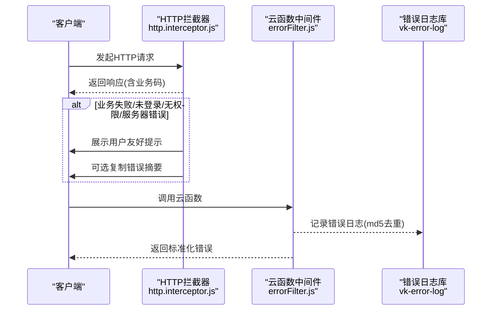
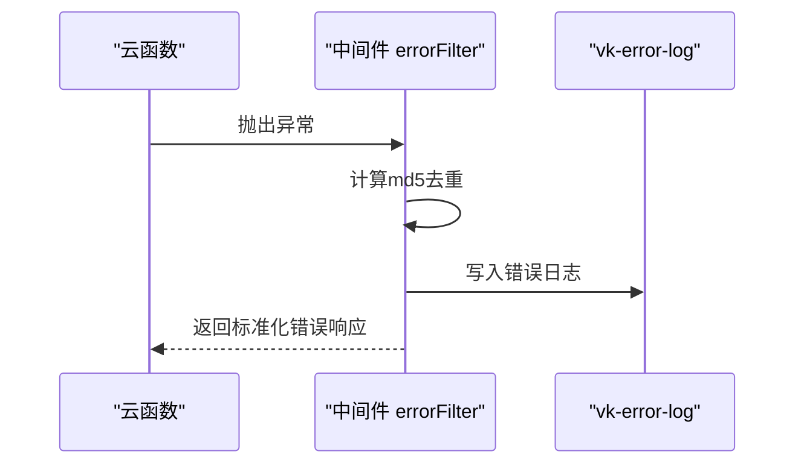
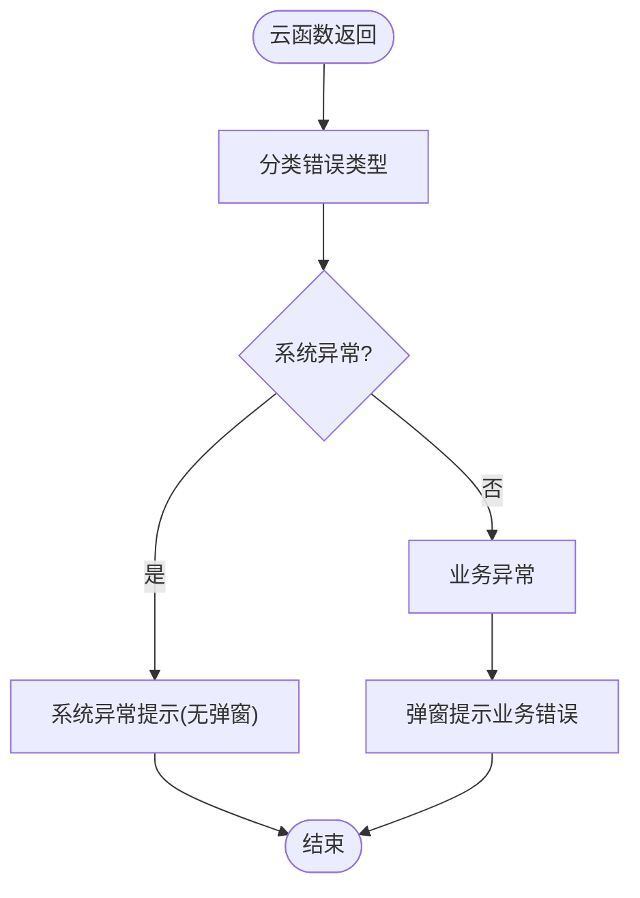
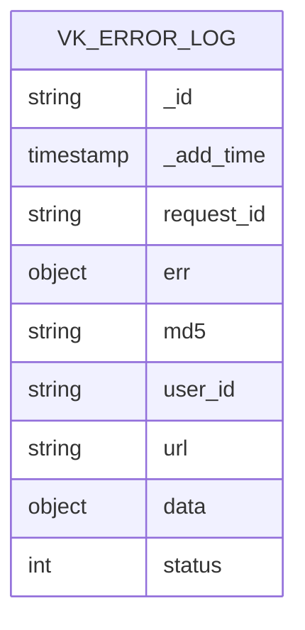
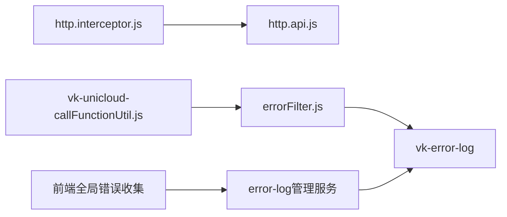

# 接口错误处理

<cite>
**本文引用的文件**
- [apis/http.interceptor.js](file://apis/http.interceptor.js)
- [apis/http.api.js](file://apis/http.api.js)
- [uniCloud-aliyun/cloudfunctions/router/middleware/modules/errorFilter.js](file://uniCloud-aliyun/cloudfunctions/router/middleware/modules/errorFilter.js)
- [uni_modules/vk-unicloud/vk_modules/vk-unicloud-page/libs/vk-unicloud/vk-unicloud-callFunctionUtil.js](file://uni_modules/vk-unicloud/vk_modules/vk-unicloud-page/libs/vk-unicloud/vk-unicloud-callFunctionUtil.js)
- [uniCloud-aliyun/database/vk-error-log.schema.json](file://uniCloud-aliyun/database/vk-error-log.schema.json)
- [uniCloud-aliyun/cloudfunctions/router/service/admin/system_uni/error-log/sys/getList.js](file://uniCloud-aliyun/cloudfunctions/router/service/admin/system_uni/error-log/sys/getList.js)
- [uniCloud-aliyun/cloudfunctions/router/service/admin/system_uni/error-log/sys/update.js](file://uniCloud-aliyun/cloudfunctions/router/service/admin/system_uni/error-log/sys/update.js)
- [uni_modules/vk-unicloud/vk_modules/vk-unicloud-page/libs/store/libs/error.js](file://uni_modules/vk-unicloud/vk_modules/vk-unicloud-page/libs/store/libs/error.js)
</cite>

## 目录
1. [简介](#简介)
2. [项目结构](#项目结构)
3. [核心组件](#核心组件)
4. [架构总览](#架构总览)
5. [详细组件分析](#详细组件分析)
6. [依赖关系分析](#依赖关系分析)
7. [性能考量](#性能考量)
8. [故障排查指南](#故障排查指南)
9. [结论](#结论)
10. [附录](#附录)

## 简介
本文件系统性梳理“挪车助手”项目的API错误处理机制，覆盖前端HTTP请求拦截器、云函数中间件、统一错误响应格式、错误类型策略、错误码与国际化、用户友好提示、错误日志与监控告警以及调试排障方法。目标是帮助开发者快速理解并维护一致、可追踪、可恢复的错误处理体系。

## 项目结构
围绕错误处理的关键位置如下：
- 前端拦截与统一提示：apis/http.interceptor.js
- 前端API封装与基础URL：apis/http.api.js
- 云函数全局异常拦截：uniCloud-aliyun/cloudfunctions/router/middleware/modules/errorFilter.js
- 云函数调用侧错误分类与提示：uni_modules/vk-unicloud/.../vk-unicloud-callFunctionUtil.js
- 错误日志数据模型：uniCloud-aliyun/database/vk-error-log.schema.json
- 错误日志后台管理服务：admin/system_uni/error-log/sys/*
- 前端Vue全局错误收集：uni_modules/vk-unicloud/.../libs/store/libs/error.js



图表来源
- [apis/http.interceptor.js:1-116](file://apis/http.interceptor.js#L1-L116)
- [apis/http.api.js:1-32](file://apis/http.api.js#L1-L32)
- [uniCloud-aliyun/cloudfunctions/router/middleware/modules/errorFilter.js:1-60](file://uniCloud-aliyun/cloudfunctions/router/middleware/modules/errorFilter.js#L1-L60)
- [uni_modules/vk-unicloud/vk_modules/vk-unicloud-page/libs/vk-unicloud/vk-unicloud-callFunctionUtil.js:1-200](file://uni_modules/vk-unicloud/vk_modules/vk-unicloud-page/libs/vk-unicloud/vk-unicloud-callFunctionUtil.js#L1-L200)
- [uniCloud-aliyun/database/vk-error-log.schema.json:1-50](file://uniCloud-aliyun/database/vk-error-log.schema.json#L1-L50)
- [uniCloud-aliyun/cloudfunctions/router/service/admin/system_uni/error-log/sys/getList.js:1-35](file://uniCloud-aliyun/cloudfunctions/router/service/admin/system_uni/error-log/sys/getList.js#L1-L35)
- [uniCloud-aliyun/cloudfunctions/router/service/admin/system_uni/error-log/sys/update.js:1-35](file://uniCloud-aliyun/cloudfunctions/router/service/admin/system_uni/error-log/sys/update.js#L1-L35)
- [uni_modules/vk-unicloud/vk_modules/vk-unicloud-page/libs/store/libs/error.js:1-26](file://uni_modules/vk-unicloud/vk_modules/vk-unicloud-page/libs/store/libs/error.js#L1-L26)

章节来源
- [apis/http.interceptor.js:1-116](file://apis/http.interceptor.js#L1-L116)
- [apis/http.api.js:1-32](file://apis/http.api.js#L1-L32)
- [uniCloud-aliyun/cloudfunctions/router/middleware/modules/errorFilter.js:1-60](file://uniCloud-aliyun/cloudfunctions/router/middleware/modules/errorFilter.js#L1-L60)
- [uni_modules/vk-unicloud/vk_modules/vk-unicloud-page/libs/vk-unicloud/vk-unicloud-callFunctionUtil.js:1-200](file://uni_modules/vk-unicloud/vk_modules/vk-unicloud-page/libs/vk-unicloud/vk-unicloud-callFunctionUtil.js#L1-L200)
- [uniCloud-aliyun/database/vk-error-log.schema.json:1-50](file://uniCloud-aliyun/database/vk-error-log.schema.json#L1-L50)
- [uniCloud-aliyun/cloudfunctions/router/service/admin/system_uni/error-log/sys/getList.js:1-35](file://uniCloud-aliyun/cloudfunctions/router/service/admin/system_uni/error-log/sys/getList.js#L1-L35)
- [uniCloud-aliyun/cloudfunctions/router/service/admin/system_uni/error-log/sys/update.js:1-35](file://uniCloud-aliyun/cloudfunctions/router/service/admin/system_uni/error-log/sys/update.js#L1-L35)
- [uni_modules/vk-unicloud/vk_modules/vk-unicloud-page/libs/store/libs/error.js:1-26](file://uni_modules/vk-unicloud/vk_modules/vk-unicloud-page/libs/store/libs/error.js#L1-L26)

## 核心组件
- HTTP请求拦截器：负责在响应阶段根据业务码进行统一处理，展示用户友好提示，必要时复制错误摘要到剪贴板。
- 云函数中间件：全局捕获云函数异常，生成去重标识并落库，便于后台统一治理。
- 云函数调用工具：对云函数返回结果进行错误分类，区分系统异常与业务异常，控制提示与弹窗策略。
- 错误日志模型：定义错误日志的字段与枚举，支持按md5去重与状态流转。
- 前端全局错误收集：在开发模式下收集Vue运行期错误，便于定位前端问题。

章节来源
- [apis/http.interceptor.js:1-116](file://apis/http.interceptor.js#L1-L116)
- [uniCloud-aliyun/cloudfunctions/router/middleware/modules/errorFilter.js:1-60](file://uniCloud-aliyun/cloudfunctions/router/middleware/modules/errorFilter.js#L1-L60)
- [uni_modules/vk-unicloud/vk_modules/vk-unicloud-page/libs/vk-unicloud/vk-unicloud-callFunctionUtil.js:935-1003](file://uni_modules/vk-unicloud/vk_modules/vk-unicloud-page/libs/vk-unicloud/vk-unicloud-callFunctionUtil.js#L935-L1003)
- [uniCloud-aliyun/database/vk-error-log.schema.json:1-50](file://uniCloud-aliyun/database/vk-error-log.schema.json#L1-L50)
- [uni_modules/vk-unicloud/vk_modules/vk-unicloud-page/libs/store/libs/error.js:1-26](file://uni_modules/vk-unicloud/vk_modules/vk-unicloud-page/libs/store/libs/error.js#L1-L26)

## 架构总览
整体流程分为三段：
- 前端HTTP拦截：解析业务码，统一提示与复制错误摘要。
- 云函数异常捕获：中间件记录错误日志，支持去重与状态管理。
- 云函数调用侧：区分系统异常与业务异常，控制提示与弹窗策略。



图表来源
- [apis/http.interceptor.js:37-116](file://apis/http.interceptor.js#L37-L116)
- [uniCloud-aliyun/cloudfunctions/router/middleware/modules/errorFilter.js:12-57](file://uniCloud-aliyun/cloudfunctions/router/middleware/modules/errorFilter.js#L12-L57)

## 详细组件分析

### 前端HTTP请求拦截器
- 功能要点
  - 在请求头注入鉴权与元信息。
  - 在响应阶段解析业务码，按码分支处理：
    - 业务失败：隐藏loading并展示错误提示，支持复制错误摘要。
    - 登录过期：隐藏loading并展示过期提示，便于引导重新登录。
    - 无权限：隐藏loading并提示权限不足。
    - 服务器错误：隐藏loading并提示服务器错误。
    - 未识别码：保留原响应并输出警告日志。
  - 防重复弹框：通过标志位避免并发错误重复提示。

```mermaid
flowchart TD
Start(["响应到达"]) --> Parse["解析业务码"]
Parse --> Branch{"业务码分支"}
Branch --> |业务失败(0)| Fail["隐藏loading<br/>展示错误提示<br/>可复制错误摘要"]
Branch --> |业务成功(1/200)| Ok["透传业务数据"]
Branch --> |未登录(401)| Expired["隐藏loading<br/>提示登录过期"]
Branch --> |无权限(403)| Forbidden["隐藏loading<br/>提示权限不足"]
Branch --> |服务器错误(500)| SysErr["隐藏loading<br/>提示服务器错误"]
Branch --> |其他| Warn["保留原响应<br/>输出警告日志"]
Fail --> End(["结束"])
Ok --> End
Expired --> End
Forbidden --> End
SysErr --> End
Warn --> End
```

图表来源
- [apis/http.interceptor.js:49-113](file://apis/http.interceptor.js#L49-L113)

章节来源
- [apis/http.interceptor.js:1-116](file://apis/http.interceptor.js#L1-L116)

### 云函数中间件（全局异常拦截）
- 功能要点
  - 对所有云函数异常进行捕获与统一处理。
  - 生成md5去重标识，记录请求ID、用户ID、URL、入参等信息。
  - 将错误对象持久化至vk-error-log，便于后台查看与处理。
  - 支持通过返回服务响应来短路后续中间件执行。



图表来源
- [uniCloud-aliyun/cloudfunctions/router/middleware/modules/errorFilter.js:12-57](file://uniCloud-aliyun/cloudfunctions/router/middleware/modules/errorFilter.js#L12-L57)

章节来源
- [uniCloud-aliyun/cloudfunctions/router/middleware/modules/errorFilter.js:1-60](file://uniCloud-aliyun/cloudfunctions/router/middleware/modules/errorFilter.js#L1-L60)

### 云函数调用侧错误分类与提示
- 功能要点
  - 对云函数返回进行错误分类，识别系统异常与业务异常。
  - 控制是否弹窗、是否toast、是否视为系统异常。
  - 针对超时、突发限制、网络断开等场景给出用户可感知的提示。
  - 支持拦截器fail回调与错误日志记录。



图表来源
- [uni_modules/vk-unicloud/vk_modules/vk-unicloud-page/libs/vk-unicloud/vk-unicloud-callFunctionUtil.js:935-1003](file://uni_modules/vk-unicloud/vk_modules/vk-unicloud-page/libs/vk-unicloud/vk-unicloud-callFunctionUtil.js#L935-L1003)

章节来源
- [uni_modules/vk-unicloud/vk_modules/vk-unicloud-page/libs/vk-unicloud/vk-unicloud-callFunctionUtil.js:935-1003](file://uni_modules/vk-unicloud/vk_modules/vk-unicloud-page/libs/vk-unicloud/vk-unicloud-callFunctionUtil.js#L935-L1003)

### 错误日志数据模型与管理
- 数据模型
  - 字段：请求ID、错误对象、md5去重、用户ID、URL、入参、状态（待处理/已处理/不处理）。
  - 枚举：状态字段包含三个取值及文本描述。
- 管理服务
  - 分页查询：支持按md5分组聚合，便于去重查看。
  - 更新：支持按md5与状态原子更新，配合后台治理流程。



图表来源
- [uniCloud-aliyun/database/vk-error-log.schema.json:1-50](file://uniCloud-aliyun/database/vk-error-log.schema.json#L1-L50)

章节来源
- [uniCloud-aliyun/database/vk-error-log.schema.json:1-50](file://uniCloud-aliyun/database/vk-error-log.schema.json#L1-L50)
- [uniCloud-aliyun/cloudfunctions/router/service/admin/system_uni/error-log/sys/getList.js:1-35](file://uniCloud-aliyun/cloudfunctions/router/service/admin/system_uni/error-log/sys/getList.js#L1-L35)
- [uniCloud-aliyun/cloudfunctions/router/service/admin/system_uni/error-log/sys/update.js:1-35](file://uniCloud-aliyun/cloudfunctions/router/service/admin/system_uni/error-log/sys/update.js#L1-L35)

### 前端全局错误收集
- 功能要点
  - 在开发环境下拦截Vue运行期错误，记录错误信息、路由、时间等，便于定位问题。
  - 通过vuex派发错误日志，形成前端侧可观测性闭环。

章节来源
- [uni_modules/vk-unicloud/vk_modules/vk-unicloud-page/libs/store/libs/error.js:1-26](file://uni_modules/vk-unicloud/vk_modules/vk-unicloud-page/libs/store/libs/error.js#L1-L26)

## 依赖关系分析
- 前端HTTP拦截器依赖uView-Plus的HTTP实例与全局工具函数，负责统一业务码处理与用户提示。
- 云函数中间件依赖vk工具链与DAO层，负责错误日志入库与去重。
- 云函数调用工具在客户端侧对系统异常与业务异常进行分流，确保用户体验与告警策略一致。
- 错误日志模型与管理服务构成后台治理闭环，支持状态流转与批量处理。



图表来源
- [apis/http.interceptor.js:37-116](file://apis/http.interceptor.js#L37-L116)
- [apis/http.api.js:11-32](file://apis/http.api.js#L11-L32)
- [uniCloud-aliyun/cloudfunctions/router/middleware/modules/errorFilter.js:12-57](file://uniCloud-aliyun/cloudfunctions/router/middleware/modules/errorFilter.js#L12-L57)
- [uni_modules/vk-unicloud/vk_modules/vk-unicloud-page/libs/vk-unicloud/vk-unicloud-callFunctionUtil.js:935-1003](file://uni_modules/vk-unicloud/vk_modules/vk-unicloud-page/libs/vk-unicloud/vk-unicloud-callFunctionUtil.js#L935-L1003)
- [uniCloud-aliyun/database/vk-error-log.schema.json:1-50](file://uniCloud-aliyun/database/vk-error-log.schema.json#L1-L50)
- [uniCloud-aliyun/cloudfunctions/router/service/admin/system_uni/error-log/sys/getList.js:1-35](file://uniCloud-aliyun/cloudfunctions/router/service/admin/system_uni/error-log/sys/getList.js#L1-L35)
- [uniCloud-aliyun/cloudfunctions/router/service/admin/system_uni/error-log/sys/update.js:1-35](file://uniCloud-aliyun/cloudfunctions/router/service/admin/system_uni/error-log/sys/update.js#L1-L35)
- [uni_modules/vk-unicloud/vk_modules/vk-unicloud-page/libs/store/libs/error.js:1-26](file://uni_modules/vk-unicloud/vk_modules/vk-unicloud-page/libs/store/libs/error.js#L1-L26)

## 性能考量
- 响应拦截器避免重复弹窗，减少UI抖动与重复IO。
- 云函数中间件仅在云端运行时入库，降低本地调试成本。
- md5去重减少重复错误日志写入，提升数据库吞吐。
- 云函数调用侧对超时等场景关闭弹窗，避免无效打扰。

## 故障排查指南
- 前端业务码异常
  - 检查HTTP拦截器的业务码分支与提示文案，确认是否正确透传或阻断。
  - 使用“复制错误”功能将错误摘要粘贴至后台或日志系统，辅助定位。
  - 关注防重复弹框标志位，避免并发场景下的重复提示。
- 云函数异常
  - 在中间件中确认是否写入vk-error-log，检查md5去重与状态字段。
  - 通过管理服务的分页查询与按md5聚合，快速定位重复错误。
  - 使用更新服务按md5与状态原子更新，推进治理闭环。
- 云函数调用侧异常
  - 区分系统异常与业务异常，确认是否触发弹窗或toast。
  - 针对超时、突发限制、网络断开等场景，确认提示文案与行为符合预期。
- 前端运行期错误
  - 开发环境下检查Vue全局错误收集是否正常派发至vuex，便于定位问题。

章节来源
- [apis/http.interceptor.js:10-35](file://apis/http.interceptor.js#L10-L35)
- [uniCloud-aliyun/cloudfunctions/router/middleware/modules/errorFilter.js:31-53](file://uniCloud-aliyun/cloudfunctions/router/middleware/modules/errorFilter.js#L31-L53)
- [uniCloud-aliyun/cloudfunctions/router/service/admin/system_uni/error-log/sys/getList.js:20-35](file://uniCloud-aliyun/cloudfunctions/router/service/admin/system_uni/error-log/sys/getList.js#L20-L35)
- [uniCloud-aliyun/cloudfunctions/router/service/admin/system_uni/error-log/sys/update.js:12-33](file://uniCloud-aliyun/cloudfunctions/router/service/admin/system_uni/error-log/sys/update.js#L12-L33)
- [uni_modules/vk-unicloud/vk_modules/vk-unicloud-page/libs/vk-unicloud/vk-unicloud-callFunctionUtil.js:935-1003](file://uni_modules/vk-unicloud/vk_modules/vk-unicloud-page/libs/vk-unicloud/vk-unicloud-callFunctionUtil.js#L935-L1003)
- [uni_modules/vk-unicloud/vk_modules/vk-unicloud-page/libs/store/libs/error.js:7-20](file://uni_modules/vk-unicloud/vk_modules/vk-unicloud-page/libs/store/libs/error.js#L7-L20)

## 结论
本项目在前后端分别建立了完善的错误处理机制：前端以HTTP拦截器为核心，统一业务码与用户提示；云函数侧通过中间件实现全局异常捕获与日志入库；调用侧对系统与业务异常进行分流，保障用户体验与可观测性。配合错误日志模型与后台管理服务，形成从采集、去重、治理到反馈的闭环，适合在生产环境中持续演进与维护。

## 附录

### 错误类型与处理策略
- 网络错误
  - 云函数调用侧：识别超时、突发限制、网络断开等，控制弹窗与toast，必要时提示“请求超时，请重试”。
  - 前端HTTP拦截器：统一展示“服务器错误,请稍后重试”等提示。
- 业务逻辑错误
  - 前端HTTP拦截器：展示业务失败提示，支持复制错误摘要。
  - 云函数调用侧：弹窗提示业务错误，不视为系统异常。
- 权限错误
  - 前端HTTP拦截器：展示“暂无权限访问”，避免重复弹窗。
- 系统异常
  - 云函数中间件：记录错误日志并去重，便于后台治理。
  - 云函数调用侧：系统异常提示且通常不弹窗，避免干扰。

章节来源
- [apis/http.interceptor.js:57-104](file://apis/http.interceptor.js#L57-L104)
- [uniCloud-aliyun/cloudfunctions/router/middleware/modules/errorFilter.js:31-53](file://uniCloud-aliyun/cloudfunctions/router/middleware/modules/errorFilter.js#L31-L53)
- [uni_modules/vk-unicloud/vk_modules/vk-unicloud-page/libs/vk-unicloud/vk-unicloud-callFunctionUtil.js:935-1003](file://uni_modules/vk-unicloud/vk_modules/vk-unicloud-page/libs/vk-unicloud/vk-unicloud-callFunctionUtil.js#L935-L1003)

### 错误码与国际化
- 业务码约定
  - 成功：1 或 200
  - 失败：0
  - 未登录/过期：401
  - 无权限：403
  - 服务器错误：500
- 国际化
  - 前端拦截器采用固定文案提示，若需国际化，可在业务层扩展多语言映射并在拦截器中按语言切换。
  - 云函数调用侧的提示文案可通过全局错误码映射实现国际化。

章节来源
- [apis/http.interceptor.js:57-104](file://apis/http.interceptor.js#L57-L104)
- [uni_modules/vk-unicloud/vk_modules/vk-unicloud-page/libs/vk-unicloud/vk-unicloud-callFunctionUtil.js:935-1003](file://uni_modules/vk-unicloud/vk_modules/vk-unicloud-page/libs/vk-unicloud/vk-unicloud-callFunctionUtil.js#L935-L1003)

### 用户友好提示与调试技巧
- 提示策略
  - 业务失败：展示简洁明确的失败原因，支持一键复制错误摘要。
  - 登录过期：提示重新登录，避免重复弹窗。
  - 服务器错误：提示稍后重试，避免频繁打扰。
  - 系统异常：静默记录，必要时toast提示，不弹窗。
- 调试技巧
  - 使用“复制错误”功能将错误摘要粘贴至日志系统或后台。
  - 在开发环境下启用前端全局错误收集，结合后台错误日志进行关联分析。
  - 通过管理服务按md5聚合与状态更新，快速定位与处理重复错误。

章节来源
- [apis/http.interceptor.js:10-35](file://apis/http.interceptor.js#L10-L35)
- [uni_modules/vk-unicloud/vk_modules/vk-unicloud-page/libs/store/libs/error.js:7-20](file://uni_modules/vk-unicloud/vk_modules/vk-unicloud-page/libs/store/libs/error.js#L7-L20)
- [uniCloud-aliyun/cloudfunctions/router/service/admin/system_uni/error-log/sys/getList.js:20-35](file://uniCloud-aliyun/cloudfunctions/router/service/admin/system_uni/error-log/sys/getList.js#L20-L35)
- [uniCloud-aliyun/cloudfunctions/router/service/admin/system_uni/error-log/sys/update.js:12-33](file://uniCloud-aliyun/cloudfunctions/router/service/admin/system_uni/error-log/sys/update.js#L12-L33)