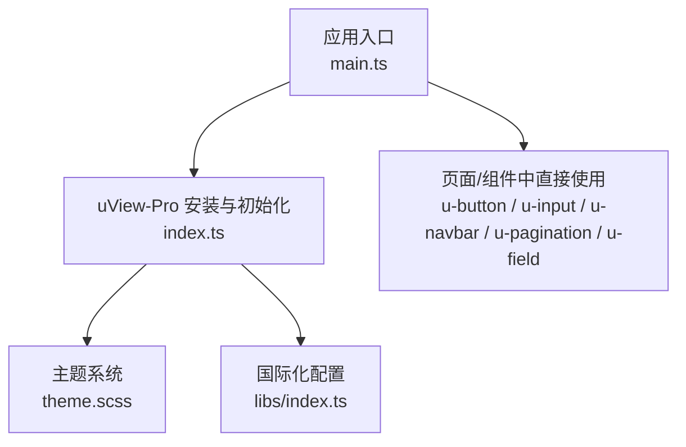
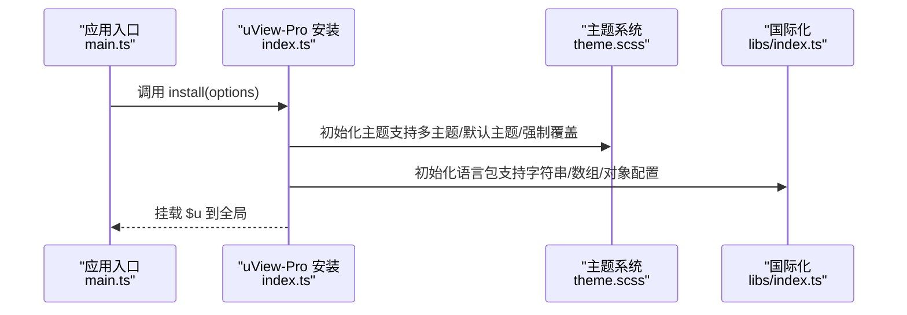
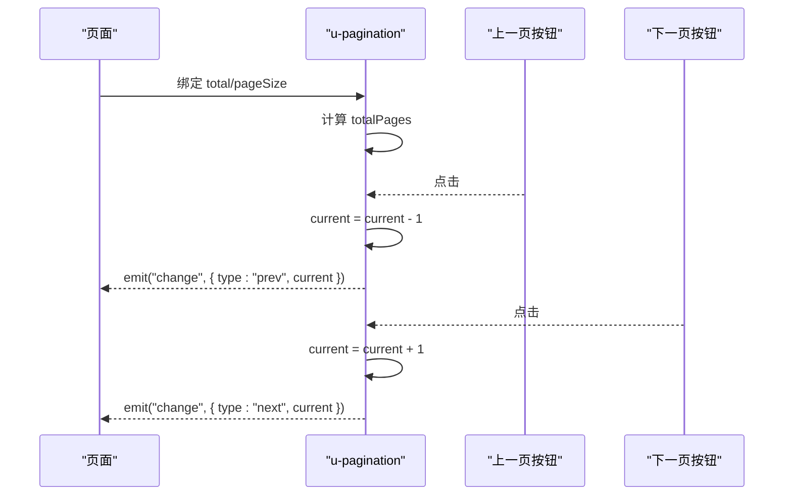
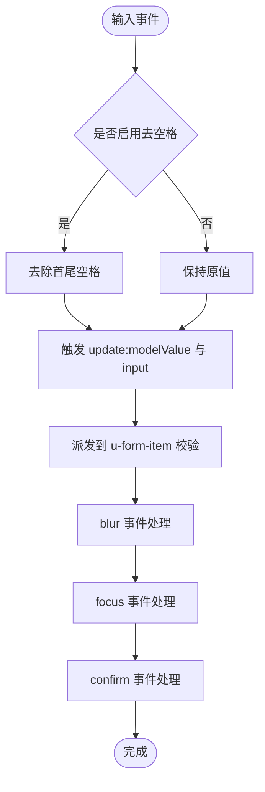
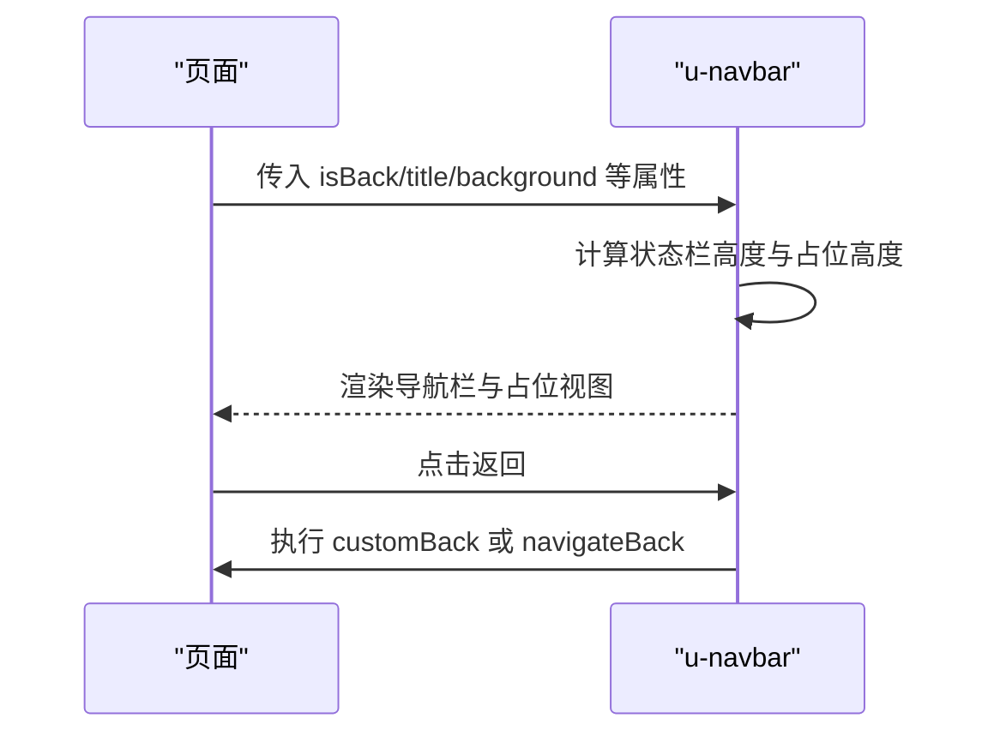
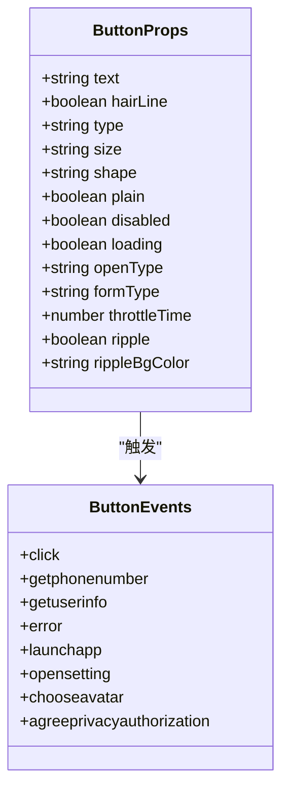
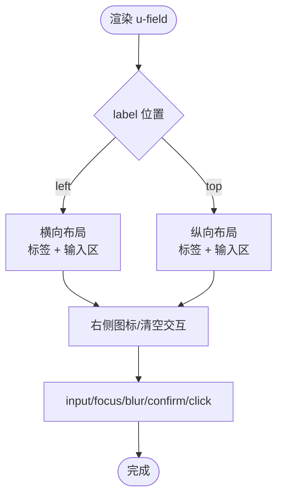
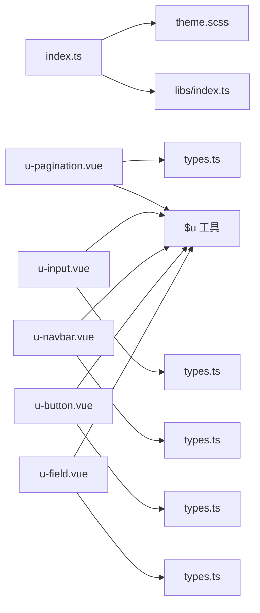

# UI组件库

<cite>
**本文引用的文件**
- [README.md](file://uni_modules\uview-pro\readme.md)
- [index.ts](file://uni_modules\uview-pro\index.ts)
- [theme.scss](file://uni_modules\uview-pro\theme.scss)
- [package.json](file://uni_modules\uview-pro\package.json)
- [libs/index.ts](file://uni_modules\uview-pro\libs\index.ts)
- [components/u-pagination/types.ts](file://uni_modules\uview-pro\components\u-pagination\types.ts)
- [components/u-pagination/u-pagination.vue](file://uni_modules\uview-pro\components\u-pagination\u-pagination.vue)
- [components/u-input/types.ts](file://uni_modules\uview-pro\components\u-input\types.ts)
- [components/u-input/u-input.vue](file://uni_modules\uview-pro\components\u-input\u-input.vue)
- [components/u-navbar/types.ts](file://uni_modules\uview-pro\components\u-navbar\types.ts)
- [components/u-navbar/u-navbar.vue](file://uni_modules\uview-pro\components\u-navbar\u-navbar.vue)
- [components/u-button/types.ts](file://uni_modules\uview-pro\components\u-button\types.ts)
- [components/u-button/u-button.vue](file://uni_modules\uview-pro\components\u-button\u-button.vue)
- [components/u-field/types.ts](file://uni_modules\uview-pro\components\u-field\types.ts)
- [components/u-field/u-field.vue](file://uni_modules\uview-pro\components\u-field\u-field.vue)
</cite>

## 目录
1. [简介](#简介)
2. [项目结构](#项目结构)
3. [核心组件](#核心组件)
4. [架构总览](#架构总览)
5. [组件详解](#组件详解)
6. [依赖关系分析](#依赖关系分析)
7. [性能与可维护性](#性能与可维护性)
8. [故障排查](#故障排查)
9. [结论](#结论)
10. [附录](#附录)

## 简介
本文件为挪车助手项目的UI组件库文档，重点围绕 uView-Pro 组件库进行系统化说明。内容涵盖安装配置、主题与暗黑模式、国际化、核心组件（分页、输入、导航、按钮、表单项）的属性、事件、插槽与样式定制，以及组件间组合模式与最佳实践。文档面向不同技术背景的读者，既提供高层概览，也给出代码级映射与可视化图表，便于快速落地。

## 项目结构
uView-Pro 作为 uni-app 的多端 UI 框架，提供 70+ 组件与工具函数，支持 Vue3 + TypeScript，覆盖 H5、App、小程序及 HarmonyOS 多端。项目通过 easycom 自动引入组件，结合主题变量与国际化配置，实现“一套代码、多端运行”。

**图表来源**
- [index.ts:16-92](file://uni_modules\uview-pro\index.ts#L16-L92)
- [theme.scss:1-117](file://uni_modules\uview-pro\theme.scss#L1-L117)
- [libs/index.ts:290-350](file://uni_modules\uview-pro\libs\index.ts#L290-L350)

**章节来源**
- [README.md:104-220](file://uni_modules\uview-pro\readme.md#L104-L220)
- [package.json:1-109](file://uni_modules\uview-pro\package.json#L1-L109)

## 核心组件
本节聚焦分页、输入、导航、按钮、表单项等高频组件，说明其能力边界、关键属性与事件、插槽与样式定制要点。

- 分页组件（u-pagination）
  - 功能：上一页/下一页导航，显示当前页与总页数，支持图标或文字按钮。
  - 关键属性：总数、每页数量、左右文案、是否以图标展示、图标名、自定义样式类与样式。
  - 事件：change（携带方向与当前页）。
  - 插槽：默认插槽用于自定义页码显示。
  - 样式：通过 scoped 样式与自定义类名控制按钮与文本布局。
  - 参考路径：[components/u-pagination/types.ts:12-37](file://uni_modules\uview-pro\components\u-pagination\types.ts#L12-L37)、[components/u-pagination/u-pagination.vue:1-94](file://uni_modules\uview-pro\components\u-pagination\u-pagination.vue#L1-L94)

- 输入组件（u-input）
  - 功能：支持 text/textarea/password/select 等类型；可选边框、清空、密码可见切换、计数统计；与表单联动。
  - 关键属性：类型、对齐、尺寸、占位、禁用、最大长度、清空、边框与边框色、高度、自动增高、光标与确认栏、校验状态等。
  - 事件：input、blur、focus、confirm、click；双向绑定通过 modelValue。
  - 插槽：无（通过图标与右侧元素实现交互）。
  - 样式：通过 size 预设与自定义样式合并，支持边框与错误态高亮。
  - 参考路径：[components/u-input/types.ts:12-153](file://uni_modules\uview-pro\components\u-input\types.ts#L12-L153)、[components/u-input/u-input.vue:1-411](file://uni_modules\uview-pro\components\u-input\u-input.vue#L1-L411)

- 导航组件（u-navbar）
  - 功能：自定义导航栏，支持返回图标、返回文字、标题、左右插槽、沉浸式与固定定位。
  - 关键属性：高度、返回图标颜色/名称/大小、返回文字与样式、标题、标题宽度/颜色/大小/加粗、是否显示返回、背景、固定、沉浸、边框、z-index、自定义返回逻辑。
  - 事件：无（通过自定义返回逻辑处理）。
  - 插槽：left/right/content。
  - 样式：通过背景对象合并与占位视图解决 fixed 塌陷。
  - 参考路径：[components/u-navbar/types.ts:8-99](file://uni_modules\uview-pro\components\u-navbar\types.ts#L8-L99)、[components/u-navbar/u-navbar.vue:1-268](file://uni_modules\uview-pro\components\u-navbar\u-navbar.vue#L1-L268)

- 按钮组件（u-button）
  - 功能：多类型、多尺寸、镂空、细边框、加载态、水波纹、开放能力对接。
  - 关键属性：文本、细边框、类型、尺寸、形状、镂空、禁用、加载、开放能力、表单类型、节流时间、悬停与水波纹配置等。
  - 事件：click 与多种开放能力回调。
  - 插槽：默认插槽显示按钮文本。
  - 样式：通过类名组合与水波纹动画实现视觉反馈。
  - 参考路径：[components/u-button/types.ts:9-74](file://uni_modules\uview-pro\components\u-button\types.ts#L9-L74)、[components/u-button/u-button.vue:1-608](file://uni_modules\uview-pro\components\u-button\u-button.vue#L1-L608)

- 表单项组件（u-field）
  - 功能：标签 + 输入框组合，支持左右图标、清空、右侧图标、错误信息提示、左右/上下标签布局。
  - 关键属性：标签、图标、右侧图标、箭头方向、必填星号、标签宽度/对齐、输入对齐、清空尺寸、字段样式、上下边框、禁用、自动增高、最大长度、确认类型、模型值等。
  - 事件：input、focus、blur、confirm、right-icon-click、click。
  - 插槽：icon、right。
  - 样式：通过 label 位置与对齐控制布局，错误信息左对齐显示。
  - 参考路径：[components/u-field/types.ts:8-77](file://uni_modules\uview-pro\components\u-field\types.ts#L8-L77)、[components/u-field/u-field.vue:1-379](file://uni_modules\uview-pro\components\u-field\u-field.vue#L1-L379)

**章节来源**
- [components/u-pagination/types.ts:12-37](file://uni_modules\uview-pro\components\u-pagination\types.ts#L12-L37)
- [components/u-pagination/u-pagination.vue:1-94](file://uni_modules\uview-pro\components\u-pagination\u-pagination.vue#L1-L94)
- [components/u-input/types.ts:12-153](file://uni_modules\uview-pro\components\u-input\types.ts#L12-L153)
- [components/u-input/u-input.vue:1-411](file://uni_modules\uview-pro\components\u-input\u-input.vue#L1-L411)
- [components/u-navbar/types.ts:8-99](file://uni_modules\uview-pro\components\u-navbar\types.ts#L8-L99)
- [components/u-navbar/u-navbar.vue:1-268](file://uni_modules\uview-pro\components\u-navbar\u-navbar.vue#L1-L268)
- [components/u-button/types.ts:9-74](file://uni_modules\uview-pro\components\u-button\types.ts#L9-L74)
- [components/u-button/u-button.vue:1-608](file://uni_modules\uview-pro\components\u-button\u-button.vue#L1-L608)
- [components/u-field/types.ts:8-77](file://uni_modules\uview-pro\components\u-field\types.ts#L8-L77)
- [components/u-field/u-field.vue:1-379](file://uni_modules\uview-pro\components\u-field\u-field.vue#L1-L379)

## 架构总览
uView-Pro 通过安装入口统一初始化主题、国际化与调试开关，并将 $u 工具挂载到全局，使组件与业务代码共享统一的能力与配置。

**图表来源**
- [index.ts:16-92](file://uni_modules\uview-pro\index.ts#L16-L92)
- [theme.scss:1-117](file://uni_modules\uview-pro\theme.scss#L1-L117)
- [libs/index.ts:290-350](file://uni_modules\uview-pro\libs\index.ts#L290-L350)

**章节来源**
- [README.md:104-220](file://uni_modules\uview-pro\readme.md#L104-L220)
- [package.json:1-109](file://uni_modules\uview-pro\package.json#L1-L109)

## 组件详解

### 分页组件（u-pagination）
- 数据流与交互
  - 接收 total 与 pageSize，计算 totalPages。
  - 通过 defineModel 绑定 current，点击上一页/下一页更新 current 并触发 change 事件。
  - 支持 showIcon 与 prevIcon/nextIcon 控制按钮展示形式。
- 事件与插槽
  - change(payload)：payload 包含 direction 与 current。
  - 默认插槽：自定义页码文本结构。
- 样式与主题
  - 通过 customClass/customStyle 与 scoped 样式控制按钮与文本间距。
- 适用场景
  - 列表分页、搜索结果分页、表格分页等。

**图表来源**
- [components/u-pagination/u-pagination.vue:56-78](file://uni_modules\uview-pro\components\u-pagination\u-pagination.vue#L56-L78)
- [components/u-pagination/types.ts:39-41](file://uni_modules\uview-pro\components\u-pagination\types.ts#L39-L41)

**章节来源**
- [components/u-pagination/types.ts:12-37](file://uni_modules\uview-pro\components\u-pagination\types.ts#L12-L37)
- [components/u-pagination/u-pagination.vue:1-94](file://uni_modules\uview-pro\components\u-pagination\u-pagination.vue#L1-L94)

### 输入组件（u-input）
- 输入行为
  - 支持 modelValue 双向绑定；可选 trim 去空格；textarea 支持计数与自动增高。
  - select 类型通过 overlay 与右侧图标实现下拉交互。
- 与表单联动
  - 通过 useChildren 与 u-form-item/u-form 通信，同步校验状态与事件。
- 事件与样式
  - input/blur/focus/confirm/click；错误态高亮与边框配置。
  - 通过 size 预设与自定义样式合并，适配不同字号与图标间距。
- 适用场景
  - 登录/注册表单、搜索框、备注输入、选择器等。

**图表来源**
- [components/u-input/u-input.vue:269-335](file://uni_modules\uview-pro\components\u-input\u-input.vue#L269-L335)
- [components/u-input/types.ts:12-153](file://uni_modules\uview-pro\components\u-input\types.ts#L12-L153)

**章节来源**
- [components/u-input/types.ts:12-153](file://uni_modules\uview-pro\components\u-input\types.ts#L12-L153)
- [components/u-input/u-input.vue:1-411](file://uni_modules\uview-pro\components\u-input\u-input.vue#L1-L411)

### 导航组件（u-navbar）
- 设计要点
  - 自适应状态栏高度；小程序下考虑胶囊按钮宽度；支持沉浸式与固定定位。
  - 通过插槽扩展左右内容与中间标题区域。
- 事件与样式
  - 自定义返回逻辑 customBack；背景样式合并；z-index 控制层级。
- 适用场景
  - 页面头部导航、带返回与标题的页面。

**图表来源**
- [components/u-navbar/u-navbar.vue:96-190](file://uni_modules\uview-pro\components\u-navbar\u-navbar.vue#L96-L190)
- [components/u-navbar/types.ts:8-99](file://uni_modules\uview-pro\components\u-navbar\types.ts#L8-L99)

**章节来源**
- [components/u-navbar/types.ts:8-99](file://uni_modules\uview-pro\components\u-navbar\types.ts#L8-L99)
- [components/u-navbar/u-navbar.vue:1-268](file://uni_modules\uview-pro\components\u-navbar\u-navbar.vue#L1-L268)

### 按钮组件（u-button）
- 能力与交互
  - 支持多种类型与尺寸；镂空与细边框；加载态；水波纹效果；开放能力事件透传。
  - 支持节流时间 throttleTime，避免频繁点击。
- 事件与样式
  - click 与多种 open-type 回调；hover-class 与 ripple 配置。
- 适用场景
  - 提交、确认、跳转、授权等动作入口。

**图表来源**
- [components/u-button/types.ts:9-74](file://uni_modules\uview-pro\components\u-button\types.ts#L9-L74)
- [components/u-button/u-button.vue:127-137](file://uni_modules\uview-pro\components\u-button\u-button.vue#L127-L137)

**章节来源**
- [components/u-button/types.ts:9-74](file://uni_modules\uview-pro\components\u-button\types.ts#L9-L74)
- [components/u-button/u-button.vue:1-608](file://uni_modules\uview-pro\components\u-button\u-button.vue#L1-L608)

### 表单项组件（u-field）
- 结构与布局
  - 左侧标签（可带图标/必填星号），右侧输入区（可带清空、右侧图标、插槽）。
  - 支持 label 位置 left/top 与对齐方式。
- 交互与校验
  - 右侧图标点击触发 right-icon-click 与 click；错误信息按需显示。
- 适用场景
  - 表单字段组合、带说明与提示的输入场景。

**图表来源**
- [components/u-field/u-field.vue:120-261](file://uni_modules\uview-pro\components\u-field\u-field.vue#L120-L261)
- [components/u-field/types.ts:8-77](file://uni_modules\uview-pro\components\u-field\types.ts#L8-L77)

**章节来源**
- [components/u-field/types.ts:8-77](file://uni_modules\uview-pro\components\u-field\types.ts#L8-L77)
- [components/u-field/u-field.vue:1-379](file://uni_modules\uview-pro\components\u-field\u-field.vue#L1-L379)

## 依赖关系分析
- 安装入口依赖主题与国际化模块，统一初始化。
- 组件通过 $u 工具与公共样式文件协作，形成一致的交互与视觉规范。
- 组件间通过父子关系（如 u-input 与 u-form-item）实现表单联动。

**图表来源**
- [index.ts:1-101](file://uni_modules\uview-pro\index.ts#L1-L101)
- [theme.scss:1-117](file://uni_modules\uview-pro\theme.scss#L1-L117)
- [libs/index.ts:1-350](file://uni_modules\uview-pro\libs\index.ts#L1-L350)
- [components/u-pagination/u-pagination.vue:1-94](file://uni_modules\uview-pro\components\u-pagination\u-pagination.vue#L1-L94)
- [components/u-input/u-input.vue:1-411](file://uni_modules\uview-pro\components\u-input\u-input.vue#L1-L411)
- [components/u-navbar/u-navbar.vue:1-268](file://uni_modules\uview-pro\components\u-navbar\u-navbar.vue#L1-L268)
- [components/u-button/u-button.vue:1-608](file://uni_modules\uview-pro\components\u-button\u-button.vue#L1-L608)
- [components/u-field/u-field.vue:1-379](file://uni_modules\uview-pro\components\u-field\u-field.vue#L1-L379)

**章节来源**
- [index.ts:1-101](file://uni_modules\uview-pro\index.ts#L1-L101)
- [libs/index.ts:1-350](file://uni_modules\uview-pro\libs\index.ts#L1-L350)

## 性能与可维护性
- 按需引入与 easycom
  - 通过 pages.json 的 easycom 规则自动扫描组件，减少 import 与注册成本，降低包体与心智负担。
- 主题与样式
  - 使用 SCSS 变量与 CSS 变量统一颜色体系，避免硬编码；主题初始化集中处理，便于切换与扩展。
- 组件复用
  - 通过父子关系与事件派发（如 u-input 与 u-form-item）实现表单联动，减少重复逻辑。
- 国际化
  - 内置语言包与可配置初始化，支持多语言切换，降低文案维护成本。

**章节来源**
- [README.md:168-192](file://uni_modules\uview-pro\readme.md#L168-L192)
- [index.ts:55-85](file://uni_modules\uview-pro\index.ts#L55-L85)

## 故障排查
- 组件未生效
  - 检查 pages.json 的 easycom 配置是否正确、是否位于 custom 内、是否仅存在一个 easycom 字段。
  - 参考：[README.md:168-192](file://uni_modules\uview-pro\readme.md#L168-L192)
- 样式异常或主题不生效
  - 确认 uni.scss 引入顺序与作用域隔离设置；检查 theme.scss 变量是否被覆盖。
  - 参考：[theme.scss:1-117](file://uni_modules\uview-pro\theme.scss#L1-L117)
- 表单联动无效
  - 确保 u-input 处于 u-form 与 u-form-item 的上下文中，事件派发链路完整。
  - 参考：[components/u-input/u-input.vue:135-136](file://uni_modules\uview-pro\components\u-input\u-input.vue#L135-L136)
- 按钮水波纹不触发
  - 检查 ripple 与 disabled/loading 状态；确认节点查询与类名切换逻辑。
  - 参考：[components/u-button/u-button.vue:190-245](file://uni_modules\uview-pro\components\u-button\u-button.vue#L190-L245)

## 结论
uView-Pro 为挪车助手项目提供了完善的多端 UI 能力，具备良好的主题与国际化支持、清晰的组件 API 与事件体系，以及可扩展的样式定制能力。通过本文档的指引，开发者可快速掌握核心组件的使用方法、组合模式与最佳实践，构建一致、可维护的界面体验。

## 附录
- 快速开始与安装
  - 支持 npm 与 uni_modules 两种安装方式；通过 easycom 自动引入；在 uni.scss 引入主题样式。
  - 参考：[README.md:104-220](file://uni_modules\uview-pro\readme.md#L104-L220)
- 主题与暗黑模式
  - 通过 theme.scss 定义颜色与变量；安装入口支持多主题初始化与默认主题设置。
  - 参考：[theme.scss:1-117](file://uni_modules\uview-pro\theme.scss#L1-L117)、[index.ts:16-54](file://uni_modules\uview-pro\index.ts#L16-L54)
- 国际化
  - 支持字符串/数组/对象三种配置方式；默认初始化内置语言包。
  - 参考：[index.ts:55-85](file://uni_modules\uview-pro\index.ts#L55-L85)
- 组件属性与事件参考
  - 分页：[components/u-pagination/types.ts:12-41](file://uni_modules\uview-pro\components\u-pagination\types.ts#L12-L41)
  - 输入：[components/u-input/types.ts:12-153](file://uni_modules\uview-pro\components\u-input\types.ts#L12-L153)
  - 导航：[components/u-navbar/types.ts:8-99](file://uni_modules\uview-pro\components\u-navbar\types.ts#L8-L99)
  - 按钮：[components/u-button/types.ts:9-74](file://uni_modules\uview-pro\components\u-button\types.ts#L9-L74)
  - 表单项：[components/u-field/types.ts:8-77](file://uni_modules\uview-pro\components\u-field\types.ts#L8-L77)