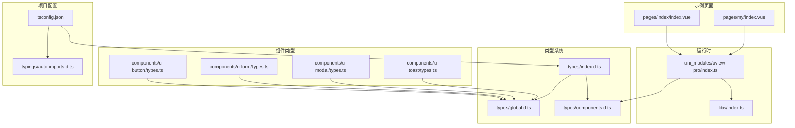
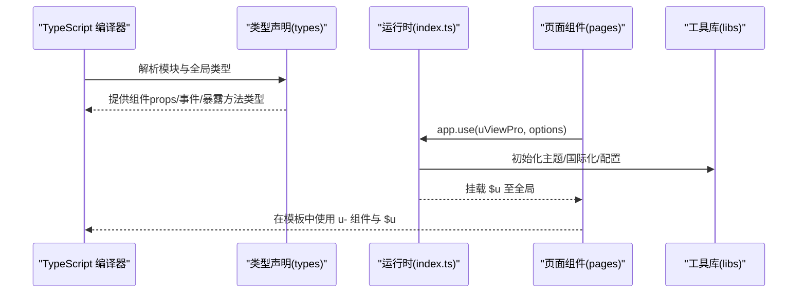
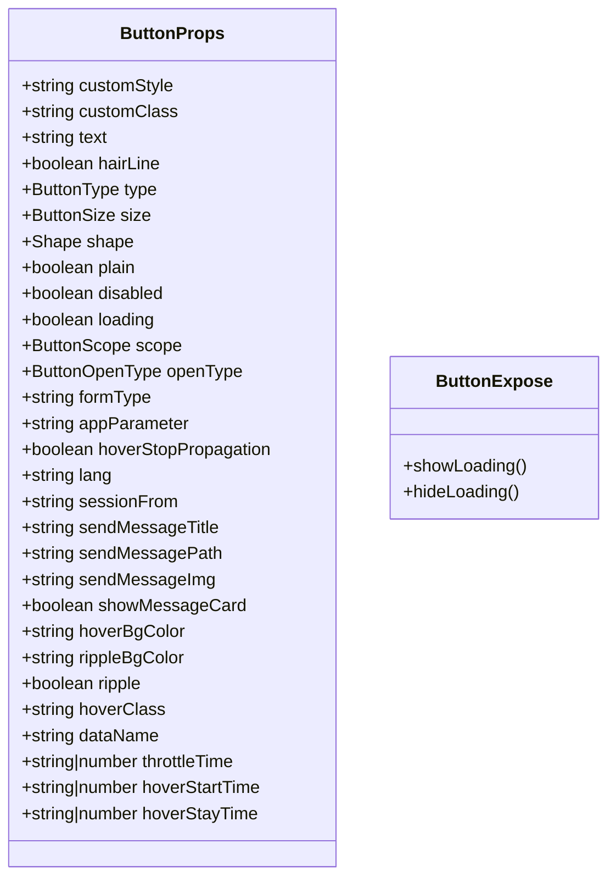
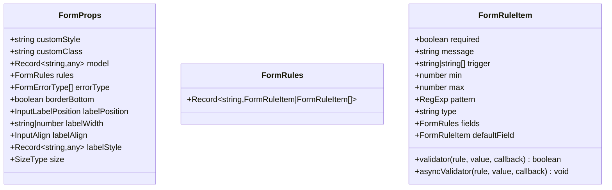
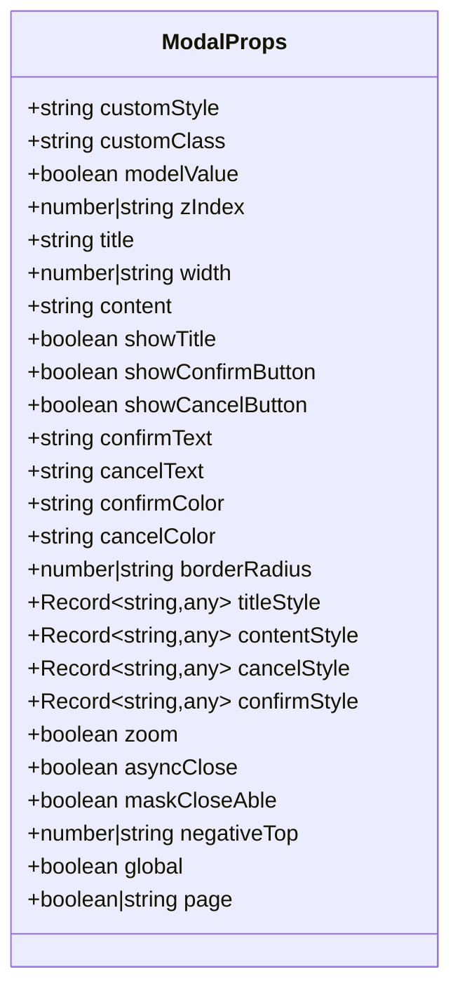
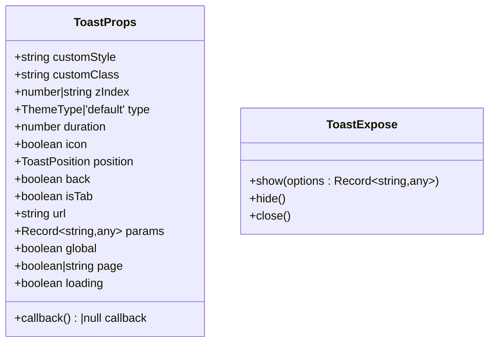
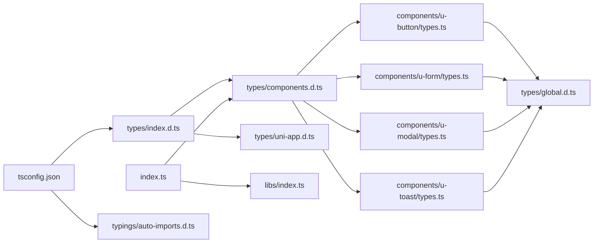

# TypeScript支持

<cite>
**本文引用的文件**
- [tsconfig.json](file://tsconfig.json)
- [main.js](file://main.js)
- [App.vue](file://App.vue)
- [index.ts](file://uni_modules/uview-pro/index.ts)
- [types/index.d.ts](file://uni_modules/uview-pro/types/index.d.ts)
- [types/components.d.ts](file://uni_modules/uview-pro/types/components.d.ts)
- [types/global.d.ts](file://uni_modules/uview-pro/types/global.d.ts)
- [libs/index.ts](file://uni_modules/uview-pro/libs/index.ts)
- [components/u-button/types.ts](file://uni_modules/uview-pro/components/u-button/types.ts)
- [components/u-form/types.ts](file://uni_modules/uview-pro/components/u-form/types.ts)
- [components/u-modal/types.ts](file://uni_modules/uview-pro/components/u-modal/types.ts)
- [components/u-toast/types.ts](file://uni_modules/uview-pro/components/u-toast/types.ts)
- [typings/auto-imports.d.ts](file://typings/auto-imports.d.ts)
- [pages/index/index.vue](file://pages/index/index.vue)
- [pages/my/index.vue](file://pages/my/index.vue)
</cite>

## 目录
1. [简介](#简介)
2. [项目结构](#项目结构)
3. [核心组件](#核心组件)
4. [架构总览](#架构总览)
5. [详细组件分析](#详细组件分析)
6. [依赖关系分析](#依赖关系分析)
7. [性能考量](#性能考量)
8. [故障排查指南](#故障排查指南)
9. [结论](#结论)
10. [附录](#附录)

## 简介
本章节面向在 Vue 3 + TypeScript 环境中使用 uView-Pro 的开发者，系统性讲解其 TypeScript 类型定义体系、组件属性与事件回调类型、插槽类型定义，以及在实际项目中的正确使用方式。文档同时提供 Volar 插件配置建议、类型导入与接口定义范式、自定义组件与 uView-Pro 的类型集成方案，并总结常见问题与解决方案。

## 项目结构
围绕 TypeScript 支持的关键文件分布如下：
- 类型声明入口与全局类型扩展：types/index.d.ts、types/components.d.ts、types/global.d.ts
- 运行时安装与全局 $u 注入：uni_modules/uview-pro/index.ts
- 组件类型定义：各组件目录下的 types.ts 文件（如 u-button、u-form、u-modal、u-toast）
- 项目编译配置：tsconfig.json
- 自动导入类型声明：typings/auto-imports.d.ts
- 示例页面：pages/index/index.vue、pages/my/index.vue 展示了 $u 与组件的使用

图表来源
- [types/index.d.ts:1-20](file://uni_modules/uview-pro/types/index.d.ts#L1-L20)
- [types/components.d.ts:1-106](file://uni_modules/uview-pro/types/components.d.ts#L1-L106)
- [types/global.d.ts:1-446](file://uni_modules/uview-pro/types/global.d.ts#L1-L446)
- [index.ts:1-101](file://uni_modules/uview-pro/index.ts#L1-L101)
- [libs/index.ts:1-350](file://uni_modules/uview-pro/libs/index.ts#L1-L350)
- [components/u-button/types.ts:1-77](file://uni_modules/uview-pro/components/u-button/types.ts#L1-L77)
- [components/u-form/types.ts:1-40](file://uni_modules/uview-pro/components/u-form/types.ts#L1-L40)
- [components/u-modal/types.ts:1-142](file://uni_modules/uview-pro/components/u-modal/types.ts#L1-L142)
- [components/u-toast/types.ts:1-55](file://uni_modules/uview-pro/components/u-toast/types.ts#L1-L55)
- [tsconfig.json:1-38](file://tsconfig.json#L1-L38)
- [typings/auto-imports.d.ts:1-96](file://typings/auto-imports.d.ts#L1-L96)
- [pages/index/index.vue:1-755](file://pages/index/index.vue#L1-L755)
- [pages/my/index.vue:1-726](file://pages/my/index.vue#L1-L726)

章节来源
- [tsconfig.json:1-38](file://tsconfig.json#L1-L38)
- [types/index.d.ts:1-20](file://uni_modules/uview-pro/types/index.d.ts#L1-L20)
- [types/components.d.ts:1-106](file://uni_modules/uview-pro/types/components.d.ts#L1-L106)
- [types/global.d.ts:1-446](file://uni_modules/uview-pro/types/global.d.ts#L1-L446)
- [index.ts:1-101](file://uni_modules/uview-pro/index.ts#L1-L101)
- [libs/index.ts:1-350](file://uni_modules/uview-pro/libs/index.ts#L1-L350)
- [typings/auto-imports.d.ts:1-96](file://typings/auto-imports.d.ts#L1-L96)

## 核心组件
本节聚焦于 TypeScript 类型系统的核心组成与职责分工：
- 类型声明入口：通过模块声明与全局类型扩展，使 IDE 能识别 uView-Pro 组件与 $u 工具。
- 组件类型定义：每个组件的 props、事件、暴露方法等均以 ExtractPropTypes 推导出类型，确保模板与脚本一致。
- 全局类型：统一定义常用枚举、联合类型与复杂对象类型，供组件与业务代码复用。
- 运行时安装：在应用启动时完成主题、国际化与调试配置，并将 $u 挂载至全局。

章节来源
- [types/index.d.ts:1-20](file://uni_modules/uview-pro/types/index.d.ts#L1-L20)
- [types/components.d.ts:1-106](file://uni_modules/uview-pro/types/components.d.ts#L1-L106)
- [types/global.d.ts:1-446](file://uni_modules/uview-pro/types/global.d.ts#L1-L446)
- [index.ts:1-101](file://uni_modules/uview-pro/index.ts#L1-L101)

## 架构总览
下图展示了从类型声明到组件使用、再到运行时挂载的全链路：

图表来源
- [types/index.d.ts:1-20](file://uni_modules/uview-pro/types/index.d.ts#L1-L20)
- [types/components.d.ts:1-106](file://uni_modules/uview-pro/types/components.d.ts#L1-L106)
- [index.ts:15-92](file://uni_modules/uview-pro/index.ts#L15-L92)
- [libs/index.ts:289-350](file://uni_modules/uview-pro/libs/index.ts#L289-L350)
- [pages/index/index.vue:1-755](file://pages/index/index.vue#L1-L755)
- [pages/my/index.vue:1-726](file://pages/my/index.vue#L1-L726)

## 详细组件分析

### 组件类型定义范式
- 统一采用 ExtractPropTypes 推导组件 props 类型，确保类型与默认值、可选值保持一致。
- 事件与暴露方法通过独立类型文件导出，便于在业务层进行类型约束与智能提示。
- 复杂类型（如表单规则、日历日期、步骤条项等）集中定义在全局类型文件中，减少重复。

章节来源
- [components/u-button/types.ts:1-77](file://uni_modules/uview-pro/components/u-button/types.ts#L1-L77)
- [components/u-form/types.ts:1-40](file://uni_modules/uview-pro/components/u-form/types.ts#L1-L40)
- [components/u-modal/types.ts:1-142](file://uni_modules/uview-pro/components/u-modal/types.ts#L1-L142)
- [components/u-toast/types.ts:1-55](file://uni_modules/uview-pro/components/u-toast/types.ts#L1-L55)
- [types/global.d.ts:1-446](file://uni_modules/uview-pro/types/global.d.ts#L1-L446)

### 组件类型定义示例（按钮）

图表来源
- [components/u-button/types.ts:9-77](file://uni_modules/uview-pro/components/u-button/types.ts#L9-L77)

章节来源
- [components/u-button/types.ts:1-77](file://uni_modules/uview-pro/components/u-button/types.ts#L1-L77)

### 组件类型定义示例（表单）

图表来源
- [components/u-form/types.ts:8-39](file://uni_modules/uview-pro/components/u-form/types.ts#L8-L39)
- [types/global.d.ts:128-141](file://uni_modules/uview-pro/types/global.d.ts#L128-L141)

章节来源
- [components/u-form/types.ts:1-40](file://uni_modules/uview-pro/components/u-form/types.ts#L1-L40)
- [types/global.d.ts:128-141](file://uni_modules/uview-pro/types/global.d.ts#L128-L141)

### 组件类型定义示例（模态框）

图表来源
- [components/u-modal/types.ts:10-136](file://uni_modules/uview-pro/components/u-modal/types.ts#L10-L136)

章节来源
- [components/u-modal/types.ts:1-142](file://uni_modules/uview-pro/components/u-modal/types.ts#L1-L142)

### 组件类型定义示例（消息提示）

图表来源
- [components/u-toast/types.ts:9-48](file://uni_modules/uview-pro/components/u-toast/types.ts#L9-L48)
- [components/u-toast/types.ts:50-55](file://uni_modules/uview-pro/components/u-toast/types.ts#L50-L55)

章节来源
- [components/u-toast/types.ts:1-55](file://uni_modules/uview-pro/components/u-toast/types.ts#L1-L55)

### 全局类型与枚举
- 主题、尺寸、布局、表单、输入、弹窗、Toast 等常用类型集中在全局类型文件中，形成统一的类型词典。
- 通过枚举与联合类型约束组件属性取值，提升类型安全与开发体验。

章节来源
- [types/global.d.ts:1-446](file://uni_modules/uview-pro/types/global.d.ts#L1-L446)

### 运行时安装与 $u 挂载
- 在应用入口通过 app.use(uViewPro, options) 完成主题、国际化与调试配置。
- 将 $u 工具集挂载到全局，页面中可直接使用 uni.$u 或 app.config.globalProperties.$u。

章节来源
- [index.ts:15-92](file://uni_modules/uview-pro/index.ts#L15-L92)
- [main.js:24-48](file://main.js#L24-L48)
- [App.vue:40-47](file://App.vue#L40-L47)

## 依赖关系分析
- 类型声明依赖：types/index.d.ts 引用 components.d.ts 与 uni-app.d.ts，components.d.ts 将所有 u- 组件注册为全局组件类型，确保模板中可被识别。
- 组件类型依赖：各组件的 types.ts 依赖全局类型文件中的枚举与复合类型。
- 运行时依赖：index.ts 依赖 libs/index.ts 提供的 $u 工具集，并在安装时初始化主题与国际化。
- 项目配置依赖：tsconfig.json 的 types 与 vueCompilerOptions.globalTypesPath 确保类型声明被编译器识别与自动导入生效。

图表来源
- [types/index.d.ts:1-2](file://uni_modules/uview-pro/types/index.d.ts#L1-L2)
- [types/components.d.ts:1-106](file://uni_modules/uview-pro/types/components.d.ts#L1-L106)
- [types/global.d.ts:1-446](file://uni_modules/uview-pro/types/global.d.ts#L1-L446)
- [index.ts:1-101](file://uni_modules/uview-pro/index.ts#L1-L101)
- [libs/index.ts:1-350](file://uni_modules/uview-pro/libs/index.ts#L1-L350)
- [tsconfig.json:29-34](file://tsconfig.json#L29-L34)
- [typings/auto-imports.d.ts:1-96](file://typings/auto-imports.d.ts#L1-L96)

章节来源
- [types/index.d.ts:1-20](file://uni_modules/uview-pro/types/index.d.ts#L1-L20)
- [types/components.d.ts:1-106](file://uni_modules/uview-pro/types/components.d.ts#L1-L106)
- [types/global.d.ts:1-446](file://uni_modules/uview-pro/types/global.d.ts#L1-L446)
- [index.ts:1-101](file://uni_modules/uview-pro/index.ts#L1-L101)
- [libs/index.ts:1-350](file://uni_modules/uview-pro/libs/index.ts#L1-L350)
- [tsconfig.json:1-38](file://tsconfig.json#L1-L38)
- [typings/auto-imports.d.ts:1-96](file://typings/auto-imports.d.ts#L1-L96)

## 性能考量
- 类型声明与自动导入：合理拆分类型文件，避免单一文件过大；利用自动导入类型声明减少样板代码。
- 组件 props 类型：尽量使用联合类型与受控枚举，减少运行时校验成本。
- $u 工具集：按需引入与使用，避免在热路径中重复计算或频繁创建对象。

## 故障排查指南
- Volar 无法识别组件或 $u
  - 确认 tsconfig.json 的 types 与 vueCompilerOptions.globalTypesPath 配置正确。
  - 确认 typings/auto-imports.d.ts 存在且未被排除。
  - 确认 types/index.d.ts 已被编译器解析。
- 类型报错：组件属性或 $u 方法签名与实际不符
  - 检查组件 types.ts 与全局类型文件是否更新。
  - 清理编译缓存后重新编译。
- 主题或国际化未生效
  - 检查 main.js 中 app.use(uViewPro, options) 的配置项是否正确传入。
  - 确认 index.ts 的安装流程未抛出异常。

章节来源
- [tsconfig.json:29-34](file://tsconfig.json#L29-L34)
- [typings/auto-imports.d.ts:1-96](file://typings/auto-imports.d.ts#L1-L96)
- [types/index.d.ts:1-20](file://uni_modules/uview-pro/types/index.d.ts#L1-L20)
- [main.js:24-48](file://main.js#L24-L48)
- [index.ts:15-92](file://uni_modules/uview-pro/index.ts#L15-L92)

## 结论
uView-Pro 的 TypeScript 支持通过“类型声明 + 组件类型定义 + 运行时安装”的方式，实现了从模板到脚本的完整类型闭环。配合合理的 tsconfig 配置与自动导入类型声明，能够在 Vue 3 + TypeScript 项目中获得良好的智能提示与类型检查体验。建议在团队内统一类型规范与使用范式，持续完善全局类型词典，提升开发效率与代码质量。

## 附录

### 在 Vue 3 + TypeScript 中正确使用 uView-Pro 的步骤
- 安装与引入
  - 在应用入口通过 app.use(uViewPro, options) 完成安装与配置。
  - 在页面中直接使用 u- 组件与 uni.$u 工具。
- 类型导入与接口定义
  - 通过组件的 types.ts 获取 props 类型，在业务层进行类型约束。
  - 使用全局类型文件中的枚举与复合类型，确保一致性。
- Volar 配置与最佳实践
  - 确保 tsconfig.json 的 types 与 vueCompilerOptions.globalTypesPath 正确。
  - 使用自动导入类型声明，减少手写 import。
- 自定义组件与 uView-Pro 的类型集成
  - 在自定义组件中复用全局类型，避免重复定义。
  - 通过 ExtractPropTypes 将 props 类型与默认值保持一致。
- 常见问题与解决方案
  - 组件或 $u 无法识别：检查类型声明与自动导入配置。
  - 类型不匹配：核对组件 types.ts 与全局类型文件。
  - 主题/国际化不生效：检查安装选项与运行时初始化流程。

章节来源
- [main.js:24-48](file://main.js#L24-L48)
- [index.ts:15-92](file://uni_modules/uview-pro/index.ts#L15-L92)
- [tsconfig.json:29-34](file://tsconfig.json#L29-L34)
- [typings/auto-imports.d.ts:1-96](file://typings/auto-imports.d.ts#L1-L96)
- [components/u-button/types.ts:1-77](file://uni_modules/uview-pro/components/u-button/types.ts#L1-L77)
- [components/u-form/types.ts:1-40](file://uni_modules/uview-pro/components/u-form/types.ts#L1-L40)
- [components/u-modal/types.ts:1-142](file://uni_modules/uview-pro/components/u-modal/types.ts#L1-L142)
- [components/u-toast/types.ts:1-55](file://uni_modules/uview-pro/components/u-toast/types.ts#L1-L55)
- [types/global.d.ts:1-446](file://uni_modules/uview-pro/types/global.d.ts#L1-L446)
- [pages/index/index.vue:1-755](file://pages/index/index.vue#L1-L755)
- [pages/my/index.vue:1-726](file://pages/my/index.vue#L1-L726)