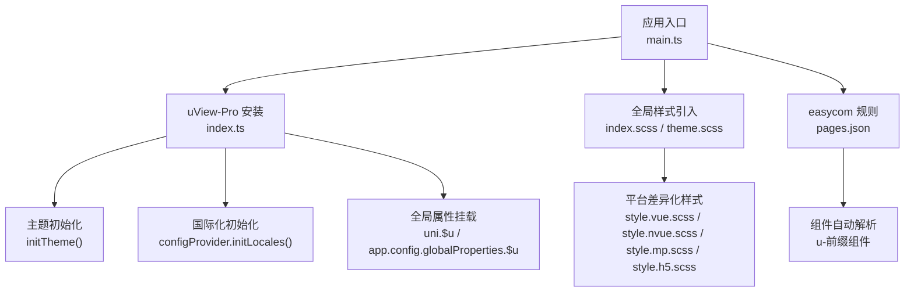
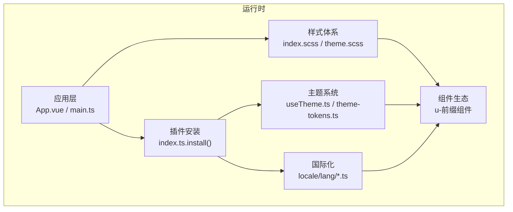
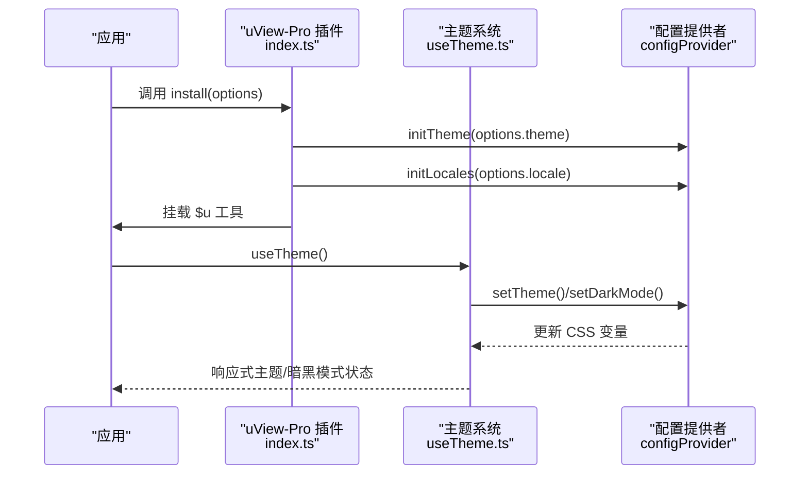
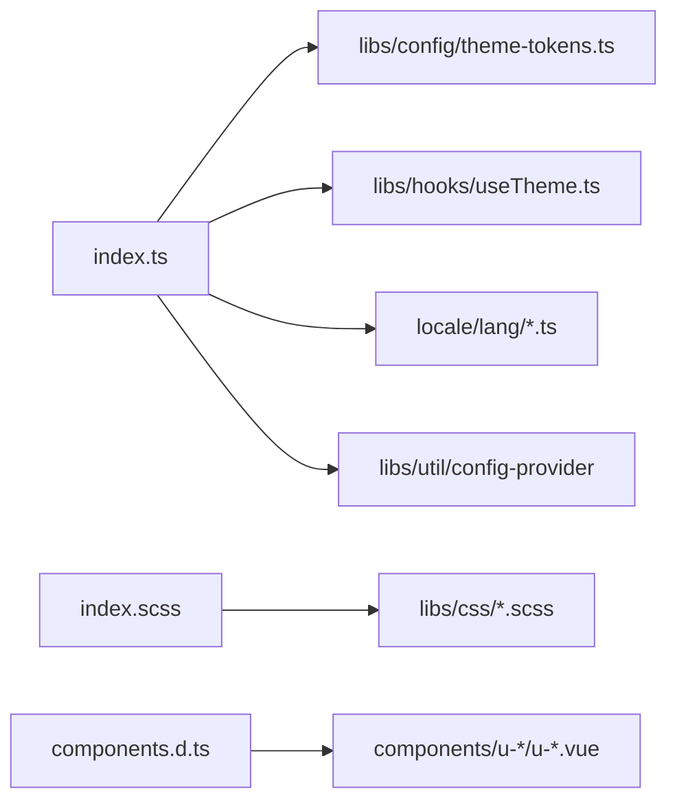

# uView-Pro组件库

<cite>
**本文引用的文件**
- [package.json](file://uni_modules/uview-pro/package.json)
- [readme.md](file://uni_modules/uview-pro/readme.md)
- [index.ts](file://uni_modules/uview-pro/index.ts)
- [index.scss](file://uni_modules/uview-pro/index.scss)
- [theme.scss](file://uni_modules/uview-pro/theme.scss)
- [components.d.ts](file://uni_modules/uview-pro/types/components.d.ts)
- [theme-tokens.ts](file://uni_modules/uview-pro/libs/config/theme-tokens.ts)
- [useTheme.ts](file://uni_modules/uview-pro/libs/hooks/useTheme.ts)
- [zh-CN.ts](file://uni_modules/uview-pro/locale/lang/zh-CN.ts)
- [en-US.ts](file://uni_modules/uview-pro/locale/lang/en-US.ts)
</cite>

## 目录
1. [简介](#简介)
2. [项目结构](#项目结构)
3. [核心组件](#核心组件)
4. [架构总览](#架构总览)
5. [组件详解](#组件详解)
6. [依赖关系分析](#依赖关系分析)
7. [性能考量](#性能考量)
8. [故障排查指南](#故障排查指南)
9. [结论](#结论)
10. [附录](#附录)

## 简介
uView-Pro 是基于 Vue3 + TypeScript 的高质量 uni-app 多端 UI 框架，提供 70+ 精选组件、便捷工具与常用页面模板，支持多主题、暗黑模式与国际化（i18n），覆盖 Android、iOS、鸿蒙及微信/支付宝/头条等主流小程序平台，真正实现“一套代码，多端运行”。本指南面向挪车助手项目的开发者，系统讲解安装配置、全局样式引入、easycom 自动引入机制、组件使用方法、属性与事件、插槽、按需引入与精简打包、多端兼容、主题系统、暗黑模式与国际化实现，并给出最佳实践。

## 项目结构
uView-Pro 在本项目中的位置为 uni_modules/uview-pro，包含组件源码、样式、类型声明、国际化语言包与主题配置等模块。关键入口与资源如下：
- 安装与注册入口：index.ts
- 全局样式入口：index.scss、theme.scss
- 组件类型声明：types/components.d.ts
- 主题系统：libs/config/theme-tokens.ts、libs/hooks/useTheme.ts
- 国际化：locale/lang/zh-CN.ts、locale/lang/en-US.ts
- 包描述与能力声明：package.json、readme.md

图表来源
- [index.ts:16-92](file://uni_modules/uview-pro/index.ts#L16-L92)
- [index.scss:1-27](file://uni_modules/uview-pro/index.scss#L1-L27)
- [theme.scss:1-117](file://uni_modules/uview-pro/theme.scss#L1-L117)
- [components.d.ts:1-106](file://uni_modules/uview-pro/types/components.d.ts#L1-L106)

章节来源
- [package.json:1-109](file://uni_modules/uview-pro/package.json#L1-L109)
- [readme.md:104-221](file://uni_modules/uview-pro/readme.md#L104-L221)

## 核心组件
本节概述 70+ 组件的分类与职责，帮助快速定位所需组件。以下为高频与典型组件类别（非完整列表）：
- 表单类：u-button、u-field、u-form、u-form-item、u-input、u-textarea、u-number-box、u-switch、u-checkbox、u-radio、u-picker、u-calendar、u-city-select、u-search、u-keyboard、u-number-keyboard、u-car-keyboard、u-verification-code、u-message-input
- 导航类：u-navbar、u-tabbar、u-tabs、u-tabs-swiper、u-steps、u-index-list、u-index-anchor、u-safe-bottom、u-status-bar
- 反馈类：u-toast、u-modal、u-top-tips、u-alert-tips、u-loading、u-loading-popup、u-loadmore、u-empty、u-no-network
- 布局类：u-row、u-col、u-grid、u-grid-item、u-gap、u-section、u-card、u-cell-group、u-cell-item
- 展示类：u-image、u-icon、u-text、u-badge、u-tag、u-line、u-divider、u-line-progress、u-circle-progress、u-skeleton、u-swiper、u-table、u-th、u-td、u-tr、u-time-line、u-time-line-item
- 交互类：u-action-sheet、u-action-sheet-item、u-popup、u-fab、u-back-top、u-sticky、u-swipe-action、u-dropdown、u-dropdown-item、u-rate、u-slider、u-subsection、u-pagination、u-full-screen、u-read-more
- 媒体类：u-lazy-load、u-avatar、u-avatar-cropper、u-upload
- 功能类：u-config-provider、u-transition、u-root-portal

章节来源
- [components.d.ts:1-106](file://uni_modules/uview-pro/types/components.d.ts#L1-L106)

## 架构总览
uView-Pro 的运行时架构围绕“安装注册 → 主题系统 → 国际化 → 样式体系 → 组件生态”展开。安装时通过 index.ts 初始化主题与国际化，并将 $u 工具挂载到全局；easycom 使组件按 u- 前缀自动解析；平台差异化样式通过 index.scss 条件编译引入；主题与暗黑模式由 useTheme.ts 提供响应式能力；国际化语言包由 locale 下的语言文件提供。

图表来源
- [index.ts:16-92](file://uni_modules/uview-pro/index.ts#L16-L92)
- [useTheme.ts:69-105](file://uni_modules/uview-pro/libs/hooks/useTheme.ts#L69-L105)
- [index.scss:1-27](file://uni_modules/uview-pro/index.scss#L1-L27)
- [theme.scss:1-117](file://uni_modules/uview-pro/theme.scss#L1-L117)
- [zh-CN.ts:1-131](file://uni_modules/uview-pro/locale/lang/zh-CN.ts#L1-L131)
- [en-US.ts:1-131](file://uni_modules/uview-pro/locale/lang/en-US.ts#L1-L131)

## 组件详解
以下为精选组件的使用要点与最佳实践，涵盖安装配置、全局样式引入、easycom 自动引入、属性配置、事件处理与插槽使用。为避免冗长，本节以“路径指引”的形式提供参考，具体属性与行为请参阅各组件的类型定义与文档。

### 安装与配置
- 安装方式：支持 npm 与 uni_modules 两种方式，安装后在应用入口引入并注册插件。
- 全局样式：在 uni.scss 中引入主题变量文件，在 App.vue 首行引入主样式文件。
- easycom：在 pages.json 中配置 u- 前缀组件的自动解析规则。
- Volar 类型：CLI 项目可在 tsconfig.json 中添加类型声明以获得全局类型提示。

章节来源
- [readme.md:108-208](file://uni_modules/uview-pro/readme.md#L108-L208)
- [index.ts:16-92](file://uni_modules/uview-pro/index.ts#L16-L92)

### 全局样式与平台差异化
- 主样式入口：index.scss 通过条件编译分别引入 Vue、nvue、小程序与 H5 的差异化样式。
- 主题变量：theme.scss 定义 CSS 变量与 SCSS 变量映射，用于主题与暗黑模式切换。

章节来源
- [index.scss:1-27](file://uni_modules/uview-pro/index.scss#L1-L27)
- [theme.scss:1-117](file://uni_modules/uview-pro/theme.scss#L1-L117)

### easycom 自动引入机制
- 规则：通过正则 "^u-(.*)": "uview-pro/components/u-$1/u-$1.vue" 实现按 u- 前缀自动解析。
- 注意事项：修改规则后需重启或重新编译；确保 pages.json 中只有一个 easycom 字段并置于 custom 内。

章节来源
- [readme.md:168-192](file://uni_modules/uview-pro/readme.md#L168-L192)

### 组件使用方法与最佳实践
- 直接使用：完成安装与 easycom 配置后，无需 import 与 components 注册，直接在模板中使用 u- 前缀组件。
- 属性配置：通过组件属性传递数据与行为控制；注意部分组件支持主题色与尺寸等主题相关属性。
- 事件处理：遵循 uni-app 事件规范，使用 @ 语法绑定事件回调。
- 插槽使用：利用具名插槽与作用域插槽实现灵活布局与内容定制。

章节来源
- [readme.md:210-221](file://uni_modules/uview-pro/readme.md#L210-L221)
- [components.d.ts:1-106](file://uni_modules/uview-pro/types/components.d.ts#L1-L106)

### 按需引入与精简打包
- 组件按需：easycom 已实现按需解析，减少显式 import 数量。
- 样式按需：通过 index.scss 的条件编译仅引入目标平台样式，避免不必要的包体膨胀。
- 主题与国际化：仅初始化所需主题与语言包，减少运行时开销。

章节来源
- [readme.md:36](file://uni_modules/uview-pro/readme.md#L36)
- [index.scss:6-24](file://uni_modules/uview-pro/index.scss#L6-L24)

### 多端兼容性
- 平台覆盖：Android、iOS、鸿蒙、H5、微信/支付宝/头条/QQ 等小程序。
- 条件编译：index.scss 中针对不同平台引入差异化样式，确保在各端表现一致。
- 能力声明：package.json 中明确声明支持的平台与版本。

章节来源
- [readme.md:31-36](file://uni_modules/uview-pro/readme.md#L31-L36)
- [package.json:51-106](file://uni_modules/uview-pro/package.json#L51-L106)
- [index.scss:6-24](file://uni_modules/uview-pro/index.scss#L6-L24)

### 主题系统与暗黑模式
- 主题初始化：index.ts 在安装时根据传入选项初始化主题；若未传入则使用内置默认主题。
- 主题令牌：theme-tokens.ts 定义亮色与暗色调色板与 CSS 变量映射。
- useTheme Hook：提供主题切换、持久化、暗黑模式设置与检测等能力。
- 样式注入：通过 CSS 变量与 SCSS 变量实现主题与暗黑模式的动态切换。

图表来源
- [index.ts:16-92](file://uni_modules/uview-pro/index.ts#L16-L92)
- [useTheme.ts:69-174](file://uni_modules/uview-pro/libs/hooks/useTheme.ts#L69-L174)
- [theme-tokens.ts:92-103](file://uni_modules/uview-pro/libs/config/theme-tokens.ts#L92-L103)

章节来源
- [index.ts:16-92](file://uni_modules/uview-pro/index.ts#L16-L92)
- [useTheme.ts:1-174](file://uni_modules/uview-pro/libs/hooks/useTheme.ts#L1-L174)
- [theme-tokens.ts:1-103](file://uni_modules/uview-pro/libs/config/theme-tokens.ts#L1-L103)

### 国际化（i18n）
- 语言包：提供 zh-CN 与 en-US 语言包，覆盖常见组件文案。
- 初始化：index.ts 在安装时根据 options.locale 初始化语言包；未提供时使用内置语言包。
- 使用：组件内部通过 $u.t 访问翻译；开发者可通过 configProvider 扩展或替换语言包。

章节来源
- [index.ts:55-75](file://uni_modules/uview-pro/index.ts#L55-L75)
- [zh-CN.ts:1-131](file://uni_modules/uview-pro/locale/lang/zh-CN.ts#L1-L131)
- [en-US.ts:1-131](file://uni_modules/uview-pro/locale/lang/en-US.ts#L1-L131)

### 典型组件使用路径指引
以下为精选组件的使用参考路径（不含代码片段，仅提供路径以便查阅）：
- u-button：[u-button.vue 类型定义](file://uni_modules/uview-pro/components/u-button/types.ts)
- u-form / u-form-item：[u-form.vue](file://uni_modules/uview-pro/components/u-form/u-form.vue)，[u-form-item.vue](file://uni_modules/uview-pro/components/u-form-item/u-form-item.vue)
- u-input / u-textarea：[u-input.vue 类型定义](file://uni_modules/uview-pro/components/u-input/types.ts)，[u-textarea.vue 类型定义](file://uni_modules/uview-pro/components/u-textarea/types.ts)
- u-grid / u-grid-item：[u-grid.vue](file://uni_modules/uview-pro/components/u-grid/u-grid.vue)，[u-grid-item.vue](file://uni_modules/uview-pro/components/u-grid-item/u-grid-item.vue)
- u-popup / u-modal：[u-popup.vue](file://uni_modules/uview-pro/components/u-popup/u-popup.vue)，[u-modal.vue](file://uni_modules/uview-pro/components/u-modal/u-modal.vue)
- u-toast / u-top-tips：[u-toast.vue](file://uni_modules/uview-pro/components/u-toast/u-toast.vue)，[u-top-tips.vue](file://uni_modules/uview-pro/components/u-top-tips/u-top-tips.vue)
- u-navbar / u-tabbar：[u-navbar.vue](file://uni_modules/uview-pro/components/u-navbar/u-navbar.vue)，[u-tabbar.vue](file://uni_modules/uview-pro/components/u-tabbar/u-tabbar.vue)
- u-swiper / u-steps：[u-swiper.vue](file://uni_modules/uview-pro/components/u-swiper/u-swiper.vue)，[u-steps.vue](file://uni_modules/uview-pro/components/u-steps/u-steps.vue)
- u-upload / u-verification-code：[u-upload.vue](file://uni_modules/uview-pro/components/u-upload/u-upload.vue)，[u-verification-code.vue](file://uni_modules/uview-pro/components/u-verification-code/u-verification-code.vue)
- u-config-provider：[u-config-provider.vue](file://uni_modules/uview-pro/components/u-config-provider/u-config-provider.vue)

章节来源
- [components.d.ts:1-106](file://uni_modules/uview-pro/types/components.d.ts#L1-L106)

## 依赖关系分析
uView-Pro 的依赖关系围绕“安装 → 主题 → 国际化 → 样式 → 组件”展开，形成清晰的分层耦合：

图表来源
- [index.ts:1-101](file://uni_modules/uview-pro/index.ts#L1-L101)
- [theme-tokens.ts:1-103](file://uni_modules/uview-pro/libs/config/theme-tokens.ts#L1-L103)
- [useTheme.ts:1-174](file://uni_modules/uview-pro/libs/hooks/useTheme.ts#L1-L174)
- [index.scss:1-27](file://uni_modules/uview-pro/index.scss#L1-L27)
- [components.d.ts:1-106](file://uni_modules/uview-pro/types/components.d.ts#L1-L106)

章节来源
- [index.ts:1-101](file://uni_modules/uview-pro/index.ts#L1-L101)
- [index.scss:1-27](file://uni_modules/uview-pro/index.scss#L1-L27)
- [components.d.ts:1-106](file://uni_modules/uview-pro/types/components.d.ts#L1-L106)

## 性能考量
- 按需解析：easycom 仅在使用时解析组件，减少初始加载负担。
- 样式按需：index.scss 通过条件编译仅引入目标平台样式，避免跨端冗余。
- 主题与国际化：仅初始化所需主题与语言包，降低运行时内存占用。
- 组件懒加载：对大组件（如 u-swiper、u-table）建议结合路由或页面懒加载策略使用。
- 图片与媒体：优先使用 u-image 的懒加载与占位图能力，减少首屏压力。

## 故障排查指南
- easycom 不生效
  - 检查 pages.json 中是否存在多个 easycom 字段，确保合并为单一配置并置于 custom 内。
  - 修改规则后需重启 HX 或重新编译项目。
  - 确认组件命名符合 u- 前缀规范。
- 样式异常
  - 确保在 uni.scss 中引入 theme.scss，在 App.vue 首行引入 index.scss。
  - 检查平台条件编译是否正确匹配目标端。
- 主题/暗黑模式不生效
  - 确认在安装时传入了正确的 theme 选项或使用默认主题。
  - 检查 useTheme 的 setTheme 与 setDarkMode 调用是否正确。
- 国际化文案未显示
  - 确认 options.locale 初始化正确，或使用内置语言包。
  - 检查组件内部是否正确调用 $u.t 进行翻译。

章节来源
- [readme.md:168-192](file://uni_modules/uview-pro/readme.md#L168-L192)
- [index.ts:55-85](file://uni_modules/uview-pro/index.ts#L55-L85)
- [useTheme.ts:44-146](file://uni_modules/uview-pro/libs/hooks/useTheme.ts#L44-L146)

## 结论
uView-Pro 为挪车助手项目提供了完善的多端 UI 能力，通过安装注册、easycom 自动引入、主题与国际化初始化、平台差异化样式等机制，实现了“开箱即用”的开发体验。建议在项目中遵循“按需引入 + 精简打包 + 主题与暗黑模式 + 国际化”的最佳实践，以获得更优的性能与维护性。

## 附录
- 快速上手与更多组件文档：请参考官方文档与快速启动模板。
- 版本与平台能力：详见 package.json 与 readme.md 中的能力声明与平台矩阵。

章节来源
- [readme.md:25-27](file://uni_modules/uview-pro/readme.md#L25-L27)
- [package.json:20-106](file://uni_modules/uview-pro/package.json#L20-L106)