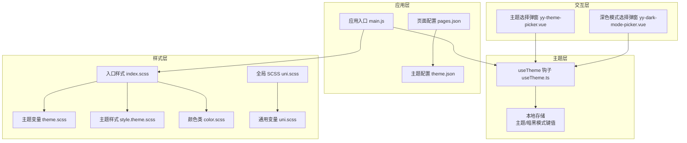
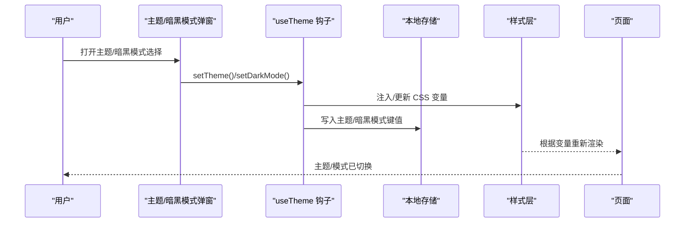
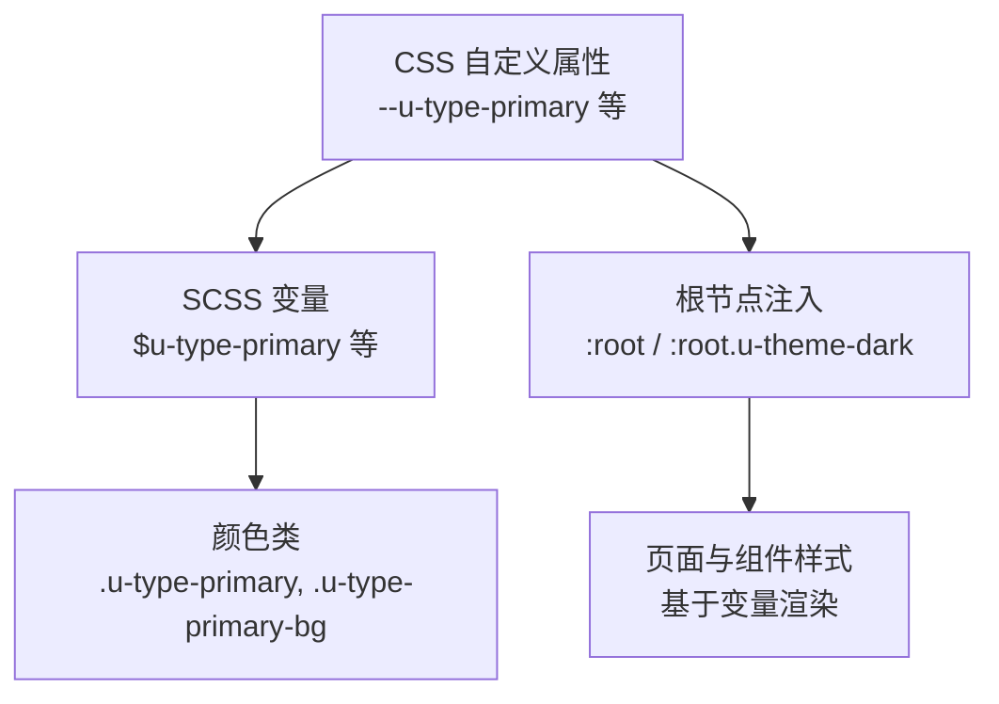
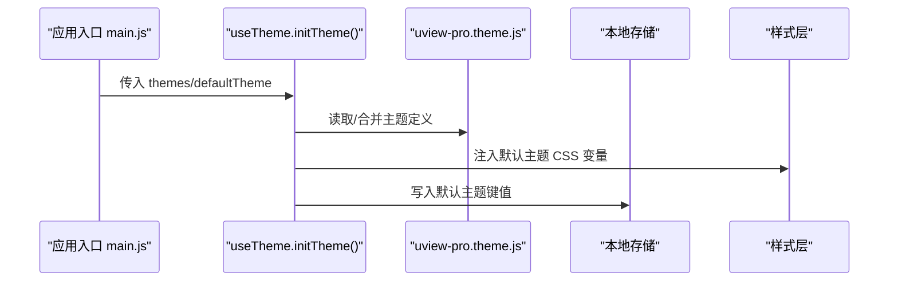
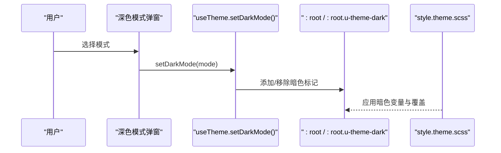
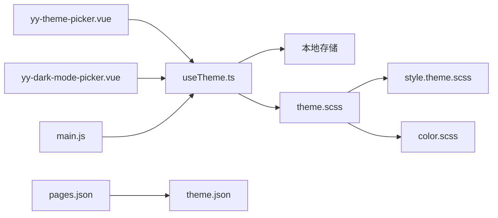

# 主题系统

<cite>
**本文档引用的文件**
- [uview-pro 主题变量 theme.scss](file://uni_modules/uview-pro/theme.scss)
- [uView-Pro 入口样式 index.scss](file://uni_modules/uview-pro/index.scss)
- [uView-Pro 主题样式 style.theme.scss](file://uni_modules/uview-pro/libs/css/style.theme.scss)
- [uView-Pro 颜色类样式 color.scss](file://uni_modules/uview-pro/libs/css/color.scss)
- [useTheme 钩子 useTheme.ts](file://uni_modules/uview-pro/libs/hooks/useTheme.ts)
- [应用入口 main.js](file://main.js)
- [全局 SCSS uni.scss](file://uni.scss)
- [通用 SCSS 变量 uni.scss](file://common/css/uni.scss)
- [主题配置 theme.json](file://theme.json)
- [页面配置 pages.json](file://pages.json)
- [自定义主题定义 uview-pro.theme.js](file://common/function/uview-pro.theme.js)
- [主题选择弹窗 yy-theme-picker.vue](file://components/yy-theme-picker.vue)
- [深色模式选择弹窗 yy-dark-mode-picker.vue](file://components/yy-dark-mode-picker.vue)
</cite>

## 目录
1. [简介](#简介)
2. [项目结构](#项目结构)
3. [核心组件](#核心组件)
4. [架构总览](#架构总览)
5. [详细组件分析](#详细组件分析)
6. [依赖关系分析](#依赖关系分析)
7. [性能考量](#性能考量)
8. [故障排查指南](#故障排查指南)
9. [结论](#结论)
10. [附录](#附录)

## 简介
本文件面向挪车助手项目的 uView-Pro 主题系统，系统性阐述主题定制机制与实现方案，涵盖 SCSS 变量体系、主题色配置、样式覆盖策略、暗黑模式实现与切换、多主题配置与动态切换、命名规范与作用域管理，以及最佳实践与常见问题处理。读者可据此快速完成主题定制、扩展与维护。

## 项目结构
主题系统由以下层次构成：
- 样式层：uView-Pro 提供统一的 SCSS 变量与颜色类，通过入口样式聚合引入。
- 主题层：通过 useTheme 钩子管理主题与暗黑模式状态，并持久化存储。
- 应用层：在应用启动时注册 uView-Pro 插件并注入主题配置；页面配置通过占位符引用主题变量。
- 交互层：提供主题选择与暗黑模式选择的弹窗组件，触发主题切换。

图表来源
- [应用入口 main.js:24-48](file://main.js#L24-L48)
- [uView-Pro 入口样式 index.scss:1-27](file://uni_modules/uview-pro/index.scss#L1-L27)
- [uView-Pro 主题变量 theme.scss:1-117](file://uni_modules/uview-pro/theme.scss#L1-L117)
- [uView-Pro 主题样式 style.theme.scss:1-57](file://uni_modules/uview-pro/libs/css/style.theme.scss#L1-L57)
- [uView-Pro 颜色类样式 color.scss:1-156](file://uni_modules/uview-pro/libs/css/color.scss#L1-L156)
- [useTheme 钩子 useTheme.ts:1-174](file://uni_modules/uview-pro/libs/hooks/useTheme.ts#L1-L174)
- [页面配置 pages.json:71-86](file://pages.json#L71-L86)
- [主题配置 theme.json:1-29](file://theme.json#L1-L29)
- [全局 SCSS uni.scss:1-14](file://uni.scss#L1-L14)
- [通用 SCSS 变量 uni.scss:1-39](file://common/css/uni.scss#L1-L39)
- [主题选择弹窗 yy-theme-picker.vue:1-106](file://components/yy-theme-picker.vue#L1-L106)
- [深色模式选择弹窗 yy-dark-mode-picker.vue:1-101](file://components/yy-dark-mode-picker.vue#L1-L101)

章节来源
- [应用入口 main.js:24-48](file://main.js#L24-L48)
- [uView-Pro 入口样式 index.scss:1-27](file://uni_modules/uview-pro/index.scss#L1-L27)
- [uView-Pro 主题变量 theme.scss:1-117](file://uni_modules/uview-pro/theme.scss#L1-L117)
- [uView-Pro 主题样式 style.theme.scss:1-57](file://uni_modules/uview-pro/libs/css/style.theme.scss#L1-L57)
- [uView-Pro 颜色类样式 color.scss:1-156](file://uni_modules/uview-pro/libs/css/color.scss#L1-L156)
- [useTheme 钩子 useTheme.ts:1-174](file://uni_modules/uview-pro/libs/hooks/useTheme.ts#L1-L174)
- [页面配置 pages.json:71-86](file://pages.json#L71-L86)
- [主题配置 theme.json:1-29](file://theme.json#L1-L29)
- [全局 SCSS uni.scss:1-14](file://uni.scss#L1-L14)
- [通用 SCSS 变量 uni.scss:1-39](file://common/css/uni.scss#L1-L39)
- [主题选择弹窗 yy-theme-picker.vue:1-106](file://components/yy-theme-picker.vue#L1-L106)
- [深色模式选择弹窗 yy-dark-mode-picker.vue:1-101](file://components/yy-dark-mode-picker.vue#L1-L101)

## 核心组件
- SCSS 变量与颜色类：提供主色、辅助色、背景色、文本色、边框色等统一变量，支持亮/暗两套配色。
- useTheme 钩子：提供主题初始化、切换、持久化、暗黑模式管理等能力。
- 主题选择弹窗：展示多主题列表，支持点击切换并持久化。
- 深色模式选择弹窗：支持“开启/自动/关闭”三种模式，实时更新根节点主题模式。
- 页面配置占位符：通过 pages.json 中的占位符引用主题变量，实现全局背景与导航栏风格联动。

章节来源
- [uView-Pro 主题变量 theme.scss:1-117](file://uni_modules/uview-pro/theme.scss#L1-L117)
- [uView-Pro 颜色类样式 color.scss:1-156](file://uni_modules/uview-pro/libs/css/color.scss#L1-L156)
- [useTheme 钩子 useTheme.ts:1-174](file://uni_modules/uview-pro/libs/hooks/useTheme.ts#L1-L174)
- [主题选择弹窗 yy-theme-picker.vue:1-106](file://components/yy-theme-picker.vue#L1-L106)
- [深色模式选择弹窗 yy-dark-mode-picker.vue:1-101](file://components/yy-dark-mode-picker.vue#L1-L101)
- [页面配置 pages.json:71-86](file://pages.json#L71-L86)

## 架构总览
主题系统采用“变量驱动 + 响应式状态 + 持久化”的架构：
- 变量层：通过 CSS 自定义属性与 SCSS 变量映射，形成跨平台一致的颜色语义。
- 状态层：useTheme 提供响应式主题与暗黑模式状态，自动注入 CSS 变量到根节点。
- 存储层：主题与暗黑模式分别持久化到本地存储，保证重启后状态恢复。
- 渲染层：页面样式与组件样式基于变量渲染，无需手动重写样式。

图表来源
- [useTheme 钩子 useTheme.ts:44-146](file://uni_modules/uview-pro/libs/hooks/useTheme.ts#L44-L146)
- [主题选择弹窗 yy-theme-picker.vue:97-102](file://components/yy-theme-picker.vue#L97-L102)
- [深色模式选择弹窗 yy-dark-mode-picker.vue:84-89](file://components/yy-dark-mode-picker.vue#L84-L89)
- [uView-Pro 主题变量 theme.scss:1-117](file://uni_modules/uview-pro/theme.scss#L1-L117)

## 详细组件分析

### SCSS 变量系统与颜色类
- 变量组织：提供纯色、文本色、边框色、遮罩色、背景色及主/警告/成功/错误/信息色系列，每类包含明/暗/禁用等变体。
- 映射机制：CSS 自定义属性与 SCSS 变量双向映射，确保在不同平台（H5/小程序/nvue）下均能生效。
- 颜色类：提供 u-type-* 与 u-bg-* 类，用于快速应用语义化颜色。

图表来源
- [uView-Pro 主题变量 theme.scss:5-117](file://uni_modules/uview-pro/theme.scss#L5-L117)
- [uView-Pro 颜色类样式 color.scss:1-156](file://uni_modules/uview-pro/libs/css/color.scss#L1-L156)
- [uView-Pro 主题样式 style.theme.scss:12-33](file://uni_modules/uview-pro/libs/css/style.theme.scss#L12-L33)

章节来源
- [uView-Pro 主题变量 theme.scss:1-117](file://uni_modules/uview-pro/theme.scss#L1-L117)
- [uView-Pro 颜色类样式 color.scss:1-156](file://uni_modules/uview-pro/libs/css/color.scss#L1-L156)
- [uView-Pro 主题样式 style.theme.scss:1-57](file://uni_modules/uview-pro/libs/css/style.theme.scss#L1-L57)

### 主题定制与多主题配置
- 主题定义：通过数组形式定义多个主题，每个主题包含名称、标签与颜色集合（主色、明/暗/禁用等）。
- 默认主题：在应用入口中指定默认主题名称。
- 动态切换：通过 useTheme.setTheme 切换主题，内部调用配置提供者并持久化。

图表来源
- [应用入口 main.js:27-33](file://main.js#L27-L33)
- [useTheme 钩子 useTheme.ts:69-105](file://uni_modules/uview-pro/libs/hooks/useTheme.ts#L69-L105)
- [自定义主题定义 uview-pro.theme.js:1-257](file://common/function/uview-pro.theme.js#L1-L257)

章节来源
- [应用入口 main.js:27-33](file://main.js#L27-L33)
- [useTheme 钩子 useTheme.ts:69-105](file://uni_modules/uview-pro/libs/hooks/useTheme.ts#L69-L105)
- [自定义主题定义 uview-pro.theme.js:1-257](file://common/function/uview-pro.theme.js#L1-L257)

### 暗黑模式实现与切换
- 模式类型：支持 'auto'(跟随系统)、'light'(亮色)、'dark'(暗色)。
- 根节点标记：通过在根节点添加 u-theme-dark 或 data-u-theme-mode='dark' 切换整站暗色。
- 选择器适配：针对 picker-view 等原生组件提供特定样式覆盖。
- 交互组件：提供深色模式选择弹窗，实时更新并持久化。

图表来源
- [深色模式选择弹窗 yy-dark-mode-picker.vue:84-89](file://components/yy-dark-mode-picker.vue#L84-L89)
- [useTheme 钩子 useTheme.ts:126-146](file://uni_modules/uview-pro/libs/hooks/useTheme.ts#L126-L146)
- [uView-Pro 主题样式 style.theme.scss:6-33](file://uni_modules/uview-pro/libs/css/style.theme.scss#L6-L33)

章节来源
- [深色模式选择弹窗 yy-dark-mode-picker.vue:1-101](file://components/yy-dark-mode-picker.vue#L1-L101)
- [useTheme 钩子 useTheme.ts:112-146](file://uni_modules/uview-pro/libs/hooks/useTheme.ts#L112-L146)
- [uView-Pro 主题样式 style.theme.scss:1-57](file://uni_modules/uview-pro/libs/css/style.theme.scss#L1-L57)

### 样式覆盖与作用域管理
- 入口聚合：index.scss 按平台条件引入不同样式文件，避免重复与冗余。
- 变量引入：uni.scss 引入 uView 主题变量与通用变量，确保全局一致性。
- 组件样式：组件样式基于变量渲染，避免硬编码颜色，提升可维护性。
- 页面占位符：pages.json 中的 backgroundColor、navigationBarBackgroundColor 等使用占位符，最终由主题配置填充。

章节来源
- [uView-Pro 入口样式 index.scss:1-27](file://uni_modules/uview-pro/index.scss#L1-L27)
- [全局 SCSS uni.scss:1-14](file://uni.scss#L1-L14)
- [通用 SCSS 变量 uni.scss:1-39](file://common/css/uni.scss#L1-L39)
- [页面配置 pages.json:71-86](file://pages.json#L71-L86)

### 主题变量命名规范与最佳实践
- 命名规范
  - 颜色变量：以 u-type- 前缀 + 语义词（primary/warning/success/error/info）+ 变体（light/dark/disabled）组合。
  - 背景与文本：以 u-bg- / u-main-color / u-content-color / u-tips-color / u-light-color 等语义化前缀。
  - 平台适配：通过条件编译（H5/MP/APP-NVUE/H5）引入对应样式文件，避免冲突。
- 作用域管理
  - 变量在 :root/page 中声明，组件通过类名或变量引用，避免全局污染。
  - 暗黑模式通过根节点标记控制，局部组件可通过 u-theme-dark 类覆盖。
- 最佳实践
  - 优先使用语义化变量与颜色类，减少直接硬编码。
  - 新增主题时保持颜色集合完整（light/dark/disabled），确保交互一致性。
  - 在 pages.json 中仅使用占位符引用主题变量，避免硬编码。
  - 使用 useTheme 管理主题与暗黑模式状态，统一持久化。

章节来源
- [uView-Pro 主题变量 theme.scss:1-117](file://uni_modules/uview-pro/theme.scss#L1-L117)
- [uView-Pro 颜色类样式 color.scss:1-156](file://uni_modules/uview-pro/libs/css/color.scss#L1-L156)
- [uView-Pro 入口样式 index.scss:1-27](file://uni_modules/uview-pro/index.scss#L1-L27)
- [页面配置 pages.json:71-86](file://pages.json#L71-L86)

## 依赖关系分析
- useTheme 依赖配置提供者与本地存储，负责主题与暗黑模式的状态管理与持久化。
- 主题选择弹窗与深色模式弹窗通过 useTheme 提供的方法进行主题切换与模式切换。
- 样式层依赖 SCSS 变量与 CSS 自定义属性，通过根节点注入实现全局生效。
- 页面配置依赖 theme.json 的占位符解析，最终由主题系统填充实际值。

图表来源
- [主题选择弹窗 yy-theme-picker.vue:75-102](file://components/yy-theme-picker.vue#L75-L102)
- [深色模式选择弹窗 yy-dark-mode-picker.vue:52-89](file://components/yy-dark-mode-picker.vue#L52-L89)
- [useTheme 钩子 useTheme.ts:1-174](file://uni_modules/uview-pro/libs/hooks/useTheme.ts#L1-L174)
- [uView-Pro 主题变量 theme.scss:1-117](file://uni_modules/uview-pro/theme.scss#L1-L117)
- [uView-Pro 主题样式 style.theme.scss:1-57](file://uni_modules/uview-pro/libs/css/style.theme.scss#L1-L57)
- [uView-Pro 颜色类样式 color.scss:1-156](file://uni_modules/uview-pro/libs/css/color.scss#L1-L156)
- [页面配置 pages.json:71-86](file://pages.json#L71-L86)
- [主题配置 theme.json:1-29](file://theme.json#L1-L29)
- [应用入口 main.js:24-48](file://main.js#L24-L48)

章节来源
- [主题选择弹窗 yy-theme-picker.vue:1-106](file://components/yy-theme-picker.vue#L1-L106)
- [深色模式选择弹窗 yy-dark-mode-picker.vue:1-101](file://components/yy-dark-mode-picker.vue#L1-L101)
- [useTheme 钩子 useTheme.ts:1-174](file://uni_modules/uview-pro/libs/hooks/useTheme.ts#L1-L174)
- [uView-Pro 主题变量 theme.scss:1-117](file://uni_modules/uview-pro/theme.scss#L1-L117)
- [uView-Pro 主题样式 style.theme.scss:1-57](file://uni_modules/uview-pro/libs/css/style.theme.scss#L1-L57)
- [uView-Pro 颜色类样式 color.scss:1-156](file://uni_modules/uview-pro/libs/css/color.scss#L1-L156)
- [页面配置 pages.json:71-86](file://pages.json#L71-L86)
- [主题配置 theme.json:1-29](file://theme.json#L1-L29)
- [应用入口 main.js:24-48](file://main.js#L24-L48)

## 性能考量
- 变量复用：通过统一变量与颜色类减少重复样式计算，降低包体体积。
- 条件引入：按平台条件引入样式文件，避免不必要的样式注入。
- 持久化：主题与暗黑模式状态持久化，减少重复初始化成本。
- 渐进增强：暗黑模式切换通过根节点标记实现，避免逐组件重绘。

## 故障排查指南
- 主题不生效
  - 检查是否正确引入入口样式与主题变量文件。
  - 确认 useTheme.initTheme 是否被调用且传入了有效的主题数组。
  - 核对 pages.json 中占位符是否正确映射至 theme.json。
- 暗黑模式无效
  - 确认根节点是否存在 u-theme-dark 或 data-u-theme-mode='dark' 标记。
  - 检查 style.theme.scss 中针对暗色的覆盖规则是否生效。
- 切换后样式异常
  - 确保使用 useTheme.setTheme/setDarkMode 进行切换，而非直接修改 CSS。
  - 检查本地存储键值是否被意外清除或覆盖。
- 页面背景与导航栏不匹配
  - 确认 pages.json 的占位符与 theme.json 对应键一致。
  - 检查 uni.scss 是否正确引入主题变量。

章节来源
- [uView-Pro 入口样式 index.scss:1-27](file://uni_modules/uview-pro/index.scss#L1-L27)
- [useTheme 钩子 useTheme.ts:44-146](file://uni_modules/uview-pro/libs/hooks/useTheme.ts#L44-L146)
- [页面配置 pages.json:71-86](file://pages.json#L71-L86)
- [主题配置 theme.json:1-29](file://theme.json#L1-L29)
- [uView-Pro 主题样式 style.theme.scss:1-57](file://uni_modules/uview-pro/libs/css/style.theme.scss#L1-L57)

## 结论
本主题系统以 SCSS 变量与 CSS 自定义属性为核心，结合 useTheme 钩子实现主题与暗黑模式的动态管理与持久化，配合弹窗组件提供直观的交互体验。通过统一的命名规范与作用域管理，既保证了开发效率，也提升了可维护性。建议在后续迭代中持续完善主题集合与暗黑模式覆盖范围，确保在各平台与设备上的视觉一致性。

## 附录
- 完整主题定制示例路径
  - 自定义主题定义：[自定义主题定义 uview-pro.theme.js:1-257](file://common/function/uview-pro.theme.js#L1-L257)
  - 应用入口配置：[应用入口 main.js:27-33](file://main.js#L27-L33)
  - 样式变量与颜色类：[uView-Pro 主题变量 theme.scss:1-117](file://uni_modules/uview-pro/theme.scss#L1-L117)、[uView-Pro 颜色类样式 color.scss:1-156](file://uni_modules/uview-pro/libs/css/color.scss#L1-L156)
  - 暗黑模式样式覆盖：[uView-Pro 主题样式 style.theme.scss:1-57](file://uni_modules/uview-pro/libs/css/style.theme.scss#L1-L57)
  - 页面占位符引用：[页面配置 pages.json:71-86](file://pages.json#L71-L86)、[主题配置 theme.json:1-29](file://theme.json#L1-L29)
- 交互组件
  - 主题选择弹窗：[主题选择弹窗 yy-theme-picker.vue:1-106](file://components/yy-theme-picker.vue#L1-L106)
  - 深色模式选择弹窗：[深色模式选择弹窗 yy-dark-mode-picker.vue:1-101](file://components/yy-dark-mode-picker.vue#L1-L101)