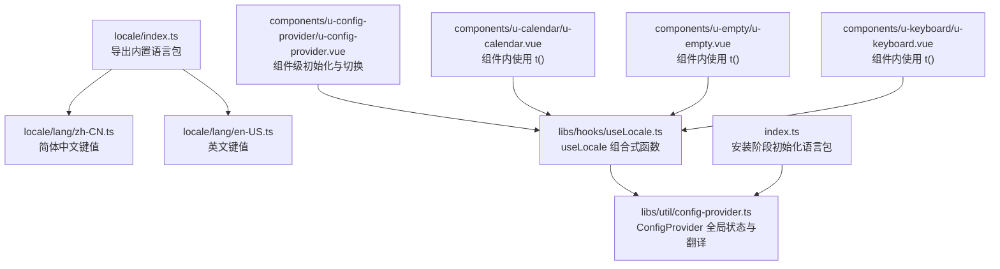
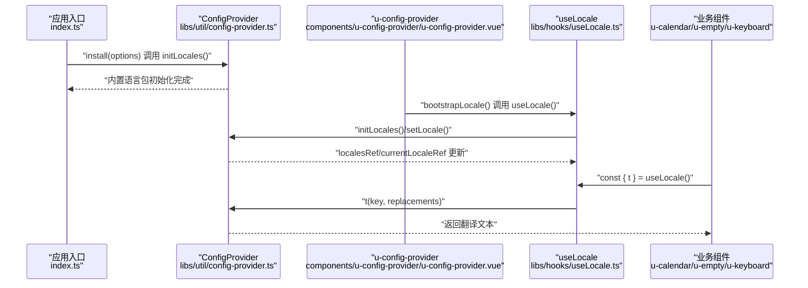
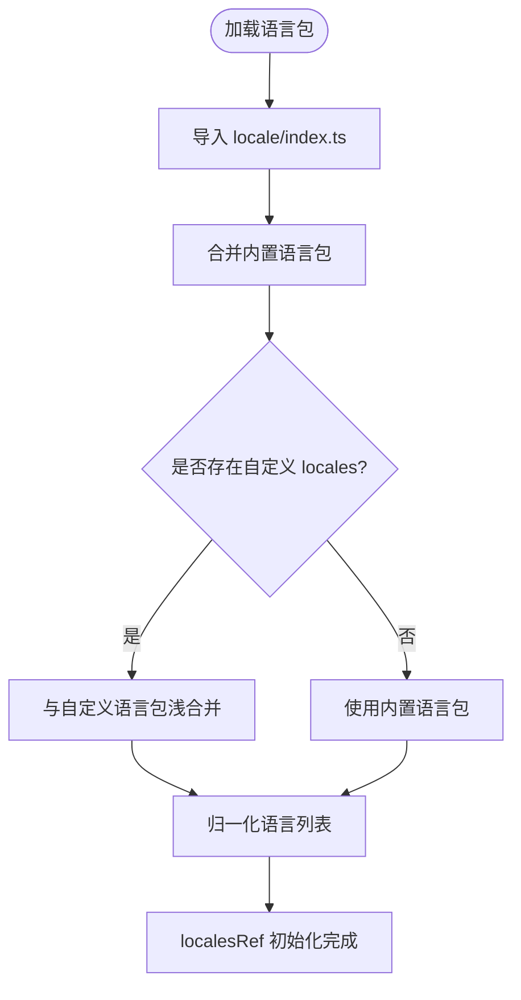
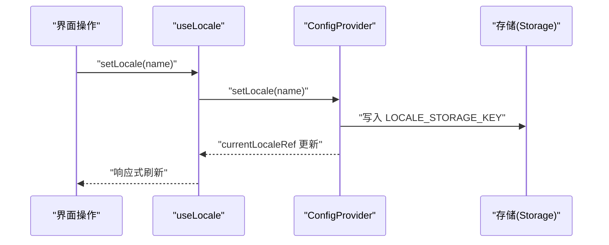
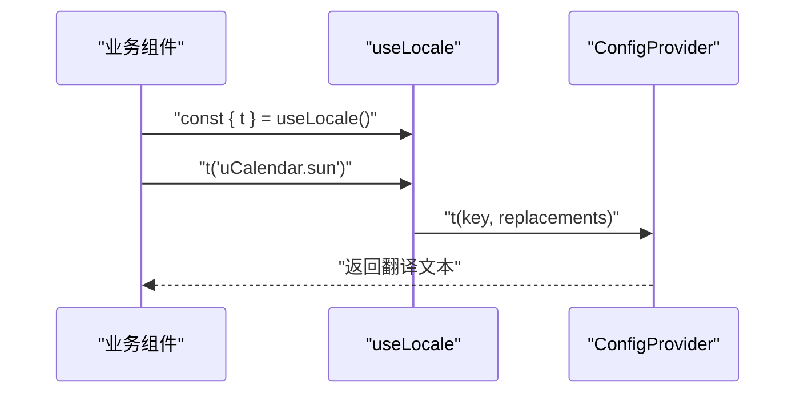
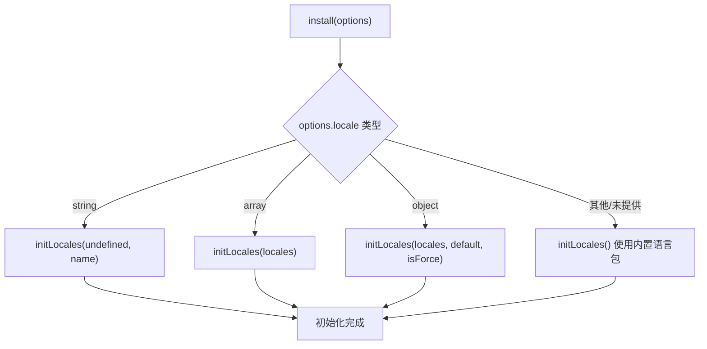
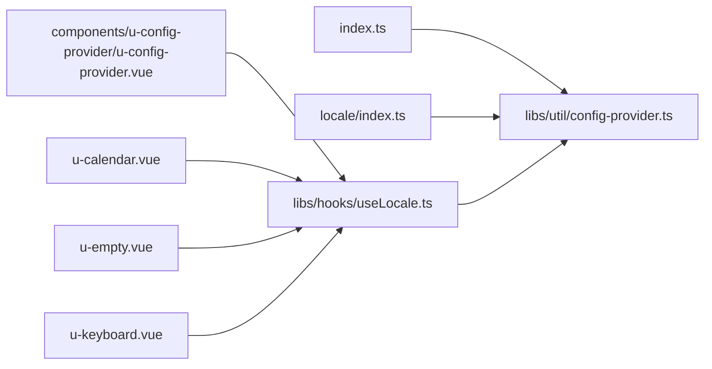

# 国际化系统

<cite>
**本文档引用的文件**
- [locale/index.ts](file://uni_modules/uview-pro/locale/index.ts)
- [locale/lang/zh-CN.ts](file://uni_modules/uview-pro/locale/lang/zh-CN.ts)
- [locale/lang/en-US.ts](file://uni_modules/uview-pro/locale/lang/en-US.ts)
- [libs/hooks/useLocale.ts](file://uni_modules/uview-pro/libs/hooks/useLocale.ts)
- [libs/util/config-provider.ts](file://uni_modules/uview-pro/libs/util/config-provider.ts)
- [components/u-config-provider/u-config-provider.vue](file://uni_modules/uview-pro/components/u-config-provider/u-config-provider.vue)
- [index.ts](file://uni_modules/uview-pro/index.ts)
- [components/u-calendar/u-calendar.vue](file://uni_modules/uview-pro/components/u-calendar/u-calendar.vue)
- [components/u-empty/u-empty.vue](file://uni_modules/uview-pro/components/u-empty/u-empty.vue)
- [components/u-keyboard/u-keyboard.vue](file://uni_modules/uview-pro/components/u-keyboard/u-keyboard.vue)
</cite>

## 目录
1. [简介](#简介)
2. [项目结构](#项目结构)
3. [核心组件](#核心组件)
4. [架构总览](#架构总览)
5. [详细组件分析](#详细组件分析)
6. [依赖关系分析](#依赖关系分析)
7. [性能考量](#性能考量)
8. [故障排查指南](#故障排查指南)
9. [结论](#结论)
10. [附录](#附录)

## 简介
本文件面向挪车助手项目，系统性梳理 uView-Pro 的国际化（i18n）体系，涵盖语言包结构、翻译键值组织、动态语言切换、平台差异与注意事项、组件使用方法与最佳实践、翻译文件管理策略、批量翻译工具建议以及本地化测试方法。目标是帮助开发者快速理解并高效维护多语言能力。

## 项目结构
uView-Pro 的国际化能力由以下模块协同实现：
- 语言包导出与组织：locale/index.ts 汇总导出内置语言包；locale/lang 下按区域语言存放具体键值。
- 国际化组合式函数：libs/hooks/useLocale.ts 提供 t、setLocale、initLocales 等能力。
- 全局配置提供者：libs/util/config-provider.ts 实现语言包初始化、切换、持久化与翻译函数。
- 应用入口集成：index.ts 在安装阶段初始化主题与语言包。
- 配置容器组件：components/u-config-provider/u-config-provider.vue 在组件层面接管语言包初始化与切换。
- 组件级使用：各业务组件通过 useLocale() 获取 t() 翻译函数并渲染文案。

**图示来源**
- [locale/index.ts:1-3](file://uni_modules/uview-pro/locale/index.ts#L1-L3)
- [locale/lang/zh-CN.ts:1-131](file://uni_modules/uview-pro/locale/lang/zh-CN.ts#L1-L131)
- [locale/lang/en-US.ts:1-131](file://uni_modules/uview-pro/locale/lang/en-US.ts#L1-L131)
- [libs/hooks/useLocale.ts:1-35](file://uni_modules/uview-pro/libs/hooks/useLocale.ts#L1-L35)
- [libs/util/config-provider.ts:1-805](file://uni_modules/uview-pro/libs/util/config-provider.ts#L1-L805)
- [index.ts:1-101](file://uni_modules/uview-pro/index.ts#L1-L101)
- [components/u-config-provider/u-config-provider.vue:1-190](file://uni_modules/uview-pro/components/u-config-provider/u-config-provider.vue#L1-L190)
- [components/u-calendar/u-calendar.vue:260-459](file://uni_modules/uview-pro/components/u-calendar/u-calendar.vue#L260-L459)
- [components/u-empty/u-empty.vue:35-109](file://uni_modules/uview-pro/components/u-empty/u-empty.vue#L35-L109)
- [components/u-keyboard/u-keyboard.vue:60-195](file://uni_modules/uview-pro/components/u-keyboard/u-keyboard.vue#L60-L195)

**章节来源**
- [locale/index.ts:1-3](file://uni_modules/uview-pro/locale/index.ts#L1-L3)
- [locale/lang/zh-CN.ts:1-131](file://uni_modules/uview-pro/locale/lang/zh-CN.ts#L1-L131)
- [locale/lang/en-US.ts:1-131](file://uni_modules/uview-pro/locale/lang/en-US.ts#L1-L131)
- [libs/hooks/useLocale.ts:1-35](file://uni_modules/uview-pro/libs/hooks/useLocale.ts#L1-L35)
- [libs/util/config-provider.ts:1-805](file://uni_modules/uview-pro/libs/util/config-provider.ts#L1-L805)
- [index.ts:1-101](file://uni_modules/uview-pro/index.ts#L1-L101)
- [components/u-config-provider/u-config-provider.vue:1-190](file://uni_modules/uview-pro/components/u-config-provider/u-config-provider.vue#L1-L190)

## 核心组件
- 语言包导出与组织
  - locale/index.ts 汇总导出内置语言包，便于统一引入与扩展。
  - locale/lang/zh-CN.ts 与 locale/lang/en-US.ts 定义各语言的键值对，采用分层命名空间组织（如 uCalendar、uEmpty 等组件级命名空间）。
- useLocale 组合式函数
  - 提供 t(key, replacements, localeName?)、setLocale(name)、initLocales(...)、getLocales()、getCurrentLocale() 等能力，支持命名空间拼接与替换占位符。
- ConfigProvider 全局状态与翻译
  - 负责 localesRef/currentLocaleRef 的初始化、切换、持久化与翻译函数 t(key, replacements, localeName?) 的实现。
  - 支持内置语言包与自定义语言包合并，自动归一化语言列表。
- 安装阶段初始化
  - index.ts 在插件安装时根据 options.locale 初始化语言包，若未提供则使用内置语言包。
- 配置容器组件
  - components/u-config-provider/u-config-provider.vue 在组件挂载时执行国际化初始化，并监听 props.locales 与 currentLocale 的变化，实现组件级动态切换。

**章节来源**
- [locale/index.ts:1-3](file://uni_modules/uview-pro/locale/index.ts#L1-L3)
- [locale/lang/zh-CN.ts:1-131](file://uni_modules/uview-pro/locale/lang/zh-CN.ts#L1-L131)
- [locale/lang/en-US.ts:1-131](file://uni_modules/uview-pro/locale/lang/en-US.ts#L1-L131)
- [libs/hooks/useLocale.ts:1-35](file://uni_modules/uview-pro/libs/hooks/useLocale.ts#L1-L35)
- [libs/util/config-provider.ts:217-367](file://uni_modules/uview-pro/libs/util/config-provider.ts#L217-L367)
- [index.ts:55-85](file://uni_modules/uview-pro/index.ts#L55-L85)
- [components/u-config-provider/u-config-provider.vue:82-162](file://uni_modules/uview-pro/components/u-config-provider/u-config-provider.vue#L82-L162)

## 架构总览
uView-Pro 的国际化采用“组合式函数 + 全局配置提供者”的设计，组件通过 useLocale 获取翻译能力，ConfigProvider 统一管理语言包与当前语言，支持懒初始化、持久化与动态切换。

**图示来源**
- [index.ts:55-85](file://uni_modules/uview-pro/index.ts#L55-L85)
- [libs/util/config-provider.ts:222-367](file://uni_modules/uview-pro/libs/util/config-provider.ts#L222-L367)
- [components/u-config-provider/u-config-provider.vue:82-101](file://uni_modules/uview-pro/components/u-config-provider/u-config-provider.vue#L82-L101)
- [libs/hooks/useLocale.ts:11-34](file://uni_modules/uview-pro/libs/hooks/useLocale.ts#L11-L34)
- [components/u-calendar/u-calendar.vue:269](file://uni_modules/uview-pro/components/u-calendar/u-calendar.vue#L269-L269)

## 详细组件分析

### 语言包结构与键值组织
- 语言包采用模块化导出，locale/index.ts 汇总导出 zhCN 与 enUS。
- 各语言文件以组件命名空间为一级键，二级键为具体文案标识，形成清晰的层次结构。
- 示例键值组织：
  - zh-CN.ts 中包含 uCalendar、uEmpty、uKeyboard 等组件的文案键。
  - en-US.ts 保持相同的键结构，便于替换与对比。

**图示来源**
- [locale/index.ts:1-3](file://uni_modules/uview-pro/locale/index.ts#L1-L3)
- [locale/lang/zh-CN.ts:1-131](file://uni_modules/uview-pro/locale/lang/zh-CN.ts#L1-L131)
- [locale/lang/en-US.ts:1-131](file://uni_modules/uview-pro/locale/lang/en-US.ts#L1-L131)
- [libs/util/config-provider.ts:251-296](file://uni_modules/uview-pro/libs/util/config-provider.ts#L251-L296)

**章节来源**
- [locale/index.ts:1-3](file://uni_modules/uview-pro/locale/index.ts#L1-L3)
- [locale/lang/zh-CN.ts:1-131](file://uni_modules/uview-pro/locale/lang/zh-CN.ts#L1-L131)
- [locale/lang/en-US.ts:1-131](file://uni_modules/uview-pro/locale/lang/en-US.ts#L1-L131)
- [libs/util/config-provider.ts:251-296](file://uni_modules/uview-pro/libs/util/config-provider.ts#L251-L296)

### 动态语言切换实现
- useLocale 暴露 setLocale(name)，内部委托 ConfigProvider.setLocale。
- ConfigProvider.setLocale 会持久化当前语言到存储，并更新 currentLocaleRef。
- 组件通过响应式引用 currentLocaleRef 获取当前语言，从而实现全局切换。

**图示来源**
- [libs/hooks/useLocale.ts:28](file://uni_modules/uview-pro/libs/hooks/useLocale.ts#L28-L28)
- [libs/util/config-provider.ts:315-328](file://uni_modules/uview-pro/libs/util/config-provider.ts#L315-L328)

**章节来源**
- [libs/hooks/useLocale.ts:21-33](file://uni_modules/uview-pro/libs/hooks/useLocale.ts#L21-L33)
- [libs/util/config-provider.ts:315-328](file://uni_modules/uview-pro/libs/util/config-provider.ts#L315-L328)

### 组件级翻译流程
- 业务组件在 setup 中通过 useLocale 获取 t 函数。
- 通过 t('组件命名空间.键') 的形式读取对应语言包中的文案。
- 支持占位符替换（数组或对象），并在 ConfigProvider.t 中实现。

**图示来源**
- [components/u-calendar/u-calendar.vue:269](file://uni_modules/uview-pro/components/u-calendar/u-calendar.vue#L269-L269)
- [components/u-empty/u-empty.vue:43](file://uni_modules/uview-pro/components/u-empty/u-empty.vue#L43-L43)
- [components/u-keyboard/u-keyboard.vue:98](file://uni_modules/uview-pro/components/u-keyboard/u-keyboard.vue#L98-L98)
- [libs/hooks/useLocale.ts:13-19](file://uni_modules/uview-pro/libs/hooks/useLocale.ts#L13-L19)
- [libs/util/config-provider.ts:335-367](file://uni_modules/uview-pro/libs/util/config-provider.ts#L335-L367)

**章节来源**
- [components/u-calendar/u-calendar.vue:269-304](file://uni_modules/uview-pro/components/u-calendar/u-calendar.vue#L269-L304)
- [components/u-empty/u-empty.vue:43-84](file://uni_modules/uview-pro/components/u-empty/u-empty.vue#L43-L84)
- [components/u-keyboard/u-keyboard.vue:98](file://uni_modules/uview-pro/components/u-keyboard/u-keyboard.vue#L98-L98)
- [libs/hooks/useLocale.ts:11-19](file://uni_modules/uview-pro/libs/hooks/useLocale.ts#L11-L19)
- [libs/util/config-provider.ts:335-367](file://uni_modules/uview-pro/libs/util/config-provider.ts#L335-L367)

### 安装与初始化流程
- index.ts 在插件安装时根据 options.locale 初始化语言包：
  - 若为字符串：按默认语言名初始化。
  - 若为数组：按自定义语言包列表初始化。
  - 若为对象：支持 locales、defaultLocale、isForce 等配置。
  - 若未提供：仍初始化内置语言包以保证可用。
- ConfigProvider.initLocales 负责语言包归一化与默认语言选择。

**图示来源**
- [index.ts:55-85](file://uni_modules/uview-pro/index.ts#L55-L85)
- [libs/util/config-provider.ts:222-246](file://uni_modules/uview-pro/libs/util/config-provider.ts#L222-L246)

**章节来源**
- [index.ts:55-85](file://uni_modules/uview-pro/index.ts#L55-L85)
- [libs/util/config-provider.ts:222-246](file://uni_modules/uview-pro/libs/util/config-provider.ts#L222-L246)

### 平台差异与注意事项
- 存储与持久化：ConfigProvider 通过 uni.get/setStorageSync 进行语言持久化，确保切换后重启仍保持。
- 懒初始化：若未显式初始化，ConfigProvider.t 会在首次调用时尝试懒初始化内置语言包，避免空引用。
- 组件级初始化：u-config-provider.vue 在 onMounted 时执行 bootstrapLocale，优先使用传入的 locales 与 currentLocale，避免重复初始化。
- 占位符替换：支持数组与对象两种占位符替换，满足不同语言的语法差异。

**章节来源**
- [libs/util/config-provider.ts:673-694](file://uni_modules/uview-pro/libs/util/config-provider.ts#L673-L694)
- [libs/util/config-provider.ts:335-367](file://uni_modules/uview-pro/libs/util/config-provider.ts#L335-L367)
- [components/u-config-provider/u-config-provider.vue:82-101](file://uni_modules/uview-pro/components/u-config-provider/u-config-provider.vue#L82-L101)

## 依赖关系分析
- useLocale 依赖 ConfigProvider 提供的全局状态与翻译函数。
- ConfigProvider 依赖 locale/index.ts 导入内置语言包，并可与自定义语言包合并。
- 安装阶段 index.ts 与组件级 u-config-provider.vue 分别负责应用级与组件级的初始化。
- 业务组件通过 useLocale 间接依赖 ConfigProvider 的响应式状态。

**图示来源**
- [index.ts:55-85](file://uni_modules/uview-pro/index.ts#L55-L85)
- [libs/util/config-provider.ts:11](file://uni_modules/uview-pro/libs/util/config-provider.ts#L11-L11)
- [libs/hooks/useLocale.ts:11-34](file://uni_modules/uview-pro/libs/hooks/useLocale.ts#L11-L34)
- [components/u-config-provider/u-config-provider.vue:82-101](file://uni_modules/uview-pro/components/u-config-provider/u-config-provider.vue#L82-L101)
- [components/u-calendar/u-calendar.vue:269](file://uni_modules/uview-pro/components/u-calendar/u-calendar.vue#L269-L269)
- [components/u-empty/u-empty.vue:43](file://uni_modules/uview-pro/components/u-empty/u-empty.vue#L43-L43)
- [components/u-keyboard/u-keyboard.vue:98](file://uni_modules/uview-pro/components/u-keyboard/u-keyboard.vue#L98-L98)

**章节来源**
- [index.ts:55-85](file://uni_modules/uview-pro/index.ts#L55-L85)
- [libs/util/config-provider.ts:11](file://uni_modules/uview-pro/libs/util/config-provider.ts#L11-L11)
- [libs/hooks/useLocale.ts:11-34](file://uni_modules/uview-pro/libs/hooks/useLocale.ts#L11-L34)
- [components/u-config-provider/u-config-provider.vue:82-101](file://uni_modules/uview-pro/components/u-config-provider/u-config-provider.vue#L82-L101)
- [components/u-calendar/u-calendar.vue:269](file://uni_modules/uview-pro/components/u-calendar/u-calendar.vue#L269-L269)
- [components/u-empty/u-empty.vue:43](file://uni_modules/uview-pro/components/u-empty/u-empty.vue#L43-L43)
- [components/u-keyboard/u-keyboard.vue:98](file://uni_modules/uview-pro/components/u-keyboard/u-keyboard.vue#L98-L98)

## 性能考量
- 懒初始化：ConfigProvider.t 在首次调用时尝试懒初始化内置语言包，避免应用启动时的额外开销。
- 响应式更新：localesRef/currentLocaleRef 为响应式引用，组件仅在语言切换时触发局部更新。
- 存储读写：语言持久化使用 uni.get/setStorageSync，避免频繁 IO；仅在切换语言时写入。
- 合并策略：normalizeLocales 对相同 name 的语言包进行浅合并，减少冗余与内存占用。

**章节来源**
- [libs/util/config-provider.ts:335-367](file://uni_modules/uview-pro/libs/util/config-provider.ts#L335-L367)
- [libs/util/config-provider.ts:251-296](file://uni_modules/uview-pro/libs/util/config-provider.ts#L251-L296)

## 故障排查指南
- 语言包未初始化
  - 现象：t 返回原始 key。
  - 排查：确认 index.ts 或 u-config-provider.vue 已执行 initLocales；检查 options.locale 配置。
- 语言切换无效
  - 现象：调用 setLocale 后界面未更新。
  - 排查：确认 localesRef 已初始化且包含目标语言；检查存储写入是否成功。
- 占位符未替换
  - 现象：文案中 {0}、{name} 未替换。
  - 排查：确认 replacements 类型正确（数组或对象）；检查 t 调用处传参。
- 自定义语言包合并异常
  - 现象：自定义语言包未生效或字段丢失。
  - 排查：确认自定义语言包包含 name 字段；检查 normalizeLocales 合并逻辑。

**章节来源**
- [libs/util/config-provider.ts:335-367](file://uni_modules/uview-pro/libs/util/config-provider.ts#L335-L367)
- [libs/util/config-provider.ts:251-296](file://uni_modules/uview-pro/libs/util/config-provider.ts#L251-L296)

## 结论
uView-Pro 的国际化系统通过“组合式函数 + 全局配置提供者”的架构，实现了语言包的模块化组织、动态初始化与切换、持久化与组件级响应式更新。其设计兼顾易用性与扩展性，适合在多端（H5、App、小程序）环境中稳定运行。遵循本文档的最佳实践与排错建议，可高效维护与扩展多语言能力。

## 附录

### 如何添加新语言支持
- 在 locale/lang 下新增语言文件（如 fr-FR.ts），保持与现有语言一致的键结构。
- 在 locale/index.ts 中导出新增语言包。
- 在安装阶段通过 options.locale 传入新增语言包，或在组件级通过 u-config-provider 的 locales 属性注入。
- 若需覆盖内置语言包，可在自定义语言包中提供相同 name 的对象，ConfigProvider 会进行浅合并。

**章节来源**
- [locale/index.ts:1-3](file://uni_modules/uview-pro/locale/index.ts#L1-L3)
- [locale/lang/zh-CN.ts:1-131](file://uni_modules/uview-pro/locale/lang/zh-CN.ts#L1-L131)
- [libs/util/config-provider.ts:251-296](file://uni_modules/uview-pro/libs/util/config-provider.ts#L251-L296)

### 维护现有语言包
- 保持键结构一致性：组件命名空间与键名应与现有语言包一致，便于替换与对比。
- 使用占位符：文案中出现可变内容时，使用占位符并在调用 t 时传入 replacements。
- 渐进式更新：通过自定义语言包与内置语言包合并，逐步替换缺失或错误的键值。

**章节来源**
- [libs/util/config-provider.ts:335-367](file://uni_modules/uview-pro/libs/util/config-provider.ts#L335-L367)

### 复杂翻译需求处理
- 命名空间与层级：通过命名空间区分组件级文案，避免键冲突。
- 占位符替换：支持数组与对象两种方式，满足不同语言的语法差异。
- 懒初始化与回退：若语言包未初始化，t 会尝试懒初始化内置语言包，确保不会抛错。

**章节来源**
- [libs/hooks/useLocale.ts:11-19](file://uni_modules/uview-pro/libs/hooks/useLocale.ts#L11-L19)
- [libs/util/config-provider.ts:335-367](file://uni_modules/uview-pro/libs/util/config-provider.ts#L335-L367)

### 国际化组件使用方法与最佳实践
- 在组件中使用 useLocale 获取 t，并在模板中直接渲染。
- 对于需要动态语言切换的页面，优先在 u-config-provider 中集中初始化与切换。
- 对于全局默认语言，可通过安装阶段 options.locale 指定。

**章节来源**
- [components/u-calendar/u-calendar.vue:269-304](file://uni_modules/uview-pro/components/u-calendar/u-calendar.vue#L269-L304)
- [components/u-empty/u-empty.vue:43-84](file://uni_modules/uview-pro/components/u-empty/u-empty.vue#L43-L84)
- [components/u-keyboard/u-keyboard.vue:98](file://uni_modules/uview-pro/components/u-keyboard/u-keyboard.vue#L98-L98)
- [components/u-config-provider/u-config-provider.vue:82-101](file://uni_modules/uview-pro/components/u-config-provider/u-config-provider.vue#L82-L101)

### 翻译文件管理策略
- 版本控制：将语言包纳入版本管理，每次变更提交记录。
- 键值校验：定期扫描组件中使用的 t 调用，确保语言包中存在对应键。
- 合并策略：通过 normalizeLocales 对自定义语言包与内置语言包进行浅合并，避免重复与遗漏。

**章节来源**
- [libs/util/config-provider.ts:251-296](file://uni_modules/uview-pro/libs/util/config-provider.ts#L251-L296)

### 批量翻译工具建议
- JSON/TS 键值导出：将语言包导出为 JSON/TS 文件，便于第三方工具处理。
- 占位符标记：在源码中明确标注占位符位置，便于翻译人员理解上下文。
- 自动化校验：编写脚本扫描组件中 t 的调用与语言包键，生成缺失清单。

（本小节为通用建议，不直接分析具体文件）

### 本地化测试方法
- 语言切换测试：在不同平台（H5、App、小程序）验证语言切换是否生效。
- 占位符测试：构造包含占位符的文案，验证替换逻辑。
- 懒初始化测试：在未显式初始化的情况下调用 t，验证内置语言包回退。
- 存储持久化测试：切换语言后重启应用，验证语言保持。

**章节来源**
- [libs/util/config-provider.ts:335-367](file://uni_modules/uview-pro/libs/util/config-provider.ts#L335-L367)
- [components/u-config-provider/u-config-provider.vue:82-101](file://uni_modules/uview-pro/components/u-config-provider/u-config-provider.vue#L82-L101)