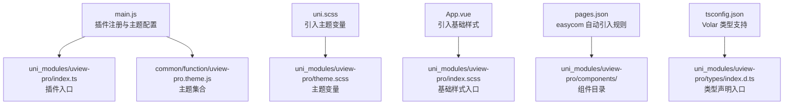
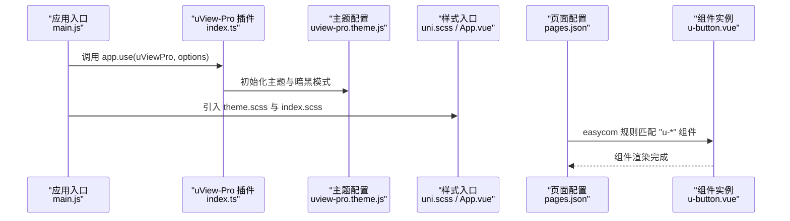
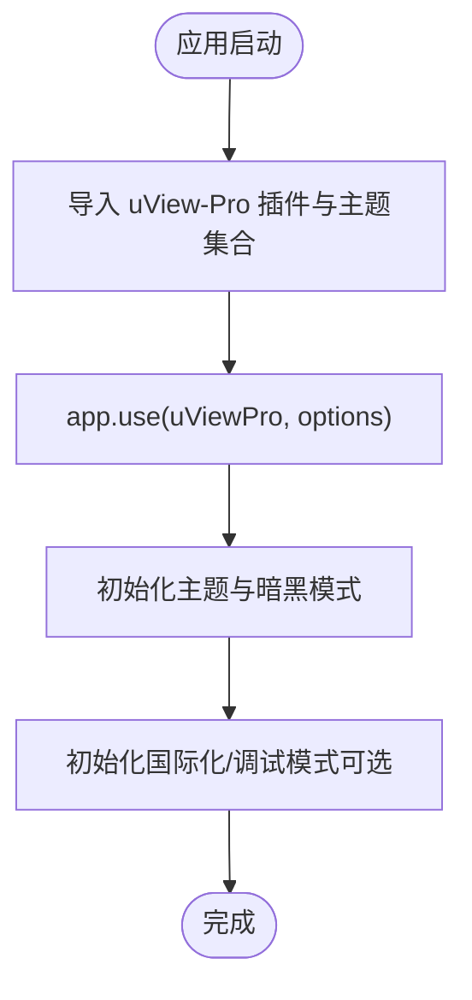
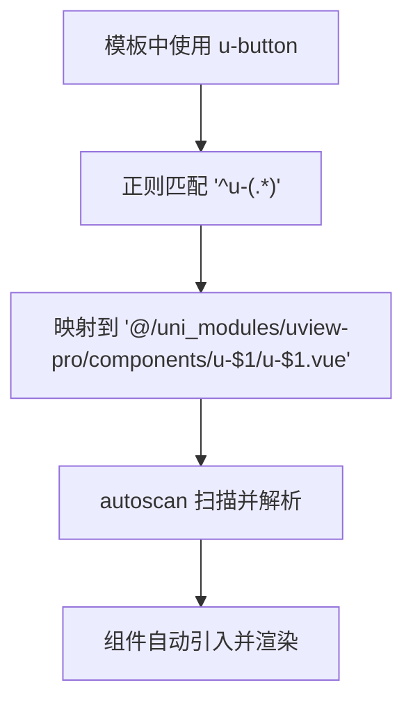
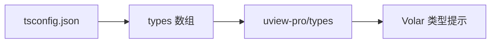
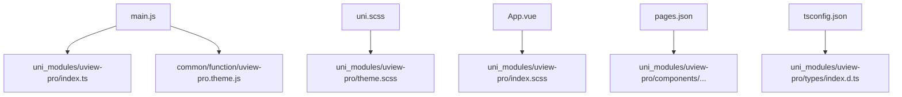

# 安装与配置

<cite>
**本文引用的文件**
- [main.js](file://main.js)
- [uni.scss](file://uni.scss)
- [App.vue](file://App.vue)
- [pages.json](file://pages.json)
- [package.json](file://package.json)
- [uview-pro 安装与配置（官方说明）](file://uni_modules/uview-pro/readme.md)
- [uView-Pro 主题配置主题集合](file://common/function/uview-pro.theme.js)
- [uView-Pro 插件入口 index.ts](file://uni_modules/uview-pro/index.ts)
- [uView-Pro 全局样式入口 index.scss](file://uni_modules/uview-pro/index.scss)
- [uView-Pro 主题变量 theme.scss](file://uni_modules/uview-pro/theme.scss)
- [uView-Pro 组件按钮示例 u-button.vue](file://uni_modules/uview-pro/components/u-button/u-button.vue)
- [uView-Pro 类型声明入口 types/index.d.ts](file://uni_modules/uview-pro/types/index.d.ts)
- [uView-Pro 全局类型定义 types/global.d.ts](file://uni_modules/uview-pro/types/global.d.ts)
- [tsconfig.json（Volar 类型支持）](file://tsconfig.json)
</cite>

## 目录
1. [简介](#简介)
2. [项目结构](#项目结构)
3. [核心组件](#核心组件)
4. [架构总览](#架构总览)
5. [详细组件分析](#详细组件分析)
6. [依赖关系分析](#依赖关系分析)
7. [性能考量](#性能考量)
8. [故障排查指南](#故障排查指南)
9. [结论](#结论)
10. [附录](#附录)

## 简介
本篇文档面向“挪车助手”项目，系统化讲解如何在 uni-app 项目中安装与配置 uView-Pro 组件库。内容涵盖：
- npm 安装与 uni_modules 两种安装方式的差异与适用场景
- main.js 插件注册、uni.scss 全局样式引入、App.vue 基础样式配置
- pages.json 中 easycom 自动引入规则的配置方法与正则解析
- Volar 类型提示支持的配置方案
- 常见安装问题排查与解决方案

## 项目结构
围绕 uView-Pro 的安装与配置，项目中涉及的关键文件如下：
- 插件注册与主题配置：main.js
- 全局样式引入：uni.scss、App.vue
- 组件自动引入：pages.json
- 类型支持：tsconfig.json 与 uView-Pro 类型声明
- 主题资源：uview-pro.theme.js、theme.scss、index.scss

**图示来源**
- [main.js:1-49](file://main.js#L1-L49)
- [uni_modules/uview-pro/index.ts:1-101](file://uni_modules/uview-pro/index.ts#L1-L101)
- [common/function/uview-pro.theme.js:1-257](file://common/function/uview-pro.theme.js#L1-L257)
- [uni.scss:1-14](file://uni.scss#L1-L14)
- [uni_modules/uview-pro/theme.scss:1-117](file://uni_modules/uview-pro/theme.scss#L1-L117)
- [App.vue:1-48](file://App.vue#L1-L48)
- [uni_modules/uview-pro/index.scss:1-27](file://uni_modules/uview-pro/index.scss#L1-L27)
- [pages.json:1-87](file://pages.json#L1-L87)
- [tsconfig.json:1-38](file://tsconfig.json#L1-L38)
- [uni_modules/uview-pro/types/index.d.ts:1-20](file://uni_modules/uview-pro/types/index.d.ts#L1-L20)

**章节来源**
- [main.js:1-49](file://main.js#L1-L49)
- [uni.scss:1-14](file://uni.scss#L1-L14)
- [App.vue:1-48](file://App.vue#L1-L48)
- [pages.json:1-87](file://pages.json#L1-L87)
- [tsconfig.json:1-38](file://tsconfig.json#L1-L38)

## 核心组件
- 插件入口与主题初始化：uView-Pro 插件在 index.ts 中导出 install 方法，并在 main.js 中调用 app.use(uViewPro, options) 完成主题、国际化与调试模式的初始化。
- 全局样式：theme.scss 提供主题变量，index.scss 汇总各端样式；uni.scss 与 App.vue 分别负责引入主题变量与基础样式。
- 组件自动引入：pages.json 的 easycom 规则通过正则将模板中的 u- 组件名映射到 uView-Pro 组件路径。
- 类型支持：uView-Pro 提供 types/index.d.ts 与 types/global.d.ts，tsconfig.json 中通过 types 数组启用 Volar 全局类型。

**章节来源**
- [uni_modules/uview-pro/index.ts:1-101](file://uni_modules/uview-pro/index.ts#L1-L101)
- [main.js:27-33](file://main.js#L27-L33)
- [uni_modules/uview-pro/theme.scss:1-117](file://uni_modules/uview-pro/theme.scss#L1-L117)
- [uni_modules/uview-pro/index.scss:1-27](file://uni_modules/uview-pro/index.scss#L1-L27)
- [uni.scss:1-14](file://uni.scss#L1-L14)
- [App.vue:40-47](file://App.vue#L40-L47)
- [pages.json:2-8](file://pages.json#L2-L8)
- [uni_modules/uview-pro/types/index.d.ts:1-20](file://uni_modules/uview-pro/types/index.d.ts#L1-L20)
- [uni_modules/uview-pro/types/global.d.ts:1-446](file://uni_modules/uview-pro/types/global.d.ts#L1-L446)
- [tsconfig.json](file://tsconfig.json#L29)

## 架构总览
下图展示了从应用启动到组件渲染的关键流程：插件注册 → 主题初始化 → 样式引入 → 组件自动解析 → 渲染。

**图示来源**
- [main.js:27-33](file://main.js#L27-L33)
- [uni_modules/uview-pro/index.ts:16-92](file://uni_modules/uview-pro/index.ts#L16-L92)
- [common/function/uview-pro.theme.js:1-257](file://common/function/uview-pro.theme.js#L1-L257)
- [uni.scss:1-14](file://uni.scss#L1-L14)
- [App.vue:40-47](file://App.vue#L40-L47)
- [pages.json:2-8](file://pages.json#L2-L8)
- [uni_modules/uview-pro/components/u-button/u-button.vue:1-200](file://uni_modules/uview-pro/components/u-button/u-button.vue#L1-L200)

## 详细组件分析

### 安装方式对比与适用场景
- npm 安装
  - 优点：便于跨项目复用、版本管理清晰、CI/CD 友好
  - 适用：CLI 工程、需要统一依赖管理的团队协作
- uni_modules 安装
  - 优点：HBuilderX 插件市场一键安装、本地化开发体验佳
  - 适用：HBuilderX 工程、快速原型与本地联调

两者在后续的插件注册、样式引入与 easycom 配置上保持一致，仅路径与引用方式不同。

**章节来源**
- [uview-pro 安装与配置（官方说明）:104-125](file://uni_modules/uview-pro/readme.md#L104-L125)

### main.js 插件注册与主题配置
- 引入插件与主题：在 main.js 中导入 uView-Pro 插件与主题集合，并通过 app.use(uViewPro, options) 完成注册
- 主题选项：支持多主题数组、默认主题名称、默认暗黑模式等
- 其他初始化：可选地初始化国际化与调试模式

**图示来源**
- [main.js:1-49](file://main.js#L1-L49)
- [uni_modules/uview-pro/index.ts:16-92](file://uni_modules/uview-pro/index.ts#L16-L92)
- [common/function/uview-pro.theme.js:1-257](file://common/function/uview-pro.theme.js#L1-L257)

**章节来源**
- [main.js:1-49](file://main.js#L1-L49)
- [uni_modules/uview-pro/index.ts:1-101](file://uni_modules/uview-pro/index.ts#L1-L101)

### uni.scss 全局样式引入
- 引入主题变量：在 uni.scss 中引入 uView-Pro 的 theme.scss，确保主题变量生效
- 其他样式：可继续引入项目自定义样式文件

**章节来源**
- [uni.scss:1-14](file://uni.scss#L1-L14)
- [uni_modules/uview-pro/theme.scss:1-117](file://uni_modules/uview-pro/theme.scss#L1-L117)

### App.vue 基础样式配置
- 引入基础样式：在 App.vue 的 style 区域引入 uView-Pro 的 index.scss，确保组件基础样式生效
- 其他样式：可继续引入 TailwindCSS 等第三方样式

**章节来源**
- [App.vue:40-47](file://App.vue#L40-L47)
- [uni_modules/uview-pro/index.scss:1-27](file://uni_modules/uview-pro/index.scss#L1-L27)

### pages.json 中 easycom 自动引入规则
- autoscan：开启自动扫描，减少手动 import
- custom：自定义匹配规则
  - 正则 "^u-(.*)"：将模板中以 u- 开头的组件名，映射到 uView-Pro 的组件路径
  - 映射目标 "@/uni_modules/uview-pro/components/u-$1/u-$1.vue"：将 u-button 解析为对应组件文件
- 注意事项：修改规则后需重启 HX 或重新编译；确保 custom 内且仅有一个 easycom 字段

**图示来源**
- [pages.json:2-8](file://pages.json#L2-L8)

**章节来源**
- [pages.json:1-87](file://pages.json#L1-L87)

### Volar 类型提示支持
- CLI 工程：在 tsconfig.json 的 types 数组中加入 uView-Pro 类型声明路径，以启用全局类型
- HBuilderX 工程：官方说明指出暂不支持 tsconfig.json 的 types 配置，推荐 CLI 工程以获得最佳 TS 体验

**图示来源**
- [tsconfig.json](file://tsconfig.json#L29)
- [uni_modules/uview-pro/types/index.d.ts:1-20](file://uni_modules/uview-pro/types/index.d.ts#L1-L20)

**章节来源**
- [tsconfig.json:1-38](file://tsconfig.json#L1-L38)
- [uni_modules/uview-pro/types/index.d.ts:1-20](file://uni_modules/uview-pro/types/index.d.ts#L1-L20)
- [uview-pro 安装与配置（官方说明）:193-208](file://uni_modules/uview-pro/readme.md#L193-L208)

### 组件使用示例与类型约束
- 组件使用：完成上述配置后，无需 import 与 components 注册，直接在 SFC 中使用 uView-Pro 组件
- 类型约束：uView-Pro 提供丰富的全局类型定义，涵盖主题、尺寸、颜色、表单校验等

**章节来源**
- [uni_modules/uview-pro/components/u-button/u-button.vue:1-200](file://uni_modules/uview-pro/components/u-button/u-button.vue#L1-L200)
- [uni_modules/uview-pro/types/global.d.ts:1-446](file://uni_modules/uview-pro/types/global.d.ts#L1-L446)

## 依赖关系分析
- 插件依赖：main.js 依赖 uView-Pro 插件入口与主题集合
- 样式依赖：uni.scss 依赖 theme.scss；App.vue 依赖 index.scss
- 组件依赖：pages.json 的 easycom 依赖 uView-Pro 组件目录结构
- 类型依赖：tsconfig.json 依赖 uView-Pro 类型声明

**图示来源**
- [main.js:1-49](file://main.js#L1-L49)
- [uni_modules/uview-pro/index.ts:1-101](file://uni_modules/uview-pro/index.ts#L1-L101)
- [common/function/uview-pro.theme.js:1-257](file://common/function/uview-pro.theme.js#L1-L257)
- [uni.scss:1-14](file://uni.scss#L1-L14)
- [uni_modules/uview-pro/theme.scss:1-117](file://uni_modules/uview-pro/theme.scss#L1-L117)
- [App.vue:40-47](file://App.vue#L40-L47)
- [uni_modules/uview-pro/index.scss:1-27](file://uni_modules/uview-pro/index.scss#L1-L27)
- [pages.json:1-87](file://pages.json#L1-L87)
- [tsconfig.json:1-38](file://tsconfig.json#L1-L38)
- [uni_modules/uview-pro/types/index.d.ts:1-20](file://uni_modules/uview-pro/types/index.d.ts#L1-L20)

**章节来源**
- [main.js:1-49](file://main.js#L1-L49)
- [uni_modules/uview-pro/index.ts:1-101](file://uni_modules/uview-pro/index.ts#L1-L101)
- [uni.scss:1-14](file://uni.scss#L1-L14)
- [App.vue:40-47](file://App.vue#L40-L47)
- [pages.json:1-87](file://pages.json#L1-L87)
- [tsconfig.json:1-38](file://tsconfig.json#L1-L38)

## 性能考量
- 按需引入：uView-Pro 支持按需引入，结合 easycom 可减少冗余组件打包
- 样式拆分：将主题变量与基础样式分离，避免重复注入导致的包体膨胀
- 编译优化：合理配置 tsconfig 与构建工具，减少类型检查与编译时间

## 故障排查指南
- easycom 规则不生效
  - 检查 pages.json 中是否存在多个 easycom 字段，确保合并为单一字段
  - 确认 custom 内配置正确，且规则位于 custom 下
  - 修改规则后重启 HX 或重新编译项目
- 组件无法识别
  - 确认模板中组件名以 u- 开头，且命名与组件目录一致
  - 检查映射路径是否指向正确的组件文件
- 样式异常
  - 确认 uni.scss 已引入 theme.scss，App.vue 已引入 index.scss
  - 检查主题变量是否被覆盖或冲突
- Volar 类型缺失
  - CLI 工程：确认 tsconfig.json 的 types 数组包含 uView-Pro 类型路径
  - HBuilderX 工程：遵循官方说明，暂不支持 tsconfig.json 的 types 配置

**章节来源**
- [pages.json:1-87](file://pages.json#L1-L87)
- [uni.scss:1-14](file://uni.scss#L1-L14)
- [App.vue:40-47](file://App.vue#L40-L47)
- [tsconfig.json](file://tsconfig.json#L29)
- [uview-pro 安装与配置（官方说明）:187-192](file://uni_modules/uview-pro/readme.md#L187-L192)

## 结论
通过以上步骤，挪车助手项目可以顺利完成 uView-Pro 的安装与配置。npm 与 uni_modules 两种方式在工程化与开发体验上各有侧重，可根据团队与工具链选择。配合 easycom 自动引入、全局样式与主题配置，以及 Volar 类型支持，可显著提升开发效率与一致性。

## 附录
- 官方安装与配置说明：参考 uView-Pro 官方文档中的安装、样式引入与 easycom 配置章节
- 主题与类型：项目中已提供主题集合与类型声明，可直接使用

**章节来源**
- [uview-pro 安装与配置（官方说明）:104-221](file://uni_modules/uview-pro/readme.md#L104-L221)