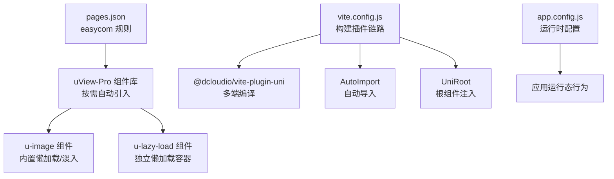
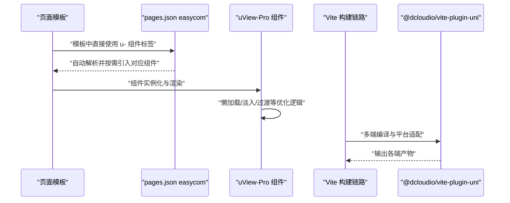
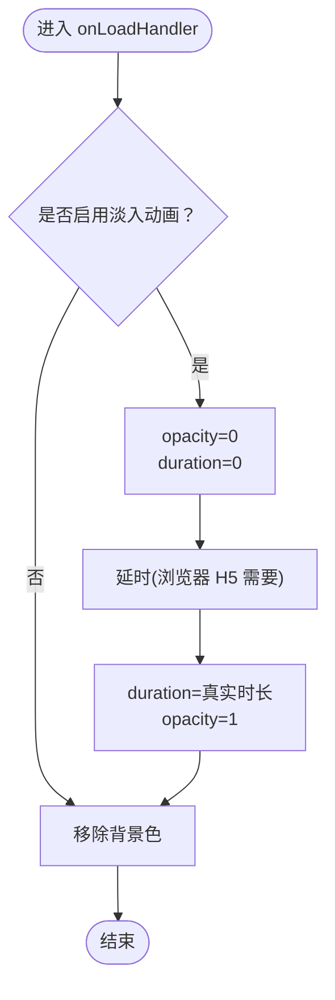
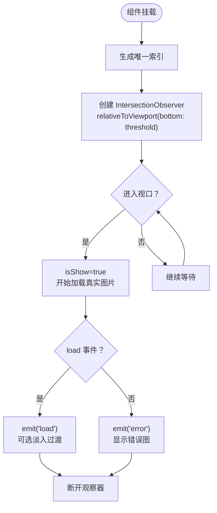
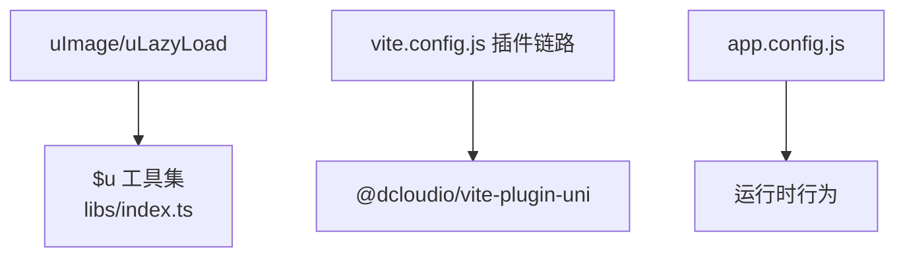

# 性能优化

<cite>
**本文引用的文件**
- [package.json](file://uni_modules/uview-pro/package.json)
- [readme.md](file://uni_modules/uview-pro/readme.md)
- [index.ts](file://uni_modules/uview-pro/index.ts)
- [libs/index.ts](file://uni_modules/uview-pro/libs/index.ts)
- [u-image.vue](file://uni_modules/uview-pro/components/u-image/u-image.vue)
- [u-lazy-load.vue](file://uni_modules/uview-pro/components/u-lazy-load/u-lazy-load.vue)
- [pages.json](file://pages.json)
- [vite.config.js](file://vite.config.js)
- [app.config.js](file://app.config.js)
</cite>

## 目录
1. [简介](#简介)
2. [项目结构](#项目结构)
3. [核心组件](#核心组件)
4. [架构总览](#架构总览)
5. [详细组件分析](#详细组件分析)
6. [依赖分析](#依赖分析)
7. [性能考量](#性能考量)
8. [故障排查指南](#故障排查指南)
9. [结论](#结论)
10. [附录](#附录)

## 简介
本文件面向“挪车助手”项目，围绕 uView-Pro 的性能优化进行系统化说明，重点涵盖：
- 按需引入与组件懒加载机制，指导如何通过配置实现最小化打包体积
- 渲染优化技术：图片懒加载、淡入动画、过渡与视觉层优化
- 多平台（H5、小程序、APP）性能差异与针对性优化建议
- 构建期优化、代码分割与缓存策略
- 组件使用层面的性能监控与问题定位方法

uView-Pro 提供了完善的按需引入能力与易用的懒加载组件，结合本项目的 easycom 配置与构建插件，可在不牺牲开发体验的前提下显著降低首屏与整体包体。

## 项目结构
本项目采用 uni-app 多端统一开发，uView-Pro 以 uni_modules 形式集成，配合 pages.json 的 easycom 规则，实现组件自动扫描与按需引入；构建阶段通过 Vite 插件链路（AutoImport、UniRoot、@dcloudio/vite-plugin-uni 等）提升开发与构建效率。

图表来源
- [pages.json:1-87](file://pages.json#L1-L87)
- [vite.config.js:1-58](file://vite.config.js#L1-L58)
- [app.config.js:1-111](file://app.config.js#L1-L111)

章节来源
- [pages.json:1-87](file://pages.json#L1-L87)
- [vite.config.js:1-58](file://vite.config.js#L1-L58)
- [app.config.js:1-111](file://app.config.js#L1-L111)

## 核心组件
- uImage：在原生 image 基础上增强加载态、错误态、淡入动画、圆角与懒加载开关，适合常规图片场景
- uLazyLoad：独立的懒加载容器，基于 IntersectionObserver 与阈值控制，支持占位图、错误图与过渡动画
- libs 工具集：提供 $u 通用方法（如 addStyle、toStyle、sleep、debounce、throttle 等），便于在组件与页面中进行轻量性能优化

章节来源
- [u-image.vue:1-246](file://uni_modules/uview-pro/components/u-image/u-image.vue#L1-L246)
- [u-lazy-load.vue:1-247](file://uni_modules/uview-pro/components/u-lazy-load/u-lazy-load.vue#L1-L247)
- [libs/index.ts:290-350](file://uni_modules/uview-pro/libs/index.ts#L290-L350)

## 架构总览
下图展示了从页面到组件再到构建链路的整体性能相关路径：

图表来源
- [pages.json:1-87](file://pages.json#L1-L87)
- [vite.config.js:1-58](file://vite.config.js#L1-L58)

章节来源
- [pages.json:1-87](file://pages.json#L1-L87)
- [vite.config.js:1-58](file://vite.config.js#L1-L58)

## 详细组件分析

### uImage 组件渲染优化
- 加载态与错误态：通过 loading 与 isError 状态切换，避免空白闪烁，提升感知一致性
- 淡入动画：在 fade=true 时，先以较低不透明度展示占位图，加载完成后通过过渡实现淡入，减少突兀
- 懒加载开关：lazy-load 属性在部分平台生效，减少首屏资源压力
- 圆角与溢出：根据 border-radius 与 shape 动态设置 overflow，避免圆角失效
- 背景色清理：动画结束后移除背景色，避免 PNG 透明底色透出

图表来源
- [u-image.vue:161-191](file://uni_modules/uview-pro/components/u-image/u-image.vue#L161-L191)

章节来源
- [u-image.vue:1-246](file://uni_modules/uview-pro/components/u-image/u-image.vue#L1-L246)

### uLazyLoad 组件懒加载策略
- 交集观察：基于组件实例的 createIntersectionObserver，相对视口 bottom 阈值触发
- 状态机：占位图 -> 真图加载 -> 成功/失败，分别触发 load/error 事件
- 过渡动画：首次可见时触发淡入，减少视觉跳变
- 资源回退：错误时显示 errorImg，避免白块

图表来源
- [u-lazy-load.vue:199-225](file://uni_modules/uview-pro/components/u-lazy-load/u-lazy-load.vue#L199-L225)

章节来源
- [u-lazy-load.vue:1-247](file://uni_modules/uview-pro/components/u-lazy-load/u-lazy-load.vue#L1-L247)

### 按需引入与最小化打包
- easycom 规则：通过 pages.json 的 easycom.custom 将 u- 组件前缀映射到 uView-Pro 组件目录，实现“零 import、零注册”的按需引入
- 自动扫描：autoscan=true 使组件库目录被扫描，结合自定义规则精确命中目标组件
- 构建期优化：Vite 插件链路（AutoImport、UniRoot、@dcloudio/vite-plugin-uni）在编译阶段完成多端适配与依赖解析，减少运行时负担

图表来源
- [pages.json:1-87](file://pages.json#L1-L87)
- [vite.config.js:1-58](file://vite.config.js#L1-L58)

章节来源
- [pages.json:1-87](file://pages.json#L1-L87)
- [vite.config.js:1-58](file://vite.config.js#L1-L58)

### 安装与主题/国际化初始化对性能的影响
- 主题初始化：支持多主题与默认主题合并，避免重复初始化，减少运行时开销
- 国际化初始化：按需初始化语言包，避免不必要的资源加载
- 全局属性挂载：将 $u 挂载至 app 实例，便于全局复用，减少重复创建

章节来源
- [index.ts:16-92](file://uni_modules/uview-pro/index.ts#L16-L92)

## 依赖分析
- 组件依赖：uImage 与 uLazyLoad 均依赖 $u 工具集（addStyle、toStyle、addUnit、guid 等）
- 构建依赖：Vite 插件链路负责自动导入、多端编译与 TailwindCSS 适配
- 运行时配置：app.config.js 提供运行时开关与全局行为，间接影响组件渲染策略（如日志、拦截器）

图表来源
- [libs/index.ts:290-350](file://uni_modules/uview-pro/libs/index.ts#L290-L350)
- [vite.config.js:1-58](file://vite.config.js#L1-L58)
- [app.config.js:1-111](file://app.config.js#L1-L111)

章节来源
- [libs/index.ts:290-350](file://uni_modules/uview-pro/libs/index.ts#L290-L350)
- [vite.config.js:1-58](file://vite.config.js#L1-L58)
- [app.config.js:1-111](file://app.config.js#L1-L111)

## 性能考量

### 多平台差异与优化建议
- H5
  - 懒加载：优先使用 uImage 的 lazy-load 或 uLazyLoad，减少首屏图片并发
  - 动画：浏览器对 will-change/transform 支持良好，合理使用淡入可提升感知
  - 构建：TailwindCSS 适配可通过插件禁用，避免额外体积
- 小程序
  - 懒加载：uImage 的 lazy-load 在微信/支付宝/百度等平台生效，建议开启
  - 图片格式：优先使用 WebP（若平台支持），降低体积
  - 事件节流：对滚动/触摸事件使用 throttle，减少频繁重排
- APP
  - 懒加载：uLazyLoad 与 uImage 均适用，注意阈值与高度设置
  - 硬件加速：组件内部已使用 will-change/transform，避免过度使用导致内存占用上升

章节来源
- [u-image.vue:67-75](file://uni_modules/uview-pro/components/u-image/u-image.vue#L67-L75)
- [u-lazy-load.vue:62-68](file://uni_modules/uview-pro/components/u-lazy-load/u-lazy-load.vue#L62-L68)
- [vite.config.js:11-14](file://vite.config.js#L11-L14)

### 渲染优化技术
- 图片懒加载
  - 推荐优先使用 uImage 的 lazy-load；对瀑布流/长列表场景，使用 uLazyLoad 容器
  - 合理设置 threshold 与高度，避免频繁触发与布局抖动
- 淡入动画
  - uImage 与 uLazyLoad 均支持过渡动画，建议在首屏图片较多时启用，改善感知
  - 注意浏览器 H5 的延时兼容（组件内部已处理）
- 过渡与视觉层
  - 使用 will-change 与 transform 提升合成层，减少重绘
  - 控制 opacity 与 transition 的时长，避免过长过渡造成感知延迟

章节来源
- [u-image.vue:131-134](file://uni_modules/uview-pro/components/u-image/u-image.vue#L131-L134)
- [u-lazy-load.vue:238-242](file://uni_modules/uview-pro/components/u-lazy-load/u-lazy-load.vue#L238-L242)

### 构建优化与代码分割
- easycom 自动引入：减少 import 与注册成本，配合按需打包
- Vite 插件链路：AutoImport 减少样板代码；UniRoot 与 @dcloudio/vite-plugin-uni 提升多端编译效率
- TailwindCSS 适配：在 H5/APP 环境可禁用，避免无谓体积与运行时解析

章节来源
- [pages.json:1-87](file://pages.json#L1-L87)
- [vite.config.js:1-58](file://vite.config.js#L1-L58)

### 缓存机制与监控
- 组件级缓存
  - 图片加载成功后可利用浏览器缓存，避免重复请求
  - 对错误图片与占位图进行本地缓存，减少重复渲染
- 运行时监控
  - 通过组件事件（load/error/click）收集性能数据，记录首帧时间、加载耗时与失败率
  - 结合 app.config.js 的日志配置，输出关键指标
- 工具辅助
  - 使用 $u.mitt（事件总线）在模块间传递性能指标
  - 使用 $u.throttle/$u.debounce 降低高频事件对渲染的影响

章节来源
- [libs/index.ts:322-324](file://uni_modules/uview-pro/libs/index.ts#L322-L324)
- [app.config.js:21-23](file://app.config.js#L21-L23)

## 故障排查指南
- 图片不显示或一直加载
  - 检查 src 是否为空或非法；uImage 会在 src 为空时直接标记为错误态
  - 确认 lazy-load 在目标平台是否生效（小程序平台支持）
- 懒加载不触发
  - 检查阈值 threshold 与容器高度设置；uLazyLoad 使用 relativeToViewport(bottom: threshold)
  - 确保组件已挂载并创建了 IntersectionObserver
- 动画无效或闪烁
  - 浏览器 H5 需要延时以触发过渡；组件内部已处理，如仍异常，检查 duration 与 opacity 设置
  - 避免在大量元素上同时启用长时过渡
- 构建体积过大
  - 确认 easycom 规则正确，避免遗漏映射
  - 在 H5/APP 环境禁用 TailwindCSS 适配，减少体积与解析开销

章节来源
- [u-image.vue:103-116](file://uni_modules/uview-pro/components/u-image/u-image.vue#L103-L116)
- [u-lazy-load.vue:213-223](file://uni_modules/uview-pro/components/u-lazy-load/u-lazy-load.vue#L213-L223)
- [vite.config.js:11-14](file://vite.config.js#L11-L14)

## 结论
通过 uView-Pro 的按需引入与懒加载能力，结合本项目的 easycom 与 Vite 插件链路，可以在不增加开发复杂度的前提下显著优化首屏与整体包体。针对不同平台的特性，合理启用懒加载、淡入动画与过渡策略，辅以事件节流与缓存，可进一步提升用户体验与稳定性。建议在日常迭代中持续关注组件事件指标与构建体积，形成闭环优化。

## 附录
- 官方文档与特性说明可参考 uView-Pro 文档与 README 中关于“按需引入、精简打包体积”的描述
- 本项目 README 中明确列出“按需引入，精简打包体积”的特性，可作为优化依据

章节来源
- [readme.md:36-36](file://uni_modules/uview-pro/readme.md#L36-L36)
- [package.json:1-109](file://uni_modules/uview-pro/package.json#L1-L109)