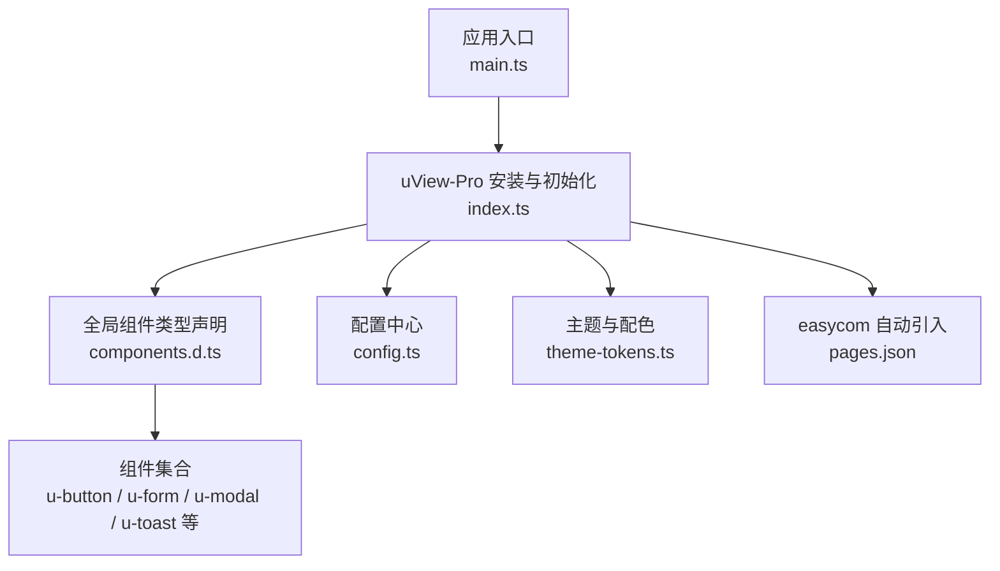
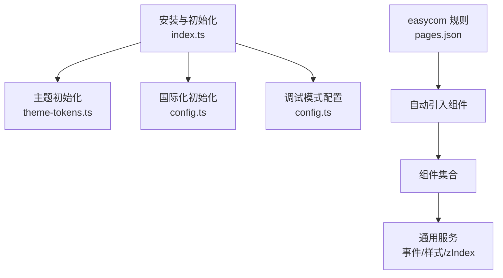
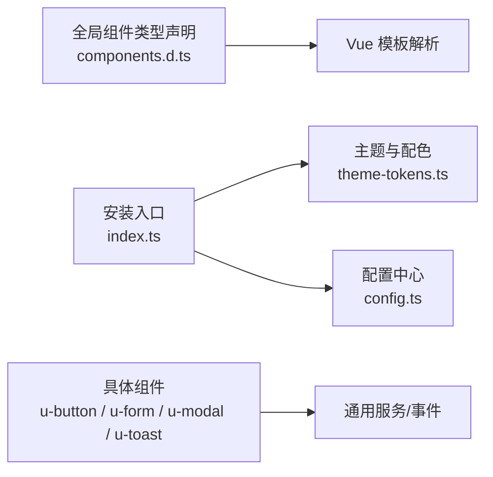

# 组件总览

<cite>
**本文引用的文件**
- [README.md](file://README.md)
- [package.json](file://uni_modules/uview-pro/package.json)
- [index.ts](file://uni_modules/uview-pro/index.ts)
- [components.d.ts](file://uni_modules/uview-pro/types/components.d.ts)
- [config.ts](file://uni_modules/uview-pro/libs/config/config.ts)
- [theme-tokens.ts](file://uni_modules/uview-pro/libs/config/theme-tokens.ts)
- [u-button.vue](file://uni_modules/uview-pro/components/u-button/u-button.vue)
- [u-form.vue](file://uni_modules/uview-pro/components/u-form/u-form.vue)
- [u-modal.vue](file://uni_modules/uview-pro/components/u-modal/u-modal.vue)
- [u-toast.vue](file://uni_modules/uview-pro/components/u-toast/u-toast.vue)
</cite>

## 目录
1. [简介](#简介)
2. [项目结构](#项目结构)
3. [核心组件](#核心组件)
4. [架构总览](#架构总览)
5. [组件分类与功能概览](#组件分类与功能概览)
6. [依赖关系分析](#依赖关系分析)
7. [性能与兼容性](#性能与兼容性)
8. [使用指南与优先级建议](#使用指南与优先级建议)
9. [故障排查](#故障排查)
10. [结论](#结论)

## 简介
本文件面向挪车助手项目，系统梳理 uView-Pro 组件库的组件总览与使用建议。uView-Pro 是基于 Vue3 + TypeScript 的 uni-app 多端 UI 框架，提供 70+ 精选组件，覆盖基础、表单、数据展示、导航、反馈等类别，支持多主题、暗黑模式与国际化，并在 Android、iOS、HarmonyOS、H5 与主流小程序平台实现“一套代码，多端运行”。

## 项目结构
- 组件库入口与安装：通过在应用入口注册组件库并引入全局样式，结合 easycom 自动按需引入组件，降低开发成本。
- 类型声明：通过全局组件类型声明文件，为 IDE 提供完善的 TS 类型提示。
- 主题与配置：提供默认主题与明暗两套配色，支持多主题初始化与调试模式配置。

图表来源
- [index.ts:15-92](file://uni_modules/uview-pro/index.ts#L15-L92)
- [components.d.ts:1-106](file://uni_modules/uview-pro/types/components.d.ts#L1-L106)
- [config.ts:25-57](file://uni_modules/uview-pro/libs/config/config.ts#L25-L57)
- [theme-tokens.ts:92-102](file://uni_modules/uview-pro/libs/config/theme-tokens.ts#L92-L102)

章节来源
- [README.md](file://README.md)
- [package.json:1-109](file://uni_modules/uview-pro/package.json#L1-L109)
- [index.ts:15-92](file://uni_modules/uview-pro/index.ts#L15-L92)
- [components.d.ts:1-106](file://uni_modules/uview-pro/types/components.d.ts#L1-L106)
- [config.ts:25-57](file://uni_modules/uview-pro/libs/config/config.ts#L25-L57)
- [theme-tokens.ts:92-102](file://uni_modules/uview-pro/libs/config/theme-tokens.ts#L92-L102)

## 核心组件
- 基础组件：按钮、图标、文本、分割线、间距、骨架屏、过渡动画等，用于构建页面基础元素与交互反馈。
- 表单组件：输入框、选择器、开关、评分、数字框、表单容器与表单项等，满足复杂表单场景与校验需求。
- 数据展示：网格、列表索引、瀑布流、表格、头像、图片、进度条、通知栏、空状态等，用于信息呈现与浏览。
- 导航组件：导航栏、标签页、步骤条、粘性布局、分页、滑动切换等，支撑页面导航与内容组织。
- 反馈组件：模态框、消息提示、加载、遮罩、回到顶部、悬浮操作按钮等，提供交互反馈与状态提示。
- 布局与辅助：栅格、安全区、状态栏、空白占位等，保障页面布局一致性与适配性。

章节来源
- [components.d.ts:1-106](file://uni_modules/uview-pro/types/components.d.ts#L1-L106)

## 架构总览
uView-Pro 通过安装入口集中初始化主题、国际化与调试配置，再由 easycom 规则自动扫描组件目录，实现按需引入与零样板代码使用。组件间通过公共工具与服务（如事件总线、zIndex 管理、颜色映射）协同工作，形成统一的交互与视觉体系。

图表来源
- [index.ts:15-92](file://uni_modules/uview-pro/index.ts#L15-L92)
- [theme-tokens.ts:92-102](file://uni_modules/uview-pro/libs/config/theme-tokens.ts#L92-L102)
- [config.ts:25-57](file://uni_modules/uview-pro/libs/config/config.ts#L25-L57)

章节来源
- [index.ts:15-92](file://uni_modules/uview-pro/index.ts#L15-L92)
- [config.ts:25-57](file://uni_modules/uview-pro/libs/config/config.ts#L25-L57)

## 组件分类与功能概览
以下按类别列举常用组件及其典型用途，帮助快速定位所需能力：

- 基础组件
  - u-button：按钮，支持尺寸、类型、镂空、加载、涟漪、开放能力等，适用于各类点击交互。
  - u-icon：图标，支持主题色映射与尺寸控制。
  - u-text：文本，支持多行截断、主题色与字号。
  - u-divider：分割线，用于内容分隔。
  - u-gap：间距，用于页面元素间距控制。
  - u-skeleton：骨架屏，用于加载态占位。
  - u-transition：过渡动画，用于显隐与切换动画。

- 表单组件
  - u-form / u-form-item：表单容器与表单项，支持规则配置、重置、整表校验。
  - u-field / u-input / u-textarea：输入类控件，支持校验与格式化。
  - u-checkbox / u-checkbox-group：复选框组，支持多选项选择。
  - u-radio / u-radio-group：单选框组，支持互斥选择。
  - u-switch：开关，支持状态切换。
  - u-rate：评分，支持半星与只读。
  - u-number-box：数字框，支持增减与步进。
  - u-picker / u-city-select：选择器与城市选择，支持联动与自定义列。
  - u-upload：上传，支持图片/文件上传与预览。

- 数据展示
  - u-grid / u-grid-item：宫格，用于菜单与快捷入口。
  - u-index-list / u-index-anchor：索引列表，用于通讯录/字母索引。
  - u-waterfall：瀑布流，用于图文混排。
  - u-table / u-tr / u-th / u-td：表格，用于数据列表。
  - u-avatar / u-avatar-cropper：头像与裁剪。
  - u-image：图片，支持懒加载与占位。
  - u-line-progress / u-circle-progress：进度条与环形进度。
  - u-notice-bar / u-row-notice / u-column-notice：滚动通知。
  - u-empty：空状态，用于列表/搜索无结果提示。

- 导航组件
  - u-navbar：导航栏，支持标题、左右插槽与胶囊样式。
  - u-tabs / u-tabs-swiper：标签页与滑动切换。
  - u-steps / u-step：步骤条，用于流程引导。
  - u-sticky：粘性布局，用于吸顶导航。
  - u-pagination：分页，支持页码与跳转。
  - u-safe-bottom / u-status-bar：安全区与状态栏。

- 反馈组件
  - u-modal：模态框，支持标题、内容、按钮与异步关闭。
  - u-toast：消息提示，支持图标、加载、位置与跳转。
  - u-loading / u-loading-popup：加载指示。
  - u-mask：遮罩，用于浮层背景。
  - u-back-top：回到顶部。
  - u-fab：悬浮操作按钮。

章节来源
- [components.d.ts:1-106](file://uni_modules/uview-pro/types/components.d.ts#L1-L106)

## 依赖关系分析
- 组件注册与类型：全局组件类型声明文件将每个组件注册为 Vue 全局组件，便于在模板中直接使用。
- 主题与配置：主题初始化与配置中心相互配合，决定组件默认样式与行为；调试模式可按级别输出日志或错误。
- 组件间协作：部分组件（如 u-modal、u-toast）通过事件总线与服务层协作，支持函数式调用与页面/全局两种模式。

图表来源
- [components.d.ts:1-106](file://uni_modules/uview-pro/types/components.d.ts#L1-L106)
- [index.ts:15-92](file://uni_modules/uview-pro/index.ts#L15-L92)
- [theme-tokens.ts:92-102](file://uni_modules/uview-pro/libs/config/theme-tokens.ts#L92-L102)
- [config.ts:25-57](file://uni_modules/uview-pro/libs/config/config.ts#L25-L57)

章节来源
- [components.d.ts:1-106](file://uni_modules/uview-pro/types/components.d.ts#L1-L106)
- [index.ts:15-92](file://uni_modules/uview-pro/index.ts#L15-L92)
- [config.ts:25-57](file://uni_modules/uview-pro/libs/config/config.ts#L25-L57)

## 性能与兼容性
- 多端兼容：官方声明覆盖 Android、iOS、HarmonyOS、H5 与主流小程序平台，满足多端一致性需求。
- 按需引入：通过 easycom 自动扫描与组件命名规范，减少未使用代码打包体积。
- 主题与暗黑：默认主题支持明/暗两套配色，便于快速适配夜间模式。
- 组件优化：部分组件提供懒加载、骨架屏与过渡动画，改善首屏与交互体验。

章节来源
- [package.json:48-106](file://uni_modules/uview-pro/package.json#L48-L106)
- [README.md](file://README.md)

## 使用指南与优先级建议
- 快速起步
  - 在应用入口注册组件库并引入全局样式，配置 easycom 自动引入规则，即可在模板中直接使用组件。
  - 如需 TS 类型提示，可在编译配置中引入类型声明目录。
- 组件选择优先级
  - 表单类：优先使用 u-form + u-form-item 组合，配合 u-field 系列与校验规则，简化表单开发。
  - 反馈类：消息提示使用 u-toast，确认/提示使用 u-modal，保持交互一致性。
  - 数据展示：列表/索引用 u-index-list，网格入口用 u-grid，表格用 u-table。
  - 导航类：页面头部用 u-navbar，流程用 u-steps，标签页用 u-tabs。
  - 基础交互：按钮用 u-button，图标用 u-icon，文本用 u-text，间距用 u-gap。
- 命名规范与属性体系
  - 组件命名：统一以 u- 前缀，如 u-button、u-form、u-modal。
  - 属性体系：多数组件提供 size、type、shape、loading、disabled 等通用属性，便于快速切换样式与状态。
  - 事件机制：组件通过 emit 派发事件（如 click、confirm、cancel），并在服务层提供函数式调用能力（如 u-modal 的全局/页面事件）。
- 最佳实践
  - 使用 u-form 进行统一校验与重置，避免分散处理。
  - 通过主题系统统一管理颜色与字号，减少样式散落。
  - 对长列表使用懒加载与骨架屏，提升感知性能。
  - 合理使用过渡动画与涟漪效果，增强交互反馈但避免过度使用导致卡顿。

章节来源
- [index.ts:15-92](file://uni_modules/uview-pro/index.ts#L15-L92)
- [components.d.ts:1-106](file://uni_modules/uview-pro/types/components.d.ts#L1-L106)
- [u-button.vue:80-137](file://uni_modules/uview-pro/components/u-button/u-button.vue#L80-L137)
- [u-form.vue:20-130](file://uni_modules/uview-pro/components/u-form/u-form.vue#L20-L130)
- [u-modal.vue:81-190](file://uni_modules/uview-pro/components/u-modal/u-modal.vue#L81-L190)
- [u-toast.vue:49-200](file://uni_modules/uview-pro/components/u-toast/u-toast.vue#L49-L200)

## 故障排查
- 组件无法识别或类型缺失
  - 确认已在 pages.json 中正确配置 easycom 规则，并确保规则位于 custom 内。
  - 若使用 CLI 项目，确认 tsconfig 中已引入类型声明目录。
- 主题/暗黑模式不生效
  - 检查安装入口是否正确初始化主题与默认暗黑模式。
  - 确认主题配色与 CSS 变量已在全局样式中生效。
- 表单校验异常
  - 确保 u-form-item 的 prop 与 u-form 的 model 对应，rules 配置正确。
  - 使用 u-form 的 validate 方法获取完整错误数组，结合 errorType 控制提示方式。
- 模态框/消息提示不显示
  - 检查是否通过 ref.show 或服务事件正确触发，确认层级与遮罩配置。
  - 对异步关闭场景，确保在回调中调用关闭逻辑。

章节来源
- [components.d.ts:1-106](file://uni_modules/uview-pro/types/components.d.ts#L1-L106)
- [config.ts:25-57](file://uni_modules/uview-pro/libs/config/config.ts#L25-L57)
- [u-form.vue:59-114](file://uni_modules/uview-pro/components/u-form/u-form.vue#L59-L114)
- [u-modal.vue:127-190](file://uni_modules/uview-pro/components/u-modal/u-modal.vue#L127-L190)
- [u-toast.vue:120-200](file://uni_modules/uview-pro/components/u-toast/u-toast.vue#L120-L200)

## 结论
uView-Pro 以“多端一致、按需引入、主题统一”为核心设计目标，覆盖挪车助手项目常见的页面结构与交互场景。通过合理的组件分类与使用优先级建议，开发者可快速搭建稳定、美观且高性能的界面。建议在项目初期统一主题与交互风格，优先采用表单与反馈组件的标准实现，以降低维护成本并提升用户体验。