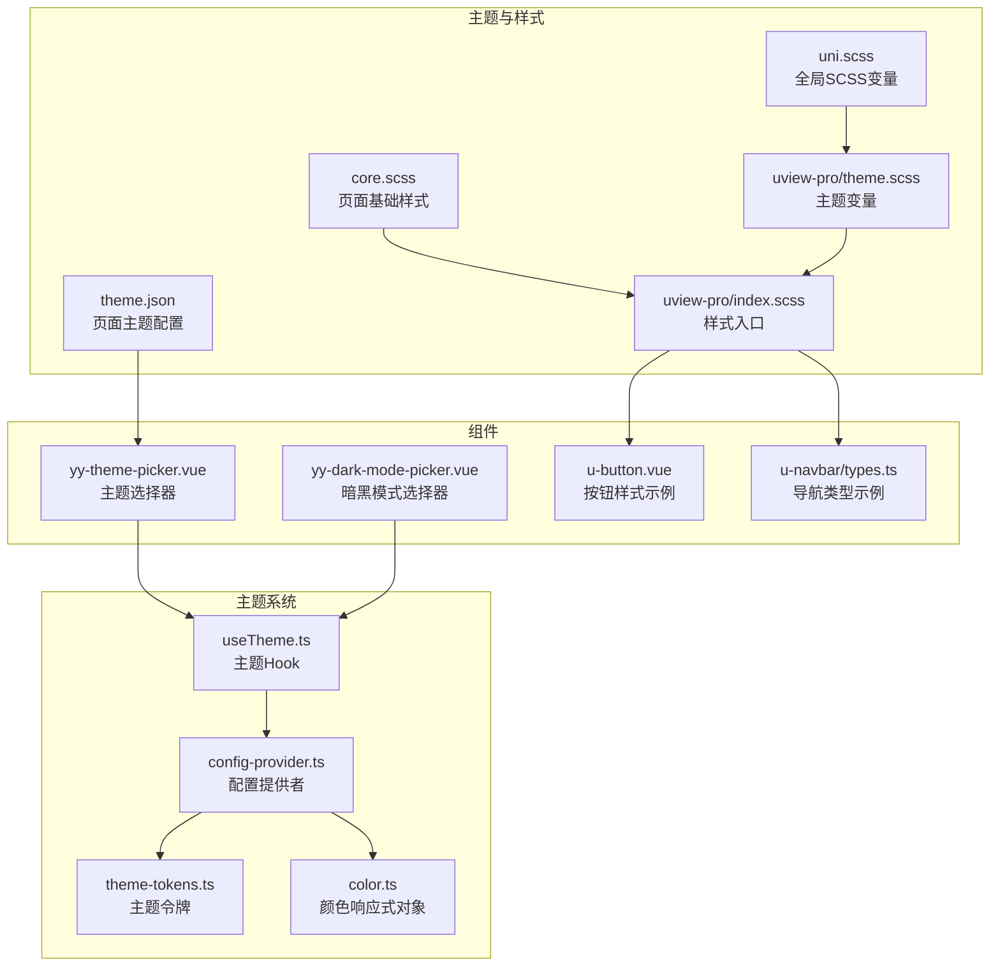
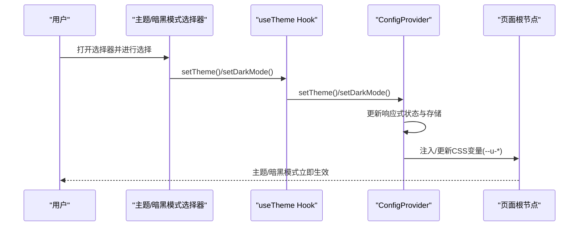
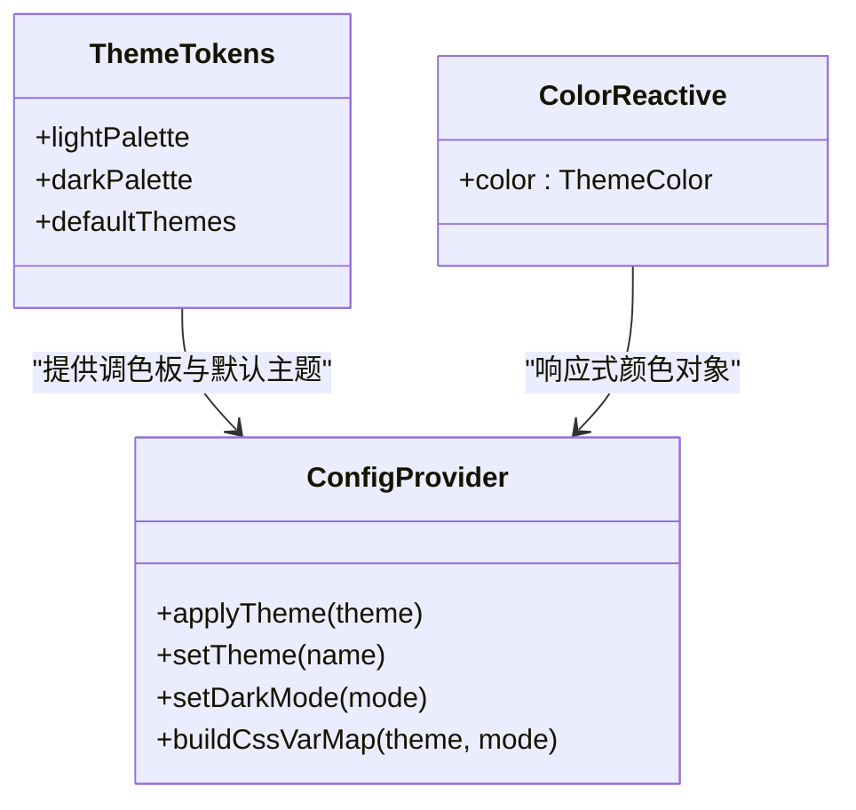
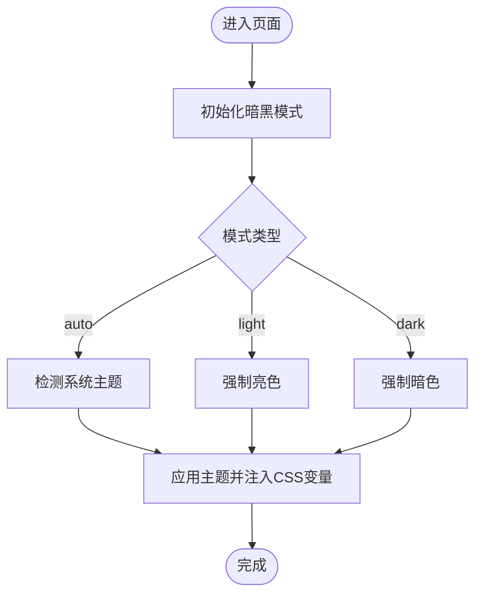
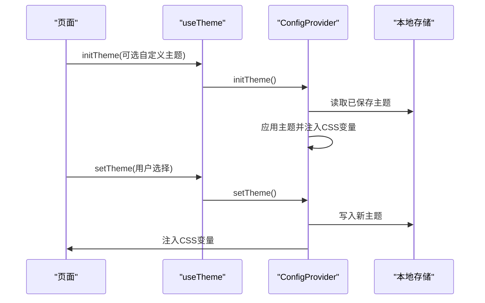
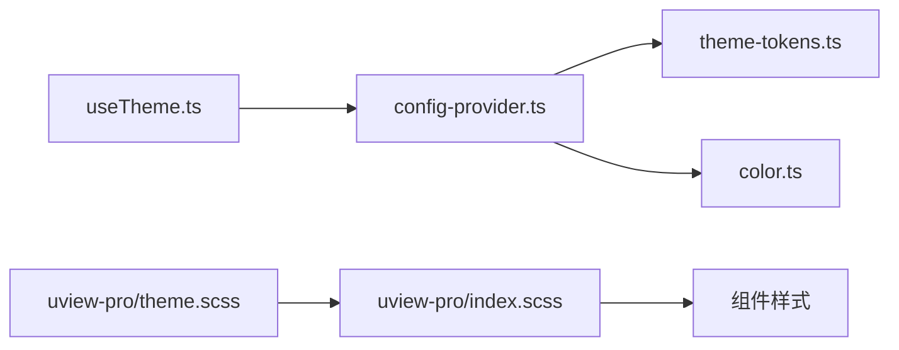

# 主题定制与样式系统

<cite>
**本文档引用的文件**
- [theme.json](file://theme.json)
- [uni.scss](file://common/css/uni.scss)
- [core.scss](file://common/css/core.scss)
- [uview-pro 主题变量](file://uni_modules/uview-pro/theme.scss)
- [uview-pro 主题定义](file://common/function/uview-pro.theme.js)
- [主题 Hook](file://uni_modules/uview-pro/libs/hooks/useTheme.ts)
- [配置提供者](file://uni_modules/uview-pro/libs/util/config-provider.ts)
- [主题令牌](file://uni_modules/uview-pro/libs/config/theme-tokens.ts)
- [颜色响应式对象](file://uni_modules/uview-pro/libs/config/color.ts)
- [uView Pro 样式入口](file://uni_modules/uview-pro/index.scss)
- [按钮组件样式](file://uni_modules/uview-pro/components/u-button/u-button.vue)
- [导航栏组件类型](file://uni_modules/uview-pro/components/u-navbar/types.ts)
- [主题选择器组件](file://components/yy-theme-picker.vue)
- [暗黑模式选择器组件](file://components/yy-dark-mode-picker.vue)
</cite>

## 目录
1. [简介](#简介)
2. [项目结构](#项目结构)
3. [核心组件](#核心组件)
4. [架构总览](#架构总览)
5. [详细组件分析](#详细组件分析)
6. [依赖关系分析](#依赖关系分析)
7. [性能考量](#性能考量)
8. [故障排查指南](#故障排查指南)
9. [结论](#结论)
10. [附录](#附录)

## 简介
本文件面向挪车助手项目的前端开发者，系统性讲解基于 uView-Pro 的主题定制与样式系统，涵盖主题变量、颜色系统、字体与间距规范、暗黑模式、主题切换机制、样式作用域与模块化、以及全局样式与组件样式的组织方式。文档提供从变量配置到组件使用的完整链路说明，并给出最佳实践与排错建议。

## 项目结构
围绕主题与样式的相关文件主要分布在以下位置：
- 主题 JSON：用于页面级主题背景与导航等配置
- 全局 SCSS 变量：统一的尺寸、颜色、间距等变量
- uView-Pro 主题变量与样式入口：组件库的主题变量、平台差异化样式与主题切换能力
- 主题选择器与暗黑模式选择器：提供用户交互入口
- 配置提供者与主题 Hook：负责主题与暗黑模式的状态管理与持久化

**图表来源**
- [theme.json:1-29](file://theme.json#L1-L29)
- [uni.scss:1-39](file://common/css/uni.scss#L1-L39)
- [core.scss:1-17](file://common/css/core.scss#L1-L17)
- [uview-pro 主题变量:1-117](file://uni_modules/uview-pro/theme.scss#L1-L117)
- [uView Pro 样式入口:1-27](file://uni_modules/uview-pro/index.scss#L1-L27)
- [主题 Hook:1-174](file://uni_modules/uview-pro/libs/hooks/useTheme.ts#L1-L174)
- [配置提供者:1-200](file://uni_modules/uview-pro/libs/util/config-provider.ts#L1-L200)
- [主题令牌:1-102](file://uni_modules/uview-pro/libs/config/theme-tokens.ts#L1-L102)
- [颜色响应式对象:1-9](file://uni_modules/uview-pro/libs/config/color.ts#L1-L9)
- [主题选择器组件:1-106](file://components/yy-theme-picker.vue#L1-L106)
- [暗黑模式选择器组件:1-101](file://components/yy-dark-mode-picker.vue#L1-L101)
- [按钮组件样式:366-414](file://uni_modules/uview-pro/components/u-button/u-button.vue#L366-L414)
- [导航栏组件类型:1-55](file://uni_modules/uview-pro/components/u-navbar/types.ts#L1-L55)

**章节来源**
- [theme.json:1-29](file://theme.json#L1-L29)
- [uni.scss:1-39](file://common/css/uni.scss#L1-L39)
- [core.scss:1-17](file://common/css/core.scss#L1-L17)
- [uview-pro 主题变量:1-117](file://uni_modules/uview-pro/theme.scss#L1-L117)
- [uView Pro 样式入口:1-27](file://uni_modules/uview-pro/index.scss#L1-L27)
- [主题 Hook:1-174](file://uni_modules/uview-pro/libs/hooks/useTheme.ts#L1-L174)
- [配置提供者:1-200](file://uni_modules/uview-pro/libs/util/config-provider.ts#L1-L200)
- [主题令牌:1-102](file://uni_modules/uview-pro/libs/config/theme-tokens.ts#L1-L102)
- [颜色响应式对象:1-9](file://uni_modules/uview-pro/libs/config/color.ts#L1-L9)
- [主题选择器组件:1-106](file://components/yy-theme-picker.vue#L1-L106)
- [暗黑模式选择器组件:1-101](file://components/yy-dark-mode-picker.vue#L1-L101)
- [按钮组件样式:366-414](file://uni_modules/uview-pro/components/u-button/u-button.vue#L366-L414)
- [导航栏组件类型:1-55](file://uni_modules/uview-pro/components/u-navbar/types.ts#L1-L55)

## 核心组件
- 主题变量与样式入口
  - uView-Pro 提供以 CSS 变量为核心的全局主题变量，可在 SCSS 中通过变量名使用，并由配置提供者动态注入到页面根节点。
  - 样式入口根据平台条件编译加载不同平台的样式文件，确保跨端一致性。
- 主题 Hook 与配置提供者
  - useTheme 提供主题初始化、切换、暗黑模式设置与持久化等能力；ConfigProvider 负责主题与暗黑模式的状态管理、系统主题监听与 CSS 变量构建。
- 主题与暗黑模式选择器
  - 提供用户交互界面，支持主题列表选择与暗黑模式开关（跟随系统/亮色/暗色）。

**章节来源**
- [uview-pro 主题变量:1-117](file://uni_modules/uview-pro/theme.scss#L1-L117)
- [uView Pro 样式入口:1-27](file://uni_modules/uview-pro/index.scss#L1-L27)
- [主题 Hook:1-174](file://uni_modules/uview-pro/libs/hooks/useTheme.ts#L1-L174)
- [配置提供者:1-200](file://uni_modules/uview-pro/libs/util/config-provider.ts#L1-L200)
- [主题选择器组件:1-106](file://components/yy-theme-picker.vue#L1-L106)
- [暗黑模式选择器组件:1-101](file://components/yy-dark-mode-picker.vue#L1-L101)

## 架构总览
主题系统采用“配置提供者 + 主题 Hook + 组件样式”的分层架构：
- 配置提供者负责主题与暗黑模式的初始化、切换、持久化与系统主题监听。
- 主题 Hook 对外暴露响应式引用与方法，简化组件使用。
- 组件样式通过 SCSS 变量与 CSS 变量联动，实现主题与暗黑模式的即时切换。

**图表来源**
- [主题 Hook:44-130](file://uni_modules/uview-pro/libs/hooks/useTheme.ts#L44-L130)
- [配置提供者:453-473](file://uni_modules/uview-pro/libs/util/config-provider.ts#L453-L473)
- [主题选择器组件:97-102](file://components/yy-theme-picker.vue#L97-L102)
- [暗黑模式选择器组件:84-89](file://components/yy-dark-mode-picker.vue#L84-L89)

## 详细组件分析

### 主题变量与颜色系统
- uView-Pro 主题变量
  - 通过 CSS 变量集中定义主色、辅助色、文本色、边框色、遮罩与背景色等，便于在 SCSS 中以变量形式使用。
  - 示例路径：[uView-Pro 主题变量:5-117](file://uni_modules/uview-pro/theme.scss#L5-L117)
- 默认主题令牌
  - 定义亮色与暗色两套调色板，以及默认主题的基础 CSS 变量映射。
  - 示例路径：[主题令牌:4-102](file://uni_modules/uview-pro/libs/config/theme-tokens.ts#L4-L102)
- 颜色响应式对象
  - 将颜色对象包装为响应式，供运行时更新与读取。
  - 示例路径：[颜色响应式对象:1-9](file://uni_modules/uview-pro/libs/config/color.ts#L1-L9)

**图表来源**
- [主题令牌:1-102](file://uni_modules/uview-pro/libs/config/theme-tokens.ts#L1-L102)
- [颜色响应式对象:1-9](file://uni_modules/uview-pro/libs/config/color.ts#L1-L9)
- [配置提供者:739-761](file://uni_modules/uview-pro/libs/util/config-provider.ts#L739-L761)

**章节来源**
- [uview-pro 主题变量:1-117](file://uni_modules/uview-pro/theme.scss#L1-L117)
- [主题令牌:1-102](file://uni_modules/uview-pro/libs/config/theme-tokens.ts#L1-L102)
- [颜色响应式对象:1-9](file://uni_modules/uview-pro/libs/config/color.ts#L1-L9)

### 暗黑模式实现
- 暗黑模式设置与检测
  - 支持跟随系统、强制亮色、强制暗色三种模式；系统主题变化时自动重绘主题。
  - 示例路径：[配置提供者:80-154](file://uni_modules/uview-pro/libs/util/config-provider.ts#L80-L154)
- 用户交互
  - 提供暗黑模式选择器组件，支持开启/自动/关闭三种模式切换。
  - 示例路径：[暗黑模式选择器组件:55-89](file://components/yy-dark-mode-picker.vue#L55-L89)

**图表来源**
- [配置提供者:80-154](file://uni_modules/uview-pro/libs/util/config-provider.ts#L80-L154)
- [暗黑模式选择器组件:67-89](file://components/yy-dark-mode-picker.vue#L67-L89)

**章节来源**
- [配置提供者:80-154](file://uni_modules/uview-pro/libs/util/config-provider.ts#L80-L154)
- [暗黑模式选择器组件:1-101](file://components/yy-dark-mode-picker.vue#L1-L101)

### 主题切换机制
- 主题初始化与持久化
  - 支持传入自定义主题列表或回退到内置默认主题；主题与暗黑模式均持久化到本地存储。
  - 示例路径：[主题 Hook:69-105](file://uni_modules/uview-pro/libs/hooks/useTheme.ts#L69-L105)
- 主题选择器
  - 展示多主题列表，点击后通过 useTheme 切换主题并更新 UI。
  - 示例路径：[主题选择器组件:75-102](file://components/yy-theme-picker.vue#L75-L102)

**图表来源**
- [主题 Hook:69-105](file://uni_modules/uview-pro/libs/hooks/useTheme.ts#L69-L105)
- [配置提供者:161-200](file://uni_modules/uview-pro/libs/util/config-provider.ts#L161-L200)
- [主题选择器组件:97-102](file://components/yy-theme-picker.vue#L97-L102)

**章节来源**
- [主题 Hook:1-174](file://uni_modules/uview-pro/libs/hooks/useTheme.ts#L1-L174)
- [配置提供者:161-200](file://uni_modules/uview-pro/libs/util/config-provider.ts#L161-L200)
- [主题选择器组件:1-106](file://components/yy-theme-picker.vue#L1-L106)

### 页面级主题配置（theme.json）
- 页面级主题通过 theme.json 定义亮/暗两种模式下的背景色、导航与标签页样式等，便于快速适配页面整体风格。
- 示例路径：[theme.json:1-29](file://theme.json#L1-L29)

**章节来源**
- [theme.json:1-29](file://theme.json#L1-L29)

### 全局样式与 SCSS 变量
- 全局 SCSS 变量
  - 定义文字尺寸、图片尺寸、圆角半径、水平/垂直间距、透明度与文章场景颜色等，统一项目视觉规范。
  - 示例路径：[uni.scss:1-39](file://common/css/uni.scss#L1-L39)
- 页面基础样式
  - 定义页面容器基础样式、安全区适配与字体引入等。
  - 示例路径：[core.scss:1-17](file://common/css/core.scss#L1-L17)
- uView-Pro 样式入口
  - 条件编译加载各平台样式，确保跨端一致。
  - 示例路径：[uView Pro 样式入口:1-27](file://uni_modules/uview-pro/index.scss#L1-L27)

**章节来源**
- [uni.scss:1-39](file://common/css/uni.scss#L1-L39)
- [core.scss:1-17](file://common/css/core.scss#L1-L17)
- [uView Pro 样式入口:1-27](file://uni_modules/uview-pro/index.scss#L1-L27)

### 组件样式与主题变量联动
- 组件样式通过 SCSS 变量与 CSS 变量联动，实现主题切换时的即时更新。
- 示例：
  - 按钮组件使用主题变量控制主色、成功色、错误色等状态样式。
    - 示例路径：[按钮组件样式:371-414](file://uni_modules/uview-pro/components/u-button/u-button.vue#L371-L414)
  - 导航栏标题与图标颜色使用 CSS 变量，随主题变化而变化。
    - 示例路径：[导航栏组件类型:14-55](file://uni_modules/uview-pro/components/u-navbar/types.ts#L14-L55)

**章节来源**
- [按钮组件样式:366-414](file://uni_modules/uview-pro/components/u-button/u-button.vue#L366-L414)
- [导航栏组件类型:1-55](file://uni_modules/uview-pro/components/u-navbar/types.ts#L1-L55)

### 自定义主题与样式覆盖
- 自定义主题
  - 通过 useTheme 初始化时传入自定义主题数组，或在运行时合并内置主题，实现品牌化定制。
  - 示例路径：[主题 Hook:69-105](file://uni_modules/uview-pro/libs/hooks/useTheme.ts#L69-L105)
- 样式覆盖
  - 在组件内使用 scoped 样式覆盖默认样式，或在页面级样式中通过更具体的 CSS 选择器提升优先级。
  - 注意避免全局污染，推荐结合 CSS 变量与组件 props 控制样式。

**章节来源**
- [主题 Hook:69-105](file://uni_modules/uview-pro/libs/hooks/useTheme.ts#L69-L105)

## 依赖关系分析
主题系统内部依赖关系如下：
- 主题 Hook 依赖配置提供者与主题令牌
- 配置提供者依赖颜色响应式对象与系统主题检测
- 组件样式依赖 uView-Pro 主题变量与 CSS 变量

**图表来源**
- [主题 Hook:1-174](file://uni_modules/uview-pro/libs/hooks/useTheme.ts#L1-L174)
- [配置提供者:1-200](file://uni_modules/uview-pro/libs/util/config-provider.ts#L1-L200)
- [主题令牌:1-102](file://uni_modules/uview-pro/libs/config/theme-tokens.ts#L1-L102)
- [颜色响应式对象:1-9](file://uni_modules/uview-pro/libs/config/color.ts#L1-L9)
- [uview-pro 主题变量:1-117](file://uni_modules/uview-pro/theme.scss#L1-L117)
- [uView Pro 样式入口:1-27](file://uni_modules/uview-pro/index.scss#L1-L27)

**章节来源**
- [主题 Hook:1-174](file://uni_modules/uview-pro/libs/hooks/useTheme.ts#L1-L174)
- [配置提供者:1-200](file://uni_modules/uview-pro/libs/util/config-provider.ts#L1-L200)
- [主题令牌:1-102](file://uni_modules/uview-pro/libs/config/theme-tokens.ts#L1-L102)
- [颜色响应式对象:1-9](file://uni_modules/uview-pro/libs/config/color.ts#L1-L9)
- [uview-pro 主题变量:1-117](file://uni_modules/uview-pro/theme.scss#L1-L117)
- [uView Pro 样式入口:1-27](file://uni_modules/uview-pro/index.scss#L1-L27)

## 性能考量
- CSS 变量注入与平台差异
  - 通过条件编译按平台加载样式，减少冗余资源；CSS 变量注入避免重复编译大量样式规则。
- 主题切换成本
  - 主题切换仅更新 CSS 变量，无需重载页面，切换成本低。
- 存储与初始化
  - 主题与暗黑模式设置持久化到本地存储，减少每次启动的计算与判断。

[本节为通用指导，不涉及具体文件分析]

## 故障排查指南
- 主题未生效
  - 检查是否正确初始化主题系统，确认 useTheme.initTheme 已执行且传入了有效主题列表。
  - 确认页面根节点是否注入了 CSS 变量，可通过浏览器开发者工具查看 :root 或 page 节点的 --u-* 变量。
- 暗黑模式不跟随系统
  - 检查系统主题监听是否启用（H5 使用 matchMedia，App 使用定时轮询），确认 darkModeRef 值为 auto 时是否触发了 applyTheme。
- 样式覆盖无效
  - 检查 scoped 样式优先级与选择器权重，必要时使用深度选择器或提高选择器优先级。
- 页面级主题与组件主题冲突
  - 页面级 theme.json 仅影响页面背景与导航等，组件样式仍受 uView-Pro 主题变量控制；如需统一，建议在组件中显式使用 CSS 变量或 props。

**章节来源**
- [主题 Hook:69-105](file://uni_modules/uview-pro/libs/hooks/useTheme.ts#L69-L105)
- [配置提供者:80-154](file://uni_modules/uview-pro/libs/util/config-provider.ts#L80-L154)

## 结论
本项目基于 uView-Pro 的主题系统实现了统一的变量体系、跨端样式入口与灵活的主题/暗黑模式切换能力。通过主题 Hook 与配置提供者的组合，开发者可以便捷地扩展主题、持久化用户偏好，并在组件中以 SCSS/CSS 变量的方式无缝适配。配合页面级 theme.json 与全局 SCSS 变量，可形成从页面到组件的完整视觉规范体系。

[本节为总结性内容，不涉及具体文件分析]

## 附录

### 主题变量与颜色系统配置指南
- 主题变量定义
  - 在 uView-Pro 主题变量文件中集中维护，便于统一管理与跨组件复用。
  - 示例路径：[uView-Pro 主题变量:5-117](file://uni_modules/uview-pro/theme.scss#L5-L117)
- 颜色系统
  - 使用亮/暗两套调色板，确保在不同模式下具备良好的对比度与可读性。
  - 示例路径：[主题令牌:4-78](file://uni_modules/uview-pro/libs/config/theme-tokens.ts#L4-L78)
- 字体与间距
  - 在全局 SCSS 中定义统一的字号、行高、间距与圆角规范，保持视觉一致性。
  - 示例路径：[uni.scss:1-39](file://common/css/uni.scss#L1-L39)

**章节来源**
- [uview-pro 主题变量:1-117](file://uni_modules/uview-pro/theme.scss#L1-L117)
- [主题令牌:1-102](file://uni_modules/uview-pro/libs/config/theme-tokens.ts#L1-L102)
- [uni.scss:1-39](file://common/css/uni.scss#L1-L39)

### 样式作用域与模块化
- 组件样式
  - 使用 scoped 样式隔离组件样式，避免全局污染；必要时通过 props 或 CSS 变量对外暴露可控项。
- 全局样式
  - 在 core.scss 中定义页面基础样式与字体引入，在 uni.scss 中定义全局变量，确保跨组件复用。
- 样式入口
  - 通过 uView-Pro 样式入口按平台条件编译加载，减少包体积与冗余样式。

**章节来源**
- [core.scss:1-17](file://common/css/core.scss#L1-L17)
- [uni.scss:1-39](file://common/css/uni.scss#L1-L39)
- [uView Pro 样式入口:1-27](file://uni_modules/uview-pro/index.scss#L1-L27)

### 实际代码示例与最佳实践
- 主题初始化与切换
  - 在应用入口或页面初始化时调用 useTheme.initTheme，并在主题选择器中调用 setTheme。
  - 示例路径：[主题 Hook:69-105](file://uni_modules/uview-pro/libs/hooks/useTheme.ts#L69-L105)
- 暗黑模式设置
  - 在暗黑模式选择器中调用 setDarkMode，并持久化到本地存储。
  - 示例路径：[暗黑模式选择器组件:84-89](file://components/yy-dark-mode-picker.vue#L84-L89)
- 组件样式使用
  - 在组件样式中使用 SCSS 变量与 CSS 变量，确保主题切换时自动更新。
  - 示例路径：[按钮组件样式:371-414](file://uni_modules/uview-pro/components/u-button/u-button.vue#L371-L414)

**章节来源**
- [主题 Hook:1-174](file://uni_modules/uview-pro/libs/hooks/useTheme.ts#L1-L174)
- [暗黑模式选择器组件:1-101](file://components/yy-dark-mode-picker.vue#L1-L101)
- [按钮组件样式:366-414](file://uni_modules/uview-pro/components/u-button/u-button.vue#L366-L414)