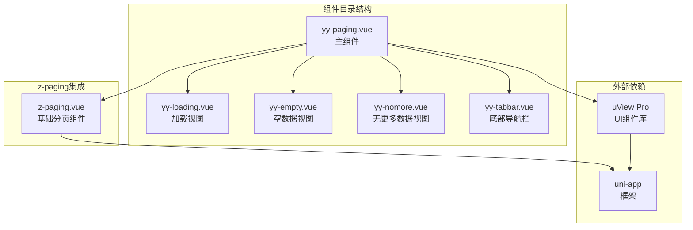
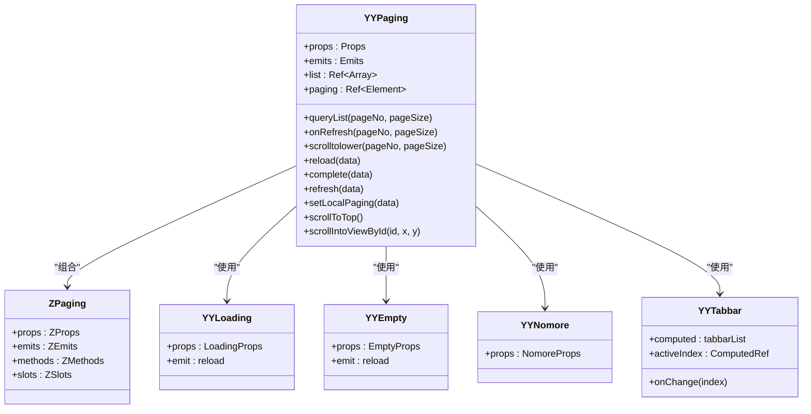
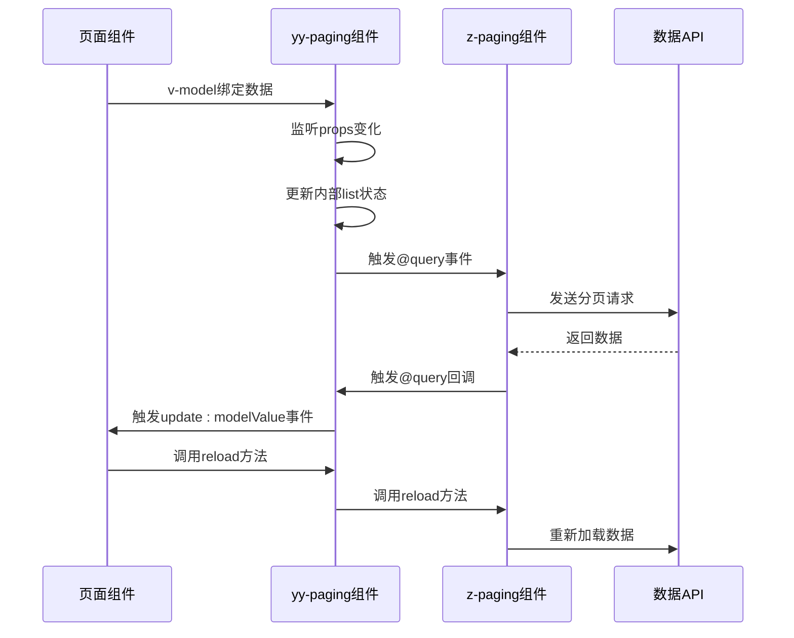
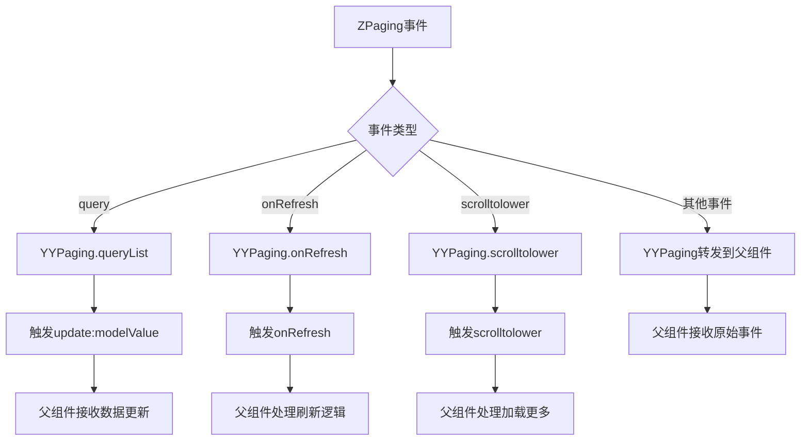
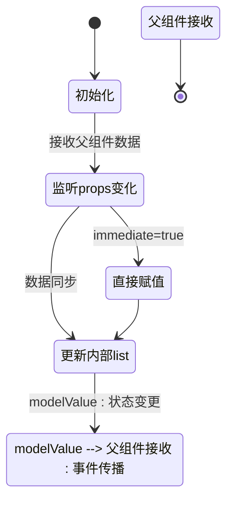
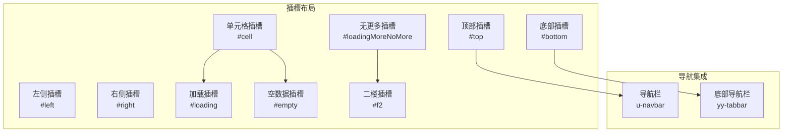
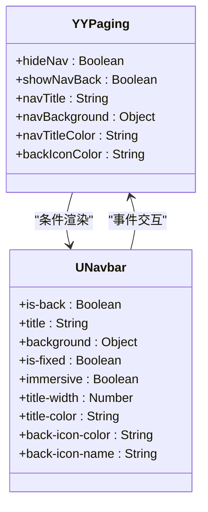
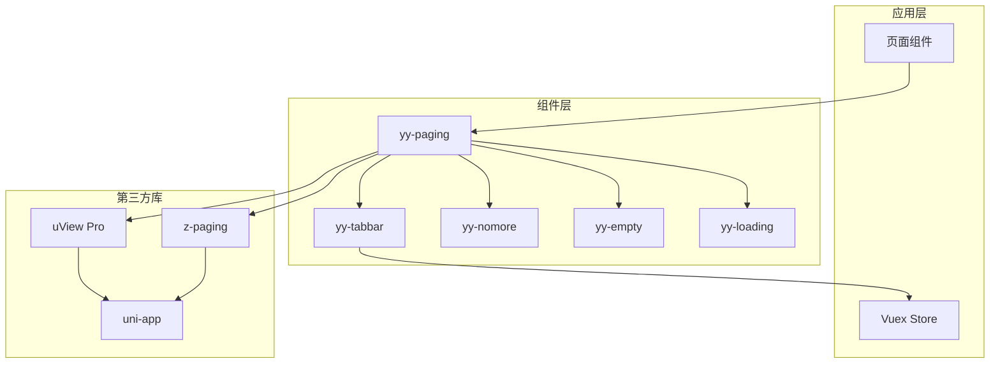
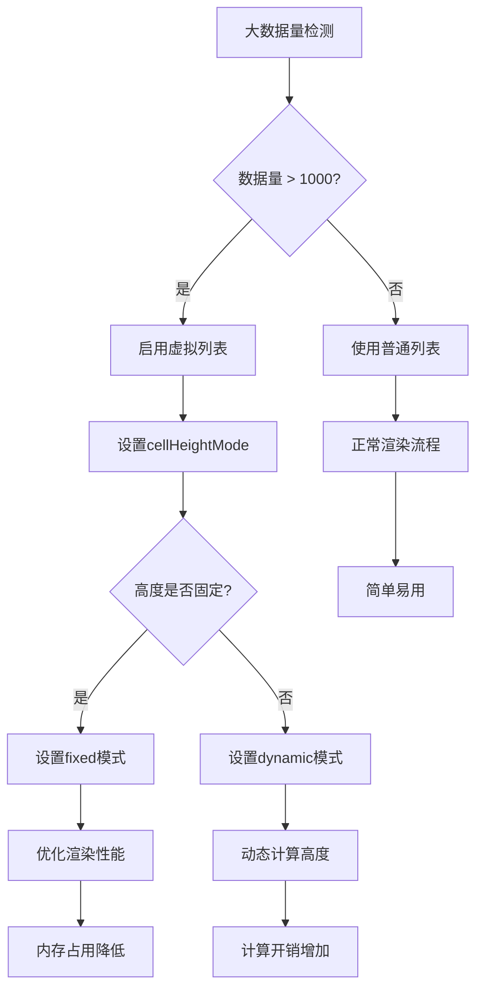

# yy-paging 分页组件

<cite>
**本文档引用的文件**
- [yy-paging.vue](file://components/yy-paging.vue)
- [z-paging.vue](file://uni_modules/z-paging/components/z-paging/z-paging.vue)
- [yy-loading.vue](file://components/yy-loading.vue)
- [yy-empty.vue](file://components/yy-empty.vue)
- [yy-nomore.vue](file://components/yy-nomore.vue)
- [yy-tabbar.vue](file://components/yy-tabbar.vue)
- [index.vue](file://pages/index/index.vue)
</cite>

## 目录
1. [简介](#简介)
2. [项目结构](#项目结构)
3. [核心组件](#核心组件)
4. [架构概览](#架构概览)
5. [详细组件分析](#详细组件分析)
6. [依赖关系分析](#依赖关系分析)
7. [性能考虑](#性能考虑)
8. [故障排除指南](#故障排除指南)
9. [结论](#结论)
10. [附录](#附录)

## 简介

yy-paging 是基于 z-paging 组件的二次封装分页组件，专为 uni-app 应用程序设计。该组件在保持 z-paging 强大功能的基础上，增加了对 uView Pro 组件库的深度集成，提供了更加符合项目需求的分页解决方案。

该组件主要特性包括：
- 基于 z-paging 的高性能分页实现
- uView Pro 组件库的无缝集成
- 自定义导航栏支持
- 虚拟列表优化
- 多种加载状态定制
- 完整的插槽系统

## 项目结构

yy-paging 组件位于 components 目录下，采用模块化设计，与 z-paging 组件形成清晰的层次结构：



**图表来源**
- [yy-paging.vue:1-127](file://components/yy-paging.vue#L1-L127)
- [z-paging.vue:15-444](file://uni_modules/z-paging/components/z-paging/z-paging.vue#L15-L444)

**章节来源**
- [yy-paging.vue:1-339](file://components/yy-paging.vue#L1-L339)

## 核心组件

### 组件架构设计

yy-paging 采用"外观模式"进行二次封装，通过组合多个子组件来实现丰富的功能：



**图表来源**
- [yy-paging.vue:129-331](file://components/yy-paging.vue#L129-L331)
- [z-paging.vue:445-662](file://uni_modules/z-paging/components/z-paging/z-paging.vue#L445-L662)

### 主要属性配置

组件提供了丰富的配置选项，涵盖数据绑定、样式定制、功能开关等多个方面：

| 属性名称 | 类型 | 默认值 | 描述 |
|---------|------|--------|------|
| modelValue | Array | [] | v-model 绑定的列表数据 |
| auto | Boolean | true | 是否自动触发首次加载 |
| bgColor | String | 'bg-gray-50' | 列表背景色 |
| loadingMoreEnabled | Boolean | true | 是否启用"加载更多"功能 |
| useVirtualList | Boolean | false | 是否启用虚拟列表 |
| usePageScroll | Boolean | false | 是否使用页面级滚动 |
| refresherEnabled | Boolean | true | 是否启用下拉刷新 |
| showTabbar | Boolean | false | 是否显示底部导航栏 |
| hideNav | Boolean | false | 是否隐藏导航栏 |
| showNavBack | Boolean | false | 是否显示导航栏返回按钮 |

**章节来源**
- [yy-paging.vue:132-257](file://components/yy-paging.vue#L132-L257)

## 架构概览

### 数据流架构

yy-paging 实现了双向数据绑定和事件传播的完整数据流：



**图表来源**
- [yy-paging.vue:262-277](file://components/yy-paging.vue#L262-L277)
- [yy-paging.vue:279-289](file://components/yy-paging.vue#L279-L289)

### 事件处理机制

组件实现了完整的事件冒泡和转发机制：



**图表来源**
- [yy-paging.vue:130](file://components/yy-paging.vue#L130)
- [yy-paging.vue:279-330](file://components/yy-paging.vue#L279-L330)

**章节来源**
- [yy-paging.vue:129-331](file://components/yy-paging.vue#L129-L331)

## 详细组件分析

### 组件属性详解

#### 数据绑定属性

组件的核心数据绑定通过 v-model 实现双向同步：



**图表来源**
- [yy-paging.vue:262-277](file://components/yy-paging.vue#L262-L277)

#### 虚拟列表配置

对于大数据量场景，组件提供了完善的虚拟列表支持：

| 属性 | 类型 | 默认值 | 说明 |
|------|------|--------|------|
| useVirtualList | Boolean | false | 启用虚拟列表 |
| cellHeightMode | String | 'fixed' | 固定高度模式 |
| virtualScrollFps | Number/String | 60 | 虚拟列表滚动采样帧率 |
| preloadPage | Number/String | 10 | 预加载页数 |
| cellKeyName | String | '' | 内置列表cell唯一key字段名 |

**章节来源**
- [yy-paging.vue:190-224](file://components/yy-paging.vue#L190-L224)

### 插槽系统设计

组件提供了完整的插槽系统，支持自定义内容的灵活布局：



**图表来源**
- [yy-paging.vue:60-125](file://components/yy-paging.vue#L60-L125)

#### 导航栏集成

组件集成了 uView Pro 的导航栏组件，提供统一的导航体验：



**图表来源**
- [yy-paging.vue:70-81](file://components/yy-paging.vue#L70-L81)

**章节来源**
- [yy-paging.vue:60-125](file://components/yy-paging.vue#L60-L125)

### 方法暴露机制

组件通过 defineExpose 暴露了关键的方法供父组件调用：

| 方法名称 | 参数 | 用途 | 说明 |
|----------|------|------|------|
| reload | data | 重新加载数据 | 调用 z-paging.reload |
| complete | data | 完成数据加载 | 调用 z-paging.complete |
| refresh | data | 刷新数据 | 调用 z-paging.refresh |
| setLocalPaging | data | 设置本地分页 | 调用 z-paging.setLocalPaging |
| scrollToTop | - | 滚动到顶部 | 调用 z-paging.scrollToTop |
| scrollIntoViewById | id,x,y | 滚动到指定元素 | 调用 z-paging.scrollIntoViewById |
| updatePageScrollTop | data | 更新页面滚动位置 | 调用 z-paging.updatePageScrollTop |
| pageReachBottom | - | 页面触底检测 | 调用 z-paging.pageReachBottom |
| doChatRecordLoadMore | - | 聊天记录加载更多 | 调用 z-paging.doChatRecordLoadMore |

**章节来源**
- [yy-paging.vue:295-330](file://components/yy-paging.vue#L295-L330)

## 依赖关系分析

### 组件依赖图



**图表来源**
- [yy-paging.vue:1-5](file://components/yy-paging.vue#L1-L5)
- [yy-tabbar.vue:14](file://components/yy-tabbar.vue#L14)

### 外部依赖分析

组件对外部依赖的处理策略：

1. **z-paging 依赖**：作为核心分页功能的基础
2. **uView Pro 依赖**：提供 UI 组件和主题系统
3. **uni-app 依赖**：运行时环境和 API 支持

**章节来源**
- [yy-paging.vue:1-5](file://components/yy-paging.vue#L1-L5)

## 性能考虑

### 虚拟列表优化

对于大数据量场景，建议启用虚拟列表以提升性能：



**图表来源**
- [yy-paging.vue:215-224](file://components/yy-paging.vue#L215-L224)

### 预加载策略

组件提供了灵活的预加载配置：

| 预加载页数 | 性能影响 | 适用场景 |
|------------|----------|----------|
| 1-3页 | 内存占用小 | 小数据量 |
| 5-10页 | 平衡性能 | 中等数据量 |
| 10+页 | 流畅度最佳 | 大数据量 |
| 0页 | 最省内存 | 特殊场景 |

**章节来源**
- [yy-paging.vue:210-214](file://components/yy-paging.vue#L210-L214)

## 故障排除指南

### 常见问题及解决方案

#### 数据绑定问题

**问题**：列表数据更新但界面不刷新
**解决方案**：
1. 确保使用 v-model 进行双向绑定
2. 检查数据引用是否发生变化
3. 验证 watch 监听器是否正常工作

#### 虚拟列表渲染异常

**问题**：虚拟列表显示错位或闪烁
**解决方案**：
1. 确保设置了正确的 cellKeyName
2. 检查 cellHeightMode 配置
3. 验证数据项的唯一性

#### 事件处理问题

**问题**：@query 事件未触发
**解决方案**：
1. 检查 auto 属性设置
2. 确认分页参数传递正确
3. 验证网络请求逻辑

**章节来源**
- [yy-paging.vue:262-289](file://components/yy-paging.vue#L262-L289)

### 调试技巧

1. **使用浏览器开发者工具**检查组件树结构
2. **启用 Vue DevTools**监控响应式数据变化
3. **利用 console.log**跟踪事件流向
4. **检查网络面板**验证 API 请求

## 结论

yy-paging 分页组件通过精心设计的二次封装，在保持 z-paging 强大功能的同时，提供了更加贴合项目需求的解决方案。其特点包括：

1. **完整的功能覆盖**：从基础分页到高级特性全面支持
2. **良好的扩展性**：通过插槽系统支持高度定制
3. **优秀的性能表现**：虚拟列表和预加载优化
4. **简洁的使用方式**：与 uView Pro 无缝集成

该组件适合各种规模的 uni-app 项目，能够有效提升开发效率和用户体验。

## 附录

### 使用示例

#### 基础分页使用

```vue
<yy-paging v-model="dataList" @query="queryList" ref="paging">
  <!-- 自定义列表项 -->
  <template #cell="{ item, index }">
    <view class="list-item">{{ item.title }}</view>
  </template>
</yy-paging>
```

#### 虚拟列表配置

```vue
<yy-paging 
  v-model="largeDataList" 
  :use-virtual-list="true"
  :cell-height-mode="'fixed'"
  :virtual-scroll-fps="60"
  :preload-page="10"
>
  <template #cell="{ item, index }">
    <view class="virtual-item">{{ item.content }}</view>
  </template>
</yy-paging>
```

#### 导航栏集成

```vue
<yy-paging 
  v-model="dataList" 
  :hide-nav="false"
  :show-nav-back="true"
  :nav-title="'我的数据'"
  :nav-background="{ backgroundColor: '#007AFF' }"
>
  <!-- 内容区域 -->
</yy-paging>
```

**章节来源**
- [index.vue:134-146](file://pages/index/index.vue#L134-L146)