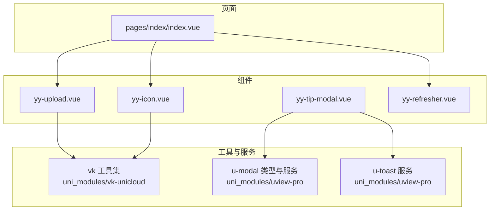
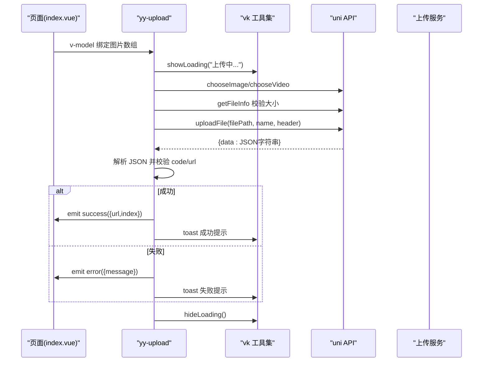
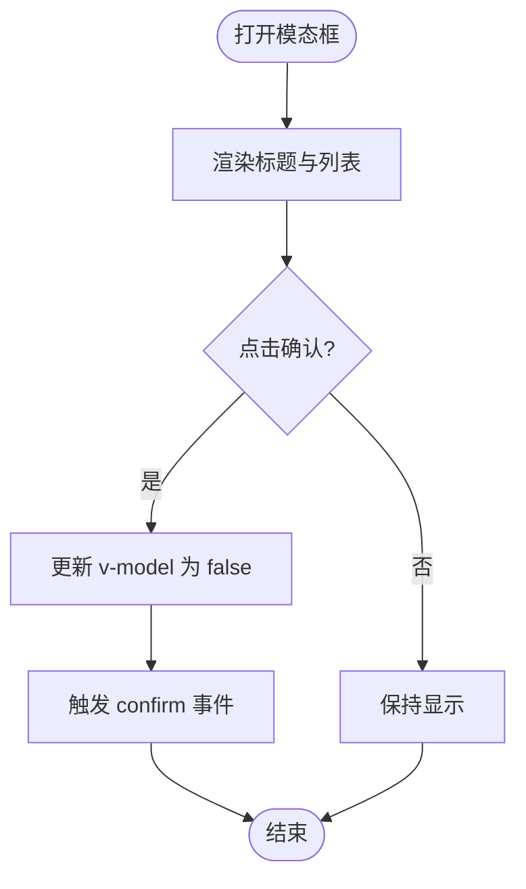
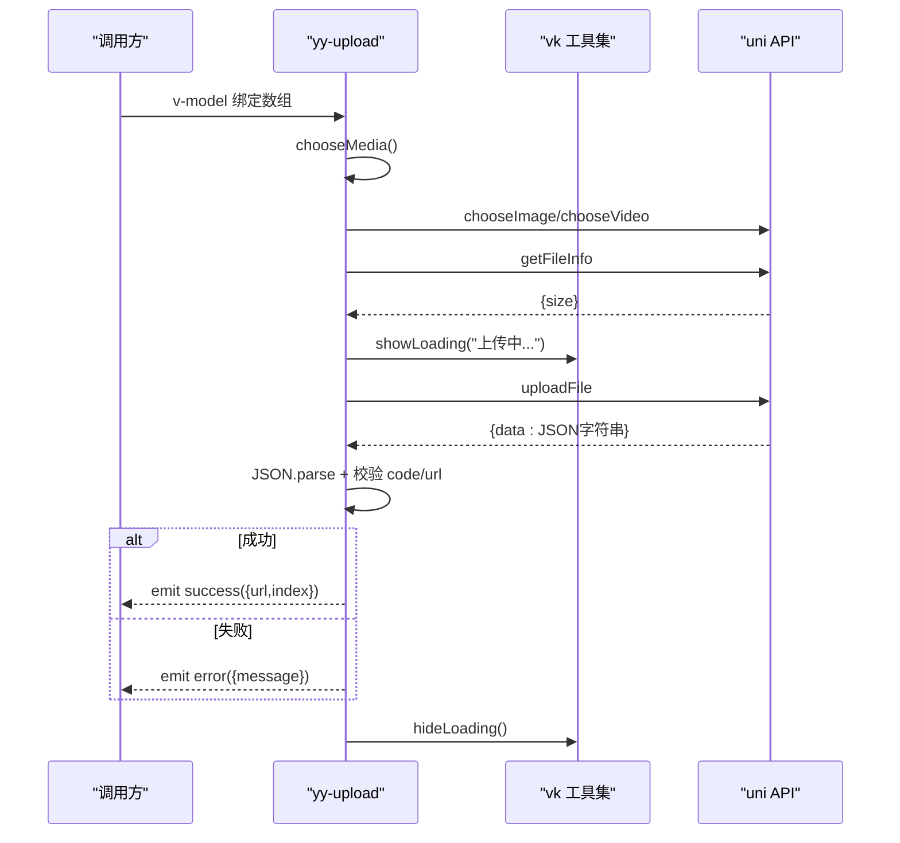
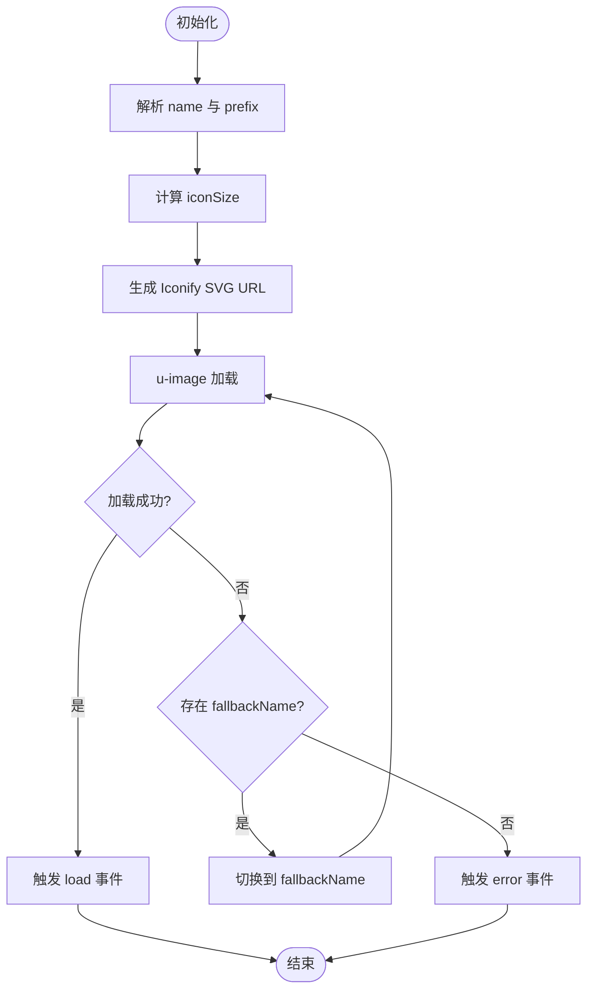
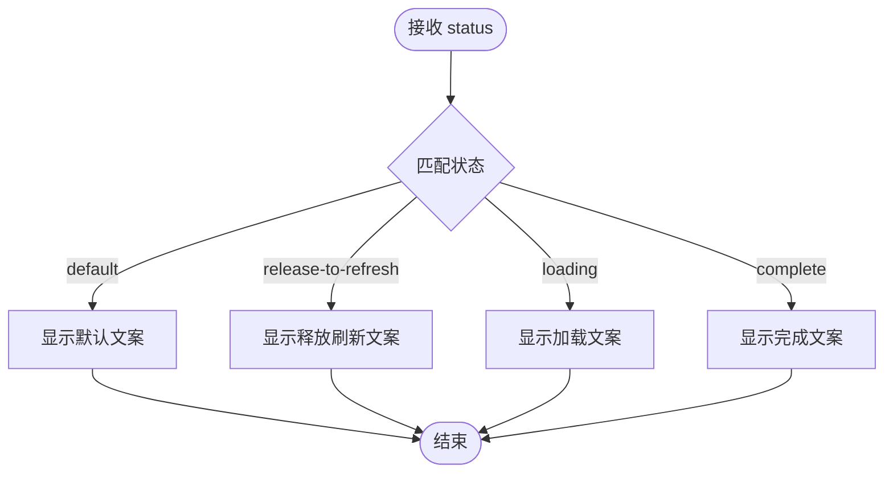
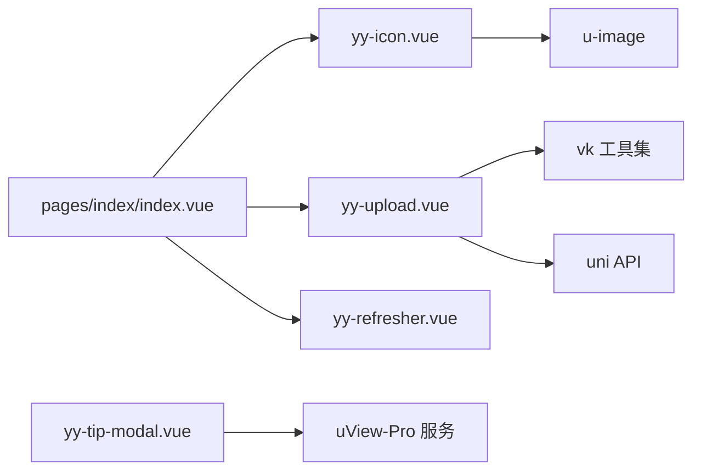

# 交互反馈组件

<cite>
**本文引用的文件**
- [yy-tip-modal.vue](file://components/yy-tip-modal.vue)
- [yy-upload.vue](file://components/yy-upload.vue)
- [yy-icon.vue](file://components/yy-icon.vue)
- [yy-refresher.vue](file://components/yy-refresher.vue)
- [index.vue](file://pages/index/index.vue)
- [myPubFunction.js](file://common/function/myPubFunction.js)
- [modal.js](file://uni_modules/vk-unicloud/vk_modules/vk-unicloud-page/libs/function/modal.js)
- [types.ts](file://uni_modules/uview-pro/components/u-modal/types.ts)
- [service.ts](file://uni_modules/uview-pro/components/u-modal/service.ts)
- [service.ts](file://uni_modules/uview-pro/components/u-toast/service.ts)
</cite>

## 目录
1. [简介](#简介)
2. [项目结构](#项目结构)
3. [核心组件](#核心组件)
4. [架构总览](#架构总览)
5. [详细组件分析](#详细组件分析)
6. [依赖关系分析](#依赖关系分析)
7. [性能考量](#性能考量)
8. [故障排查指南](#故障排查指南)
9. [结论](#结论)
10. [附录](#附录)

## 简介
本文件为“交互反馈组件群”的全面开发文档，聚焦以下四个组件：
- yy-tip-modal：底部提示模态框，用于消息展示、分条列表与确认交互
- yy-upload：多文件上传组件，支持图片/视频、逐个上传、进度与错误处理
- yy-icon：图标组件，基于 Iconify 动态加载，支持降级与样式定制
- yy-refresher：下拉刷新指示器，提供状态文本映射与动画资源

文档将从架构、数据流、处理逻辑、API/事件、错误处理与性能优化等方面进行深入解析，并给出组件协作模式与用户体验优化建议。

## 项目结构
组件位于 components 目录，页面 index.vue 中有图标组件的使用示例；通用工具函数位于 common/function；vk 工具集位于 uni_modules/vk-unicloud 下；uView-Pro 的模态与提示服务位于 uni_modules/uview-pro 下。

图表来源
- [index.vue:1-132](file://pages/index/index/index.vue#L1-L132)
- [yy-icon.vue:1-115](file://components/yy-icon.vue#L1-L115)
- [yy-upload.vue:1-313](file://components/yy-upload.vue#L1-L313)
- [yy-refresher.vue:1-51](file://components/yy-refresher.vue#L1-L51)
- [modal.js:1-405](file://uni_modules/vk-unicloud/vk_modules/vk-unicloud-page/libs/function/modal.js#L1-L405)
- [types.ts:1-142](file://uni_modules/uview-pro/components/u-modal/types.ts#L1-L142)
- [service.ts:1-49](file://uni_modules/uview-pro/components/u-modal/service.ts#L1-L49)
- [service.ts:1-41](file://uni_modules/uview-pro/components/u-toast/service.ts#L1-L41)

章节来源
- [index.vue:1-132](file://pages/index/index/index.vue#L1-L132)

## 核心组件
- yy-tip-modal：底部弹出、标题、列表项、确认按钮，支持 v-model 控制显隐与 confirm 事件
- yy-upload：v-model 绑定数组、最大数量、媒体类型、来源与压缩策略、逐个上传、错误与删除事件
- yy-icon：name/color/size/prefix/apiUrl/fallbackName/lazyLoad/fade/loadingIcon/errorIcon/bgColor/borderRadius/shape
- yy-refresher：status 映射到文案，静态 GIF 动画

章节来源
- [yy-tip-modal.vue:1-48](file://components/yy-tip-modal.vue#L1-L48)
- [yy-upload.vue:1-313](file://components/yy-upload.vue#L1-L313)
- [yy-icon.vue:1-115](file://components/yy-icon.vue#L1-L115)
- [yy-refresher.vue:1-51](file://components/yy-refresher.vue#L1-L51)

## 架构总览
组件间协作模式：
- 页面通过 vk 工具集统一调用 toast/alert/confirm/showLoading 等能力
- yy-upload 通过 uni.uploadFile 上传，结合 vk.showLoading/隐藏与事件回调
- yy-icon 基于 Iconify 动态生成 SVG URL，支持降级兜底
- yy-tip-modal 作为通用提示容器，可配合 uView-Pro 的 modal 服务使用

图表来源
- [yy-upload.vue:165-256](file://components/yy-upload.vue#L165-L256)
- [modal.js:328-355](file://uni_modules/vk-unicloud/vk_modules/vk-unicloud-page/libs/function/modal.js#L328-L355)

章节来源
- [yy-upload.vue:165-256](file://components/yy-upload.vue#L165-L256)
- [modal.js:328-355](file://uni_modules/vk-unicloud/vk_modules/vk-unicloud-page/libs/function/modal.js#L328-L355)

## 详细组件分析

### yy-tip-modal 提示模态框
- 功能要点
  - 底部弹出、圆角边框、标题与分条列表展示
  - 支持自定义确认文案与主色
  - v-model 控制显隐，confirm 事件用于确认回调
- 数据与状态
  - props：modelValue(Boolean)、title(String)、list(Array)、confirmText(String)、activeColor(String)
  - emit：update:modelValue、confirm
  - show 计算属性双向绑定
- 交互流程
  - 点击确认按钮 -> 关闭弹窗 -> 触发 confirm 事件

图表来源
- [yy-tip-modal.vue:27-46](file://components/yy-tip-modal.vue#L27-L46)

章节来源
- [yy-tip-modal.vue:1-48](file://components/yy-tip-modal.vue#L1-L48)

### yy-upload 文件上传
- 功能要点
  - 支持图片/视频，多选逐个上传
  - 限制最大数量与文件大小，超限提示
  - 上传中加载遮罩，成功/失败事件回调
  - 预览图片/视频，删除单项
- 关键 props
  - modelValue(Array)、maxCount(Number)、maxSize(Number)、disabled(Boolean)、sizeType(Array)、sourceType(Array)、column(Number)、uploadText(String)、mediaType(String)、tips(String)
- 关键事件
  - update:modelValue、success、error、delete
- 上传流程
  - chooseMedia -> getFileInfo 校验 -> uploadFile -> 解析返回 -> 成功/失败分支 -> emit 事件 -> hideLoading

图表来源
- [yy-upload.vue:165-256](file://components/yy-upload.vue#L165-L256)
- [modal.js:328-355](file://uni_modules/vk-unicloud/vk_modules/vk-unicloud-page/libs/function/modal.js#L328-L355)

章节来源
- [yy-upload.vue:68-313](file://components/yy-upload.vue#L68-L313)

### yy-icon 图标组件
- 功能要点
  - 基于 Iconify 动态生成 SVG URL，支持颜色与尺寸
  - 支持前缀简化 name 写法，支持 fallbackName 降级
  - 支持懒加载、淡入、加载/错误图标、背景色与圆角
- 关键 props
  - name(String)、color(String)、size([Number,String])、prefix(String)、apiUrl(String)、fallbackName(String)、lazyLoad(Boolean)、fade(Boolean)、showLoading(Boolean)、showError(Boolean)、loadingIcon(String)、errorIcon(String)、bgColor(String)、borderRadius([String,Number])、shape(String)
- 行为细节
  - 解析 name 与 prefix，生成最终图标名
  - 计算 iconSize，确保 rpx 单位
  - onError 时若存在 fallbackName 则切换并触发外部 error

图表来源
- [yy-icon.vue:62-114](file://components/yy-icon.vue#L62-L114)

章节来源
- [yy-icon.vue:1-115](file://components/yy-icon.vue#L1-L115)

### yy-refresher 下拉刷新
- 功能要点
  - 根据 status 返回对应文案，展示 GIF 动画
  - 适配 rpx 尺寸与 Flex 布局
- 关键 props
  - status(String)：default/release-to-refresh/loading/complete
- 状态映射
  - default → “哎呀，用点力继续下拉！”
  - release-to-refresh → “拉疼我啦，松手刷新~~”
  - loading → “正在努力刷新中...”
  - complete → “刷新成功啦~”

图表来源
- [yy-refresher.vue:17-25](file://components/yy-refresher.vue#L17-L25)

章节来源
- [yy-refresher.vue:1-51](file://components/yy-refresher.vue#L1-L51)

## 依赖关系分析
- 组件依赖
  - yy-upload 依赖 vk 工具集（toast、showLoading、hideLoading）与 uni API（chooseImage/chooseVideo/uploadFile/getFileInfo/previewImage/previewMedia）
  - yy-icon 依赖 u-image 与 Iconify 动态 SVG
  - yy-tip-modal 依赖 u-popup 与 u-button，常与 vk.toast、vk.confirm 协作
- 页面使用
  - index.vue 中使用 yy-icon 进行品牌与功能入口展示
  - 页面中大量使用 vk 工具集进行提示与确认

图表来源
- [index.vue:1-132](file://pages/index/index/index.vue#L1-L132)
- [yy-upload.vue:1-313](file://components/yy-upload.vue#L1-L313)
- [yy-icon.vue:1-115](file://components/yy-icon.vue#L1-L115)
- [yy-refresher.vue:1-51](file://components/yy-refresher.vue#L1-L51)
- [modal.js:1-405](file://uni_modules/vk-unicloud/vk_modules/vk-unicloud-page/libs/function/modal.js#L1-L405)
- [types.ts:1-142](file://uni_modules/uview-pro/components/u-modal/types.ts#L1-L142)
- [service.ts:1-49](file://uni_modules/uview-pro/components/u-modal/service.ts#L1-L49)

章节来源
- [index.vue:1-132](file://pages/index/index/index.vue#L1-L132)
- [yy-upload.vue:1-313](file://components/yy-upload.vue#L1-L313)
- [yy-icon.vue:1-115](file://components/yy-icon.vue#L1-L115)
- [yy-refresher.vue:1-51](file://components/yy-refresher.vue#L1-L51)
- [modal.js:1-405](file://uni_modules/vk-unicloud/vk_modules/vk-unicloud-page/libs/function/modal.js#L1-L405)

## 性能考量
- 上传组件
  - 逐个上传避免并发风暴，但会增加总耗时；可考虑在业务允许时批量上传并分块处理
  - 上传前先 getFileInfo 校验大小，减少无效传输
  - 使用 showLoading/ hideLoading 精准控制加载状态，避免重复叠加
- 图标组件
  - 动态 SVG 体积可控，建议合理设置 size 与 color，避免过大尺寸导致渲染压力
  - 合理使用 lazyLoad 与 fade，提升首屏体验
- 模态与提示
  - 使用 vk 工具集统一对话与提示，避免重复实例化
  - 在高频交互场景下，注意避免短时间内多次触发 confirm/toast

## 故障排查指南
- 上传失败
  - 症状：上传后立即失败或无响应
  - 排查：检查服务器返回结构与 code/url 字段；确认 token 是否正确；查看 getFileInfo 校验是否命中 maxSize
  - 处理：在 error 回调中提示具体原因，并在 finally 中统一隐藏 loading
- 图标不显示
  - 症状：图标空白或闪烁
  - 排查：确认 name 与 prefix 是否正确；检查 apiUrl 可达性；验证 fallbackName 是否设置
  - 处理：启用 showError 或监听 error 事件，必要时回退到本地占位图
- 模态确认无效
  - 症状：点击确认无反应
  - 排查：确认 v-model 绑定与 update:modelValue 事件是否正确传递
  - 处理：在 confirm 事件中仅做关闭与回调，避免复杂逻辑阻塞

章节来源
- [yy-upload.vue:202-256](file://components/yy-upload.vue#L202-L256)
- [yy-icon.vue:107-114](file://components/yy-icon.vue#L107-L114)
- [yy-tip-modal.vue:36-46](file://components/yy-tip-modal.vue#L36-L46)

## 结论
本组件群围绕“提示/上传/图标/刷新”四大交互反馈维度构建，具备清晰的职责边界与良好的扩展性。通过 vk 工具集与 uni API 的协同，实现了跨端一致的用户体验。建议在实际业务中：
- 统一使用 vk 工具集进行提示与确认，减少重复代码
- 上传组件根据业务场景权衡逐个/批量上传策略
- 图标组件合理设置尺寸与前缀，保证加载效率与一致性
- 模态与提示组件遵循最小可用原则，避免过度打扰用户

## 附录

### API 与事件清单

- yy-tip-modal
  - Props
    - modelValue(Boolean)：控制显隐
    - title(String)：标题文本
    - list(Array)：列表项数组
    - confirmText(String)：确认按钮文案
    - activeColor(String)：主色
  - Events
    - update:modelValue：显隐变更
    - confirm：确认回调

- yy-upload
  - Props
    - modelValue(Array)：绑定的媒体数组
    - maxCount(Number)：最大数量
    - maxSize(Number)：最大文件大小(MB)
    - disabled(Boolean)：禁用状态
    - sizeType(Array)：压缩策略
    - sourceType(Array)：图片来源
    - column(Number)：网格列数
    - uploadText(String)：上传按钮文案
    - mediaType(String)：媒体类型(image/video)
    - tips(String)：提示文字
  - Events
    - update:modelValue：列表变更
    - success：上传成功，参数包含 url 与 index
    - error：上传失败，参数为错误信息
    - delete：删除单项，参数包含 url 与 index

- yy-icon
  - Props
    - name(String)：图标名，支持 ri:name 形式
    - color(String)：颜色
    - size([Number,String])：尺寸
    - prefix(String)：默认前缀
    - apiUrl(String)：Iconify API 地址
    - fallbackName(String)：失败时的兜底图标
    - lazyLoad(Boolean)、fade(Boolean)、showLoading(Boolean)、showError(Boolean)
    - loadingIcon(String)、errorIcon(String)
    - bgColor(String)、borderRadius([String,Number])、shape(String)
  - Events
    - error：加载失败
    - load：加载成功
    - click：点击

- yy-refresher
  - Props
    - status(String)：default/release-to-refresh/loading/complete
  - Events
    - 无

- 页面与工具
  - vk 工具集
    - toast/alert/confirm/showLoading/hideLoading 等
  - uView-Pro
    - u-modal 类型定义与事件命名规范
    - u-toast 事件命名规范

章节来源
- [yy-tip-modal.vue:27-46](file://components/yy-tip-modal.vue#L27-L46)
- [yy-upload.vue:68-124](file://components/yy-upload.vue#L68-L124)
- [yy-icon.vue:22-58](file://components/yy-icon.vue#L22-L58)
- [yy-refresher.vue:9-15](file://components/yy-refresher.vue#L9-L15)
- [modal.js:328-355](file://uni_modules/vk-unicloud/vk_modules/vk-unicloud-page/libs/function/modal.js#L328-L355)
- [types.ts:10-136](file://uni_modules/uview-pro/components/u-modal/types.ts#L10-L136)
- [service.ts:10-48](file://uni_modules/uview-pro/components/u-modal/service.ts#L10-L48)
- [service.ts:10-41](file://uni_modules/uview-pro/components/u-toast/service.ts#L10-L41)