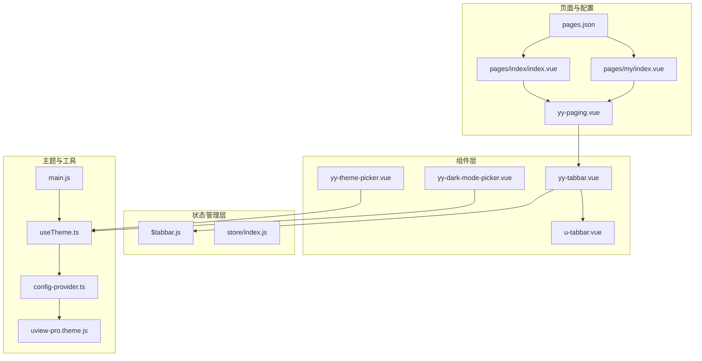
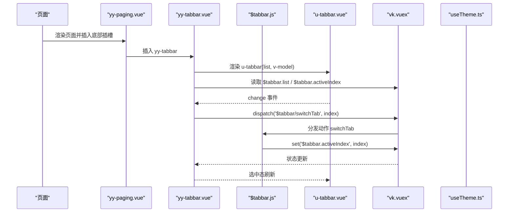
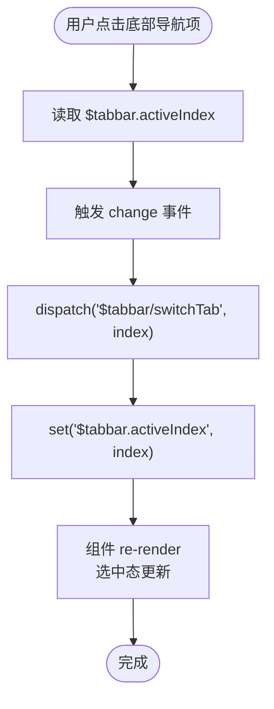
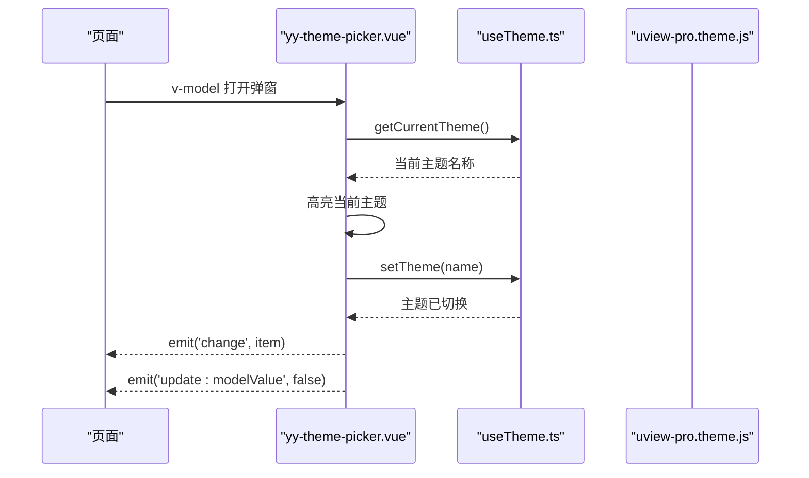
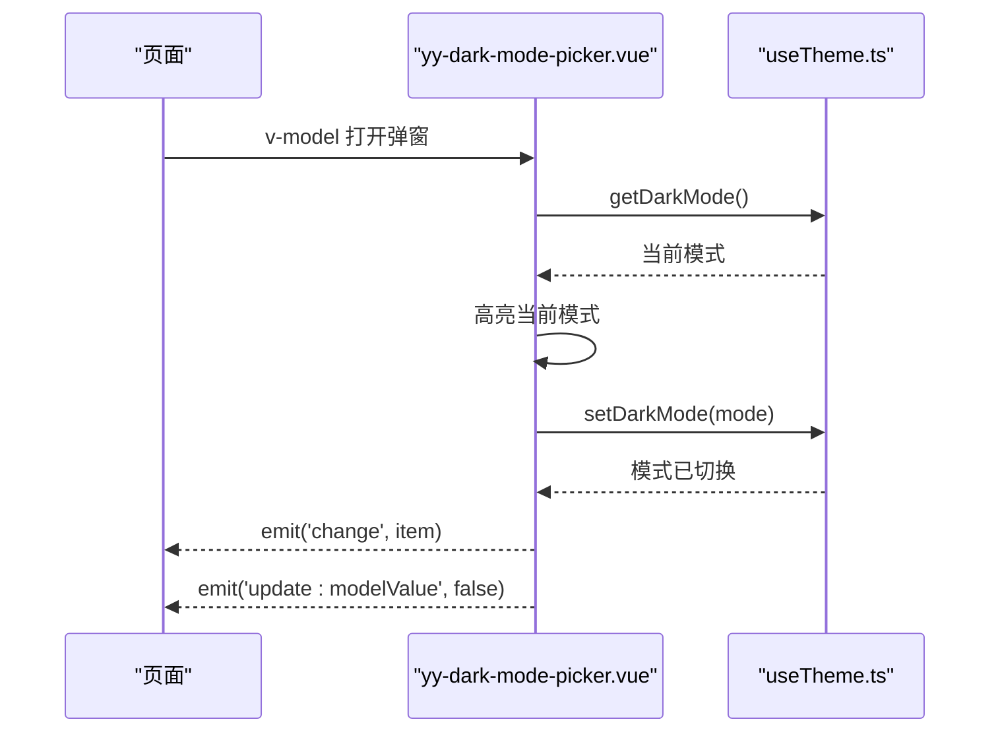
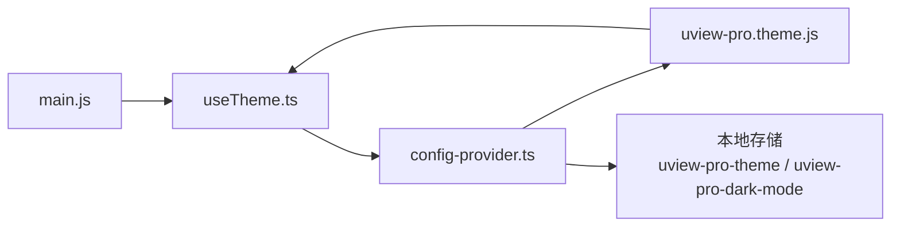
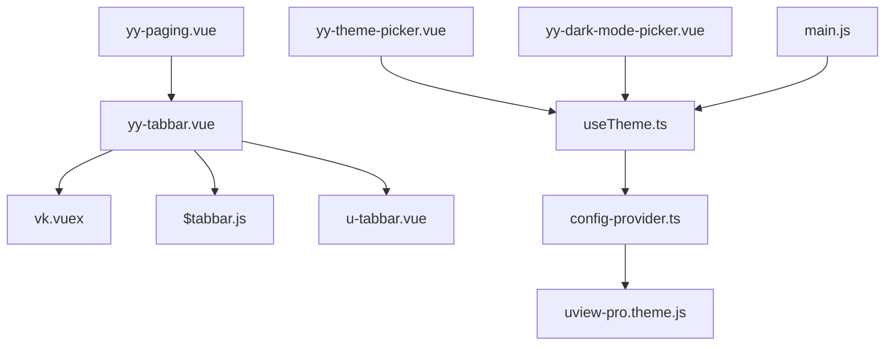

# 导航类组件

<cite>
**本文档引用的文件**
- [yy-tabbar.vue](file://components/yy-tabbar.vue)
- [yy-theme-picker.vue](file://components/yy-theme-picker.vue)
- [$tabbar.js](file://store/modules/$tabbar.js)
- [uview-pro.theme.js](file://common/function/uview-pro.theme.js)
- [useTheme.ts](file://uni_modules/uview-pro/libs/hooks/useTheme.ts)
- [config-provider.ts](file://uni_modules/uview-pro/libs/util/config-provider.ts)
- [main.js](file://main.js)
- [pages.json](file://pages.json)
- [yy-paging.vue](file://components/yy-paging.vue)
- [u-tabbar.vue](file://uni_modules/uview-pro/components/u-tabbar/u-tabbar.vue)
- [index.vue](file://pages/index/index.vue)
- [index.vue](file://pages/my/index.vue)
</cite>

## 目录
1. [简介](#简介)
2. [项目结构](#项目结构)
3. [核心组件](#核心组件)
4. [架构总览](#架构总览)
5. [详细组件分析](#详细组件分析)
6. [依赖关系分析](#依赖关系分析)
7. [性能考量](#性能考量)
8. [故障排查指南](#故障排查指南)
9. [结论](#结论)
10. [附录](#附录)

## 简介
本文件面向导航类组件群的开发与维护，重点解析以下组件：
- yy-tabbar 底部导航：基于 uview-pro 的 u-tabbar，结合 vk-unicloud 的 vuex 与 store 模块，实现导航项配置、选中状态管理与路由跳转。
- yy-theme-picker 主题选择器：提供主题色切换能力，基于 uview-pro 的 useTheme 能力，支持主题列表、当前主题同步与事件回调。
- yy-dark-mode-picker 暗黑模式切换器：提供深色/浅色/自动三种模式切换，同样基于 useTheme 能力，支持模式同步与事件回调。

文档将从架构、数据流、处理逻辑、集成点、错误处理与性能优化等方面进行系统化说明，并给出配置选项、事件处理、样式定制与可访问性、响应式适配建议。

## 项目结构
导航类组件位于 components 目录，状态管理位于 store/modules，主题与主题切换能力来自 uview-pro 与 vk-unicloud 的组合。

**图表来源**
- [yy-tabbar.vue:1-38](file://components/yy-tabbar.vue#L1-L38)
- [$tabbar.js:1-78](file://store/modules/$tabbar.js#L1-L78)
- [u-tabbar.vue:1-200](file://uni_modules/uview-pro/components/u-tabbar/u-tabbar.vue#L1-L200)
- [yy-theme-picker.vue:1-106](file://components/yy-theme-picker.vue#L1-L106)
- [yy-dark-mode-picker.vue:1-101](file://components/yy-dark-mode-picker.vue#L1-L101)
- [useTheme.ts:1-173](file://uni_modules/uview-pro/libs/hooks/useTheme.ts#L1-L173)
- [config-provider.ts:1-486](file://uni_modules/uview-pro/libs/util/config-provider.ts#L1-L486)
- [uview-pro.theme.js:1-257](file://common/function/uview-pro.theme.js#L1-L257)
- [main.js:1-49](file://main.js#L1-L49)
- [pages.json:1-87](file://pages.json#L1-L87)
- [yy-paging.vue:69-119](file://components/yy-paging.vue#L69-L119)
- [index.vue:1-755](file://pages/index/index.vue#L1-L755)
- [index.vue:1-726](file://pages/my/index.vue#L1-L726)

**章节来源**
- [yy-tabbar.vue:1-38](file://components/yy-tabbar.vue#L1-L38)
- [yy-theme-picker.vue:1-106](file://components/yy-theme-picker.vue#L1-L106)
- [yy-dark-mode-picker.vue:1-101](file://components/yy-dark-mode-picker.vue#L1-L101)
- [$tabbar.js:1-78](file://store/modules/$tabbar.js#L1-L78)
- [useTheme.ts:1-173](file://uni_modules/uview-pro/libs/hooks/useTheme.ts#L1-L173)
- [config-provider.ts:1-486](file://uni_modules/uview-pro/libs/util/config-provider.ts#L1-L486)
- [uview-pro.theme.js:1-257](file://common/function/uview-pro.theme.js#L1-L257)
- [main.js:1-49](file://main.js#L1-L49)
- [pages.json:1-87](file://pages.json#L1-L87)
- [yy-paging.vue:69-119](file://components/yy-paging.vue#L69-L119)
- [index.vue:1-755](file://pages/index/index.vue#L1-L755)
- [index.vue:1-726](file://pages/my/index.vue#L1-L726)

## 核心组件
- yy-tabbar：封装 u-tabbar，通过 vk.vuex 读取与写入 $tabbar.activeIndex 与 $tabbar.list，实现导航项渲染与选中状态双向绑定，同时派发 $tabbar/switchTab 动作完成状态更新。
- yy-theme-picker：基于 useTheme 的 setTheme/getCurrentTheme，提供主题列表选择、当前主题高亮、事件回调与弹窗交互。
- yy-dark-mode-picker：基于 useTheme 的 setDarkMode/getDarkMode，提供“开启/自动/关闭”三种模式选择、当前模式高亮与事件回调。

**章节来源**
- [yy-tabbar.vue:1-38](file://components/yy-tabbar.vue#L1-L38)
- [yy-theme-picker.vue:1-106](file://components/yy-theme-picker.vue#L1-L106)
- [yy-dark-mode-picker.vue:1-101](file://components/yy-dark-mode-picker.vue#L1-L101)
- [$tabbar.js:1-78](file://store/modules/$tabbar.js#L1-L78)
- [useTheme.ts:1-173](file://uni_modules/uview-pro/libs/hooks/useTheme.ts#L1-L173)

## 架构总览
导航类组件与全局状态、主题系统、页面容器的关系如下：

**图表来源**
- [yy-paging.vue:69-119](file://components/yy-paging.vue#L69-L119)
- [yy-tabbar.vue:1-38](file://components/yy-tabbar.vue#L1-L38)
- [u-tabbar.vue:1-200](file://uni_modules/uview-pro/components/u-tabbar/u-tabbar.vue#L1-L200)
- [$tabbar.js:1-78](file://store/modules/$tabbar.js#L1-L78)

**章节来源**
- [yy-paging.vue:69-119](file://components/yy-paging.vue#L69-L119)
- [yy-tabbar.vue:1-38](file://components/yy-tabbar.vue#L1-L38)
- [u-tabbar.vue:1-200](file://uni_modules/uview-pro/components/u-tabbar/u-tabbar.vue#L1-L200)
- [$tabbar.js:1-78](file://store/modules/$tabbar.js#L1-L78)

## 详细组件分析

### yy-tabbar 底部导航组件
- 数据源与状态管理
  - 导航项列表与当前索引通过 vk.vuex 读取，分别对应 $tabbar.list 与 $tabbar.activeIndex。
  - 选中态双向绑定：computed.get 读取 activeIndex；computed.set 与 onChange 均派发 $tabbar/switchTab 动作，确保状态一致性。
- 导航项配置
  - 列表项包含 iconPath/selectedIconPath/text/pagePath 等字段，用于渲染图标、文本与跳转目标。
- 路由跳转机制
  - 组件本身不直接处理路由跳转，而是通过状态更新触发全局状态变更，页面容器或业务逻辑负责导航跳转。
- 与 u-tabbar 的关系
  - 内部使用 u-tabbar 渲染，支持自定义图标、徽标、禁用等扩展能力。

**图表来源**
- [yy-tabbar.vue:1-38](file://components/yy-tabbar.vue#L1-L38)
- [$tabbar.js:1-78](file://store/modules/$tabbar.js#L1-L78)

**章节来源**
- [yy-tabbar.vue:1-38](file://components/yy-tabbar.vue#L1-L38)
- [$tabbar.js:1-78](file://store/modules/$tabbar.js#L1-L78)
- [u-tabbar.vue:1-200](file://uni_modules/uview-pro/components/u-tabbar/u-tabbar.vue#L1-L200)

### yy-theme-picker 主题选择器
- 能力与接口
  - 基于 useTheme 提供 setTheme/getCurrentTheme，支持主题切换与当前主题读取。
  - 支持自定义主题列表 themes（默认使用 uview-pro.theme.js 中的主题集合），支持标题 title 与活动色 activeColor。
- 交互流程
  - 打开弹窗时，watch 监听 modelValue，拉取当前主题名称并高亮对应项。
  - 点击主题项后，调用 setTheme 切换主题，关闭弹窗并触发 change 事件。
- 事件与属性
  - 事件：update:modelValue、change
  - 属性：modelValue、title、themes、activeColor

**图表来源**
- [yy-theme-picker.vue:1-106](file://components/yy-theme-picker.vue#L1-L106)
- [useTheme.ts:1-173](file://uni_modules/uview-pro/libs/hooks/useTheme.ts#L1-L173)
- [uview-pro.theme.js:1-257](file://common/function/uview-pro.theme.js#L1-L257)

**章节来源**
- [yy-theme-picker.vue:1-106](file://components/yy-theme-picker.vue#L1-L106)
- [useTheme.ts:1-173](file://uni_modules/uview-pro/libs/hooks/useTheme.ts#L1-L173)
- [uview-pro.theme.js:1-257](file://common/function/uview-pro.theme.js#L1-L257)

### yy-dark-mode-picker 暗黑模式切换器
- 能力与接口
  - 基于 useTheme 提供 setDarkMode/getDarkMode/isInDarkMode，支持“开启/自动/关闭”三种模式。
  - 支持标题 title 与活动色 activeColor。
- 交互流程
  - 打开弹窗时，watch 监听 modelValue，拉取当前暗黑模式并高亮对应项。
  - 选择后调用 setDarkMode，关闭弹窗并触发 change 事件。
- 事件与属性
  - 事件：update:modelValue、change
  - 属性：modelValue、title、activeColor

**图表来源**
- [yy-dark-mode-picker.vue:1-101](file://components/yy-dark-mode-picker.vue#L1-L101)
- [useTheme.ts:1-173](file://uni_modules/uview-pro/libs/hooks/useTheme.ts#L1-L173)

**章节来源**
- [yy-dark-mode-picker.vue:1-101](file://components/yy-dark-mode-picker.vue#L1-L101)
- [useTheme.ts:1-173](file://uni_modules/uview-pro/libs/hooks/useTheme.ts#L1-L173)

### 主题系统与全局状态协作
- 主题初始化与持久化
  - 在 main.js 中通过 app.use(uview-pro, { theme }) 注入主题配置，包含默认主题与默认暗黑模式。
  - useTheme.ts 与 config-provider.ts 负责主题与暗黑模式的切换、持久化与 CSS 变量注入。
- 主题数据结构
  - uview-pro.theme.js 提供多套主题，每套主题包含 name、label、color 等字段。
- 导航与主题联动
  - 页面通过 uni.$u.color.* 使用主题色，组件样式与交互色随主题动态变化。

**图表来源**
- [main.js:1-49](file://main.js#L1-L49)
- [useTheme.ts:1-173](file://uni_modules/uview-pro/libs/hooks/useTheme.ts#L1-L173)
- [config-provider.ts:1-486](file://uni_modules/uview-pro/libs/util/config-provider.ts#L1-L486)
- [uview-pro.theme.js:1-257](file://common/function/uview-pro.theme.js#L1-L257)

**章节来源**
- [main.js:1-49](file://main.js#L1-L49)
- [useTheme.ts:1-173](file://uni_modules/uview-pro/libs/hooks/useTheme.ts#L1-L173)
- [config-provider.ts:1-486](file://uni_modules/uview-pro/libs/util/config-provider.ts#L1-L486)
- [uview-pro.theme.js:1-257](file://common/function/uview-pro.theme.js#L1-L257)

## 依赖关系分析
- 组件依赖
  - yy-tabbar 依赖 vk.vuex 与 $tabbar 模块，依赖 u-tabbar 渲染。
  - yy-theme-picker 与 yy-dark-mode-picker 依赖 useTheme 能力。
- 状态依赖
  - $tabbar 模块提供 activeIndex 与 list 的读写，以及更新角标、红点、列表替换等动作。
- 主题依赖
  - useTheme 与 config-provider 负责主题与暗黑模式的切换与持久化。
- 页面依赖
  - yy-paging 在底部插槽中插入 yy-tabbar，页面通过导航容器统一管理底部导航。

**图表来源**
- [yy-tabbar.vue:1-38](file://components/yy-tabbar.vue#L1-L38)
- [$tabbar.js:1-78](file://store/modules/$tabbar.js#L1-L78)
- [u-tabbar.vue:1-200](file://uni_modules/uview-pro/components/u-tabbar/u-tabbar.vue#L1-L200)
- [yy-theme-picker.vue:1-106](file://components/yy-theme-picker.vue#L1-L106)
- [yy-dark-mode-picker.vue:1-101](file://components/yy-dark-mode-picker.vue#L1-L101)
- [useTheme.ts:1-173](file://uni_modules/uview-pro/libs/hooks/useTheme.ts#L1-L173)
- [config-provider.ts:1-486](file://uni_modules/uview-pro/libs/util/config-provider.ts#L1-L486)
- [uview-pro.theme.js:1-257](file://common/function/uview-pro.theme.js#L1-L257)
- [main.js:1-49](file://main.js#L1-L49)
- [yy-paging.vue:69-119](file://components/yy-paging.vue#L69-L119)

**章节来源**
- [yy-tabbar.vue:1-38](file://components/yy-tabbar.vue#L1-L38)
- [yy-theme-picker.vue:1-106](file://components/yy-theme-picker.vue#L1-L106)
- [yy-dark-mode-picker.vue:1-101](file://components/yy-dark-mode-picker.vue#L1-L101)
- [$tabbar.js:1-78](file://store/modules/$tabbar.js#L1-L78)
- [useTheme.ts:1-173](file://uni_modules/uview-pro/libs/hooks/useTheme.ts#L1-L173)
- [config-provider.ts:1-486](file://uni_modules/uview-pro/libs/util/config-provider.ts#L1-L486)
- [uview-pro.theme.js:1-257](file://common/function/uview-pro.theme.js#L1-L257)
- [main.js:1-49](file://main.js#L1-L49)
- [yy-paging.vue:69-119](file://components/yy-paging.vue#L69-L119)

## 性能考量
- 状态读写
  - 使用 vk.vuex.get 与 vk.vuex.set 读写 $tabbar.*，避免直接操作 store 实例，减少耦合与潜在的重复渲染。
- 主题切换
  - useTheme 内部对主题与暗黑模式进行持久化，避免频繁 IO；组件在打开弹窗时才拉取当前主题/模式，降低不必要的计算。
- 渲染优化
  - u-tabbar 对图标与文本的渲染做了基础优化，组件层尽量复用 computed 与响应式引用，避免深层对象变更导致的全量重渲染。

[本节为通用性能建议，不涉及具体文件分析]

## 故障排查指南
- 导航不生效
  - 检查 $tabbar.list 与 $tabbar.activeIndex 是否正确写入；确认 dispatch('$tabbar/switchTab', index) 是否被触发。
  - 确认页面容器是否正确插入 yy-tabbar。
- 主题切换无效
  - 检查 useTheme.setTheme 是否被调用；确认 config-provider.ts 的 applyTheme 是否执行；确认本地存储键值是否存在。
- 暗黑模式异常
  - 检查 useTheme.setDarkMode 传参是否合法；确认 isInDarkMode 与 getDarkMode 的返回值是否符合预期。
- 页面配置问题
  - 检查 pages.json 中的 easycom 与 tabBar 配置，确保组件别名与全局样式生效。

**章节来源**
- [yy-tabbar.vue:1-38](file://components/yy-tabbar.vue#L1-L38)
- [$tabbar.js:1-78](file://store/modules/$tabbar.js#L1-L78)
- [useTheme.ts:1-173](file://uni_modules/uview-pro/libs/hooks/useTheme.ts#L1-L173)
- [config-provider.ts:1-486](file://uni_modules/uview-pro/libs/util/config-provider.ts#L1-L486)
- [pages.json:1-87](file://pages.json#L1-L87)

## 结论
导航类组件通过 vk.vuex 与 store 模块实现导航项配置与选中状态管理，结合 uview-pro 的主题系统与 useTheme 能力，实现了主题切换与暗黑模式切换的统一管理。组件设计遵循低耦合、高内聚原则，通过事件与属性对外暴露清晰的接口，便于在页面容器中灵活集成与扩展。

[本节为总结性内容，不涉及具体文件分析]

## 附录

### 组件配置与事件清单
- yy-tabbar
  - 属性：无（依赖 vk.vuex 与 $tabbar 模块）
  - 事件：无（通过状态驱动）
- yy-theme-picker
  - 属性：modelValue(Boolean)、title(String)、themes(Array)、activeColor(String)
  - 事件：update:modelValue(Boolean)、change(Object)
- yy-dark-mode-picker
  - 属性：modelValue(Boolean)、title(String)、activeColor(String)
  - 事件：update:modelValue(Boolean)、change(Object)

**章节来源**
- [yy-theme-picker.vue:54-71](file://components/yy-theme-picker.vue#L54-L71)
- [yy-dark-mode-picker.vue:35-48](file://components/yy-dark-mode-picker.vue#L35-L48)

### 样式定制方法
- 主题色使用
  - 通过 uni.$u.color.* 获取当前主题色，组件样式中直接使用主题色变量，随主题切换自动更新。
- 弹窗与交互
  - 主题选择器与暗黑模式选择器采用底部弹窗，支持圆角与安全区域适配，可通过属性调整标题与颜色。

**章节来源**
- [index.vue:308-334](file://pages/index/index.vue#L308-L334)
- [index.vue:266-282](file://pages/my/index.vue#L266-L282)
- [yy-theme-picker.vue:1-106](file://components/yy-theme-picker.vue#L1-L106)
- [yy-dark-mode-picker.vue:1-101](file://components/yy-dark-mode-picker.vue#L1-L101)

### 可访问性与响应式适配
- 可访问性
  - 使用语义化标签与明确的文本描述；图标与文本颜色对比度满足基本要求；提供键盘与触控反馈。
- 响应式适配
  - 通过 pages.json 的 easycom 与全局样式，确保组件在不同设备与系统样式下正常显示；底部导航与弹窗均考虑安全区域 inset。

**章节来源**
- [pages.json:1-87](file://pages.json#L1-L87)
- [yy-paging.vue:69-119](file://components/yy-paging.vue#L69-L119)