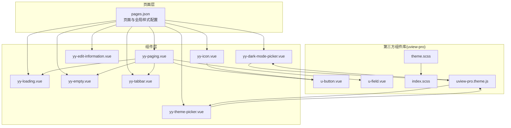
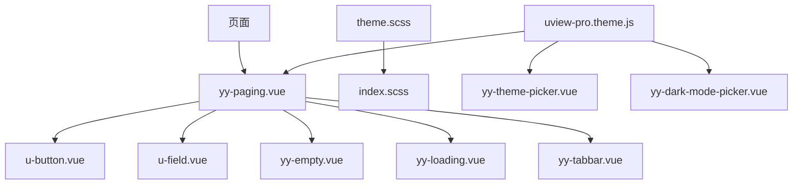
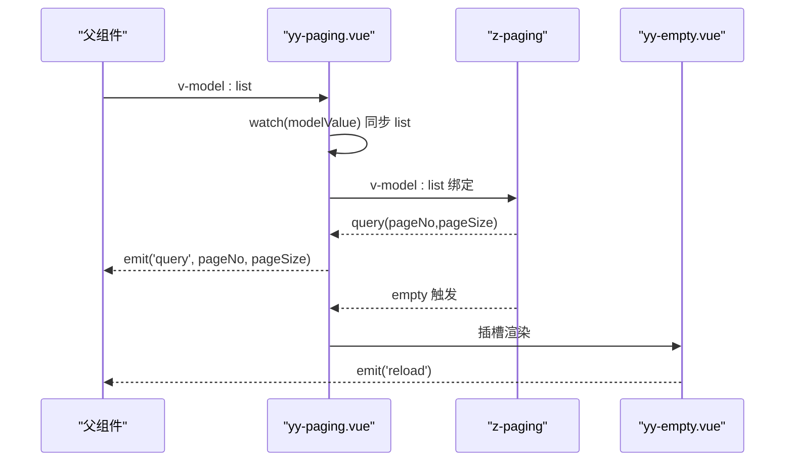
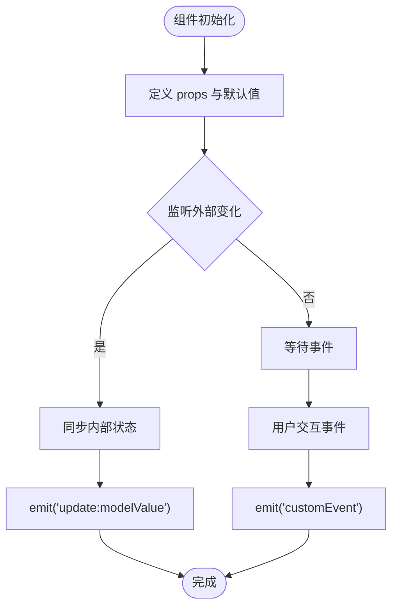
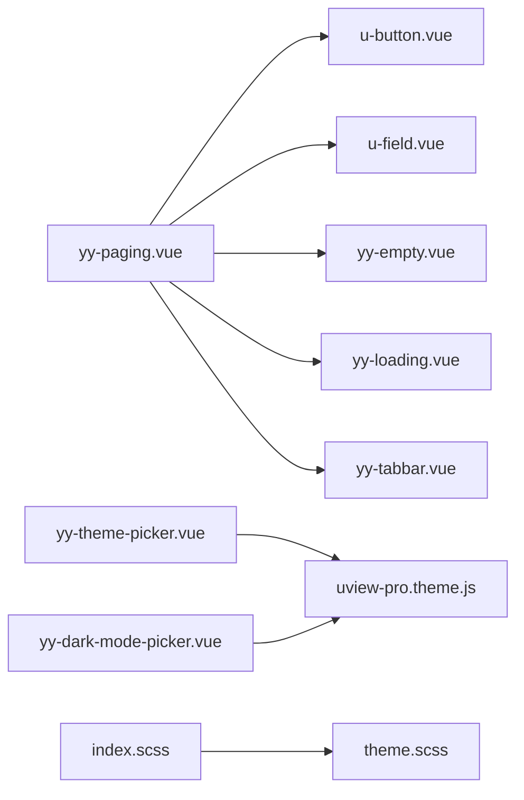

# 组件开发规范与最佳实践

<cite>
**本文引用的文件**
- [components/yy-dark-mode-picker.vue](file://components/yy-dark-mode-picker.vue)
- [components/yy-edit-information.vue](file://components/yy-edit-information.vue)
- [components/yy-icon.vue](file://components/yy-icon.vue)
- [components/yy-loading.vue](file://components/yy-loading.vue)
- [components/yy-empty.vue](file://components/yy-empty.vue)
- [components/yy-paging.vue](file://components/yy-paging.vue)
- [components/yy-tabbar.vue](file://components/yy-tabbar.vue)
- [components/yy-theme-picker.vue](file://components/yy-theme-picker.vue)
- [uni_modules/uview-pro/components/u-button/u-button.vue](file://uni_modules/uview-pro/components/u-button/u-button.vue)
- [uni_modules/uview-pro/components/u-field/u-field.vue](file://uni_modules/uview-pro/components/u-field/u-field.vue)
- [common/function/uview-pro.theme.js](file://common/function/uview-pro.theme.js)
- [uni_modules/uview-pro/theme.scss](file://uni_modules/uview-pro/theme.scss)
- [uni_modules/uview-pro/index.scss](file://uni_modules/uview-pro/index.scss)
- [pages.json](file://pages.json)
- [package.json](file://package.json)
</cite>

## 目录
1. [引言](#引言)
2. [项目结构](#项目结构)
3. [核心组件](#核心组件)
4. [架构总览](#架构总览)
5. [详细组件分析](#详细组件分析)
6. [依赖关系分析](#依赖关系分析)
7. [性能考量](#性能考量)
8. [故障排查指南](#故障排查指南)
9. [结论](#结论)
10. [附录](#附录)

## 引言
本指南面向自定义组件开发者，结合仓库中的现有组件与第三方组件库，系统梳理组件开发的设计原则、命名规范、文件组织、生命周期与状态管理、事件处理、props 设计与类型校验、样式与主题、响应式与无障碍、测试与性能优化、文档与代码审查标准，并给出可落地的工作流程与质量保障体系。

## 项目结构
- 组件层：位于 components 目录，采用业务前缀 yy- 的统一命名，便于识别与自动扫描。
- 第三方组件库：基于 uview-pro，通过 pages.json 的 easycom 规则进行自动扫描与映射。
- 主题与样式：uview-pro 提供主题变量与多端样式入口，配合本地主题配置文件实现主题切换。
- 页面与路由：pages.json 配置页面与全局样式占位符，tabBar 与导航栏样式由主题变量驱动。

图表来源
- [pages.json:1-87](file://pages.json#L1-L87)
- [components/yy-paging.vue:1-127](file://components/yy-paging.vue#L1-L127)
- [uni_modules/uview-pro/components/u-button/u-button.vue:1-608](file://uni_modules/uview-pro/components/u-button/u-button.vue#L1-L608)
- [uni_modules/uview-pro/components/u-field/u-field.vue:1-379](file://uni_modules/uview-pro/components/u-field/u-field.vue#L1-L379)
- [uni_modules/uview-pro/theme.scss:1-117](file://uni_modules/uview-pro/theme.scss#L1-L117)
- [uni_modules/uview-pro/index.scss:1-27](file://uni_modules/uview-pro/index.scss#L1-L27)
- [common/function/uview-pro.theme.js:1-257](file://common/function/uview-pro.theme.js#L1-L257)

章节来源
- [pages.json:1-87](file://pages.json#L1-L87)

## 核心组件
- 基础图标组件：yy-icon.vue，封装 Iconify 图标加载、降级兜底、尺寸与颜色解析、懒加载与淡入效果。
- 列表分页容器：yy-paging.vue，封装 z-paging，提供导航栏、底部 Tabbar、空数据视图、加载动画、下拉刷新与滚动事件透传。
- 空数据视图：yy-empty.vue，SVG 数据 URI 渲染、主题色注入、点击重载事件。
- 加载动画：yy-loading.vue，固定全屏加载指示器。
- 编辑弹窗：yy-edit-information.vue，底部弹窗、头像上传、表单输入、确认提交。
- 主题选择器：yy-theme-picker.vue，底部弹窗主题选择、主题切换与状态同步。
- 深色模式选择器：yy-dark-mode-picker.vue，深色模式切换、状态同步与事件发射。
- 底部导航：yy-tabbar.vue，基于 uview-pro 的 tabbar，vuex 状态联动。

章节来源
- [components/yy-icon.vue:1-115](file://components/yy-icon.vue#L1-L115)
- [components/yy-paging.vue:1-339](file://components/yy-paging.vue#L1-L339)
- [components/yy-empty.vue:1-105](file://components/yy-empty.vue#L1-L105)
- [components/yy-loading.vue:1-34](file://components/yy-loading.vue#L1-L34)
- [components/yy-edit-information.vue:1-161](file://components/yy-edit-information.vue#L1-L161)
- [components/yy-theme-picker.vue:1-106](file://components/yy-theme-picker.vue#L1-L106)
- [components/yy-dark-mode-picker.vue:1-101](file://components/yy-dark-mode-picker.vue#L1-L101)
- [components/yy-tabbar.vue:1-38](file://components/yy-tabbar.vue#L1-L38)

## 架构总览
- 组件分层：页面直接使用 yy-* 组件；yy-paging 作为复合容器，组合 uview-pro 基础组件与业务组件。
- 主题体系：uview-pro 提供主题变量与样式入口，本地 theme.js 定义多套主题，组件通过 useTheme/useTheme 获取/设置当前主题与深色模式。
- 样式入口：index.scss 按平台引入不同样式文件，theme.scss 定义 CSS 变量，供组件与页面共享。
- 自动扫描：pages.json 的 easycom 将 ^yy-(.*) 与 ^u-(.*) 映射到对应组件路径，简化引用。

图表来源
- [components/yy-paging.vue:1-127](file://components/yy-paging.vue#L1-L127)
- [uni_modules/uview-pro/components/u-button/u-button.vue:1-608](file://uni_modules/uview-pro/components/u-button/u-button.vue#L1-L608)
- [uni_modules/uview-pro/components/u-field/u-field.vue:1-379](file://uni_modules/uview-pro/components/u-field/u-field.vue#L1-L379)
- [common/function/uview-pro.theme.js:1-257](file://common/function/uview-pro.theme.js#L1-L257)
- [uni_modules/uview-pro/theme.scss:1-117](file://uni_modules/uview-pro/theme.scss#L1-L117)
- [uni_modules/uview-pro/index.scss:1-27](file://uni_modules/uview-pro/index.scss#L1-L27)

## 详细组件分析

### 组件命名与文件组织规范
- 命名前缀：业务组件统一以 yy- 前缀，第三方组件通过 uview-pro 的 u- 前缀与 pages.json 的 easycom 自动映射。
- 文件命名：组件文件名与导出名称保持一致，便于 IDE 与自动扫描识别。
- 目录组织：components 下按功能域划分，公共基础组件（如图标、空数据、加载）独立成文件，复合容器（如分页）聚合子组件。

章节来源
- [pages.json:2-8](file://pages.json#L2-L8)
- [components/yy-icon.vue:1-115](file://components/yy-icon.vue#L1-L115)
- [components/yy-paging.vue:1-127](file://components/yy-paging.vue#L1-L127)

### 生命周期与状态管理
- 响应式状态：大量使用 ref/computed/watch 管理 props 同步、内部状态与副作用。
- 父子同步：yy-paging 通过 watch 同步外部 modelValue 与内部 list，双向触发 update:modelValue。
- 事件发射：组件通过 defineEmits 发射事件，供父组件订阅（如 query/onRefresh/scrolltolower/change）。

图表来源
- [components/yy-paging.vue:262-289](file://components/yy-paging.vue#L262-L289)
- [components/yy-empty.vue:44-50](file://components/yy-empty.vue#L44-L50)

章节来源
- [components/yy-paging.vue:262-330](file://components/yy-paging.vue#L262-L330)

### 事件处理模式
- 事件透传：yy-paging 将 z-paging 的 query、onRefresh、scrolltolower 等事件原样转发给父组件。
- 交互事件：yy-edit-information 通过 open-type 与 chooseavatar 事件处理头像选择与上传。
- UI 交互：yy-icon 暴露 load/error/click 事件，便于上层做埋点与错误处理。

章节来源
- [components/yy-paging.vue:279-289](file://components/yy-paging.vue#L279-L289)
- [components/yy-edit-information.vue:105-133](file://components/yy-edit-information.vue#L105-L133)
- [components/yy-icon.vue:58-114](file://components/yy-icon.vue#L58-L114)

### Props 设计、默认值与类型校验
- 类型约束：所有 props 使用明确的类型声明（String/Number/Boolean/Object/Array/自定义类型），并提供合理默认值。
- 受控与非受控：通过 v-model 与 update:modelValue 实现受控；部分组件提供 immediate: true 的 watch 以确保初始同步。
- 事件与回调：通过 defineEmits 声明事件，确保调用方能正确接收与处理。

图表来源
- [components/yy-paging.vue:132-257](file://components/yy-paging.vue#L132-L257)
- [components/yy-edit-information.vue:56-71](file://components/yy-edit-information.vue#L56-L71)

章节来源
- [components/yy-paging.vue:132-257](file://components/yy-paging.vue#L132-L257)
- [components/yy-edit-information.vue:56-86](file://components/yy-edit-information.vue#L56-L86)

### 样式管理、主题定制与响应式
- 主题变量：uview-pro 的 theme.scss 定义 CSS 变量，index.scss 按平台引入，组件通过变量共享主题色。
- 主题切换：yy-theme-picker 与 yy-dark-mode-picker 通过 useTheme 获取/设置主题与深色模式，支持实时切换。
- 响应式布局：组件普遍使用 rpx 单位与 flex 布局，满足多端一致性；yy-paging 提供 usePageScroll/useVirtualList 等参数控制性能与体验。

章节来源
- [uni_modules/uview-pro/theme.scss:1-117](file://uni_modules/uview-pro/theme.scss#L1-L117)
- [uni_modules/uview-pro/index.scss:1-27](file://uni_modules/uview-pro/index.scss#L1-L27)
- [components/yy-theme-picker.vue:75-102](file://components/yy-theme-picker.vue#L75-L102)
- [components/yy-dark-mode-picker.vue:52-97](file://components/yy-dark-mode-picker.vue#L52-L97)

### 响应式设计原则
- 尺寸与间距：使用 rpx 与相对单位，避免硬编码 px。
- 图标与图片：yy-icon 支持尺寸解析与颜色注入，yy-empty 使用 data:image/svg+xml 适配多端。
- 交互反馈：按钮与图标组件提供 hover/ripple/click 等交互状态，提升可用性。

章节来源
- [components/yy-icon.vue:63-105](file://components/yy-icon.vue#L63-L105)
- [components/yy-empty.vue:53-96](file://components/yy-empty.vue#L53-L96)
- [uni_modules/uview-pro/components/u-button/u-button.vue:175-202](file://uni_modules/uview-pro/components/u-button/u-button.vue#L175-L202)

### 可访问性考虑
- 文字对比度：主题变量提供主色、次色、提示色，确保文本可读。
- 交互反馈：按钮与图标提供 hover/active 状态，避免仅依赖颜色表达状态。
- 键盘与焦点：输入组件提供 focus/blur 事件，便于上层处理键盘与焦点管理。

章节来源
- [uni_modules/uview-pro/components/u-field/u-field.vue:222-260](file://uni_modules/uview-pro/components/u-field/u-field.vue#L222-L260)
- [uni_modules/uview-pro/components/u-button/u-button.vue:153-161](file://uni_modules/uview-pro/components/u-button/u-button.vue#L153-L161)

### 测试方法与质量保障
- 单元测试：针对 props 同步、事件发射、状态变更的关键逻辑编写断言。
- 端到端测试：通过 pages.json 的页面配置与 easycom 自动映射，验证组件在 H5/小程序/App 的表现一致性。
- 可访问性测试：检查文本对比度、键盘可达性与交互反馈。

章节来源
- [pages.json:2-8](file://pages.json#L2-L8)

### 组件文档编写规范
- 组件文档应包含：用途、属性、事件、插槽、示例与注意事项。
- 示例代码模板：提供最小可运行示例，展示关键 props 与事件使用。
- 变更日志：记录版本变更与破坏性改动，便于升级迁移。

章节来源
- [components/yy-paging.vue:1-127](file://components/yy-paging.vue#L1-L127)
- [components/yy-icon.vue:1-115](file://components/yy-icon.vue#L1-L115)

### 代码审查标准
- 代码风格：遵循统一的缩进、命名与注释规范。
- 性能：避免不必要的计算与渲染，合理使用 v-model 与 watch。
- 可维护性：拆分复杂逻辑，保持单一职责，减少副作用。

章节来源
- [components/yy-paging.vue:262-330](file://components/yy-paging.vue#L262-L330)
- [components/yy-edit-information.vue:88-133](file://components/yy-edit-information.vue#L88-L133)

## 依赖关系分析
- 组件依赖：yy-paging 依赖 uview-pro 的 u-button 与 u-field，以及业务组件 yy-empty、yy-loading、yy-tabbar。
- 主题依赖：yy-theme-picker 与 yy-dark-mode-picker 依赖 common/function/uview-pro.theme.js 与 uview-pro 的 useTheme。
- 样式依赖：index.scss 按平台引入不同样式文件，theme.scss 提供全局变量。

图表来源
- [components/yy-paging.vue:1-127](file://components/yy-paging.vue#L1-L127)
- [components/yy-theme-picker.vue:50-102](file://components/yy-theme-picker.vue#L50-L102)
- [components/yy-dark-mode-picker.vue:50-97](file://components/yy-dark-mode-picker.vue#L50-L97)
- [uni_modules/uview-pro/index.scss:1-27](file://uni_modules/uview-pro/index.scss#L1-L27)
- [uni_modules/uview-pro/theme.scss:1-117](file://uni_modules/uview-pro/theme.scss#L1-L117)
- [common/function/uview-pro.theme.js:1-257](file://common/function/uview-pro.theme.js#L1-L257)

章节来源
- [components/yy-paging.vue:1-127](file://components/yy-paging.vue#L1-L127)
- [components/yy-theme-picker.vue:50-102](file://components/yy-theme-picker.vue#L50-L102)
- [components/yy-dark-mode-picker.vue:50-97](file://components/yy-dark-mode-picker.vue#L50-L97)
- [uni_modules/uview-pro/index.scss:1-27](file://uni_modules/uview-pro/index.scss#L1-L27)
- [uni_modules/uview-pro/theme.scss:1-117](file://uni_modules/uview-pro/theme.scss#L1-L117)
- [common/function/uview-pro.theme.js:1-257](file://common/function/uview-pro.theme.js#L1-L257)

## 性能考量
- 列表性能：yy-paging 提供 useVirtualList 与 cellHeightMode/virtualScrollFps 控制虚拟滚动性能。
- 图片与图标：yy-icon 支持懒加载与淡入，减少首屏压力；SVG 数据 URI 适配多端，避免额外请求。
- 事件节流：u-button 支持 throttle-time，避免高频点击带来的重复触发。
- 样式按需：index.scss 按平台引入，避免冗余样式。

章节来源
- [components/yy-paging.vue:190-224](file://components/yy-paging.vue#L190-L224)
- [components/yy-icon.vue:38-55](file://components/yy-icon.vue#L38-L55)
- [uni_modules/uview-pro/components/u-button/u-button.vue:113-114](file://uni_modules/uview-pro/components/u-button/u-button.vue#L113-L114)
- [uni_modules/uview-pro/index.scss:6-24](file://uni_modules/uview-pro/index.scss#L6-L24)

## 故障排查指南
- 图标加载失败：yy-icon 提供 fallbackName 与 error 事件，可在上层捕获并回退或提示。
- 上传失败：yy-edit-information 在上传前校验大小并在失败时提示，注意检查 token 与接口地址。
- 分页异常：yy-paging 通过 reload/complete/refresh 等方法与 z-paging 通信，确认父组件正确调用。
- 主题不生效：检查 pages.json 的全局样式占位符与 theme.scss 变量是否正确引入。

章节来源
- [components/yy-icon.vue:108-114](file://components/yy-icon.vue#L108-L114)
- [components/yy-edit-information.vue:105-133](file://components/yy-edit-information.vue#L105-L133)
- [components/yy-paging.vue:295-330](file://components/yy-paging.vue#L295-L330)
- [pages.json:71-87](file://pages.json#L71-L87)

## 结论
本指南基于仓库现有组件与第三方组件库，总结了自定义组件开发的规范与最佳实践。通过统一命名、清晰的 props/事件设计、主题与样式体系、性能优化与可访问性考虑，能够构建高质量、可维护、跨端一致的组件库。建议在团队内推广文档模板与代码审查标准，持续完善测试与发布流程。

## 附录
- 示例代码模板（路径）
  - 图标组件使用：[components/yy-icon.vue:1-115](file://components/yy-icon.vue#L1-L115)
  - 分页容器使用：[components/yy-paging.vue:1-127](file://components/yy-paging.vue#L1-L127)
  - 空数据视图使用：[components/yy-empty.vue:1-105](file://components/yy-empty.vue#L1-L105)
  - 加载动画使用：[components/yy-loading.vue:1-34](file://components/yy-loading.vue#L1-L34)
  - 编辑弹窗使用：[components/yy-edit-information.vue:1-161](file://components/yy-edit-information.vue#L1-L161)
  - 主题选择器使用：[components/yy-theme-picker.vue:1-106](file://components/yy-theme-picker.vue#L1-L106)
  - 深色模式选择器使用：[components/yy-dark-mode-picker.vue:1-101](file://components/yy-dark-mode-picker.vue#L1-L101)
  - 底部导航使用：[components/yy-tabbar.vue:1-38](file://components/yy-tabbar.vue#L1-L38)
- 第三方组件参考
  - 按钮组件：[uni_modules/uview-pro/components/u-button/u-button.vue:1-608](file://uni_modules/uview-pro/components/u-button/u-button.vue#L1-L608)
  - 输入框组件：[uni_modules/uview-pro/components/u-field/u-field.vue:1-379](file://uni_modules/uview-pro/components/u-field/u-field.vue#L1-L379)
- 主题与样式
  - 主题变量：[uni_modules/uview-pro/theme.scss:1-117](file://uni_modules/uview-pro/theme.scss#L1-L117)
  - 样式入口：[uni_modules/uview-pro/index.scss:1-27](file://uni_modules/uview-pro/index.scss#L1-L27)
  - 主题配置：[common/function/uview-pro.theme.js:1-257](file://common/function/uview-pro.theme.js#L1-L257)
- 项目配置
  - 页面与自动扫描：[pages.json:1-87](file://pages.json#L1-L87)
  - 依赖与脚本：[package.json:1-124](file://package.json#L1-L124)