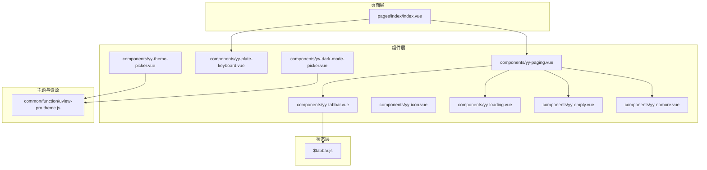
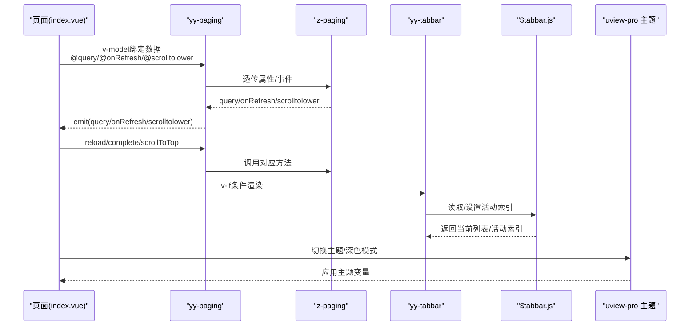
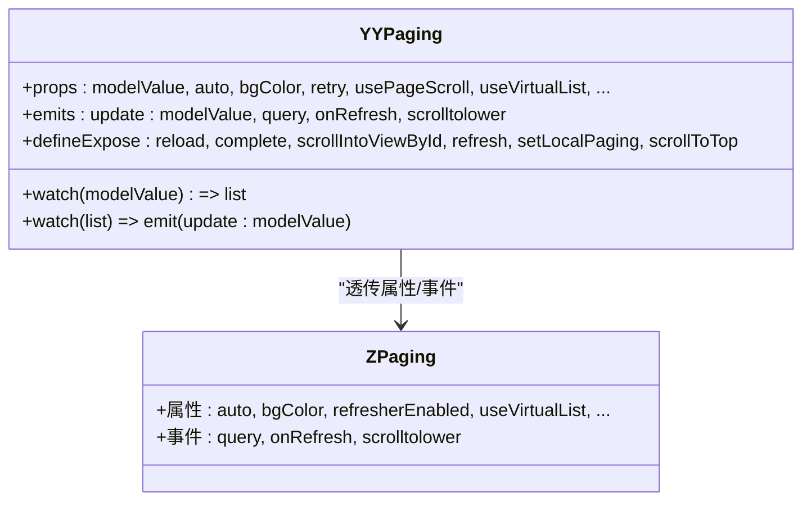
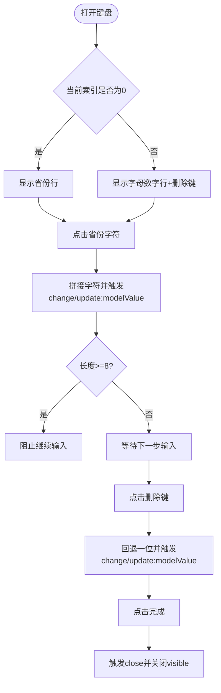
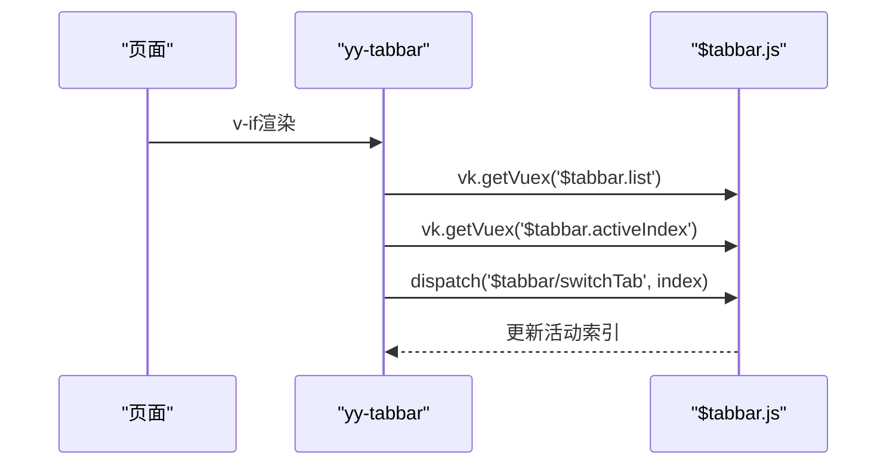
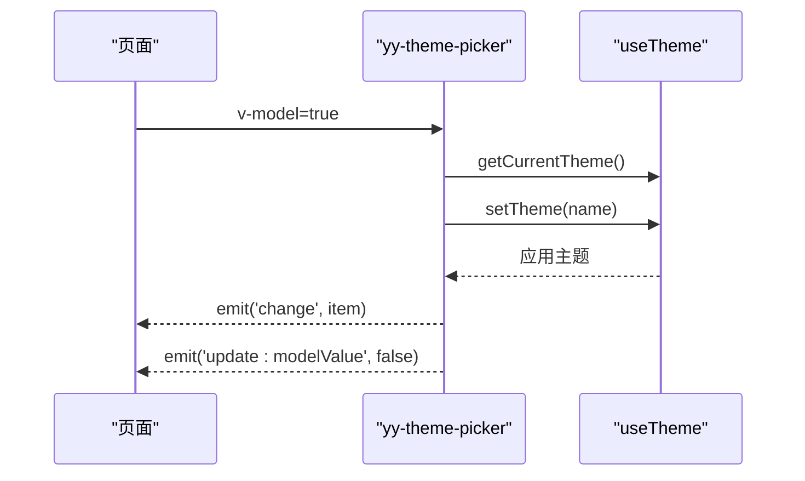
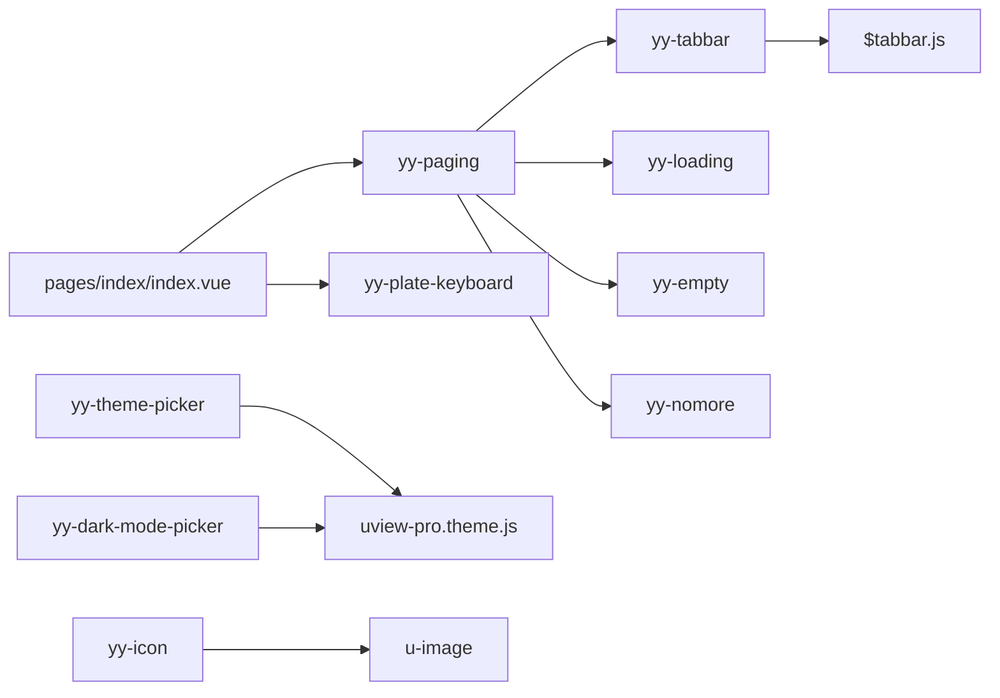

# 自定义组件开发

<cite>
**本文引用的文件**
- [components/yy-paging.vue](file://components/yy-paging.vue)
- [components/yy-plate-keyboard.vue](file://components/yy-plate-keyboard.vue)
- [components/yy-tabbar.vue](file://components/yy-tabbar.vue)
- [components/yy-theme-picker.vue](file://components/yy-theme-picker.vue)
- [components/yy-dark-mode-picker.vue](file://components/yy-dark-mode-picker.vue)
- [components/yy-loading.vue](file://components/yy-loading.vue)
- [components/yy-empty.vue](file://components/yy-empty.vue)
- [components/yy-nomore.vue](file://components/yy-nomore.vue)
- [components/yy-icon.vue](file://components/yy-icon.vue)
- [store/modules/$tabbar.js](file://store/modules/$tabbar.js)
- [pages/index/index.vue](file://pages/index/index.vue)
- [common/function/uview-pro.theme.js](file://common/function/uview-pro.theme.js)
- [manifest.json](file://manifest.json)
</cite>

## 目录
1. [简介](#简介)
2. [项目结构](#项目结构)
3. [核心组件](#核心组件)
4. [架构总览](#架构总览)
5. [详细组件分析](#详细组件分析)
6. [依赖关系分析](#依赖关系分析)
7. [性能考量](#性能考量)
8. [故障排查指南](#故障排查指南)
9. [结论](#结论)
10. [附录](#附录)

## 简介
本文件面向挪车助手项目的前端开发者，系统性梳理并讲解项目中的自定义组件设计理念、开发规范与使用方法。重点解析以下核心组件：
- 分页容器：yy-paging
- 车牌输入键盘：yy-plate-keyboard
- 底部导航：yy-tabbar
- 主题选择器：yy-theme-picker
- 深色模式选择器：yy-dark-mode-picker
- 图标组件：yy-icon
- 加载/空数据/没有更多：yy-loading、yy-empty、yy-nomore

文档涵盖组件属性定义、事件处理、生命周期管理、性能优化技巧，并提供组件复用、组合模式与扩展开发的最佳实践，以及组件间通信机制、状态管理与数据流设计。

## 项目结构
项目采用基于组件的组织方式，核心自定义组件集中于 components 目录，页面组件位于 pages 目录，全局状态通过 store/modules 管理，主题与图标资源位于 common 与 uni_modules 目录。

图表来源
- [pages/index/index.vue:1-132](file://pages/index/index.vue#L1-L132)
- [components/yy-paging.vue:1-127](file://components/yy-paging.vue#L1-L127)
- [components/yy-plate-keyboard.vue:1-81](file://components/yy-plate-keyboard.vue#L1-L81)
- [components/yy-tabbar.vue:1-38](file://components/yy-tabbar.vue#L1-L38)
- [components/yy-theme-picker.vue:1-47](file://components/yy-theme-picker.vue#L1-L47)
- [components/yy-dark-mode-picker.vue:1-28](file://components/yy-dark-mode-picker.vue#L1-L28)
- [components/yy-loading.vue:1-6](file://components/yy-loading.vue#L1-L6)
- [components/yy-empty.vue:1-11](file://components/yy-empty.vue#L1-L11)
- [components/yy-nomore.vue:1-7](file://components/yy-nomore.vue#L1-L7)
- [store/modules/$tabbar.js:1-78](file://store/modules/$tabbar.js#L1-L78)
- [common/function/uview-pro.theme.js:1-257](file://common/function/uview-pro.theme.js#L1-L257)

章节来源
- [pages/index/index.vue:1-132](file://pages/index/index.vue#L1-L132)
- [components/yy-paging.vue:1-127](file://components/yy-paging.vue#L1-L127)
- [store/modules/$tabbar.js:1-78](file://store/modules/$tabbar.js#L1-L78)

## 核心组件
本节概览各核心组件的功能定位、对外接口与典型用法。

- yy-paging：封装 z-paging，提供统一的分页容器能力，支持导航栏、底部 Tabbar、空数据、加载更多、虚拟列表等特性，并暴露 reload/complete/scrollIntoViewById 等控制方法。
- yy-plate-keyboard：车牌输入弹出键盘，支持省份选择、字母数字输入、删除、光标动画与输入校验。
- yy-tabbar：底部导航，基于 uview-pro 的 u-tabbar，通过 vk.vuex 读取/切换活动页签。
- yy-theme-picker：主题选择弹窗，基于 uview-pro 主题系统，支持主题切换与回调。
- yy-dark-mode-picker：深色模式选择弹窗，支持开启/自动/关闭三种模式。
- yy-icon：图标组件，基于 u-image，支持 Iconify API 动态加载图标、降级兜底、错误处理与事件透传。
- yy-loading/yy-empty/yy-nomore：加载、空数据、没有更多视图，作为 z-paging 的插槽内容使用。

章节来源
- [components/yy-paging.vue:1-127](file://components/yy-paging.vue#L1-L127)
- [components/yy-plate-keyboard.vue:1-81](file://components/yy-plate-keyboard.vue#L1-L81)
- [components/yy-tabbar.vue:1-38](file://components/yy-tabbar.vue#L1-L38)
- [components/yy-theme-picker.vue:1-47](file://components/yy-theme-picker.vue#L1-L47)
- [components/yy-dark-mode-picker.vue:1-28](file://components/yy-dark-mode-picker.vue#L1-L28)
- [components/yy-icon.vue:1-20](file://components/yy-icon.vue#L1-L20)
- [components/yy-loading.vue:1-6](file://components/yy-loading.vue#L1-L6)
- [components/yy-empty.vue:1-11](file://components/yy-empty.vue#L1-L11)
- [components/yy-nomore.vue:1-7](file://components/yy-nomore.vue#L1-L7)

## 架构总览
整体架构围绕页面组件与自定义组件协作展开，页面负责业务编排与状态管理，自定义组件负责交互与展示，状态通过 vk/vuex 与 uview-pro 主题系统协同。

图表来源
- [pages/index/index.vue:1-132](file://pages/index/index.vue#L1-L132)
- [components/yy-paging.vue:129-331](file://components/yy-paging.vue#L129-L331)
- [components/yy-tabbar.vue:13-37](file://components/yy-tabbar.vue#L13-L37)
- [store/modules/$tabbar.js:49-77](file://store/modules/$tabbar.js#L49-L77)
- [components/yy-theme-picker.vue:75-102](file://components/yy-theme-picker.vue#L75-L102)
- [components/yy-dark-mode-picker.vue:52-97](file://components/yy-dark-mode-picker.vue#L52-L97)

## 详细组件分析

### yy-paging 分页组件
- 设计理念
  - 封装 z-paging，统一分页体验，提供导航栏、底部 Tabbar、空数据、加载更多、虚拟列表等插槽与属性。
  - 通过 v-model 双向绑定列表数据，内部维护 list 并与父组件同步。
  - 暴露 reload/complete/scrollIntoViewById/refresh/setLocalPaging/scrollToTop 等方法供父组件调用。
- 关键属性
  - 基础：modelValue、auto、bgColor、retry、usePageScroll、useVirtualList、useInnerList、cellKeyName、innerListStyle、preloadPage、cellHeightMode、virtualScrollFps、refresherEnabled、showTabbar、hideNav、showNavBack、navTitle、navBackground、navTitleColor、backIconColor、emptyText、loadingMoreNoMoreText、showRefresherWhenReload、loadingMoreEnabled。
- 事件
  - update:modelValue、query、onRefresh、scrolltolower。
- 方法
  - defineExpose 暴露：reload、complete、scrollIntoViewById、refresh、setLocalPaging、scrollToTop。
- 生命周期与数据流
  - 通过 watch 同步 props.modelValue 与内部 list，再通过 emits('update:modelValue') 反馈给父组件。
  - 透传 z-paging 的 query/onRefresh/scrolltolower 事件，由父组件处理业务逻辑。
- 性能优化
  - 支持 useVirtualList 与 cellHeightMode/fps 控制虚拟滚动性能。
  - usePageScroll 与 updatePageScrollTop/pageReachBottom/doChatRecordLoadMore 适配页面级滚动场景。
- 使用建议
  - 在页面中以 v-model 绑定数据，按需开启虚拟列表与页面滚动。
  - 通过插槽替换空数据、加载、没有更多等视图，提升一致性。

图表来源
- [components/yy-paging.vue:129-331](file://components/yy-paging.vue#L129-L331)

章节来源
- [components/yy-paging.vue:129-331](file://components/yy-paging.vue#L129-L331)
- [pages/index/index.vue:134-147](file://pages/index/index.vue#L134-L147)

### yy-plate-keyboard 车牌键盘
- 设计理念
  - 弹出式车牌输入键盘，支持省份首字选择与字母数字输入，限制非法字符（I/O），提供删除与完成事件。
  - 通过 visible 与 modelValue 双向绑定控制显示与输入值，支持 change/close/open 事件。
- 关键属性
  - visible(Boolean, 默认 false)、modelValue(String, 默认空串)。
- 事件
  - update:visible、update:modelValue、change、close、open。
- 交互逻辑
  - 当 currentIndex === 0 时显示省份行；否则显示字母数字行与删除键。
  - 删除键支持退格，完成时关闭键盘并触发 close。
- 视觉与动画
  - 输入框高亮、省份高亮、光标闪烁动画，增强输入反馈。
- 使用建议
  - 在页面中以 v-model:visible 与 v-model 组合使用，结合页面样式控制布局。
  - 注意对 I/O 字符的过滤与长度限制。

图表来源
- [components/yy-plate-keyboard.vue:142-165](file://components/yy-plate-keyboard.vue#L142-L165)

章节来源
- [components/yy-plate-keyboard.vue:83-166](file://components/yy-plate-keyboard.vue#L83-L166)
- [pages/index/index.vue:130-132](file://pages/index/index.vue#L130-L132)

### yy-tabbar 底部导航
- 设计理念
  - 基于 uview-pro 的 u-tabbar，通过 vk.vuex 读取 tabbar 列表与活动索引，实现统一的底部导航。
- 关键点
  - 计算属性 tabbarList 从 vk.getVuex('$tabbar.list') 获取列表。
  - activeIndex 的 getter/setter 通过 vk.getVuex('$tabbar.activeIndex') 与 dispatch('$tabbar/switchTab') 实现双向绑定。
- 使用建议
  - 在页面中通过 v-if 控制是否渲染，配合 yy-paging 的 bottom 插槽使用。
  - 通过 store/modules/$tabbar.js 的 actions 更新角标与列表。

图表来源
- [components/yy-tabbar.vue:13-37](file://components/yy-tabbar.vue#L13-L37)
- [store/modules/$tabbar.js:49-77](file://store/modules/$tabbar.js#L49-L77)

章节来源
- [components/yy-tabbar.vue:13-37](file://components/yy-tabbar.vue#L13-L37)
- [store/modules/$tabbar.js:1-78](file://store/modules/$tabbar.js#L1-L78)

### yy-theme-picker 主题选择器
- 设计理念
  - 基于 uview-pro 主题系统，提供主题选择弹窗，支持主题切换与 change 回调。
- 关键属性
  - modelValue(Boolean)、title(String)、themes(Array，默认来自 uview-pro 主题)、activeColor(String)。
- 行为
  - 打开时读取当前主题名，点击选择后通过 useTheme.setTheme 设置主题并关闭弹窗，触发 change。
- 使用建议
  - 在页面中以 v-model 控制显示，监听 change 事件进行后续处理。
  - themes 可自定义覆盖默认主题集。

图表来源
- [components/yy-theme-picker.vue:75-102](file://components/yy-theme-picker.vue#L75-L102)
- [common/function/uview-pro.theme.js:1-257](file://common/function/uview-pro.theme.js#L1-L257)

章节来源
- [components/yy-theme-picker.vue:49-103](file://components/yy-theme-picker.vue#L49-L103)
- [common/function/uview-pro.theme.js:1-257](file://common/function/uview-pro.theme.js#L1-L257)

### yy-dark-mode-picker 深色模式选择器
- 设计理念
  - 提供深色模式选择弹窗，支持开启/自动/关闭三种模式，通过 useTheme 控制。
- 关键属性
  - modelValue(Boolean)、title(String)、activeColor(String)。
- 行为
  - 打开时读取当前模式，选择后通过 setDarkMode 更新并关闭弹窗，触发 change。
- 使用建议
  - 与主题选择器配合使用，实现完整的主题与模式管理。

章节来源
- [components/yy-dark-mode-picker.vue:31-98](file://components/yy-dark-mode-picker.vue#L31-L98)

### yy-icon 图标组件
- 设计理念
  - 基于 u-image，支持 Iconify 动态加载图标、颜色与尺寸解析、错误降级与事件透传。
- 关键属性
  - name、color、size、prefix、apiUrl、fallbackName、lazyLoad、fade、showLoading、showError、loadingIcon、errorIcon、bgColor、borderRadius、shape。
- 行为
  - 解析 name 与 prefix，生成 Iconify SVG URL；当加载失败且存在 fallbackName 时自动降级。
- 使用建议
  - 通过 prefix 简化常用图标命名；合理设置 lazyLoad 与 fade 提升性能与体验。

章节来源
- [components/yy-icon.vue:22-115](file://components/yy-icon.vue#L22-L115)

### yy-loading/yy-empty/yy-nomore
- 设计理念
  - 作为 z-paging 的插槽组件，提供统一的加载、空数据与“没有更多”视觉与交互。
- 使用建议
  - 在 yy-paging 的 #loading/#empty/#loadingMoreNoMore 插槽中使用，保持风格一致。

章节来源
- [components/yy-loading.vue:1-34](file://components/yy-loading.vue#L1-L34)
- [components/yy-empty.vue:1-105](file://components/yy-empty.vue#L1-L105)
- [components/yy-nomore.vue:1-25](file://components/yy-nomore.vue#L1-L25)

## 依赖关系分析
- 组件依赖
  - yy-paging 依赖 z-paging 与 uview-pro 组件库（u-navbar、u-popup 等），并通过插槽组合多个子组件（yy-tabbar、yy-loading、yy-empty、yy-nomore）。
  - yy-tabbar 依赖 vk.vuex 与 store/modules/$tabbar.js。
  - yy-theme-picker 与 yy-dark-mode-picker 依赖 uview-pro 的 useTheme 与主题配置。
  - yy-icon 依赖 u-image 与 Iconify API。
- 页面依赖
  - pages/index/index.vue 作为业务入口，组合使用 yy-paging、yy-plate-keyboard，并通过 v-model 与事件驱动组件行为。

图表来源
- [pages/index/index.vue:1-132](file://pages/index/index.vue#L1-L132)
- [components/yy-paging.vue:1-127](file://components/yy-paging.vue#L1-L127)
- [components/yy-tabbar.vue:1-38](file://components/yy-tabbar.vue#L1-L38)
- [components/yy-theme-picker.vue:1-47](file://components/yy-theme-picker.vue#L1-L47)
- [components/yy-dark-mode-picker.vue:1-28](file://components/yy-dark-mode-picker.vue#L1-L28)
- [components/yy-icon.vue:1-20](file://components/yy-icon.vue#L1-L20)
- [store/modules/$tabbar.js:1-78](file://store/modules/$tabbar.js#L1-L78)
- [common/function/uview-pro.theme.js:1-257](file://common/function/uview-pro.theme.js#L1-L257)

章节来源
- [pages/index/index.vue:1-132](file://pages/index/index.vue#L1-L132)
- [components/yy-paging.vue:1-127](file://components/yy-paging.vue#L1-L127)
- [components/yy-tabbar.vue:1-38](file://components/yy-tabbar.vue#L1-L38)
- [components/yy-theme-picker.vue:1-47](file://components/yy-theme-picker.vue#L1-L47)
- [components/yy-dark-mode-picker.vue:1-28](file://components/yy-dark-mode-picker.vue#L1-L28)
- [components/yy-icon.vue:1-20](file://components/yy-icon.vue#L1-L20)
- [store/modules/$tabbar.js:1-78](file://store/modules/$tabbar.js#L1-L78)
- [common/function/uview-pro.theme.js:1-257](file://common/function/uview-pro.theme.js#L1-L257)

## 性能考量
- 虚拟列表与滚动
  - 在大数据列表场景下启用 useVirtualList，并根据 cellHeightMode 选择固定/动态高度，合理设置 virtualScrollFps 以平衡流畅度与性能。
- 页面级滚动
  - 使用 usePageScroll 时，结合 updatePageScrollTop/pageReachBottom/doChatRecordLoadMore，减少嵌套滚动带来的性能问题。
- 图标加载
  - 合理设置 lazyLoad 与 fade，避免大量图标同时加载造成抖动；为关键图标设置 fallbackName 保证可用性。
- 主题切换
  - 主题切换应避免频繁触发重绘，尽量批量应用并在合适时机执行，减少不必要的 DOM 更新。
- 网络与缓存
  - 对外部资源（如 Iconify）做好缓存策略，必要时预热关键图标，降低首屏等待时间。

## 故障排查指南
- 车牌键盘无法输入或异常
  - 检查 modelValue 长度限制与 I/O 字符过滤逻辑；确认 visible 与 modelValue 的双向绑定是否正确。
- 分页组件不触发加载
  - 确认父组件是否正确处理 query/onRefresh 事件并调用 complete/refresh；检查 auto/usePageScroll 配置。
- 底部导航不生效
  - 检查 vk.vuex 的 $tabbar.list 与 $tabbar.activeIndex 是否正确设置；确认 dispatch('$tabbar/switchTab') 是否被调用。
- 主题切换无效
  - 确认 useTheme.getCurrentTheme 与 setTheme 的调用顺序；检查主题配置是否正确加载。
- 图标不显示或闪烁
  - 检查 name/prefix/apiUrl/color/size 的解析逻辑；确保 fallbackName 设置正确并可访问。

章节来源
- [components/yy-plate-keyboard.vue:142-165](file://components/yy-plate-keyboard.vue#L142-L165)
- [components/yy-paging.vue:279-331](file://components/yy-paging.vue#L279-L331)
- [components/yy-tabbar.vue:13-37](file://components/yy-tabbar.vue#L13-L37)
- [components/yy-theme-picker.vue:75-102](file://components/yy-theme-picker.vue#L75-L102)
- [components/yy-icon.vue:69-115](file://components/yy-icon.vue#L69-L115)

## 结论
本项目通过一组高内聚、低耦合的自定义组件，实现了统一的交互体验与良好的扩展性。yy-paging 作为核心容器，整合导航、Tabbar、空数据与加载视图；yy-plate-keyboard 提供专业的输入体验；yy-tabbar、yy-theme-picker、yy-dark-mode-picker 与 yy-icon 共同构建了主题与交互的基础能力。遵循本文的开发规范与最佳实践，可在保证性能的前提下快速迭代与扩展。

## 附录
- 开发规范
  - 属性命名与类型：统一使用语义化命名，明确默认值与类型约束。
  - 事件命名：以 update: 前缀处理 v-model 双向绑定，以 on/emit 前缀区分内部与外部事件。
  - 插槽命名：遵循 #top/#bottom/#left/#right/#cell/#loading/#empty/#loadingMoreNoMore 等约定。
  - 状态管理：优先使用 vk/vuex 或 uview-pro 主题系统，避免组件内部冗余状态。
- 最佳实践
  - 组件复用：通过插槽与属性组合实现高复用性，避免硬编码。
  - 组合模式：将复杂页面拆分为多个小组件，通过 props/emit 组合。
  - 扩展开发：新增组件时，先定义清晰的接口与事件，再实现具体逻辑，最后补充文档与示例。