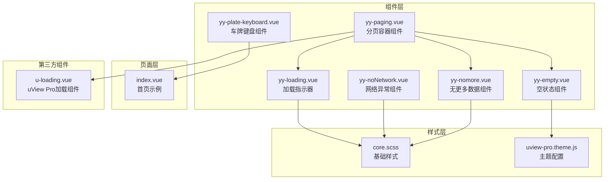
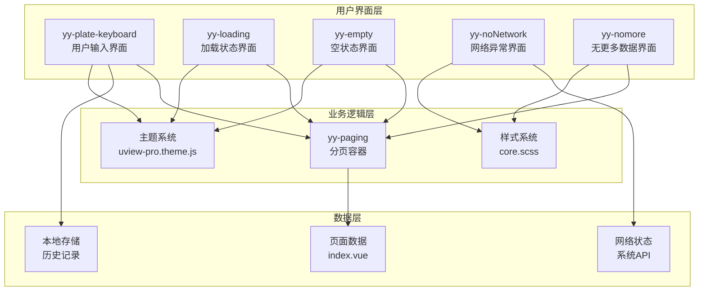
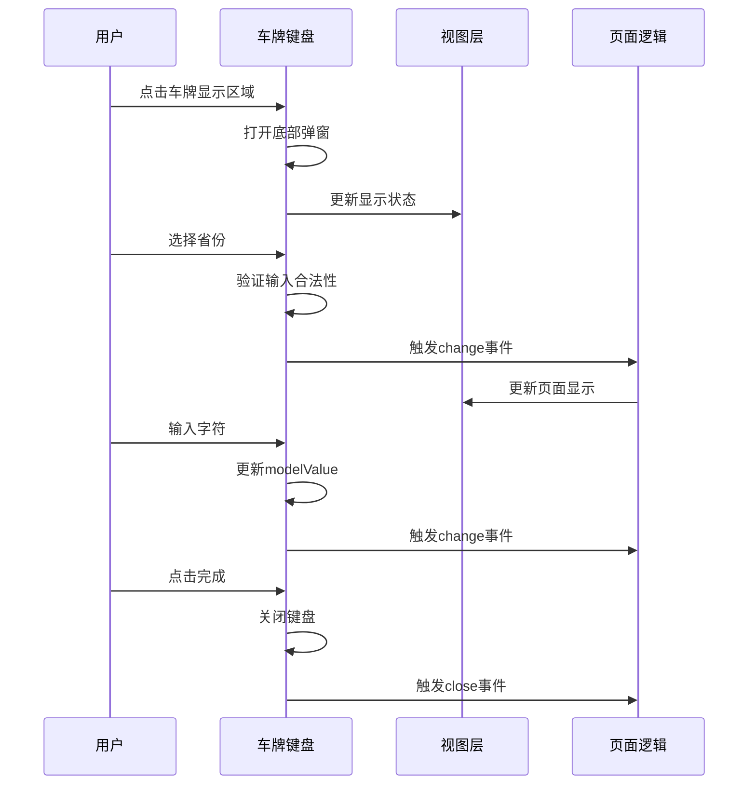
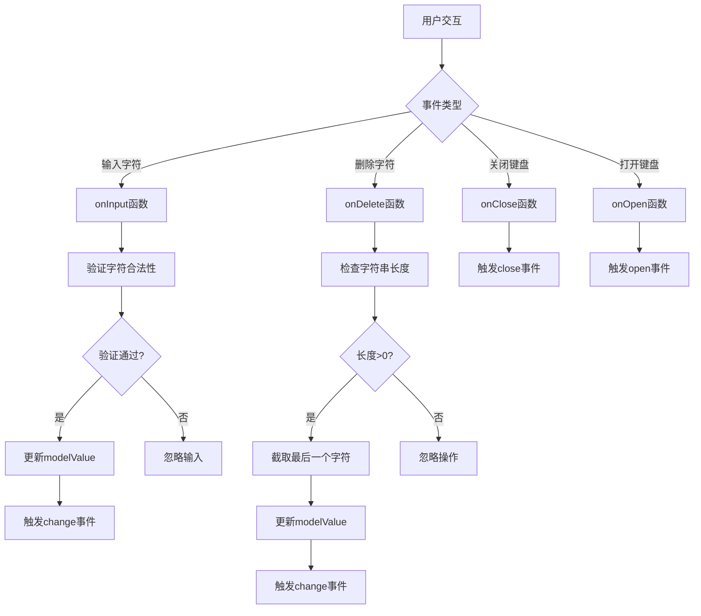
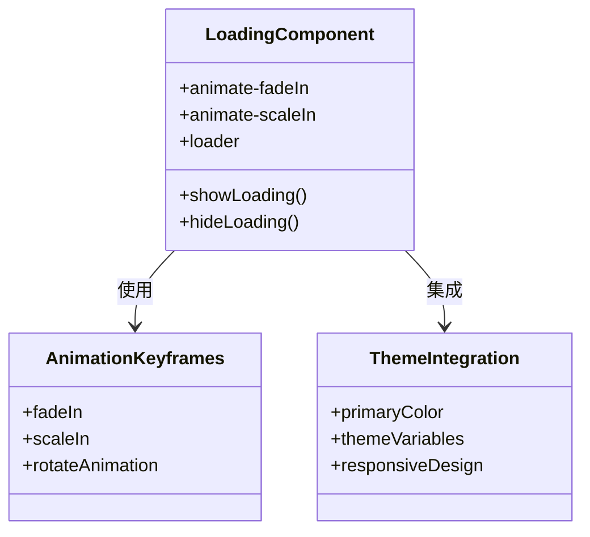
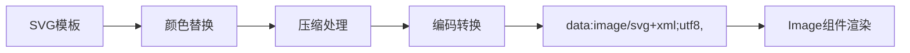
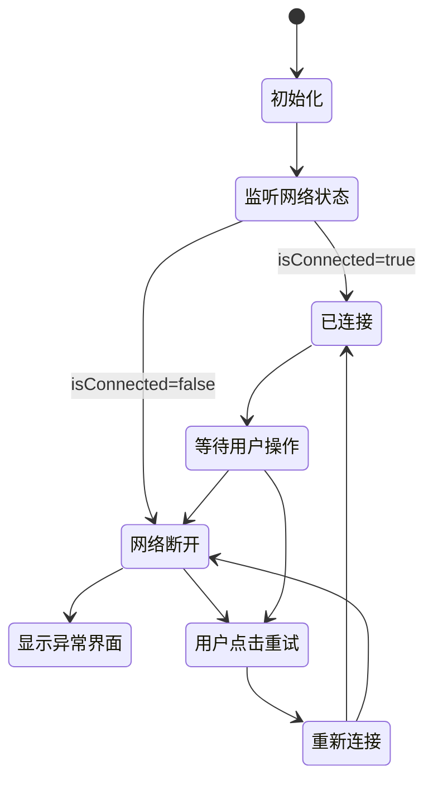
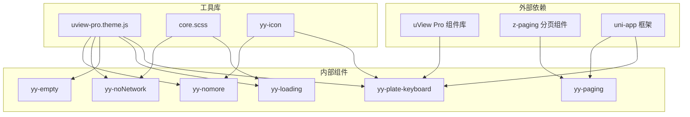

# 输入类组件

<cite>
**本文档引用的文件**
- [yy-plate-keyboard.vue](file://components/yy-plate-keyboard.vue)
- [yy-loading.vue](file://components/yy-loading.vue)
- [yy-empty.vue](file://components/yy-empty.vue)
- [yy-noNetwork.vue](file://components/yy-noNetwork.vue)
- [yy-nomore.vue](file://components/yy-nomore.vue)
- [yy-paging.vue](file://components/yy-paging.vue)
- [index.vue](file://pages/index/index.vue)
- [core.scss](file://common/css/core.scss)
- [uview-pro.theme.js](file://common/function/uview-pro.theme.js)
- [u-loading.vue](file://uni_modules/uview-pro/components/u-loading/u-loading.vue)
</cite>

## 目录
1. [简介](#简介)
2. [项目结构](#项目结构)
3. [核心组件](#核心组件)
4. [架构概览](#架构概览)
5. [详细组件分析](#详细组件分析)
6. [依赖关系分析](#依赖关系分析)
7. [性能考虑](#性能考虑)
8. [故障排除指南](#故障排除指南)
9. [结论](#结论)
10. [附录](#附录)

## 简介

本项目中的输入类组件群是一套专为移动应用设计的输入体验解决方案，主要包含以下核心组件：

- **yy-plate-keyboard**：车牌号专用输入键盘，支持省份选择和字符输入
- **yy-loading**：全局加载指示器，提供优雅的加载动画
- **yy-empty**：空状态占位组件，支持自定义文本和颜色
- **yy-noNetwork**：网络异常提示组件，提供网络状态监控
- **yy-nomore**：无更多数据提示组件，用于分页场景

这些组件遵循统一的设计规范，采用uView Pro主题系统，确保在不同设备和平台上的视觉一致性。

## 项目结构

输入类组件群在项目中的组织结构如下：



**图表来源**
- [yy-plate-keyboard.vue:1-317](file://components/yy-plate-keyboard.vue#L1-L317)
- [yy-paging.vue:1-200](file://components/yy-paging.vue#L1-L200)
- [index.vue:1-755](file://pages/index/index.vue#L1-L755)

**章节来源**
- [yy-plate-keyboard.vue:1-317](file://components/yy-plate-keyboard.vue#L1-L317)
- [yy-paging.vue:1-200](file://components/yy-paging.vue#L1-L200)
- [index.vue:1-755](file://pages/index/index.vue#L1-L755)

## 核心组件

### 车牌键盘组件 (yy-plate-keyboard)

yy-plate-keyboard是一个专门设计的车牌号输入组件，具有以下特性：

- **智能布局**：根据当前输入位置动态切换省份选择和字母数字键盘
- **输入验证**：限制输入长度为8位，特殊字符过滤
- **视觉反馈**：实时显示输入状态和光标位置
- **交互设计**：支持删除操作和完成确认

### 加载组件 (yy-loading)

yy-loading提供全局加载指示功能：

- **动画效果**：使用CSS动画实现流畅的加载动画
- **响应式设计**：适配不同屏幕尺寸
- **主题集成**：与uView Pro主题系统无缝集成

### 空状态组件 (yy-empty)

yy-empty是通用的空状态占位组件：

- **可定制性**：支持自定义文本、间距和颜色
- **跨平台兼容**：通过SVG data URL确保多端兼容
- **交互功能**：支持重新加载事件

### 网络异常组件 (yy-noNetwork)

yy-noNetwork监控网络状态并提供处理方案：

- **实时监控**：监听网络状态变化
- **平台适配**：针对iOS和Android提供不同的设置入口
- **自动重连**：支持网络恢复后的自动重连

### 无更多数据组件 (yy-nomore)

yy-nomore用于分页场景的无数据提示：

- **简洁设计**：专注于无更多数据的视觉表达
- **可扩展性**：支持自定义提示文本

**章节来源**
- [yy-plate-keyboard.vue:83-166](file://components/yy-plate-keyboard.vue#L83-L166)
- [yy-loading.vue:8-34](file://components/yy-loading.vue#L8-L34)
- [yy-empty.vue:13-105](file://components/yy-empty.vue#L13-L105)
- [yy-noNetwork.vue:12-72](file://components/yy-noNetwork.vue#L12-L72)
- [yy-nomore.vue:9-25](file://components/yy-nomore.vue#L9-L25)

## 架构概览

输入类组件群采用分层架构设计，确保组件间的松耦合和高内聚：



**图表来源**
- [yy-paging.vue:97-110](file://components/yy-paging.vue#L97-L110)
- [index.vue:134-334](file://pages/index/index.vue#L134-L334)
- [uview-pro.theme.js:1-257](file://common/function/uview-pro.theme.js#L1-L257)

## 详细组件分析

### 车牌键盘组件深度分析

#### 设计理念

yy-plate-keyboard的设计基于中国车牌输入的特殊需求：

- **8位字符限制**：符合中国车牌格式（1位省份 + 1位字符 + 5位数字）
- **智能焦点管理**：自动管理输入光标位置
- **视觉引导**：通过样式变化提供清晰的输入状态反馈

#### 核心功能实现



**图表来源**
- [yy-plate-keyboard.vue:142-165](file://components/yy-plate-keyboard.vue#L142-L165)
- [index.vue:196-226](file://pages/index/index.vue#L196-L226)

#### 输入验证机制

组件实现了多层次的输入验证：

1. **长度限制**：最多8个字符
2. **字符过滤**：禁止使用特定字符（如I、O）
3. **位置验证**：第1位只能是省份字符

#### 事件处理流程



**图表来源**
- [yy-plate-keyboard.vue:142-165](file://components/yy-plate-keyboard.vue#L142-L165)

**章节来源**
- [yy-plate-keyboard.vue:83-166](file://components/yy-plate-keyboard.vue#L83-L166)
- [index.vue:196-226](file://pages/index/index.vue#L196-L226)

### 加载组件分析

#### 动画实现原理

yy-loading使用CSS动画实现加载效果：



**图表来源**
- [yy-loading.vue:13-34](file://components/yy-loading.vue#L13-L34)
- [uview-pro.theme.js:4-31](file://common/function/uview-pro.theme.js#L4-L31)

#### 样式设计特点

- **响应式布局**：使用百分比和视口单位
- **主题集成**：自动适配uView Pro主题色
- **性能优化**：使用硬件加速的CSS属性

**章节来源**
- [yy-loading.vue:8-34](file://components/yy-loading.vue#L8-L34)
- [uview-pro.theme.js:149-170](file://common/function/uview-pro.theme.js#L149-L170)

### 空状态组件分析

#### SVG数据URL技术

yy-empty采用了创新的SVG数据URL技术来确保跨平台兼容：



**图表来源**
- [yy-empty.vue:52-96](file://components/yy-empty.vue#L52-L96)

#### 主题适配机制

组件能够智能识别和应用主题色：

1. **优先级策略**：props.color > uView主题色 > 默认色
2. **运行时检测**：动态获取当前主题配置
3. **降级处理**：确保在异常情况下仍能正常工作

**章节来源**
- [yy-empty.vue:13-105](file://components/yy-empty.vue#L13-L105)
- [uview-pro.theme.js:1-257](file://common/function/uview-pro.theme.js#L1-L257)

### 网络异常组件分析

#### 网络监控机制

yy-noNetwork实现了完整的网络状态监控：



**图表来源**
- [yy-noNetwork.vue:16-68](file://components/yy-noNetwork.vue#L16-L68)

#### 平台适配策略

组件针对不同平台提供了专门的设置入口：

- **iOS平台**：通过UIApplication打开设置
- **Android平台**：通过Intent启动系统设置
- **Web平台**：提供手动重试机制

**章节来源**
- [yy-noNetwork.vue:12-72](file://components/yy-noNetwork.vue#L12-L72)

### 无更多数据组件分析

#### 分页场景适配

yy-nomore专门为分页场景设计，具有以下特点：

- **简洁性**：专注于无更多数据的视觉表达
- **可定制性**：支持自定义提示文本
- **集成性**：与z-paging组件无缝集成

**章节来源**
- [yy-nomore.vue:9-25](file://components/yy-nomore.vue#L9-L25)

## 依赖关系分析

输入类组件群的依赖关系体现了清晰的分层架构：



**图表来源**
- [yy-paging.vue:2-126](file://components/yy-paging.vue#L2-L126)
- [uview-pro.theme.js:1-257](file://common/function/uview-pro.theme.js#L1-L257)

### 组件间协作模式

组件通过以下模式进行协作：

1. **事件驱动**：组件间通过事件进行通信
2. **数据绑定**：使用v-model实现双向数据绑定
3. **插槽机制**：通过具名插槽实现内容定制
4. **主题集成**：统一的主题系统确保视觉一致性

**章节来源**
- [yy-paging.vue:97-110](file://components/yy-paging.vue#L97-L110)
- [index.vue:134-334](file://pages/index/index.vue#L134-L334)

## 性能考虑

### 渲染优化

1. **虚拟DOM优化**：合理使用计算属性避免不必要的重渲染
2. **事件节流**：输入事件处理函数经过优化以减少频繁调用
3. **内存管理**：及时清理网络监听和定时器

### 样式性能

1. **CSS变量**：使用CSS变量减少样式计算开销
2. **硬件加速**：关键动画使用transform和opacity属性
3. **按需加载**：组件按需加载，减少初始包体积

### 网络性能

1. **缓存策略**：合理利用浏览器缓存机制
2. **懒加载**：非关键资源采用懒加载方式
3. **压缩优化**：生产环境自动压缩CSS和JavaScript

## 故障排除指南

### 常见问题及解决方案

#### 车牌键盘无法输入

**问题描述**：用户无法通过键盘输入字符

**可能原因**：
1. 输入长度已达上限（8位）
2. 特殊字符被过滤
3. 组件状态异常

**解决步骤**：
1. 检查modelValue长度
2. 验证输入字符合法性
3. 重新初始化组件状态

#### 空状态图标不显示

**问题描述**：yy-empty组件的SVG图标无法正常显示

**可能原因**：
1. SVG数据URL编码错误
2. 主题色获取失败
3. 平台兼容性问题

**解决步骤**：
1. 验证SVG模板完整性
2. 检查主题配置是否正确
3. 测试不同平台的兼容性

#### 网络异常组件失效

**问题描述**：yy-noNetwork组件无法正确监控网络状态

**可能原因**：
1. 系统权限不足
2. 网络监听API不可用
3. 平台特定问题

**解决步骤**：
1. 检查系统网络权限
2. 验证API可用性
3. 实现降级方案

**章节来源**
- [yy-plate-keyboard.vue:142-165](file://components/yy-plate-keyboard.vue#L142-L165)
- [yy-empty.vue:34-50](file://components/yy-empty.vue#L34-L50)
- [yy-noNetwork.vue:16-28](file://components/yy-noNetwork.vue#L16-L28)

## 结论

输入类组件群展现了现代移动端组件开发的最佳实践：

1. **设计理念先进**：针对特定业务场景设计专用组件
2. **技术实现成熟**：采用成熟的前端技术和框架
3. **用户体验优秀**：注重细节和交互体验
4. **可维护性强**：代码结构清晰，易于扩展和维护

这套组件群不仅满足了当前项目的需求，也为未来的功能扩展奠定了坚实的基础。

## 附录

### 组件使用示例

#### 车牌键盘使用示例

```vue
<template>
  <view>
    <view class="plate-display" @click="showPlateKeyboard">
      <!-- 车牌显示逻辑 -->
    </view>
    <yy-plate-keyboard 
      v-model:visible="keyboardVisible" 
      v-model="plateValue" 
      @change="onPlateChange"
      @close="onKeyboardClose"
    />
  </view>
</template>
```

#### 分页组件集成示例

```vue
<template>
  <yy-paging v-model="dataList" @query="queryList">
    <template #loading>
      <yy-loading />
    </template>
    <template #empty>
      <yy-empty text="暂无数据" />
    </template>
    <template #loadingMoreNoMore>
      <yy-nomore text="没有更多了" />
    </template>
  </yy-paging>
</template>
```

### 最佳实践建议

1. **组件复用**：优先使用现有组件，避免重复造轮子
2. **主题一致**：严格遵循uView Pro主题规范
3. **性能优化**：关注组件的渲染性能和内存使用
4. **错误处理**：完善错误边界和降级处理机制
5. **测试覆盖**：为关键组件编写单元测试和集成测试