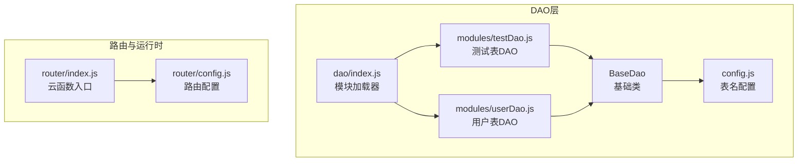
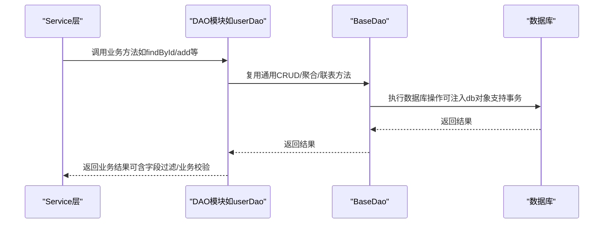
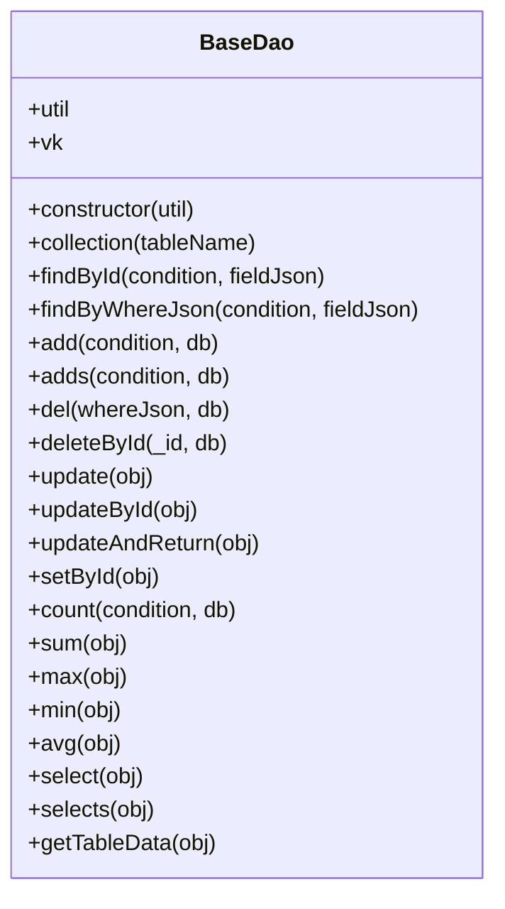
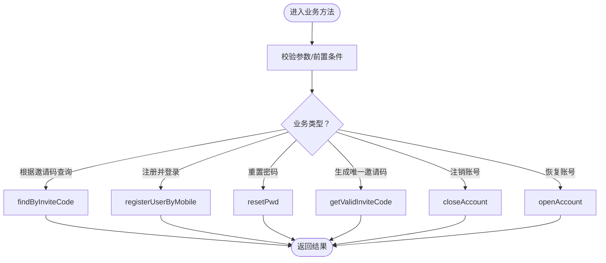
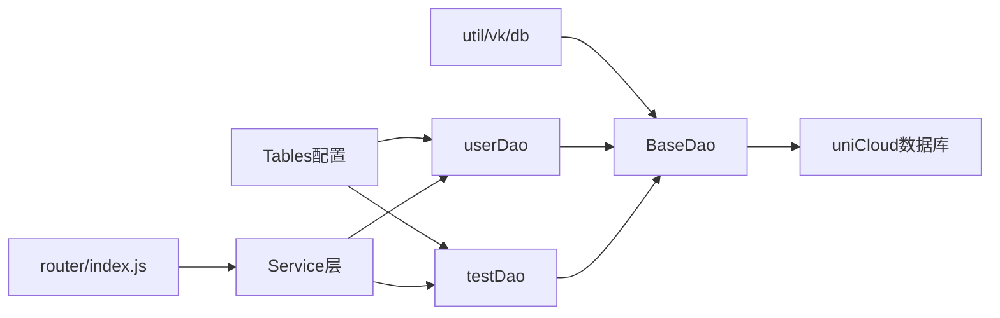

# DAO层设计

<cite>
**本文引用的文件**
- [base.js](file://uniCloud-aliyun/cloudfunctions/router/dao/base.js)
- [config.js](file://uniCloud-aliyun/cloudfunctions/router/dao/config.js)
- [index.js](file://uniCloud-aliyun/cloudfunctions/router/dao/index.js)
- [testDao.js](file://uniCloud-aliyun/cloudfunctions/router/dao/modules/testDao.js)
- [userDao.js](file://uniCloud-aliyun/cloudfunctions/router/dao/modules/userDao.js)
- [router/index.js](file://uniCloud-aliyun/cloudfunctions/router/index.js)
- [router/config.js](file://uniCloud-aliyun/cloudfunctions/router/config.js)
- [service/user/pub/checkToken.js](file://uniCloud-aliyun/cloudfunctions/router/service/user/pub/checkToken.js)
</cite>

## 目录
1. [简介](#简介)
2. [项目结构](#项目结构)
3. [核心组件](#核心组件)
4. [架构总览](#架构总览)
5. [详细组件分析](#详细组件分析)
6. [依赖关系分析](#依赖关系分析)
7. [性能考量](#性能考量)
8. [故障排查指南](#故障排查指南)
9. [结论](#结论)
10. [附录](#附录)

## 简介
本文件系统性阐述DAO层的设计与实现，围绕数据访问对象（DAO）模式展开，重点覆盖：
- 基础DAO类设计与职责边界
- 模块化DAO结构与命名规范
- CRUD操作封装、聚合查询与联表查询能力
- 事务支持与错误处理机制
- DAO与Service层交互模式、数据映射与业务逻辑分离
- DAO开发规范、性能优化策略与代码复用技巧
- 实际使用示例与最佳实践

## 项目结构
DAO层位于云函数路由工程的router/dao目录，采用“基础类 + 模块化子类 + 配置表名”的分层组织方式：
- 基础类：提供通用CRUD、聚合、联表、计数、求和/最值/平均等能力
- 模块化DAO：按业务表划分，继承基础类并绑定具体表名
- 配置模块：集中维护所有表名常量，便于统一管理与替换
- 自动加载：通过index.js扫描modules目录，动态加载并初始化DAO模块

图表来源
- [base.js:11-697](file://uniCloud-aliyun/cloudfunctions/router/dao/base.js#L11-L697)
- [config.js:1-67](file://uniCloud-aliyun/cloudfunctions/router/dao/config.js#L1-L67)
- [index.js:1-36](file://uniCloud-aliyun/cloudfunctions/router/dao/index.js#L1-L36)
- [testDao.js:1-151](file://uniCloud-aliyun/cloudfunctions/router/dao/modules/testDao.js#L1-L151)
- [userDao.js:1-568](file://uniCloud-aliyun/cloudfunctions/router/dao/modules/userDao.js#L1-L568)
- [router/index.js:1-8](file://uniCloud-aliyun/cloudfunctions/router/index.js#L1-L8)
- [router/config.js:1-9](file://uniCloud-aliyun/cloudfunctions/router/config.js#L1-L9)

章节来源
- [base.js:11-697](file://uniCloud-aliyun/cloudfunctions/router/dao/base.js#L11-L697)
- [config.js:1-67](file://uniCloud-aliyun/cloudfunctions/router/dao/config.js#L1-L67)
- [index.js:1-36](file://uniCloud-aliyun/cloudfunctions/router/dao/index.js#L1-L36)
- [testDao.js:1-151](file://uniCloud-aliyun/cloudfunctions/router/dao/modules/testDao.js#L1-L151)
- [userDao.js:1-568](file://uniCloud-aliyun/cloudfunctions/router/dao/modules/userDao.js#L1-L568)
- [router/index.js:1-8](file://uniCloud-aliyun/cloudfunctions/router/index.js#L1-L8)
- [router/config.js:1-9](file://uniCloud-aliyun/cloudfunctions/router/config.js#L1-L9)

## 核心组件
- 基础DAO（BaseDao）
  - 职责：对底层vk.baseDao进行面向对象封装，提供统一的CRUD、聚合、联表、计数、求和/最值/平均、分页查询、表格渲染数据查询等能力
  - 关键特性：
    - 统一注入vk、db、db.command、db.command.aggregate
    - 通过子类设置tableName完成表绑定
    - 支持简易/完整两种调用模式，完整模式可传入db对象以支持事务
    - 提供select/selects/getTableData等高性能查询接口
- 模块化DAO
  - 以业务表为单位，继承BaseDao并绑定具体表名
  - 可按需重写方法，加入业务定制逻辑（如字段过滤、业务校验、复杂流程）
- 表名配置（Tables）
  - 集中维护所有表名常量，便于统一管理与替换
- 模块加载器（dao/index.js）
  - 自动扫描modules目录，加载所有以Dao.js结尾的模块，并统一初始化

章节来源
- [base.js:11-697](file://uniCloud-aliyun/cloudfunctions/router/dao/base.js#L11-L697)
- [config.js:1-67](file://uniCloud-aliyun/cloudfunctions/router/dao/config.js#L1-L67)
- [index.js:1-36](file://uniCloud-aliyun/cloudfunctions/router/dao/index.js#L1-L36)
- [testDao.js:10-14](file://uniCloud-aliyun/cloudfunctions/router/dao/modules/testDao.js#L10-L14)
- [userDao.js:16-20](file://uniCloud-aliyun/cloudfunctions/router/dao/modules/userDao.js#L16-L20)

## 架构总览
DAO层与Service层的交互遵循“DAO专注数据访问、Service编排业务”的分层原则。Service层通过vk.daoCenter访问各模块DAO，DAO内部通过vk.baseDao与数据库交互，支持事务db对象注入。

图表来源
- [userDao.js:147-167](file://uniCloud-aliyun/cloudfunctions/router/dao/modules/userDao.js#L147-L167)
- [base.js:92-109](file://uniCloud-aliyun/cloudfunctions/router/dao/base.js#L92-L109)
- [base.js:174-191](file://uniCloud-aliyun/cloudfunctions/router/dao/base.js#L174-L191)

章节来源
- [userDao.js:147-167](file://uniCloud-aliyun/cloudfunctions/router/dao/modules/userDao.js#L147-L167)
- [base.js:92-109](file://uniCloud-aliyun/cloudfunctions/router/dao/base.js#L92-L109)
- [base.js:174-191](file://uniCloud-aliyun/cloudfunctions/router/dao/base.js#L174-L191)

## 详细组件分析

### 基础DAO（BaseDao）类图

图表来源
- [base.js:11-697](file://uniCloud-aliyun/cloudfunctions/router/dao/base.js#L11-L697)

章节来源
- [base.js:11-697](file://uniCloud-aliyun/cloudfunctions/router/dao/base.js#L11-L697)

### UserDao（用户表）定制逻辑
UserDao在BaseDao基础上进行了多项业务定制：
- 默认字段过滤：查询用户信息时默认屏蔽token与password字段
- 特殊字段策略：用户表使用register_date作为创建时间，禁用自动添加创建时间
- 业务方法：根据邀请码查询、根据手机号注册并登录、重置密码、生成唯一邀请码、注销/恢复账号等

图表来源
- [userDao.js:206-214](file://uniCloud-aliyun/cloudfunctions/router/dao/modules/userDao.js#L206-L214)
- [userDao.js:355-382](file://uniCloud-aliyun/cloudfunctions/router/dao/modules/userDao.js#L355-L382)
- [userDao.js:397-405](file://uniCloud-aliyun/cloudfunctions/router/dao/modules/userDao.js#L397-L405)
- [userDao.js:415-440](file://uniCloud-aliyun/cloudfunctions/router/dao/modules/userDao.js#L415-L440)
- [userDao.js:456-532](file://uniCloud-aliyun/cloudfunctions/router/dao/modules/userDao.js#L456-L532)
- [userDao.js:544-564](file://uniCloud-aliyun/cloudfunctions/router/dao/modules/userDao.js#L544-L564)

章节来源
- [userDao.js:147-167](file://uniCloud-aliyun/cloudfunctions/router/dao/modules/userDao.js#L147-L167)
- [userDao.js:179-198](file://uniCloud-aliyun/cloudfunctions/router/dao/modules/userDao.js#L179-L198)
- [userDao.js:206-214](file://uniCloud-aliyun/cloudfunctions/router/dao/modules/userDao.js#L206-L214)
- [userDao.js:233-272](file://uniCloud-aliyun/cloudfunctions/router/dao/modules/userDao.js#L233-L272)
- [userDao.js:297-317](file://uniCloud-aliyun/cloudfunctions/router/dao/modules/userDao.js#L297-L317)
- [userDao.js:326-338](file://uniCloud-aliyun/cloudfunctions/router/dao/modules/userDao.js#L326-L338)
- [userDao.js:355-382](file://uniCloud-aliyun/cloudfunctions/router/dao/modules/userDao.js#L355-L382)
- [userDao.js:397-405](file://uniCloud-aliyun/cloudfunctions/router/dao/modules/userDao.js#L397-L405)
- [userDao.js:415-440](file://uniCloud-aliyun/cloudfunctions/router/dao/modules/userDao.js#L415-L440)
- [userDao.js:456-532](file://uniCloud-aliyun/cloudfunctions/router/dao/modules/userDao.js#L456-L532)
- [userDao.js:544-564](file://uniCloud-aliyun/cloudfunctions/router/dao/modules/userDao.js#L544-L564)

### TestDao（测试表）示例
TestDao展示了如何在继承BaseDao后直接使用通用CRUD与查询方法，无需重写即可满足常规需求。

章节来源
- [testDao.js:10-14](file://uniCloud-aliyun/cloudfunctions/router/dao/modules/testDao.js#L10-L14)
- [testDao.js:18-133](file://uniCloud-aliyun/cloudfunctions/router/dao/modules/testDao.js#L18-L133)

### DAO模块加载与初始化
- dao/index.js扫描modules目录，加载所有Dao.js模块
- 统一init流程：若模块导出对象含init则调用，否则实例化为类实例
- 通过vk.daoCenter暴露各DAO实例，供Service层调用

章节来源
- [index.js:1-36](file://uniCloud-aliyun/cloudfunctions/router/dao/index.js#L1-L36)

## 依赖关系分析
- BaseDao依赖vk.baseDao、uniCloud数据库实例与命令对象
- 模块DAO依赖BaseDao与Tables配置
- Service层通过vk.daoCenter访问DAO，DAO内部通过util/vk/db访问底层能力
- 路由入口通过vk-unicloud创建vk实例并交由router处理请求

图表来源
- [base.js:18-33](file://uniCloud-aliyun/cloudfunctions/router/dao/base.js#L18-L33)
- [userDao.js:3](file://uniCloud-aliyun/cloudfunctions/router/dao/modules/userDao.js#L3)
- [testDao.js:3](file://uniCloud-aliyun/cloudfunctions/router/dao/modules/testDao.js#L3)
- [router/index.js:5-7](file://uniCloud-aliyun/cloudfunctions/router/index.js#L5-L7)

章节来源
- [base.js:18-33](file://uniCloud-aliyun/cloudfunctions/router/dao/base.js#L18-L33)
- [userDao.js:3](file://uniCloud-aliyun/cloudfunctions/router/dao/modules/userDao.js#L3)
- [testDao.js:3](file://uniCloud-aliyun/cloudfunctions/router/dao/modules/testDao.js#L3)
- [router/index.js:5-7](file://uniCloud-aliyun/cloudfunctions/router/index.js#L5-L7)

## 性能考量
- 分页查询策略
  - select：默认分页，pageSize>1000时自动切换selectAll模式（内部分批查询），适合单表高性能查询
  - selects：支持联表/分组/树形查询，适合复杂场景但性能低于select
- 计数与hasMore
  - getCount为true时执行count，适合需要精确总数的场景
  - hasMore为true时多查一条以准确判断是否还有下一页
- 字段选择
  - 通过fieldJson精准控制返回字段，减少网络与序列化开销
- 聚合与联表
  - 聚合管道与联表查询在大数据量下需谨慎使用，建议配合索引与合理where条件
- 批量写入
  - adds支持批量插入，超过一定规模默认不返回ids以降低内存与传输成本

章节来源
- [base.js:511-558](file://uniCloud-aliyun/cloudfunctions/router/dao/base.js#L511-L558)
- [base.js:560-634](file://uniCloud-aliyun/cloudfunctions/router/dao/base.js#L560-L634)
- [base.js:194-229](file://uniCloud-aliyun/cloudfunctions/router/dao/base.js#L194-L229)

## 故障排查指南
- 常见问题
  - 未设置tableName：collection方法在未设置表名时会抛出异常
  - 误删全表：del/删除接口要求whereJson非空，避免误传空条件
  - 事务未生效：需在完整模式传入db对象，简易模式不支持事务
- 建议排查步骤
  - 确认dao实例的tableName是否正确绑定
  - 检查whereJson是否为空或非法
  - 在需要事务的场景传入db对象
  - 使用debug开关获取数据库执行耗时信息（select/selects/getTableData支持）

章节来源
- [base.js:62-68](file://uniCloud-aliyun/cloudfunctions/router/dao/base.js#L62-L68)
- [base.js:242-250](file://uniCloud-aliyun/cloudfunctions/router/dao/base.js#L242-L250)
- [base.js:551-558](file://uniCloud-aliyun/cloudfunctions/router/dao/base.js#L551-L558)

## 结论
DAO层通过“基础类+模块化DAO+配置中心+自动加载器”的组合，实现了：
- 统一的数据访问抽象与CRUD封装
- 易扩展的模块化结构与清晰的业务隔离
- 面向事务与复杂查询的能力支撑
- 与Service层明确的职责边界与交互路径

在实际项目中，建议遵循本文档的开发规范与最佳实践，结合性能考量与故障排查建议，持续优化DAO层的稳定性与可维护性。

## 附录

### CRUD与事务使用要点
- CRUD方法均支持简易/完整两种调用模式，完整模式可传入db对象以启用事务
- 常见调用路径参考：
  - 查询：findById/findByWhereJson/select/selects/getTableData
  - 写入：add/adds/update/updateById/updateAndReturn/setById
  - 删除：del/deleteById/count/sum/max/min/avg

章节来源
- [base.js:92-109](file://uniCloud-aliyun/cloudfunctions/router/dao/base.js#L92-L109)
- [base.js:134-149](file://uniCloud-aliyun/cloudfunctions/router/dao/base.js#L134-L149)
- [base.js:174-191](file://uniCloud-aliyun/cloudfunctions/router/dao/base.js#L174-L191)
- [base.js:214-229](file://uniCloud-aliyun/cloudfunctions/router/dao/base.js#L214-L229)
- [base.js:242-271](file://uniCloud-aliyun/cloudfunctions/router/dao/base.js#L242-L271)
- [base.js:286-323](file://uniCloud-aliyun/cloudfunctions/router/dao/base.js#L286-L323)
- [base.js:340-347](file://uniCloud-aliyun/cloudfunctions/router/dao/base.js#L340-L347)
- [base.js:372-379](file://uniCloud-aliyun/cloudfunctions/router/dao/base.js#L372-L379)
- [base.js:405-421](file://uniCloud-aliyun/cloudfunctions/router/dao/base.js#L405-L421)
- [base.js:436-443](file://uniCloud-aliyun/cloudfunctions/router/dao/base.js#L436-L443)
- [base.js:458-465](file://uniCloud-aliyun/cloudfunctions/router/dao/base.js#L458-L465)
- [base.js:480-487](file://uniCloud-aliyun/cloudfunctions/router/dao/base.js#L480-L487)
- [base.js:502-509](file://uniCloud-aliyun/cloudfunctions/router/dao/base.js#L502-L509)
- [base.js:551-558](file://uniCloud-aliyun/cloudfunctions/router/dao/base.js#L551-L558)
- [base.js:627-634](file://uniCloud-aliyun/cloudfunctions/router/dao/base.js#L627-L634)
- [base.js:683-690](file://uniCloud-aliyun/cloudfunctions/router/dao/base.js#L683-L690)

### DAO与Service交互示例
- Service层通过vk.daoCenter访问DAO，例如：
  - 校验token：checkToken服务调用uniID校验，返回用户信息、角色与权限
  - 用户相关业务：UserDao提供注册、登录、注销、恢复等业务方法

章节来源
- [service/user/pub/checkToken.js:15-27](file://uniCloud-aliyun/cloudfunctions/router/service/user/pub/checkToken.js#L15-L27)
- [userDao.js:355-382](file://uniCloud-aliyun/cloudfunctions/router/dao/modules/userDao.js#L355-L382)
- [userDao.js:456-532](file://uniCloud-aliyun/cloudfunctions/router/dao/modules/userDao.js#L456-L532)
- [userDao.js:544-564](file://uniCloud-aliyun/cloudfunctions/router/dao/modules/userDao.js#L544-L564)