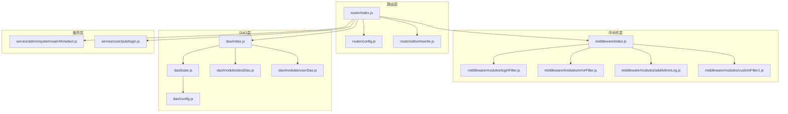
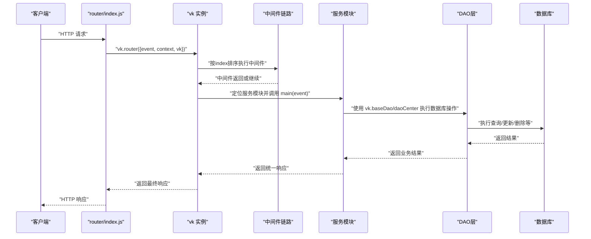
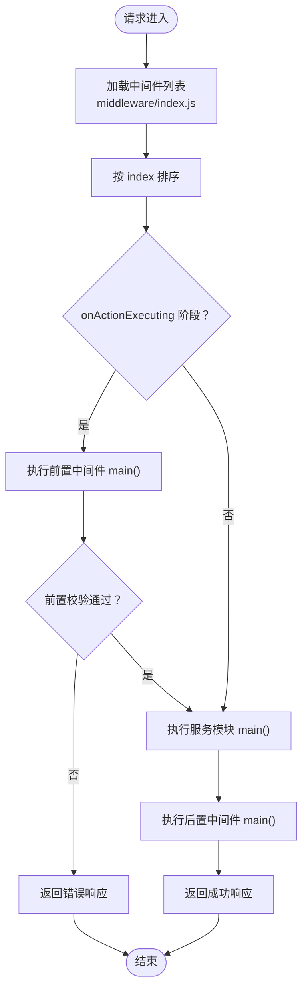
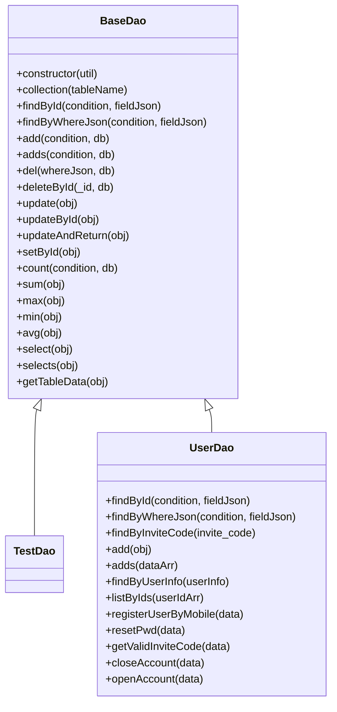
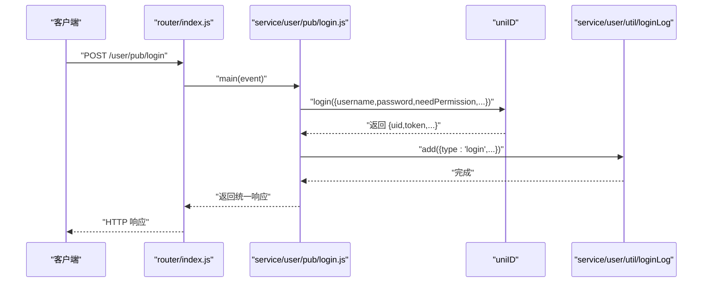
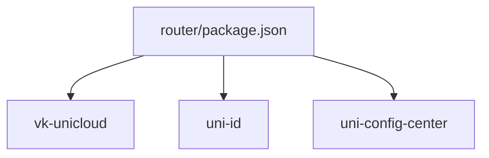

# 云函数路由系统

<cite>
**本文档引用的文件**
- [index.js](file://uniCloud-aliyun/cloudfunctions/router/index.js)
- [config.js](file://uniCloud-aliyun/cloudfunctions/router/config.js)
- [urlrewrite.js](file://uniCloud-aliyun/cloudfunctions/router/util/urlrewrite.js)
- [middleware/index.js](file://uniCloud-aliyun/cloudfunctions/router/middleware/index.js)
- [middleware/modules/loginFilter.js](file://uniCloud-aliyun/cloudfunctions/router/middleware/modules/loginFilter.js)
- [middleware/modules/errorFilter.js](file://uniCloud-aliyun/cloudfunctions/router/middleware/modules/errorFilter.js)
- [middleware/modules/addAdminLog.js](file://uniCloud-aliyun/cloudfunctions/router/middleware/modules/addAdminLog.js)
- [middleware/modules/customFilter1.js](file://uniCloud-aliyun/cloudfunctions/router/middleware/modules/customFilter1.js)
- [dao/index.js](file://uniCloud-aliyun/cloudfunctions/router/dao/index.js)
- [dao/base.js](file://uniCloud-aliyun/cloudfunctions/router/dao/base.js)
- [dao/config.js](file://uniCloud-aliyun/cloudfunctions/router/dao/config.js)
- [dao/modules/testDao.js](file://uniCloud-aliyun/cloudfunctions/router/dao/modules/testDao.js)
- [dao/modules/userDao.js](file://uniCloud-aliyun/cloudfunctions/router/dao/modules/userDao.js)
- [service/admin/system/user/kh/select.js](file://uniCloud-aliyun/cloudfunctions/router/service/admin/system/user/kh/select.js)
- [service/user/pub/login.js](file://uniCloud-aliyun/cloudfunctions/router/service/user/pub/login.js)
- [package.json](file://uniCloud-aliyun/cloudfunctions/router/package.json)
</cite>

## 目录
1. [简介](#简介)
2. [项目结构](#项目结构)
3. [核心组件](#核心组件)
4. [架构总览](#架构总览)
5. [详细组件分析](#详细组件分析)
6. [依赖关系分析](#依赖关系分析)
7. [性能考量](#性能考量)
8. [故障排查指南](#故障排查指南)
9. [结论](#结论)
10. [附录](#附录)

## 简介
本项目基于 vk-unicloud 的云函数路由系统，提供统一的路由入口、中间件机制、URL 重写、DAO 层抽象与服务层编排能力。系统通过 router 云函数入口集中处理 HTTP 请求，借助 vk 实例完成路由解析、中间件链路执行、服务层调用与响应返回，并提供 URL 重写规则与统一错误处理。

## 项目结构
- 路由入口与配置
  - 路由入口：router/index.js
  - 路由配置：router/config.js
  - URL 重写：router/util/urlrewrite.js
- 中间件体系
  - 中间件加载：router/middleware/index.js
  - 中间件示例：router/middleware/modules/*.js
- DAO 层
  - DAO 加载：router/dao/index.js
  - DAO 基类：router/dao/base.js
  - 表名配置：router/dao/config.js
  - DAO 示例：router/dao/modules/*.js
- 服务层
  - 服务示例：router/service/**/main.js
- 云函数元信息
  - 云函数配置：router/package.json

图表来源
- [index.js:1-8](file://uniCloud-aliyun/cloudfunctions/router/index.js#L1-L8)
- [config.js:1-9](file://uniCloud-aliyun/cloudfunctions/router/config.js#L1-L9)
- [urlrewrite.js:1-16](file://uniCloud-aliyun/cloudfunctions/router/util/urlrewrite.js#L1-L16)
- [middleware/index.js:1-34](file://uniCloud-aliyun/cloudfunctions/router/middleware/index.js#L1-L34)
- [dao/index.js:1-36](file://uniCloud-aliyun/cloudfunctions/router/dao/index.js#L1-L36)
- [dao/base.js:1-697](file://uniCloud-aliyun/cloudfunctions/router/dao/base.js#L1-L697)
- [dao/config.js:1-67](file://uniCloud-aliyun/cloudfunctions/router/dao/config.js#L1-L67)
- [dao/modules/testDao.js:1-151](file://uniCloud-aliyun/cloudfunctions/router/dao/modules/testDao.js#L1-L151)
- [dao/modules/userDao.js:1-568](file://uniCloud-aliyun/cloudfunctions/router/dao/modules/userDao.js#L1-L568)
- [service/admin/system/user/kh/select.js:1-99](file://uniCloud-aliyun/cloudfunctions/router/service/admin/system/user/kh/select.js#L1-L99)
- [service/user/pub/login.js:1-58](file://uniCloud-aliyun/cloudfunctions/router/service/user/pub/login.js#L1-L58)

章节来源
- [index.js:1-8](file://uniCloud-aliyun/cloudfunctions/router/index.js#L1-L8)
- [config.js:1-9](file://uniCloud-aliyun/cloudfunctions/router/config.js#L1-L9)
- [urlrewrite.js:1-16](file://uniCloud-aliyun/cloudfunctions/router/util/urlrewrite.js#L1-L16)
- [middleware/index.js:1-34](file://uniCloud-aliyun/cloudfunctions/router/middleware/index.js#L1-L34)
- [dao/index.js:1-36](file://uniCloud-aliyun/cloudfunctions/router/dao/index.js#L1-L36)
- [dao/base.js:1-697](file://uniCloud-aliyun/cloudfunctions/router/dao/base.js#L1-L697)
- [dao/config.js:1-67](file://uniCloud-aliyun/cloudfunctions/router/dao/config.js#L1-L67)

## 核心组件
- 路由入口与实例
  - router/index.js 通过 vk-unicloud 创建 vk 实例并导出路由处理函数，统一接收 event/context 并交由 vk.router 处理。
- 路由配置
  - router/config.js 提供 baseDir 与自定义 requireFn，确保模块加载路径与 require 行为可控。
- URL 重写
  - router/util/urlrewrite.js 定义正则规则与访问白名单控制，支持将特定 URL 映射到指定云函数并可附加查询参数。
- 中间件机制
  - middleware/index.js 动态扫描 modules 下的中间件文件，合并为中间件列表；每个中间件模块导出一个或多个中间件项，包含 id、正则规则、执行时机、优先级与主处理函数。
- DAO 层
  - dao/index.js 动态加载 modules 下的 DAO 文件，支持初始化与统一管理；dao/base.js 提供面向对象的 CRUD、聚合、联表查询、事务等能力；dao/config.js 统一维护表名常量。
- 服务层
  - 服务层以模块形式组织，每个模块导出 main 函数，接收 event 对象，使用 util 中的工具与 vk 实例完成业务逻辑。

章节来源
- [index.js:1-8](file://uniCloud-aliyun/cloudfunctions/router/index.js#L1-L8)
- [config.js:1-9](file://uniCloud-aliyun/cloudfunctions/router/config.js#L1-L9)
- [urlrewrite.js:1-16](file://uniCloud-aliyun/cloudfunctions/router/util/urlrewrite.js#L1-L16)
- [middleware/index.js:1-34](file://uniCloud-aliyun/cloudfunctions/router/middleware/index.js#L1-L34)
- [dao/index.js:1-36](file://uniCloud-aliyun/cloudfunctions/router/dao/index.js#L1-L36)
- [dao/base.js:1-697](file://uniCloud-aliyun/cloudfunctions/router/dao/base.js#L1-L697)
- [dao/config.js:1-67](file://uniCloud-aliyun/cloudfunctions/router/dao/config.js#L1-L67)

## 架构总览
云函数路由系统采用“入口集中、中间件链路、DAO 抽象、服务编排”的分层架构。请求从 router 入口进入，经 vk 实例解析 URL、匹配中间件、执行中间件链路、定位服务模块、调用 DAO 层、返回统一响应格式。

图表来源
- [index.js:5-7](file://uniCloud-aliyun/cloudfunctions/router/index.js#L5-L7)
- [middleware/index.js:14-31](file://uniCloud-aliyun/cloudfunctions/router/middleware/index.js#L14-L31)
- [service/admin/system/user/kh/select.js:11-99](file://uniCloud-aliyun/cloudfunctions/router/service/admin/system/user/kh/select.js#L11-L99)
- [dao/base.js:92-150](file://uniCloud-aliyun/cloudfunctions/router/dao/base.js#L92-L150)

## 详细组件分析

### 路由入口与配置
- 路由入口
  - 通过 vk-unicloud 创建 vk 实例，传入 config.js 配置，导出 exports.main 作为云函数入口。
- 路由配置
  - baseDir 指定云函数根目录，requireFn 控制模块加载行为，确保模块解析稳定可靠。

章节来源
- [index.js:1-8](file://uniCloud-aliyun/cloudfunctions/router/index.js#L1-L8)
- [config.js:1-9](file://uniCloud-aliyun/cloudfunctions/router/config.js#L1-L9)

### URL 重写机制
- 规则定义
  - 支持正则映射与查询参数拼接，示例包括固定路径映射与动态参数捕获。
- 访问控制
  - accessOnlyInRule 可限制仅允许在规则内的云函数被 URL 化访问，增强安全性。

章节来源
- [urlrewrite.js:1-16](file://uniCloud-aliyun/cloudfunctions/router/util/urlrewrite.js#L1-L16)

### 中间件机制与执行顺序
- 中间件加载
  - middleware/index.js 扫描 modules 目录，动态 require 并合并中间件列表。
- 中间件规范
  - 每个中间件包含 id、regExp（正则匹配）、description、index（执行顺序）、mode（执行时机）、enable（开关）、main（处理函数）。
- 执行顺序
  - index 越小越先执行；不同阶段（onActionExecuting/onActionExecuted）可分别插入前置与后置逻辑。
- 典型中间件
  - 登录/注册拦截：根据登录规则启用/禁用，前置校验。
  - 全局异常拦截：捕获服务层异常，统一记录错误日志。
  - 管理员操作日志：在执行完成后记录成功请求的日志。
  - 自定义过滤器：示例展示如何在前置阶段拦截请求。

图表来源
- [middleware/index.js:14-31](file://uniCloud-aliyun/cloudfunctions/router/middleware/index.js#L14-L31)
- [middleware/modules/loginFilter.js:27-52](file://uniCloud-aliyun/cloudfunctions/router/middleware/modules/loginFilter.js#L27-L52)
- [middleware/modules/errorFilter.js:4-60](file://uniCloud-aliyun/cloudfunctions/router/middleware/modules/errorFilter.js#L4-L60)
- [middleware/modules/addAdminLog.js:18-71](file://uniCloud-aliyun/cloudfunctions/router/middleware/modules/addAdminLog.js#L18-L71)
- [middleware/modules/customFilter1.js:5-24](file://uniCloud-aliyun/cloudfunctions/router/middleware/modules/customFilter1.js#L5-L24)

章节来源
- [middleware/index.js:1-34](file://uniCloud-aliyun/cloudfunctions/router/middleware/index.js#L1-L34)
- [middleware/modules/loginFilter.js:1-53](file://uniCloud-aliyun/cloudfunctions/router/middleware/modules/loginFilter.js#L1-L53)
- [middleware/modules/errorFilter.js:1-60](file://uniCloud-aliyun/cloudfunctions/router/middleware/modules/errorFilter.js#L1-L60)
- [middleware/modules/addAdminLog.js:1-71](file://uniCloud-aliyun/cloudfunctions/router/middleware/modules/addAdminLog.js#L1-L71)
- [middleware/modules/customFilter1.js:1-24](file://uniCloud-aliyun/cloudfunctions/router/middleware/modules/customFilter1.js#L1-L24)

### DAO 层与数据模型
- DAO 加载
  - dao/index.js 动态扫描 modules 目录下的 DAO 文件，支持 init 方法初始化与统一管理。
- DAO 基类
  - dao/base.js 提供 findById/findByWhereJson/add/adds/del/deleteById/update/updateById/updateAndReturn/setById/count/sum/max/min/avg/select/selects/getTableData 等常用方法，支持事务、联表、聚合、树形查询等高级能力。
- 表名配置
  - dao/config.js 统一维护所有表名常量，便于跨模块引用。
- 示例 DAO
  - testDao.js 展示基本 CRUD 与复杂查询示例。
  - userDao.js 展示用户表的特殊字段过滤、常用业务方法与复杂注销/恢复流程。

图表来源
- [dao/base.js:11-697](file://uniCloud-aliyun/cloudfunctions/router/dao/base.js#L11-L697)
- [dao/modules/testDao.js:10-151](file://uniCloud-aliyun/cloudfunctions/router/dao/modules/testDao.js#L10-L151)
- [dao/modules/userDao.js:16-568](file://uniCloud-aliyun/cloudfunctions/router/dao/modules/userDao.js#L16-L568)

章节来源
- [dao/index.js:1-36](file://uniCloud-aliyun/cloudfunctions/router/dao/index.js#L1-L36)
- [dao/base.js:1-697](file://uniCloud-aliyun/cloudfunctions/router/dao/base.js#L1-L697)
- [dao/config.js:1-67](file://uniCloud-aliyun/cloudfunctions/router/dao/config.js#L1-L67)
- [dao/modules/testDao.js:1-151](file://uniCloud-aliyun/cloudfunctions/router/dao/modules/testDao.js#L1-L151)
- [dao/modules/userDao.js:1-568](file://uniCloud-aliyun/cloudfunctions/router/dao/modules/userDao.js#L1-L568)

### 服务层与请求处理流程
- 服务层规范
  - 每个服务模块导出 main 函数，接收 event 对象，使用 util 中的工具（vk、db、_、uniID 等）执行业务逻辑。
- 典型服务
  - admin/system/user/kh/select.js：后端用户选择器搜索，使用 vk.baseDao.select 执行查询并格式化结果。
  - user/pub/login.js：账号密码登录，调用 uniID.login 并记录登录日志。

图表来源
- [service/user/pub/login.js:15-58](file://uniCloud-aliyun/cloudfunctions/router/service/user/pub/login.js#L15-L58)

章节来源
- [service/admin/system/user/kh/select.js:1-99](file://uniCloud-aliyun/cloudfunctions/router/service/admin/system/user/kh/select.js#L1-L99)
- [service/user/pub/login.js:1-58](file://uniCloud-aliyun/cloudfunctions/router/service/user/pub/login.js#L1-L58)

### URL 重写与中间件执行顺序示例
- URL 重写
  - 将特定 URL 重写到目标云函数路径，并可附加查询参数。
- 中间件执行顺序
  - 通过 index 控制执行先后；例如登录/注册拦截器设置为较大 index，确保在更通用的过滤器之后执行；管理员日志中间件设置为最后执行。

章节来源
- [urlrewrite.js:1-16](file://uniCloud-aliyun/cloudfunctions/router/util/urlrewrite.js#L1-L16)
- [middleware/modules/loginFilter.js:27-52](file://uniCloud-aliyun/cloudfunctions/router/middleware/modules/loginFilter.js#L27-L52)
- [middleware/modules/addAdminLog.js:18-71](file://uniCloud-aliyun/cloudfunctions/router/middleware/modules/addAdminLog.js#L18-L71)

## 依赖关系分析
- 云函数依赖
  - router/package.json 声明依赖 vk-unicloud、uni-id、uni-config-center，并配置运行时、超时、并发等参数。
- 模块依赖
  - 路由入口依赖 vk-unicloud；中间件依赖 vk 实例提供的工具；DAO 层依赖 vk.baseDao 与 uniCloud 数据库命令；服务层依赖 DAO 与 uniID 能力。

图表来源
- [package.json:12-32](file://uniCloud-aliyun/cloudfunctions/router/package.json#L12-L32)

章节来源
- [package.json:1-32](file://uniCloud-aliyun/cloudfunctions/router/package.json#L1-L32)

## 性能考量
- 中间件执行顺序
  - 将耗时逻辑置于后置阶段（onActionExecuted），避免阻塞请求主流程。
- 查询优化
  - 使用 select 与 selects 的合理组合，避免不必要的联表与聚合；必要时使用 getTableData 快速适配表格查询。
- 事务与批量操作
  - 在 DAO 层支持事务与批量写入，减少多次往返；注意批量写入超过阈值时的性能差异。
- 云函数配置
  - 根据业务峰值调整 timeout、memorySize、concurrency，平衡成本与性能。

## 故障排查指南
- 中间件异常
  - errorFilter 中间件统一捕获异常并记录 vk-error-log，可通过 requestId 与 md5 去重定位问题。
- 日志记录
  - addAdminLog 中间件在成功请求后记录管理员操作日志，便于审计与回溯。
- 常见问题
  - 中间件加载失败：检查 modules 下文件命名与导出格式；查看控制台错误日志。
  - URL 重写不生效：确认规则与 accessOnlyInRule 配置；验证 URL 与正则匹配。
  - DAO 查询异常：检查表名配置与 whereJson 构造；关注大数据量场景的分页与联表性能。

章节来源
- [middleware/modules/errorFilter.js:1-60](file://uniCloud-aliyun/cloudfunctions/router/middleware/modules/errorFilter.js#L1-L60)
- [middleware/modules/addAdminLog.js:1-71](file://uniCloud-aliyun/cloudfunctions/router/middleware/modules/addAdminLog.js#L1-L71)

## 结论
本路由系统通过集中入口、模块化中间件、统一 DAO 抽象与服务层编排，实现了清晰的职责分离与可扩展性。结合 URL 重写与统一错误处理，能够高效支撑多业务场景的云函数开发与运维。

## 附录
- 开发规范
  - 路由入口保持简洁，业务逻辑放入 service 模块。
  - 中间件遵循统一结构，明确 regExp、index、mode 与 enable。
  - DAO 层尽量复用基类方法，复杂查询通过 selects 与聚合实现。
  - URL 重写仅暴露必要接口，严格控制 accessOnlyInRule。
- 最佳实践
  - 使用 getTableData 快速适配表格查询；在大数据量场景下谨慎使用联表。
  - 将耗时操作放在后置中间件，避免阻塞主流程。
  - 通过中间件统一记录日志与错误，便于监控与排障。