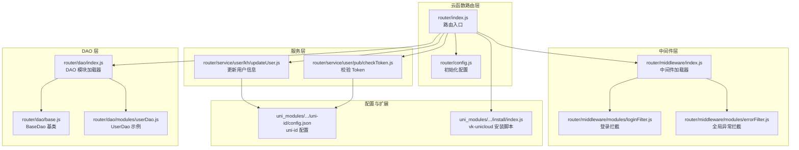
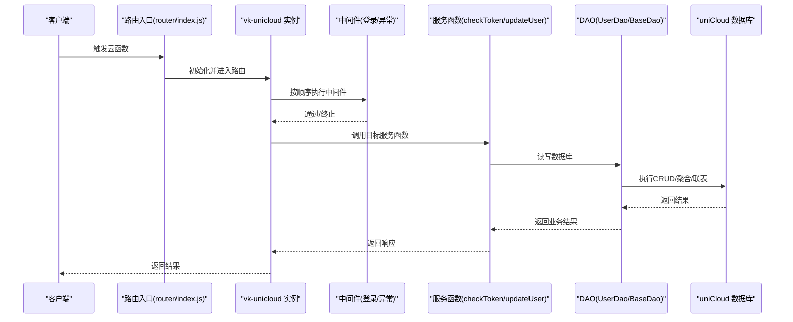
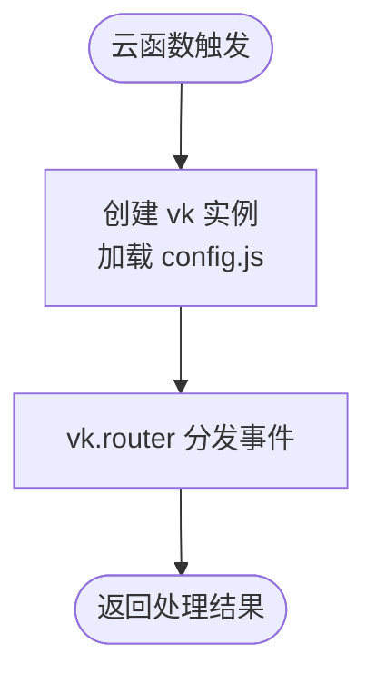
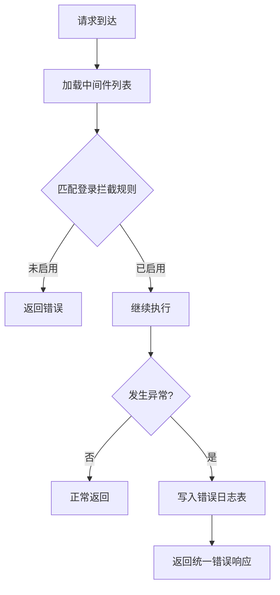
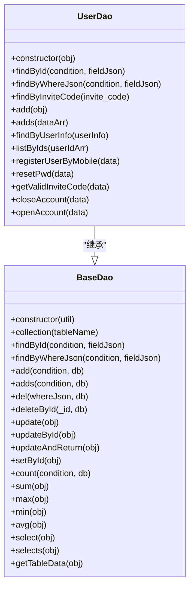
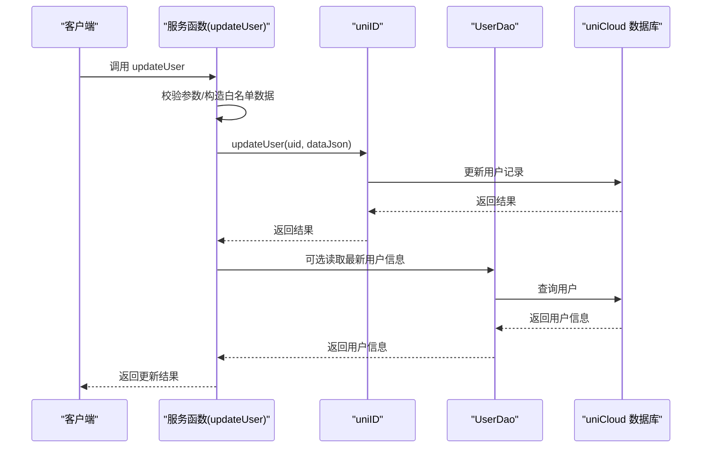
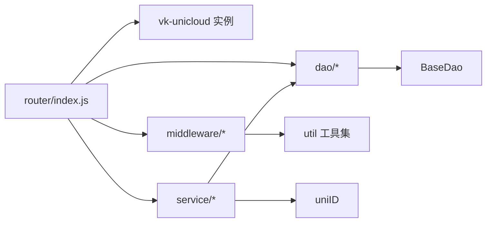

# 云开发架构

<cite>
**本文引用的文件**
- [router/index.js](file://uniCloud-aliyun/cloudfunctions/router/index.js)
- [router/config.js](file://uniCloud-aliyun/cloudfunctions/router/config.js)
- [router/dao/index.js](file://uniCloud-aliyun/cloudfunctions/router/dao/index.js)
- [router/dao/base.js](file://uniCloud-aliyun/cloudfunctions/router/dao/base.js)
- [router/dao/modules/userDao.js](file://uniCloud-aliyun/cloudfunctions/router/dao/modules/userDao.js)
- [router/middleware/index.js](file://uniCloud-aliyun/cloudfunctions/router/middleware/index.js)
- [router/middleware/modules/loginFilter.js](file://uniCloud-aliyun/cloudfunctions/router/middleware/modules/loginFilter.js)
- [router/middleware/modules/errorFilter.js](file://uniCloud-aliyun/cloudfunctions/router/middleware/modules/errorFilter.js)
- [router/service/user/pub/checkToken.js](file://uniCloud-aliyun/cloudfunctions/router/service/user/pub/checkToken.js)
- [router/service/user/kh/updateUser.js](file://uniCloud-aliyun/cloudfunctions/router/service/user/kh/updateUser.js)
- [uni_modules/uni-config-center/uniCloud/cloudfunctions/common/uni-config-center/uni-id/config.json](file://uni_modules/uni-config-center/uniCloud/cloudfunctions/common/uni-config-center/uni-id/config.json)
- [uni_modules/vk-unicloud/vk_modules/vk-unicloud-page/libs/function/install/index.js](file://uni_modules/vk-unicloud/vk_modules/vk-unicloud-page/libs/function/install/index.js)
</cite>

## 目录
1. [简介](#简介)
2. [项目结构](#项目结构)
3. [核心组件](#核心组件)
4. [架构总览](#架构总览)
5. [详细组件分析](#详细组件分析)
6. [依赖关系分析](#依赖关系分析)
7. [性能考虑](#性能考虑)
8. [故障排查指南](#故障排查指南)
9. [结论](#结论)
10. [附录](#附录)

## 简介
本文件系统性梳理“挪车助手”项目的云开发架构，围绕基于 uniCloud 的 vk-unicloud 路由体系展开，重点涵盖：
- 云函数路由系统与中间件机制
- DAO 层架构与数据库访问模式
- uni-id 用户系统集成与数据库表结构
- 云函数开发规范、性能优化与安全配置
- 最佳实践、错误处理与监控调试方法

## 项目结构
该项目采用“云函数路由 + DAO 层 + 中间件 + 服务层”的分层组织方式，路由入口集中于 router/index.js，通过 vk-unicloud 初始化并交由其统一调度。DAO 层提供面向对象的数据库抽象，中间件负责横切能力（鉴权、日志、异常等），服务层承载具体业务。

图表来源
- [router/index.js:1-8](file://uniCloud-aliyun/cloudfunctions/router/index.js#L1-L8)
- [router/config.js:1-9](file://uniCloud-aliyun/cloudfunctions/router/config.js#L1-L9)
- [router/middleware/index.js:1-34](file://uniCloud-aliyun/cloudfunctions/router/middleware/index.js#L1-L34)
- [router/middleware/modules/loginFilter.js:1-53](file://uniCloud-aliyun/cloudfunctions/router/middleware/modules/loginFilter.js#L1-L53)
- [router/middleware/modules/errorFilter.js:1-60](file://uniCloud-aliyun/cloudfunctions/router/middleware/modules/errorFilter.js#L1-L60)
- [router/dao/index.js:1-36](file://uniCloud-aliyun/cloudfunctions/router/dao/index.js#L1-L36)
- [router/dao/base.js:1-697](file://uniCloud-aliyun/cloudfunctions/router/dao/base.js#L1-L697)
- [router/dao/modules/userDao.js:1-568](file://uniCloud-aliyun/cloudfunctions/router/dao/modules/userDao.js#L1-L568)
- [router/service/user/pub/checkToken.js:1-29](file://uniCloud-aliyun/cloudfunctions/router/service/user/pub/checkToken.js#L1-L29)
- [router/service/user/kh/updateUser.js:1-33](file://uniCloud-aliyun/cloudfunctions/router/service/user/kh/updateUser.js#L1-L33)
- [uni_modules/uni-config-center/uniCloud/cloudfunctions/common/uni-config-center/uni-id/config.json](file://uni_modules/uni-config-center/uniCloud/cloudfunctions/common/uni-config-center/uni-id/config.json)
- [uni_modules/vk-unicloud/vk_modules/vk-unicloud-page/libs/function/install/index.js](file://uni_modules/vk-unicloud/vk_modules/vk-unicloud-page/libs/function/install/index.js)

章节来源
- [router/index.js:1-8](file://uniCloud-aliyun/cloudfunctions/router/index.js#L1-L8)
- [router/config.js:1-9](file://uniCloud-aliyun/cloudfunctions/router/config.js#L1-L9)
- [router/dao/index.js:1-36](file://uniCloud-aliyun/cloudfunctions/router/dao/index.js#L1-L36)
- [router/dao/base.js:1-697](file://uniCloud-aliyun/cloudfunctions/router/dao/base.js#L1-L697)
- [router/dao/modules/userDao.js:1-568](file://uniCloud-aliyun/cloudfunctions/router/dao/modules/userDao.js#L1-L568)
- [router/middleware/index.js:1-34](file://uniCloud-aliyun/cloudfunctions/router/middleware/index.js#L1-L34)
- [router/middleware/modules/loginFilter.js:1-53](file://uniCloud-aliyun/cloudfunctions/router/middleware/modules/loginFilter.js#L1-L53)
- [router/middleware/modules/errorFilter.js:1-60](file://uniCloud-aliyun/cloudfunctions/router/middleware/modules/errorFilter.js#L1-L60)
- [router/service/user/pub/checkToken.js:1-29](file://uniCloud-aliyun/cloudfunctions/router/service/user/pub/checkToken.js#L1-L29)
- [router/service/user/kh/updateUser.js:1-33](file://uniCloud-aliyun/cloudfunctions/router/service/user/kh/updateUser.js#L1-L33)

## 核心组件
- 路由入口与初始化
  - 路由入口文件通过 vk-unicloud 创建实例并交由其统一调度，保证云函数的统一入口与上下文注入。
- DAO 层
  - BaseDao 提供面向对象的 CRUD、聚合、联表、事务等能力；UserDao 作为示例展示如何继承并扩展业务方法。
- 中间件
  - 中间件加载器动态扫描 modules 下的拦截器，统一暴露为中间件列表；内置登录拦截与全局异常拦截。
- 服务层
  - 服务函数以模块化方式组织，如用户 Token 校验、用户信息更新等，统一通过 util 与 vk 能力协作。

章节来源
- [router/index.js:1-8](file://uniCloud-aliyun/cloudfunctions/router/index.js#L1-L8)
- [router/dao/base.js:1-697](file://uniCloud-aliyun/cloudfunctions/router/dao/base.js#L1-L697)
- [router/dao/modules/userDao.js:1-568](file://uniCloud-aliyun/cloudfunctions/router/dao/modules/userDao.js#L1-L568)
- [router/middleware/index.js:1-34](file://uniCloud-aliyun/cloudfunctions/router/middleware/index.js#L1-L34)
- [router/middleware/modules/loginFilter.js:1-53](file://uniCloud-aliyun/cloudfunctions/router/middleware/modules/loginFilter.js#L1-L53)
- [router/middleware/modules/errorFilter.js:1-60](file://uniCloud-aliyun/cloudfunctions/router/middleware/modules/errorFilter.js#L1-L60)
- [router/service/user/pub/checkToken.js:1-29](file://uniCloud-aliyun/cloudfunctions/router/service/user/pub/checkToken.js#L1-L29)
- [router/service/user/kh/updateUser.js:1-33](file://uniCloud-aliyun/cloudfunctions/router/service/user/kh/updateUser.js#L1-L33)

## 架构总览
下图展示了从客户端到云函数、中间件、DAO 层与数据库的整体调用链路，以及 vk-unicloud 在其中的协调作用。

图表来源
- [router/index.js:1-8](file://uniCloud-aliyun/cloudfunctions/router/index.js#L1-L8)
- [router/middleware/modules/loginFilter.js:1-53](file://uniCloud-aliyun/cloudfunctions/router/middleware/modules/loginFilter.js#L1-L53)
- [router/middleware/modules/errorFilter.js:1-60](file://uniCloud-aliyun/cloudfunctions/router/middleware/modules/errorFilter.js#L1-L60)
- [router/service/user/pub/checkToken.js:1-29](file://uniCloud-aliyun/cloudfunctions/router/service/user/pub/checkToken.js#L1-L29)
- [router/service/user/kh/updateUser.js:1-33](file://uniCloud-aliyun/cloudfunctions/router/service/user/kh/updateUser.js#L1-L33)
- [router/dao/base.js:1-697](file://uniCloud-aliyun/cloudfunctions/router/dao/base.js#L1-L697)
- [router/dao/modules/userDao.js:1-568](file://uniCloud-aliyun/cloudfunctions/router/dao/modules/userDao.js#L1-L568)

## 详细组件分析

### 路由系统与 vk-unicloud 集成
- 路由入口负责创建 vk 实例并交由其统一调度，确保所有云函数共享一致的上下文与工具集。
- 初始化配置通过 config.js 指定基础目录与 require 函数，便于模块化加载。

图表来源
- [router/index.js:1-8](file://uniCloud-aliyun/cloudfunctions/router/index.js#L1-L8)
- [router/config.js:1-9](file://uniCloud-aliyun/cloudfunctions/router/config.js#L1-L9)

章节来源
- [router/index.js:1-8](file://uniCloud-aliyun/cloudfunctions/router/index.js#L1-L8)
- [router/config.js:1-9](file://uniCloud-aliyun/cloudfunctions/router/config.js#L1-L9)

### 中间件机制与请求拦截
- 中间件加载器会扫描 modules 目录下的拦截器，并将其扁平化为中间件列表。
- 登录拦截器根据规则表控制不同登录/注册方式的启用状态，避免未授权访问。
- 全局异常拦截器在发生错误时统一记录到错误日志表，便于后续追踪与处理。

图表来源
- [router/middleware/index.js:1-34](file://uniCloud-aliyun/cloudfunctions/router/middleware/index.js#L1-L34)
- [router/middleware/modules/loginFilter.js:1-53](file://uniCloud-aliyun/cloudfunctions/router/middleware/modules/loginFilter.js#L1-L53)
- [router/middleware/modules/errorFilter.js:1-60](file://uniCloud-aliyun/cloudfunctions/router/middleware/modules/errorFilter.js#L1-L60)

章节来源
- [router/middleware/index.js:1-34](file://uniCloud-aliyun/cloudfunctions/router/middleware/index.js#L1-L34)
- [router/middleware/modules/loginFilter.js:1-53](file://uniCloud-aliyun/cloudfunctions/router/middleware/modules/loginFilter.js#L1-L53)
- [router/middleware/modules/errorFilter.js:1-60](file://uniCloud-aliyun/cloudfunctions/router/middleware/modules/errorFilter.js#L1-L60)

### DAO 层架构与数据访问模式
- BaseDao 提供统一的 CRUD、聚合、联表、事务等能力，子类仅需设置 tableName 即可绑定表。
- UserDao 作为示例，重写了常用方法并扩展了业务方法（如按邀请码查询、按手机号注册登录、注销/恢复账号等）。
- DAO 层通过 vk.baseDao 与 uniCloud 数据库交互，支持条件查询、排序、分页、联表、聚合等。

图表来源
- [router/dao/base.js:1-697](file://uniCloud-aliyun/cloudfunctions/router/dao/base.js#L1-L697)
- [router/dao/modules/userDao.js:1-568](file://uniCloud-aliyun/cloudfunctions/router/dao/modules/userDao.js#L1-L568)

章节来源
- [router/dao/base.js:1-697](file://uniCloud-aliyun/cloudfunctions/router/dao/base.js#L1-L697)
- [router/dao/modules/userDao.js:1-568](file://uniCloud-aliyun/cloudfunctions/router/dao/modules/userDao.js#L1-L568)

### 服务层与 uni-id 用户系统集成
- 服务函数通过 util 与 vk 能力协作，调用 uniID 完成用户认证、令牌校验、更新用户信息等。
- checkToken 服务用于验证令牌有效性并返回用户信息与权限。
- updateUser 服务根据白名单字段更新用户资料，避免越权修改敏感字段。

图表来源
- [router/service/user/kh/updateUser.js:1-33](file://uniCloud-aliyun/cloudfunctions/router/service/user/kh/updateUser.js#L1-L33)
- [router/dao/modules/userDao.js:1-568](file://uniCloud-aliyun/cloudfunctions/router/dao/modules/userDao.js#L1-L568)

章节来源
- [router/service/user/pub/checkToken.js:1-29](file://uniCloud-aliyun/cloudfunctions/router/service/user/pub/checkToken.js#L1-L29)
- [router/service/user/kh/updateUser.js:1-33](file://uniCloud-aliyun/cloudfunctions/router/service/user/kh/updateUser.js#L1-L33)
- [router/dao/modules/userDao.js:1-568](file://uniCloud-aliyun/cloudfunctions/router/dao/modules/userDao.js#L1-L568)

### 数据库表结构与 uni-id 集成
- 项目通过 uni-id 提供的用户、角色、权限、日志等表结构支撑用户体系。
- vk-unicloud 提供安装脚本，便于在 uniCloud 环境中完成初始化与配置。

章节来源
- [uni_modules/uni-config-center/uniCloud/cloudfunctions/common/uni-config-center/uni-id/config.json](file://uni_modules/uni-config-center/uniCloud/cloudfunctions/common/uni-config-center/uni-id/config.json)
- [uni_modules/vk-unicloud/vk_modules/vk-unicloud-page/libs/function/install/index.js](file://uni_modules/vk-unicloud/vk_modules/vk-unicloud-page/libs/function/install/index.js)

## 依赖关系分析
- 路由层依赖 vk-unicloud 与中间件、DAO、服务层模块。
- 中间件层依赖规则配置与 util 工具集。
- DAO 层依赖 vk.baseDao 与 uniCloud 数据库命令。
- 服务层依赖 util 与 DAO 层提供的数据访问能力。

图表来源
- [router/index.js:1-8](file://uniCloud-aliyun/cloudfunctions/router/index.js#L1-L8)
- [router/middleware/index.js:1-34](file://uniCloud-aliyun/cloudfunctions/router/middleware/index.js#L1-L34)
- [router/dao/index.js:1-36](file://uniCloud-aliyun/cloudfunctions/router/dao/index.js#L1-L36)
- [router/service/user/pub/checkToken.js:1-29](file://uniCloud-aliyun/cloudfunctions/router/service/user/pub/checkToken.js#L1-L29)
- [router/service/user/kh/updateUser.js:1-33](file://uniCloud-aliyun/cloudfunctions/router/service/user/kh/updateUser.js#L1-L33)

章节来源
- [router/index.js:1-8](file://uniCloud-aliyun/cloudfunctions/router/index.js#L1-L8)
- [router/middleware/index.js:1-34](file://uniCloud-aliyun/cloudfunctions/router/middleware/index.js#L1-L34)
- [router/dao/index.js:1-36](file://uniCloud-aliyun/cloudfunctions/router/dao/index.js#L1-L36)
- [router/service/user/pub/checkToken.js:1-29](file://uniCloud-aliyun/cloudfunctions/router/service/user/pub/checkToken.js#L1-L29)
- [router/service/user/kh/updateUser.js:1-33](file://uniCloud-aliyun/cloudfunctions/router/service/user/kh/updateUser.js#L1-L33)

## 性能考虑
- 分页与查询优化
  - select 支持分页与条件裁剪，建议结合 whereJson 与 fieldJson 控制查询范围与字段集。
  - 大量数据查询时，合理设置 pageSize，必要时使用 selects 进行联表聚合。
- 聚合与联表
  - selects 支持多表联接、分组、树形结构查询，但需注意性能开销，尽量在副表设置 whereJson 与 limit。
- 事务与批量操作
  - 批量添加/更新时，优先使用 adds 与批量 update，减少网络往返。
- 缓存与去重
  - 异常拦截器可结合 md5 去重，避免重复错误日志写入。

## 故障排查指南
- 异常捕获与记录
  - 全局异常拦截器会自动记录错误信息到 vk-error-log 表，便于定位问题。
- 登录/注册拦截
  - 如遇登录失败或被禁止，检查 loginFilter 中对应 url 的 enable 状态。
- 日志与调试
  - 可在 DAO 层开启 debug 模式获取数据库执行耗时，辅助性能分析。

章节来源
- [router/middleware/modules/errorFilter.js:1-60](file://uniCloud-aliyun/cloudfunctions/router/middleware/modules/errorFilter.js#L1-L60)
- [router/middleware/modules/loginFilter.js:1-53](file://uniCloud-aliyun/cloudfunctions/router/middleware/modules/loginFilter.js#L1-L53)
- [router/dao/base.js:550-697](file://uniCloud-aliyun/cloudfunctions/router/dao/base.js#L550-L697)

## 结论
本项目基于 vk-unicloud 构建了清晰的云函数路由体系，配合中间件与 DAO 层实现了可扩展、可维护的云开发架构。通过 uni-id 用户系统与统一的服务层接口，既能快速迭代业务，又能保障安全性与可观测性。建议在后续开发中持续完善中间件规则、优化查询与联表策略，并加强监控与告警体系。

## 附录
- 开发规范建议
  - 云函数命名规范：按模块划分（user、admin 等），服务函数按职责细分（pub、kh、sys）。
  - 中间件编写：遵循 index 顺序与模式约定，避免跨模块耦合。
  - DAO 方法：尽量复用 BaseDao 能力，业务方法保持单一职责。
- 安全配置要点
  - 登录/注册方式通过规则表集中管控，避免默认开放高风险方式。
  - 敏感字段默认屏蔽（如 token、password），对外仅返回必要字段。
- 最佳实践
  - 使用 vk.baseDao 的聚合与联表能力替代复杂 SQL，提升可读性与可维护性。
  - 对高频接口引入缓存与去重策略，降低数据库压力。