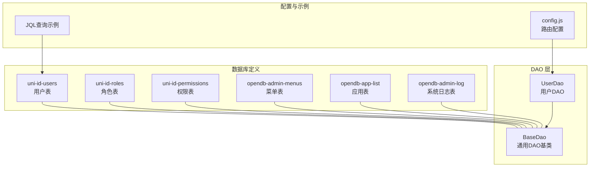
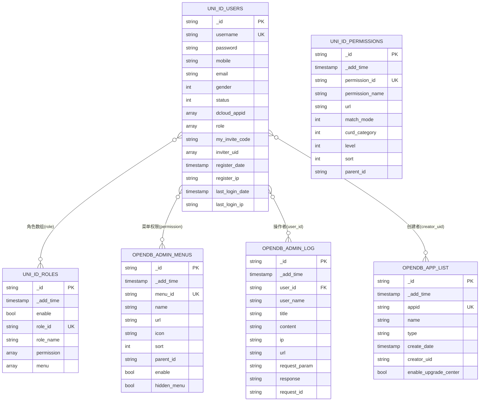
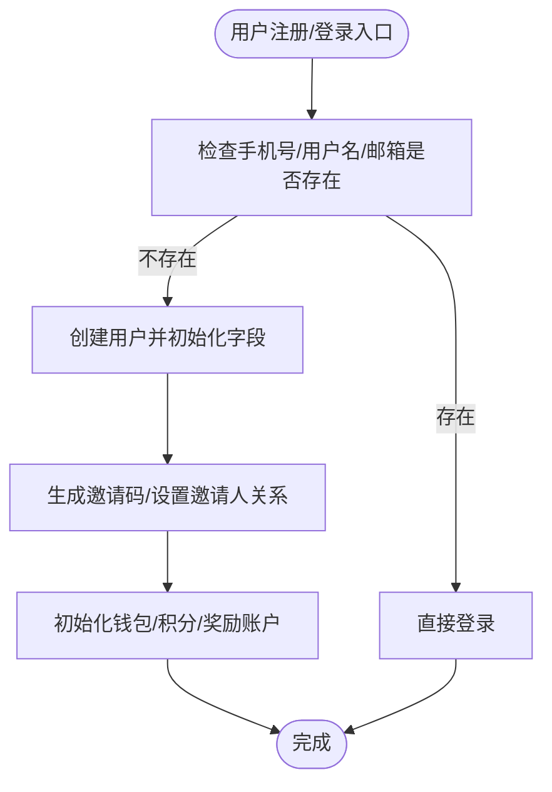
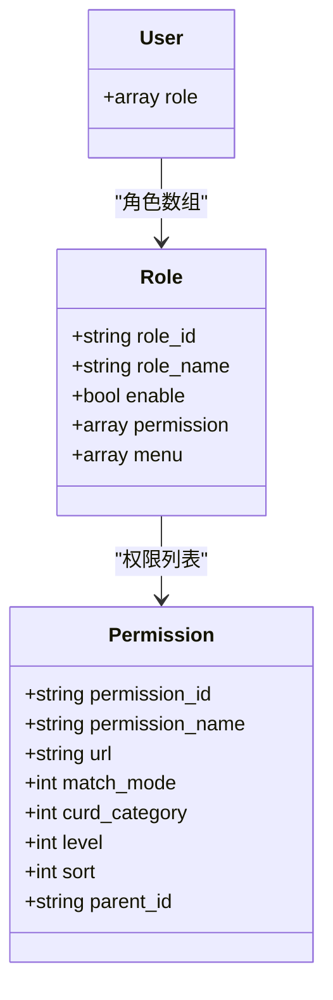
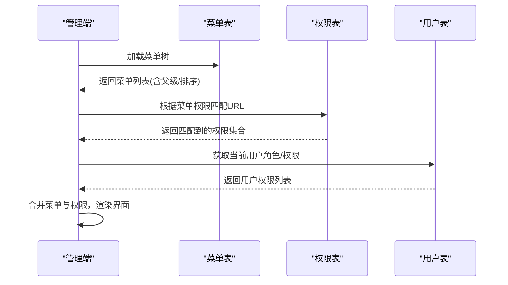
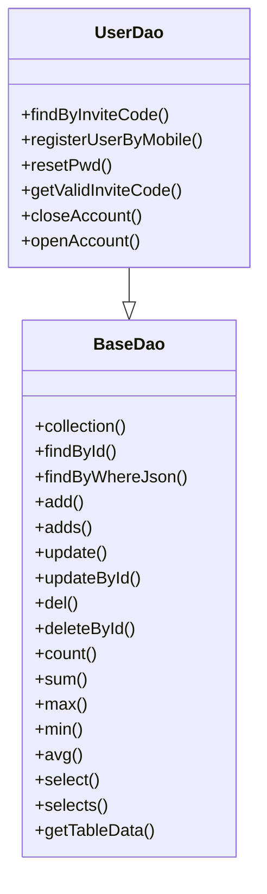
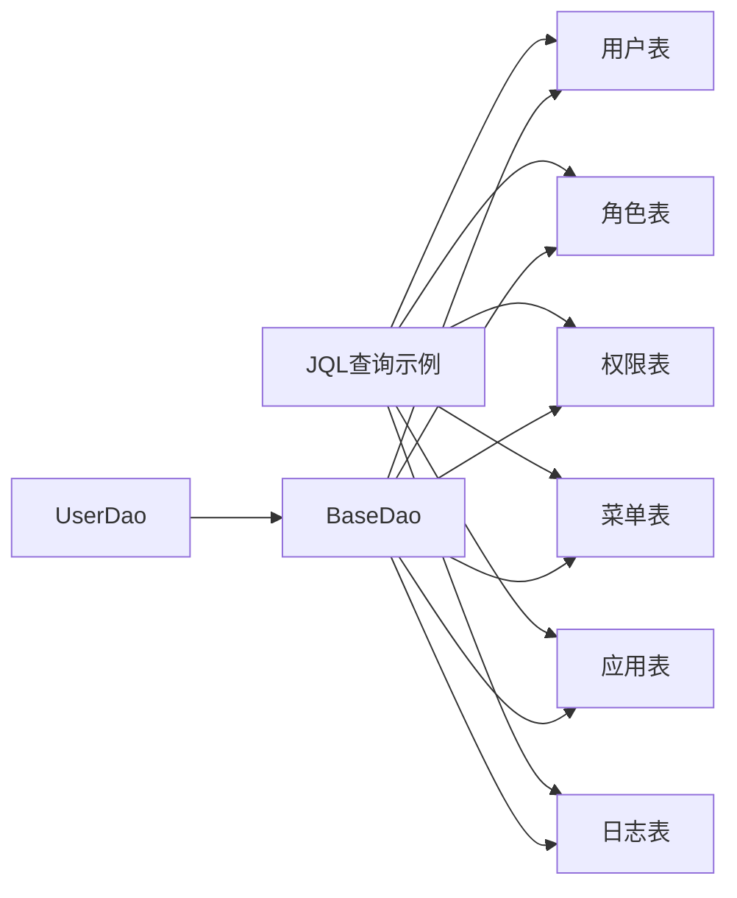

# 数据库设计

<cite>
**本文引用的文件**
- [uni-id-users.schema.json](file://uniCloud-aliyun/database/uni-id-users.schema.json)
- [uni-id-users.index.json](file://uniCloud-aliyun/database/uni-id-users.index.json)
- [uni-id-users.init_data.json](file://uniCloud-aliyun/database/uni-id-users.init_data.json)
- [uni-id-roles.schema.json](file://uniCloud-aliyun/database/uni-id-roles.schema.json)
- [uni-id-roles.index.json](file://uniCloud-aliyun/database/uni-id-roles.index.json)
- [uni-id-roles.init_data.json](file://uniCloud-aliyun/database/uni-id-roles.init_data.json)
- [uni-id-permissions.schema.json](file://uniCloud-aliyun/database/uni-id-permissions.schema.json)
- [uni-id-permissions.index.json](file://uniCloud-aliyun/database/uni-id-permissions.index.json)
- [opendb-admin-menus.schema.json](file://uniCloud-aliyun/database/opendb-admin-menus.schema.json)
- [opendb-admin-menus.index.json](file://uniCloud-aliyun/database/opendb-admin-menus.index.json)
- [opendb-admin-menus.init_data.json](file://uniCloud-aliyun/database/opendb-admin-menus.init_data.json)
- [opendb-app-list.schema.json](file://uniCloud-aliyun/database/opendb-app-list.schema.json)
- [opendb-app-list.index.json](file://uniCloud-aliyun/database/opendb-app-list.index.json)
- [opendb-admin-log.schema.json](file://uniCloud-aliyun/database/opendb-admin-log.schema.json)
- [JQL查询.jql](file://uniCloud-aliyun/database/JQL查询.jql)
- [userDao.js](file://uniCloud-aliyun/cloudfunctions/router/dao/modules/userDao.js)
- [base.js](file://uniCloud-aliyun/cloudfunctions/router/dao/base.js)
- [config.js](file://uniCloud-aliyun/cloudfunctions/router/config.js)
</cite>

## 目录
1. [引言](#引言)
2. [项目结构](#项目结构)
3. [核心组件](#核心组件)
4. [架构总览](#架构总览)
5. [详细组件分析](#详细组件分析)
6. [依赖分析](#依赖分析)
7. [性能考虑](#性能考虑)
8. [故障排查指南](#故障排查指南)
9. [结论](#结论)
10. [附录](#附录)

## 引言
本文件面向基于 uniCloud 的数据库设计与实现，系统性梳理数据库架构、表结构设计、索引配置与数据模型，重点覆盖用户表、角色表、权限表、菜单表、应用表等核心数据表。同时，结合 DAO 层实现与 JQL 查询语法，给出数据验证规则、约束条件、查询优化策略、索引设计原则、数据迁移与备份策略以及数据安全配置建议。

## 项目结构
数据库相关资源主要位于 uniCloud-aliyun/database 目录，采用“表 schema + 索引 + 初始化数据”的组织方式；业务数据访问层位于 uniCloud-aliyun/cloudfunctions/router/dao，提供统一的 DAO 抽象与具体表的 DAO 实现。

图表来源
- [uni-id-users.schema.json:1-478](file://uniCloud-aliyun/database/uni-id-users.schema.json#L1-L478)
- [uni-id-roles.schema.json:1-67](file://uniCloud-aliyun/database/uni-id-roles.schema.json#L1-L67)
- [uni-id-permissions.schema.json:1-83](file://uniCloud-aliyun/database/uni-id-permissions.schema.json#L1-L83)
- [opendb-admin-menus.schema.json:1-63](file://uniCloud-aliyun/database/opendb-admin-menus.schema.json#L1-L63)
- [opendb-app-list.schema.json:1-294](file://uniCloud-aliyun/database/opendb-app-list.schema.json#L1-L294)
- [opendb-admin-log.schema.json:1-55](file://uniCloud-aliyun/database/opendb-admin-log.schema.json#L1-L55)
- [base.js:1-697](file://uniCloud-aliyun/cloudfunctions/router/dao/base.js#L1-L697)
- [userDao.js:1-568](file://uniCloud-aliyun/cloudfunctions/router/dao/modules/userDao.js#L1-L568)
- [config.js:1-9](file://uniCloud-aliyun/cloudfunctions/router/config.js#L1-L9)
- [JQL查询.jql:1-13](file://uniCloud-aliyun/database/JQL查询.jql#L1-L13)

章节来源
- [uni-id-users.schema.json:1-478](file://uniCloud-aliyun/database/uni-id-users.schema.json#L1-L478)
- [uni-id-roles.schema.json:1-67](file://uniCloud-aliyun/database/uni-id-roles.schema.json#L1-L67)
- [uni-id-permissions.schema.json:1-83](file://uniCloud-aliyun/database/uni-id-permissions.schema.json#L1-L83)
- [opendb-admin-menus.schema.json:1-63](file://uniCloud-aliyun/database/opendb-admin-menus.schema.json#L1-L63)
- [opendb-app-list.schema.json:1-294](file://uniCloud-aliyun/database/opendb-app-list.schema.json#L1-L294)
- [opendb-admin-log.schema.json:1-55](file://uniCloud-aliyun/database/opendb-admin-log.schema.json#L1-L55)
- [base.js:1-697](file://uniCloud-aliyun/cloudfunctions/router/dao/base.js#L1-L697)
- [userDao.js:1-568](file://uniCloud-aliyun/cloudfunctions/router/dao/modules/userDao.js#L1-L568)
- [config.js:1-9](file://uniCloud-aliyun/cloudfunctions/router/config.js#L1-L9)
- [JQL查询.jql:1-13](file://uniCloud-aliyun/database/JQL查询.jql#L1-L13)

## 核心组件
- 用户表（uni-id-users）
  - 关键字段：用户名、密码、手机号、邮箱、角色数组、第三方 openid/unionid、邀请链、注册/登录时间与 IP、钱包/积分/奖励账户等。
  - 约束与校验：唯一性（用户名、邀请码）、枚举（性别、状态、认证状态）、格式（邮箱、手机号）、默认值（注册时间、注册 IP、性别、状态等）。
  - 索引：用户名、手机号、邮箱、各平台 openid、unionid、邀请码、dcloud_appid、角色数组、注册/登录时间等。
  - 初始化数据：内置超级管理员账号及初始字段。

- 角色表（uni-id-roles）
  - 关键字段：角色唯一标识、角色名、启用状态、权限列表、菜单列表、备注等。
  - 约束与校验：角色标识唯一、启用布尔值默认 true、权限/菜单为数组。
  - 索引：角色标识唯一索引、权限数组、角色名等。

- 权限表（uni-id-permissions）
  - 关键字段：权限标识、权限名、启用状态、匹配模式（完整路径/通配符/正则）、CURD 分类、权限级别、URL 列表、排序等。
  - 约束与校验：权限标识唯一、匹配模式/级别枚举、URL 可为字符串或数组。
  - 索引：权限标识唯一、父级、URL、排序等。

- 菜单表（opendb-admin-menus）
  - 关键字段：菜单 ID、名称、URL、图标、排序、父级菜单、启用/隐藏、权限列表等。
  - 约束与校验：菜单 ID 唯一、父子关系自引用、启用/隐藏布尔值。
  - 索引：菜单 ID 唯一、父级、URL、排序等。

- 应用表（opendb-app-list）
  - 关键字段：应用类型、AppID、应用名、描述、创建者、启用升级中心、截图、各平台（微信/支付宝/百度/头条/QQ/快手/飞书/京东/钉钉/快应用/H5）信息、商店列表等。
  - 约束与校验：AppID 唯一、应用类型枚举、商店列表属性。
  - 索引：AppID 唯一、名称、类型、创建时间、启用升级中心等。

- 系统日志表（opendb-admin-log）
  - 关键字段：操作者、用户名、标题、内容、IP、请求地址、请求参数、响应结果、请求 ID 等。
  - 约束与校验：外键指向用户表、默认值注入当前用户与客户端 IP。
  - 索引：按需建立时间、用户、URL 等索引以支撑审计与检索。

- DAO 层（BaseDao/UserDao）
  - BaseDao 提供统一的 CRUD、聚合、联表、事务、分页、统计、求和/最值/平均等能力。
  - UserDao 在 BaseDao 基础上定制用户表的默认字段过滤（不返回 token/password）、常用业务方法（按邀请码查询、批量注册/登录、注销/恢复账号、邀请码生成等）。

- JQL 查询示例
  - 提供在本地/远程数据库管理中使用 JQL 快速查询的示例与注意事项（最大返回条数限制、权限控制差异等）。

章节来源
- [uni-id-users.schema.json:1-478](file://uniCloud-aliyun/database/uni-id-users.schema.json#L1-L478)
- [uni-id-users.index.json:1-67](file://uniCloud-aliyun/database/uni-id-users.index.json#L1-L67)
- [uni-id-users.init_data.json:1-14](file://uniCloud-aliyun/database/uni-id-users.init_data.json#L1-L14)
- [uni-id-roles.schema.json:1-67](file://uniCloud-aliyun/database/uni-id-roles.schema.json#L1-L67)
- [uni-id-roles.index.json:1-19](file://uniCloud-aliyun/database/uni-id-roles.index.json#L1-L19)
- [uni-id-roles.init_data.json:1-30](file://uniCloud-aliyun/database/uni-id-roles.init_data.json#L1-L30)
- [uni-id-permissions.schema.json:1-83](file://uniCloud-aliyun/database/uni-id-permissions.schema.json#L1-L83)
- [uni-id-permissions.index.json:1-23](file://uniCloud-aliyun/database/uni-id-permissions.index.json#L1-L23)
- [opendb-admin-menus.schema.json:1-63](file://uniCloud-aliyun/database/opendb-admin-menus.schema.json#L1-L63)
- [opendb-admin-menus.index.json:1-23](file://uniCloud-aliyun/database/opendb-admin-menus.index.json#L1-L23)
- [opendb-admin-menus.init_data.json:1-194](file://uniCloud-aliyun/database/opendb-admin-menus.init_data.json#L1-L194)
- [opendb-app-list.schema.json:1-294](file://uniCloud-aliyun/database/opendb-app-list.schema.json#L1-L294)
- [opendb-app-list.index.json:1-27](file://uniCloud-aliyun/database/opendb-app-list.index.json#L1-L27)
- [opendb-admin-log.schema.json:1-55](file://uniCloud-aliyun/database/opendb-admin-log.schema.json#L1-L55)
- [base.js:1-697](file://uniCloud-aliyun/cloudfunctions/router/dao/base.js#L1-L697)
- [userDao.js:1-568](file://uniCloud-aliyun/cloudfunctions/router/dao/modules/userDao.js#L1-L568)
- [JQL查询.jql:1-13](file://uniCloud-aliyun/database/JQL查询.jql#L1-L13)

## 架构总览
下图展示了数据库表之间的关系与外键约束，以及 DAO 层如何通过 BaseDao 统一访问这些表。

图表来源
- [uni-id-users.schema.json:1-478](file://uniCloud-aliyun/database/uni-id-users.schema.json#L1-L478)
- [uni-id-roles.schema.json:1-67](file://uniCloud-aliyun/database/uni-id-roles.schema.json#L1-L67)
- [uni-id-permissions.schema.json:1-83](file://uniCloud-aliyun/database/uni-id-permissions.schema.json#L1-L83)
- [opendb-admin-menus.schema.json:1-63](file://uniCloud-aliyun/database/opendb-admin-menus.schema.json#L1-L63)
- [opendb-app-list.schema.json:1-294](file://uniCloud-aliyun/database/opendb-app-list.schema.json#L1-L294)
- [opendb-admin-log.schema.json:1-55](file://uniCloud-aliyun/database/opendb-admin-log.schema.json#L1-L55)

## 详细组件分析

### 用户表（uni-id-users）设计
- 字段设计要点
  - 身份标识：用户名唯一、手机号/邮箱可选唯一（视业务策略），第三方 openid/unionid 支持多平台。
  - 安全与合规：密码加密存储；实名认证信息结构化，支持个人/企业两类；注册/登录环境信息便于审计。
  - 关系与生态：角色数组外键至角色表；邀请链支持多级邀请；钱包/积分/奖励账户结构化，便于精细化运营。
  - 时间与来源：注册/登录时间与 IP 记录，便于风控与审计。
- 索引策略
  - 唯一性：用户名、手机号、邮箱、my_invite_code、dcloud_appid（数组）。
  - 多平台登录：各平台 openid 与 unionid 单列索引。
  - 关系与时间：role（数组）、invite_time、register_date、last_login_date。
- 初始化数据
  - 提供内置超级管理员账号，具备后台登录权限与默认角色。

图表来源
- [userDao.js:355-382](file://uniCloud-aliyun/cloudfunctions/router/dao/modules/userDao.js#L355-L382)
- [uni-id-users.schema.json:1-478](file://uniCloud-aliyun/database/uni-id-users.schema.json#L1-L478)

章节来源
- [uni-id-users.schema.json:1-478](file://uniCloud-aliyun/database/uni-id-users.schema.json#L1-L478)
- [uni-id-users.index.json:1-67](file://uniCloud-aliyun/database/uni-id-users.index.json#L1-L67)
- [uni-id-users.init_data.json:1-14](file://uniCloud-aliyun/database/uni-id-users.init_data.json#L1-L14)
- [userDao.js:1-568](file://uniCloud-aliyun/cloudfunctions/router/dao/modules/userDao.js#L1-L568)

### 角色表（uni-id-roles）与权限表（uni-id-permissions）
- 角色表
  - 角色标识唯一，启用状态默认 true；权限与菜单列表用于授权与菜单控制。
- 权限表
  - 权限标识唯一；支持多种匹配模式（完整路径/通配符/正则）与 CURD 分类、权限级别分级，便于精细化权限治理。
- 关系
  - 用户表的角色数组指向角色表；角色表的权限/菜单列表与权限表/菜单表关联。

图表来源
- [uni-id-roles.schema.json:1-67](file://uniCloud-aliyun/database/uni-id-roles.schema.json#L1-L67)
- [uni-id-permissions.schema.json:1-83](file://uniCloud-aliyun/database/uni-id-permissions.schema.json#L1-L83)
- [uni-id-users.schema.json:1-478](file://uniCloud-aliyun/database/uni-id-users.schema.json#L1-L478)

章节来源
- [uni-id-roles.schema.json:1-67](file://uniCloud-aliyun/database/uni-id-roles.schema.json#L1-L67)
- [uni-id-roles.index.json:1-19](file://uniCloud-aliyun/database/uni-id-roles.index.json#L1-L19)
- [uni-id-roles.init_data.json:1-30](file://uniCloud-aliyun/database/uni-id-roles.init_data.json#L1-L30)
- [uni-id-permissions.schema.json:1-83](file://uniCloud-aliyun/database/uni-id-permissions.schema.json#L1-L83)
- [uni-id-permissions.index.json:1-23](file://uniCloud-aliyun/database/uni-id-permissions.index.json#L1-L23)
- [uni-id-users.schema.json:1-478](file://uniCloud-aliyun/database/uni-id-users.schema.json#L1-L478)

### 菜单表（opendb-admin-menus）与应用表（opendb-app-list）
- 菜单表
  - 支持父子关系、排序、启用/隐藏、图标与 URL；菜单权限列表与权限表关联。
- 应用表
  - 统一管理各平台（小程序/快应用/H5 等）信息与商店列表，支持应用升级中心开关与优先级排序。

图表来源
- [opendb-admin-menus.schema.json:1-63](file://uniCloud-aliyun/database/opendb-admin-menus.schema.json#L1-L63)
- [opendb-admin-menus.index.json:1-23](file://uniCloud-aliyun/database/opendb-admin-menus.index.json#L1-L23)
- [opendb-admin-menus.init_data.json:1-194](file://uniCloud-aliyun/database/opendb-admin-menus.init_data.json#L1-L194)
- [uni-id-permissions.schema.json:1-83](file://uniCloud-aliyun/database/uni-id-permissions.schema.json#L1-L83)
- [uni-id-users.schema.json:1-478](file://uniCloud-aliyun/database/uni-id-users.schema.json#L1-L478)

章节来源
- [opendb-admin-menus.schema.json:1-63](file://uniCloud-aliyun/database/opendb-admin-menus.schema.json#L1-L63)
- [opendb-admin-menus.index.json:1-23](file://uniCloud-aliyun/database/opendb-admin-menus.index.json#L1-L23)
- [opendb-admin-menus.init_data.json:1-194](file://uniCloud-aliyun/database/opendb-admin-menus.init_data.json#L1-L194)
- [opendb-app-list.schema.json:1-294](file://uniCloud-aliyun/database/opendb-app-list.schema.json#L1-L294)
- [opendb-app-list.index.json:1-27](file://uniCloud-aliyun/database/opendb-app-list.index.json#L1-L27)

### DAO 层与数据访问模式
- BaseDao
  - 提供 findById/add/adds/update/del/select/selects/getTableData/count/聚合统计等通用能力。
  - 支持事务、字段过滤、分页、排序、联表、树形查询、地理查询等高级特性。
- UserDao
  - 在 BaseDao 基础上定制用户表默认字段过滤（不返回 token/password）。
  - 提供常用业务方法：按邀请码查询、批量注册/登录、注销/恢复账号、邀请码生成等。

图表来源
- [base.js:1-697](file://uniCloud-aliyun/cloudfunctions/router/dao/base.js#L1-L697)
- [userDao.js:1-568](file://uniCloud-aliyun/cloudfunctions/router/dao/modules/userDao.js#L1-L568)

章节来源
- [base.js:1-697](file://uniCloud-aliyun/cloudfunctions/router/dao/base.js#L1-L697)
- [userDao.js:1-568](file://uniCloud-aliyun/cloudfunctions/router/dao/modules/userDao.js#L1-L568)
- [config.js:1-9](file://uniCloud-aliyun/cloudfunctions/router/config.js#L1-L9)

### JQL 查询语法与示例
- JQL 是 uniCloud 提供的数据库查询语言，支持在本地/远程数据库管理中进行快速查询与调试。
- 示例文件提供了查询用户表的示例，强调最大返回条数限制与权限控制差异（Schema 权限控制与 JQL 运行时差异）。

章节来源
- [JQL查询.jql:1-13](file://uniCloud-aliyun/database/JQL查询.jql#L1-L13)

## 依赖分析
- 外部依赖
  - uniCloud 数据库与 JQL 语法。
  - uni-id 体系（用户、角色、权限、菜单、日志等）。
- 内部依赖
  - DAO 层依赖 BaseDao 统一能力。
  - 各表之间通过外键/数组字段形成弱耦合关系，降低跨表复杂度。
- 循环依赖
  - DAO 层与表定义解耦，无循环依赖风险。

图表来源
- [JQL查询.jql:1-13](file://uniCloud-aliyun/database/JQL查询.jql#L1-L13)
- [base.js:1-697](file://uniCloud-aliyun/cloudfunctions/router/dao/base.js#L1-L697)
- [userDao.js:1-568](file://uniCloud-aliyun/cloudfunctions/router/dao/modules/userDao.js#L1-L568)
- [uni-id-users.schema.json:1-478](file://uniCloud-aliyun/database/uni-id-users.schema.json#L1-L478)
- [uni-id-roles.schema.json:1-67](file://uniCloud-aliyun/database/uni-id-roles.schema.json#L1-L67)
- [uni-id-permissions.schema.json:1-83](file://uniCloud-aliyun/database/uni-id-permissions.schema.json#L1-L83)
- [opendb-admin-menus.schema.json:1-63](file://uniCloud-aliyun/database/opendb-admin-menus.schema.json#L1-L63)
- [opendb-app-list.schema.json:1-294](file://uniCloud-aliyun/database/opendb-app-list.schema.json#L1-L294)
- [opendb-admin-log.schema.json:1-55](file://uniCloud-aliyun/database/opendb-admin-log.schema.json#L1-L55)

## 性能考虑
- 索引设计原则
  - 唯一性字段优先建立唯一索引（如用户名、手机号、邮箱、my_invite_code、appid）。
  - 多平台登录场景为各平台 openid/unionid 建立单列索引。
  - 数组字段（角色、邀请链）建立数组索引，避免全表扫描。
  - 时间字段（注册/登录时间）建立倒序索引，支持高效排序与分页。
- 查询优化技巧
  - 使用 select（单表）替代 selects（联表）以减少聚合开销。
  - 合理使用字段过滤（fieldJson）与分页（pageIndex/pageSize），避免一次性返回大量数据。
  - 对高频查询条件（如邀请码、手机号、用户名）建立索引并保持更新。
- DAO 层优化
  - 使用 getTableData 自动选择 select/selects，兼顾性能与灵活性。
  - 聚合查询时尽量前置 where 条件，减少中间结果集大小。

## 故障排查指南
- 常见问题
  - 查询结果为空：检查 whereJson 条件是否正确、索引是否命中、字段过滤是否误删必要字段。
  - 注册/登录异常：检查手机号/用户名/邮箱唯一性冲突、第三方 openid/unionid 是否重复、邀请码是否可用。
  - 权限不足：确认用户角色/权限列表与菜单权限匹配，URL 匹配模式是否正确。
- 日志与审计
  - 使用系统日志表记录关键操作，结合请求 ID 与用户信息定位问题。
- DAO 层调试
  - 开启 debug 模式查看执行耗时，定位慢查询。
  - 使用事务包裹批量操作，确保一致性与可回滚。

章节来源
- [opendb-admin-log.schema.json:1-55](file://uniCloud-aliyun/database/opendb-admin-log.schema.json#L1-L55)
- [base.js:550-697](file://uniCloud-aliyun/cloudfunctions/router/dao/base.js#L550-L697)
- [userDao.js:1-568](file://uniCloud-aliyun/cloudfunctions/router/dao/modules/userDao.js#L1-L568)

## 结论
本数据库设计围绕 uni-id 体系构建，采用清晰的表结构与索引策略，结合 DAO 层抽象实现统一的数据访问能力。通过 JQL 查询示例与初始化数据，能够快速落地开发与调试。建议在生产环境中持续完善索引、优化查询路径、加强日志审计与安全配置，确保系统稳定与高性能。

## 附录
- 数据验证规则与约束
  - 唯一性：用户名、手机号、邮箱、my_invite_code、appid。
  - 枚举：性别、状态、认证状态、匹配模式、CURD 分类、权限级别。
  - 格式：邮箱、手机号（正则/格式校验）。
  - 默认值：注册时间、注册 IP、性别、状态、账户余额/积分/奖励默认结构。
- 索引清单（示例）
  - 用户表：username、mobile、email、wx_openid.*、wx_unionid、ali_openid、my_invite_code、dcloud_appid、role、invite_time、register_date、last_login_date。
  - 角色表：role_id（唯一）、permission（数组）、role_name。
  - 权限表：permission_id（唯一）、parent_id、url、sort。
  - 菜单表：menu_id（唯一）、parent_id、url、sort。
  - 应用表：appid（唯一）、name、type、create_date、enable_upgrade_center。
- 数据迁移与备份
  - 迁移：通过初始化数据 JSON 与 DAO 层批量导入，结合事务保证一致性。
  - 备份：定期导出关键表数据（用户、角色、权限、菜单、应用、日志），并验证导入流程。
- 数据安全配置
  - 密码加密存储、token 与敏感字段默认不返回。
  - 外键/数组字段用于弱耦合关系，避免强依赖。
  - 审计日志记录关键操作与请求上下文，便于追踪与取证。

章节来源
- [uni-id-users.schema.json:1-478](file://uniCloud-aliyun/database/uni-id-users.schema.json#L1-L478)
- [uni-id-roles.schema.json:1-67](file://uniCloud-aliyun/database/uni-id-roles.schema.json#L1-L67)
- [uni-id-permissions.schema.json:1-83](file://uniCloud-aliyun/database/uni-id-permissions.schema.json#L1-L83)
- [opendb-admin-menus.schema.json:1-63](file://uniCloud-aliyun/database/opendb-admin-menus.schema.json#L1-L63)
- [opendb-app-list.schema.json:1-294](file://uniCloud-aliyun/database/opendb-app-list.schema.json#L1-L294)
- [opendb-admin-log.schema.json:1-55](file://uniCloud-aliyun/database/opendb-admin-log.schema.json#L1-L55)
- [uni-id-users.index.json:1-67](file://uniCloud-aliyun/database/uni-id-users.index.json#L1-L67)
- [uni-id-roles.index.json:1-19](file://uniCloud-aliyun/database/uni-id-roles.index.json#L1-L19)
- [uni-id-permissions.index.json:1-23](file://uniCloud-aliyun/database/uni-id-permissions.index.json#L1-L23)
- [opendb-admin-menus.index.json:1-23](file://uniCloud-aliyun/database/opendb-admin-menus.index.json#L1-L23)
- [opendb-app-list.index.json:1-27](file://uniCloud-aliyun/database/opendb-app-list.index.json#L1-L27)
- [uni-id-users.init_data.json:1-14](file://uniCloud-aliyun/database/uni-id-users.init_data.json#L1-L14)
- [uni-id-roles.init_data.json:1-30](file://uniCloud-aliyun/database/uni-id-roles.init_data.json#L1-L30)
- [opendb-admin-menus.init_data.json:1-194](file://uniCloud-aliyun/database/opendb-admin-menus.init_data.json#L1-L194)