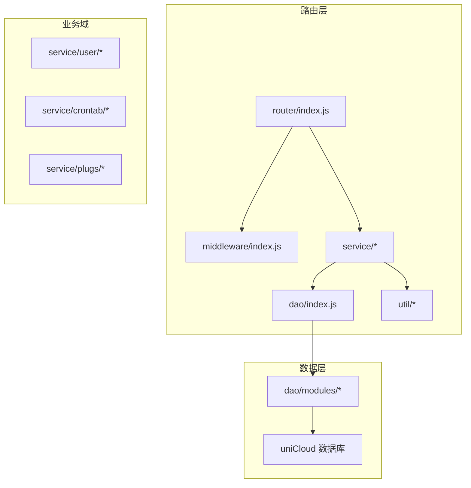
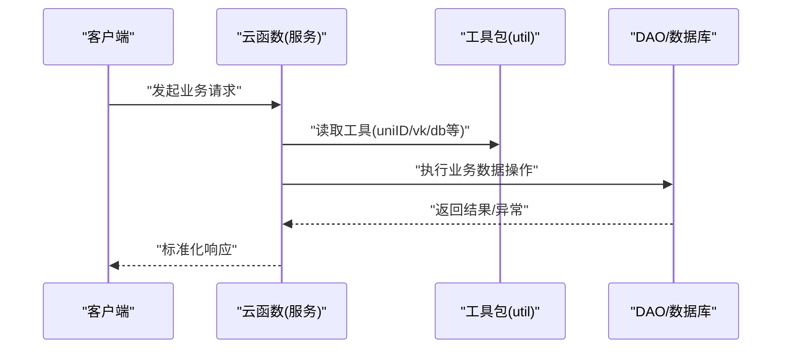
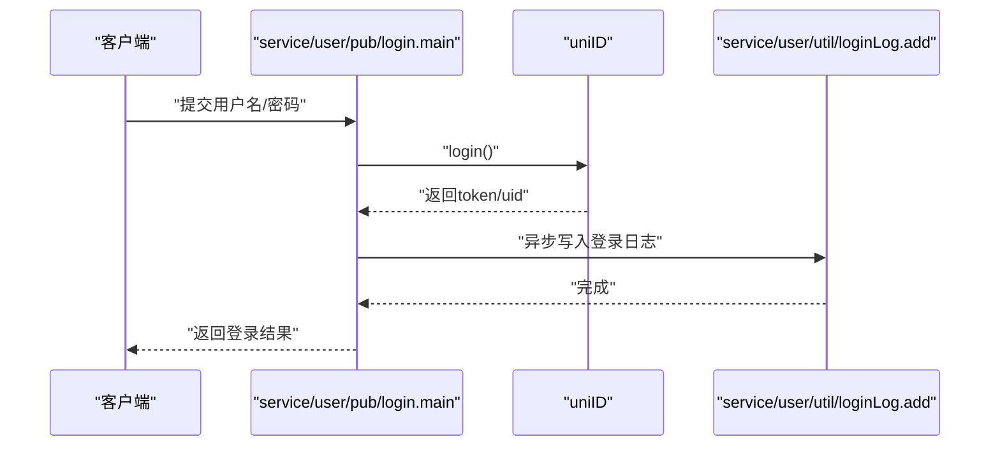
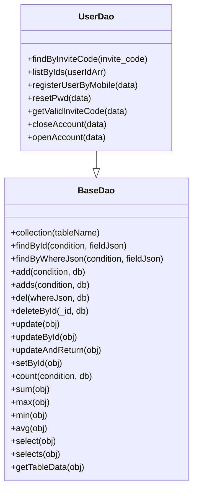
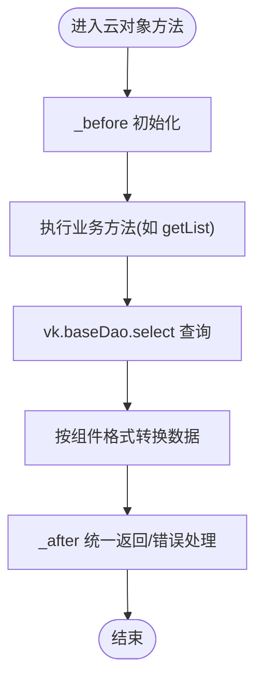
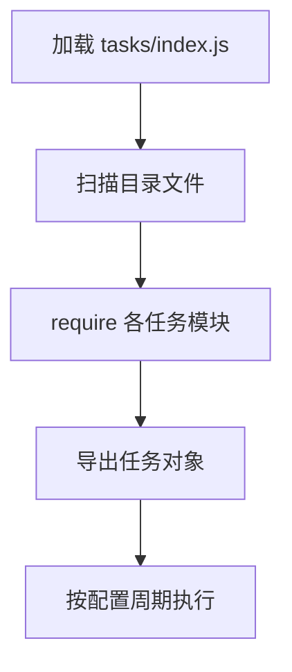
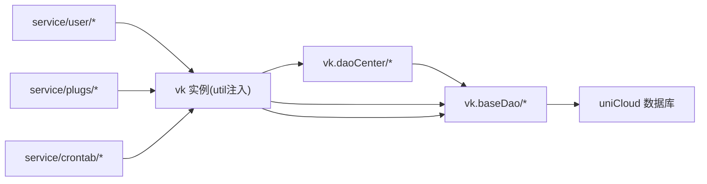

# 服务层架构

<cite>
**本文引用的文件**   
- [checkToken.js](file://uniCloud-aliyun/cloudfunctions/router/service/user/pub/checkToken.js)
- [login.js](file://uniCloud-aliyun/cloudfunctions/router/service/user/pub/login.js)
- [updateUser.js](file://uniCloud-aliyun/cloudfunctions/router/service/user/kh/updateUser.js)
- [userDao.js](file://uniCloud-aliyun/cloudfunctions/router/dao/modules/userDao.js)
- [base.js](file://uniCloud-aliyun/cloudfunctions/router/dao/base.js)
- [index.js（DAO加载）](file://uniCloud-aliyun/cloudfunctions/router/dao/index.js)
- [loginLog.js](file://uniCloud-aliyun/cloudfunctions/router/service/user/util/loginLog.js)
- [pub.js（组件动态插件云对象）](file://uniCloud-aliyun/cloudfunctions/router/service/plugs/components-dynamic/client/pub.js)
- [index.js（定时任务加载）](file://uniCloud-aliyun/cloudfunctions/router/service/crontab/tasks/index.js)
- [taskConfig.js](file://uniCloud-aliyun/cloudfunctions/router/service/crontab/taskConfig.js)
- [timer1.js](file://uniCloud-aliyun/cloudfunctions/router/service/crontab/tasks/timer1.js)
- [timer2.js](file://uniCloud-aliyun/cloudfunctions/router/service/crontab/tasks/timer2.js)
- [pubFunction.js](file://uniCloud-aliyun/cloudfunctions/router/util/pubFunction.js)
- [muban.js](file://uniCloud-aliyun/cloudfunctions/router/service/muban.js)
</cite>

## 目录
1. [简介](#简介)
2. [项目结构](#项目结构)
3. [核心组件](#核心组件)
4. [架构总览](#架构总览)
5. [详细组件分析](#详细组件分析)
6. [依赖分析](#依赖分析)
7. [性能考虑](#性能考虑)
8. [故障排查指南](#故障排查指南)
9. [结论](#结论)
10. [附录](#附录)

## 简介
本文件系统化梳理 uniCloud 云函数路由层的服务架构，重点覆盖业务逻辑层（Service）、数据访问层（DAO）与基础设施（中间件、工具、定时任务、插件云对象）之间的协作关系。文档从模块划分、业务流程封装、数据处理逻辑、服务间依赖与调用模式、异常处理机制等方面展开，并给出开发规范、性能优化策略、可扩展性设计以及测试、监控与调试方法。

## 项目结构
服务层位于 uniCloud-aliyun/cloudfunctions/router 下，采用“按功能域分层 + 按职责分模块”的组织方式：
- service：对外暴露的业务服务函数，按领域划分为 user、plugs、crontab、admin 等
- dao：数据访问层，提供统一的 DAO 基类与具体表的 DAO 类
- middleware：请求拦截与过滤链
- util：通用工具函数
- config：运行时配置
- index.js：路由入口，负责加载服务、中间件与 DAO

图表来源
- [index.js（DAO加载）:1-36](file://uniCloud-aliyun/cloudfunctions/router/dao/index.js#L1-L36)
- [base.js:1-697](file://uniCloud-aliyun/cloudfunctions/router/dao/base.js#L1-L697)

章节来源
- [index.js（DAO加载）:1-36](file://uniCloud-aliyun/cloudfunctions/router/dao/index.js#L1-L36)
- [base.js:1-697](file://uniCloud-aliyun/cloudfunctions/router/dao/base.js#L1-L697)

## 核心组件
- 用户服务（user）
  - 公共接口：登录、Token 校验
  - 客户端接口：修改用户资料
  - 工具：登录日志
- DAO 层（dao）
  - 基类：统一 CRUD、聚合、联表、事务能力
  - 具体 DAO：用户表专用方法
- 插件云对象（plugs/components-dynamic/client）
  - 云对象模式封装，统一前置/后置处理与业务方法
- 定时任务（crontab）
  - 自动加载任务、集中配置、并发控制
- 通用工具（util）
  - 自定义公共函数包

章节来源
- [checkToken.js:1-29](file://uniCloud-aliyun/cloudfunctions/router/service/user/pub/checkToken.js#L1-L29)
- [login.js:1-58](file://uniCloud-aliyun/cloudfunctions/router/service/user/pub/login.js#L1-L58)
- [updateUser.js:1-33](file://uniCloud-aliyun/cloudfunctions/router/service/user/kh/updateUser.js#L1-L33)
- [userDao.js:1-568](file://uniCloud-aliyun/cloudfunctions/router/dao/modules/userDao.js#L1-L568)
- [base.js:1-697](file://uniCloud-aliyun/cloudfunctions/router/dao/base.js#L1-L697)
- [pub.js（组件动态插件云对象）:1-82](file://uniCloud-aliyun/cloudfunctions/router/service/plugs/components-dynamic/client/pub.js#L1-L82)
- [index.js（定时任务加载）:1-17](file://uniCloud-aliyun/cloudfunctions/router/service/crontab/tasks/index.js#L1-L17)
- [taskConfig.js:1-54](file://uniCloud-aliyun/cloudfunctions/router/service/crontab/taskConfig.js#L1-L54)
- [pubFunction.js:1-24](file://uniCloud-aliyun/cloudfunctions/router/util/pubFunction.js#L1-L24)

## 架构总览
服务层采用“云函数 + DAO 基类 + 云对象 + 定时任务 + 中间件”的组合架构：
- 云函数作为服务入口，接收事件参数，注入工具包（util），调用 DAO 或其他服务
- DAO 基类统一封装数据库操作，子类聚焦业务表的特定方法
- 云对象以“_before/_after + 方法集合”的模式封装客户端可调用的业务对象
- 定时任务通过集中配置与自动加载实现可维护的周期性任务
- 中间件提供统一的鉴权、参数校验、错误拦截等横切能力

图表来源
- [login.js:15-56](file://uniCloud-aliyun/cloudfunctions/router/service/user/pub/login.js#L15-L56)
- [base.js:92-150](file://uniCloud-aliyun/cloudfunctions/router/dao/base.js#L92-L150)

## 详细组件分析

### 用户服务（登录、Token 校验、修改资料、登录日志）
- 登录流程
  - 输入用户名/密码与查询字段，调用 uniID.login
  - 成功后异步写入登录日志
- Token 校验
  - 调用 uniID.checkToken，返回 uid、用户信息、角色与权限
- 修改用户资料
  - 限定允许更新字段，组装数据后调用 uniID.updateUser
- 登录日志
  - 读取请求上下文信息，按配置决定是否写入日志表

图表来源
- [login.js:15-56](file://uniCloud-aliyun/cloudfunctions/router/service/user/pub/login.js#L15-L56)
- [loginLog.js:14-60](file://uniCloud-aliyun/cloudfunctions/router/service/user/util/loginLog.js#L14-L60)

章节来源
- [login.js:1-58](file://uniCloud-aliyun/cloudfunctions/router/service/user/pub/login.js#L1-L58)
- [checkToken.js:1-29](file://uniCloud-aliyun/cloudfunctions/router/service/user/pub/checkToken.js#L1-L29)
- [updateUser.js:1-33](file://uniCloud-aliyun/cloudfunctions/router/service/user/kh/updateUser.js#L1-L33)
- [loginLog.js:1-81](file://uniCloud-aliyun/cloudfunctions/router/service/user/util/loginLog.js#L1-L81)

### DAO 层（BaseDao 与 UserDao）
- BaseDao
  - 统一提供 findById/add/del/update/select 等 CRUD 与聚合、联表、事务支持
  - 子类仅需设置 tableName 即可绑定表，减少重复参数
- UserDao
  - 在 BaseDao 基础上扩展用户表专属业务方法，如根据邀请码查询、批量注册/登录、注销/恢复账号、生成唯一邀请码等
  - 默认字段过滤，避免敏感信息泄露

图表来源
- [base.js:11-691](file://uniCloud-aliyun/cloudfunctions/router/dao/base.js#L11-L691)
- [userDao.js:16-565](file://uniCloud-aliyun/cloudfunctions/router/dao/modules/userDao.js#L16-L565)

章节来源
- [base.js:1-697](file://uniCloud-aliyun/cloudfunctions/router/dao/base.js#L1-L697)
- [userDao.js:1-568](file://uniCloud-aliyun/cloudfunctions/router/dao/modules/userDao.js#L1-L568)
- [index.js（DAO加载）:1-36](file://uniCloud-aliyun/cloudfunctions/router/dao/index.js#L1-L36)

### 插件云对象（组件动态）
- 云对象模式
  - _before：初始化 vk、获取工具包
  - _after：统一处理错误与返回值
  - 方法：getList、test 等业务方法
- 数据访问
  - 通过 vk.baseDao/select 执行查询，按组件需求转换数据结构

图表来源
- [pub.js（组件动态插件云对象）:19-78](file://uniCloud-aliyun/cloudfunctions/router/service/plugs/components-dynamic/client/pub.js#L19-L78)

章节来源
- [pub.js（组件动态插件云对象）:1-82](file://uniCloud-aliyun/cloudfunctions/router/service/plugs/components-dynamic/client/pub.js#L1-L82)

### 定时任务（自动加载与配置）
- 自动加载
  - 扫描 tasks 目录，将非 index.js 的 JS 文件作为任务模块加载
- 配置
  - 主函数执行间隔、并发度、任务列表与时间表达式
- 示例任务
  - timer1、timer2 等

图表来源
- [index.js（定时任务加载）:6-15](file://uniCloud-aliyun/cloudfunctions/router/service/crontab/tasks/index.js#L6-L15)
- [taskConfig.js:1-54](file://uniCloud-aliyun/cloudfunctions/router/service/crontab/taskConfig.js#L1-L54)
- [timer1.js:1-14](file://uniCloud-aliyun/cloudfunctions/router/service/crontab/tasks/timer1.js#L1-L14)
- [timer2.js:1-14](file://uniCloud-aliyun/cloudfunctions/router/service/crontab/tasks/timer2.js#L1-L14)

章节来源
- [index.js（定时任务加载）:1-17](file://uniCloud-aliyun/cloudfunctions/router/service/crontab/tasks/index.js#L1-L17)
- [taskConfig.js:1-54](file://uniCloud-aliyun/cloudfunctions/router/service/crontab/taskConfig.js#L1-L54)
- [timer1.js:1-14](file://uniCloud-aliyun/cloudfunctions/router/service/crontab/tasks/timer1.js#L1-L14)
- [timer2.js:1-14](file://uniCloud-aliyun/cloudfunctions/router/service/crontab/tasks/timer2.js#L1-L14)

### 通用工具与模板
- 自定义公共函数包
  - 在 util/pubFunction.js 中扩展公共方法，供服务与 DAO 使用
- 服务模板
  - muban.js 提供标准服务函数骨架，便于快速复制与规范化

章节来源
- [pubFunction.js:1-24](file://uniCloud-aliyun/cloudfunctions/router/util/pubFunction.js#L1-L24)
- [muban.js:1-33](file://uniCloud-aliyun/cloudfunctions/router/service/muban.js#L1-L33)

## 依赖分析
- 服务到 DAO 的依赖
  - 服务函数通过 util 获取 vk 实例，进而使用 vk.daoCenter.* 或 vk.baseDao.* 执行数据库操作
  - UserDao 继承 BaseDao，复用统一能力
- 服务到工具的依赖
  - 服务函数通过 util 获取 uniID、db、_、$、vk、pubFun 等
- 云对象到 DAO 的依赖
  - 云对象方法内部通过 vk.baseDao/select 等执行查询
- 定时任务到 DAO/服务
  - 任务函数可直接使用 vk、db、_、$ 等，也可调用其他服务或 DAO

图表来源
- [login.js:15-56](file://uniCloud-aliyun/cloudfunctions/router/service/user/pub/login.js#L15-L56)
- [pub.js（组件动态插件云对象）:19-78](file://uniCloud-aliyun/cloudfunctions/router/service/plugs/components-dynamic/client/pub.js#L19-L78)
- [base.js:18-49](file://uniCloud-aliyun/cloudfunctions/router/dao/base.js#L18-L49)

章节来源
- [login.js:1-58](file://uniCloud-aliyun/cloudfunctions/router/service/user/pub/login.js#L1-L58)
- [pub.js（组件动态插件云对象）:1-82](file://uniCloud-aliyun/cloudfunctions/router/service/plugs/components-dynamic/client/pub.js#L1-L82)
- [base.js:1-697](file://uniCloud-aliyun/cloudfunctions/router/dao/base.js#L1-L697)

## 性能考虑
- DAO 查询优化
  - 合理使用 whereJson、sortArr、fieldJson 控制查询范围与字段
  - 大量数据时优先 select，必要时使用 selects 并谨慎使用 lastWhereJson/lastSortArr
  - 分页查询时开启 getCount 与 hasMore 精准控制
- 批量操作
  - 批量添加/更新时注意 uniCloud 限制，超过一定规模可考虑分批
- 事务与并发
  - DAO 基类支持传入 db 实例以启用事务，避免跨表操作不一致
  - 定时任务并发度建议控制在合理范围内，避免数据库压力过大
- 云对象
  - _after 中尽量避免重复处理 Error 类型，减少分支开销

章节来源
- [base.js:511-634](file://uniCloud-aliyun/cloudfunctions/router/dao/base.js#L511-L634)
- [taskConfig.js:7-9](file://uniCloud-aliyun/cloudfunctions/router/service/crontab/taskConfig.js#L7-L9)

## 故障排查指南
- 服务函数异常
  - 统一通过中间件与云函数框架捕获，结合日志定位
  - 登录日志服务可辅助追踪登录失败与上下文信息
- DAO 查询异常
  - 检查 whereJson 构造、字段权限与表名映射
  - 使用 debug 模式获取数据库执行耗时
- 定时任务异常
  - 查看任务配置与触发器间隔一致性
  - 通过日志与返回值判断任务执行状态
- 云对象异常
  - 在 _after 中统一处理错误返回，避免抛出原生 Error

章节来源
- [loginLog.js:14-60](file://uniCloud-aliyun/cloudfunctions/router/service/user/util/loginLog.js#L14-L60)
- [base.js:683-691](file://uniCloud-aliyun/cloudfunctions/router/dao/base.js#L683-L691)
- [index.js（定时任务加载）:6-15](file://uniCloud-aliyun/cloudfunctions/router/service/crontab/tasks/index.js#L6-L15)

## 结论
本服务层架构以“云函数 + DAO 基类 + 云对象 + 定时任务 + 中间件”为核心，实现了清晰的职责分离与良好的可扩展性。通过统一工具包与 DAO 基类，服务层专注于业务编排与数据处理；DAO 层屏蔽数据库差异，提供稳定的能力抽象；定时任务与云对象分别覆盖周期性任务与客户端可调用的业务对象。建议在后续演进中持续完善中间件与监控埋点，强化异常治理与性能观测。

## 附录
- 开发规范
  - 服务函数统一遵循 main(event) 模式，明确输入/输出与注释
  - DAO 方法命名与参数保持一致，必要时提供完整/简易两种调用方式
  - 云对象方法统一走 _before/_after 流程
- 测试建议
  - 单元测试：针对 DAO 方法与工具函数编写独立测试
  - 集成测试：通过本地云函数模拟器或云端调试验证服务流程
- 监控与调试
  - 使用登录日志与定时任务日志记录关键路径
  - 启用 DAO debug 模式定位慢查询
  - 通过中间件拦截器记录请求上下文与异常堆栈