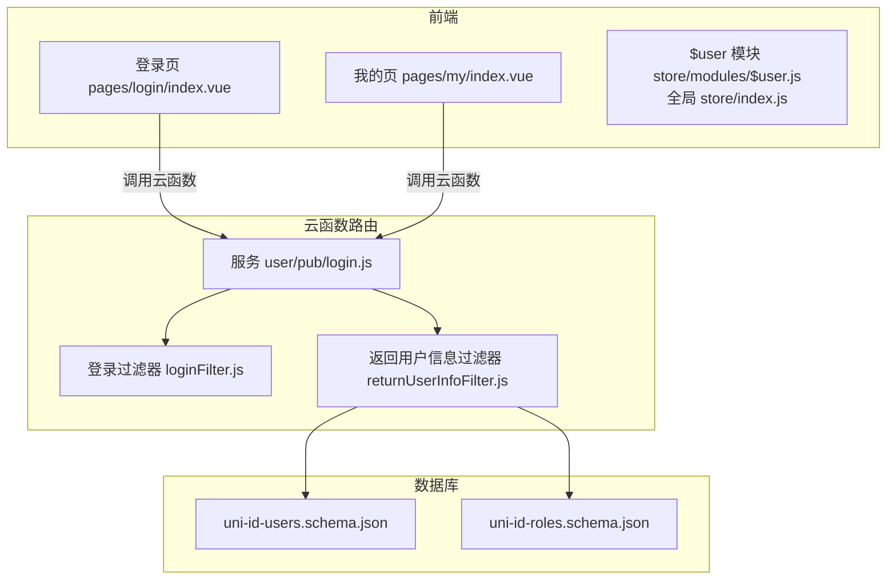
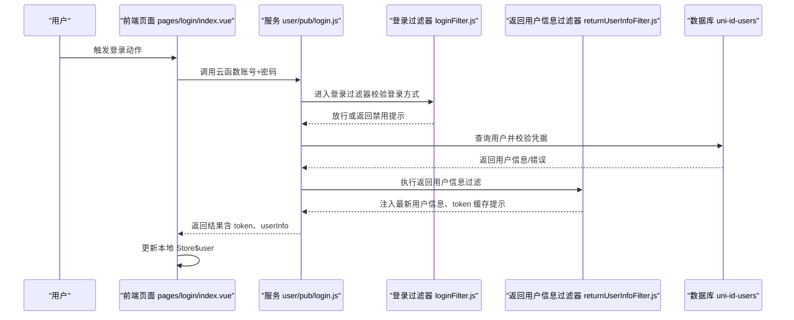
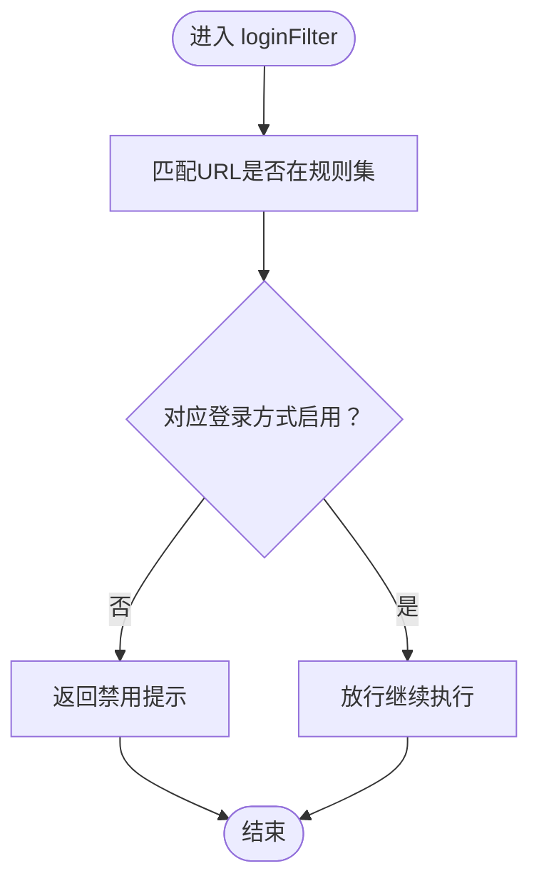
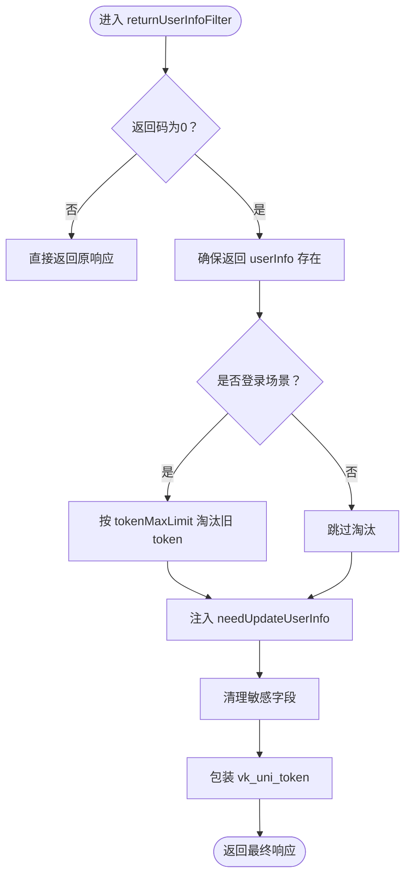
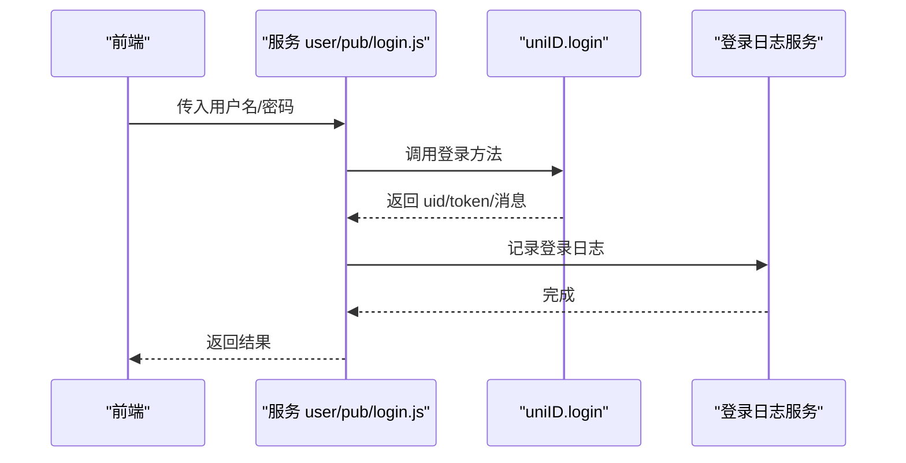
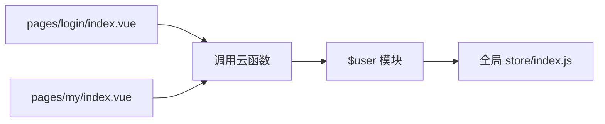
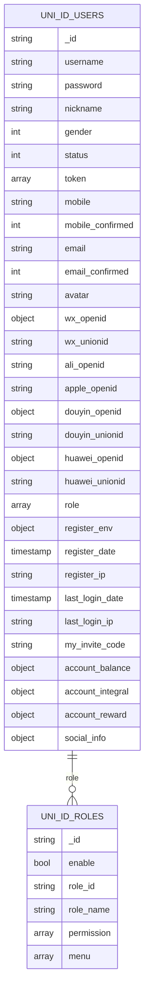
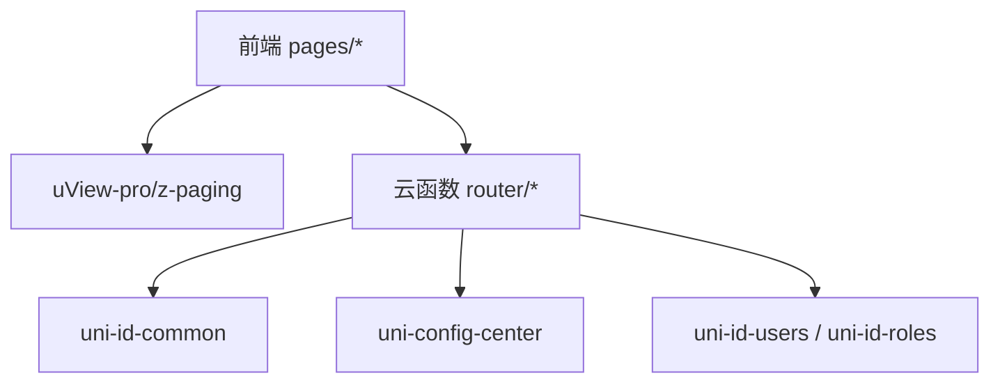

# 用户系统集成

<cite>
**本文引用的文件**
- [uni_modules/uni-id/readme.md](file://uni_modules/uni-id/readme.md)
- [uni_modules/uni-id-common/readme.md](file://uni_modules/uni-id-common/readme.md)
- [uni_modules/uni-config-center/uniCloud/cloudfunctions/common/uni-config-center/uni-id/config.json](file://uni_modules/uni-config-center/uniCloud/cloudfunctions/common/uni-config-center/uni-id/config.json)
- [uni_modules/uni-id-common/package.json](file://uni_modules/uni-id-common/package.json)
- [store/modules/$user.js](file://store/modules/$user.js)
- [store/index.js](file://store/index.js)
- [pages/login/index.vue](file://pages/login/index.vue)
- [pages/my/index.vue](file://pages/my/index.vue)
- [uniCloud-aliyun/cloudfunctions/router/middleware/modules/loginFilter.js](file://uniCloud-aliyun/cloudfunctions/router/middleware/modules/loginFilter.js)
- [uniCloud-aliyun/cloudfunctions/router/middleware/modules/returnUserInfoFilter.js](file://uniCloud-aliyun/cloudfunctions/router/middleware/modules/returnUserInfoFilter.js)
- [uniCloud-aliyun/cloudfunctions/router/service/user/pub/login.js](file://uniCloud-aliyun/cloudfunctions/router/service/user/pub/login.js)
- [uniCloud-aliyun/database/uni-id-users.schema.json](file://uniCloud-aliyun/database/uni-id-users.schema.json)
- [uniCloud-aliyun/database/uni-id-roles.schema.json](file://uniCloud-aliyun/database/uni-id-roles.schema.json)
</cite>

## 目录
1. [简介](#简介)
2. [项目结构](#项目结构)
3. [核心组件](#核心组件)
4. [架构总览](#架构总览)
5. [详细组件分析](#详细组件分析)
6. [依赖分析](#依赖分析)
7. [性能考虑](#性能考虑)
8. [故障排查指南](#故障排查指南)
9. [结论](#结论)
10. [附录](#附录)

## 简介
本文件面向“用户系统集成”的目标，围绕 uni-id 用户体系在本项目的落地实践，系统性梳理认证、权限与会话处理的关键路径，覆盖登录过滤器、用户信息返回机制、权限控制策略、注册/登录/密码管理等核心能力，并给出数据模型、中间件配置与安全策略说明，以及扩展与第三方登录集成指引。

## 项目结构
本项目采用“前端页面 + uniCloud 云函数路由 + 数据库 Schema”三层结构：
- 前端层：页面组件负责用户交互与调用云函数；Vuex Store 负责用户态状态持久化。
- 云函数路由层：中间件统一拦截与处理登录/注册、返回用户信息、权限与会话策略。
- 数据层：uni-id-users、uni-id-roles 等 Schema 定义用户与角色权限的数据结构。

图表来源
- [pages/login/index.vue:1-295](file://pages/login/index.vue#L1-L295)
- [pages/my/index.vue:1-720](file://pages/my/index.vue#L1-L720)
- [store/modules/$user.js:1-26](file://store/modules/$user.js#L1-L26)
- [store/index.js:1-136](file://store/index.js#L1-L136)
- [uniCloud-aliyun/cloudfunctions/router/middleware/modules/loginFilter.js:1-53](file://uniCloud-aliyun/cloudfunctions/router/middleware/modules/loginFilter.js#L1-L53)
- [uniCloud-aliyun/cloudfunctions/router/middleware/modules/returnUserInfoFilter.js:1-93](file://uniCloud-aliyun/cloudfunctions/router/middleware/modules/returnUserInfoFilter.js#L1-L93)
- [uniCloud-aliyun/cloudfunctions/router/service/user/pub/login.js:1-58](file://uniCloud-aliyun/cloudfunctions/router/service/user/pub/login.js#L1-L58)
- [uniCloud-aliyun/database/uni-id-users.schema.json:1-478](file://uniCloud-aliyun/database/uni-id-users.schema.json#L1-L478)
- [uniCloud-aliyun/database/uni-id-roles.schema.json:1-67](file://uniCloud-aliyun/database/uni-id-roles.schema.json#L1-L67)

章节来源
- [pages/login/index.vue:1-295](file://pages/login/index.vue#L1-L295)
- [pages/my/index.vue:1-720](file://pages/my/index.vue#L1-L720)
- [store/modules/$user.js:1-26](file://store/modules/$user.js#L1-L26)
- [store/index.js:1-136](file://store/index.js#L1-L136)
- [uniCloud-aliyun/cloudfunctions/router/middleware/modules/loginFilter.js:1-53](file://uniCloud-aliyun/cloudfunctions/router/middleware/modules/loginFilter.js#L1-L53)
- [uniCloud-aliyun/cloudfunctions/router/middleware/modules/returnUserInfoFilter.js:1-93](file://uniCloud-aliyun/cloudfunctions/router/middleware/modules/returnUserInfoFilter.js#L1-L93)
- [uniCloud-aliyun/cloudfunctions/router/service/user/pub/login.js:1-58](file://uniCloud-aliyun/cloudfunctions/router/service/user/pub/login.js#L1-L58)
- [uniCloud-aliyun/database/uni-id-users.schema.json:1-478](file://uniCloud-aliyun/database/uni-id-users.schema.json#L1-L478)
- [uniCloud-aliyun/database/uni-id-roles.schema.json:1-67](file://uniCloud-aliyun/database/uni-id-roles.schema.json#L1-L67)

## 核心组件
- 登录过滤器：在用户登录/注册前按规则启用/禁用特定登录方式，统一拦截。
- 返回用户信息过滤器：在登录/注册/绑定/解绑/更新等操作后，返回最新用户信息与 token 缓存提示，确保前后端一致。
- 用户服务：封装账号密码登录等核心业务。
- 前端 Store：维护用户信息、权限、邀请码等状态，并提供获取用户信息的动作。
- 配置中心：集中管理 token 过期、最大并发 token 数、第三方登录 OAuth 等安全与行为参数。
- 数据模型：uni-id-users、uni-id-roles 定义用户与角色权限字段及约束。

章节来源
- [uniCloud-aliyun/cloudfunctions/router/middleware/modules/loginFilter.js:1-53](file://uniCloud-aliyun/cloudfunctions/router/middleware/modules/loginFilter.js#L1-L53)
- [uniCloud-aliyun/cloudfunctions/router/middleware/modules/returnUserInfoFilter.js:1-93](file://uniCloud-aliyun/cloudfunctions/router/middleware/modules/returnUserInfoFilter.js#L1-L93)
- [uniCloud-aliyun/cloudfunctions/router/service/user/pub/login.js:1-58](file://uniCloud-aliyun/cloudfunctions/router/service/user/pub/login.js#L1-L58)
- [store/modules/$user.js:1-26](file://store/modules/$user.js#L1-L26)
- [uni_modules/uni-config-center/uniCloud/cloudfunctions/common/uni-config-center/uni-id/config.json:1-71](file://uni_modules/uni-config-center/uniCloud/cloudfunctions/common/uni-config-center/uni-id/config.json#L1-L71)
- [uniCloud-aliyun/database/uni-id-users.schema.json:1-478](file://uniCloud-aliyun/database/uni-id-users.schema.json#L1-L478)
- [uniCloud-aliyun/database/uni-id-roles.schema.json:1-67](file://uniCloud-aliyun/database/uni-id-roles.schema.json#L1-L67)

## 架构总览
下图展示了从前端到云函数再到数据库的典型登录流程，以及中间件如何参与请求生命周期。

图表来源
- [pages/login/index.vue:1-295](file://pages/login/index.vue#L1-L295)
- [uniCloud-aliyun/cloudfunctions/router/middleware/modules/loginFilter.js:1-53](file://uniCloud-aliyun/cloudfunctions/router/middleware/modules/loginFilter.js#L1-L53)
- [uniCloud-aliyun/cloudfunctions/router/middleware/modules/returnUserInfoFilter.js:1-93](file://uniCloud-aliyun/cloudfunctions/router/middleware/modules/returnUserInfoFilter.js#L1-L93)
- [uniCloud-aliyun/cloudfunctions/router/service/user/pub/login.js:1-58](file://uniCloud-aliyun/cloudfunctions/router/service/user/pub/login.js#L1-L58)
- [uniCloud-aliyun/database/uni-id-users.schema.json:1-478](file://uniCloud-aliyun/database/uni-id-users.schema.json#L1-L478)

## 详细组件分析

### 登录过滤器（loginFilter）
- 作用：在登录/注册前，基于预设规则启用/禁用特定登录方式，避免未开放或风险较高的登录通道。
- 关键点：
  - 规则集合包含多种登录/注册入口（短信登录、一键登录、邮箱登录、第三方登录等）。
  - 通过正则匹配目标 URL，确保在合适的时机执行。
  - 通过 index 值保证在用户登录检测之后执行，避免重复校验。
- 影响范围：所有 user/pub 与 user/kh 下的登录/注册/绑定/解绑/更新等接口。

图表来源
- [uniCloud-aliyun/cloudfunctions/router/middleware/modules/loginFilter.js:1-53](file://uniCloud-aliyun/cloudfunctions/router/middleware/modules/loginFilter.js#L1-L53)

章节来源
- [uniCloud-aliyun/cloudfunctions/router/middleware/modules/loginFilter.js:1-53](file://uniCloud-aliyun/cloudfunctions/router/middleware/modules/loginFilter.js#L1-L53)

### 返回用户信息过滤器（returnUserInfoFilter）
- 作用：在登录/注册/绑定/解绑/更新等操作后，确保前端始终持有最新用户信息与 token 缓存提示，提升一致性与体验。
- 关键点：
  - 自动注入 needUpdateUserInfo 标记，提示前端刷新缓存。
  - 对返回的 userInfo 做字段清理（如剔除敏感字段），避免泄露。
  - 对返回的 token 与过期时间包装为 vk_uni_token，便于前端自动缓存。
  - 登录场景下，根据 tokenMaxLimit 控制同一用户持有的 token 数量，淘汰旧 token。
- 影响范围：user/pub、user/kh、client/user/pub 等相关接口。

图表来源
- [uniCloud-aliyun/cloudfunctions/router/middleware/modules/returnUserInfoFilter.js:1-93](file://uniCloud-aliyun/cloudfunctions/router/middleware/modules/returnUserInfoFilter.js#L1-L93)

章节来源
- [uniCloud-aliyun/cloudfunctions/router/middleware/modules/returnUserInfoFilter.js:1-93](file://uniCloud-aliyun/cloudfunctions/router/middleware/modules/returnUserInfoFilter.js#L1-L93)

### 用户服务（以账号密码登录为例）
- 作用：封装登录业务逻辑，调用 uniID.login 完成认证，并记录登录日志。
- 关键点：
  - 支持多种查询字段（用户名/邮箱/手机号），增强可用性。
  - 根据返回类型设置友好消息（登录/注册成功）。
  - 记录登录日志，便于审计与追踪。

图表来源
- [uniCloud-aliyun/cloudfunctions/router/service/user/pub/login.js:1-58](file://uniCloud-aliyun/cloudfunctions/router/service/user/pub/login.js#L1-L58)

章节来源
- [uniCloud-aliyun/cloudfunctions/router/service/user/pub/login.js:1-58](file://uniCloud-aliyun/cloudfunctions/router/service/user/pub/login.js#L1-L58)

### 前端用户状态与页面交互
- Store（$user）：持久化用户信息、权限、邀请码等，提供获取用户信息的动作。
- 全局 Store：统一管理模块、持久化策略与公共 mutations。
- 登录页：处理用户协议授权、一键登录流程、缓存 token 与跳转。
- 我的页：展示与编辑用户相关信息（如车辆信息、隐私设置等）。

图表来源
- [pages/login/index.vue:1-295](file://pages/login/index.vue#L1-L295)
- [pages/my/index.vue:1-720](file://pages/my/index.vue#L1-L720)
- [store/modules/$user.js:1-26](file://store/modules/$user.js#L1-L26)
- [store/index.js:1-136](file://store/index.js#L1-L136)

章节来源
- [store/modules/$user.js:1-26](file://store/modules/$user.js#L1-L26)
- [store/index.js:1-136](file://store/index.js#L1-L136)
- [pages/login/index.vue:1-295](file://pages/login/index.vue#L1-L295)
- [pages/my/index.vue:1-720](file://pages/my/index.vue#L1-L720)

### 数据模型与权限
- 用户模型（uni-id-users）：包含基础字段（用户名、邮箱、手机号、头像）、认证状态、第三方 openid/unionid、角色/权限关联、注册与登录环境信息、账户资产等。
- 角色模型（uni-id-roles）：包含角色标识、角色名、权限列表、菜单列表、启用状态等。

图表来源
- [uniCloud-aliyun/database/uni-id-users.schema.json:1-478](file://uniCloud-aliyun/database/uni-id-users.schema.json#L1-L478)
- [uniCloud-aliyun/database/uni-id-roles.schema.json:1-67](file://uniCloud-aliyun/database/uni-id-roles.schema.json#L1-L67)

章节来源
- [uniCloud-aliyun/database/uni-id-users.schema.json:1-478](file://uniCloud-aliyun/database/uni-id-users.schema.json#L1-L478)
- [uniCloud-aliyun/database/uni-id-roles.schema.json:1-67](file://uniCloud-aliyun/database/uni-id-roles.schema.json#L1-L67)

### 安全策略与配置
- 配置中心（uni-id/config.json）：集中管理密码/Token 密钥、过期时间、最大并发 token 数、密码错误次数与重试时间、设备绑定策略、平台偏好、OAuth 凭证、短信/聚合认证服务参数等。
- uni-id 文档要点：支持在 token 中缓存角色与权限，显著降低 checkToken 时的数据库查询成本；可通过配置关闭该特性以满足特定安全需求。

章节来源
- [uni_modules/uni-config-center/uniCloud/cloudfunctions/common/uni-config-center/uni-id/config.json:1-71](file://uni_modules/uni-config-center/uniCloud/cloudfunctions/common/uni-config-center/uni-id/config.json#L1-L71)
- [uni_modules/uni-id/readme.md:1-33](file://uni_modules/uni-id/readme.md#L1-L33)

## 依赖分析
- 前端依赖：
  - uni-id-common：提供 token 生成、校验、刷新等通用能力（云函数侧）。
  - uView-pro、z-paging 等 UI 组件库。
- 云函数依赖：
  - uni-id-common：统一 token 处理。
  - uni-config-center：读取 uni-id 配置。
  - vk-unicloud：项目内部封装（如 vk.callFunction、vk.vuex 等）。
- 数据库依赖：
  - uni-id-users、uni-id-roles：用户与角色权限数据结构。

图表来源
- [uni_modules/uni-id-common/package.json:1-101](file://uni_modules/uni-id-common/package.json#L1-L101)
- [uni_modules/uni-config-center/uniCloud/cloudfunctions/common/uni-config-center/uni-id/config.json:1-71](file://uni_modules/uni-config-center/uniCloud/cloudfunctions/common/uni-config-center/uni-id/config.json#L1-L71)
- [uniCloud-aliyun/database/uni-id-users.schema.json:1-478](file://uniCloud-aliyun/database/uni-id-users.schema.json#L1-L478)
- [uniCloud-aliyun/database/uni-id-roles.schema.json:1-67](file://uniCloud-aliyun/database/uni-id-roles.schema.json#L1-L67)

章节来源
- [uni_modules/uni-id-common/package.json:1-101](file://uni_modules/uni-id-common/package.json#L1-L101)
- [uni_modules/uni-id-common/readme.md:1-3](file://uni_modules/uni-id-common/readme.md#L1-L3)
- [uni_modules/uni-config-center/uniCloud/cloudfunctions/common/uni-config-center/uni-id/config.json:1-71](file://uni_modules/uni-config-center/uniCloud/cloudfunctions/common/uni-config-center/uni-id/config.json#L1-L71)
- [uniCloud-aliyun/database/uni-id-users.schema.json:1-478](file://uniCloud-aliyun/database/uni-id-users.schema.json#L1-L478)
- [uniCloud-aliyun/database/uni-id-roles.schema.json:1-67](file://uniCloud-aliyun/database/uni-id-roles.schema.json#L1-L67)

## 性能考虑
- Token 缓存角色/权限：通过在 token 中缓存角色与权限，可显著减少 checkToken 时的数据库查询次数，提高响应速度。
- tokenMaxLimit：限制同一用户持有的 token 数量，避免无限增长导致的存储与查询压力。
- 平台偏好与 OAuth：合理配置 preferedAppPlatform、preferedWebPlatform 与各平台 OAuth 凭证，减少跨平台适配成本。
- 建议：
  - 在高并发场景下，优先启用 token 缓存角色/权限，并缩短 token 过期时间以降低权限陈旧影响。
  - 对频繁变更的用户信息，结合返回用户信息过滤器的 needUpdateUserInfo 提示，确保前端及时刷新。

## 故障排查指南
- 登录被禁用：检查 loginFilter 的规则集合，确认目标登录方式是否启用。
- 无法获取最新用户信息：确认 returnUserInfoFilter 是否正确注入 needUpdateUserInfo，并检查前端是否按提示刷新 Store。
- token 数量异常增长：检查 tokenMaxLimit 配置与淘汰逻辑是否生效。
- 第三方登录失败：核对 uni-config-center 中对应平台的 OAuth 凭证是否正确配置。
- 权限判断异常：若启用了 token 内缓存角色/权限，注意 token 未过期前权限更新可能滞后；必要时缩短过期时间或在 admin 角色场景下额外判断。

章节来源
- [uniCloud-aliyun/cloudfunctions/router/middleware/modules/loginFilter.js:1-53](file://uniCloud-aliyun/cloudfunctions/router/middleware/modules/loginFilter.js#L1-L53)
- [uniCloud-aliyun/cloudfunctions/router/middleware/modules/returnUserInfoFilter.js:1-93](file://uniCloud-aliyun/cloudfunctions/router/middleware/modules/returnUserInfoFilter.js#L1-L93)
- [uni_modules/uni-config-center/uniCloud/cloudfunctions/common/uni-config-center/uni-id/config.json:1-71](file://uni_modules/uni-config-center/uniCloud/cloudfunctions/common/uni-config-center/uni-id/config.json#L1-L71)
- [uni_modules/uni-id/readme.md:1-33](file://uni_modules/uni-id/readme.md#L1-L33)

## 结论
本项目基于 uni-id 在前端与云函数路由层实现了标准化的用户认证、权限与会话处理流程。通过登录过滤器与返回用户信息过滤器，确保登录入口可控、用户信息一致；借助配置中心与数据模型，形成可扩展的安全策略与权限体系。建议在生产环境中启用 token 缓存角色/权限、合理设置 tokenMaxLimit，并完善第三方登录与日志审计能力。

## 附录

### 用户系统扩展与自定义字段
- 自定义字段：可在用户模型中新增业务所需字段，遵循 Schema 约束与默认值策略，避免破坏现有权限/角色关联。
- 扩展接口：在 user/kh 或 client/user 下新增业务接口时，建议复用返回用户信息过滤器，确保前端缓存一致性。

章节来源
- [uniCloud-aliyun/database/uni-id-users.schema.json:1-478](file://uniCloud-aliyun/database/uni-id-users.schema.json#L1-L478)

### 第三方登录集成指南
- 配置 OAuth 凭证：在 uni-config-center 的对应平台段落填写 appid/appsecret 或 privateKey 等参数。
- 开启登录方式：在 loginFilter 的规则集合中启用相应登录方式。
- 前端调用：在登录页或公共登录流程中调用对应云函数接口完成登录。

章节来源
- [uni_modules/uni-config-center/uniCloud/cloudfunctions/common/uni-config-center/uni-id/config.json:1-71](file://uni_modules/uni-config-center/uniCloud/cloudfunctions/common/uni-config-center/uni-id/config.json#L1-L71)
- [uniCloud-aliyun/cloudfunctions/router/middleware/modules/loginFilter.js:1-53](file://uniCloud-aliyun/cloudfunctions/router/middleware/modules/loginFilter.js#L1-L53)