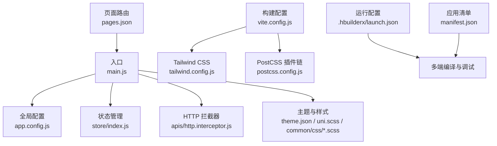
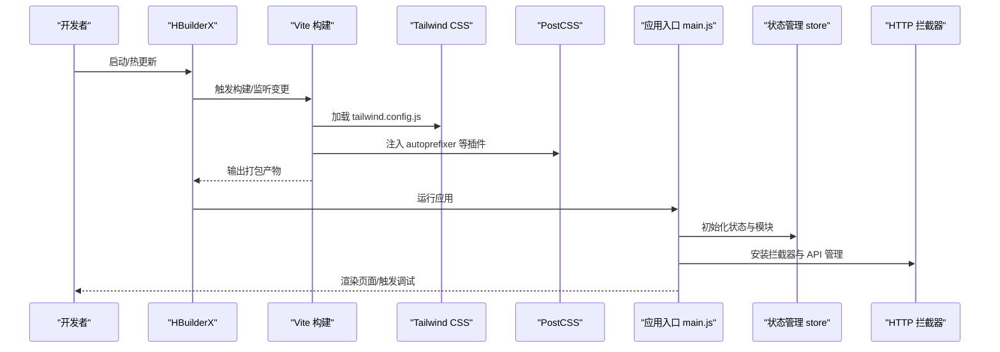
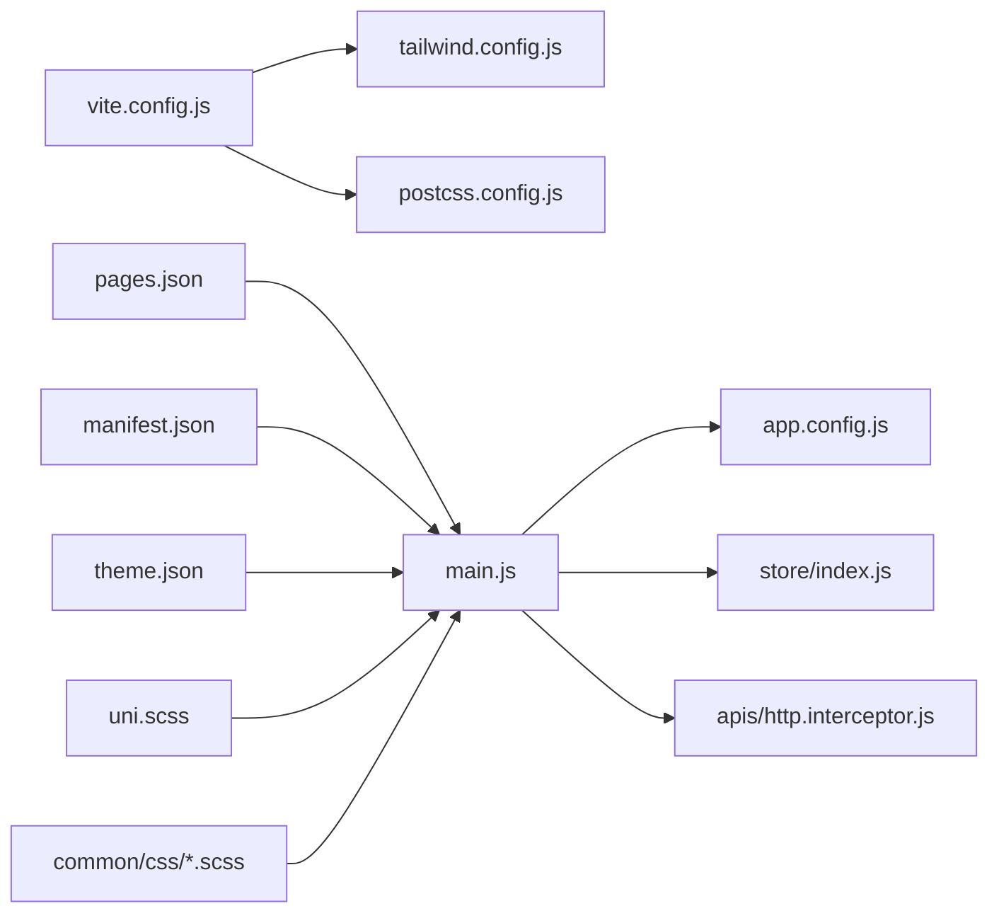

# 开发工具与技巧

<cite>
**本文引用的文件**
- [package.json](file://package.json)
- [vite.config.js](file://vite.config.js)
- [postcss.config.js](file://postcss.config.js)
- [tailwind.config.js](file://tailwind.config.js)
- [.prettierrc](file://.prettierrc)
- [manifest.json](file://manifest.json)
- [pages.json](file://pages.json)
- [main.js](file://main.js)
- [app.config.js](file://app.config.js)
- [.hbuilderx/launch.json](file://.hbuilderx/launch.json)
- [uni.scss](file://uni.scss)
- [common/css/uni.scss](file://common/css/uni.scss)
- [common/css/core.scss](file://common/css/core.scss)
- [theme.json](file://theme.json)
- [store/index.js](file://store/index.js)
- [apis/http.interceptor.js](file://apis/http.interceptor.js)
</cite>

## 目录
1. [简介](#简介)
2. [项目结构](#项目结构)
3. [核心组件](#核心组件)
4. [架构总览](#架构总览)
5. [详细组件分析](#详细组件分析)
6. [依赖关系分析](#依赖关系分析)
7. [性能考虑](#性能考虑)
8. [故障排查指南](#故障排查指南)
9. [结论](#结论)
10. [附录](#附录)

## 简介
本指南面向“挪车助手”项目的开发者，聚焦于以下目标：
- HBuilderX 开发环境使用、调试与性能优化
- Vite 构建配置、PostCSS 样式处理与 Tailwind CSS 集成
- 代码规范、ESLint/Prettier 配置与 Git 提交规范建议
- 开发效率提升技巧、常用快捷键与工作流优化
- 常见问题的定位与调试方法

## 项目结构
该项目基于 uni-app/Vue 3 技术栈，采用多端统一开发（H5、App、小程序），并集成了 uView Pro 组件库、vk-unicloud 前端框架、Tailwind CSS 与 PostCSS 工具链。

图表来源
- [main.js:1-49](file://main.js#L1-L49)
- [app.config.js:1-111](file://app.config.js#L1-L111)
- [store/index.js:1-136](file://store/index.js#L1-L136)
- [apis/http.interceptor.js:1-116](file://apis/http.interceptor.js#L1-L116)
- [vite.config.js:1-58](file://vite.config.js#L1-L58)
- [tailwind.config.js:1-42](file://tailwind.config.js#L1-L42)
- [postcss.config.js:1-28](file://postcss.config.js#L1-L28)
- [.hbuilderx/launch.json:1-37](file://.hbuilderx/launch.json#L1-L37)
- [manifest.json:1-271](file://manifest.json#L1-L271)
- [pages.json:1-87](file://pages.json#L1-L87)

章节来源
- [main.js:1-49](file://main.js#L1-L49)
- [pages.json:1-87](file://pages.json#L1-L87)
- [manifest.json:1-271](file://manifest.json#L1-L271)

## 核心组件
- 应用入口与初始化
  - 创建应用实例、注册 uView Pro 主题、引入 vk-unicloud 前端框架、挂载 store、安装 HTTP 拦截器与 API 管理模块。
- 全局配置
  - 统一配置调试开关、默认分页大小、登录策略、静态资源域名、云存储方案、错误码映射与拦截器行为。
- 状态管理
  - 自动扫描 modules 目录，支持多端（Vue2/Vue3）加载；提供通用 updateStore mutation 与本地持久化。
- HTTP 拦截器
  - 统一注入 Authorization、时间戳与客户端平台信息；按业务码分类处理错误并弹窗提示，支持复制错误摘要至剪贴板。
- 样式与主题
  - 使用 theme.json 定义明/暗两套主题色值；通过 uni.scss 与 common/css/*.scss 定义变量与基础样式；Tailwind CSS 用于类名驱动的快速布局与主题色扩展。

章节来源
- [main.js:1-49](file://main.js#L1-L49)
- [app.config.js:1-111](file://app.config.js#L1-L111)
- [store/index.js:1-136](file://store/index.js#L1-L136)
- [apis/http.interceptor.js:1-116](file://apis/http.interceptor.js#L1-L116)
- [theme.json:1-29](file://theme.json#L1-L29)
- [uni.scss:1-14](file://uni.scss#L1-L14)
- [common/css/uni.scss:1-39](file://common/css/uni.scss#L1-L39)
- [common/css/core.scss:1-17](file://common/css/core.scss#L1-L17)

## 架构总览
下图展示从入口到构建、样式与调试的关键交互：

图表来源
- [vite.config.js:1-58](file://vite.config.js#L1-L58)
- [tailwind.config.js:1-42](file://tailwind.config.js#L1-L42)
- [postcss.config.js:1-28](file://postcss.config.js#L1-L28)
- [main.js:1-49](file://main.js#L1-L49)
- [store/index.js:1-136](file://store/index.js#L1-L136)
- [apis/http.interceptor.js:1-116](file://apis/http.interceptor.js#L1-L116)

## 详细组件分析

### HBuilderX 开发环境与调试
- 多端调试配置
  - 通过 .hbuilderx/launch.json 预设本地/远程调试类型与 playground 类型，支持 App（iOS/Android）、H5、小程序等多端。
- 运行与编译
  - 借助 @dcloudio/vite-plugin-uni 与 weapp-tailwindcss/vite 插件实现多端编译与小程序端 Tailwind CSS 支持。
- 性能优化建议
  - 合理使用 devServer 配置（如禁用 host 校验、关闭 https）以加速 H5 开发；按需开启 Vue DevTools。
  - 对大体量页面采用懒加载与分包策略（结合 pages.json 与 manifest.json 的分包/模块配置）。

章节来源
- [.hbuilderx/launch.json:1-37](file://.hbuilderx/launch.json#L1-L37)
- [manifest.json:1-271](file://manifest.json#L1-L271)
- [pages.json:1-87](file://pages.json#L1-L87)

### Vite 构建配置
- 关键插件
  - 自动页面 JSON 生成、代码检查器、weapp-tailwindcss、AutoImport、@uni-ku/root、@dcloudio/vite-plugin-uni。
- 平台差异化
  - H5 与 App 平台默认禁用 weapp-tailwindcss，避免不必要的转换。
- CSS 处理
  - 通过 css.postcss.plugins 显式加载 tailwindcss 与 autoprefixer，并指定 tailwind.config.js 的绝对路径。

章节来源
- [vite.config.js:1-58](file://vite.config.js#L1-L58)

### PostCSS 样式处理
- 当前仓库注释掉的配置展示了 px 转 rpx 的思路（designWidth、deviceRatio），可按设计稿宽度灵活配置。
- 实际生效的样式链由 Vite 的 css.postcss.plugins 提供，确保 Tailwind 与 Autoprefixer 的正确顺序。

章节来源
- [postcss.config.js:1-28](file://postcss.config.js#L1-L28)
- [vite.config.js:46-56](file://vite.config.js#L46-L56)

### Tailwind CSS 集成
- 内容扫描
  - content 指向 pages 与 uni_modules/uview-pro 组件目录，确保按需生成类名。
- 主题色扩展
  - 通过 theme.extend.colors 使用 CSS 变量，与 theme.json 的明/暗主题联动。
- 平台适配
  - 在 H5/App 平台禁用 weapp-tailwindcss，仅在小程序平台启用 rem/rpx 转换。

章节来源
- [tailwind.config.js:1-42](file://tailwind.config.js#L1-L42)
- [theme.json:1-29](file://theme.json#L1-L29)
- [vite.config.js:28-33](file://vite.config.js#L28-L33)

### 样式体系与主题
- 主题变量
  - theme.json 定义明/暗两套主题色值，配合 pages.json 的全局样式与导航栏配置。
- SCSS 变量与基础样式
  - uni.scss 引入 uView Pro 主题与自定义样式；common/css/uni.scss 定义字体、尺寸、间距、圆角等变量；core.scss 提供页面容器与安全区适配。
- 类名驱动与组件化
  - 结合 uView Pro 组件与 Tailwind 类名，实现一致的视觉与交互体验。

章节来源
- [theme.json:1-29](file://theme.json#L1-L29)
- [uni.scss:1-14](file://uni.scss#L1-L14)
- [common/css/uni.scss:1-39](file://common/css/uni.scss#L1-L39)
- [common/css/core.scss:1-17](file://common/css/core.scss#L1-L17)
- [pages.json:71-87](file://pages.json#L71-L87)

### 应用入口与全局配置
- 入口初始化
  - main.js 中注册 uView Pro 主题、vk-unicloud 前端框架、store、API 管理与 HTTP 拦截器。
- 全局配置
  - app.config.js 提供调试开关、默认分页、登录策略、静态资源、云存储、错误码映射与拦截器行为。

章节来源
- [main.js:1-49](file://main.js#L1-L49)
- [app.config.js:1-111](file://app.config.js#L1-L111)

### 状态管理（Vuex）
- 自动模块加载
  - store/index.js 支持 Vue2/Vue3 的模块自动扫描与命名空间合并。
- 本地持久化
  - 通过 updateStore 与本地 lifeData 存储，实现跨会话的状态保留（除特殊键外）。

章节来源
- [store/index.js:1-136](file://store/index.js#L1-L136)

### HTTP 拦截器
- 请求阶段
  - 注入 Authorization、时间戳与平台信息。
- 响应阶段
  - 按业务码分类处理：失败、成功、未登录、无权限、服务器错误；统一弹窗提示并支持复制错误摘要。
- 可扩展性
  - 通过 app.config.js 的 interceptor 回调可进一步定制登录与失败处理逻辑。

章节来源
- [apis/http.interceptor.js:1-116](file://apis/http.interceptor.js#L1-L116)
- [app.config.js:101-110](file://app.config.js#L101-L110)

## 依赖关系分析
- 构建与样式
  - vite.config.js 依赖 tailwind.config.js 与 postcss.config.js；weapp-tailwindcss 仅在小程序平台启用。
- 运行与配置
  - main.js 依赖 app.config.js、store/index.js、apis/http.interceptor.js；pages.json 与 manifest.json 影响页面与多端能力。
- 主题与样式
  - theme.json 与 uni.scss、common/css/*.scss 共同决定最终视觉表现。

图表来源
- [vite.config.js:1-58](file://vite.config.js#L1-L58)
- [tailwind.config.js:1-42](file://tailwind.config.js#L1-L42)
- [postcss.config.js:1-28](file://postcss.config.js#L1-L28)
- [main.js:1-49](file://main.js#L1-L49)
- [app.config.js:1-111](file://app.config.js#L1-L111)
- [store/index.js:1-136](file://store/index.js#L1-L136)
- [apis/http.interceptor.js:1-116](file://apis/http.interceptor.js#L1-L116)
- [pages.json:1-87](file://pages.json#L1-L87)
- [manifest.json:1-271](file://manifest.json#L1-L271)
- [theme.json:1-29](file://theme.json#L1-L29)
- [uni.scss:1-14](file://uni.scss#L1-L14)
- [common/css/uni.scss:1-39](file://common/css/uni.scss#L1-L39)
- [common/css/core.scss:1-17](file://common/css/core.scss#L1-L17)

章节来源
- [vite.config.js:1-58](file://vite.config.js#L1-L58)
- [main.js:1-49](file://main.js#L1-L49)

## 性能考虑
- 构建与打包
  - 合理拆分页面与模块，减少首屏体积；对非关键页面采用懒加载；在 H5/App 平台禁用小程序专用插件以降低构建成本。
- 样式体积控制
  - Tailwind content 范围精确到实际使用的 pages 与组件目录，避免生成冗余类名。
- 运行时优化
  - 使用 AutoImport 减少重复导入；合理设置 store 的持久化范围，避免存储过大对象。
- 调试与热更新
  - H5 开发时可关闭 https 与 host 校验，提升热更新速度；必要时开启 Vue DevTools 定位渲染问题。

## 故障排查指南
- 登录态失效
  - HTTP 拦截器对 401 做出统一处理，建议在业务层捕获并引导跳转登录页。
- 错误信息定位
  - 拦截器支持复制错误摘要至剪贴板，便于快速反馈与复现。
- 页面跳转与登录校验
  - app.config.js 的 checkTokenPages 提供多种模式与白名单/黑名单策略，注意在 tabbar 页面手动校验登录。
- 多端差异
  - H5/App 平台禁用 weapp-tailwindcss，若出现样式异常，优先检查平台条件与 rem/rpx 转换配置。

章节来源
- [apis/http.interceptor.js:70-91](file://apis/http.interceptor.js#L70-L91)
- [app.config.js:29-47](file://app.config.js#L29-L47)
- [vite.config.js:11-14](file://vite.config.js#L11-L14)

## 结论
本项目在 HBuilderX 与 Vite 的协同下，实现了多端统一开发与高效的样式体系。通过 Tailwind CSS 与 uView Pro 的组合，既保证了开发效率，又兼顾了主题一致性与可维护性。建议在后续迭代中完善 ESLint/Prettier 规范与 Git 提交规范，持续优化构建体积与运行性能。

## 附录

### 代码规范与格式化
- Prettier 配置要点
  - 行宽、缩进、单引号、尾随逗号、箭头函数括号、Vue 脚本缩进、换行符策略等已在 .prettierrc 中集中配置。
- ESLint 配置建议
  - 建议新增 .eslintrc.cjs 或 .eslintrc.js，结合 @typescript-eslint/eslint-plugin（如使用 TS）、eslint-plugin-vue、eslint-plugin-prettier 等插件，统一团队风格。
- Git 提交规范建议
  - 使用 conventional commits（如 feat/fix/docs/chore/style/refactor/test/build 等类型），并配合 commitlint 校验；在 PR 中附带变更摘要与影响范围说明。

章节来源
- [.prettierrc:1-15](file://.prettierrc#L1-L15)

### 开发效率与快捷键
- HBuilderX 快捷键（建议）
  - 代码补全与格式化：Ctrl+Shift+P 打开命令面板，选择格式化文档；Ctrl+Alt+L 格式化选区。
  - 多端预览：点击工具栏“运行/真机调试”，选择对应平台；H5 可直接在浏览器打开。
  - 组件与页面跳转：使用 Ctrl+Click 跳转到定义；Alt+Left/Right 返回/前进。
- 工作流优化
  - 使用 easycom 自动扫描规则，统一组件命名前缀（如 yy-、u-）；在 pages.json 中集中管理页面与 tabbar。
  - 将公共样式变量放入 uni.scss 与 common/css/*.scss，避免重复定义。

章节来源
- [pages.json:2-8](file://pages.json#L2-L8)
- [uni.scss:1-14](file://uni.scss#L1-L14)
- [common/css/uni.scss:1-39](file://common/css/uni.scss#L1-L39)