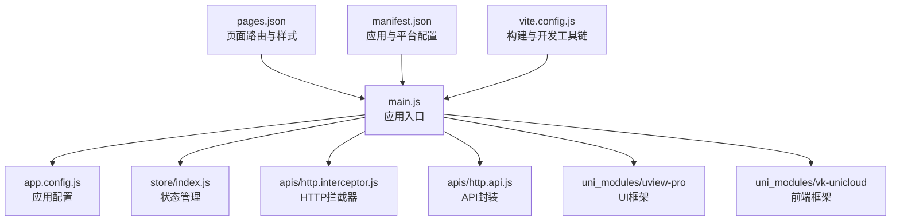
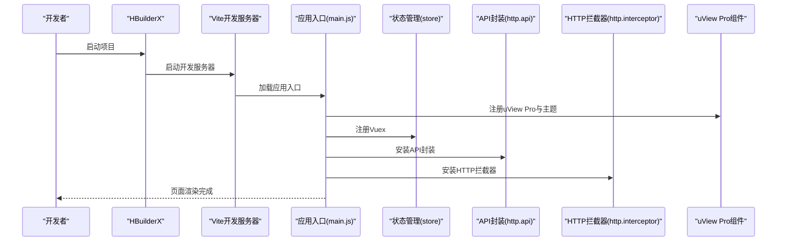
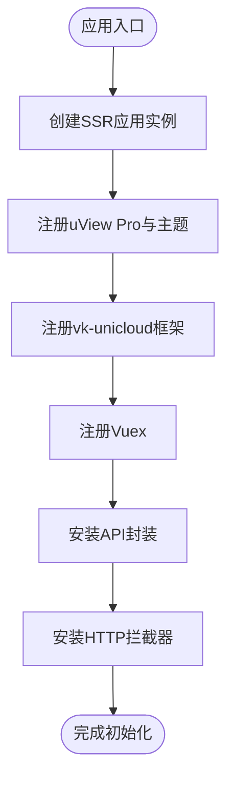
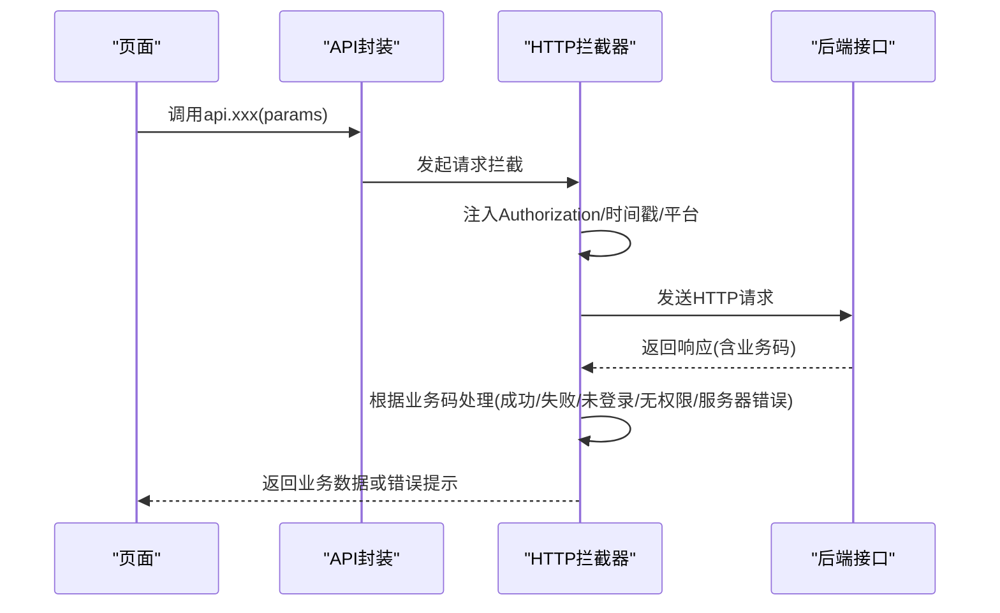
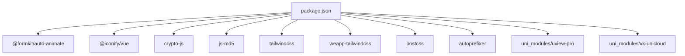

# 快速开始

<cite>
**本文引用的文件**
- [package.json](file://package.json)
- [manifest.json](file://manifest.json)
- [pages.json](file://pages.json)
- [README.md](file://README.md)
- [main.js](file://main.js)
- [app.config.js](file://app.config.js)
- [store/index.js](file://store/index.js)
- [vite.config.js](file://vite.config.js)
- [uni_modules/uview-pro/readme.md](file://uni_modules/uview-pro/readme.md)
- [uni_modules/vk-unicloud/package.json](file://uni_modules/vk-unicloud/package.json)
- [uni_modules/vk-unicloud/index.js](file://uni_modules/vk-unicloud/index.js)
- [apis/http.api.js](file://apis/http.api.js)
- [apis/http.interceptor.js](file://apis/http.interceptor.js)
</cite>

## 目录
1. [简介](#简介)
2. [项目结构](#项目结构)
3. [核心组件](#核心组件)
4. [架构总览](#架构总览)
5. [详细组件分析](#详细组件分析)
6. [依赖分析](#依赖分析)
7. [性能考虑](#性能考虑)
8. [故障排除指南](#故障排除指南)
9. [结论](#结论)
10. [附录](#附录)

## 简介
本指南面向首次接触“挪车助手”项目的开发者，目标是在最短时间内完成环境准备、项目克隆、依赖安装、开发服务器启动，并掌握 HBuilderX 与 uni-app 开发环境的配置、模拟器设置与真机调试流程。同时提供常见环境问题的解决方案与故障排除建议。

## 项目结构
该项目基于 uni-app 3.x 与 Vue 3，采用 HBuilderX 作为主要开发工具，结合 uView Pro UI 框架与 vk-unicloud 前端框架，配合 uniCloud 云资源进行前后端一体化开发。核心入口为 main.js，应用配置位于 app.config.js，状态管理使用 Vuex，页面路由由 pages.json 管理，构建与开发工具链由 vite.config.js 配置。

**图示来源**
- [main.js:1-49](file://main.js#L1-L49)
- [app.config.js:1-111](file://app.config.js#L1-L111)
- [store/index.js:1-136](file://store/index.js#L1-L136)
- [apis/http.api.js:1-32](file://apis/http.api.js#L1-L32)
- [apis/http.interceptor.js:1-116](file://apis/http.interceptor.js#L1-L116)
- [pages.json:1-87](file://pages.json#L1-L87)
- [manifest.json:1-271](file://manifest.json#L1-L271)
- [vite.config.js:1-58](file://vite.config.js#L1-L58)

**章节来源**
- [main.js:1-49](file://main.js#L1-L49)
- [pages.json:1-87](file://pages.json#L1-L87)
- [manifest.json:1-271](file://manifest.json#L1-L271)
- [vite.config.js:1-58](file://vite.config.js#L1-L58)

## 核心组件
- 应用入口与初始化：在 main.js 中完成 uView Pro、vk-unicloud、Vuex、API 与 HTTP 拦截器的注册。
- 应用配置：app.config.js 提供调试开关、页面跳转、静态资源、云存储、错误码映射与拦截器策略等。
- 状态管理：store/index.js 动态加载模块，支持多级状态更新与本地持久化。
- 页面路由：pages.json 定义页面路径、样式与 tabBar。
- 构建与开发工具：vite.config.js 集成 uni 插件、自动导入、TailwindCSS 与代码检查插件。
- UI 框架：uView Pro 通过 easycom 自动引入组件，支持多端与主题系统。
- 前端框架：vk-unicloud 提供云函数路由、uni-id 集成与常用 API。
- API 与拦截：http.api.js 统一封装请求，http.interceptor.js 统一处理鉴权、错误提示与业务码。

**章节来源**
- [main.js:1-49](file://main.js#L1-L49)
- [app.config.js:1-111](file://app.config.js#L1-L111)
- [store/index.js:1-136](file://store/index.js#L1-L136)
- [pages.json:1-87](file://pages.json#L1-L87)
- [vite.config.js:1-58](file://vite.config.js#L1-L58)
- [uni_modules/uview-pro/readme.md:104-144](file://uni_modules/uview-pro/readme.md#L104-L144)
- [uni_modules/vk-unicloud/package.json:1-90](file://uni_modules/vk-unicloud/package.json#L1-L90)
- [apis/http.api.js:1-32](file://apis/http.api.js#L1-L32)
- [apis/http.interceptor.js:1-116](file://apis/http.interceptor.js#L1-L116)

## 架构总览
下图展示从 HBuilderX 启动到页面渲染的关键流程，包括应用初始化、状态注入、API 与拦截器注册、页面路由与 UI 渲染。

**图示来源**
- [main.js:22-48](file://main.js#L22-L48)
- [store/index.js:67-97](file://store/index.js#L67-L97)
- [apis/http.api.js:11-14](file://apis/http.api.js#L11-L14)
- [apis/http.interceptor.js:37-47](file://apis/http.interceptor.js#L37-L47)
- [uni_modules/uview-pro/readme.md:126-144](file://uni_modules/uview-pro/readme.md#L126-L144)

## 详细组件分析

### 应用入口与初始化（main.js）
- 创建 SSR 应用实例，注册 uView Pro 主题与默认暗黑模式。
- 引入 vk-unicloud 前端框架并传入应用配置。
- 注册 Vuex、API 封装与 HTTP 拦截器，返回 { app }。

**图示来源**
- [main.js:22-48](file://main.js#L22-L48)

**章节来源**
- [main.js:1-49](file://main.js#L1-L49)

### 应用配置（app.config.js）
- 调试开关、页面跳转、静态资源与云存储配置。
- 登录校验策略（checkTokenPages）、分享控制（checkSharePages）与加密请求策略。
- 全局错误码映射与拦截器回调（登录、失败处理）。

**章节来源**
- [app.config.js:1-111](file://app.config.js#L1-L111)

### 状态管理（store/index.js）
- 动态按需加载 modules 目录下的命名空间模块。
- 支持多级状态更新与本地持久化（lifeData），严格模式仅在开发环境开启。

**章节来源**
- [store/index.js:1-136](file://store/index.js#L1-L136)

### 页面路由与样式（pages.json）
- easycom 自动扫描与自定义规则，支持 yy- 与 u- 组件前缀。
- 定义页面路径、导航栏标题与 tabBar 样式。

**章节来源**
- [pages.json:1-87](file://pages.json#L1-L87)

### 构建与开发工具（vite.config.js）
- 集成 @dcloudio/vite-plugin-uni、AutoImport、weapp-tailwindcss、code-inspector-plugin。
- 根据平台禁用 TailwindCSS 插件，自动引入 uni-app 与 Vue API，PostCSS 使用 tailwindcss 与 autoprefixer。

**章节来源**
- [vite.config.js:1-58](file://vite.config.js#L1-L58)

### UI 框架（uView Pro）
- 支持 npm 与 uni_modules 两种安装方式，通过 easycom 自动引入组件。
- 提供主题系统、多端兼容与 TypeScript 类型支持。

**章节来源**
- [uni_modules/uview-pro/readme.md:104-144](file://uni_modules/uview-pro/readme.md#L104-L144)
- [pages.json:2-8](file://pages.json#L2-L8)

### 前端框架（vk-unicloud）
- 提供云函数路由、uni-id 集成与常用 API，支持多云厂商与多端。

**章节来源**
- [uni_modules/vk-unicloud/package.json:1-90](file://uni_modules/vk-unicloud/package.json#L1-L90)
- [uni_modules/vk-unicloud/index.js:1-4](file://uni_modules/vk-unicloud/index.js#L1-L4)

### API 封装与拦截（http.api.js、http.interceptor.js）
- http.api.js：环境映射与 API 方法封装，统一设置基础 URL。
- http.interceptor.js：请求头注入 Authorization、时间戳与客户端平台；响应根据业务码统一处理与错误提示。

**图示来源**
- [apis/http.api.js:11-14](file://apis/http.api.js#L11-L14)
- [apis/http.interceptor.js:37-47](file://apis/http.interceptor.js#L37-L47)
- [apis/http.interceptor.js:49-113](file://apis/http.interceptor.js#L49-L113)

**章节来源**
- [apis/http.api.js:1-32](file://apis/http.api.js#L1-L32)
- [apis/http.interceptor.js:1-116](file://apis/http.interceptor.js#L1-L116)

## 依赖分析
- 运行时与开发依赖：项目声明了对 HBuilderX、uni-app、uni-app-x 的引擎版本要求，并包含 tailwindcss、weapp-tailwindcss、postcss、autoprefixer 等构建工具。
- 依赖项：包含 @formkit/auto-animate、@iconify/vue、crypto-js、js-md5 等第三方库。
- uni_modules：uview-pro、vk-unicloud 等扩展模块提供 UI 与前端框架能力。

**图示来源**
- [package.json:8-123](file://package.json#L8-L123)
- [uni_modules/uview-pro/readme.md:104-144](file://uni_modules/uview-pro/readme.md#L104-L144)
- [uni_modules/vk-unicloud/package.json:1-90](file://uni_modules/vk-unicloud/package.json#L1-L90)

**章节来源**
- [package.json:1-124](file://package.json#L1-L124)

## 性能考虑
- 构建阶段按平台禁用 TailwindCSS 插件，避免 H5 与 App 平台不必要的转换。
- 使用 AutoImport 减少重复 import，提高开发效率。
- 严格模式仅在开发环境启用，生产环境避免额外状态校验开销。
- API 封装统一基础 URL，减少重复配置与网络请求差异。

**章节来源**
- [vite.config.js:11-14](file://vite.config.js#L11-L14)
- [vite.config.js:34-42](file://vite.config.js#L34-L42)
- [store/index.js:69-70](file://store/index.js#L69-L70)
- [apis/http.api.js:9-14](file://apis/http.api.js#L9-L14)

## 故障排除指南
- 环境版本不匹配
  - 现象：HBuilderX 或 uni-app 报错提示版本不满足引擎要求。
  - 处理：升级 HBuilderX 至 3.1.2+，确保 uni-app 与 uni-app-x 版本满足 package.json 中 engines 字段。
  - 参考：[package.json:26-30](file://package.json#L26-L30)

- 组件无法自动引入
  - 现象：使用 u- 或 yy- 前缀组件时报错找不到组件。
  - 处理：确认 pages.json 中 easycom 配置正确且未重复定义；重启 HX 或重新编译项目。
  - 参考：[pages.json:2-8](file://pages.json#L2-L8)，[uni_modules/uview-pro/readme.md:168-192](file://uni_modules/uview-pro/readme.md#L168-L192)

- 开发服务器启动失败
  - 现象：执行 dev 命令后无法启动或报端口占用。
  - 处理：检查 Vite 配置与环境变量，确认未同时运行多个开发服务器；清理缓存后重试。
  - 参考：[vite.config.js:1-58](file://vite.config.js#L1-L58)

- HTTP 请求鉴权失败
  - 现象：401 未登录或登录过期提示频繁出现。
  - 处理：确认本地存储中存在有效的令牌键值；检查拦截器中 Authorization 注入逻辑与后端签发策略。
  - 参考：[apis/http.interceptor.js:1-116](file://apis/http.interceptor.js#L1-L116)

- 页面跳转与登录校验异常
  - 现象：未登录页面被强制跳转或登录后无法返回原页面。
  - 处理：检查 app.config.js 中 checkTokenPages 的模式与列表配置；使用 vk.navigateTo 替代 uni.navigateTo。
  - 参考：[app.config.js:29-47](file://app.config.js#L29-L47)

- 云存储上传失败
  - 现象：上传到阿里云 OSS 或七牛等失败。
  - 处理：核对云存储配置中的域名、签名与 Action 地址；确认鉴权接口返回参数正确。
  - 参考：[app.config.js:70-93](file://app.config.js#L70-L93)

**章节来源**
- [package.json:26-30](file://package.json#L26-L30)
- [pages.json:2-8](file://pages.json#L2-L8)
- [vite.config.js:1-58](file://vite.config.js#L1-L58)
- [apis/http.interceptor.js:1-116](file://apis/http.interceptor.js#L1-L116)
- [app.config.js:29-47](file://app.config.js#L29-L47)
- [app.config.js:70-93](file://app.config.js#L70-L93)

## 结论
通过本指南，你可以完成从环境准备到项目启动的全流程操作，并理解项目的核心架构与关键组件。遇到问题时，可依据“故障排除指南”逐项排查。建议在 HBuilderX 中使用“运行到手机或模拟器”进行真机调试，结合 HTTP 拦截器的日志定位接口问题。

## 附录

### 环境搭建与安装步骤
- Node.js
  - 推荐版本：满足 uView Pro 文档中 Node 与 pnpm 的最低版本要求。
  - 下载与安装：前往官网下载并安装 Node.js。
  - 验证：在终端执行 node -v 与 npm -v。
- HBuilderX
  - 下载与安装：前往官网下载 HBuilderX 并安装。
  - 验证：打开 HBuilderX，确认版本满足 engines 字段要求。
- uni-app 开发环境
  - 在 HBuilderX 中新建或导入 uni-app 项目，确保选择正确的模板与平台。
  - 安装依赖：在项目根目录执行依赖安装命令（建议使用 pnpm）。
  - 参考：[uni_modules/uview-pro/readme.md:72-77](file://uni_modules/uview-pro/readme.md#L72-L77)

**章节来源**
- [uni_modules/uview-pro/readme.md:15-16](file://uni_modules/uview-pro/readme.md#L15-L16)
- [uni_modules/uview-pro/readme.md:72-77](file://uni_modules/uview-pro/readme.md#L72-L77)
- [package.json:26-30](file://package.json#L26-L30)

### 项目克隆与依赖安装
- 克隆仓库至本地后，在项目根目录执行依赖安装命令。
- 建议使用 pnpm，以减少依赖冲突并提升安装速度。
- 参考：[uni_modules/uview-pro/readme.md:72-77](file://uni_modules/uview-pro/readme.md#L72-L77)

**章节来源**
- [uni_modules/uview-pro/readme.md:72-77](file://uni_modules/uview-pro/readme.md#L72-L77)

### 启动开发服务器
- 在项目根目录执行开发命令，启动 Vite 开发服务器。
- 在 HBuilderX 中选择“运行/真机调试”，选择目标平台（如微信小程序、H5、App）。
- 参考：[vite.config.js:1-58](file://vite.config.js#L1-L58)，[README.md:67-71](file://README.md#L67-L71)

**章节来源**
- [vite.config.js:1-58](file://vite.config.js#L1-L58)
- [README.md:67-71](file://README.md#L67-L71)

### 开发工具配置与模拟器设置
- HBuilderX 设置
  - 在“运行/真机调试”中选择目标平台与模拟器。
  - 确认 pages.json 与 manifest.json 配置正确。
- 模拟器设置
  - 微信开发者工具、Android 模拟器或 iOS 模拟器需与项目平台匹配。
- 参考：[pages.json:1-87](file://pages.json#L1-L87)，[manifest.json:1-271](file://manifest.json#L1-L271)

**章节来源**
- [pages.json:1-87](file://pages.json#L1-L87)
- [manifest.json:1-271](file://manifest.json#L1-L271)

### 真机调试流程
- 在 HBuilderX 中选择“运行/真机调试”，连接手机并允许调试。
- 确保网络与后端接口可达，必要时在拦截器中打印日志定位问题。
- 参考：[apis/http.interceptor.js:50-56](file://apis/http.interceptor.js#L50-L56)

**章节来源**
- [apis/http.interceptor.js:50-56](file://apis/http.interceptor.js#L50-L56)