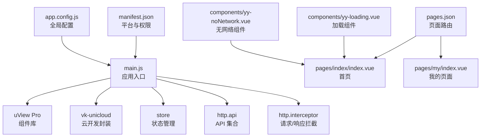
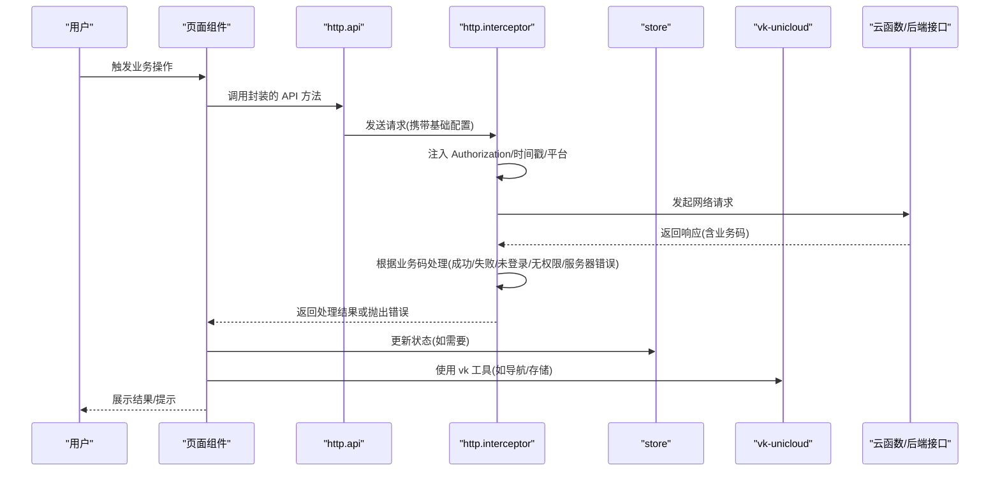
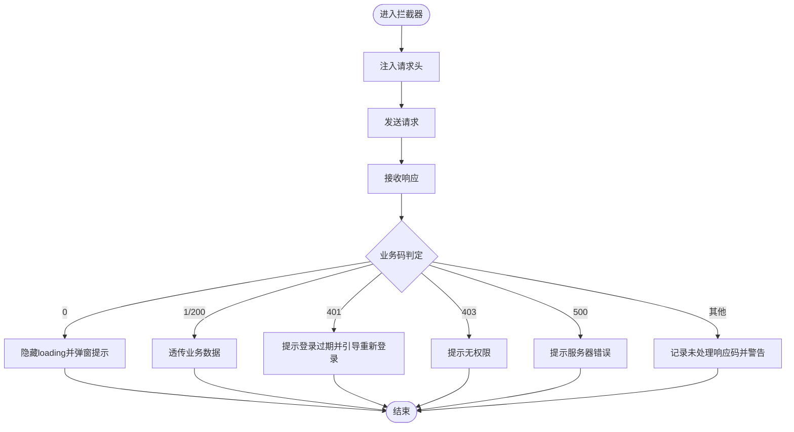
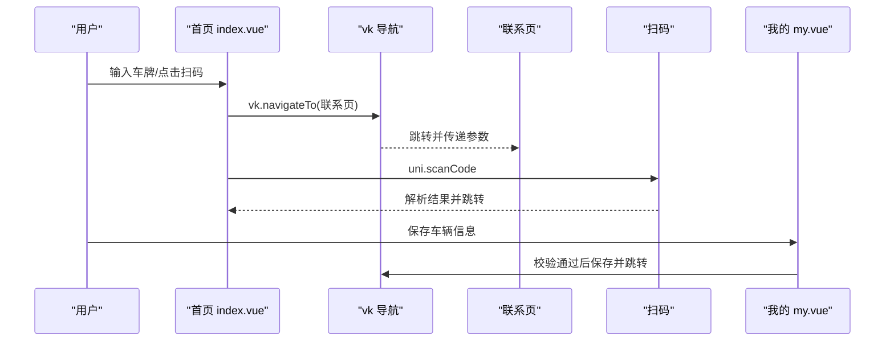
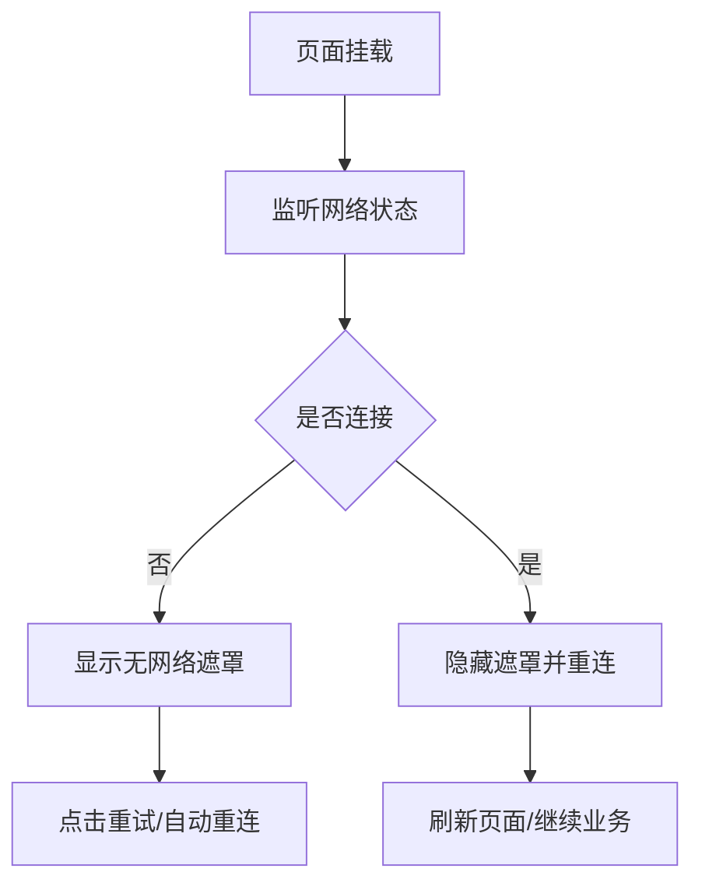
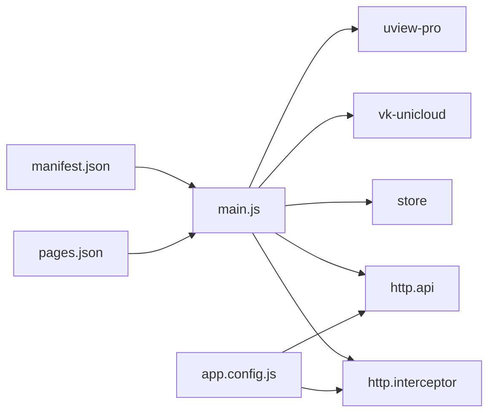

# 故障排除

<cite>
**本文引用的文件**
- [package.json](file://package.json)
- [manifest.json](file://manifest.json)
- [pages.json](file://pages.json)
- [main.js](file://main.js)
- [app.config.js](file://app.config.js)
- [apis/http.interceptor.js](file://apis/http.interceptor.js)
- [apis/http.api.js](file://apis/http.api.js)
- [store/index.js](file://store/index.js)
- [uni_modules/vk-unicloud/index.js](file://uni_modules/vk-unicloud/index.js)
- [uni_modules/uview-pro/index.ts](file://uni_modules/uview-pro/index.ts)
- [pages/index/index.vue](file://pages/index/index.vue)
- [pages/my/index.vue](file://pages/my/index.vue)
- [components/yy-loading.vue](file://components/yy-loading.vue)
- [components/yy-noNetwork.vue](file://components/yy-noNetwork.vue)
- [common/function/myPubFunction.js](file://common/function/myPubFunction.js)
</cite>

## 目录
1. [简介](#简介)
2. [项目结构](#项目结构)
3. [核心组件](#核心组件)
4. [架构总览](#架构总览)
5. [详细组件分析](#详细组件分析)
6. [依赖关系分析](#依赖关系分析)
7. [性能考虑](#性能考虑)
8. [故障排除指南](#故障排除指南)
9. [结论](#结论)
10. [附录](#附录)

## 简介
本手册面向挪车助手项目的开发者与运维人员，聚焦于开发、运行与部署阶段的常见问题与解决方案，涵盖编译错误、运行时错误、网络请求失败、数据库连接问题、性能问题定位、内存泄漏检测、兼容性问题排查、日志分析与调试工具使用、问题复现技巧以及知识库建设建议。内容基于仓库中的实际代码与配置文件进行梳理，确保可操作性强。

## 项目结构
项目采用 uni-app/Vue3 结构，前端通过 main.js 注入 uView Pro、vk-unicloud、全局 API 与拦截器；页面由 pages.json 统一声明；应用配置集中在 app.config.js；网络层通过 apis/http.api.js 与 apis/http.interceptor.js 统一封装；状态管理使用 store/index.js；组件层包含通用 loading 与无网络提示组件；移动端能力与权限在 manifest.json 中集中配置。

**图示来源**
- [main.js:1-49](file://main.js#L1-L49)
- [pages.json:1-87](file://pages.json#L1-L87)
- [manifest.json:1-271](file://manifest.json#L1-L271)
- [app.config.js:1-111](file://app.config.js#L1-L111)
- [apis/http.api.js:1-32](file://apis/http.api.js#L1-L32)
- [apis/http.interceptor.js:1-116](file://apis/http.interceptor.js#L1-L116)
- [store/index.js:1-136](file://store/index.js#L1-L136)
- [uni_modules/uview-pro/index.ts:1-101](file://uni_modules/uview-pro/index.ts#L1-L101)
- [uni_modules/vk-unicloud/index.js:1-4](file://uni_modules/vk-unicloud/index.js#L1-L4)
- [pages/index/index.vue:1-720](file://pages/index/index.vue#L1-L720)
- [pages/my/index.vue:1-682](file://pages/my/index.vue#L1-L682)
- [components/yy-loading.vue:1-34](file://components/yy-loading.vue#L1-L34)
- [components/yy-noNetwork.vue:1-72](file://components/yy-noNetwork.vue#L1-L72)

**章节来源**
- [main.js:1-49](file://main.js#L1-L49)
- [pages.json:1-87](file://pages.json#L1-L87)
- [manifest.json:1-271](file://manifest.json#L1-L271)
- [app.config.js:1-111](file://app.config.js#L1-L111)

## 核心组件
- 应用入口与注入
  - main.js 负责创建应用实例，注册 uView Pro 主题与暗黑模式、引入 vk-unicloud、Vuex、API 管理与 HTTP 拦截器。
- 全局配置
  - app.config.js 提供调试开关、页面跳转策略、静态资源域名、加密请求白名单、云存储配置、全局错误码映射与拦截器回调等。
- 网络层
  - http.api.js 定义 API 方法与当前环境基础 URL，并通过 uni.$u.http.setConfig 统一设置。
  - http.interceptor.js 实现请求头注入 Authorization、时间戳、客户端平台标识，以及按业务码分类的统一错误处理与弹窗提示。
- 状态管理
  - store/index.js 自动扫描 modules 目录，支持多级 state 更新与本地持久化（lifeData），严格模式仅在开发环境开启。
- 平台与权限
  - manifest.json 集中声明 Android/iOS 权限、模块、支付、地图 SDK、隐私说明、URL Scheme 等。
- 页面与组件
  - pages/index/index.vue 与 pages/my/index.vue 展示核心业务流程；yy-loading.vue 与 yy-noNetwork.vue 提供加载与无网络提示。

**章节来源**
- [main.js:1-49](file://main.js#L1-L49)
- [app.config.js:1-111](file://app.config.js#L1-L111)
- [apis/http.api.js:1-32](file://apis/http.api.js#L1-L32)
- [apis/http.interceptor.js:1-116](file://apis/http.interceptor.js#L1-L116)
- [store/index.js:1-136](file://store/index.js#L1-L136)
- [manifest.json:1-271](file://manifest.json#L1-L271)
- [pages/index/index.vue:1-720](file://pages/index/index.vue#L1-L720)
- [pages/my/index.vue:1-682](file://pages/my/index.vue#L1-L682)
- [components/yy-loading.vue:1-34](file://components/yy-loading.vue#L1-L34)
- [components/yy-noNetwork.vue:1-72](file://components/yy-noNetwork.vue#L1-L72)

## 架构总览
下图展示了从前端应用到云函数与外部服务的整体交互路径，包括请求拦截、鉴权头注入、错误码处理与页面跳转策略。

**图示来源**
- [main.js:1-49](file://main.js#L1-L49)
- [apis/http.api.js:1-32](file://apis/http.api.js#L1-L32)
- [apis/http.interceptor.js:1-116](file://apis/http.interceptor.js#L1-L116)
- [store/index.js:1-136](file://store/index.js#L1-L136)
- [uni_modules/vk-unicloud/index.js:1-4](file://uni_modules/vk-unicloud/index.js#L1-L4)

## 详细组件分析

### 组件 A：HTTP 请求与拦截器
- 关键点
  - 请求头注入 Authorization、x-timestamp、x-client-platform。
  - 响应按业务码分类处理：0 失败、1 成功、200 兼容成功、401 登录过期、403 无权限、500 服务器错误。
  - 支持将错误信息复制到剪贴板，便于问题反馈。
- 常见问题与对策
  - 401 未登录：拦截器已给出提示与跳转策略，确认 token 存储与刷新机制。
  - 403 无权限：检查用户角色与权限白名单配置。
  - 500 服务器错误：结合后端日志与 app.config.js 的全局错误码映射提示用户。
  - 超时与网络异常：结合 yy-noNetwork.vue 的网络监听与重试逻辑。

**图示来源**
- [apis/http.interceptor.js:37-116](file://apis/http.interceptor.js#L37-L116)

**章节来源**
- [apis/http.interceptor.js:1-116](file://apis/http.interceptor.js#L1-L116)
- [apis/http.api.js:1-32](file://apis/http.api.js#L1-L32)
- [app.config.js:94-110](file://app.config.js#L94-L110)

### 组件 B：页面与业务流程（首页/我的）
- 首页 index.vue
  - 车牌输入键盘、历史记录、扫码入口、联系车主跳转。
  - 使用 vk.navigateTo 与 vk.toast、vk.confirm 等工具。
- 我的页面 my.vue
  - 车辆信息表单校验（车牌长度、手机号格式）、隐私设置、保存与跳转。
  - 使用 vk.getStorageSync/vk.setStorageSync 进行本地持久化。
- 常见问题与对策
  - 车牌输入异常：检查 yy-plate-keyboard 组件与输入状态更新逻辑。
  - 表单校验失败：确认正则与输入长度限制。
  - 导航跳转失效：确保使用 vk.navigateTo 且页面已在 pages.json 声明。

**图示来源**
- [pages/index/index.vue:228-270](file://pages/index/index.vue#L228-L270)
- [pages/my/index.vue:312-336](file://pages/my/index.vue#L312-L336)

**章节来源**
- [pages/index/index.vue:1-720](file://pages/index/index.vue#L1-L720)
- [pages/my/index.vue:1-682](file://pages/my/index.vue#L1-L682)

### 组件 C：加载与无网络提示
- yy-loading.vue
  - 提供全屏加载动画与文案，适合长任务或列表加载场景。
- yy-noNetwork.vue
  - 监听网络状态变化，连接恢复时触发重连与页面刷新；提供“点击重试”入口。
- 常见问题与对策
  - 加载态不消失：检查业务流程中是否正确关闭 loading。
  - 无网络提示不出现：确认 uni.onNetworkStatusChange 是否正常触发。

**图示来源**
- [components/yy-noNetwork.vue:16-68](file://components/yy-noNetwork.vue#L16-L68)

**章节来源**
- [components/yy-loading.vue:1-34](file://components/yy-loading.vue#L1-L34)
- [components/yy-noNetwork.vue:1-72](file://components/yy-noNetwork.vue#L1-L72)

### 组件 D：全局工具与错误摘要
- myPubFunction.js
  - 图片预览、剪贴板复制（H5/微信小程序）、构建错误摘要、退出登录、跳转登录。
- 常见问题与对策
  - 剪贴板失败：H5 环境降级到 textarea 方案；小程序使用 wx.setClipboardData。
  - 错误摘要：拦截器中可调用 buildErrorSummary 输出到控制台或复制到剪贴板。

**章节来源**
- [common/function/myPubFunction.js:1-88](file://common/function/myPubFunction.js#L1-L88)
- [apis/http.interceptor.js:10-35](file://apis/http.interceptor.js#L10-L35)

## 依赖关系分析
- 应用层依赖
  - main.js 依赖 uView Pro、vk-unicloud、store、http.api、http.interceptor。
  - 页面依赖 vk 工具与组件库，组件依赖 uni.$u 与平台 API。
- 配置层依赖
  - app.config.js 为全局配置中心，影响拦截器、云存储、错误码映射等。
  - pages.json 决定页面路由与组件自动扫描规则。
  - manifest.json 决定平台能力与权限，直接影响运行期行为。

**图示来源**
- [main.js:1-49](file://main.js#L1-L49)
- [uni_modules/uview-pro/index.ts:1-101](file://uni_modules/uview-pro/index.ts#L1-L101)
- [uni_modules/vk-unicloud/index.js:1-4](file://uni_modules/vk-unicloud/index.js#L1-L4)
- [store/index.js:1-136](file://store/index.js#L1-L136)
- [apis/http.api.js:1-32](file://apis/http.api.js#L1-L32)
- [apis/http.interceptor.js:1-116](file://apis/http.interceptor.js#L1-L116)
- [app.config.js:1-111](file://app.config.js#L1-L111)
- [pages.json:1-87](file://pages.json#L1-L87)
- [manifest.json:1-271](file://manifest.json#L1-L271)

**章节来源**
- [main.js:1-49](file://main.js#L1-L49)
- [app.config.js:1-111](file://app.config.js#L1-L111)
- [pages.json:1-87](file://pages.json#L1-L87)
- [manifest.json:1-271](file://manifest.json#L1-L271)

## 性能考虑
- 网络层
  - 合理设置超时时间与重试策略，避免长时间阻塞 UI。
  - 对高频请求进行节流/防抖，减少不必要的网络压力。
- UI 渲染
  - 使用虚拟列表与懒加载组件，减少首屏渲染负担。
  - 控制组件树深度，避免深层嵌套导致的重绘。
- 存储与缓存
  - 本地持久化仅存放必要数据，避免占用过多缓存空间。
  - 对大对象序列化/反序列化进行节流，降低 CPU 开销。
- 平台差异
  - Android/iOS 权限与模块差异可能导致性能波动，需针对性优化。

[本节为通用指导，无需特定文件引用]

## 故障排除指南

### 编译错误
- 症状
  - 构建失败、类型报错、模块解析失败。
- 排查步骤
  - 检查 package.json 与 engines 版本要求，确保 HBuilderX/uni-app 版本匹配。
  - 确认 pages.json 的 easycom 自动扫描规则与组件路径一致。
  - 检查 TypeScript 类型声明与 uni_modules 的类型导出。
- 建议
  - 清理 node_modules 与缓存后重装依赖。
  - 使用官方模板项目对比配置差异。

**章节来源**
- [package.json:1-124](file://package.json#L1-L124)
- [pages.json:1-87](file://pages.json#L1-L87)
- [uni_modules/uview-pro/index.ts:1-101](file://uni_modules/uview-pro/index.ts#L1-L101)

### 运行时错误
- 症状
  - 页面空白、组件不显示、导航异常。
- 排查步骤
  - 检查 main.js 中 uView Pro、vk-unicloud、store、API 与拦截器的安装顺序与参数。
  - 确认 app.config.js 的全局配置（如静态资源域名、加密请求列表）与实际环境一致。
  - 核对 pages.json 中页面路径与命名规范。
- 建议
  - 在开发环境开启严格模式，利用控制台定位 state 更新问题。
  - 使用 myPubFunction.js 的错误摘要功能输出请求详情。

**章节来源**
- [main.js:1-49](file://main.js#L1-L49)
- [app.config.js:1-111](file://app.config.js#L1-L111)
- [pages.json:1-87](file://pages.json#L1-L87)
- [common/function/myPubFunction.js:52-62](file://common/function/myPubFunction.js#L52-L62)

### 网络请求失败
- 症状
  - 请求超时、401/403/500 错误、跨域问题。
- 排查步骤
  - 检查 http.api.js 的环境与 baseUrl 配置，确认当前环境变量。
  - 查看 http.interceptor.js 的请求头注入与业务码处理分支。
  - 结合 app.config.js 的全局错误码映射与拦截器回调。
- 建议
  - 对 401 场景完善 token 刷新与重试逻辑。
  - 对 500 场景记录响应体与请求参数，便于后端定位。

**章节来源**
- [apis/http.api.js:1-32](file://apis/http.api.js#L1-L32)
- [apis/http.interceptor.js:1-116](file://apis/http.interceptor.js#L1-L116)
- [app.config.js:94-110](file://app.config.js#L94-L110)

### 数据库连接问题
- 症状
  - 云函数调用失败、数据库读写异常。
- 排查步骤
  - 确认 uni_modules/vk-unicloud 的集成与云函数路由配置。
  - 检查数据库 schema 与索引定义是否与业务查询一致。
- 建议
  - 使用 uniCloud 控制台查看实时日志与慢查询。
  - 对高频查询建立合适索引，避免全表扫描。

**章节来源**
- [uni_modules/vk-unicloud/index.js:1-4](file://uni_modules/vk-unicloud/index.js#L1-L4)

### 性能问题定位
- 症状
  - 页面卡顿、加载缓慢、内存占用高。
- 排查步骤
  - 使用 H5/小程序开发者工具的性能面板观察帧率与内存。
  - 检查是否存在大量同步 setState 或深层嵌套组件。
  - 关注网络请求频次与大小，合并请求或启用缓存。
- 建议
  - 对长列表使用虚拟滚动与懒加载。
  - 减少不必要的全局状态更新，使用局部状态与计算属性。

**章节来源**
- [store/index.js:1-136](file://store/index.js#L1-L136)

### 内存泄漏检测
- 症状
  - 页面切换后内存不释放、长时间使用后卡顿。
- 排查步骤
  - 检查组件生命周期钩子中是否正确清理定时器、事件监听与订阅。
  - 确认全局状态中未持有页面实例或大型对象。
- 建议
  - 使用开发者工具的内存快照对比，定位未释放对象。
  - 避免在全局对象中缓存页面上下文。

**章节来源**
- [store/index.js:1-136](file://store/index.js#L1-L136)

### 兼容性问题
- 症状
  - 某些平台/机型表现异常、权限缺失导致功能不可用。
- 排查步骤
  - 检查 manifest.json 中的模块与权限声明，确认目标平台支持情况。
  - 针对不同平台（H5/小程序/App）分别测试关键功能。
- 建议
  - 使用条件编译区分平台差异，提供降级方案。
  - 对摄像头、蓝牙、定位等敏感权限进行引导与兜底。

**章节来源**
- [manifest.json:1-271](file://manifest.json#L1-L271)

### 错误日志分析与调试工具
- 日志输出
  - http.interceptor.js 在响应拦截中输出日志，便于定位业务码异常。
  - myPubFunction.js 的 buildErrorSummary 可将请求 URL、方法、参数与响应体汇总。
- 调试工具
  - HBuilderX 控制台与断点调试。
  - 小程序开发者工具 Network 面板与 Storage 面板。
  - uniCloud 控制台日志与性能分析。
- 建议
  - 在关键节点增加日志埋点，区分开发/生产环境输出级别。
  - 对用户反馈的错误，优先收集错误摘要与复现场景。

**章节来源**
- [apis/http.interceptor.js:50-51](file://apis/http.interceptor.js#L50-L51)
- [common/function/myPubFunction.js:52-62](file://common/function/myPubFunction.js#L52-L62)

### 问题复现与知识库建设
- 复现步骤
  - 明确前置条件（登录状态、网络状态、设备权限）。
  - 记录操作序列与期望/实际结果。
  - 截图与日志，必要时提供错误摘要。
- 知识库
  - 分类整理：编译、运行、网络、数据库、性能、兼容性。
  - 提供“症状—原因—解决步骤—验证”的标准模板。
  - 建立常见问题 FAQ 与升级变更记录。

[本节为通用指导，无需特定文件引用]

## 结论
本手册基于挪车助手项目的实际代码与配置，提供了从架构到组件、从网络到性能、从兼容性到调试的系统化故障排除方法。建议团队在日常开发中遵循“日志先行、分层定位、最小复现、闭环验证”的原则，持续完善知识库，提升问题定位与解决效率。

## 附录
- 快速检查清单
  - 构建：版本匹配、依赖安装、pages.json 配置。
  - 运行：入口注入顺序、全局配置、页面声明。
  - 网络：环境与 baseUrl、拦截器业务码处理、错误摘要。
  - 数据库：vk-unicloud 集成、schema 与索引。
  - 性能：渲染与存储优化、平台差异。
  - 兼容：权限与模块声明、条件编译。

[本节为通用指导，无需特定文件引用]