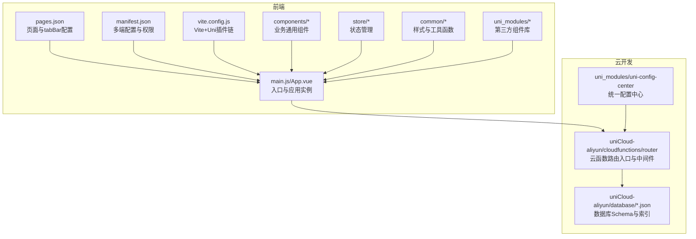
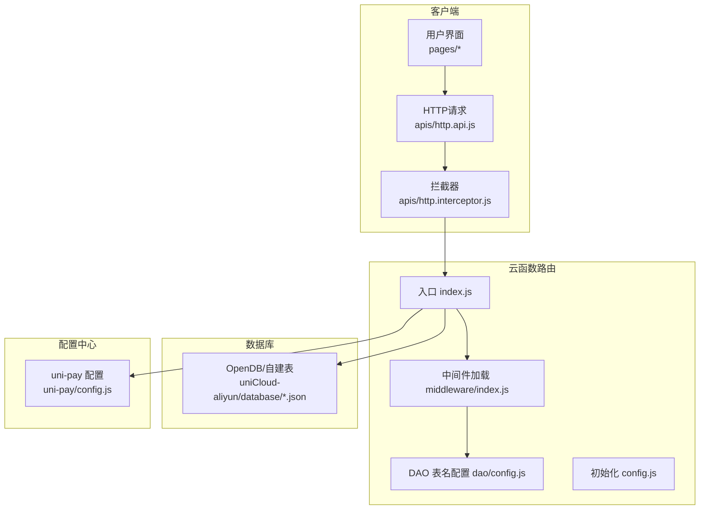
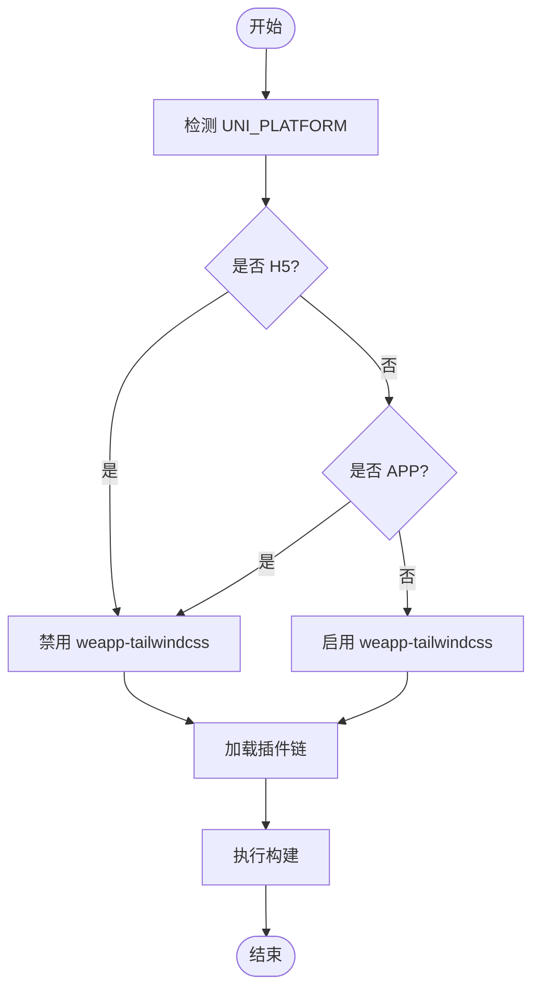
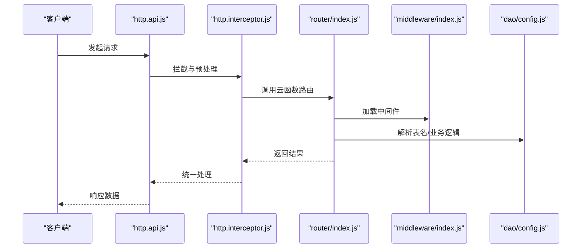
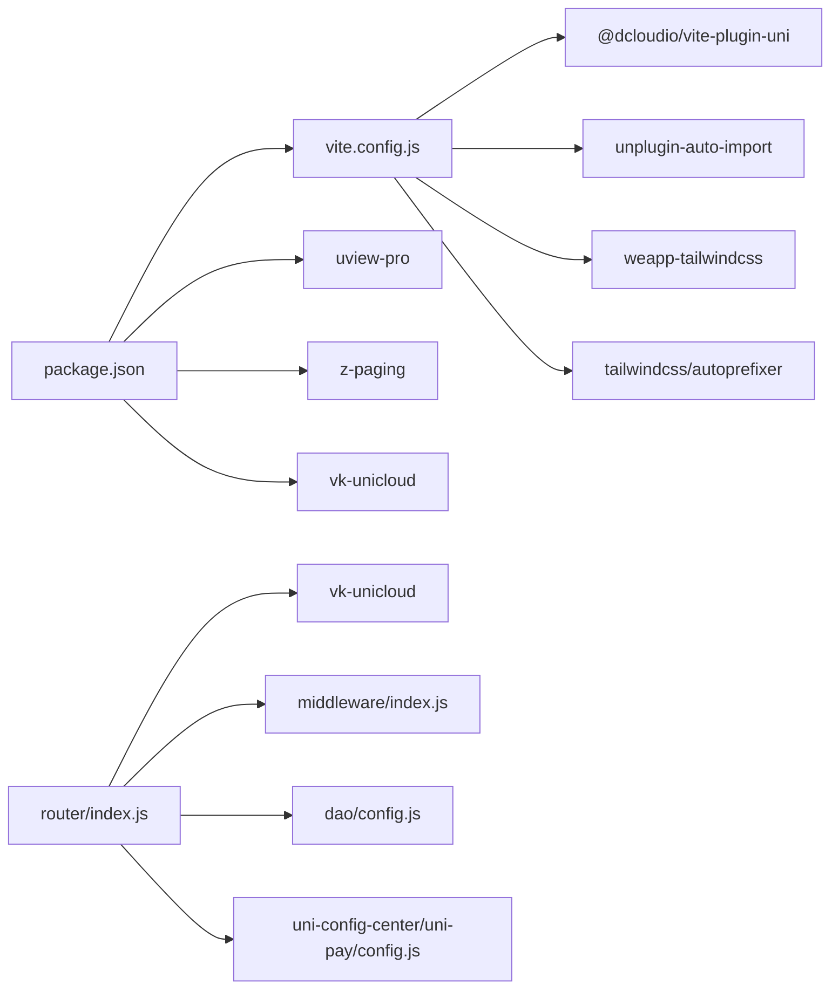

# 构建与部署

<cite>
**本文引用的文件**
- [package.json](file://package.json)
- [manifest.json](file://manifest.json)
- [pages.json](file://pages.json)
- [vite.config.js](file://vite.config.js)
- [app.config.js](file://app.config.js)
- [uniCloud-aliyun/cloudfunctions/router/index.js](file://uniCloud-aliyun/cloudfunctions/router/index.js)
- [uniCloud-aliyun/cloudfunctions/router/config.js](file://uniCloud-aliyun/cloudfunctions/router/config.js)
- [uniCloud-aliyun/cloudfunctions/router/dao/config.js](file://uniCloud-aliyun/cloudfunctions/router/dao/config.js)
- [uniCloud-aliyun/cloudfunctions/router/middleware/index.js](file://uniCloud-aliyun/cloudfunctions/router/middleware/index.js)
- [uni_modules/uni-config-center/uniCloud/cloudfunctions/common/uni-config-center/uni-pay/config.js](file://uni_modules/uni-config-center/uniCloud/cloudfunctions/common/uni-config-center/uni-pay/config.js)
- [.hbuilderx/launch.json](file://.hbuilderx/launch.json)
- [index.html](file://index.html)
- [template.h5.html](file://template.h5.html)
- [apis/http.api.js](file://apis/http.api.js)
- [apis/http.interceptor.js](file://apis/http.interceptor.js)
- [common/function/myPubFunction.js](file://common/function/myPubFunction.js)
- [store/modules/$user.js](file://store/modules/$user.js)
- [store/modules/$app.js](file://store/modules/$app.js)
- [store/modules/$tabbar.js](file://store/modules/$tabbar.js)
- [store/index.js](file://store/index.js)
- [components/yy-loading.vue](file://components/yy-loading.vue)
- [components/yy-empty.vue](file://components/yy-empty.vue)
- [components/yy-noNetwork.vue](file://components/yy-noNetwork.vue)
- [components/yy-paging.vue](file://components/yy-paging.vue)
- [components/yy-refresher.vue](file://components/yy-refresher.vue)
- [components/yy-tabbar.vue](file://components/yy-tabbar.vue)
- [components/yy-tip-modal.vue](file://components/yy-tip-modal.vue)
- [components/yy-upload.vue](file://components/yy-upload.vue)
- [pages/index/index.vue](file://pages/index/index.vue)
- [pages/my/index.vue](file://pages/my/index.vue)
- [pages/login/index.vue](file://pages/login/index.vue)
- [pages/error/404.vue](file://pages/error/404.vue)
- [pages/error/404/404.vue](file://pages/error/404/404.vue)
- [pages/test/index.vue](file://pages/test/index.vue)
- [main.js](file://main.js)
- [App.vue](file://App.vue)
- [App.ku.vue](file://App.ku.vue)
- [theme.json](file://theme.json)
- [uni.scss](file://uni.scss)
- [common/css/core.scss](file://common/css/core.scss)
- [common/css/uni.scss](file://common/css/uni.scss)
- [postcss.config.js](file://postcss.config.js)
- [tailwind.config.js](file://tailwind.config.js)
- [tsconfig.json](file://tsconfig.json)
- [typings/auto-imports.d.ts](file://typings/auto-imports.d.ts)
- [uni_modules/uview-pro/index.ts](file://uni_modules/uview-pro/index.ts)
- [uni_modules/z-paging/readme.md](file://uni_modules/z-paging/readme.md)
- [uni_modules/vk-unicloud/index.js](file://uni_modules/vk-unicloud/index.js)
- [uni_modules/liu-slide-img/readme.md](file://uni_modules/liu-slide-img/readme.md)
</cite>

## 目录
1. [简介](#简介)
2. [项目结构](#项目结构)
3. [核心组件](#核心组件)
4. [架构总览](#架构总览)
5. [详细组件分析](#详细组件分析)
6. [依赖关系分析](#依赖关系分析)
7. [性能考虑](#性能考虑)
8. [故障排除指南](#故障排除指南)
9. [结论](#结论)
10. [附录](#附录)

## 简介
本指南面向“挪车助手”项目的构建与部署，覆盖多端构建配置（H5、小程序、APP）、uniCloud 云开发部署、域名与 HTTPS 设置、CI/CD 自动化与版本管理、生产环境优化与监控告警，以及部署故障排除、回滚与应急处理方案。文档基于仓库现有配置文件与目录结构进行系统化梳理，并提供可视化图示帮助理解。

## 项目结构
项目采用 uni-app 多端统一工程，前端源码位于根目录，云开发位于 uniCloud-aliyun，组件与第三方 uni_modules 位于 uni_modules，样式与主题位于 common 与 uni_modules/uview-pro，构建与脚手架由 Vite 插件链支持。

图表来源
- [pages.json:1-87](file://pages.json#L1-L87)
- [manifest.json:1-271](file://manifest.json#L1-L271)
- [vite.config.js:1-58](file://vite.config.js#L1-L58)
- [main.js](file://main.js)
- [App.vue](file://App.vue)
- [uniCloud-aliyun/cloudfunctions/router/index.js:1-8](file://uniCloud-aliyun/cloudfunctions/router/index.js#L1-L8)
- [uniCloud-aliyun/cloudfunctions/router/middleware/index.js:1-34](file://uniCloud-aliyun/cloudfunctions/router/middleware/index.js#L1-L34)

章节来源
- [pages.json:1-87](file://pages.json#L1-L87)
- [manifest.json:1-271](file://manifest.json#L1-L271)
- [vite.config.js:1-58](file://vite.config.js#L1-L58)
- [main.js](file://main.js)
- [App.vue](file://App.vue)

## 核心组件
- 构建与打包
  - Vite 插件链：@dcloudio/vite-plugin-uni、AutoImport、weapp-tailwindcss、code-inspector-plugin、@uni-ku/root。
  - 平台条件：H5 与 APP 平台禁用 weapp-tailwindcss，确保兼容性。
- 多端配置
  - manifest.json 提供 app-plus、mp-weixin、mp-alipay、mp-baidu、mp-toutiao、h5 等平台的差异化配置。
- 云函数路由
  - router/index.js 作为云函数入口，通过 vk-unicloud 初始化并交由 vk.router 分发。
- 统一配置中心
  - uni-config-center 提供支付、存储等统一配置，便于多环境切换与密钥管理。
- 应用配置
  - app.config.js 定义调试开关、静态资源域、拦截器、错误码映射、云存储提供商等。

章节来源
- [vite.config.js:1-58](file://vite.config.js#L1-L58)
- [manifest.json:1-271](file://manifest.json#L1-L271)
- [uniCloud-aliyun/cloudfunctions/router/index.js:1-8](file://uniCloud-aliyun/cloudfunctions/router/index.js#L1-L8)
- [uni_modules/uni-config-center/uniCloud/cloudfunctions/common/uni-config-center/uni-pay/config.js:1-129](file://uni_modules/uni-config-center/uniCloud/cloudfunctions/common/uni-config-center/uni-pay/config.js#L1-L129)
- [app.config.js:1-111](file://app.config.js#L1-L111)

## 架构总览
整体架构由“前端多端应用 + uniCloud 云函数路由 + 数据库 Schema + 统一配置中心”构成，前端通过 uni.request 调用云函数路由，云函数按中间件与 DAO 层组织业务逻辑。

图表来源
- [pages/index/index.vue](file://pages/index/index.vue)
- [apis/http.api.js](file://apis/http.api.js)
- [apis/http.interceptor.js](file://apis/http.interceptor.js)
- [uniCloud-aliyun/cloudfunctions/router/index.js:1-8](file://uniCloud-aliyun/cloudfunctions/router/index.js#L1-L8)
- [uniCloud-aliyun/cloudfunctions/router/middleware/index.js:1-34](file://uniCloud-aliyun/cloudfunctions/router/middleware/index.js#L1-L34)
- [uniCloud-aliyun/cloudfunctions/router/dao/config.js:1-66](file://uniCloud-aliyun/cloudfunctions/router/dao/config.js#L1-L66)
- [uni_modules/uni-config-center/uniCloud/cloudfunctions/common/uni-config-center/uni-pay/config.js:1-129](file://uni_modules/uni-config-center/uniCloud/cloudfunctions/common/uni-config-center/uni-pay/config.js#L1-L129)

## 详细组件分析

### 多端构建配置（H5、小程序、APP）
- H5
  - 开发服务器：禁用 host 校验，关闭 https。
  - 模板：template.h5.html。
  - 地图 SDK：高德地图 key、安全码与服务主机。
- 小程序（微信/支付宝/百度/头条/QQ）
  - 使用组件化、懒加载 requiredComponents、最小化与 postcss。
  - 微信隐私弹窗开关启用。
- APP
  - 原生混淆、模块能力、权限清单、图标与启动页、URL Scheme 白名单、Universal Links、支付与 OAuth 配置。
  - iOS Associated Domains 与 IDFA 控制。
- 构建插件链
  - 条件禁用 weapp-tailwindcss（H5/APP）。
  - 自动导入 Vue 与 uni-app API，生成 auto-imports.d.ts。
  - PostCSS + TailwindCSS 配置指向 tailwind.config.js。

图表来源
- [vite.config.js:11-14](file://vite.config.js#L11-L14)
- [vite.config.js:20-45](file://vite.config.js#L20-L45)

章节来源
- [manifest.json:235-251](file://manifest.json#L235-L251)
- [manifest.json:195-213](file://manifest.json#L195-L213)
- [manifest.json:214-222](file://manifest.json#L214-L222)
- [manifest.json:223-231](file://manifest.json#L223-L231)
- [manifest.json:8-193](file://manifest.json#L8-L193)
- [vite.config.js:1-58](file://vite.config.js#L1-L58)

### uniCloud 云开发部署与路由
- 路由入口
  - 通过 vk-unicloud 创建实例，调用 vk.router(event, context, vk) 分发请求。
- 中间件机制
  - 自动扫描 middleware/modules 下的中间件文件，聚合为中间件列表。
- DAO 表名
  - 统一导出表名常量，便于跨模块引用与维护。
- 配置中心
  - uni-pay 配置包含 notifyUrl、各端支付参数与证书路径，支持沙箱模式。

图表来源
- [apis/http.api.js](file://apis/http.api.js)
- [apis/http.interceptor.js](file://apis/http.interceptor.js)
- [uniCloud-aliyun/cloudfunctions/router/index.js:1-8](file://uniCloud-aliyun/cloudfunctions/router/index.js#L1-L8)
- [uniCloud-aliyun/cloudfunctions/router/middleware/index.js:1-34](file://uniCloud-aliyun/cloudfunctions/router/middleware/index.js#L1-L34)
- [uniCloud-aliyun/cloudfunctions/router/dao/config.js:1-66](file://uniCloud-aliyun/cloudfunctions/router/dao/config.js#L1-L66)

章节来源
- [uniCloud-aliyun/cloudfunctions/router/index.js:1-8](file://uniCloud-aliyun/cloudfunctions/router/index.js#L1-L8)
- [uniCloud-aliyun/cloudfunctions/router/middleware/index.js:1-34](file://uniCloud-aliyun/cloudfunctions/router/middleware/index.js#L1-L34)
- [uniCloud-aliyun/cloudfunctions/router/dao/config.js:1-66](file://uniCloud-aliyun/cloudfunctions/router/dao/config.js#L1-L66)
- [uni_modules/uni-config-center/uniCloud/cloudfunctions/common/uni-config-center/uni-pay/config.js:1-129](file://uni_modules/uni-config-center/uniCloud/cloudfunctions/common/uni-config-center/uni-pay/config.js#L1-L129)

### 域名与 HTTPS 设置
- H5 开发服务器
  - devServer.disableHostCheck=true，devServer.https=false。
- APP 平台
  - 微信 OAuth/Universal Links、支付场景下的 Universal Links 配置。
  - iOS Associated Domains 列表与 URL Scheme 白名单。
- 支付回调
  - uni-pay 配置中为不同 SpaceID 指定 notifyUrl，确保回调地址正确。

章节来源
- [manifest.json:238-241](file://manifest.json#L238-L241)
- [manifest.json:110-144](file://manifest.json#L110-L144)
- [uni_modules/uni-config-center/uniCloud/cloudfunctions/common/uni-config-center/uni-pay/config.js:10-15](file://uni_modules/uni-config-center/uniCloud/cloudfunctions/common/uni-config-center/uni-pay/config.js#L10-L15)

### CI/CD 流水线与自动化部署
- 建议流水线步骤
  - 代码检出 → 依赖安装（如 pnpm）→ 构建（H5/APP/小程序）→ 上传静态资源（H5）→ 上传云函数与数据库（uniCloud）→ 配置域名与 HTTPS（APP/H5）→ 告警与发布通知。
- 版本管理
  - 依据 manifest.json 的 versionName/versionCode 与 pages.json 的页面清单进行版本标识与灰度发布。
- 自动化要点
  - 使用 HBuilderX CLI 或 uni-cli 进行多端构建与上传。
  - 云函数路由与中间件按模块化更新，避免破坏性变更。

章节来源
- [manifest.json:5-6](file://manifest.json#L5-L6)
- [pages.json:1-87](file://pages.json#L1-L87)
- [.hbuilderx/launch.json](file://.hbuilderx/launch.json)

### 生产环境优化与监控告警
- 性能优化
  - 图片与静态资源 CDN 域名配置；分包与懒加载策略；缓存与离线资源。
  - 小程序端启用压缩与最小化；H5 端启用 gzip/缓存头。
- 监控与告警
  - 云函数路由层记录错误日志与耗时指标；统一错误码映射与前端提示。
  - uni-pay 回调失败重试与报警；数据库慢查询与索引优化。

章节来源
- [app.config.js:94-100](file://app.config.js#L94-L100)
- [uniCloud-aliyun/cloudfunctions/router/dao/config.js:52-61](file://uniCloud-aliyun/cloudfunctions/router/dao/config.js#L52-L61)

## 依赖关系分析
- 前端依赖
  - @dcloudio/vite-plugin-uni、unplugin-auto-import、weapp-tailwindcss、tailwindcss、autoprefixer、@uni-ku/root。
  - 第三方组件库：uview-pro、z-paging、vk-unicloud。
- 云函数依赖
  - vk-unicloud 作为路由与数据访问基础；中间件与 DAO 模块化组织。
- 配置依赖
  - uni-config-center 提供支付、存储等统一配置，减少硬编码。

图表来源
- [vite.config.js:1-58](file://vite.config.js#L1-L58)
- [package.json:116-122](file://package.json#L116-L122)
- [uniCloud-aliyun/cloudfunctions/router/index.js:1-8](file://uniCloud-aliyun/cloudfunctions/router/index.js#L1-L8)
- [uniCloud-aliyun/cloudfunctions/router/middleware/index.js:1-34](file://uniCloud-aliyun/cloudfunctions/router/middleware/index.js#L1-L34)
- [uniCloud-aliyun/cloudfunctions/router/dao/config.js:1-66](file://uniCloud-aliyun/cloudfunctions/router/dao/config.js#L1-L66)
- [uni_modules/uni-config-center/uniCloud/cloudfunctions/common/uni-config-center/uni-pay/config.js:1-129](file://uni_modules/uni-config-center/uniCloud/cloudfunctions/common/uni-config-center/uni-pay/config.js#L1-L129)

章节来源
- [package.json:1-124](file://package.json#L1-L124)
- [vite.config.js:1-58](file://vite.config.js#L1-L58)
- [uniCloud-aliyun/cloudfunctions/router/index.js:1-8](file://uniCloud-aliyun/cloudfunctions/router/index.js#L1-L8)

## 性能考虑
- 构建期
  - 条件禁用 weapp-tailwindcss，避免 H5/APP 平台额外处理成本。
  - 自动导入减少样板代码，提升开发效率。
- 运行期
  - 组件懒加载与分包策略；图片与静态资源走 CDN；合理设置缓存头。
  - 云函数路由层对异常与超时进行统一处理，避免前端感知到底层细节。

章节来源
- [vite.config.js:11-14](file://vite.config.js#L11-L14)
- [vite.config.js:34-42](file://vite.config.js#L34-L42)
- [app.config.js:94-100](file://app.config.js#L94-L100)

## 故障排除指南
- H5 开发无法访问
  - 检查 devServer.disableHostCheck 与 https 设置。
- APP 无法拉起支付/分享
  - 核对 manifest.json 中支付与 OAuth 配置、Universal Links、iOS Associated Domains。
- 云函数路由报错
  - 查看中间件加载日志与异常堆栈；确认 DAO 表名配置是否匹配数据库实际表名。
- 支付回调失败
  - 对照 uni-pay 配置中的 notifyUrl 与 SpaceID；检查证书与沙箱模式。

章节来源
- [manifest.json:238-241](file://manifest.json#L238-L241)
- [manifest.json:110-144](file://manifest.json#L110-L144)
- [uniCloud-aliyun/cloudfunctions/router/middleware/index.js:21-25](file://uniCloud-aliyun/cloudfunctions/router/middleware/index.js#L21-L25)
- [uniCloud-aliyun/cloudfunctions/router/dao/config.js:37-66](file://uniCloud-aliyun/cloudfunctions/router/dao/config.js#L37-L66)
- [uni_modules/uni-config-center/uniCloud/cloudfunctions/common/uni-config-center/uni-pay/config.js:10-15](file://uni_modules/uni-config-center/uniCloud/cloudfunctions/common/uni-config-center/uni-pay/config.js#L10-L15)

## 结论
本指南基于现有配置文件梳理了“挪车助手”的多端构建、uniCloud 云开发部署、域名与 HTTPS、CI/CD 自动化、生产优化与监控告警，并提供了故障排除与应急处理建议。建议在后续迭代中完善 CI/CD 脚本、细化监控指标与告警阈值，并持续优化组件与云函数的模块化与可测试性。

## 附录
- 关键文件速览
  - 构建与脚手架：vite.config.js、package.json、postcss.config.js、tailwind.config.js、tsconfig.json、typings/auto-imports.d.ts。
  - 多端配置：manifest.json、pages.json、theme.json、uni.scss、common/css/*。
  - 应用配置：app.config.js、common/function/myPubFunction.js。
  - 云函数路由：uniCloud-aliyun/cloudfunctions/router/index.js、config.js、middleware/index.js、dao/config.js。
  - 统一配置：uni_modules/uni-config-center/uniCloud/cloudfunctions/common/uni-config-center/uni-pay/config.js。
  - 前端页面与组件：pages/*、components/*、store/*。
  - H5 模板：index.html、template.h5.html。
  - 开发工具：.hbuilderx/launch.json。