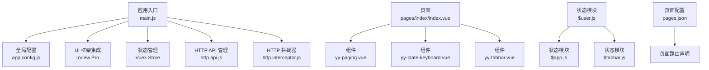
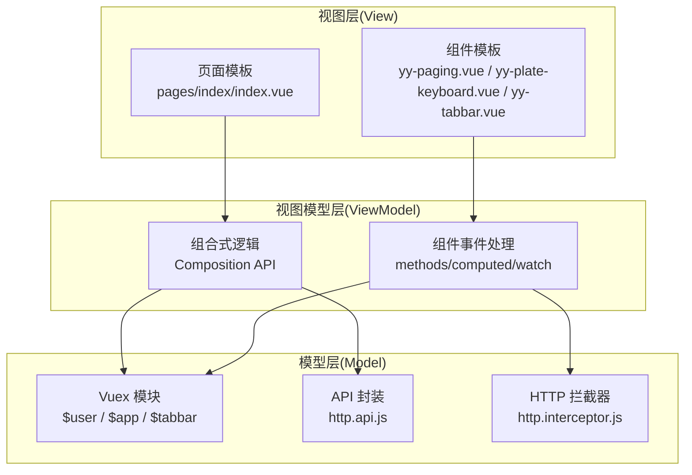
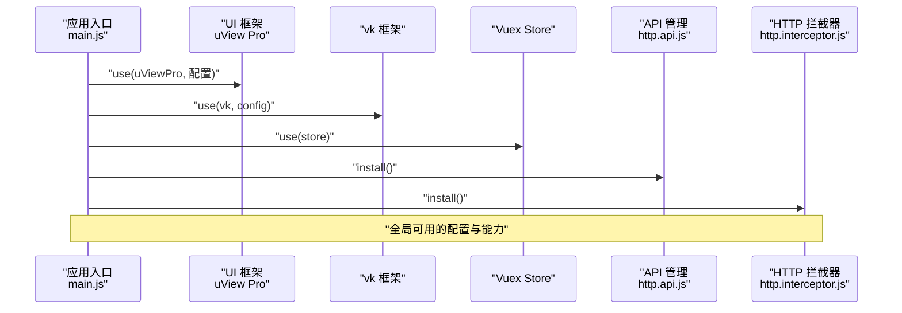
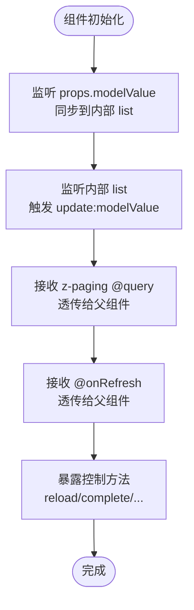
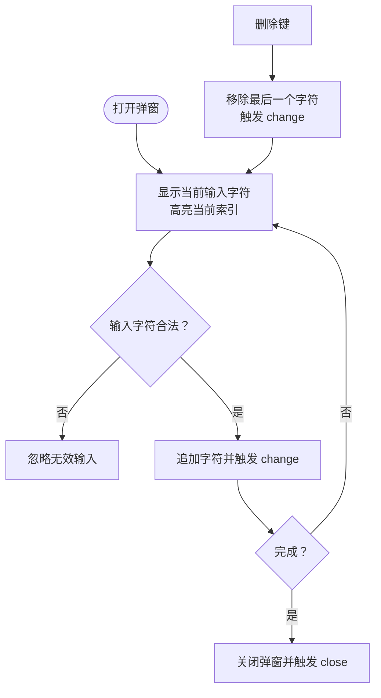
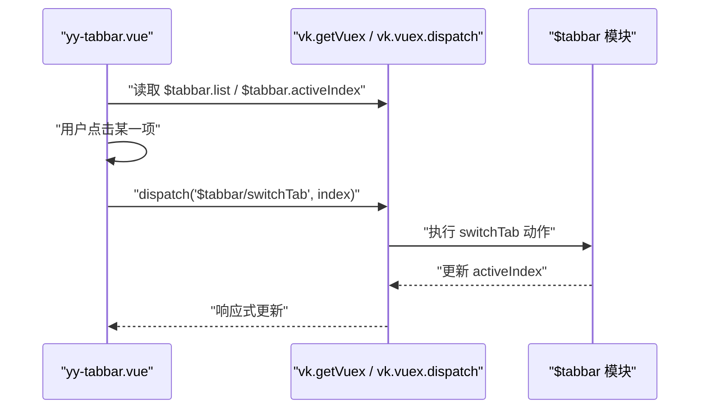
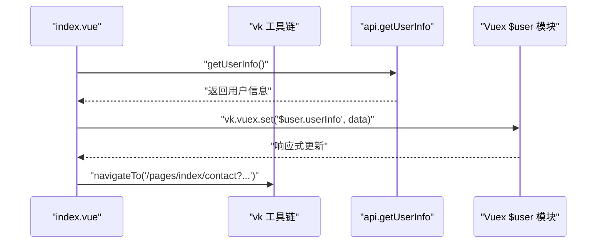
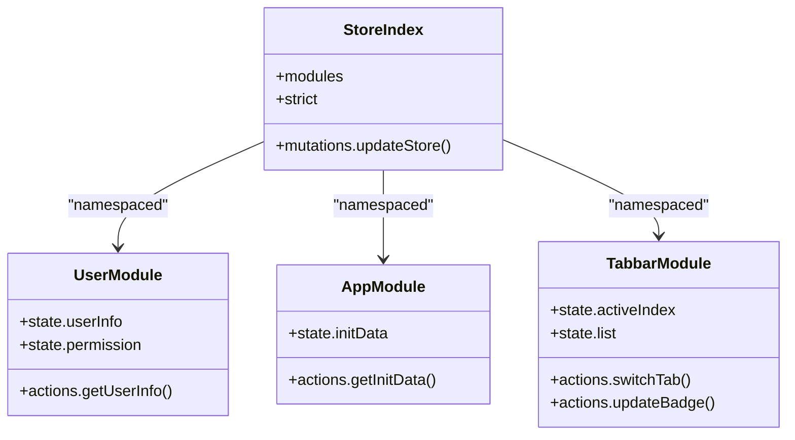
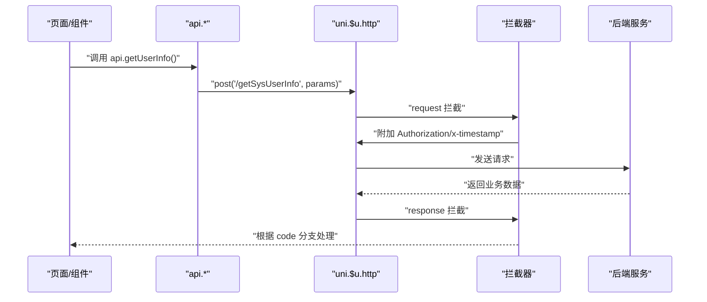
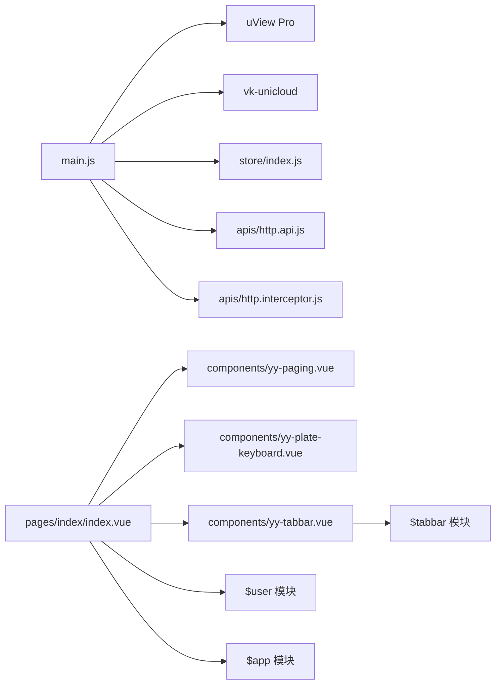

# 前端架构设计

<cite>
**本文引用的文件**
- [main.js](file://main.js)
- [App.vue](file://App.vue)
- [pages.json](file://pages.json)
- [store/index.js](file://store/index.js)
- [store/modules/$user.js](file://store/modules/$user.js)
- [store/modules/$app.js](file://store/modules/$app.js)
- [store/modules/$tabbar.js](file://store/modules/$tabbar.js)
- [components/yy-tabbar.vue](file://components/yy-tabbar.vue)
- [components/yy-paging.vue](file://components/yy-paging.vue)
- [components/yy-plate-keyboard.vue](file://components/yy-plate-keyboard.vue)
- [pages/index/index.vue](file://pages/index/index.vue)
- [apis/http.api.js](file://apis/http.api.js)
- [apis/http.interceptor.js](file://apis/http.interceptor.js)
- [app.config.js](file://app.config.js)
- [tsconfig.json](file://tsconfig.json)
</cite>

## 目录
1. [简介](#简介)
2. [项目结构](#项目结构)
3. [核心组件](#核心组件)
4. [架构总览](#架构总览)
5. [详细组件分析](#详细组件分析)
6. [依赖分析](#依赖分析)
7. [性能考虑](#性能考虑)
8. [故障排查指南](#故障排查指南)
9. [结论](#结论)
10. [附录](#附录)

## 简介
本文件面向“挪车助手”项目的前端架构设计，围绕基于 Vue 3 + TypeScript 的实现展开，系统性阐述应用入口配置、组件化设计模式、状态管理架构与路由配置，并深入解析 MVVM 架构模式在项目中的落地实践，包括数据绑定、事件处理与组件通信机制。同时覆盖 Composition API 的使用、TypeScript 类型定义、组件生命周期管理以及性能优化策略，并通过图示与路径引用展示架构设计原则的具体应用。

## 项目结构
项目采用“页面 + 组件 + 模块化状态 + API 管理 + 配置中心”的组织方式：
- 应用入口与全局插件注册位于应用根目录，统一在入口中装配 UI 框架、状态库、拦截器与 API 管理模块。
- 页面按功能划分，如首页、我的、登录等，页面内通过组合式 API 与组件协作完成业务。
- 组件以可复用为目标，如分页容器、车牌键盘、底部 TabBar 等，形成通用 UI 与交互能力。
- 状态管理采用模块化 Vuex（兼容 Vue 3），按领域拆分模块，如用户、应用初始化、TabBar 等。
- API 层通过集中封装与拦截器统一处理请求头、鉴权、错误提示与业务码映射。

**图表来源**
- [main.js:1-49](file://main.js#L1-L49)
- [app.config.js:1-111](file://app.config.js#L1-L111)
- [pages.json:1-87](file://pages.json#L1-L87)
- [store/index.js:1-136](file://store/index.js#L1-L136)
- [store/modules/$user.js:1-26](file://store/modules/$user.js#L1-L26)
- [store/modules/$app.js:1-36](file://store/modules/$app.js#L1-L36)
- [store/modules/$tabbar.js:1-78](file://store/modules/$tabbar.js#L1-L78)
- [components/yy-paging.vue:1-339](file://components/yy-paging.vue#L1-L339)
- [components/yy-plate-keyboard.vue:1-317](file://components/yy-plate-keyboard.vue#L1-L317)
- [components/yy-tabbar.vue:1-38](file://components/yy-tabbar.vue#L1-L38)
- [pages/index/index.vue:1-720](file://pages/index/index.vue#L1-L720)
- [apis/http.api.js:1-32](file://apis/http.api.js#L1-L32)
- [apis/http.interceptor.js:1-116](file://apis/http.interceptor.js#L1-L116)

**章节来源**
- [main.js:1-49](file://main.js#L1-L49)
- [pages.json:1-87](file://pages.json#L1-L87)

## 核心组件
- 应用入口与插件装配：在入口中注册 UI 框架、状态库、API 管理与拦截器，确保全局可用。
- 页面容器组件：分页容器组件统一封装列表、刷新、空态、TabBar 显示等通用能力，降低页面复杂度。
- 业务组件：如车牌键盘组件，负责输入校验、光标与布局动画，提升交互体验。
- 底部导航组件：与状态模块联动，实现 TabBar 切换与徽标更新。
- 状态模块：用户、应用初始化、TabBar 等模块化状态，支持持久化与命名空间隔离。
- API 管理与拦截器：集中定义接口与环境配置，统一处理鉴权头、业务码与错误提示。

**章节来源**
- [components/yy-paging.vue:1-339](file://components/yy-paging.vue#L1-L339)
- [components/yy-plate-keyboard.vue:1-317](file://components/yy-plate-keyboard.vue#L1-L317)
- [components/yy-tabbar.vue:1-38](file://components/yy-tabbar.vue#L1-L38)
- [store/modules/$user.js:1-26](file://store/modules/$user.js#L1-L26)
- [store/modules/$app.js:1-36](file://store/modules/$app.js#L1-L36)
- [store/modules/$tabbar.js:1-78](file://store/modules/$tabbar.js#L1-L78)
- [apis/http.api.js:1-32](file://apis/http.api.js#L1-L32)
- [apis/http.interceptor.js:1-116](file://apis/http.interceptor.js#L1-L116)

## 架构总览
整体采用 MVVM 架构：
- Model：Vuex 模块与 API 层，承载业务数据与服务调用。
- View：页面与组件模板，负责渲染与事件绑定。
- ViewModel：Composition API 与组件逻辑，协调 Model 与 View 的数据流与交互。

**图表来源**
- [pages/index/index.vue:134-299](file://pages/index/index.vue#L134-L299)
- [components/yy-paging.vue:129-331](file://components/yy-paging.vue#L129-L331)
- [components/yy-plate-keyboard.vue:83-166](file://components/yy-plate-keyboard.vue#L83-L166)
- [components/yy-tabbar.vue:13-37](file://components/yy-tabbar.vue#L13-L37)
- [store/modules/$user.js:1-26](file://store/modules/$user.js#L1-L26)
- [store/modules/$app.js:1-36](file://store/modules/$app.js#L1-L36)
- [store/modules/$tabbar.js:1-78](file://store/modules/$tabbar.js#L1-L78)
- [apis/http.api.js:11-32](file://apis/http.api.js#L11-L32)
- [apis/http.interceptor.js:37-116](file://apis/http.interceptor.js#L37-L116)

## 详细组件分析

### 应用入口与全局装配
- 注册 UI 框架与主题：通过 UI 框架插件注入主题集合与默认主题、暗黑模式。
- 集成 vk 框架：提供统一的工具与状态桥接能力。
- 装配状态管理：安装 Vuex Store，自动扫描模块并启用严格模式。
- API 管理与拦截器：设置基础 URL 并暴露全局 API 对象；注册请求/响应拦截器，统一处理鉴权头与业务码。

**图表来源**
- [main.js:22-47](file://main.js#L22-L47)
- [apis/http.api.js:11-14](file://apis/http.api.js#L11-L14)
- [apis/http.interceptor.js:37-47](file://apis/http.interceptor.js#L37-L47)

**章节来源**
- [main.js:1-49](file://main.js#L1-L49)
- [apis/http.api.js:1-32](file://apis/http.api.js#L1-L32)
- [apis/http.interceptor.js:1-116](file://apis/http.interceptor.js#L1-L116)

### 页面容器组件（yy-paging）
- 职责：封装 z-paging，提供统一的列表加载、刷新、空态、TabBar 与导航栏插槽。
- 数据绑定：通过 v-model 双向绑定列表数据，内部维护 list 并与父组件同步。
- 事件透传：将 query、onRefresh、scrolltolower 等事件原样抛出，供页面处理。
- 能力扩展：提供 expose 方法，允许父组件调用 reload、complete、scrollToTop 等控制方法。

**图表来源**
- [components/yy-paging.vue:263-331](file://components/yy-paging.vue#L263-L331)

**章节来源**
- [components/yy-paging.vue:1-339](file://components/yy-paging.vue#L1-L339)

### 车牌键盘组件（yy-plate-keyboard）
- 职责：提供符合中国车牌规范的输入界面，包含省份选择、字母数字键盘与删除键。
- 数据绑定：通过 v-model 控制可见性与输入值，内部计算当前索引与显示字符数组。
- 交互逻辑：限制输入长度与非法字符（如 I/O），支持删除与完成回调。

**图表来源**
- [components/yy-plate-keyboard.vue:142-166](file://components/yy-plate-keyboard.vue#L142-L166)

**章节来源**
- [components/yy-plate-keyboard.vue:1-317](file://components/yy-plate-keyboard.vue#L1-L317)

### 底部导航组件（yy-tabbar）
- 职责：基于 UI 组件库的 TabBar，与状态模块联动，实现选中态与切换事件。
- 数据绑定：v-model 绑定 activeIndex，list 来源于状态模块。
- 事件处理：onChange 触发状态模块的 switchTab 动作，实现跨页面切换。

**图表来源**
- [components/yy-tabbar.vue:13-37](file://components/yy-tabbar.vue#L13-L37)
- [store/modules/$tabbar.js:49-77](file://store/modules/$tabbar.js#L49-L77)

**章节来源**
- [components/yy-tabbar.vue:1-38](file://components/yy-tabbar.vue#L1-L38)
- [store/modules/$tabbar.js:1-78](file://store/modules/$tabbar.js#L1-L78)

### 首页业务页面（pages/index/index.vue）
- 职责：实现“输入车牌号联系车主”的主流程，包含车牌输入、历史记录、扫码入口与功能入口。
- 组合式逻辑：使用 ref/computed/onLoad/onShow 管理状态与生命周期；通过 vk 工具链进行页面跳转与存储。
- 事件处理：点击联系按钮保存历史并跳转联系页；扫码解析 JSON 数据并跳转联系页。
- 样式与主题：动态计算卡片与按钮样式，使用 UI 框架主题色实现渐变与阴影。

**图表来源**
- [pages/index/index.vue:134-299](file://pages/index/index.vue#L134-L299)
- [store/modules/$user.js:16-25](file://store/modules/$user.js#L16-L25)

**章节来源**
- [pages/index/index.vue:1-720](file://pages/index/index.vue#L1-L720)
- [store/modules/$user.js:1-26](file://store/modules/$user.js#L1-L26)

### 状态管理架构（Vuex 模块化）
- 模块扫描：入口自动扫描 modules 目录，构建命名空间模块并合并。
- 持久化策略：对非临时模块进行本地持久化，支持多层级状态更新与保存。
- 严格模式：开发环境下启用严格模式，便于调试与定位问题。
- 业务模块：
  - 用户模块：管理用户信息、权限、邀请码、历史数据等。
  - 应用模块：管理初始化数据、网络状态、经纬度等。
  - TabBar 模块：管理当前激活索引与列表配置，提供切换与徽标更新动作。

**图表来源**
- [store/index.js:17-133](file://store/index.js#L17-L133)
- [store/modules/$user.js:5-25](file://store/modules/$user.js#L5-L25)
- [store/modules/$app.js:7-35](file://store/modules/$app.js#L7-L35)
- [store/modules/$tabbar.js:5-77](file://store/modules/$tabbar.js#L5-L77)

**章节来源**
- [store/index.js:1-136](file://store/index.js#L1-L136)
- [store/modules/$user.js:1-26](file://store/modules/$user.js#L1-L26)
- [store/modules/$app.js:1-36](file://store/modules/$app.js#L1-L36)
- [store/modules/$tabbar.js:1-78](file://store/modules/$tabbar.js#L1-L78)

### API 管理与拦截器
- API 管理：集中定义接口方法，通过统一工厂函数生成请求函数，并在入口中设置基础 URL 与全局暴露。
- 拦截器：请求阶段注入鉴权头与平台信息；响应阶段根据业务码统一处理错误提示与登录态失效场景。

**图表来源**
- [apis/http.api.js:11-32](file://apis/http.api.js#L11-L32)
- [apis/http.interceptor.js:37-116](file://apis/http.interceptor.js#L37-L116)

**章节来源**
- [apis/http.api.js:1-32](file://apis/http.api.js#L1-L32)
- [apis/http.interceptor.js:1-116](file://apis/http.interceptor.js#L1-L116)

## 依赖分析
- 入口依赖：UI 框架、vk 框架、Vuex、API 管理、HTTP 拦截器。
- 页面依赖：组件库与自研组件（yy-paging、yy-plate-keyboard、yy-tabbar）。
- 状态依赖：模块化 Vuex，按需命名空间访问。
- 配置依赖：全局配置文件提供页面跳转、登录态检查、静态资源等策略。

**图表来源**
- [main.js:1-49](file://main.js#L1-L49)
- [pages/index/index.vue:1-720](file://pages/index/index.vue#L1-L720)
- [components/yy-paging.vue:1-339](file://components/yy-paging.vue#L1-L339)
- [components/yy-plate-keyboard.vue:1-317](file://components/yy-plate-keyboard.vue#L1-L317)
- [components/yy-tabbar.vue:1-38](file://components/yy-tabbar.vue#L1-L38)
- [store/modules/$tabbar.js:1-78](file://store/modules/$tabbar.js#L1-L78)
- [store/modules/$user.js:1-26](file://store/modules/$user.js#L1-L26)
- [store/modules/$app.js:1-36](file://store/modules/$app.js#L1-L36)

**章节来源**
- [main.js:1-49](file://main.js#L1-L49)
- [pages/index/index.vue:1-720](file://pages/index/index.vue#L1-L720)

## 性能考虑
- 列表性能：分页组件支持虚拟列表与滚动采样参数，适合大数据场景；建议在数据量较大时开启虚拟列表并合理设置采样帧率。
- 事件节流：在高频滚动与刷新场景，结合组件提供的防抖/节流策略减少重绘与请求次数。
- 状态持久化：对非临时模块进行本地持久化，避免重复初始化；注意字段变更时的兼容处理。
- 图标与样式：使用主题色与渐变样式减少重复计算，避免在渲染路径中做昂贵的样式计算。
- 资源加载：图片与静态资源尽量使用 CDN 与懒加载策略，减少首屏压力。

## 故障排查指南
- 登录态失效：拦截器对 401 场景统一提示并阻止重复弹框，必要时引导至登录页。
- 业务错误：根据业务码分支处理，统一错误提示与日志摘要复制能力。
- 网络异常：对超时、系统错误等进行统一兜底，提供可读性强的提示文案。
- 页面跳转：使用统一工具链进行页面跳转，避免直接使用平台原生 API 导致规则失效。

**章节来源**
- [apis/http.interceptor.js:57-113](file://apis/http.interceptor.js#L57-L113)

## 结论
本项目通过清晰的入口装配、模块化的状态管理与可复用的组件体系，实现了 MVVM 架构在移动端多端平台的稳定落地。Composition API 与 TypeScript 的结合提升了代码可维护性与类型安全；统一的 API 管理与拦截器保障了前后端交互的一致性与健壮性。建议在后续迭代中持续优化列表性能、完善错误监控与埋点，并保持模块边界清晰与组件抽象一致。

## 附录
- TypeScript 配置要点：启用严格模式、显式类型声明、全局类型路径与 Vue 编译器选项，确保类型推导与自动导入一致。
- 页面配置：通过 pages.json 实现页面扫描与组件自动补全，简化页面与组件引用。

**章节来源**
- [tsconfig.json:1-38](file://tsconfig.json#L1-L38)
- [pages.json:1-87](file://pages.json#L1-L87)