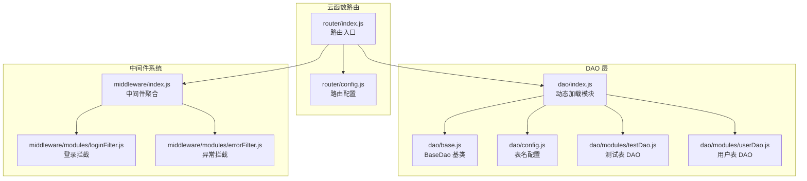
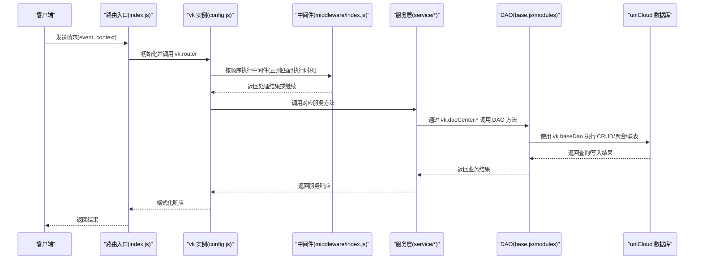
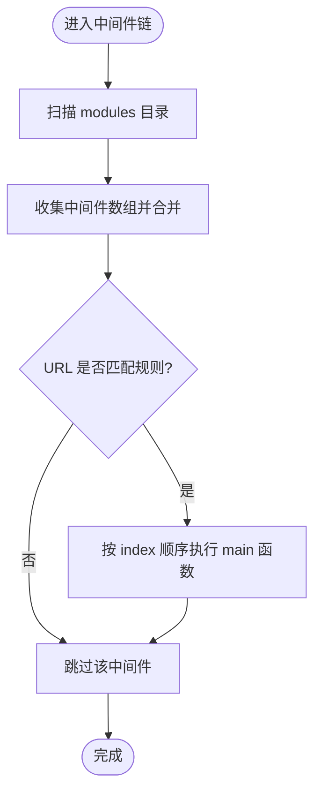
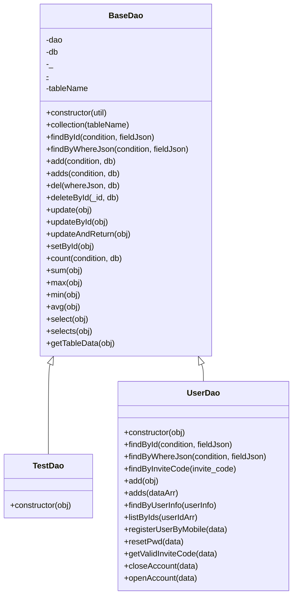
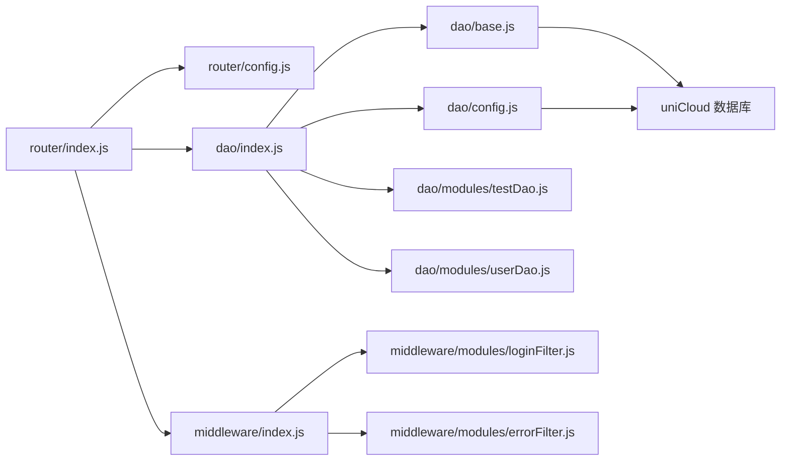

# 后端架构设计

<cite>
**本文档引用的文件**
- [router/index.js](file://uniCloud-aliyun/cloudfunctions/router/index.js)
- [router/config.js](file://uniCloud-aliyun/cloudfunctions/router/config.js)
- [router/dao/index.js](file://uniCloud-aliyun/cloudfunctions/router/dao/index.js)
- [router/dao/base.js](file://uniCloud-aliyun/cloudfunctions/router/dao/base.js)
- [router/dao/config.js](file://uniCloud-aliyun/cloudfunctions/router/dao/config.js)
- [router/dao/modules/testDao.js](file://uniCloud-aliyun/cloudfunctions/router/dao/modules/testDao.js)
- [router/dao/modules/userDao.js](file://uniCloud-aliyun/cloudfunctions/router/dao/modules/userDao.js)
- [router/middleware/index.js](file://uniCloud-aliyun/cloudfunctions/router/middleware/index.js)
- [router/middleware/modules/loginFilter.js](file://uniCloud-aliyun/cloudfunctions/router/middleware/modules/loginFilter.js)
- [router/middleware/modules/errorFilter.js](file://uniCloud-aliyun/cloudfunctions/router/middleware/modules/errorFilter.js)
- [database/uni-id-users.schema.json](file://uniCloud-aliyun/database/uni-id-users.schema.json)
</cite>

## 目录
1. [简介](#简介)
2. [项目结构](#项目结构)
3. [核心组件](#核心组件)
4. [架构总览](#架构总览)
5. [详细组件分析](#详细组件分析)
6. [依赖关系分析](#依赖关系分析)
7. [性能考虑](#性能考虑)
8. [故障排查指南](#故障排查指南)
9. [结论](#结论)

## 简介
本项目采用基于 uniCloud 的云开发架构，围绕 vk-unicloud 框架构建云函数路由系统、中间件机制与 DAO 层设计模式。通过统一的路由入口、自动化的中间件加载、面向对象的 DAO 基类与按表命名的模块化 DAO，形成清晰的分层结构：路由层负责请求接入与上下文注入，中间件层负责鉴权、校验与异常捕获，DAO 层负责数据访问与业务封装，数据库层提供结构化 Schema 与索引配置。

## 项目结构
云函数根目录 router 下包含三大核心子系统：
- 路由系统：入口文件与配置，负责初始化 vk 实例并交由框架处理请求
- DAO 层：统一的 BaseDao 基类与按表划分的模块 DAO，提供 CRUD、聚合、联表、事务等能力
- 中间件系统：集中加载模块化中间件，支持正则匹配、执行时机与顺序控制

**图表来源**
- [router/index.js:1-8](file://uniCloud-aliyun/cloudfunctions/router/index.js#L1-L8)
- [router/config.js:1-9](file://uniCloud-aliyun/cloudfunctions/router/config.js#L1-L9)
- [router/dao/index.js:1-36](file://uniCloud-aliyun/cloudfunctions/router/dao/index.js#L1-L36)
- [router/dao/base.js:1-697](file://uniCloud-aliyun/cloudfunctions/router/dao/base.js#L1-L697)
- [router/dao/config.js:1-67](file://uniCloud-aliyun/cloudfunctions/router/dao/config.js#L1-L67)
- [router/dao/modules/testDao.js:1-151](file://uniCloud-aliyun/cloudfunctions/router/dao/modules/testDao.js#L1-L151)
- [router/dao/modules/userDao.js:1-568](file://uniCloud-aliyun/cloudfunctions/router/dao/modules/userDao.js#L1-L568)
- [router/middleware/index.js:1-34](file://uniCloud-aliyun/cloudfunctions/router/middleware/index.js#L1-L34)
- [router/middleware/modules/loginFilter.js:1-53](file://uniCloud-aliyun/cloudfunctions/router/middleware/modules/loginFilter.js#L1-L53)
- [router/middleware/modules/errorFilter.js:1-60](file://uniCloud-aliyun/cloudfunctions/router/middleware/modules/errorFilter.js#L1-L60)

**章节来源**
- [router/index.js:1-8](file://uniCloud-aliyun/cloudfunctions/router/index.js#L1-L8)
- [router/config.js:1-9](file://uniCloud-aliyun/cloudfunctions/router/config.js#L1-L9)
- [router/dao/index.js:1-36](file://uniCloud-aliyun/cloudfunctions/router/dao/index.js#L1-L36)
- [router/middleware/index.js:1-34](file://uniCloud-aliyun/cloudfunctions/router/middleware/index.js#L1-L34)

## 核心组件
- 路由入口与初始化
  - 路由入口文件引入 vk-unicloud 并通过配置创建 vk 实例，将 event/context/vk 交由框架执行路由分发
  - 配置项包含 baseDir 与自定义 requireFn，确保模块解析与相对路径正确
- DAO 层设计
  - BaseDao 提供统一的 CRUD、聚合、联表、事务、分页等能力，并通过 vk.baseDao 与 uniCloud 数据库交互
  - DAO 模块按表划分，继承 BaseDao 并设置 tableName，实现业务方法的封装
  - 表名集中配置在 config.js，便于维护与迁移
- 中间件系统
  - 中间件通过模块目录自动扫描加载，支持正则匹配、执行顺序与两种执行时机（执行前/异常时）
  - 提供登录拦截与全局异常拦截等典型场景

**章节来源**
- [router/index.js:1-8](file://uniCloud-aliyun/cloudfunctions/router/index.js#L1-L8)
- [router/config.js:1-9](file://uniCloud-aliyun/cloudfunctions/router/config.js#L1-L9)
- [router/dao/base.js:1-697](file://uniCloud-aliyun/cloudfunctions/router/dao/base.js#L1-L697)
- [router/dao/config.js:1-67](file://uniCloud-aliyun/cloudfunctions/router/dao/config.js#L1-L67)
- [router/middleware/index.js:1-34](file://uniCloud-aliyun/cloudfunctions/router/middleware/index.js#L1-L34)

## 架构总览
下图展示从客户端请求到数据库访问的整体流程，以及 vk-unicloud 框架在其中的角色。

**图表来源**
- [router/index.js:1-8](file://uniCloud-aliyun/cloudfunctions/router/index.js#L1-L8)
- [router/config.js:1-9](file://uniCloud-aliyun/cloudfunctions/router/config.js#L1-L9)
- [router/middleware/index.js:1-34](file://uniCloud-aliyun/cloudfunctions/router/middleware/index.js#L1-L34)
- [router/dao/base.js:1-697](file://uniCloud-aliyun/cloudfunctions/router/dao/base.js#L1-L697)

## 详细组件分析

### 路由系统
- 路由入口
  - 引入 vk-unicloud，创建 vk 实例并调用 vk.router 处理事件
- 路由配置
  - 指定 baseDir 与 requireFn，保证模块加载路径正确

**章节来源**
- [router/index.js:1-8](file://uniCloud-aliyun/cloudfunctions/router/index.js#L1-L8)
- [router/config.js:1-9](file://uniCloud-aliyun/cloudfunctions/router/config.js#L1-L9)

### 中间件机制
- 中间件聚合
  - 自动扫描 modules 目录，收集所有模块导出的中间件数组，合并为全局中间件列表
- 登录拦截中间件
  - 通过正则匹配登录/注册相关 URL，根据规则启用/禁用对应方式
- 异常拦截中间件
  - 捕获 onActionError，将错误信息写入 vk-error-log 表，支持去重与上下文识别

**图表来源**
- [router/middleware/index.js:1-34](file://uniCloud-aliyun/cloudfunctions/router/middleware/index.js#L1-L34)
- [router/middleware/modules/loginFilter.js:1-53](file://uniCloud-aliyun/cloudfunctions/router/middleware/modules/loginFilter.js#L1-L53)
- [router/middleware/modules/errorFilter.js:1-60](file://uniCloud-aliyun/cloudfunctions/router/middleware/modules/errorFilter.js#L1-L60)

**章节来源**
- [router/middleware/index.js:1-34](file://uniCloud-aliyun/cloudfunctions/router/middleware/index.js#L1-L34)
- [router/middleware/modules/loginFilter.js:1-53](file://uniCloud-aliyun/cloudfunctions/router/middleware/modules/loginFilter.js#L1-L53)
- [router/middleware/modules/errorFilter.js:1-60](file://uniCloud-aliyun/cloudfunctions/router/middleware/modules/errorFilter.js#L1-L60)

### DAO 层设计模式
- BaseDao 基类
  - 提供 findById/add/adds/del/deleteById/update/updateById/updateAndReturn/setById/count/sum/max/min/avg/select/selects/getTableData 等方法
  - 支持事务(db 对象)、聚合管道、联表查询、树形结构查询、地理查询等高级能力
  - 通过 vk.baseDao 与 uniCloud 数据库交互，统一字段过滤、时间戳处理等细节
- DAO 模块
  - 按表划分，继承 BaseDao 并设置 tableName
  - 可重写方法以实现业务定制，如 UserDao 中对用户字段的默认过滤、邀请码查询、注册/注销等业务方法
- 表名配置
  - 统一维护所有表名常量，便于跨模块引用与迁移

**图表来源**
- [router/dao/base.js:1-697](file://uniCloud-aliyun/cloudfunctions/router/dao/base.js#L1-L697)
- [router/dao/modules/testDao.js:1-151](file://uniCloud-aliyun/cloudfunctions/router/dao/modules/testDao.js#L1-L151)
- [router/dao/modules/userDao.js:1-568](file://uniCloud-aliyun/cloudfunctions/router/dao/modules/userDao.js#L1-L568)

**章节来源**
- [router/dao/base.js:1-697](file://uniCloud-aliyun/cloudfunctions/router/dao/base.js#L1-L697)
- [router/dao/modules/testDao.js:1-151](file://uniCloud-aliyun/cloudfunctions/router/dao/modules/testDao.js#L1-L151)
- [router/dao/modules/userDao.js:1-568](file://uniCloud-aliyun/cloudfunctions/router/dao/modules/userDao.js#L1-L568)
- [router/dao/config.js:1-67](file://uniCloud-aliyun/cloudfunctions/router/dao/config.js#L1-L67)

### 业务逻辑封装示例
- 用户表业务封装
  - 默认字段过滤：避免敏感字段泄露
  - 邀请码查询、手机号一键注册登录、密码重置、唯一邀请码生成、注销/恢复账号等
- 测试表业务封装
  - 提供 CRUD 与查询示例，便于新表快速接入

**章节来源**
- [router/dao/modules/userDao.js:1-568](file://uniCloud-aliyun/cloudfunctions/router/dao/modules/userDao.js#L1-L568)
- [router/dao/modules/testDao.js:1-151](file://uniCloud-aliyun/cloudfunctions/router/dao/modules/testDao.js#L1-L151)

## 依赖关系分析
- 路由层依赖 vk-unicloud 框架与中间件、DAO 模块
- DAO 层依赖 vk.baseDao 与 uniCloud 数据库命令
- 中间件层通过正则与执行顺序控制请求流
- 数据库层通过 Schema 定义约束与索引

**图表来源**
- [router/index.js:1-8](file://uniCloud-aliyun/cloudfunctions/router/index.js#L1-L8)
- [router/config.js:1-9](file://uniCloud-aliyun/cloudfunctions/router/config.js#L1-L9)
- [router/middleware/index.js:1-34](file://uniCloud-aliyun/cloudfunctions/router/middleware/index.js#L1-L34)
- [router/dao/index.js:1-36](file://uniCloud-aliyun/cloudfunctions/router/dao/index.js#L1-L36)
- [router/dao/base.js:1-697](file://uniCloud-aliyun/cloudfunctions/router/dao/base.js#L1-L697)
- [router/dao/config.js:1-67](file://uniCloud-aliyun/cloudfunctions/router/dao/config.js#L1-L67)
- [router/middleware/modules/loginFilter.js:1-53](file://uniCloud-aliyun/cloudfunctions/router/middleware/modules/loginFilter.js#L1-L53)
- [router/middleware/modules/errorFilter.js:1-60](file://uniCloud-aliyun/cloudfunctions/router/middleware/modules/errorFilter.js#L1-L60)

**章节来源**
- [router/index.js:1-8](file://uniCloud-aliyun/cloudfunctions/router/index.js#L1-L8)
- [router/dao/index.js:1-36](file://uniCloud-aliyun/cloudfunctions/router/dao/index.js#L1-L36)
- [router/middleware/index.js:1-34](file://uniCloud-aliyun/cloudfunctions/router/middleware/index.js#L1-L34)

## 性能考虑
- 分页与大数据查询
  - BaseDao.select 支持分页与 selectAll 模式，当 pageSize > 1000 时自动切换为分批查询，降低内存压力
- 聚合与联表
  - BaseDao.selects 支持多表联表、分组、树形结构、地理查询等，但需谨慎使用 lastWhereJson/lastSortArr，避免在聚合后再次过滤导致性能下降
- 字段过滤
  - DAO 模块可设置默认字段过滤，减少网络传输与序列化开销
- 事务与批量操作
  - 支持事务与批量写入，注意控制事务时长与批量大小，避免超时
- 中间件顺序
  - 合理设置中间件 index，将高频校验前置，异常拦截置于末尾

[本节为通用指导，无需具体文件引用]

## 故障排查指南
- 异常拦截
  - 全局异常中间件会将错误信息写入 vk-error-log 表，包含请求 ID、URL、参数与状态，便于定位问题
- 中间件异常
  - 中间件加载异常会输出错误日志，检查模块路径与导出格式
- DAO 异常
  - BaseDao 抛出的异常可通过异常中间件统一记录，结合请求 ID 快速回溯

**章节来源**
- [router/middleware/modules/errorFilter.js:1-60](file://uniCloud-aliyun/cloudfunctions/router/middleware/modules/errorFilter.js#L1-L60)
- [router/dao/index.js:1-36](file://uniCloud-aliyun/cloudfunctions/router/dao/index.js#L1-L36)

## 结论
本项目通过 vk-unicloud 框架实现了清晰的云函数路由、可扩展的中间件体系与面向对象的 DAO 层设计。路由层统一入口与配置，中间件层提供横切关注点（鉴权、校验、异常），DAO 层封装数据访问与业务逻辑，数据库层以 Schema 明确约束。该架构具备良好的可维护性与扩展性，适合在 uniCloud 平台上快速迭代业务功能。