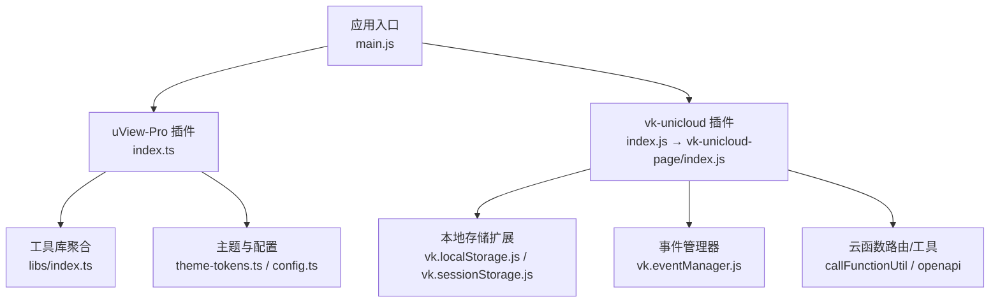
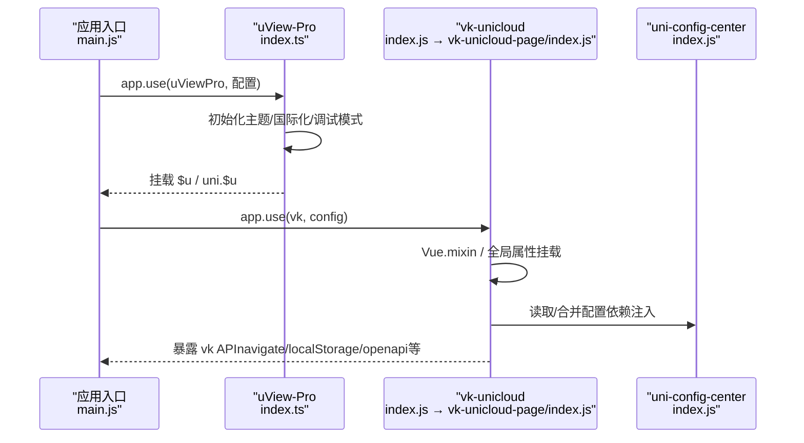
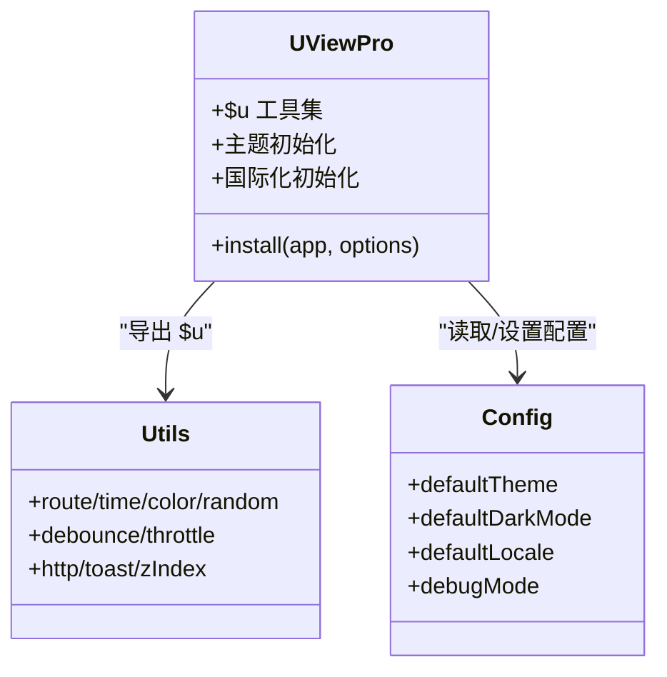
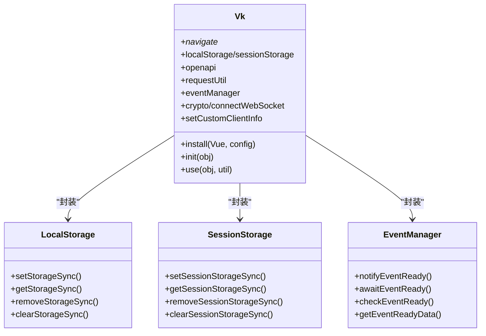
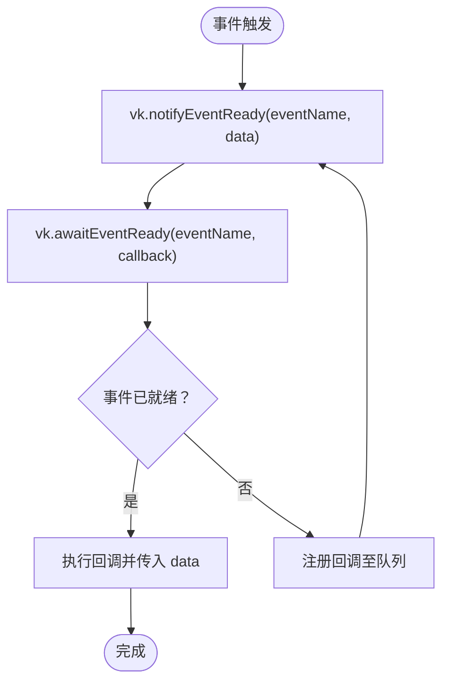
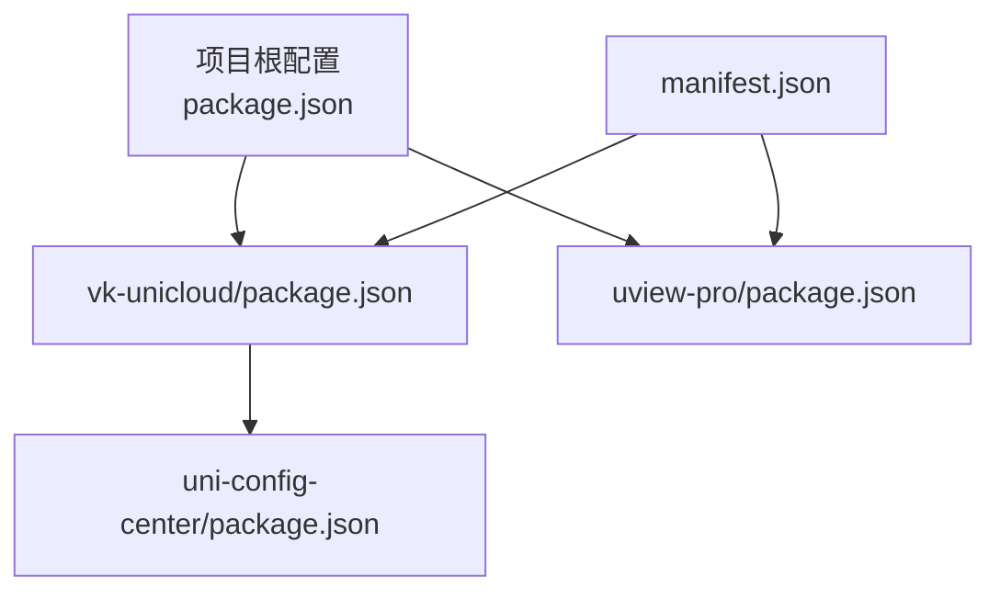

# 插件化架构设计

<cite>
**本文档引用的文件**
- [package.json](file://package.json)
- [main.js](file://main.js)
- [manifest.json](file://manifest.json)
- [uni_modules/vk-unicloud/package.json](file://uni_modules/vk-unicloud/package.json)
- [uni_modules/vk-unicloud/index.js](file://uni_modules/vk-unicloud/index.js)
- [uni_modules/vk-unicloud/vk_modules/vk-unicloud-page/index.js](file://uni_modules/vk-unicloud/vk_modules/vk-unicloud-page/index.js)
- [uni_modules/vk-unicloud/vk_modules/vk-unicloud-page/libs/function/vk.localStorage.js](file://uni_modules/vk-unicloud/vk_modules/vk-unicloud-page/libs/function/vk.localStorage.js)
- [uni_modules/vk-unicloud/vk_modules/vk-unicloud-page/libs/function/vk.sessionStorage.js](file://uni_modules/vk-unicloud/vk_modules/vk-unicloud-page/libs/function/vk.sessionStorage.js)
- [uni_modules/vk-unicloud/vk_modules/vk-unicloud-page/libs/function/vk.eventManager.js](file://uni_modules/vk-unicloud/vk_modules/vk-unicloud-page/libs/function/vk.eventManager.js)
- [uni_modules/uview-pro/package.json](file://uni_modules/uview-pro/package.json)
- [uni_modules/uview-pro/index.ts](file://uni_modules/uview-pro/index.ts)
- [uni_modules/uview-pro/libs/index.ts](file://uni_modules/uview-pro/libs/index.ts)
- [uni_modules/uview-pro/libs/config/theme-tokens.ts](file://uni_modules/uview-pro/libs/config/theme-tokens.ts)
- [uni_modules/uview-pro/libs/config/config.ts](file://uni_modules/uview-pro/libs/config/config.ts)
- [uni_modules/uni-config-center/package.json](file://uni_modules/uni-config-center/package.json)
- [uni_modules/uni-config-center/uniCloud/cloudfunctions/common/uni-config-center/index.js](file://uni_modules/uni-config-center/uniCloud/cloudfunctions/common/uni-config-center/index.js)
</cite>

## 目录
1. [引言](#引言)
2. [项目结构](#项目结构)
3. [核心组件](#核心组件)
4. [架构总览](#架构总览)
5. [组件详解](#组件详解)
6. [依赖关系分析](#依赖关系分析)
7. [性能考量](#性能考量)
8. [故障排查指南](#故障排查指南)
9. [结论](#结论)
10. [附录](#附录)

## 引言
本设计文档围绕“挪车助手”项目的插件化架构展开，重点阐述 uni-app 插件系统的使用与扩展机制，聚焦以下目标：
- 解释 vk-unicloud、uView-Pro 等插件的集成方式与配置要点
- 说明插件的安装、配置、功能封装与接口暴露机制
- 覆盖插件生命周期管理、依赖注入与版本兼容性处理
- 提供插件开发指南、自定义插件创建与插件间通信机制
- 给出插件发布、更新与维护策略

## 项目结构
项目采用 uni-app 多端统一开发范式，前端通过 main.js 注册插件，云端通过 uniCloud router 与 DAO/Middleware/Service 分层组织。插件以 uni_modules 形式引入，uView-Pro 提供 UI 能力，vk-unicloud 提供云开发与客户端能力。

图表来源
- [main.js:24-48](file://main.js#L24-L48)
- [uni_modules/uview-pro/index.ts:16-92](file://uni_modules/uview-pro/index.ts#L16-L92)
- [uni_modules/vk-unicloud/index.js:1-4](file://uni_modules/vk-unicloud/index.js#L1-L4)
- [uni_modules/vk-unicloud/vk_modules/vk-unicloud-page/index.js:43-136](file://uni_modules/vk-unicloud/vk_modules/vk-unicloud-page/index.js#L43-L136)

章节来源
- [main.js:1-49](file://main.js#L1-L49)
- [package.json:54-110](file://package.json#L54-L110)

## 核心组件
- 插件注册与初始化
  - uView-Pro：通过 app.use 注册，支持主题、国际化、调试模式配置，挂载到全局 $u 与 uni.$u。
  - vk-unicloud：通过 app.use 注册，完成全局混入、过滤器、openapi、callFunctionUtil、权限初始化、store 混入、console 重写等。
- 功能封装与接口暴露
  - uView-Pro：导出 $u 工具集与主题配置，提供国际化、样式转换、HTTP 请求等能力。
  - vk-unicloud：导出 userCenter、navigate、localStorage/sessionStorage、openapi、requestUtil、eventManager、crypto、connectWebSocket、setCustomClientInfo 等。
- 生命周期管理
  - Vue2/Vue3 兼容：在 install/init 中分别处理全局属性挂载与混入。
  - 插件扩展：vk.use 支持动态注入扩展模块并初始化。
- 依赖注入
  - vk-unicloud 依赖 uni-config-center（云配置中心）
  - uView-Pro 无显式插件依赖
- 版本兼容性
  - manifest.json 与各插件 package.json 的 engines 字段约束 uni-app/uni-app-x/HBuilderX 版本
  - 插件 platforms 字段声明多端支持情况

章节来源
- [uni_modules/uview-pro/index.ts:16-92](file://uni_modules/uview-pro/index.ts#L16-L92)
- [uni_modules/vk-unicloud/vk_modules/vk-unicloud-page/index.js:157-202](file://uni_modules/vk-unicloud/vk_modules/vk-unicloud-page/index.js#L157-L202)
- [uni_modules/uni-config-center/package.json:37-81](file://uni_modules/uni-config-center/package.json#L37-L81)
- [manifest.json:252-270](file://manifest.json#L252-L270)

## 架构总览
下图展示应用启动阶段插件装配与初始化流程，以及插件间协作关系。

图表来源
- [main.js:24-48](file://main.js#L24-L48)
- [uni_modules/uview-pro/index.ts:16-92](file://uni_modules/uview-pro/index.ts#L16-L92)
- [uni_modules/vk-unicloud/index.js:1-4](file://uni_modules/vk-unicloud/index.js#L1-L4)
- [uni_modules/vk-unicloud/vk_modules/vk-unicloud-page/index.js:157-202](file://uni_modules/vk-unicloud/vk_modules/vk-unicloud-page/index.js#L157-L202)
- [uni_modules/uni-config-center/uniCloud/cloudfunctions/common/uni-config-center/index.js:1-2](file://uni_modules/uni-config-center/uniCloud/cloudfunctions/common/uni-config-center/index.js#L1-L2)

## 组件详解

### uView-Pro 插件
- 安装与配置
  - 在 main.js 中通过 app.use(uViewPro, options) 安装
  - 支持主题配置（多主题、默认主题、暗黑模式）、国际化、调试模式
  - 将 $u 挂载到 uni 与全局属性，便于组件内直接使用
- 功能封装与接口暴露
  - $u 工具集：路由、时间、颜色、随机、防抖节流、HTTP、toast、zIndex 等
  - 主题系统：默认主题与深色主题配色、CSS 变量映射
  - 国际化：内置语言包与可选的自定义语言配置
- 生命周期与兼容性
  - 通过 install 钩子在 Vue2/Vue3 下分别挂载全局属性
  - 与 uni.$u 协同，确保多端一致的 API 使用体验

图表来源
- [uni_modules/uview-pro/index.ts:16-92](file://uni_modules/uview-pro/index.ts#L16-L92)
- [uni_modules/uview-pro/libs/index.ts:290-332](file://uni_modules/uview-pro/libs/index.ts#L290-L332)
- [uni_modules/uview-pro/libs/config/config.ts:25-57](file://uni_modules/uview-pro/libs/config/config.ts#L25-L57)

章节来源
- [uni_modules/uview-pro/package.json:1-109](file://uni_modules/uview-pro/package.json#L1-L109)
- [uni_modules/uview-pro/index.ts:16-92](file://uni_modules/uview-pro/index.ts#L16-L92)
- [uni_modules/uview-pro/libs/index.ts:1-350](file://uni_modules/uview-pro/libs/index.ts#L1-L350)
- [uni_modules/uview-pro/libs/config/theme-tokens.ts:1-103](file://uni_modules/uview-pro/libs/config/theme-tokens.ts#L1-L103)
- [uni_modules/uview-pro/libs/config/config.ts:1-60](file://uni_modules/uview-pro/libs/config/config.ts#L1-L60)

### vk-unicloud 插件
- 安装与配置
  - 在 main.js 中通过 app.use(vk, config) 安装
  - 支持自定义云函数路由配置、全局错误处理、console 重写
  - 在 Vue2/Vue3 下分别进行全局混入与属性挂载
- 功能封装与接口暴露
  - 用户中心与鉴权：userCenter、getToken/saveToken/checkToken/deleteToken、emit/on/offRefreshToken
  - 导航与事件：navigateTo/redirectTo/reLaunch/switchTab/navigateBack/navigateToHome/navigateToLogin/navigateToMiniProgram、$emit/$on/$once/$off
  - 本地存储：localStorage（pub/kh/sys 分类）、sessionStorage（H5 限定）
  - 开放 API：openapi
  - 请求与导入：requestUtil/request/importObject
  - 事件管理：eventManager（notifyEventReady/awaitEventReady/checkEventReady/getEventReadyData）
  - 加密与 WebSocket：crypto、connectWebSocket
  - 客户端信息：setCustomClientInfo
- 生命周期与扩展机制
  - vk.use 支持动态注入扩展模块并调用其 init(util)
  - 支持插件化扩展与二次封装

图表来源
- [uni_modules/vk-unicloud/vk_modules/vk-unicloud-page/index.js:43-136](file://uni_modules/vk-unicloud/vk_modules/vk-unicloud-page/index.js#L43-L136)
- [uni_modules/vk-unicloud/vk_modules/vk-unicloud-page/libs/function/vk.localStorage.js:1-131](file://uni_modules/vk-unicloud/vk_modules/vk-unicloud-page/libs/function/vk.localStorage.js#L1-L131)
- [uni_modules/vk-unicloud/vk_modules/vk-unicloud-page/libs/function/vk.sessionStorage.js:1-147](file://uni_modules/vk-unicloud/vk_modules/vk-unicloud-page/libs/function/vk.sessionStorage.js#L1-L147)
- [uni_modules/vk-unicloud/vk_modules/vk-unicloud-page/libs/function/vk.eventManager.js:1-116](file://uni_modules/vk-unicloud/vk_modules/vk-unicloud-page/libs/function/vk.eventManager.js#L1-L116)

章节来源
- [uni_modules/vk-unicloud/package.json:1-90](file://uni_modules/vk-unicloud/package.json#L1-L90)
- [uni_modules/vk-unicloud/index.js:1-4](file://uni_modules/vk-unicloud/index.js#L1-L4)
- [uni_modules/vk-unicloud/vk_modules/vk-unicloud-page/index.js:157-202](file://uni_modules/vk-unicloud/vk_modules/vk-unicloud-page/index.js#L157-L202)
- [uni_modules/vk-unicloud/vk_modules/vk-unicloud-page/libs/function/vk.localStorage.js:1-131](file://uni_modules/vk-unicloud/vk_modules/vk-unicloud-page/libs/function/vk.localStorage.js#L1-L131)
- [uni_modules/vk-unicloud/vk_modules/vk-unicloud-page/libs/function/vk.sessionStorage.js:1-147](file://uni_modules/vk-unicloud/vk_modules/vk-unicloud-page/libs/function/vk.sessionStorage.js#L1-L147)
- [uni_modules/vk-unicloud/vk_modules/vk-unicloud-page/libs/function/vk.eventManager.js:1-116](file://uni_modules/vk-unicloud/vk_modules/vk-unicloud-page/libs/function/vk.eventManager.js#L1-L116)

### 插件间通信机制
- 事件管理器（vk.eventManager）
  - 通过 notifyEventReady 与 awaitEventReady 实现跨组件/页面的事件等待与回调执行
  - 支持检查事件状态与获取事件数据，确保执行顺序可控
- 全局对象挂载
  - vk 与 $u 同时挂载到 uni 与全局属性，便于跨组件共享状态与工具方法

图表来源
- [uni_modules/vk-unicloud/vk_modules/vk-unicloud-page/libs/function/vk.eventManager.js:43-93](file://uni_modules/vk-unicloud/vk_modules/vk-unicloud-page/libs/function/vk.eventManager.js#L43-L93)

章节来源
- [uni_modules/vk-unicloud/vk_modules/vk-unicloud-page/libs/function/vk.eventManager.js:1-116](file://uni_modules/vk-unicloud/vk_modules/vk-unicloud-page/libs/function/vk.eventManager.js#L1-L116)

### 本地存储与会话存储
- localStorage
  - 支持 setStorageSync/getStorageSync/removeStorageSync/clearStorageSync
  - 提供存储容量换算与监听回调扩展点
- sessionStorage（H5 限定）
  - 同步封装 sessionStorage，提供 set/get/remove/clear 方法
  - 非 H5 环境输出警告提示

章节来源
- [uni_modules/vk-unicloud/vk_modules/vk-unicloud-page/libs/function/vk.localStorage.js:1-131](file://uni_modules/vk-unicloud/vk_modules/vk-unicloud-page/libs/function/vk.localStorage.js#L1-L131)
- [uni_modules/vk-unicloud/vk_modules/vk-unicloud-page/libs/function/vk.sessionStorage.js:1-147](file://uni_modules/vk-unicloud/vk_modules/vk-unicloud-page/libs/function/vk.sessionStorage.js#L1-L147)

## 依赖关系分析
- 插件依赖
  - vk-unicloud 显式声明依赖 uni-config-center（云配置中心）
  - uView-Pro 无插件依赖
- 多端支持
  - manifest.json 与各插件 package.json 的 platforms 字段描述了小程序、H5、App、快应用等平台支持情况
- 版本约束
  - 各插件 engines 字段限制 HBuilderX/uni-app/uni-app-x 版本
  - 项目 package.json 的 engines 字段与插件保持一致

图表来源
- [package.json:26-30](file://package.json#L26-L30)
- [uni_modules/vk-unicloud/package.json:15-17](file://uni_modules/vk-unicloud/package.json#L15-L17)
- [uni_modules/uview-pro/package.json:20-24](file://uni_modules/uview-pro/package.json#L20-L24)
- [uni_modules/uni-config-center/package.json:11-13](file://uni_modules/uni-config-center/package.json#L11-L13)
- [manifest.json:252-270](file://manifest.json#L252-L270)

章节来源
- [package.json:54-110](file://package.json#L54-L110)
- [uni_modules/vk-unicloud/package.json:38-87](file://uni_modules/vk-unicloud/package.json#L38-L87)
- [uni_modules/uview-pro/package.json:48-106](file://uni_modules/uview-pro/package.json#L48-L106)
- [uni_modules/uni-config-center/package.json:37-81](file://uni_modules/uni-config-center/package.json#L37-L81)

## 性能考量
- 插件初始化开销控制
  - uView-Pro 主题与国际化初始化仅在首次安装时执行，避免重复初始化
  - vk-unicloud 在 install 中进行全局混入与过滤器注册，建议在大型应用中按需启用
- 缓存与存储
  - localStorage/sessionStorage 提供分类缓存，减少重复请求与计算
  - sessionStorage 仅在 H5 环境生效，避免在非 H5 平台产生无效调用
- 网络与请求
  - uView-Pro 的 HTTP 工具与 vk-unicloud 的 requestUtil 提供统一请求封装，建议结合拦截器与缓存策略优化性能

## 故障排查指南
- 插件未生效
  - 检查 main.js 中是否正确调用 app.use 注册插件
  - 确认插件版本与引擎版本满足 engines 要求
- 主题/国际化异常
  - 确认 uView-Pro 安装时传入的 theme/locale 配置格式正确
  - 检查主题令牌与默认主题配置是否一致
- 事件未触发
  - 确认 awaitEventReady 的事件名与 notifyEventReady 一致
  - 检查事件状态与数据是否正确传递
- 存储 API 报错
  - H5 环境使用 sessionStorage，非 H5 输出警告属预期行为
  - localStorage 清理时注意键前缀匹配逻辑

章节来源
- [uni_modules/uview-pro/index.ts:16-92](file://uni_modules/uview-pro/index.ts#L16-L92)
- [uni_modules/uview-pro/libs/config/config.ts:40-45](file://uni_modules/uview-pro/libs/config/config.ts#L40-L45)
- [uni_modules/vk-unicloud/vk_modules/vk-unicloud-page/libs/function/vk.eventManager.js:68-93](file://uni_modules/vk-unicloud/vk_modules/vk-unicloud-page/libs/function/vk.eventManager.js#L68-L93)
- [uni_modules/vk-unicloud/vk_modules/vk-unicloud-page/libs/function/vk.sessionStorage.js:33-36](file://uni_modules/vk-unicloud/vk_modules/vk-unicloud-page/libs/function/vk.sessionStorage.js#L33-L36)

## 结论
本项目通过插件化架构实现了 UI 与云开发能力的解耦与复用：
- uView-Pro 提供统一的主题、国际化与工具库，简化组件开发
- vk-unicloud 提供云函数路由、本地存储、事件管理等核心能力，支撑业务逻辑
- 通过 manifest.json 与插件 package.json 的平台与版本约束，确保多端一致性与稳定性
- 插件间通过事件管理器与全局对象实现松耦合通信

## 附录

### 插件开发指南
- 插件入口与安装
  - 提供 install 钩子，支持 options 参数与全局属性挂载
  - 在 Vue2/Vue3 下分别处理全局混入与属性挂载
- 功能封装
  - 将常用工具方法聚合导出，统一命名空间（如 $u）
  - 提供主题与国际化初始化入口
- 依赖注入
  - 明确插件依赖并在 package.json 中声明
  - 通过 uni-config-center 读取/合并配置
- 生命周期
  - 在 install 中完成初始化，支持扩展注入（vk.use）

章节来源
- [uni_modules/uview-pro/index.ts:16-92](file://uni_modules/uview-pro/index.ts#L16-L92)
- [uni_modules/vk-unicloud/vk_modules/vk-unicloud-page/index.js:157-202](file://uni_modules/vk-unicloud/vk_modules/vk-unicloud-page/index.js#L157-L202)
- [uni_modules/uni-config-center/uniCloud/cloudfunctions/common/uni-config-center/index.js:1-2](file://uni_modules/uni-config-center/uniCloud/cloudfunctions/common/uni-config-center/index.js#L1-L2)

### 自定义插件创建步骤
- 创建插件目录与入口文件
  - 在 uni_modules 下新建插件目录，编写入口文件（如 index.js/ts）
- 编写安装逻辑
  - 实现 install 钩子，处理主题/国际化/工具导出
- 声明依赖与平台支持
  - 在 package.json 中声明 dependencies 与 platforms
- 测试与验证
  - 在 main.js 中注册并测试功能
  - 核对多端支持与引擎版本要求

章节来源
- [uni_modules/uview-pro/package.json:1-109](file://uni_modules/uview-pro/package.json#L1-L109)
- [uni_modules/vk-unicloud/package.json:1-90](file://uni_modules/vk-unicloud/package.json#L1-L90)

### 插件发布、更新与维护策略
- 版本管理
  - 严格遵循语义化版本，变更日志记录重大改动
- 平台与引擎兼容
  - 在 package.json 的 engines 与 platforms 字段明确约束
- 文档与示例
  - 提供安装与配置说明、API 使用示例与最佳实践
- 维护与回滚
  - 通过版本回退与配置降级保障稳定性

章节来源
- [package.json:26-30](file://package.json#L26-L30)
- [uni_modules/uview-pro/package.json:20-24](file://uni_modules/uview-pro/package.json#L20-L24)
- [uni_modules/vk-unicloud/package.json:15-17](file://uni_modules/vk-unicloud/package.json#L15-L17)