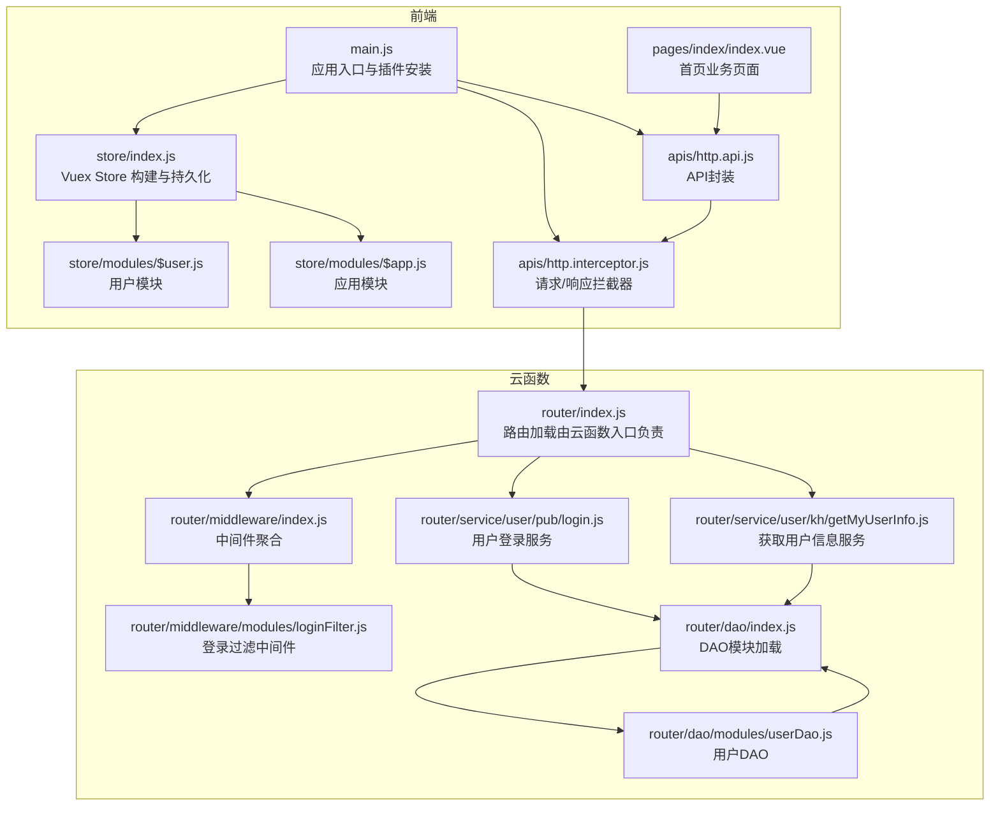
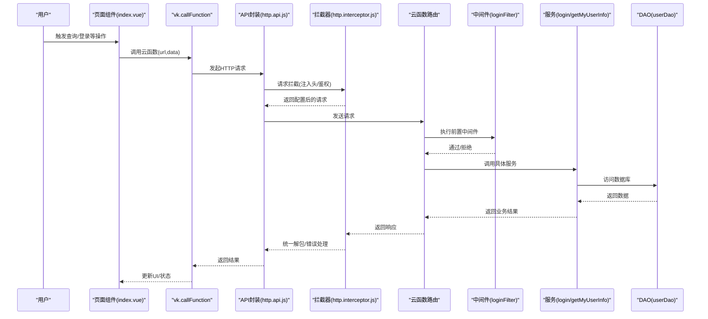
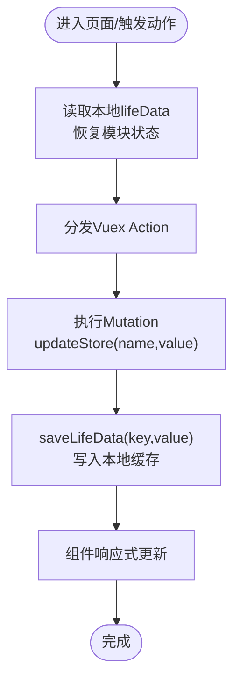
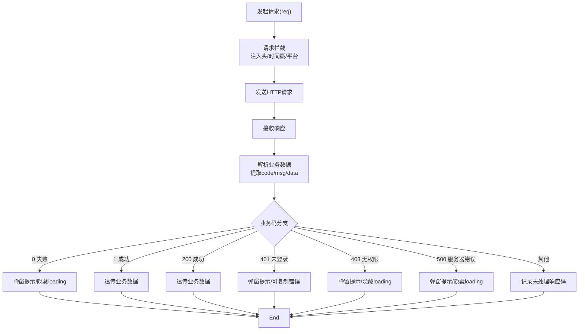
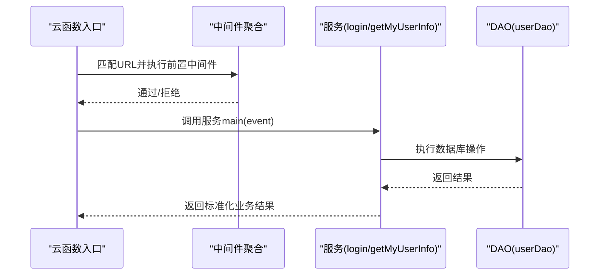
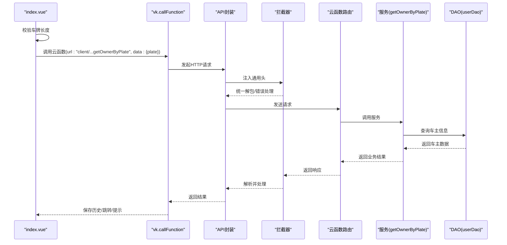
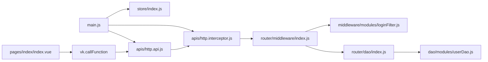

# 数据流设计

<cite>
**本文引用的文件**
- [main.js](file://main.js)
- [store/index.js](file://store/index.js)
- [store/modules/$user.js](file://store/modules/$user.js)
- [store/modules/$app.js](file://store/modules/$app.js)
- [apis/http.api.js](file://apis/http.api.js)
- [apis/http.interceptor.js](file://apis/http.interceptor.js)
- [uniCloud-aliyun/cloudfunctions/router/dao/index.js](file://uniCloud-aliyun/cloudfunctions/router/dao/index.js)
- [uniCloud-aliyun/cloudfunctions/router/dao/modules/userDao.js](file://uniCloud-aliyun/cloudfunctions/router/dao/modules/userDao.js)
- [uniCloud-aliyun/cloudfunctions/router/middleware/index.js](file://uniCloud-aliyun/cloudfunctions/router/middleware/index.js)
- [uniCloud-aliyun/cloudfunctions/router/middleware/modules/loginFilter.js](file://uniCloud-aliyun/cloudfunctions/router/middleware/modules/loginFilter.js)
- [uniCloud-aliyun/cloudfunctions/router/service/user/pub/login.js](file://uniCloud-aliyun/cloudfunctions/router/service/user/pub/login.js)
- [uniCloud-aliyun/cloudfunctions/router/service/user/kh/getMyUserInfo.js](file://uniCloud-aliyun/cloudfunctions/router/service/user/kh/getMyUserInfo.js)
- [pages/index/index.vue](file://pages/index/index.vue)
</cite>

## 目录
1. [引言](#引言)
2. [项目结构](#项目结构)
3. [核心组件](#核心组件)
4. [架构总览](#架构总览)
5. [详细组件分析](#详细组件分析)
6. [依赖分析](#依赖分析)
7. [性能考虑](#性能考虑)
8. [故障排查指南](#故障排查指南)
9. [结论](#结论)
10. [附录](#附录)

## 引言
本文件面向“挪车助手”项目，系统性梳理从前端用户输入到云函数处理、再到数据库持久化的完整数据流与处理机制。重点覆盖：
- 前端状态管理（Vuex）的数据流转与本地持久化策略
- HTTP 请求封装与拦截器的统一处理
- 云函数路由、中间件与DAO层的数据访问与业务编排
- 数据验证、转换与持久化过程
- 异步数据处理与错误处理机制

目标是帮助开发者与产品人员理解数据如何在系统中流动、如何被校验与转换，并在出现异常时如何定位与修复。

## 项目结构
项目采用“前端UniApp + 云开发（uniCloud）”架构，前端通过API封装与拦截器与云端服务通信，状态管理采用Vuex，云函数侧通过路由、中间件与DAO层完成业务编排与数据持久化。

图示来源
- [main.js:1-49](file://main.js#L1-L49)
- [store/index.js:1-136](file://store/index.js#L1-L136)
- [store/modules/$user.js:1-26](file://store/modules/$user.js#L1-L26)
- [store/modules/$app.js:1-36](file://store/modules/$app.js#L1-L36)
- [apis/http.api.js:1-32](file://apis/http.api.js#L1-L32)
- [apis/http.interceptor.js:1-116](file://apis/http.interceptor.js#L1-L116)
- [uniCloud-aliyun/cloudfunctions/router/middleware/index.js:1-34](file://uniCloud-aliyun/cloudfunctions/router/middleware/index.js#L1-L34)
- [uniCloud-aliyun/cloudfunctions/router/middleware/modules/loginFilter.js:1-53](file://uniCloud-aliyun/cloudfunctions/router/middleware/modules/loginFilter.js#L1-L53)
- [uniCloud-aliyun/cloudfunctions/router/service/user/pub/login.js:1-58](file://uniCloud-aliyun/cloudfunctions/router/service/user/pub/login.js#L1-L58)
- [uniCloud-aliyun/cloudfunctions/router/service/user/kh/getMyUserInfo.js:1-17](file://uniCloud-aliyun/cloudfunctions/router/service/user/kh/getMyUserInfo.js#L1-L17)
- [uniCloud-aliyun/cloudfunctions/router/dao/index.js:1-36](file://uniCloud-aliyun/cloudfunctions/router/dao/index.js#L1-L36)
- [uniCloud-aliyun/cloudfunctions/router/dao/modules/userDao.js:1-568](file://uniCloud-aliyun/cloudfunctions/router/dao/modules/userDao.js#L1-L568)

章节来源
- [main.js:1-49](file://main.js#L1-L49)
- [store/index.js:1-136](file://store/index.js#L1-L136)
- [store/modules/$user.js:1-26](file://store/modules/$user.js#L1-L26)
- [store/modules/$app.js:1-36](file://store/modules/$app.js#L1-L36)
- [apis/http.api.js:1-32](file://apis/http.api.js#L1-L32)
- [apis/http.interceptor.js:1-116](file://apis/http.interceptor.js#L1-L116)

## 核心组件
- 应用入口与插件安装：负责引入主题、vk框架、Vuex、API封装与HTTP拦截器。
- Vuex Store：集中式状态管理，支持多级状态更新与本地持久化。
- API封装与拦截器：统一封装HTTP请求、设置基础URL、注入通用请求头、统一业务错误处理。
- 云函数路由与中间件：按URL路由到对应服务，执行前置/后置中间件（如登录过滤）。
- DAO层：抽象数据库访问，提供CRUD与常用业务方法，屏蔽底层差异。
- 页面组件：承载业务交互，触发云函数调用与状态更新。

章节来源
- [main.js:1-49](file://main.js#L1-L49)
- [store/index.js:1-136](file://store/index.js#L1-L136)
- [apis/http.api.js:1-32](file://apis/http.api.js#L1-L32)
- [apis/http.interceptor.js:1-116](file://apis/http.interceptor.js#L1-L116)
- [uniCloud-aliyun/cloudfunctions/router/dao/index.js:1-36](file://uniCloud-aliyun/cloudfunctions/router/dao/index.js#L1-L36)
- [uniCloud-aliyun/cloudfunctions/router/middleware/index.js:1-34](file://uniCloud-aliyun/cloudfunctions/router/middleware/index.js#L1-L34)

## 架构总览
前端通过vk提供的云函数调用能力发起请求，请求经由uView HTTP库与拦截器进行统一处理，云函数侧根据URL路由到具体服务，服务在执行前经过中间件链路（如登录过滤），随后调用DAO层进行数据访问，最终返回标准化的业务结果。

图示来源
- [pages/index/index.vue:228-297](file://pages/index/index.vue#L228-L297)
- [apis/http.api.js:11-32](file://apis/http.api.js#L11-L32)
- [apis/http.interceptor.js:37-116](file://apis/http.interceptor.js#L37-L116)
- [uniCloud-aliyun/cloudfunctions/router/middleware/modules/loginFilter.js:27-52](file://uniCloud-aliyun/cloudfunctions/router/middleware/modules/loginFilter.js#L27-L52)
- [uniCloud-aliyun/cloudfunctions/router/service/user/pub/login.js:15-56](file://uniCloud-aliyun/cloudfunctions/router/service/user/pub/login.js#L15-L56)
- [uniCloud-aliyun/cloudfunctions/router/service/user/kh/getMyUserInfo.js:6-15](file://uniCloud-aliyun/cloudfunctions/router/service/user/kh/getMyUserInfo.js#L6-L15)
- [uniCloud-aliyun/cloudfunctions/router/dao/modules/userDao.js:147-167](file://uniCloud-aliyun/cloudfunctions/router/dao/modules/userDao.js#L147-L167)

## 详细组件分析

### 前端状态管理（Vuex）数据流
- Store构建：自动扫描modules目录，合并命名空间模块；对非$开头模块进行本地持久化。
- 状态更新：提供updateStore统一mutation，支持多级路径赋值；每次更新同步写入本地lifeData。
- 用户模块：暴露getUserInfo异步动作，调用API获取用户信息并写入状态。
- 应用模块：暴露getInitData异步动作，用于初始化应用配置并写入状态。

图示来源
- [store/index.js:48-95](file://store/index.js#L48-L95)
- [store/index.js:108-131](file://store/index.js#L108-L131)
- [store/modules/$user.js:16-22](file://store/modules/$user.js#L16-L22)
- [store/modules/$app.js:28-34](file://store/modules/$app.js#L28-L34)

章节来源
- [store/index.js:1-136](file://store/index.js#L1-L136)
- [store/modules/$user.js:1-26](file://store/modules/$user.js#L1-L26)
- [store/modules/$app.js:1-36](file://store/modules/$app.js#L1-L36)

### HTTP请求封装与拦截处理
- API封装：集中定义业务接口，统一设置基础URL，导出api对象供页面调用。
- 请求拦截：注入Authorization头（如存在）、时间戳、客户端平台信息等通用头。
- 响应拦截：统一解析业务数据，按业务码（0/1/200/401/403/500）分支处理；未登录/权限/服务器错误分别弹窗提示；其他情况透传。

图示来源
- [apis/http.api.js:11-32](file://apis/http.api.js#L11-L32)
- [apis/http.interceptor.js:37-116](file://apis/http.interceptor.js#L37-L116)

章节来源
- [apis/http.api.js:1-32](file://apis/http.api.js#L1-L32)
- [apis/http.interceptor.js:1-116](file://apis/http.interceptor.js#L1-L116)

### 云函数路由、中间件与服务
- 路由加载：自动扫描中间件与DAO模块，聚合为可执行列表。
- 中间件：按URL正则匹配执行前置过滤（如登录/注册方式开关），通过后进入服务。
- 服务：按URL映射到具体业务逻辑（如用户登录、获取用户信息）。
- DAO：提供用户表的CRUD与常用业务方法，屏蔽数据库细节。

图示来源
- [uniCloud-aliyun/cloudfunctions/router/middleware/index.js:14-32](file://uniCloud-aliyun/cloudfunctions/router/middleware/index.js#L14-L32)
- [uniCloud-aliyun/cloudfunctions/router/middleware/modules/loginFilter.js:27-52](file://uniCloud-aliyun/cloudfunctions/router/middleware/modules/loginFilter.js#L27-L52)
- [uniCloud-aliyun/cloudfunctions/router/service/user/pub/login.js:15-56](file://uniCloud-aliyun/cloudfunctions/router/service/user/pub/login.js#L15-L56)
- [uniCloud-aliyun/cloudfunctions/router/service/user/kh/getMyUserInfo.js:6-15](file://uniCloud-aliyun/cloudfunctions/router/service/user/kh/getMyUserInfo.js#L6-L15)
- [uniCloud-aliyun/cloudfunctions/router/dao/index.js:16-34](file://uniCloud-aliyun/cloudfunctions/router/dao/index.js#L16-L34)
- [uniCloud-aliyun/cloudfunctions/router/dao/modules/userDao.js:147-167](file://uniCloud-aliyun/cloudfunctions/router/dao/modules/userDao.js#L147-L167)

章节来源
- [uniCloud-aliyun/cloudfunctions/router/middleware/index.js:1-34](file://uniCloud-aliyun/cloudfunctions/router/middleware/index.js#L1-L34)
- [uniCloud-aliyun/cloudfunctions/router/middleware/modules/loginFilter.js:1-53](file://uniCloud-aliyun/cloudfunctions/router/middleware/modules/loginFilter.js#L1-L53)
- [uniCloud-aliyun/cloudfunctions/router/service/user/pub/login.js:1-58](file://uniCloud-aliyun/cloudfunctions/router/service/user/pub/login.js#L1-L58)
- [uniCloud-aliyun/cloudfunctions/router/service/user/kh/getMyUserInfo.js:1-17](file://uniCloud-aliyun/cloudfunctions/router/service/user/kh/getMyUserInfo.js#L1-L17)
- [uniCloud-aliyun/cloudfunctions/router/dao/index.js:1-36](file://uniCloud-aliyun/cloudfunctions/router/dao/index.js#L1-L36)
- [uniCloud-aliyun/cloudfunctions/router/dao/modules/userDao.js:1-568](file://uniCloud-aliyun/cloudfunctions/router/dao/modules/userDao.js#L1-L568)

### 页面业务数据流示例：首页查询车主
- 用户输入车牌：页面组件维护车牌输入状态与历史记录。
- 触发查询：校验长度，调用vk.callFunction，传入plate参数。
- 云函数服务：根据URL路由到client/pub_index相关服务，DAO层查询车主信息。
- 返回与更新：成功后保存历史记录并跳转联系页；失败弹出提示。

图示来源
- [pages/index/index.vue:228-297](file://pages/index/index.vue#L228-L297)
- [apis/http.api.js:11-32](file://apis/http.api.js#L11-L32)
- [apis/http.interceptor.js:37-116](file://apis/http.interceptor.js#L37-L116)
- [uniCloud-aliyun/cloudfunctions/router/dao/modules/userDao.js:147-167](file://uniCloud-aliyun/cloudfunctions/router/dao/modules/userDao.js#L147-L167)

章节来源
- [pages/index/index.vue:1-755](file://pages/index/index.vue#L1-L755)

## 依赖分析
- 前端依赖关系：main.js引入uView、vk、Vuex、API与拦截器；页面组件依赖vk云函数调用与API封装；Vuex模块依赖API与工具函数。
- 云函数依赖关系：路由聚合中间件与DAO；服务依赖util与DAO；DAO依赖数据库上下文与公共工具。

图示来源
- [main.js:1-49](file://main.js#L1-L49)
- [store/index.js:1-136](file://store/index.js#L1-L136)
- [pages/index/index.vue:228-297](file://pages/index/index.vue#L228-L297)
- [apis/http.api.js:11-32](file://apis/http.api.js#L11-L32)
- [apis/http.interceptor.js:37-116](file://apis/http.interceptor.js#L37-L116)
- [uniCloud-aliyun/cloudfunctions/router/middleware/index.js:14-32](file://uniCloud-aliyun/cloudfunctions/router/middleware/index.js#L14-L32)
- [uniCloud-aliyun/cloudfunctions/router/middleware/modules/loginFilter.js:27-52](file://uniCloud-aliyun/cloudfunctions/router/middleware/modules/loginFilter.js#L27-L52)
- [uniCloud-aliyun/cloudfunctions/router/dao/index.js:16-34](file://uniCloud-aliyun/cloudfunctions/router/dao/index.js#L16-L34)
- [uniCloud-aliyun/cloudfunctions/router/dao/modules/userDao.js:147-167](file://uniCloud-aliyun/cloudfunctions/router/dao/modules/userDao.js#L147-L167)

章节来源
- [main.js:1-49](file://main.js#L1-L49)
- [pages/index/index.vue:1-755](file://pages/index/index.vue#L1-L755)

## 性能考虑
- 前端
  - 使用本地lifeData持久化避免每次启动重建状态，减少IO开销。
  - API拦截器统一注入头，避免重复设置，降低请求体积。
- 云函数
  - 中间件前置过滤减少无效请求进入服务层。
  - DAO层提供批量操作与连表查询能力，减少多次往返。
  - 服务层尽量合并数据库操作，减少事务与网络往返次数。

## 故障排查指南
- 未登录/登录过期
  - 现象：响应码401，弹窗提示并可复制错误摘要。
  - 排查：检查本地token是否过期或缺失；确认拦截器是否正确注入Authorization头。
- 无权限访问
  - 现象：响应码403，弹窗提示。
  - 排查：确认用户权限与中间件登录规则配置。
- 服务器错误
  - 现象：响应码500，弹窗提示。
  - 排查：查看云函数日志与数据库状态，确认服务层异常堆栈。
- 业务失败
  - 现象：响应码0，弹窗提示业务错误信息。
  - 排查：检查服务层返回的msg与data结构，确认前端是否正确解包。

章节来源
- [apis/http.interceptor.js:57-113](file://apis/http.interceptor.js#L57-L113)

## 结论
本项目通过清晰的前端状态管理、统一的HTTP封装与拦截、以及可扩展的云函数路由与DAO层，实现了从前端输入到数据库持久化的闭环数据流。建议在后续迭代中：
- 对高频接口增加缓存策略与重试机制
- 对敏感字段在DAO层统一脱敏
- 对复杂查询优化索引与分页策略
- 完善单元测试与集成测试覆盖

## 附录
- 关键流程路径参考
  - 页面查询车主：[pages/index/index.vue:228-297](file://pages/index/index.vue#L228-L297)
  - 用户登录服务：[uniCloud-aliyun/cloudfunctions/router/service/user/pub/login.js:15-56](file://uniCloud-aliyun/cloudfunctions/router/service/user/pub/login.js#L15-L56)
  - 获取用户信息服务：[uniCloud-aliyun/cloudfunctions/router/service/user/kh/getMyUserInfo.js:6-15](file://uniCloud-aliyun/cloudfunctions/router/service/user/kh/getMyUserInfo.js#L6-L15)
  - 用户DAO查询：[uniCloud-aliyun/cloudfunctions/router/dao/modules/userDao.js:147-167](file://uniCloud-aliyun/cloudfunctions/router/dao/modules/userDao.js#L147-L167)
  - 登录过滤中间件：[uniCloud-aliyun/cloudfunctions/router/middleware/modules/loginFilter.js:27-52](file://uniCloud-aliyun/cloudfunctions/router/middleware/modules/loginFilter.js#L27-L52)
  - API封装与拦截器：[apis/http.api.js:11-32](file://apis/http.api.js#L11-L32)，[apis/http.interceptor.js:37-116](file://apis/http.interceptor.js#L37-L116)
  - Vuex状态与持久化：[store/index.js:48-95](file://store/index.js#L48-L95)，[store/index.js:108-131](file://store/index.js#L108-L131)
  - 用户模块动作：[store/modules/$user.js:16-22](file://store/modules/$user.js#L16-L22)
  - 应用模块动作：[store/modules/$app.js:28-34](file://store/modules/$app.js#L28-L34)