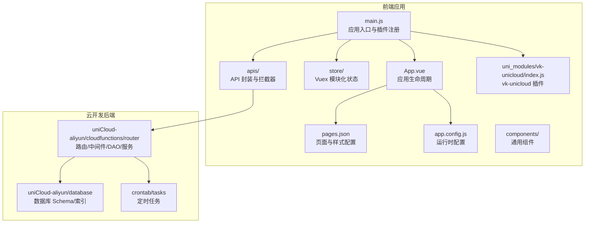
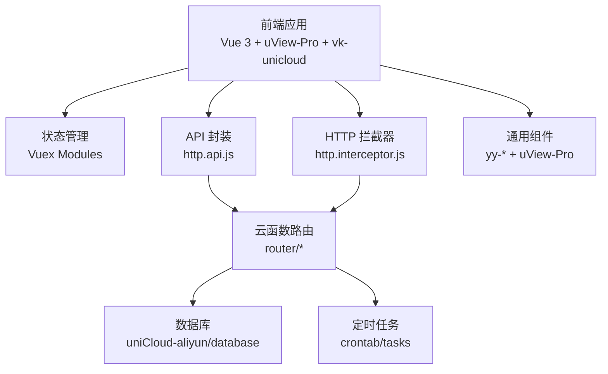
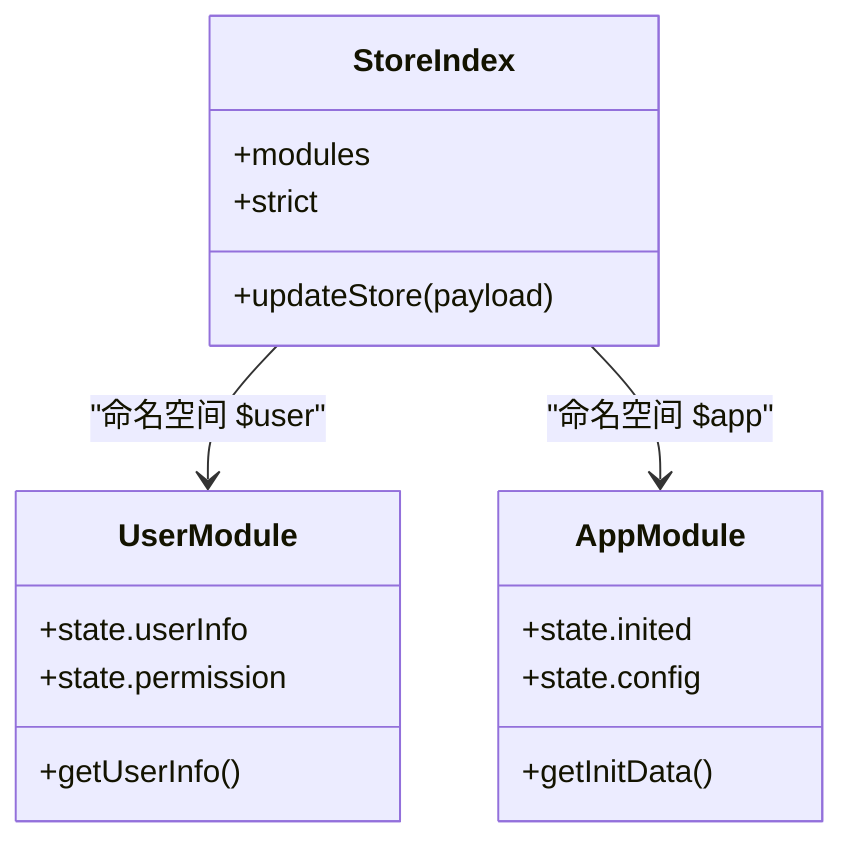
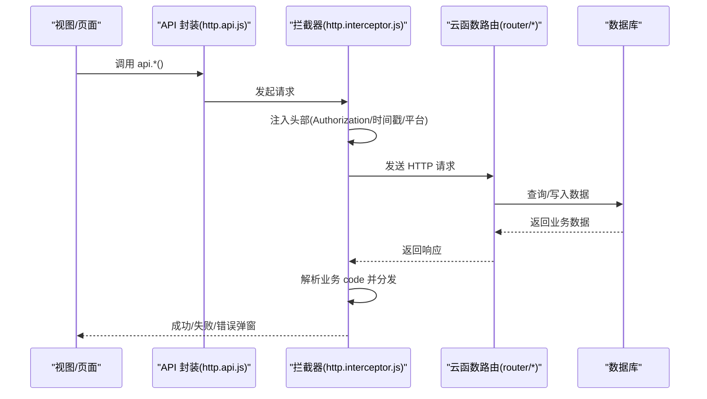
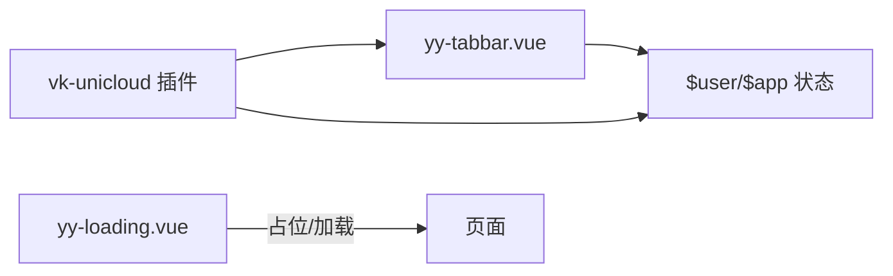
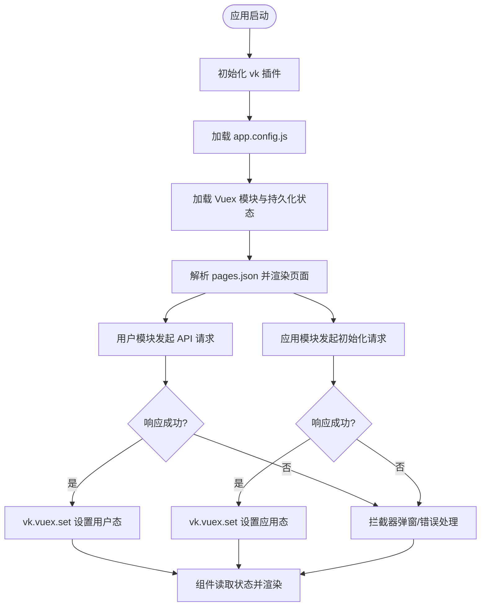
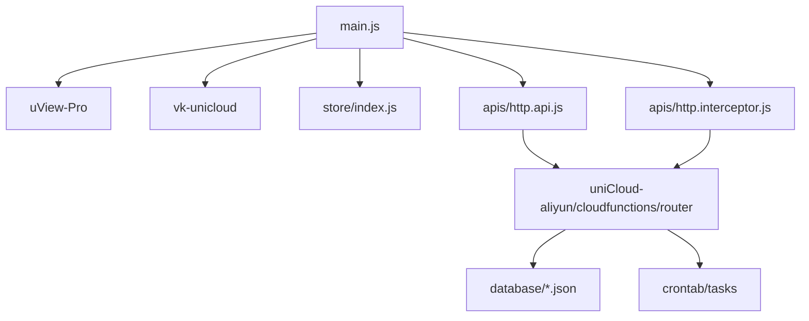

# 架构设计

<cite>
**本文引用的文件**
- [main.js](file://main.js)
- [App.vue](file://App.vue)
- [pages.json](file://pages.json)
- [store/index.js](file://store/index.js)
- [store/modules/$user.js](file://store/modules/$user.js)
- [store/modules/$app.js](file://store/modules/$app.js)
- [apis/http.api.js](file://apis/http.api.js)
- [apis/http.interceptor.js](file://apis/http.interceptor.js)
- [app.config.js](file://app.config.js)
- [manifest.json](file://manifest.json)
- [uni_modules/vk-unicloud/index.js](file://uni_modules/vk-unicloud/index.js)
- [components/yy-tabbar.vue](file://components/yy-tabbar.vue)
- [components/yy-loading.vue](file://components/yy-loading.vue)
</cite>

## 目录
1. [引言](#引言)
2. [项目结构](#项目结构)
3. [核心组件](#核心组件)
4. [架构总览](#架构总览)
5. [详细组件分析](#详细组件分析)
6. [依赖分析](#依赖分析)
7. [性能考量](#性能考量)
8. [故障排查指南](#故障排查指南)
9. [结论](#结论)
10. [附录](#附录)

## 引言
本架构设计文档面向“挪车助手”项目，基于 uni-app 跨平台框架，采用 MVVM 模式、组件化与插件化设计，结合 Vue 3 + TypeScript 的前端架构与 uniCloud 云开发后端能力，构建统一的数据流与状态管理体系。本文从系统边界、组件交互、数据流向、集成模式等维度，系统阐述整体架构与关键技术决策，并给出可扩展性建议与可视化图示。

## 项目结构
项目采用典型的 uni-app 分层组织方式：
- 应用入口与全局配置：main.js、App.vue、manifest.json、pages.json、app.config.js
- 状态管理：store（模块化 Vuex）
- API 与拦截器：apis（集中式 API 封装与 HTTP 拦截器）
- 组件库与通用组件：components、uni_modules（uView-Pro、vk-unicloud 等）
- 云开发：uniCloud-aliyun（云函数、中间件、DAO 层、定时任务等）

**图表来源**
- [main.js:1-49](file://main.js#L1-L49)
- [App.vue:1-48](file://App.vue#L1-L48)
- [pages.json:1-87](file://pages.json#L1-L87)
- [store/index.js:1-136](file://store/index.js#L1-L136)
- [apis/http.api.js:1-32](file://apis/http.api.js#L1-L32)
- [apis/http.interceptor.js:1-116](file://apis/http.interceptor.js#L1-L116)
- [app.config.js:1-111](file://app.config.js#L1-L111)
- [uni_modules/vk-unicloud/index.js:1-4](file://uni_modules/vk-unicloud/index.js#L1-L4)

**章节来源**
- [main.js:1-49](file://main.js#L1-L49)
- [App.vue:1-48](file://App.vue#L1-L48)
- [pages.json:1-87](file://pages.json#L1-L87)
- [manifest.json:1-271](file://manifest.json#L1-L271)

## 核心组件
- 应用入口与插件体系
  - main.js 注册 uView-Pro 主题、vk-unicloud 插件、Vuex、API 管理与 HTTP 拦截器，形成统一的运行时装配。
- 应用生命周期与页面配置
  - App.vue 处理应用启动、页面 404 跳转、更新管理、平台差异处理等；pages.json 定义页面、全局样式与 TabBar。
- 状态管理
  - store/index.js 动态加载 modules，支持 VUE2/VUE3，提供 updateStore 通用持久化机制；$user、$app 模块分别承载用户态与应用初始化数据。
- API 与拦截器
  - http.api.js 提供统一环境基址与 API 方法封装；http.interceptor.js 实现请求头注入、鉴权令牌携带、响应码分发与错误弹窗。
- 运行时配置
  - app.config.js 提供调试开关、页面路由、颜色主题、加密请求策略、云存储配置、全局错误码映射等。
- 插件化与组件化
  - vk-unicloud 插件提供跨端能力；uView-Pro 提供 UI 组件生态；yy-* 通用组件实现业务通用能力（如 Loading、TabBar）。

**章节来源**
- [main.js:1-49](file://main.js#L1-L49)
- [App.vue:1-48](file://App.vue#L1-L48)
- [pages.json:1-87](file://pages.json#L1-L87)
- [store/index.js:1-136](file://store/index.js#L1-L136)
- [store/modules/$user.js:1-26](file://store/modules/$user.js#L1-L26)
- [store/modules/$app.js:1-36](file://store/modules/$app.js#L1-L36)
- [apis/http.api.js:1-32](file://apis/http.api.js#L1-L32)
- [apis/http.interceptor.js:1-116](file://apis/http.interceptor.js#L1-L116)
- [app.config.js:1-111](file://app.config.js#L1-L111)
- [uni_modules/vk-unicloud/index.js:1-4](file://uni_modules/vk-unicloud/index.js#L1-L4)

## 架构总览
整体架构以“前端 uni-app + uniCloud 云开发”为核心，采用 MVVM 模式与组件化/插件化设计，通过集中式 API 与拦截器实现前后端一致的通信协议，借助 vk-unicloud 与 uView-Pro 提升开发效率与一致性。

**图表来源**
- [main.js:1-49](file://main.js#L1-L49)
- [store/index.js:1-136](file://store/index.js#L1-L136)
- [apis/http.api.js:1-32](file://apis/http.api.js#L1-L32)
- [apis/http.interceptor.js:1-116](file://apis/http.interceptor.js#L1-L116)
- [uni_modules/vk-unicloud/index.js:1-4](file://uni_modules/vk-unicloud/index.js#L1-L4)

## 详细组件分析

### 状态管理架构（Vuex 模块化）
- 动态加载与命名空间
  - store/index.js 支持 VUE2/VUE3 的模块扫描与命名空间规范化，避免同名冲突。
- 本地持久化策略
  - 通过 updateStore 通用 mutation 与 notSaveStateKeys 控制持久化范围，结合 lifeData 实现跨次启动的状态保留。
- 模块职责
  - $user：用户信息、权限、历史数据、定位状态等；
  - $app：应用初始化数据、颜色主题、网络状态、经纬度等。

**图表来源**
- [store/index.js:1-136](file://store/index.js#L1-L136)
- [store/modules/$user.js:1-26](file://store/modules/$user.js#L1-L26)
- [store/modules/$app.js:1-36](file://store/modules/$app.js#L1-L36)

**章节来源**
- [store/index.js:1-136](file://store/index.js#L1-L136)
- [store/modules/$user.js:1-26](file://store/modules/$user.js#L1-L26)
- [store/modules/$app.js:1-36](file://store/modules/$app.js#L1-L36)

### API 与拦截器流程
- API 封装
  - http.api.js 基于环境映射选择基址，统一导出 api 对象与 install 方法，便于在应用启动时注入。
- 请求拦截
  - http.interceptor.js 在请求阶段注入 Authorization、时间戳、客户端平台等头部信息。
- 响应拦截
  - 基于业务 code 分发处理：业务失败、成功、未登录、无权限、服务器错误等，统一弹窗与错误摘要复制能力。

**图表来源**
- [apis/http.api.js:1-32](file://apis/http.api.js#L1-L32)
- [apis/http.interceptor.js:1-116](file://apis/http.interceptor.js#L1-L116)

**章节来源**
- [apis/http.api.js:1-32](file://apis/http.api.js#L1-L32)
- [apis/http.interceptor.js:1-116](file://apis/http.interceptor.js#L1-L116)

### 插件化与组件化
- vk-unicloud 插件
  - 通过 uni_modules/vk-unicloud/index.js 导出 vk 能力，为应用提供统一的云开发接入与工具集。
- 通用组件
  - yy-tabbar.vue 通过 vk.getVuex 读取 TabBar 列表与激活项，配合 dispatch 触发切换动作，体现组件与状态的解耦。
  - yy-loading.vue 提供统一加载态 UI，便于在各页面复用。

**图表来源**
- [uni_modules/vk-unicloud/index.js:1-4](file://uni_modules/vk-unicloud/index.js#L1-L4)
- [components/yy-tabbar.vue:1-38](file://components/yy-tabbar.vue#L1-L38)
- [components/yy-loading.vue:1-34](file://components/yy-loading.vue#L1-L34)
- [store/modules/$user.js:1-26](file://store/modules/$user.js#L1-L26)
- [store/modules/$app.js:1-36](file://store/modules/$app.js#L1-L36)

**章节来源**
- [uni_modules/vk-unicloud/index.js:1-4](file://uni_modules/vk-unicloud/index.js#L1-L4)
- [components/yy-tabbar.vue:1-38](file://components/yy-tabbar.vue#L1-L38)
- [components/yy-loading.vue:1-34](file://components/yy-loading.vue#L1-L34)

### 数据流与状态管理
- 数据来源
  - 用户态数据来自 $user 模块，应用初始化数据来自 $app 模块；二者均通过 vk.vuex.set/commit/dispatch 与云函数交互。
- 状态持久化
  - 通过 updateStore 与 lifeData 机制，实现跨次启动的状态恢复与最小化持久化范围控制。
- 页面联动
  - App.vue 在不同平台触发初始化动作（如 APP-PLUS 初始化数据），pages.json 统一声明页面与 TabBar 行为。

**图表来源**
- [App.vue:1-48](file://App.vue#L1-L48)
- [store/index.js:1-136](file://store/index.js#L1-L136)
- [store/modules/$user.js:1-26](file://store/modules/$user.js#L1-L26)
- [store/modules/$app.js:1-36](file://store/modules/$app.js#L1-L36)
- [pages.json:1-87](file://pages.json#L1-L87)
- [apis/http.interceptor.js:1-116](file://apis/http.interceptor.js#L1-L116)

**章节来源**
- [App.vue:1-48](file://App.vue#L1-L48)
- [store/index.js:1-136](file://store/index.js#L1-L136)
- [store/modules/$user.js:1-26](file://store/modules/$user.js#L1-L26)
- [store/modules/$app.js:1-36](file://store/modules/$app.js#L1-L36)
- [pages.json:1-87](file://pages.json#L1-L87)

## 依赖分析
- 前端依赖
  - main.js 依赖 uView-Pro、vk-unicloud、Vuex、API 与拦截器；
  - App.vue 依赖 pages.json、app.config.js；
  - store 依赖模块化 JS 文件与本地持久化；
  - apis 依赖 uni.$u.http 与环境配置。
- 云开发依赖
  - router 作为统一入口，协调 DAO、中间件与服务层；
  - database 提供 Schema 与索引约束；
  - crontab 提供定时任务调度。

**图表来源**
- [main.js:1-49](file://main.js#L1-L49)
- [store/index.js:1-136](file://store/index.js#L1-L136)
- [apis/http.api.js:1-32](file://apis/http.api.js#L1-L32)
- [apis/http.interceptor.js:1-116](file://apis/http.interceptor.js#L1-L116)

**章节来源**
- [main.js:1-49](file://main.js#L1-L49)
- [store/index.js:1-136](file://store/index.js#L1-L136)
- [apis/http.api.js:1-32](file://apis/http.api.js#L1-L32)
- [apis/http.interceptor.js:1-116](file://apis/http.interceptor.js#L1-L116)

## 性能考量
- 请求与缓存
  - 使用拦截器统一注入头部与错误处理，减少重复逻辑；对高频接口建议在前端做轻量缓存与去抖。
- 渲染与懒加载
  - pages.json 中的懒加载配置与组件按需引入有助于首屏优化。
- 状态持久化
  - 仅对必要状态进行持久化，避免 lifeData 过大导致 IO 压力。
- 云函数与数据库
  - 合理拆分 router 与 DAO，避免单函数体积过大；为热点查询建立索引，减少全表扫描。

## 故障排查指南
- 登录态失效
  - 拦截器对 401 做统一处理，建议在业务层捕获并引导至登录页。
- 网络异常与超时
  - 参考 app.config.js 的 globalErrorCode 映射，结合拦截器统一提示与重试策略。
- 页面 404
  - App.vue 已在 onPageNotFound 中重定向至 404 页面，确保 pages.json 中路径正确。
- 平台差异
  - App.vue 与 vk-unicloud 在 APP-PLUS/MP 等平台有差异化处理，注意在对应平台测试验证。

**章节来源**
- [apis/http.interceptor.js:1-116](file://apis/http.interceptor.js#L1-L116)
- [app.config.js:94-110](file://app.config.js#L94-L110)
- [App.vue:5-10](file://App.vue#L5-L10)
- [manifest.json:1-271](file://manifest.json#L1-L271)

## 结论
本项目以 uni-app 为基础，结合 vk-unicloud 与 uView-Pro，构建了清晰的 MVVM、组件化与插件化架构。通过集中式 API 与拦截器、模块化 Vuex 与本地持久化策略，实现了跨端一致的用户体验与可维护的工程化实践。后续可在云函数拆分、数据库索引优化、前端缓存策略等方面持续演进，提升性能与可扩展性。

## 附录
- 关键配置参考
  - app.config.js：运行时配置、页面路由、主题色、云存储与错误码映射
  - pages.json：页面清单、全局样式、TabBar 配置
  - manifest.json：平台能力、权限、SDK 配置、网络超时等
- 开发建议
  - 保持模块化与单一职责，避免状态与 UI 过度耦合；
  - 对外暴露稳定的 API 接口与错误码规范；
  - 在云函数中增加日志与监控，便于问题定位。