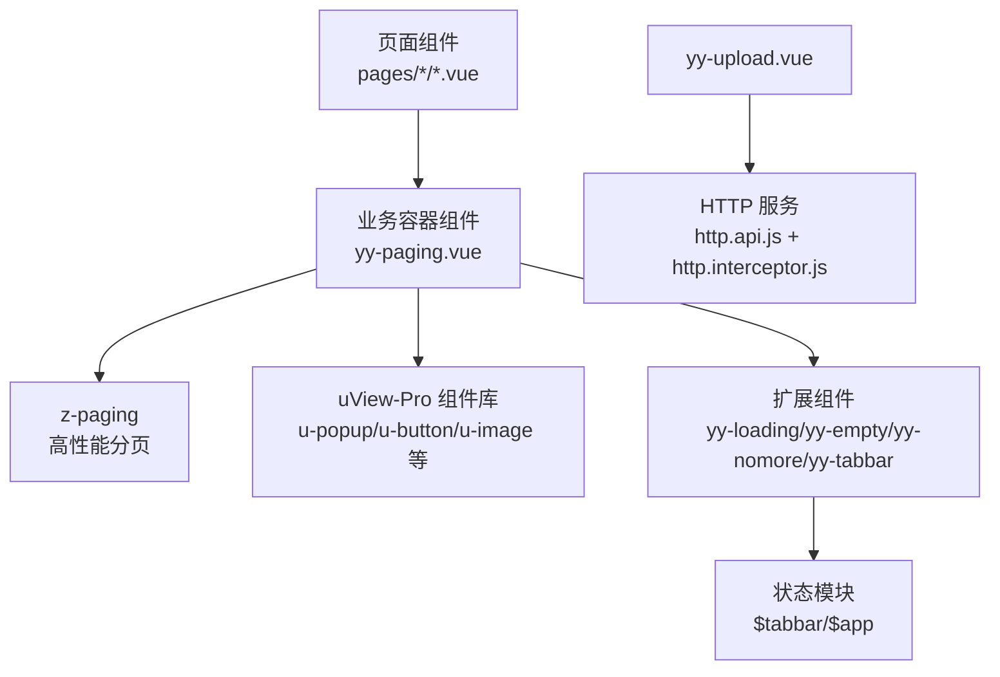
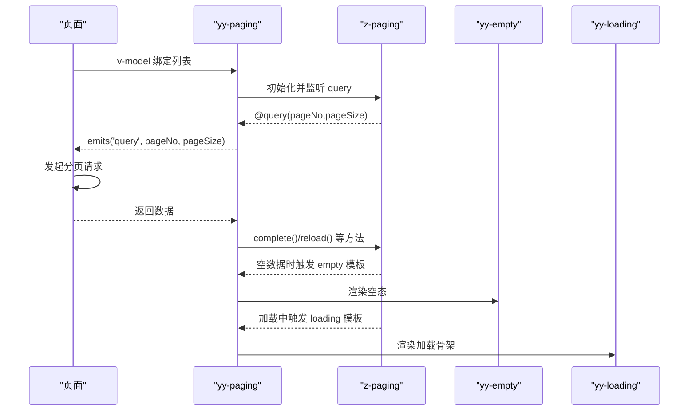
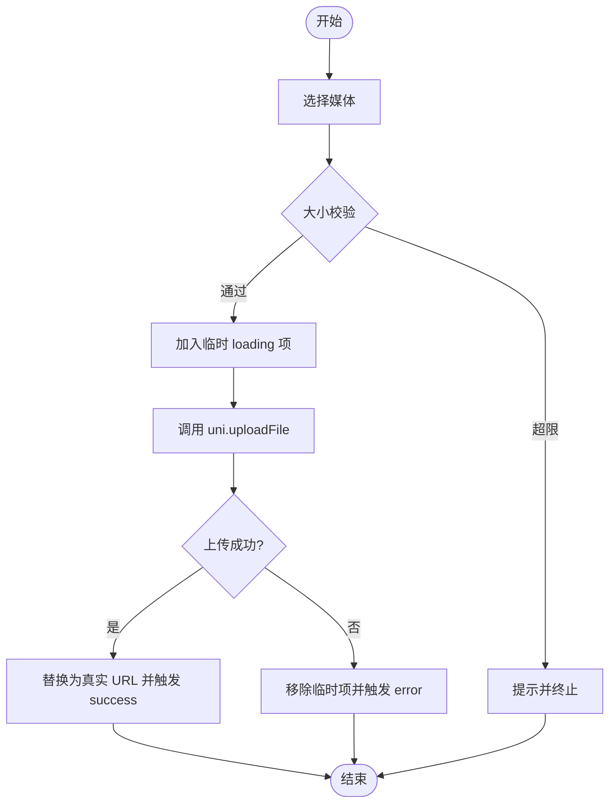
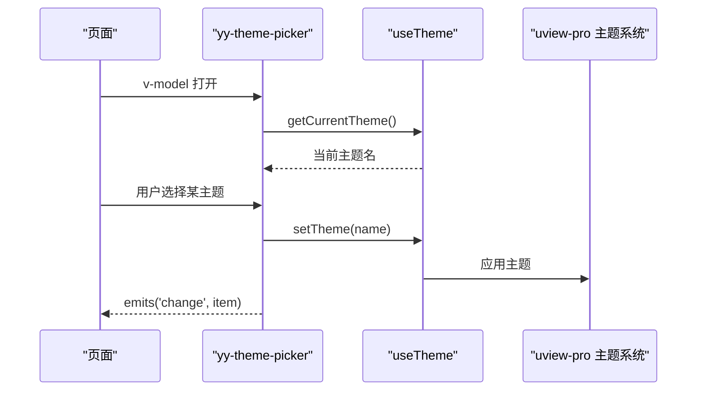
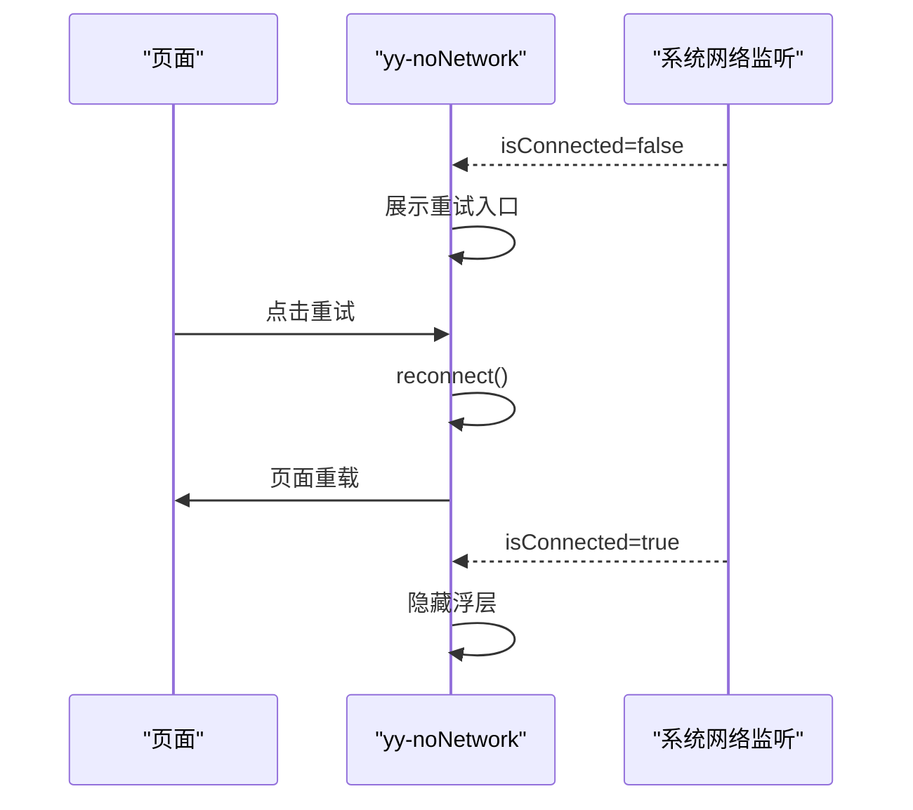
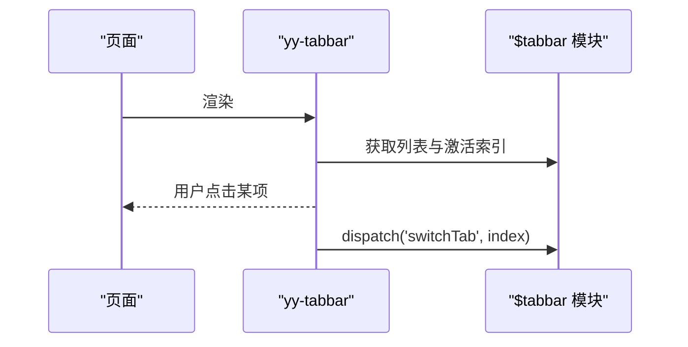
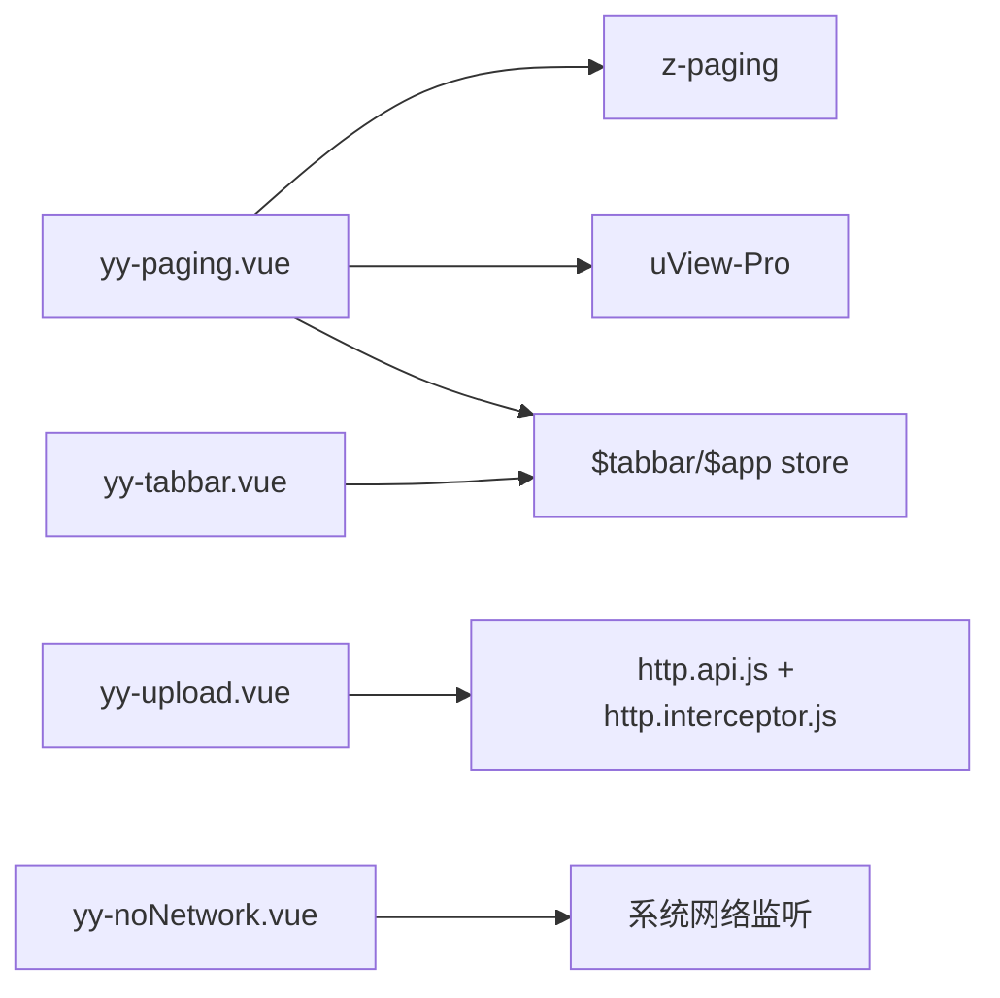

# 组件架构设计

<cite>
**本文引用的文件**
- [components/yy-dark-mode-picker.vue](file://components/yy-dark-mode-picker.vue)
- [components/yy-edit-information.vue](file://components/yy-edit-information.vue)
- [components/yy-empty.vue](file://components/yy-empty.vue)
- [components/yy-icon.vue](file://components/yy-icon.vue)
- [components/yy-loading.vue](file://components/yy-loading.vue)
- [components/yy-noNetwork.vue](file://components/yy-noNetwork.vue)
- [components/yy-nomore.vue](file://components/yy-nomore.vue)
- [components/yy-paging.vue](file://components/yy-paging.vue)
- [components/yy-picker-modal.vue](file://components/yy-picker-modal.vue)
- [components/yy-plate-keyboard.vue](file://components/yy-plate-keyboard.vue)
- [components/yy-refresher.vue](file://components/yy-refresher.vue)
- [components/yy-tabbar.vue](file://components/yy-tabbar.vue)
- [components/yy-theme-picker.vue](file://components/yy-theme-picker.vue)
- [components/yy-tip-modal.vue](file://components/yy-tip-modal.vue)
- [components/yy-upload.vue](file://components/yy-upload.vue)
- [uni_modules/uview-pro/components/u-popup/u-popup.vue](file://uni_modules/uview-pro/components/u-popup/u-popup.vue)
- [uni_modules/uview-pro/components/u-button/u-button.vue](file://uni_modules/uview-pro/components/u-button/u-button.vue)
- [uni_modules/uview-pro/components/u-image/u-image.vue](file://uni_modules/uview-pro/components/u-image/u-image.vue)
- [uni_modules/uview-pro/components/u-input/u-input.vue](file://uni_modules/uview-pro/components/u-input/u-input.vue)
- [uni_modules/uview-pro/components/u-radio-group/u-radio-group.vue](file://uni_modules/uview-pro/components/u-radio-group/u-radio-group.vue)
- [uni_modules/uview-pro/components/u-navbar/u-navbar.vue](file://uni_modules/uview-pro/components/u-navbar/u-navbar.vue)
- [uni_modules/uview-pro/components/u-tabbar/u-tabbar.vue](file://uni_modules/uview-pro/components/u-tabbar/u-tabbar.vue)
- [uni_modules/z-paging/components/z-paging/z-paging.vue](file://uni_modules/z-paging/components/z-paging/z-paging.vue)
- [uni_modules/z-paging/components/z-paging-cell/z-paging-cell.vue](file://uni_modules/z-paging/components/z-paging-cell/z-paging-cell.vue)
- [uni_modules/z-paging/components/z-paging-empty-view/z-paging-empty-view.vue](file://uni_modules/z-paging/components/z-paging-empty-view/z-paging-empty-view.vue)
- [uni_modules/z-paging/types/comps/z-paging.d.ts](file://uni_modules/z-paging/types/comps/z-paging.d.ts)
- [common/function/uview-pro.theme.js](file://common/function/uview-pro.theme.js)
- [pages/index/index.vue](file://pages/index/index.vue)
- [pages/my/index.vue](file://pages/my/index.vue)
- [store/modules/$tabbar.js](file://store/modules/$tabbar.js)
- [store/modules/$app.js](file://store/modules/$app.js)
- [apis/http.api.js](file://apis/http.api.js)
- [apis/http.interceptor.js](file://apis/http.interceptor.js)
</cite>

## 目录
1. [引言](#引言)
2. [项目结构](#项目结构)
3. [核心组件](#核心组件)
4. [架构总览](#架构总览)
5. [详细组件分析](#详细组件分析)
6. [依赖分析](#依赖分析)
7. [性能考虑](#性能考虑)
8. [故障排查指南](#故障排查指南)
9. [结论](#结论)
10. [附录](#附录)

## 引言
本设计文档面向“挪车助手”项目，系统化阐述自定义组件的设计原则、实现方式与集成策略，重点覆盖以下方面：
- 组件分类、命名规范与复用策略
- 自定义组件与 uView-Pro 组件库的集成方式
- 组件间依赖关系与组合模式
- 生命周期管理、props 传递、事件处理与插槽使用
- 最佳实践、性能优化与可维护性建议
- 组件测试与文档编写规范

## 项目结构
项目采用按功能域组织的组件目录，结合 uni_modules 扩展生态（uView-Pro、z-paging）实现高复用 UI 能力与高性能分页能力。核心自定义组件集中于 components 目录，页面位于 pages 目录，全局状态由 store 管理，HTTP 层由 apis 提供。

```mermaid
graph TB
subgraph "页面层"
P1["pages/index/index.vue"]
P2["pages/my/index.vue"]
end
subgraph "自定义组件层"
C1["yy-paging.vue"]
C2["yy-loading.vue"]
C3["yy-empty.vue"]
C4["yy-nomore.vue"]
C5["yy-tabbar.vue"]
C6["yy-icon.vue"]
C7["yy-upload.vue"]
C8["yy-plate-keyboard.vue"]
C9["yy-picker-modal.vue"]
C10["yy-theme-picker.vue"]
C11["yy-dark-mode-picker.vue"]
C12["yy-tip-modal.vue"]
C13["yy-edit-information.vue"]
C14["yy-refresher.vue"]
C15["yy-noNetwork.vue"]
end
subgraph "uView-Pro 组件库"
U1["u-popup.vue"]
U2["u-button.vue"]
U3["u-image.vue"]
U4["u-input.vue"]
U5["u-radio-group.vue"]
U6["u-navbar.vue"]
U7["u-tabbar.vue"]
end
subgraph "z-paging 组件库"
Z1["z-paging.vue"]
Z2["z-paging-cell.vue"]
Z3["z-paging-empty-view.vue"]
end
subgraph "状态与服务"
S1["store/modules/$tabbar.js"]
S2["store/modules/$app.js"]
A1["apis/http.api.js"]
A2["apis/http.interceptor.js"]
end
P1 --> C1
P2 --> C1
C1 --> Z1
C1 --> C2
C1 --> C3
C1 --> C4
C1 --> C5
C1 --> C14
C5 --> U7
C2 --> U1
C3 --> U1
C4 --> U1
C6 --> U3
C7 --> U1
C8 --> U1
C9 --> U1
C10 --> U1
C11 --> U1
C12 --> U1
C13 --> U1
C15 --> U1
C1 --> U6
C1 --> U1
C1 --> Z2
C1 --> Z3
C1 --> S1
C15 --> S2
C7 --> A1
C7 --> A2
```

**图表来源**
- [components/yy-paging.vue:1-127](file://components/yy-paging.vue#L1-L127)
- [uni_modules/z-paging/components/z-paging/z-paging.vue](file://uni_modules/z-paging/components/z-paging/z-paging.vue)
- [uni_modules/uview-pro/components/u-popup/u-popup.vue](file://uni_modules/uview-pro/components/u-popup/u-popup.vue)
- [uni_modules/uview-pro/components/u-navbar/u-navbar.vue](file://uni_modules/uview-pro/components/u-navbar/u-navbar.vue)
- [uni_modules/uview-pro/components/u-tabbar/u-tabbar.vue](file://uni_modules/uview-pro/components/u-tabbar/u-tabbar.vue)
- [store/modules/$tabbar.js](file://store/modules/$tabbar.js)
- [store/modules/$app.js](file://store/modules/$app.js)
- [apis/http.api.js](file://apis/http.api.js)
- [apis/http.interceptor.js](file://apis/http.interceptor.js)

**章节来源**
- [components/yy-paging.vue:1-127](file://components/yy-paging.vue#L1-L127)
- [uni_modules/z-paging/components/z-paging/z-paging.vue](file://uni_modules/z-paging/components/z-paging/z-paging.vue)
- [uni_modules/uview-pro/components/u-popup/u-popup.vue](file://uni_modules/uview-pro/components/u-popup/u-popup.vue)
- [uni_modules/uview-pro/components/u-navbar/u-navbar.vue](file://uni_modules/uview-pro/components/u-navbar/u-navbar.vue)
- [uni_modules/uview-pro/components/u-tabbar/u-tabbar.vue](file://uni_modules/uview-pro/components/u-tabbar/u-tabbar.vue)
- [store/modules/$tabbar.js](file://store/modules/$tabbar.js)
- [store/modules/$app.js](file://store/modules/$app.js)
- [apis/http.api.js](file://apis/http.api.js)
- [apis/http.interceptor.js](file://apis/http.interceptor.js)

## 核心组件
本节对关键自定义组件进行概览，说明职责边界与典型用法路径。

- 分页容器组件：yy-paging.vue
  - 职责：封装 z-paging，统一注入 loading/empty/nomore/tabbar/nav 等通用视图与交互，暴露 query/onRefresh/scrolltolower 等事件，支持虚拟列表与页面滚动模式切换。
  - 关键特性：插槽化布局、双向绑定 modelValue、透传 z-paging 方法与事件。
  - 典型调用：在页面中以 v-model 绑定列表数据，监听 query 事件发起分页请求。

- 加载与空态：yy-loading.vue、yy-empty.vue、yy-nomore.vue
  - 职责：分别承担全屏加载骨架、空数据占位与“没有更多”提示。
  - 设计要点：yy-empty 支持动态 SVG 主题色注入，yy-nomore 保持最小化结构以便复用。

- 交互弹窗：yy-picker-modal.vue、yy-theme-picker.vue、yy-dark-mode-picker.vue、yy-tip-modal.vue、yy-plate-keyboard.vue、yy-edit-information.vue
  - 职责：提供底部弹窗选择、主题/深色模式切换、提示清单、车牌键盘与资料编辑等交互。
  - 设计要点：统一基于 u-popup，支持 v-model 控制显隐，通过 change/update 事件与父组件通信。

- 媒体上传：yy-upload.vue
  - 职责：多图/单视频选择、本地预览、上传校验、进度遮罩与结果回填。
  - 设计要点：支持图片/视频两类媒体，逐个上传并发出 success/error/delete 等事件。

- 导航与 Tabbar：yy-tabbar.vue、u-tabbar.vue
  - 职责：统一底部导航，读取 store 中 tabbar 列表与激活项，派发切换动作。
  - 设计要点：通过计算属性与 v-model 实现双向绑定，减少页面样板代码。

- 网络状态：yy-noNetwork.vue
  - 职责：检测网络变化并在断网时展示重试入口，支持跳转系统设置与自动重连。

**章节来源**
- [components/yy-paging.vue:1-127](file://components/yy-paging.vue#L1-L127)
- [components/yy-loading.vue:1-34](file://components/yy-loading.vue#L1-L34)
- [components/yy-empty.vue:1-105](file://components/yy-empty.vue#L1-L105)
- [components/yy-nomore.vue:1-25](file://components/yy-nomore.vue#L1-L25)
- [components/yy-picker-modal.vue:1-60](file://components/yy-picker-modal.vue#L1-L60)
- [components/yy-theme-picker.vue:1-106](file://components/yy-theme-picker.vue#L1-L106)
- [components/yy-dark-mode-picker.vue:1-101](file://components/yy-dark-mode-picker.vue#L1-L101)
- [components/yy-tip-modal.vue:1-48](file://components/yy-tip-modal.vue#L1-L48)
- [components/yy-plate-keyboard.vue:1-317](file://components/yy-plate-keyboard.vue#L1-L317)
- [components/yy-edit-information.vue:1-161](file://components/yy-edit-information.vue#L1-L161)
- [components/yy-upload.vue:1-313](file://components/yy-upload.vue#L1-L313)
- [components/yy-tabbar.vue:1-38](file://components/yy-tabbar.vue#L1-L38)
- [components/yy-noNetwork.vue:1-72](file://components/yy-noNetwork.vue#L1-L72)

## 架构总览
自定义组件围绕“页面 + 业务容器 + 通用 UI 组件库”的三层架构展开。页面通过业务容器组件（如 yy-paging）统一承载列表与交互，再由通用 UI 组件库（uView-Pro）提供基础控件，z-paging 提供高性能分页能力。

**图表来源**
- [components/yy-paging.vue:1-127](file://components/yy-paging.vue#L1-L127)
- [uni_modules/z-paging/components/z-paging/z-paging.vue](file://uni_modules/z-paging/components/z-paging/z-paging.vue)
- [uni_modules/uview-pro/components/u-popup/u-popup.vue](file://uni_modules/uview-pro/components/u-popup/u-popup.vue)
- [store/modules/$tabbar.js](file://store/modules/$tabbar.js)
- [store/modules/$app.js](file://store/modules/$app.js)
- [apis/http.api.js](file://apis/http.api.js)
- [apis/http.interceptor.js](file://apis/http.interceptor.js)

## 详细组件分析

### 分页容器组件：yy-paging
- 设计原则
  - 单一职责：仅负责分页容器与通用视图拼装，不包含业务逻辑。
  - 可组合：通过具名插槽暴露顶部、底部、左侧、右侧与 cell 内容，便于页面定制。
  - 可扩展：内置 loading/empty/nomore/refresher 等可替换模板，满足不同业务形态。
- 生命周期管理
  - mounted：无需额外挂载逻辑，依赖 z-paging 内部生命周期。
  - watch：双向绑定 modelValue，保证父子数据一致性。
- Props 与事件
  - 通过 v-model 双向绑定列表数据，透传 query/onRefresh/scrolltolower 等事件。
  - 支持 useVirtualList/usePageScroll 等性能参数，按需开启。
- 插槽使用
  - #top/#bottom/#left/#right/#cell/#loading/#empty/#loadingMoreNoMore/#refresherF2/#f2 等。
- 与 z-paging 的关系
  - 作为 z-paging 的包装器，负责注入通用 UI 与行为，避免页面重复实现。

**图表来源**
- [components/yy-paging.vue:1-127](file://components/yy-paging.vue#L1-L127)
- [components/yy-empty.vue:1-105](file://components/yy-empty.vue#L1-L105)
- [components/yy-loading.vue:1-34](file://components/yy-loading.vue#L1-L34)
- [uni_modules/z-paging/components/z-paging/z-paging.vue](file://uni_modules/z-paging/components/z-paging/z-paging.vue)

**章节来源**
- [components/yy-paging.vue:129-331](file://components/yy-paging.vue#L129-L331)

### 上传组件：yy-upload
- 设计原则
  - 行为内聚：选择、校验、上传、回填、删除均在组件内完成。
  - 事件驱动：对外暴露 success/error/delete/update:modelValue 等事件，便于页面响应。
  - 可配置：maxCount/maxSize/mediaType/sourceType/column 等参数灵活控制。
- 生命周期管理
  - watch 监听 modelValue，确保外部变更能同步至内部 imageList。
- 数据流
  - chooseMedia -> 逐个 uploadImage -> 成功/失败回调 -> 更新 imageList -> 触发事件。
- 与 HTTP 层集成
  - 使用 VITE_UPLOAD_BASE_URL 与 token 头部进行上传，错误统一上报 error 事件。

**图表来源**
- [components/yy-upload.vue:165-256](file://components/yy-upload.vue#L165-L256)
- [apis/http.api.js](file://apis/http.api.js)
- [apis/http.interceptor.js](file://apis/http.interceptor.js)

**章节来源**
- [components/yy-upload.vue:68-313](file://components/yy-upload.vue#L68-L313)

### 主题与深色模式：yy-theme-picker、yy-dark-mode-picker
- 设计原则
  - 低耦合：通过 useTheme 钩子与 uView-Pro 主题系统解耦。
  - 事件驱动：通过 change 事件向上反馈选中项，同时更新当前主题/深色模式。
- 生命周期管理
  - watch 监听 modelValue，在打开时读取当前主题/模式，避免状态错配。
- 与 uView-Pro 集成
  - 使用 useTheme 提供的 setTheme/setDarkMode/getCurrentTheme/getDarkMode。

**图表来源**
- [components/yy-theme-picker.vue:75-102](file://components/yy-theme-picker.vue#L75-L102)
- [common/function/uview-pro.theme.js](file://common/function/uview-pro.theme.js)

**章节来源**
- [components/yy-theme-picker.vue:49-103](file://components/yy-theme-picker.vue#L49-L103)
- [components/yy-dark-mode-picker.vue:31-97](file://components/yy-dark-mode-picker.vue#L31-L97)

### 网络状态：yy-noNetwork
- 设计原则
  - 无侵入：作为全屏浮层存在，仅在网络断开时展示。
  - 自恢复：监听网络状态变化，自动尝试重连并触发页面刷新。
- 生命周期管理
  - onMounted 注册网络监听，根据平台差异调用系统设置入口。
- 事件与状态
  - 通过 vk.setVuex 设置网络状态，reconnect 调用页面重载逻辑。

**图表来源**
- [components/yy-noNetwork.vue:16-68](file://components/yy-noNetwork.vue#L16-L68)
- [store/modules/$app.js](file://store/modules/$app.js)

**章节来源**
- [components/yy-noNetwork.vue:12-72](file://components/yy-noNetwork.vue#L12-L72)

### Tabbar：yy-tabbar
- 设计原则
  - 低耦合：从 store 读取 tabbar 列表与激活索引，通过 dispatch 切换。
  - 可复用：在 yy-paging 的 bottom 插槽中统一注入，避免页面重复实现。
- 与 store 集成
  - 通过 vk.getVuex 读取列表与激活项，dispatch 切换动作。

**图表来源**
- [components/yy-tabbar.vue:13-37](file://components/yy-tabbar.vue#L13-L37)
- [store/modules/$tabbar.js](file://store/modules/$tabbar.js)

**章节来源**
- [components/yy-tabbar.vue:13-37](file://components/yy-tabbar.vue#L13-L37)

## 依赖分析
- 组件内聚与耦合
  - yy-paging 对 z-paging 与 uView-Pro 有强依赖，但通过插槽与事件抽象降低页面耦合。
  - yy-upload 与 HTTP 层解耦，仅依赖环境变量与 token 头部。
  - yy-tabbar 与 store 解耦，通过 vk.getVuex/dispatch 读写状态。
- 外部依赖
  - z-paging：高性能分页核心，提供 refresher/cell/virtualList 等能力。
  - uView-Pro：提供弹窗、输入、按钮、图标、导航、Tabbar 等通用控件。
  - uni 生态：uni.chooseImage/chooseVideo/uploadFile/getFileInfo/previewImage 等接口。

**图表来源**
- [components/yy-paging.vue:1-127](file://components/yy-paging.vue#L1-L127)
- [components/yy-upload.vue:1-313](file://components/yy-upload.vue#L1-L313)
- [components/yy-tabbar.vue:1-38](file://components/yy-tabbar.vue#L1-L38)
- [components/yy-noNetwork.vue:1-72](file://components/yy-noNetwork.vue#L1-L72)
- [uni_modules/z-paging/components/z-paging/z-paging.vue](file://uni_modules/z-paging/components/z-paging/z-paging.vue)
- [uni_modules/uview-pro/components/u-popup/u-popup.vue](file://uni_modules/uview-pro/components/u-popup/u-popup.vue)
- [store/modules/$tabbar.js](file://store/modules/$tabbar.js)
- [store/modules/$app.js](file://store/modules/$app.js)
- [apis/http.api.js](file://apis/http.api.js)
- [apis/http.interceptor.js](file://apis/http.interceptor.js)

**章节来源**
- [components/yy-paging.vue:1-127](file://components/yy-paging.vue#L1-L127)
- [components/yy-upload.vue:1-313](file://components/yy-upload.vue#L1-L313)
- [components/yy-tabbar.vue:1-38](file://components/yy-tabbar.vue#L1-L38)
- [components/yy-noNetwork.vue:1-72](file://components/yy-noNetwork.vue#L1-L72)

## 性能考虑
- 列表性能
  - 开启 useVirtualList 与合适的 cellHeightMode/virtualScrollFps，适用于大数据场景。
  - 使用 usePageScroll 减少内部滚动层级，提升长列表滚动体验。
- 上传性能
  - 逐个上传并显示 loading 遮罩，避免并发过多导致卡顿。
  - 文件大小限制与本地校验，减少无效上传。
- 网络与缓存
  - 断网浮层仅在断网时出现，避免常驻 DOM。
  - 合理使用缓存与本地存储，减少重复请求。
- 样式与资源
  - 图标组件通过 Iconify API 按需加载，支持 fallbackName 降级。
  - SVG 动态注入主题色，避免多套资源文件。

[本节为通用指导，无需具体文件分析]

## 故障排查指南
- 上传失败
  - 现象：上传后立即移除临时项并提示失败。
  - 排查：确认 VITE_UPLOAD_BASE_URL 与 token 头部是否正确，查看 error 事件参数。
  - 参考
    - [components/yy-upload.vue:202-256](file://components/yy-upload.vue#L202-L256)
    - [apis/http.api.js](file://apis/http.api.js)
    - [apis/http.interceptor.js](file://apis/http.interceptor.js)

- 网络断开
  - 现象：yy-noNetwork 浮层出现，点击重试后自动重连。
  - 排查：检查系统网络监听回调与页面重载逻辑。
  - 参考
    - [components/yy-noNetwork.vue:16-68](file://components/yy-noNetwork.vue#L16-L68)
    - [store/modules/$app.js](file://store/modules/$app.js)

- 分页不刷新
  - 现象：列表数据更新但 UI 未变化。
  - 排查：确认 v-model 是否同步，query 事件是否正确触发 z-paging 的 complete/reload。
  - 参考
    - [components/yy-paging.vue:262-277](file://components/yy-paging.vue#L262-L277)
    - [uni_modules/z-paging/components/z-paging/z-paging.vue](file://uni_modules/z-paging/components/z-paging/z-paging.vue)

**章节来源**
- [components/yy-upload.vue:202-256](file://components/yy-upload.vue#L202-L256)
- [components/yy-noNetwork.vue:16-68](file://components/yy-noNetwork.vue#L16-L68)
- [components/yy-paging.vue:262-277](file://components/yy-paging.vue#L262-L277)

## 结论
本项目通过“页面 + 业务容器 + 通用 UI 组件库”的分层架构，实现了高内聚、低耦合的组件体系。自定义组件围绕 uView-Pro 与 z-paging 能力进行组合与封装，既保证了开发效率，也兼顾了性能与可维护性。建议后续持续完善组件文档与测试用例，进一步沉淀组件库资产。

[本节为总结性内容，无需具体文件分析]

## 附录

### 组件分类与命名规范
- 命名规范
  - 自定义组件统一以 yy- 前缀命名，便于识别与检索。
  - 语义化命名：如 yy-paging、yy-upload、yy-plate-keyboard。
- 分类
  - 业务容器：yy-paging
  - 通用视图：yy-loading/yy-empty/yy-nomore/yy-refresher
  - 交互弹窗：yy-picker-modal/yy-theme-picker/yy-dark-mode-picker/yy-tip-modal/yy-plate-keyboard/yy-edit-information
  - 媒体：yy-upload
  - 导航：yy-tabbar
  - 状态：yy-noNetwork

**章节来源**
- [components/yy-paging.vue:1-127](file://components/yy-paging.vue#L1-L127)
- [components/yy-loading.vue:1-34](file://components/yy-loading.vue#L1-L34)
- [components/yy-empty.vue:1-105](file://components/yy-empty.vue#L1-L105)
- [components/yy-nomore.vue:1-25](file://components/yy-nomore.vue#L1-L25)
- [components/yy-refresher.vue:1-51](file://components/yy-refresher.vue#L1-L51)
- [components/yy-picker-modal.vue:1-60](file://components/yy-picker-modal.vue#L1-L60)
- [components/yy-theme-picker.vue:1-106](file://components/yy-theme-picker.vue#L1-L106)
- [components/yy-dark-mode-picker.vue:1-101](file://components/yy-dark-mode-picker.vue#L1-L101)
- [components/yy-tip-modal.vue:1-48](file://components/yy-tip-modal.vue#L1-L48)
- [components/yy-plate-keyboard.vue:1-317](file://components/yy-plate-keyboard.vue#L1-L317)
- [components/yy-edit-information.vue:1-161](file://components/yy-edit-information.vue#L1-L161)
- [components/yy-upload.vue:1-313](file://components/yy-upload.vue#L1-L313)
- [components/yy-tabbar.vue:1-38](file://components/yy-tabbar.vue#L1-L38)
- [components/yy-noNetwork.vue:1-72](file://components/yy-noNetwork.vue#L1-L72)

### 复用策略
- 抽象通用视图：将 loading/empty/nomore/refresher 等封装为独立组件，通过插槽注入到业务容器。
- 统一弹窗：基于 u-popup 封装多种弹窗，统一事件与样式风格。
- 状态共享：通过 store 管理 tabbar 列表与网络状态，避免重复逻辑。

**章节来源**
- [components/yy-paging.vue:60-126](file://components/yy-paging.vue#L60-L126)
- [components/yy-tabbar.vue:13-37](file://components/yy-tabbar.vue#L13-L37)
- [store/modules/$tabbar.js](file://store/modules/$tabbar.js)
- [store/modules/$app.js](file://store/modules/$app.js)

### 与 uView-Pro 的集成方式
- 直接使用：u-popup、u-button、u-image、u-input、u-radio-group、u-navbar、u-tabbar 等。
- 封装增强：在自定义组件中二次封装，统一默认样式与行为。
- 主题系统：通过 useTheme 与 uView-Pro 主题联动，实现主题与深色模式切换。

**章节来源**
- [uni_modules/uview-pro/components/u-popup/u-popup.vue](file://uni_modules/uview-pro/components/u-popup/u-popup.vue)
- [uni_modules/uview-pro/components/u-button/u-button.vue](file://uni_modules/uview-pro/components/u-button/u-button.vue)
- [uni_modules/uview-pro/components/u-image/u-image.vue](file://uni_modules/uview-pro/components/u-image/u-image.vue)
- [uni_modules/uview-pro/components/u-input/u-input.vue](file://uni_modules/uview-pro/components/u-input/u-input.vue)
- [uni_modules/uview-pro/components/u-radio-group/u-radio-group.vue](file://uni_modules/uview-pro/components/u-radio-group/u-radio-group.vue)
- [uni_modules/uview-pro/components/u-navbar/u-navbar.vue](file://uni_modules/uview-pro/components/u-navbar/u-navbar.vue)
- [uni_modules/uview-pro/components/u-tabbar/u-tabbar.vue](file://uni_modules/uview-pro/components/u-tabbar/u-tabbar.vue)
- [components/yy-theme-picker.vue:50-102](file://components/yy-theme-picker.vue#L50-L102)
- [components/yy-dark-mode-picker.vue:31-97](file://components/yy-dark-mode-picker.vue#L31-L97)

### 组件生命周期、Props、事件与插槽
- 生命周期
  - onMounted：注册系统监听（网络、平台信息）。
  - watch：监听 props/modelValue，保持数据同步。
- Props
  - 以明确类型与默认值定义，避免运行时异常。
- 事件
  - update:modelValue：用于 v-model 双向绑定。
  - change/confirm/close/open/success/error/delete 等业务事件。
- 插槽
  - 通过具名插槽暴露 top/bottom/left/right/cell/loading/empty/loadingMoreNoMore 等区域。

**章节来源**
- [components/yy-noNetwork.vue:12-72](file://components/yy-noNetwork.vue#L12-L72)
- [components/yy-paging.vue:129-331](file://components/yy-paging.vue#L129-L331)
- [components/yy-picker-modal.vue:37-60](file://components/yy-picker-modal.vue#L37-L60)
- [components/yy-theme-picker.vue:49-103](file://components/yy-theme-picker.vue#L49-L103)
- [components/yy-dark-mode-picker.vue:31-97](file://components/yy-dark-mode-picker.vue#L31-L97)
- [components/yy-tip-modal.vue:27-48](file://components/yy-tip-modal.vue#L27-L48)
- [components/yy-plate-keyboard.vue:83-166](file://components/yy-plate-keyboard.vue#L83-L166)
- [components/yy-edit-information.vue:54-161](file://components/yy-edit-information.vue#L54-L161)
- [components/yy-upload.vue:68-313](file://components/yy-upload.vue#L68-L313)

### 最佳实践与可维护性
- 组件设计
  - 单一职责、高内聚、低耦合；通过插槽与事件解耦。
  - 明确的 Props 类型与默认值，避免魔法字符串。
- 性能优化
  - 列表场景开启虚拟列表与页面滚动；上传逐个处理并显示遮罩。
  - 合理使用 computed/watch，避免不必要的重渲染。
- 可维护性
  - 统一命名与目录结构；为复杂组件补充 README 或注释。
  - 事件命名与文档保持一致，便于团队协作。

[本节为通用指导，无需具体文件分析]

### 组件测试与文档编写规范
- 测试
  - 单元测试：针对 props 校验、事件发射、watch 行为进行断言。
  - 集成测试：模拟页面使用场景，验证事件链路与 UI 行为。
- 文档
  - 组件 README：包含用途、Props、Events、Slots、Usage 示例。
  - 类型声明：z-paging 等第三方组件可参考其 d.ts 定义，确保 TS 友好。

**章节来源**
- [uni_modules/z-paging/types/comps/z-paging.d.ts](file://uni_modules/z-paging/types/comps/z-paging.d.ts)