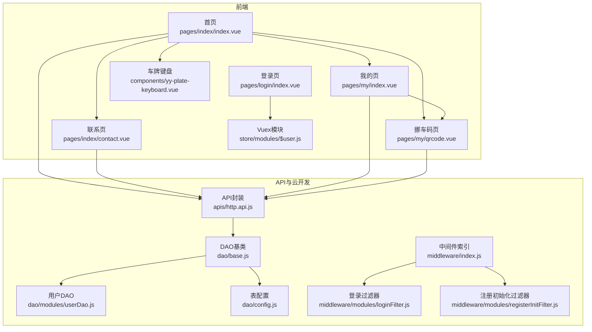
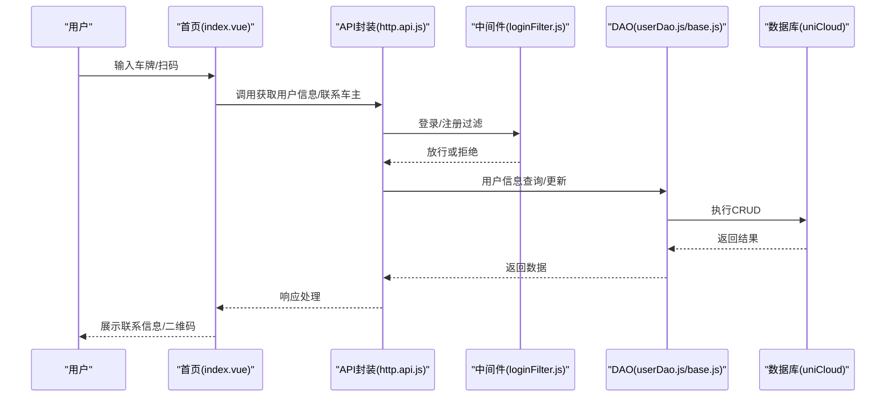
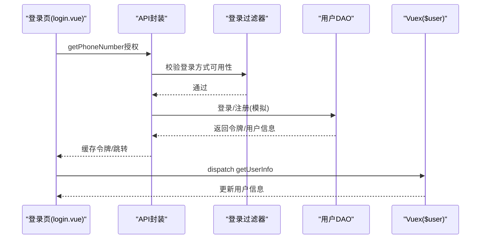
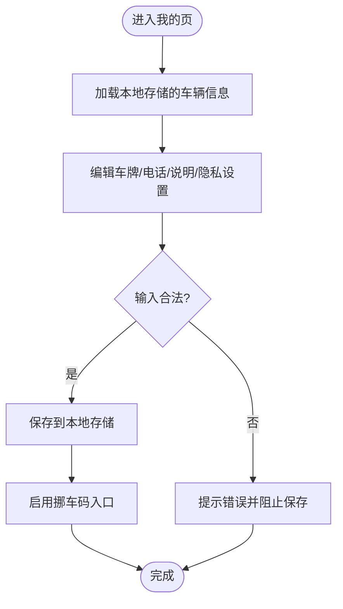
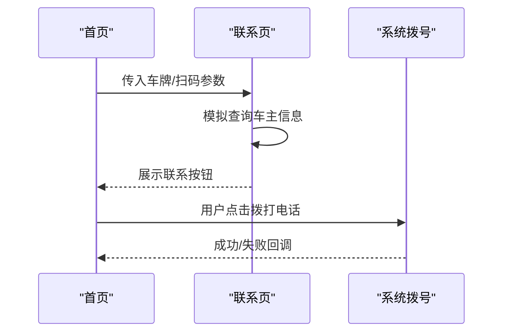
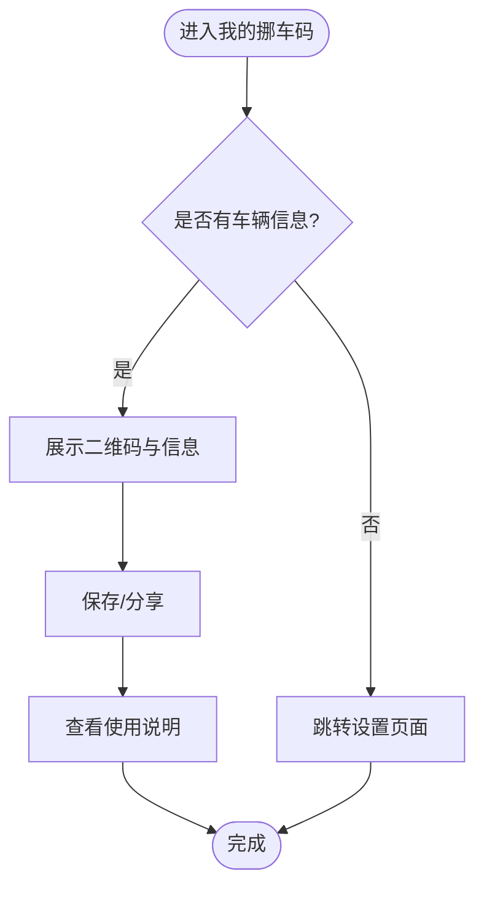
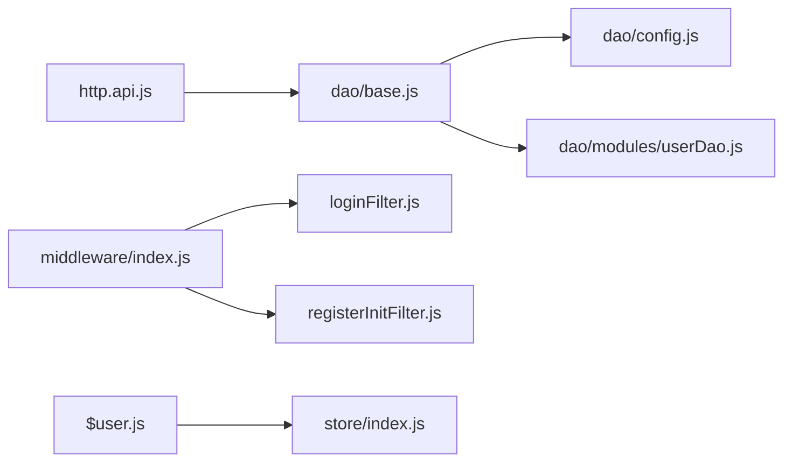

# 核心功能模块

<cite>
**本文档引用的文件**
- [pages/index/index.vue](file://pages/index/index.vue)
- [pages/index/contact.vue](file://pages/index/contact.vue)
- [pages/my/index.vue](file://pages/my/index.vue)
- [pages/my/qrcode.vue](file://pages/my/qrcode.vue)
- [pages/login/index.vue](file://pages/login/index.vue)
- [components/yy-plate-keyboard.vue](file://components/yy-plate-keyboard.vue)
- [store/modules/$user.js](file://store/modules/$user.js)
- [store/index.js](file://store/index.js)
- [apis/http.api.js](file://apis/http.api.js)
- [uniCloud-aliyun/cloudfunctions/router/dao/base.js](file://uniCloud-aliyun/cloudfunctions/router/dao/base.js)
- [uniCloud-aliyun/cloudfunctions/router/dao/config.js](file://uniCloud-aliyun/cloudfunctions/router/dao/config.js)
- [uniCloud-aliyun/cloudfunctions/router/dao/modules/userDao.js](file://uniCloud-aliyun/cloudfunctions/router/dao/modules/userDao.js)
- [uniCloud-aliyun/cloudfunctions/router/middleware/index.js](file://uniCloud-aliyun/cloudfunctions/router/middleware/index.js)
- [uniCloud-aliyun/cloudfunctions/router/middleware/modules/loginFilter.js](file://uniCloud-aliyun/cloudfunctions/router/middleware/modules/loginFilter.js)
- [uniCloud-aliyun/cloudfunctions/router/middleware/modules/registerInitFilter.js](file://uniCloud-aliyun/cloudfunctions/router/middleware/modules/registerInitFilter.js)
</cite>

## 目录
1. [简介](#简介)
2. [项目结构](#项目结构)
3. [核心组件](#核心组件)
4. [架构总览](#架构总览)
5. [详细组件分析](#详细组件分析)
6. [依赖分析](#依赖分析)
7. [性能考虑](#性能考虑)
8. [故障排查指南](#故障排查指南)
9. [结论](#结论)
10. [附录](#附录)

## 简介
本项目为“挪车助手”小程序，围绕“用户管理、车辆管理、联系功能、挪车码系统”四大核心模块构建，提供从用户注册登录、车辆信息维护、车牌输入与识别、车主联系、到QR码生成与扫码联系的完整闭环。前端采用基于uView-Plus与自研组件的混合开发，后端基于uniCloud云开发，DAO层抽象统一，中间件体系支持登录注册策略控制与初始化。

## 项目结构
- 前端页面与组件
  - 首页：输入车牌、扫码入口、我的车辆与挪车码入口
  - 联系页：根据车牌查询车主信息并提供联系操作
  - 我的页：车辆信息编辑、隐私设置、挪车码入口
  - 登录页：手机号一键登录流程与协议确认
  - 自定义组件：车牌输入键盘、主题选择、空状态等
- 状态管理：Vuex模块化管理用户信息与持久化
- API封装：统一HTTP配置与接口映射
- 云开发：DAO基类与表配置，中间件统一登录注册策略与初始化

图表来源
- [pages/index/index.vue:1-720](file://pages/index/index.vue#L1-L720)
- [pages/index/contact.vue:1-654](file://pages/index/contact.vue#L1-L654)
- [pages/my/index.vue:1-682](file://pages/my/index.vue#L1-L682)
- [pages/my/qrcode.vue:1-402](file://pages/my/qrcode.vue#L1-L402)
- [pages/login/index.vue:1-295](file://pages/login/index.vue#L1-L295)
- [components/yy-plate-keyboard.vue:1-317](file://components/yy-plate-keyboard.vue#L1-L317)
- [store/modules/$user.js:1-26](file://store/modules/$user.js#L1-L26)
- [apis/http.api.js:1-32](file://apis/http.api.js#L1-L32)
- [uniCloud-aliyun/cloudfunctions/router/dao/base.js:1-697](file://uniCloud-aliyun/cloudfunctions/router/dao/base.js#L1-L697)
- [uniCloud-aliyun/cloudfunctions/router/dao/config.js:1-66](file://uniCloud-aliyun/cloudfunctions/router/dao/config.js#L1-L66)
- [uniCloud-aliyun/cloudfunctions/router/dao/modules/userDao.js:1-568](file://uniCloud-aliyun/cloudfunctions/router/dao/modules/userDao.js#L1-L568)
- [uniCloud-aliyun/cloudfunctions/router/middleware/index.js:1-34](file://uniCloud-aliyun/cloudfunctions/router/middleware/index.js#L1-L34)
- [uniCloud-aliyun/cloudfunctions/router/middleware/modules/loginFilter.js:1-53](file://uniCloud-aliyun/cloudfunctions/router/middleware/modules/loginFilter.js#L1-L53)
- [uniCloud-aliyun/cloudfunctions/router/middleware/modules/registerInitFilter.js:1-45](file://uniCloud-aliyun/cloudfunctions/router/middleware/modules/registerInitFilter.js#L1-L45)

章节来源
- [pages/index/index.vue:1-720](file://pages/index/index.vue#L1-L720)
- [pages/my/index.vue:1-682](file://pages/my/index.vue#L1-L682)
- [pages/login/index.vue:1-295](file://pages/login/index.vue#L1-L295)
- [store/modules/$user.js:1-26](file://store/modules/$user.js#L1-L26)
- [apis/http.api.js:1-32](file://apis/http.api.js#L1-L32)
- [uniCloud-aliyun/cloudfunctions/router/dao/base.js:1-697](file://uniCloud-aliyun/cloudfunctions/router/dao/base.js#L1-L697)
- [uniCloud-aliyun/cloudfunctions/router/dao/config.js:1-66](file://uniCloud-aliyun/cloudfunctions/router/dao/config.js#L1-L66)
- [uniCloud-aliyun/cloudfunctions/router/dao/modules/userDao.js:1-568](file://uniCloud-aliyun/cloudfunctions/router/dao/modules/userDao.js#L1-L568)
- [uniCloud-aliyun/cloudfunctions/router/middleware/index.js:1-34](file://uniCloud-aliyun/cloudfunctions/router/middleware/index.js#L1-L34)
- [uniCloud-aliyun/cloudfunctions/router/middleware/modules/loginFilter.js:1-53](file://uniCloud-aliyun/cloudfunctions/router/middleware/modules/loginFilter.js#L1-L53)
- [uniCloud-aliyun/cloudfunctions/router/middleware/modules/registerInitFilter.js:1-45](file://uniCloud-aliyun/cloudfunctions/router/middleware/modules/registerInitFilter.js#L1-L45)

## 核心组件
- 用户管理系统
  - 登录流程：手机号一键登录、协议确认、令牌缓存、用户信息拉取
  - 用户信息：Vuex模块集中管理，持久化存储
- 车辆管理模块
  - 车牌输入：自定义车牌键盘，输入校验与历史记录
  - 车辆信息：我的页编辑车牌、车型/颜色、电话、联系说明、隐私开关
- 联系功能模块
  - 车牌查询：根据车牌查询车主信息（模拟/真实）
  - 联系操作：拨打电话、短信联系（预留）
- 挪车码系统
  - 二维码展示：保存/分享入口
  - 使用说明：三步指引

章节来源
- [pages/login/index.vue:1-295](file://pages/login/index.vue#L1-L295)
- [store/modules/$user.js:1-26](file://store/modules/$user.js#L1-L26)
- [pages/my/index.vue:1-682](file://pages/my/index.vue#L1-L682)
- [components/yy-plate-keyboard.vue:1-317](file://components/yy-plate-keyboard.vue#L1-L317)
- [pages/index/contact.vue:1-654](file://pages/index/contact.vue#L1-L654)
- [pages/my/qrcode.vue:1-402](file://pages/my/qrcode.vue#L1-L402)

## 架构总览
前端通过API封装调用云函数路由，DAO层统一数据库访问，中间件负责登录注册策略与注册后初始化。用户信息与业务状态通过Vuex持久化。

图表来源
- [pages/index/index.vue:1-720](file://pages/index/index.vue#L1-L720)
- [apis/http.api.js:1-32](file://apis/http.api.js#L1-L32)
- [uniCloud-aliyun/cloudfunctions/router/middleware/modules/loginFilter.js:1-53](file://uniCloud-aliyun/cloudfunctions/router/middleware/modules/loginFilter.js#L1-L53)
- [uniCloud-aliyun/cloudfunctions/router/dao/modules/userDao.js:1-568](file://uniCloud-aliyun/cloudfunctions/router/dao/modules/userDao.js#L1-L568)
- [uniCloud-aliyun/cloudfunctions/router/dao/base.js:1-697](file://uniCloud-aliyun/cloudfunctions/router/dao/base.js#L1-L697)

## 详细组件分析

### 用户管理系统
- 登录流程
  - 手机号一键登录：触发授权事件，协议确认后执行登录，缓存令牌与用户信息
  - 用户信息拉取：通过Vuex分发获取用户信息动作
- 状态管理
  - $user模块：持久化用户信息、权限、邀请码、历史数据、定位信息等
  - 全局store：模块注册、持久化生命周期管理

图表来源
- [pages/login/index.vue:1-295](file://pages/login/index.vue#L1-L295)
- [store/modules/$user.js:1-26](file://store/modules/$user.js#L1-L26)
- [uniCloud-aliyun/cloudfunctions/router/middleware/modules/loginFilter.js:1-53](file://uniCloud-aliyun/cloudfunctions/router/middleware/modules/loginFilter.js#L1-L53)
- [uniCloud-aliyun/cloudfunctions/router/dao/modules/userDao.js:1-568](file://uniCloud-aliyun/cloudfunctions/router/dao/modules/userDao.js#L1-L568)

章节来源
- [pages/login/index.vue:1-295](file://pages/login/index.vue#L1-L295)
- [store/modules/$user.js:1-26](file://store/modules/$user.js#L1-L26)
- [store/index.js:1-136](file://store/index.js#L1-L136)

### 车辆管理模块
- 车牌输入与校验
  - 自定义键盘：省份首字、字母数字、删除键、光标动画
  - 输入限制：长度与字符约束（避免I/O等非法字符）
- 车辆信息维护
  - 我的页：车牌、车型/颜色、电话、联系说明、隐私开关
  - 保存逻辑：本地存储my_car_info，启用“我的挪车码”入口

图表来源
- [pages/my/index.vue:1-682](file://pages/my/index.vue#L1-L682)
- [components/yy-plate-keyboard.vue:1-317](file://components/yy-plate-keyboard.vue#L1-L317)

章节来源
- [pages/my/index.vue:1-682](file://pages/my/index.vue#L1-L682)
- [components/yy-plate-keyboard.vue:1-317](file://components/yy-plate-keyboard.vue#L1-L317)

### 联系功能模块
- 车牌查询与联系
  - 首页输入车牌或扫码进入联系页
  - 联系页：加载中/未找到/已找到三种状态，展示车主信息与联系操作
  - 拨打电话：调用系统拨号接口
- 历史记录
  - 首页：历史搜索记录，支持清除

图表来源
- [pages/index/index.vue:1-720](file://pages/index/index.vue#L1-L720)
- [pages/index/contact.vue:1-654](file://pages/index/contact.vue#L1-L654)

章节来源
- [pages/index/index.vue:1-720](file://pages/index/index.vue#L1-L720)
- [pages/index/contact.vue:1-654](file://pages/index/contact.vue#L1-L654)

### 挪车码系统
- 二维码展示与操作
  - 未设置信息：引导前往“我的”设置
  - 已设置信息：展示车牌、电话、备注，提供保存/分享入口
- 使用说明
  - 三步指引：保存/打印、贴在车窗、等待扫码联系

图表来源
- [pages/my/qrcode.vue:1-402](file://pages/my/qrcode.vue#L1-L402)

章节来源
- [pages/my/qrcode.vue:1-402](file://pages/my/qrcode.vue#L1-L402)

## 依赖分析
- 前端依赖
  - API封装：统一HTTP配置与接口映射
  - Vuex模块：$user模块与全局store持久化
  - 组件：yy-plate-keyboard等UI组件
- 云开发依赖
  - DAO基类：统一CRUD、聚合、联表、事务能力
  - 表配置：统一表名常量
  - 中间件：登录注册过滤与注册后初始化

图表来源
- [apis/http.api.js:1-32](file://apis/http.api.js#L1-L32)
- [uniCloud-aliyun/cloudfunctions/router/dao/base.js:1-697](file://uniCloud-aliyun/cloudfunctions/router/dao/base.js#L1-L697)
- [uniCloud-aliyun/cloudfunctions/router/dao/config.js:1-66](file://uniCloud-aliyun/cloudfunctions/router/dao/config.js#L1-L66)
- [uniCloud-aliyun/cloudfunctions/router/dao/modules/userDao.js:1-568](file://uniCloud-aliyun/cloudfunctions/router/dao/modules/userDao.js#L1-L568)
- [uniCloud-aliyun/cloudfunctions/router/middleware/index.js:1-34](file://uniCloud-aliyun/cloudfunctions/router/middleware/index.js#L1-L34)
- [uniCloud-aliyun/cloudfunctions/router/middleware/modules/loginFilter.js:1-53](file://uniCloud-aliyun/cloudfunctions/router/middleware/modules/loginFilter.js#L1-L53)
- [uniCloud-aliyun/cloudfunctions/router/middleware/modules/registerInitFilter.js:1-45](file://uniCloud-aliyun/cloudfunctions/router/middleware/modules/registerInitFilter.js#L1-L45)
- [store/modules/$user.js:1-26](file://store/modules/$user.js#L1-L26)
- [store/index.js:1-136](file://store/index.js#L1-L136)

章节来源
- [apis/http.api.js:1-32](file://apis/http.api.js#L1-L32)
- [uniCloud-aliyun/cloudfunctions/router/dao/base.js:1-697](file://uniCloud-aliyun/cloudfunctions/router/dao/base.js#L1-L697)
- [uniCloud-aliyun/cloudfunctions/router/dao/config.js:1-66](file://uniCloud-aliyun/cloudfunctions/router/dao/config.js#L1-L66)
- [uniCloud-aliyun/cloudfunctions/router/dao/modules/userDao.js:1-568](file://uniCloud-aliyun/cloudfunctions/router/dao/modules/userDao.js#L1-L568)
- [uniCloud-aliyun/cloudfunctions/router/middleware/index.js:1-34](file://uniCloud-aliyun/cloudfunctions/router/middleware/index.js#L1-L34)
- [uniCloud-aliyun/cloudfunctions/router/middleware/modules/loginFilter.js:1-53](file://uniCloud-aliyun/cloudfunctions/router/middleware/modules/loginFilter.js#L1-L53)
- [uniCloud-aliyun/cloudfunctions/router/middleware/modules/registerInitFilter.js:1-45](file://uniCloud-aliyun/cloudfunctions/router/middleware/modules/registerInitFilter.js#L1-L45)
- [store/modules/$user.js:1-26](file://store/modules/$user.js#L1-L26)
- [store/index.js:1-136](file://store/index.js#L1-L136)

## 性能考虑
- 前端
  - 页面懒加载与轻量组件：减少首屏渲染压力
  - 本地存储：my_car_info、plate_search_history等减少重复网络请求
  - 虚拟列表/分页：在列表场景使用z-paging组件优化滚动性能
- 云开发
  - DAO层统一查询：合理使用fieldJson、whereJson、sortArr，避免全表扫描
  - 聚合查询：selects支持联表与分组，注意lastWhereJson与lastSortArr对性能的影响
  - 中间件顺序：登录过滤器index>300，确保在通用登录检测之后执行

## 故障排查指南
- 登录失败
  - 检查协议弹窗是否正确触发与用户确认
  - 核对授权事件状态与错误码
  - 核对令牌缓存与过期时间
- 车主信息未找到
  - 首页联系页模拟查询逻辑，确认本地存储my_car_info是否匹配
  - 真实场景下检查后端接口与DAO查询条件
- 车牌输入异常
  - 确认自定义键盘省份首字与字母数字键位
  - 检查输入长度与非法字符过滤
- QR码展示问题
  - 确认本地存储my_car_info是否完整
  - 保存/分享功能按页面提示进行

章节来源
- [pages/login/index.vue:1-295](file://pages/login/index.vue#L1-L295)
- [pages/index/contact.vue:1-654](file://pages/index/contact.vue#L1-L654)
- [components/yy-plate-keyboard.vue:1-317](file://components/yy-plate-keyboard.vue#L1-L317)
- [pages/my/qrcode.vue:1-402](file://pages/my/qrcode.vue#L1-L402)

## 结论
本项目通过清晰的模块划分与前后端协同，实现了从用户登录、车辆信息维护到联系车主与生成挪车码的完整业务闭环。前端组件化与云开发DAO/中间件体系保证了扩展性与可维护性。建议后续完善真实车主查询与QR码生成接口，增强隐私与安全策略。

## 附录
- 关键文件路径与职责
  - pages/index/index.vue：首页入口、车牌输入、扫码入口、历史记录
  - pages/index/contact.vue：联系车主流程与状态展示
  - pages/my/index.vue：车辆信息编辑与隐私设置
  - pages/my/qrcode.vue：挪车码展示与使用说明
  - pages/login/index.vue：手机号一键登录与协议确认
  - components/yy-plate-keyboard.vue：自定义车牌输入键盘
  - store/modules/$user.js：用户信息状态管理
  - apis/http.api.js：API接口封装与环境配置
  - uniCloud-aliyun/cloudfunctions/router/dao/base.js：DAO基类与通用CRUD
  - uniCloud-aliyun/cloudfunctions/router/dao/config.js：表名常量配置
  - uniCloud-aliyun/cloudfunctions/router/dao/modules/userDao.js：用户表业务DAO
  - uniCloud-aliyun/cloudfunctions/router/middleware/index.js：中间件加载入口
  - uniCloud-aliyun/cloudfunctions/router/middleware/modules/loginFilter.js：登录注册过滤
  - uniCloud-aliyun/cloudfunctions/router/middleware/modules/registerInitFilter.js：注册初始化