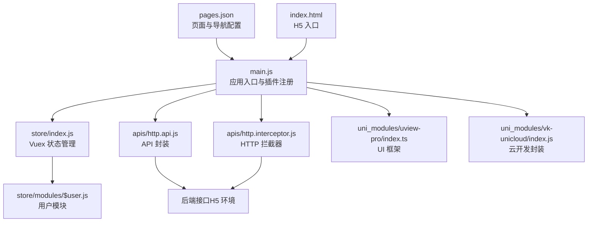
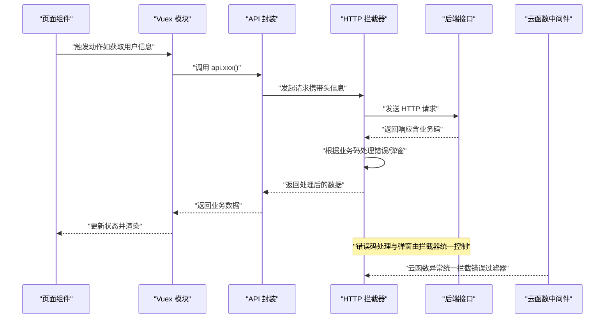
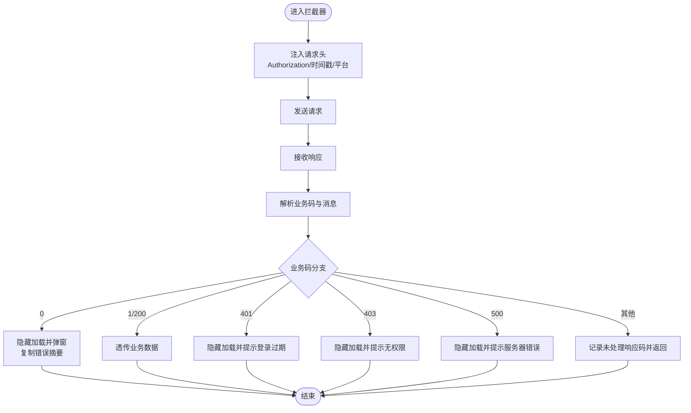
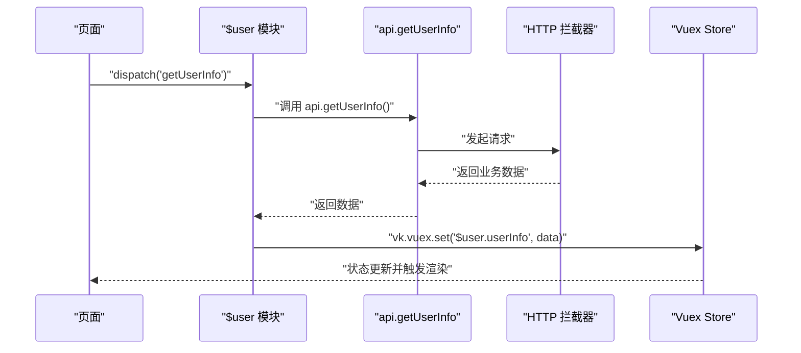
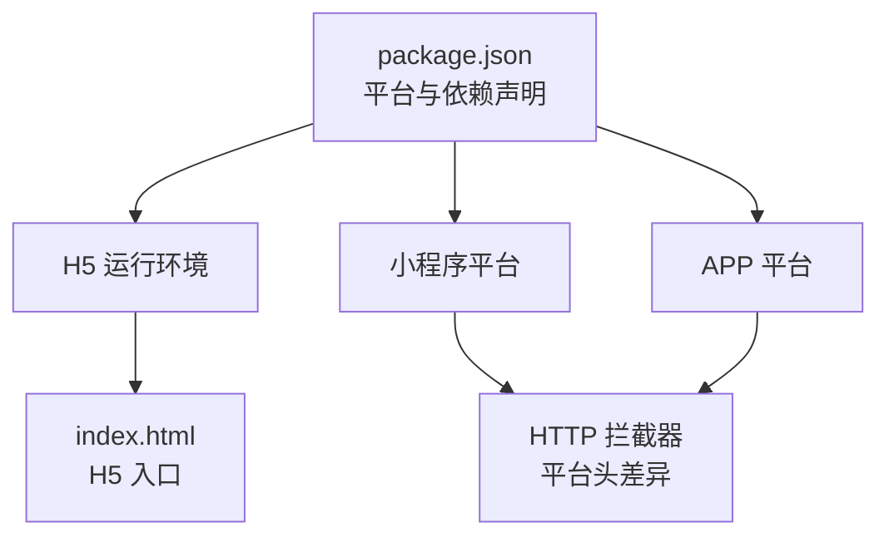

# 测试与调试

<cite>
**本文引用的文件**
- [package.json](file://package.json)
- [main.js](file://main.js)
- [pages.json](file://pages.json)
- [apis/http.api.js](file://apis/http.api.js)
- [apis/http.interceptor.js](file://apis/http.interceptor.js)
- [store/index.js](file://store/index.js)
- [store/modules/$user.js](file://store/modules/$user.js)
- [uni_modules/vk-unicloud/index.js](file://uni_modules/vk-unicloud/index.js)
- [uni_modules/uview-pro/index.ts](file://uni_modules/uview-pro/index.ts)
- [uni_modules/uni-id/package.json](file://uni_modules/uni-id/package.json)
- [uniCloud-aliyun/cloudfunctions/router/middleware/modules/errorFilter.js](file://uniCloud-aliyun/cloudfunctions/router/middleware/modules/errorFilter.js)
- [uniCloud-aliyun/cloudfunctions/router/service/admin/system_uni/error-log/sys/getList.js](file://uniCloud-aliyun/cloudfunctions/router/service/admin/system_uni/error-log/sys/getList.js)
- [uniCloud-aliyun/cloudfunctions/router/service/admin/system_uni/error-log/sys/update.js](file://uniCloud-aliyun/cloudfunctions/router/service/admin/system_uni/error-log/sys/update.js)
- [uniCloud-aliyun/cloudfunctions/router/service/admin/system/app/util/createPublishHtml/index.js](file://uniCloud-aliyun/cloudfunctions/router/service/admin/system/app/util/createPublishHtml/index.js)
- [.agents/skills/uview-pro/references/tools/test.md](file://.agents/skills/uview-pro/references/tools/test.md)
- [index.html](file://index.html)
</cite>

## 目录
1. [简介](#简介)
2. [项目结构](#项目结构)
3. [核心组件](#核心组件)
4. [架构总览](#架构总览)
5. [详细组件分析](#详细组件分析)
6. [依赖分析](#依赖分析)
7. [性能考虑](#性能考虑)
8. [故障排查指南](#故障排查指南)
9. [结论](#结论)
10. [附录](#附录)

## 简介
本指南面向挪车助手项目的测试与调试工作，覆盖单元测试、集成测试与端到端测试策略；针对 H5、小程序与 APP 多端差异给出测试要点；提供网络请求调试、数据流追踪与错误日志分析方法；并包含性能测试、内存泄漏检测与兼容性测试实践，以及调试工具使用与常见问题排查流程。

## 项目结构
项目采用 uni-app 多端统一工程，前端入口在 main.js 注册应用、状态管理与 HTTP 拦截器；API 封装集中于 apis/http.api.js；状态管理位于 store；UI 组件基于 uView-Pro；云开发路由与中间件位于 uniCloud-aliyun/cloudfunctions/router；错误日志与后台管理接口用于定位线上问题。

图表来源
- [main.js:1-49](file://main.js#L1-L49)
- [store/index.js:1-136](file://store/index.js#L1-L136)
- [store/modules/$user.js:1-26](file://store/modules/$user.js#L1-L26)
- [apis/http.api.js:1-32](file://apis/http.api.js#L1-L32)
- [apis/http.interceptor.js:1-116](file://apis/http.interceptor.js#L1-L116)
- [uni_modules/uview-pro/index.ts:1-101](file://uni_modules/uview-pro/index.ts#L1-L101)
- [uni_modules/vk-unicloud/index.js:1-4](file://uni_modules/vk-unicloud/index.js#L1-L4)
- [pages.json:1-87](file://pages.json#L1-L87)
- [index.html:1-26](file://index.html#L1-L26)

章节来源
- [main.js:1-49](file://main.js#L1-L49)
- [pages.json:1-87](file://pages.json#L1-L87)
- [index.html:1-26](file://index.html#L1-L26)

## 核心组件
- 应用入口与插件注册：在 main.js 中完成 uView-Pro、vk-unicloud、Vuex、API 与 HTTP 拦截器的安装与初始化。
- 状态管理：store/index.js 动态加载 modules 并支持严格模式；$user 模块提供用户信息获取与持久化读取。
- API 封装：apis/http.api.js 提供统一的 API 方法与当前环境基址切换。
- HTTP 拦截器：apis/http.interceptor.js 统一注入 Authorization、时间戳与客户端平台头，并按业务码处理错误与弹窗。
- UI 框架：uView-Pro 在 main.js 中按主题与暗黑模式初始化，并支持调试模式。
- 云开发：vk-unicloud 提供前端侧云能力封装，配合 uniCloud-aliyun 的 router 与中间件实现鉴权、日志与错误拦截。
- 页面与导航：pages.json 定义页面路径、导航标题与 tabBar 样式；index.html 为 H5 入口。

章节来源
- [main.js:1-49](file://main.js#L1-L49)
- [store/index.js:1-136](file://store/index.js#L1-L136)
- [store/modules/$user.js:1-26](file://store/modules/$user.js#L1-L26)
- [apis/http.api.js:1-32](file://apis/http.api.js#L1-L32)
- [apis/http.interceptor.js:1-116](file://apis/http.interceptor.js#L1-L116)
- [uni_modules/uview-pro/index.ts:1-101](file://uni_modules/uview-pro/index.ts#L1-L101)
- [uni_modules/vk-unicloud/index.js:1-4](file://uni_modules/vk-unicloud/index.js#L1-L4)
- [pages.json:1-87](file://pages.json#L1-L87)
- [index.html:1-26](file://index.html#L1-L26)

## 架构总览
下图展示从前端到云服务的典型请求链路与错误处理路径，便于理解测试与调试关注点。

图表来源
- [store/modules/$user.js:16-22](file://store/modules/$user.js#L16-L22)
- [apis/http.api.js:11-31](file://apis/http.api.js#L11-L31)
- [apis/http.interceptor.js:37-115](file://apis/http.interceptor.js#L37-L115)
- [uniCloud-aliyun/cloudfunctions/router/middleware/modules/errorFilter.js:1-29](file://uniCloud-aliyun/cloudfunctions/router/middleware/modules/errorFilter.js#L1-L29)

章节来源
- [store/modules/$user.js:16-22](file://store/modules/$user.js#L16-L22)
- [apis/http.api.js:11-31](file://apis/http.api.js#L11-L31)
- [apis/http.interceptor.js:37-115](file://apis/http.interceptor.js#L37-L115)
- [uniCloud-aliyun/cloudfunctions/router/middleware/modules/errorFilter.js:1-29](file://uniCloud-aliyun/cloudfunctions/router/middleware/modules/errorFilter.js#L1-L29)

## 详细组件分析

### HTTP 请求与拦截器测试策略
- 单元测试
  - 针对 http.api.js 的 API 方法构造与 baseUrl 切换进行断言，确保不同环境映射正确。
  - 针对 http.interceptor.js 的请求头注入（Authorization、时间戳、平台）与业务码分支（0/1/200/401/403/500）进行模拟返回与断言。
- 集成测试
  - 使用 mock 服务器返回不同业务码，验证拦截器弹窗与错误复制逻辑。
  - 验证 Token 缓存缺失时请求头是否正确注入与回退行为。
- 端到端测试
  - 在 H5、小程序与 APP 环境分别发起真实请求，验证拦截器统一行为与 UI 提示一致性。
  - 关注跨端差异：小程序平台头与 H5 的差异、APP 的网络栈差异。

图表来源
- [apis/http.interceptor.js:37-115](file://apis/http.interceptor.js#L37-L115)

章节来源
- [apis/http.api.js:1-32](file://apis/http.api.js#L1-L32)
- [apis/http.interceptor.js:1-116](file://apis/http.interceptor.js#L1-L116)

### 状态管理与数据流追踪
- 单元测试
  - 针对 store/modules/$user.js 的 actions（如 getUserInfo）进行异步断言，验证调用 api.getUserInfo 与状态更新。
- 集成测试
  - 结合 http.interceptor.js 的业务码分支，验证用户信息获取失败时的错误提示与状态不变。
- 端到端测试
  - 在真实环境中触发用户信息获取，观察状态变更与 UI 更新；对比 H5 与小程序的数据持久化差异。

图表来源
- [store/modules/$user.js:16-22](file://store/modules/$user.js#L16-L22)
- [apis/http.api.js:19-28](file://apis/http.api.js#L19-L28)
- [apis/http.interceptor.js:49-113](file://apis/http.interceptor.js#L49-L113)
- [store/index.js:100-132](file://store/index.js#L100-L132)

章节来源
- [store/modules/$user.js:16-22](file://store/modules/$user.js#L16-L22)
- [store/index.js:1-136](file://store/index.js#L1-L136)

### UI 组件与工具校验测试
- uView-Pro 提供丰富的校验工具（如手机号、邮箱、车牌号等），可用于表单校验的单元测试与集成测试。
- 建议针对常用校验场景编写断言，覆盖边界值与非法输入。

章节来源
- [.agents/skills/uview-pro/references/tools/test.md:1-292](file://.agents/skills/uview-pro/references/tools/test.md#L1-L292)
- [uni_modules/uview-pro/index.ts:15-92](file://uni_modules/uview-pro/index.ts#L15-L92)

### 云函数中间件与错误日志
- 全局异常拦截器对所有云函数进行统一错误捕获与记录，便于线上问题定位。
- 错误日志服务提供分页查询与状态更新，支持后台管理与问题闭环。

章节来源
- [uniCloud-aliyun/cloudfunctions/router/middleware/modules/errorFilter.js:1-29](file://uniCloud-aliyun/cloudfunctions/router/middleware/modules/errorFilter.js#L1-L29)
- [uniCloud-aliyun/cloudfunctions/router/service/admin/system_uni/error-log/sys/getList.js:1-35](file://uniCloud-aliyun/cloudfunctions/router/service/admin/system_uni/error-log/sys/getList.js#L1-L35)
- [uniCloud-aliyun/cloudfunctions/router/service/admin/system_uni/error-log/sys/update.js:1-35](file://uniCloud-aliyun/cloudfunctions/router/service/admin/system_uni/error-log/sys/update.js#L1-L35)

## 依赖分析
- 多端兼容性
  - uni_modules/uni-id/package.json 显示小程序平台覆盖广泛，H5 与 APP 的浏览器支持情况需结合实际运行环境验证。
- H5、小程序与 APP 差异
  - H5：通过 index.html 加载 main.js；注意浏览器安全策略与跨域。
  - 小程序：平台头注入与网络栈差异，需在拦截器中分别验证。
  - APP：原生网络栈与缓存策略，需关注超时与重试机制。

图表来源
- [package.json:54-109](file://package.json#L54-L109)
- [index.html:1-26](file://index.html#L1-L26)
- [apis/http.interceptor.js:37-47](file://apis/http.interceptor.js#L37-L47)

章节来源
- [package.json:54-109](file://package.json#L54-L109)
- [index.html:1-26](file://index.html#L1-L26)
- [apis/http.interceptor.js:37-47](file://apis/http.interceptor.js#L37-L47)

## 性能考虑
- 网络请求优化
  - 合理设置超时与重试；在拦截器中记录请求耗时与业务码分布，辅助定位慢请求。
- 内存与渲染
  - 在 store/index.js 中开启严格模式，便于发现状态修改异常；避免大对象频繁深拷贝。
- 兼容性测试
  - 在不同浏览器内核（Chrome/Safari）与小程序基础库版本上验证 UI 与交互稳定性。
- 资源与构建
  - 关注打包体积与按需引入组件，减少首屏阻塞。

## 故障排查指南
- 网络请求调试
  - 在 http.interceptor.js 中检查请求头注入与业务码分支，确认错误弹窗与复制功能是否正常。
  - 使用浏览器开发者工具 Network 面板查看请求头、响应码与响应体。
- 数据流追踪
  - 在 store/modules/$user.js 的 actions 中断点或日志，确认 api.getUserInfo 的调用与状态更新。
- 错误日志分析
  - 通过错误日志服务分页查询与状态更新，定位重复错误与处理进度。
- 常见问题
  - 登录过期：拦截器对 401 的处理与页面跳转逻辑需保持一致。
  - 权限不足：403 提示需明确引导用户。
  - 服务器错误：500 提示与重试策略需统一。

章节来源
- [apis/http.interceptor.js:37-115](file://apis/http.interceptor.js#L37-L115)
- [store/modules/$user.js:16-22](file://store/modules/$user.js#L16-L22)
- [uniCloud-aliyun/cloudfunctions/router/service/admin/system_uni/error-log/sys/getList.js:15-35](file://uniCloud-aliyun/cloudfunctions/router/service/admin/system_uni/error-log/sys/getList.js#L15-L35)
- [uniCloud-aliyun/cloudfunctions/router/service/admin/system_uni/error-log/sys/update.js:6-35](file://uniCloud-aliyun/cloudfunctions/router/service/admin/system_uni/error-log/sys/update.js#L6-L35)

## 结论
通过在前端（API 封装、拦截器、状态管理）、云函数中间件与错误日志体系的协同，挪车助手项目具备完善的测试与调试基础。建议在多端环境下持续完善单元与端到端测试，强化性能与兼容性验证，并建立标准化的故障排查流程与日志闭环。

## 附录
- H5 发布与多端二维码生成
  - 可参考应用发布工具中的 H5 链接与二维码生成逻辑，用于多端分发与测试验证。

章节来源
- [uniCloud-aliyun/cloudfunctions/router/service/admin/system/app/util/createPublishHtml/index.js:136-175](file://uniCloud-aliyun/cloudfunctions/router/service/admin/system/app/util/createPublishHtml/index.js#L136-L175)