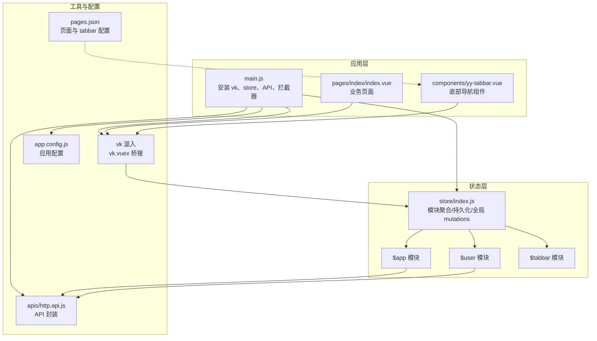
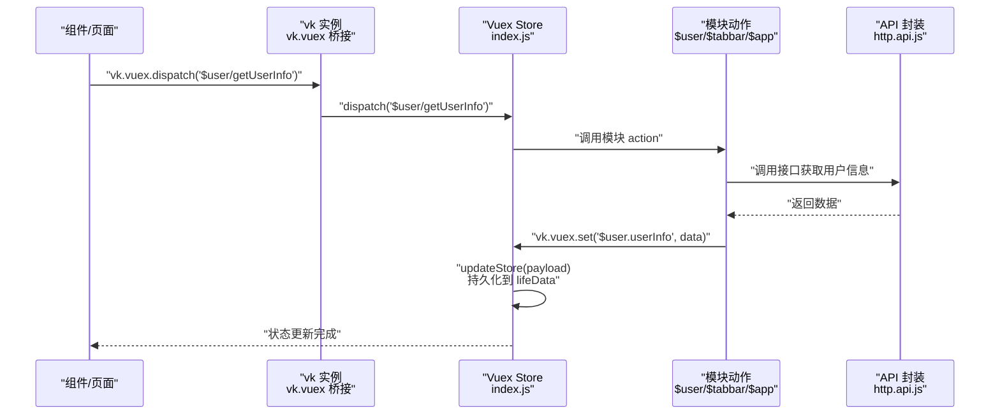
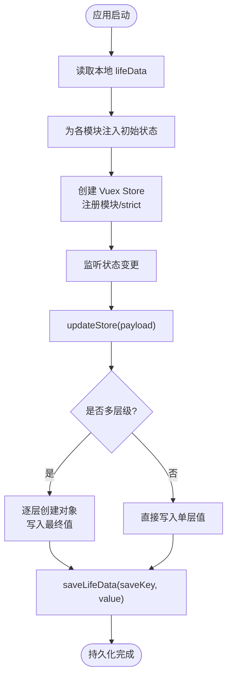
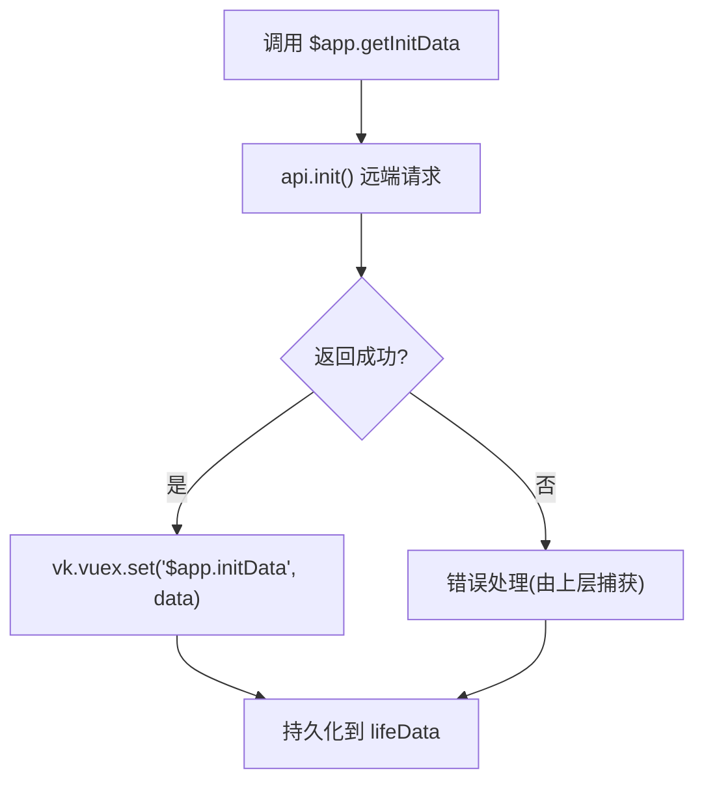
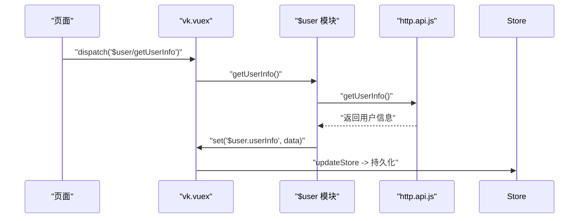
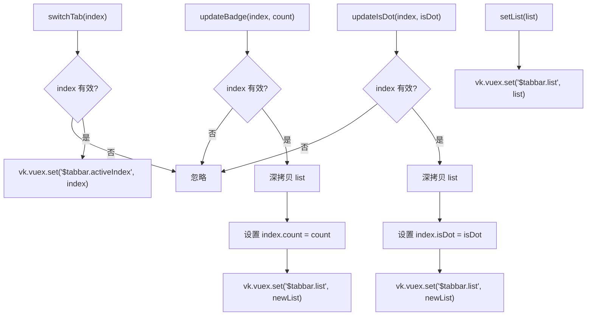
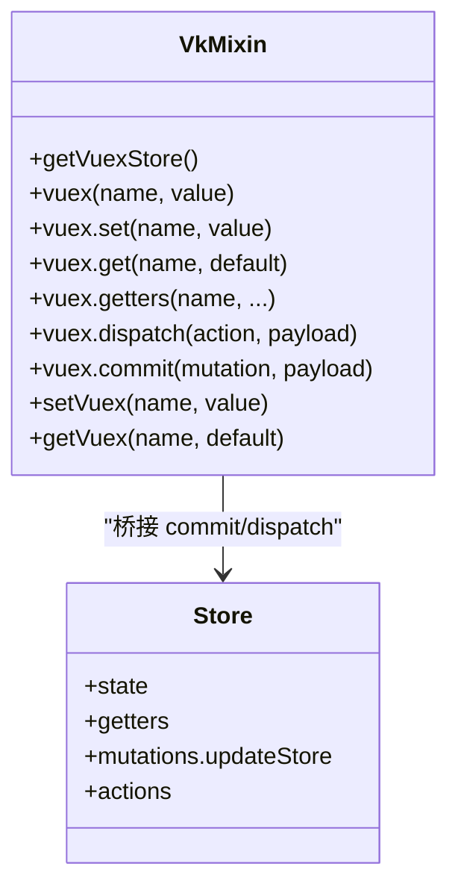
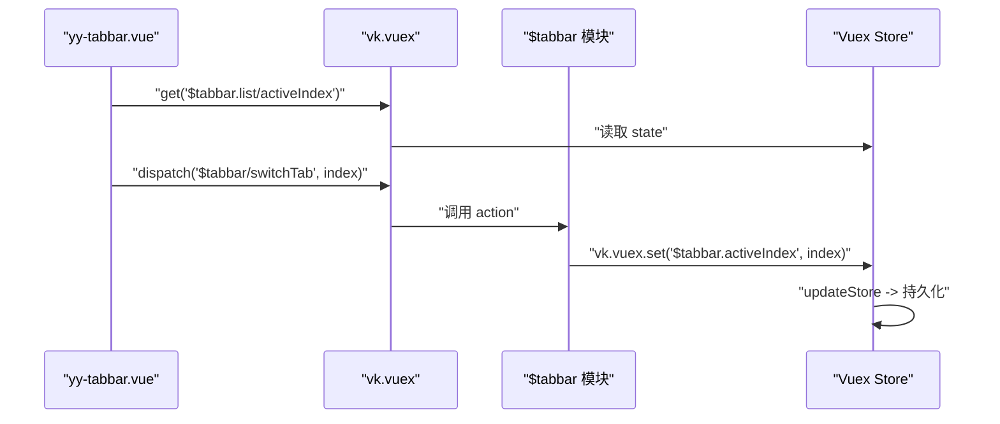
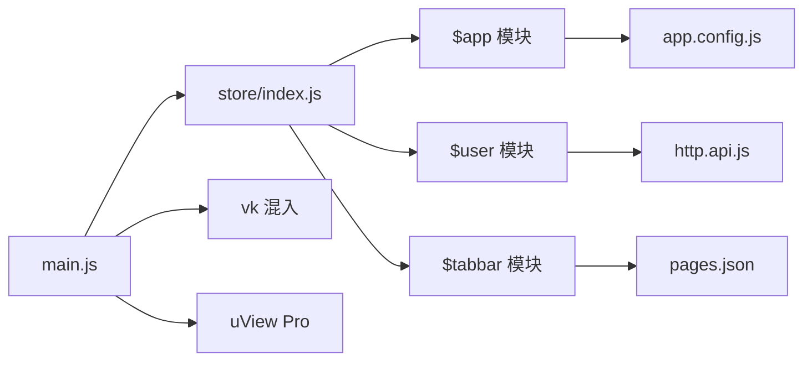

# 状态管理

<cite>
**本文引用的文件**
- [store/index.js](file://store/index.js)
- [$app 模块](file://store/modules/$app.js)
- [$user 模块](file://store/modules/$user.js)
- [$tabbar 模块](file://store/modules/$tabbar.js)
- [应用配置 app.config.js](file://app.config.js)
- [vk 混入与状态桥接](file://uni_modules/vk-unicloud/vk_modules/vk-unicloud-page/libs/store/mixin/mixin.js)
- [API 集中管理 http.api.js](file://apis/http.api.js)
- [应用入口 main.js](file://main.js)
- [首页页面 pages/index/index.vue](file://pages/index/index.vue)
- [底部导航组件 yy-tabbar.vue](file://components/yy-tabbar.vue)
- [页面路由配置 pages.json](file://pages.json)
</cite>

## 目录
1. [简介](#简介)
2. [项目结构](#项目结构)
3. [核心组件](#核心组件)
4. [架构总览](#架构总览)
5. [详细组件分析](#详细组件分析)
6. [依赖关系分析](#依赖关系分析)
7. [性能考量](#性能考量)
8. [故障排查指南](#故障排查指南)
9. [结论](#结论)
10. [附录](#附录)

## 简介
本文件系统性梳理“挪车助手”项目的基于 Vuex 的状态管理架构，重点覆盖：
- 模块化设计与命名空间隔离
- 状态持久化策略与生命周期数据恢复
- 动作变更机制与跨组件通信模式
- 最佳实践、调试技巧与性能优化建议
- 数据同步与错误处理方案

## 项目结构
项目采用标准的模块化 Vuex 架构，根 store 负责模块聚合、持久化开关与全局 mutations；各业务模块（如 $app、$user、$tabbar）按职责划分，彼此通过 vk.vuex 桥接进行松耦合交互。

图表来源
- [store/index.js:1-136](file://store/index.js#L1-L136)
- [store/modules/$app.js:1-36](file://store/modules/$app.js#L1-L36)
- [store/modules/$user.js:1-26](file://store/modules/$user.js#L1-L26)
- [store/modules/$tabbar.js:1-78](file://store/modules/$tabbar.js#L1-L78)
- [uni_modules/vk-unicloud/vk_modules/vk-unicloud-page/libs/store/mixin/mixin.js:1-73](file://uni_modules/vk-unicloud/vk_modules/vk-unicloud-page/libs/store/mixin/mixin.js#L1-L73)
- [apis/http.api.js:1-32](file://apis/http.api.js#L1-L32)
- [app.config.js:1-111](file://app.config.js#L1-L111)
- [pages.json:1-87](file://pages.json#L1-L87)

章节来源
- [store/index.js:1-136](file://store/index.js#L1-L136)
- [main.js:1-49](file://main.js#L1-L49)
- [pages.json:1-87](file://pages.json#L1-L87)

## 核心组件
- 根 store 与持久化
  - 自动扫描 modules 目录，合并命名空间模块
  - 通过全局 mutations 提供统一的 set/get/commit/dispatch 能力
  - 通过 lifeData 机制持久化非敏感状态，支持下次启动恢复
- $app 模块
  - 应用级初始化数据、主题色、定位权限、网络状态等
  - 提供异步初始化动作，拉取远端配置并写入状态
- $user 模块
  - 用户信息、权限、邀请码、历史数据、定位状态等
  - 提供异步获取用户信息的动作
- $tabbar 模块
  - 底部导航列表、当前激活索引、角标与红点状态
  - 提供切换 tab、更新角标、更新红点、设置列表等动作

章节来源
- [store/index.js:1-136](file://store/index.js#L1-L136)
- [store/modules/$app.js:1-36](file://store/modules/$app.js#L1-L36)
- [store/modules/$user.js:1-26](file://store/modules/$user.js#L1-L26)
- [store/modules/$tabbar.js:1-78](file://store/modules/$tabbar.js#L1-L78)

## 架构总览
下图展示了从组件到 store、再到 API 的典型调用链路，以及持久化写回流程。

图表来源
- [uni_modules/vk-unicloud/vk_modules/vk-unicloud-page/libs/store/mixin/mixin.js:1-73](file://uni_modules/vk-unicloud/vk_modules/vk-unicloud-page/libs/store/mixin/mixin.js#L1-L73)
- [store/index.js:67-133](file://store/index.js#L67-L133)
- [store/modules/$user.js:16-24](file://store/modules/$user.js#L16-L24)
- [apis/http.api.js:19-32](file://apis/http.api.js#L19-L32)

## 详细组件分析

### 根 store 与持久化机制
- 自动模块发现与命名空间
  - 支持 VUE2/VUE3 不同打包方式，统一收集 modules 下的命名空间模块
  - 对 index.js 结尾的模块路径进行规范化处理
- 全局 mutations
  - updateStore 支持多层级路径写入，自动补齐中间对象
  - 写入后根据白名单决定是否持久化到本地 lifeData
- 生命周期数据恢复
  - 启动时从本地 lifeData 读取模块初始状态
  - 未显式声明持久化的模块（如 $error）不会被恢复

图表来源
- [store/index.js:48-95](file://store/index.js#L48-L95)
- [store/index.js:108-131](file://store/index.js#L108-L131)

章节来源
- [store/index.js:1-136](file://store/index.js#L1-L136)

### $app 模块
- 职责
  - 应用初始化标志、全局配置、颜色主题、原始页面、初始化数据、网络类型、权限检查、经纬度、首页更新标记等
- 数据结构
  - inited: 初始化完成标志
  - config: 合并 app.config.js 的全局配置
  - color: 主题色
  - originalPage: 原始页面上下文
  - initData: 远端初始化数据
  - networkType: 网络类型
  - 权限与定位相关字段
- 动作
  - getInitData: 拉取远端初始化数据并写入 $app.initData

图表来源
- [store/modules/$app.js:28-34](file://store/modules/$app.js#L28-L34)
- [app.config.js:1-111](file://app.config.js#L1-L111)

章节来源
- [store/modules/$app.js:1-36](file://store/modules/$app.js#L1-L36)
- [app.config.js:1-111](file://app.config.js#L1-L111)

### $user 模块
- 职责
  - 用户信息、权限集合、邀请码、历史数据、定位状态、预登录信息
- 数据结构
  - userInfo: 用户主体信息
  - permission: 权限列表
  - inviteCode: 邀请码
  - historyData: 历史数据
  - positioning: 定位状态
  - preLoginInfo: 预登录信息
- 动作
  - getUserInfo: 拉取用户信息并写入 $user.userInfo

图表来源
- [store/modules/$user.js:16-24](file://store/modules/$user.js#L16-L24)
- [apis/http.api.js:26-28](file://apis/http.api.js#L26-L28)

章节来源
- [store/modules/$user.js:1-26](file://store/modules/$user.js#L1-L26)
- [apis/http.api.js:1-32](file://apis/http.api.js#L1-L32)

### $tabbar 模块
- 职责
  - 底部导航列表、当前激活索引、角标与红点状态
- 数据结构
  - activeIndex: 当前激活索引
  - list: 导航项数组（含图标、标题、页面路径等）
- 动作
  - switchTab: 切换激活索引
  - updateBadge: 更新指定索引的角标数
  - updateIsDot: 更新指定索引的红点状态
  - setList: 替换整个列表

图表来源
- [store/modules/$tabbar.js:49-77](file://store/modules/$tabbar.js#L49-L77)

章节来源
- [store/modules/$tabbar.js:1-78](file://store/modules/$tabbar.js#L1-L78)

### vk 混入与状态桥接
- 能力
  - 将 $store 方法桥接到 vk 实例，提供 vk.vuex.set/get/getters/dispatch/commit
  - 组件内可直接通过 vk.vuex 操作状态，无需 mapState/mapGetters/mapMutations
- 使用场景
  - 页面与组件通过 vk.vuex.dispatch 调用模块动作
  - 通过 vk.vuex.get 读取深层状态，避免 undefined 报错

图表来源
- [uni_modules/vk-unicloud/vk_modules/vk-unicloud-page/libs/store/mixin/mixin.js:1-73](file://uni_modules/vk-unicloud/vk_modules/vk-unicloud-page/libs/store/mixin/mixin.js#L1-L73)
- [store/index.js:67-133](file://store/index.js#L67-L133)

章节来源
- [uni_modules/vk-unicloud/vk_modules/vk-unicloud-page/libs/store/mixin/mixin.js:1-73](file://uni_modules/vk-unicloud/vk_modules/vk-unicloud-page/libs/store/mixin/mixin.js#L1-L73)
- [store/index.js:67-133](file://store/index.js#L67-L133)

### 组件间通信与页面联动
- 底部导航与页面联动
  - 组件 yy-tabbar.vue 通过 vk.vuex.get 读取 $tabbar.list 与 activeIndex
  - 通过 vk.vuex.dispatch('$tabbar/switchTab', index) 触发模块动作
- 页面与模块交互
  - 页面通过 vk.vuex.dispatch 调用模块动作，动作内部再通过 vk.vuex.set 写回状态
  - API 请求封装在模块动作中，统一通过 http.api.js 调用

图表来源
- [components/yy-tabbar.vue:13-37](file://components/yy-tabbar.vue#L13-L37)
- [store/modules/$tabbar.js:49-54](file://store/modules/$tabbar.js#L49-L54)
- [store/index.js:67-133](file://store/index.js#L67-L133)

章节来源
- [components/yy-tabbar.vue:1-38](file://components/yy-tabbar.vue#L1-L38)
- [store/modules/$tabbar.js:1-78](file://store/modules/$tabbar.js#L1-L78)

## 依赖关系分析
- 模块依赖
  - $app 与 app.config.js 关联，读取全局配置
  - $user 与 http.api.js 关联，拉取用户信息
  - $tabbar 与页面路由配置 pages.json 关联，受 tabBar 配置影响
- 外部依赖
  - vk 框架提供状态桥接能力
  - uView Pro 提供 UI 组件生态
  - uniCloud 提供云开发能力（与状态管理解耦）

图表来源
- [main.js:1-49](file://main.js#L1-L49)
- [store/index.js:1-136](file://store/index.js#L1-L136)
- [store/modules/$app.js:1-36](file://store/modules/$app.js#L1-L36)
- [store/modules/$user.js:1-26](file://store/modules/$user.js#L1-L26)
- [store/modules/$tabbar.js:1-78](file://store/modules/$tabbar.js#L1-L78)
- [app.config.js:1-111](file://app.config.js#L1-L111)
- [apis/http.api.js:1-32](file://apis/http.api.js#L1-L32)
- [pages.json:1-87](file://pages.json#L1-L87)

章节来源
- [main.js:1-49](file://main.js#L1-L49)
- [pages.json:1-87](file://pages.json#L1-L87)

## 性能考量
- 状态写入优化
  - updateStore 支持多层级写入，避免频繁浅层替换导致的响应式开销
  - 仅对需要持久化的键进行本地存储，减少 IO 压力
- 数据读取优化
  - vk.vuex.get 具备默认值与深拷贝能力，避免直接引用导致的意外共享
- 模块拆分
  - 将应用配置、用户信息、导航状态分离到不同模块，降低耦合与不必要的重渲染
- 异步动作
  - 将网络请求放入模块 actions，避免在组件中直接发起请求，便于集中处理 loading 与错误

## 故障排查指南
- 状态未持久化
  - 检查模块是否在持久化白名单中（默认除 $error 外均持久化）
  - 确认 updateStore 是否被正确触发
- 状态读取异常
  - 使用 vk.vuex.get(name, default) 提供默认值，避免 undefined 报错
- 导航状态不同步
  - 确保通过 vk.vuex.dispatch('$tabbar/switchTab', index) 触发动作
  - 检查 pages.json 中 tabBar 配置与模块 list 一致
- 登录态失效
  - 云函数侧中间件会在特定接口执行后返回最新用户信息，前端需在动作完成后及时写入状态

章节来源
- [store/index.js:48-95](file://store/index.js#L48-L95)
- [store/modules/$tabbar.js:49-77](file://store/modules/$tabbar.js#L49-L77)
- [pages.json:81-87](file://pages.json#L81-L87)

## 结论
本项目通过模块化 Vuex 架构实现了清晰的职责边界与高效的跨组件通信。结合 vk 框架提供的状态桥接与统一持久化机制，开发者可以以最小成本完成复杂业务的状态管理需求。建议在后续迭代中持续完善错误处理与日志埋点，进一步提升可观测性与可维护性。

## 附录

### 开发规范
- 状态写入
  - 优先使用 vk.vuex.set('$module/statePath', value) 进行写入
  - 避免直接修改 state，统一通过 actions 触发
- 动作设计
  - 将网络请求放入模块 actions，保持 UI 层纯净
  - 动作内部使用 vk.vuex.set 写回结果
- 持久化策略
  - 非敏感状态可默认持久化；敏感状态（如 $error）应加入不持久化名单
- 调试技巧
  - 在开发环境启用 strict 模式，捕获不当状态修改
  - 使用 vk.vuex.getters 快速验证派生状态
- 错误处理
  - 在模块 actions 中统一捕获并上报错误
  - 对于云函数返回的用户信息变更，确保前端及时更新 $user 状态