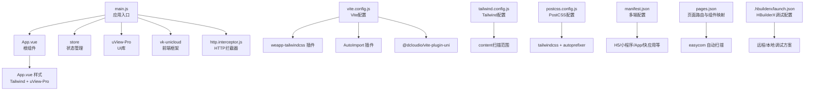
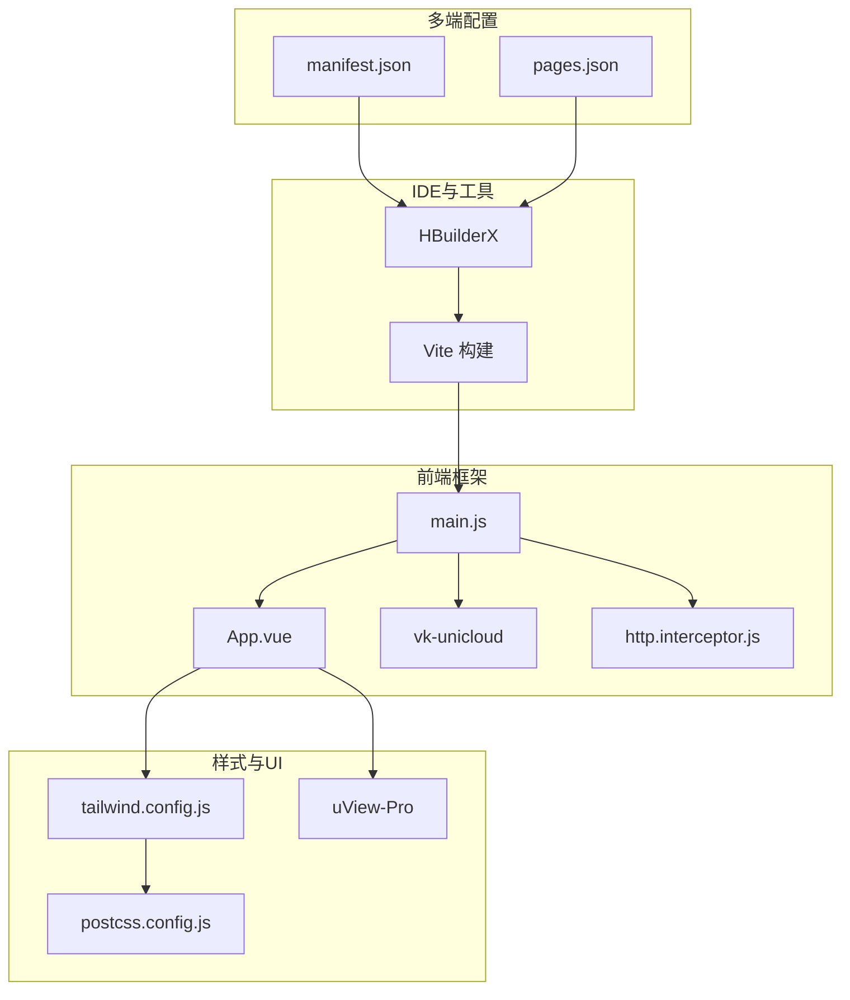
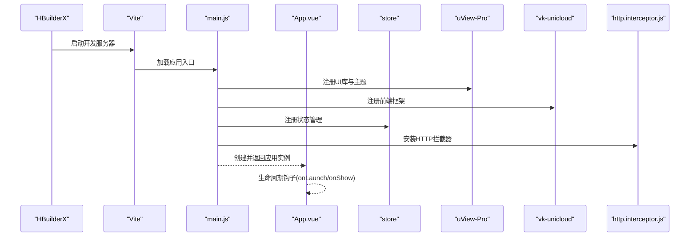
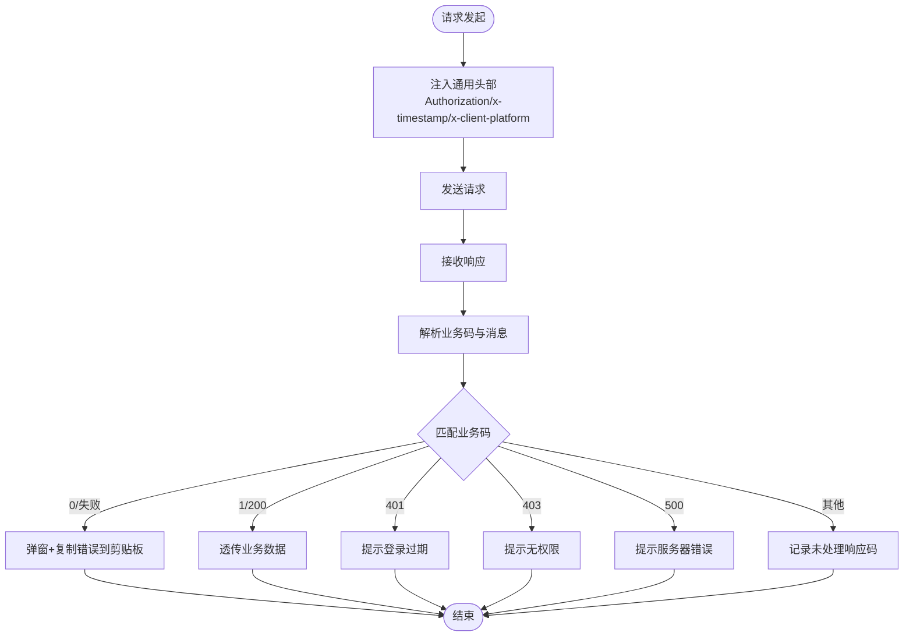

# 开发环境

<cite>
**本文引用的文件**
- [package.json](file://package.json)
- [manifest.json](file://manifest.json)
- [vite.config.js](file://vite.config.js)
- [postcss.config.js](file://postcss.config.js)
- [tailwind.config.js](file://tailwind.config.js)
- [pages.json](file://pages.json)
- [app.config.js](file://app.config.js)
- [.hbuilderx/launch.json](file://.hbuilderx/launch.json)
- [main.js](file://main.js)
- [App.vue](file://App.vue)
- [tsconfig.json](file://tsconfig.json)
- [.prettierrc](file://.prettierrc)
- [.gitignore](file://.gitignore)
- [common/css/core.scss](file://common/css/core.scss)
- [uni_modules/uview-pro/theme.scss](file://uni_modules/uview-pro/theme.scss)
- [uni_modules/vk-unicloud/index.js](file://uni_modules/vk-unicloud/index.js)
- [apis/http.interceptor.js](file://apis/http.interceptor.js)
</cite>

## 目录
1. [简介](#简介)
2. [项目结构](#项目结构)
3. [核心组件](#核心组件)
4. [架构总览](#架构总览)
5. [详细组件分析](#详细组件分析)
6. [依赖分析](#依赖分析)
7. [性能考虑](#性能考虑)
8. [故障排查指南](#故障排查指南)
9. [结论](#结论)
10. [附录](#附录)

## 简介
本指南面向初学者，帮助你在 Windows 环境下快速搭建“挪车助手”项目的开发环境。内容覆盖系统要求、工具安装、项目克隆与依赖安装、环境验证、HBuilderX 调试与多端预览、构建工具（Vite、PostCSS、Tailwind CSS）配置、以及开发工作流建议（代码规范、Git 提交规范、调试技巧）。所有步骤均基于仓库中的实际配置文件进行说明，确保可复现。

## 项目结构
该项目采用 uni-app 3.x 多端统一开发框架，前端使用 Vue 3 + Vite 构建，样式体系结合 uView-Pro 与 Tailwind CSS，并通过 weapp-tailwindcss 实现小程序端适配。云开发使用 uniCloud（阿里云），并集成 vk-unicloud 前端框架与统一拦截器。

图表来源
- [main.js:1-49](file://main.js#L1-L49)
- [App.vue:1-48](file://App.vue#L1-L48)
- [vite.config.js:1-58](file://vite.config.js#L1-L58)
- [tailwind.config.js:1-42](file://tailwind.config.js#L1-L42)
- [postcss.config.js:1-28](file://postcss.config.js#L1-L28)
- [manifest.json:1-271](file://manifest.json#L1-L271)
- [pages.json:1-87](file://pages.json#L1-L87)
- [.hbuilderx/launch.json:1-37](file://.hbuilderx/launch.json#L1-L37)

章节来源
- [package.json:1-124](file://package.json#L1-L124)
- [manifest.json:1-271](file://manifest.json#L1-L271)
- [vite.config.js:1-58](file://vite.config.js#L1-L58)
- [tailwind.config.js:1-42](file://tailwind.config.js#L1-L42)
- [postcss.config.js:1-28](file://postcss.config.js#L1-L28)
- [pages.json:1-87](file://pages.json#L1-L87)
- [.hbuilderx/launch.json:1-37](file://.hbuilderx/launch.json#L1-L37)

## 核心组件
- 应用入口与初始化
  - 应用入口负责注册 UI 库、前端框架、状态管理、API 管理与 HTTP 拦截器。
  - 关键文件参考：[main.js:1-49](file://main.js#L1-L49)
- 根组件与样式
  - 根组件负责生命周期钩子与 404 页面重定向；样式引入 Tailwind 与 uView-Pro。
  - 关键文件参考：[App.vue:1-48](file://App.vue#L1-L48)
- 构建与样式工具链
  - Vite 插件链包含 weapp-tailwindcss、AutoImport、@dcloudio/vite-plugin-uni、@uni-ku/root。
  - PostCSS 使用 tailwindcss 与 autoprefixer；Tailwind content 扫描范围明确。
  - 关键文件参考：[vite.config.js:1-58](file://vite.config.js#L1-L58)、[postcss.config.js:1-28](file://postcss.config.js#L1-L28)、[tailwind.config.js:1-42](file://tailwind.config.js#L1-L42)
- 多端配置与页面路由
  - manifest.json 定义 H5、小程序、App 等平台能力与权限；pages.json 定义页面与 easycom 组件映射。
  - 关键文件参考：[manifest.json:1-271](file://manifest.json#L1-L271)、[pages.json:1-87](file://pages.json#L1-L87)
- HBuilderX 调试配置
  - launch.json 提供远程/本地调试方案与设备/本地 playground 选择。
  - 关键文件参考：[launch.json:1-37](file://.hbuilderx/launch.json#L1-L37)
- 前端框架与拦截器
  - vk-unicloud 前端模块；统一 HTTP 拦截器处理鉴权、错误提示与业务码分发。
  - 关键文件参考：[uni_modules/vk-unicloud/index.js:1-4](file://uni_modules/vk-unicloud/index.js#L1-L4)、[apis/http.interceptor.js:1-116](file://apis/http.interceptor.js#L1-L116)

章节来源
- [main.js:1-49](file://main.js#L1-L49)
- [App.vue:1-48](file://App.vue#L1-L48)
- [vite.config.js:1-58](file://vite.config.js#L1-L58)
- [postcss.config.js:1-28](file://postcss.config.js#L1-L28)
- [tailwind.config.js:1-42](file://tailwind.config.js#L1-L42)
- [manifest.json:1-271](file://manifest.json#L1-L271)
- [pages.json:1-87](file://pages.json#L1-L87)
- [.hbuilderx/launch.json:1-37](file://.hbuilderx/launch.json#L1-L37)
- [uni_modules/vk-unicloud/index.js:1-4](file://uni_modules/vk-unicloud/index.js#L1-L4)
- [apis/http.interceptor.js:1-116](file://apis/http.interceptor.js#L1-L116)

## 架构总览
下图展示从开发到多端运行的关键路径：HBuilderX 作为 IDE，Vite 作为构建工具，Tailwind CSS 与 uView-Pro 提供样式能力，vk-unicloud 与拦截器提供前端框架与网络层统一处理，manifest.json 与 pages.json 决定多端行为与页面结构。

图表来源
- [main.js:1-49](file://main.js#L1-L49)
- [App.vue:1-48](file://App.vue#L1-L48)
- [vite.config.js:1-58](file://vite.config.js#L1-L58)
- [tailwind.config.js:1-42](file://tailwind.config.js#L1-L42)
- [postcss.config.js:1-28](file://postcss.config.js#L1-L28)
- [manifest.json:1-271](file://manifest.json#L1-L271)
- [pages.json:1-87](file://pages.json#L1-L87)

## 详细组件分析

### HBuilderX 调试与多端预览
- 调试类型
  - 支持远程与本地两种启动方式，适用于不同场景（云端联调、本地真机/模拟器）。
  - 参考配置：[launch.json:1-37](file://.hbuilderx/launch.json#L1-L37)
- 平台选择
  - 可针对 app-plus、h5、mp-weixin 等平台设置默认启动类型。
  - 参考配置：[launch.json:14-22](file://.hbuilderx/launch.json#L14-L22)
- 设备/本地 Playground
  - 提供自定义 Playground 类型与本地/设备模式，便于真机调试。
  - 参考配置：[launch.json:24-34](file://.hbuilderx/launch.json#L24-L34)
- 开发者工具
  - 可开启 Vue DevTools，提升调试效率。
  - 参考配置：[launch.json:25-33](file://.hbuilderx/launch.json#L25-L33)

章节来源
- [.hbuilderx/launch.json:1-37](file://.hbuilderx/launch.json#L1-L37)

### Vite 构建与插件链
- 插件链
  - weapp-tailwindcss：实现小程序端 Tailwind CSS 与 rpx 的转换。
  - AutoImport：自动导入 Vue 与 uni-app API，减少样板代码。
  - @dcloudio/vite-plugin-uni：uni-app 多端编译支持。
  - @uni-ku/root：根路径别名支持。
  - 参考配置：[vite.config.js:21-45](file://vite.config.js#L21-L45)
- 条件禁用
  - H5 与 App 平台下禁用 weapp-tailwindcss，避免不必要处理。
  - 参考配置：[vite.config.js:11-14](file://vite.config.js#L11-L14)
- PostCSS 配置
  - 显式加载 tailwindcss 与 autoprefixer，并指定 tailwind.config.js 的绝对路径。
  - 参考配置：[vite.config.js:46-56](file://vite.config.js#L46-L56)

章节来源
- [vite.config.js:1-58](file://vite.config.js#L1-L58)

### Tailwind CSS 与 PostCSS
- Tailwind 配置
  - darkMode 使用类名切换；content 扫描 pages 与 components 目录及 uView-Pro 组件目录。
  - 参考配置：[tailwind.config.js:7-16](file://tailwind.config.js#L7-L16)
- PostCSS 配置
  - 当前仓库注释掉旧版 px 转 rpx 方案，推荐使用 weapp-tailwindcss 插件。
  - 参考配置：[postcss.config.js:1-28](file://postcss.config.js#L1-L28)
- 样式入口
  - App.vue 中引入 Tailwind base、components、utilities 与自定义样式。
  - 参考样式：[App.vue:40-47](file://App.vue#L40-L47)

章节来源
- [tailwind.config.js:1-42](file://tailwind.config.js#L1-L42)
- [postcss.config.js:1-28](file://postcss.config.js#L1-L28)
- [App.vue:40-47](file://App.vue#L40-L47)

### 多端配置与页面路由
- 多端能力
  - manifest.json 定义 app-plus、h5、mp-weixin、mp-alipay 等平台的能力与权限。
  - 参考配置：[manifest.json:8-191](file://manifest.json#L8-L191)
- 页面与组件映射
  - pages.json 定义页面列表与全局导航栏、tabBar；easycom 自动扫描组件并映射至 @/components 与 uView-Pro。
  - 参考配置：[pages.json:1-87](file://pages.json#L1-L87)

章节来源
- [manifest.json:1-271](file://manifest.json#L1-L271)
- [pages.json:1-87](file://pages.json#L1-L87)

### 应用入口与初始化流程

图表来源
- [main.js:1-49](file://main.js#L1-L49)
- [App.vue:1-48](file://App.vue#L1-L48)
- [uni_modules/vk-unicloud/index.js:1-4](file://uni_modules/vk-unicloud/index.js#L1-L4)
- [apis/http.interceptor.js:1-116](file://apis/http.interceptor.js#L1-L116)

章节来源
- [main.js:1-49](file://main.js#L1-L49)
- [App.vue:1-48](file://App.vue#L1-L48)

### HTTP 拦截器处理流程

图表来源
- [apis/http.interceptor.js:37-116](file://apis/http.interceptor.js#L37-L116)

章节来源
- [apis/http.interceptor.js:1-116](file://apis/http.interceptor.js#L1-L116)

## 依赖分析
- 必需工具与版本约束
  - HBuilderX 版本：参见 engines 字段。
  - uni-app 版本：参见 engines 字段。
  - 参考配置：[package.json:26-30](file://package.json#L26-L30)
- 构建与样式依赖
  - devDependencies 包含 tailwindcss、autoprefixer、weapp-tailwindcss 等。
  - 参考配置：[package.json:8-17](file://package.json#L8-L17)
- 运行时依赖
  - crypto-js、js-md5、@iconify/vue 等。
  - 参考配置：[package.json:116-122](file://package.json#L116-L122)
- 多端平台支持
  - uni_modules 中声明了对 uni-app、uni-app-x、多端平台的支持范围。
  - 参考配置：[package.json:54-110](file://package.json#L54-L110)

章节来源
- [package.json:1-124](file://package.json#L1-L124)

## 性能考虑
- Tailwind 内容扫描范围
  - 仅扫描 pages 与 components 目录及 uView-Pro 组件，避免全量扫描导致的性能问题。
  - 参考配置：[tailwind.config.js:11-16](file://tailwind.config.js#L11-L16)
- weapp-tailwindcss 条件启用
  - H5 与 App 平台禁用该插件，减少不必要的处理。
  - 参考配置：[vite.config.js:11-14](file://vite.config.js#L11-L14)
- PostCSS 插件精简
  - 仅启用 tailwindcss 与 autoprefixer，保持构建链路简洁。
  - 参考配置：[vite.config.js:46-56](file://vite.config.js#L46-L56)

章节来源
- [tailwind.config.js:1-42](file://tailwind.config.js#L1-L42)
- [vite.config.js:1-58](file://vite.config.js#L1-L58)

## 故障排查指南
- 症状：小程序端样式异常或 Tailwind 类无效
  - 排查：确认 weapp-tailwindcss 插件未在 H5/App 平台启用；检查 tailwind.config.js 的 content 路径是否包含目标组件。
  - 参考配置：[vite.config.js:11-14](file://vite.config.js#L11-L14)、[tailwind.config.js:11-16](file://tailwind.config.js#L11-L16)
- 症状：H5 端样式错乱
  - 排查：确认 H5 平台下未启用 weapp-tailwindcss；检查 postcss.config.js 是否仍保留旧版 px 转 rpx 配置。
  - 参考配置：[vite.config.js:11-14](file://vite.config.js#L11-L14)、[postcss.config.js:1-28](file://postcss.config.js#L1-L28)
- 症状：页面 404 未正确跳转
  - 排查：确认 App.vue 的 onPageNotFound 与 app.config.js 的 error.url 配置一致。
  - 参考配置：[App.vue:5-10](file://App.vue#L5-L10)、[app.config.js:17-20](file://app.config.js#L17-L20)
- 症状：登录态失效或频繁弹窗
  - 排查：检查 http.interceptor.js 对 401 的处理逻辑与弹窗防抖标记。
  - 参考配置：[apis/http.interceptor.js:70-91](file://apis/http.interceptor.js#L70-L91)

章节来源
- [vite.config.js:1-58](file://vite.config.js#L1-L58)
- [tailwind.config.js:1-42](file://tailwind.config.js#L1-L42)
- [postcss.config.js:1-28](file://postcss.config.js#L1-L28)
- [App.vue:1-48](file://App.vue#L1-L48)
- [app.config.js:1-111](file://app.config.js#L1-L111)
- [apis/http.interceptor.js:1-116](file://apis/http.interceptor.js#L1-L116)

## 结论
通过以上配置与流程，你可以基于 HBuilderX 与 Vite 在 Windows 上完成“挪车助手”项目的开发环境搭建。建议优先使用 weapp-tailwindcss 插件与 Tailwind 的 content 扫描策略，配合 vk-unicloud 与统一拦截器，快速实现多端一致的 UI 与网络层体验。遇到问题时，可依据本文的故障排查清单逐项定位。

## 附录

### 系统要求与安装步骤
- 系统要求
  - Windows 10/11（建议）
  - Node.js：建议使用 LTS 版本（具体版本以项目 engines 为准）
  - HBuilderX：版本需满足 engines 中的 HBuilderX 字段
  - uni-app CLI：版本需满足 engines 中的 uni-app 字段
  - 参考配置：[package.json:26-30](file://package.json#L26-L30)
- 安装步骤
  1) 安装 Node.js（LTS）
  2) 安装 HBuilderX（版本满足 engines）
  3) 在 HBuilderX 中打开项目根目录
  4) 通过包管理器安装依赖（推荐 pnpm）
  5) 依赖安装完成后，执行 weapp-tailwindcss patch（由 package.json 的 postinstall 脚本触发）
  6) 在 HBuilderX 中选择目标平台（H5/App/小程序）并启动调试
  - 参考配置：[package.json:18-21](file://package.json#L18-L21)

章节来源
- [package.json:1-124](file://package.json#L1-L124)

### 环境验证
- 验证点
  - H5 预览：确认浏览器打开正常，样式与交互可用
  - 小程序预览：在微信开发者工具或 HBuilderX 小程序模拟器中打开
  - App 预览：在 HBuilderX 中选择 App 平台进行真机/模拟器调试
  - 参考配置：[manifest.json:235-251](file://manifest.json#L235-L251)、[pages.json:1-87](file://pages.json#L1-L87)

章节来源
- [manifest.json:1-271](file://manifest.json#L1-L271)
- [pages.json:1-87](file://pages.json#L1-L87)

### 开发工作流建议
- 代码规范
  - 使用 Prettier 规范格式化，遵循 .prettierrc 的配置
  - 参考配置：[.prettierrc:1-15](file://.prettierrc#L1-L15)
- Git 提交规范
  - 建议采用约定式提交（如 feat/fix/docs/chore 等），并配合 husky/pre-commit（如需）
  - .gitignore 已忽略 node_modules、dist、unpackage 等目录
  - 参考配置：[.gitignore:1-30](file://.gitignore#L1-L30)
- 调试技巧
  - 使用 HBuilderX 的远程/本地调试模式，结合 Vue DevTools
  - 在 App.vue 中打印日志，区分生产与开发环境
  - 参考配置：[App.vue:14-23](file://App.vue#L14-L23)、[launch.json:25-33](file://.hbuilderx/launch.json#L25-L33)

章节来源
- [.prettierrc:1-15](file://.prettierrc#L1-L15)
- [.gitignore:1-30](file://.gitignore#L1-L30)
- [App.vue:1-48](file://App.vue#L1-L48)
- [.hbuilderx/launch.json:1-37](file://.hbuilderx/launch.json#L1-L37)