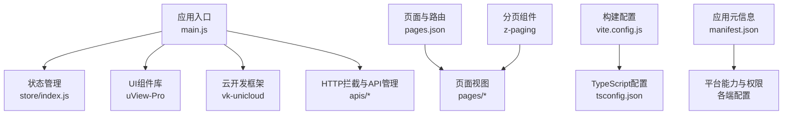
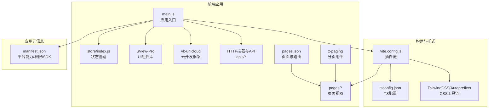
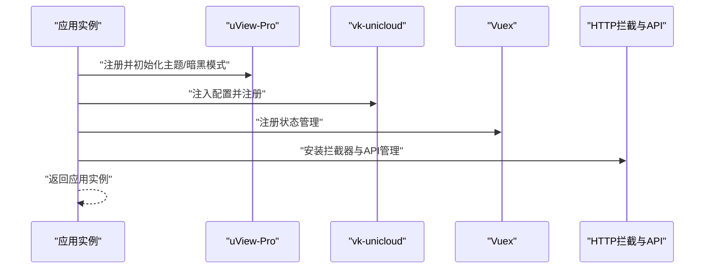
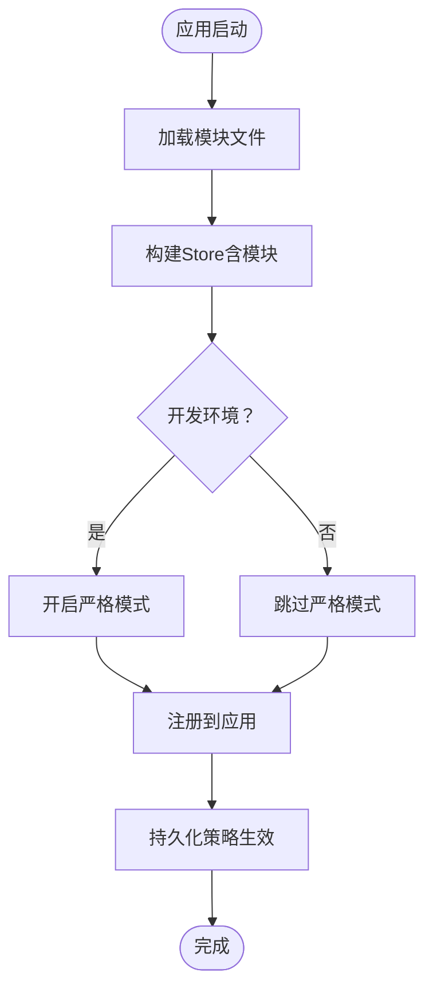
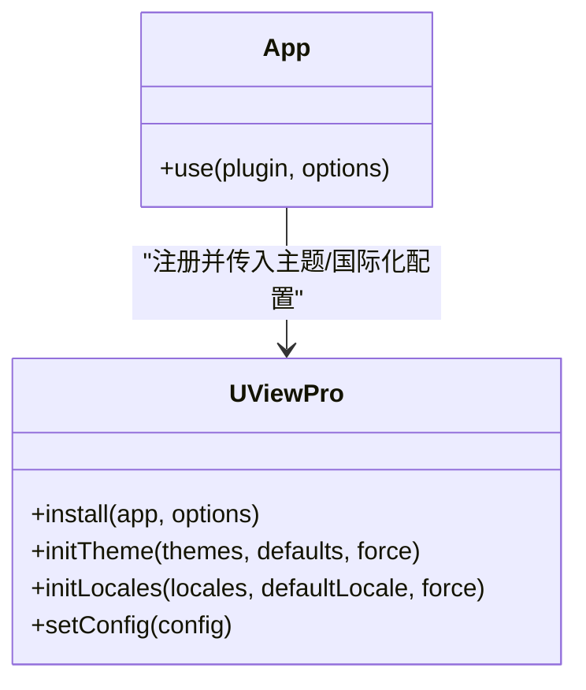
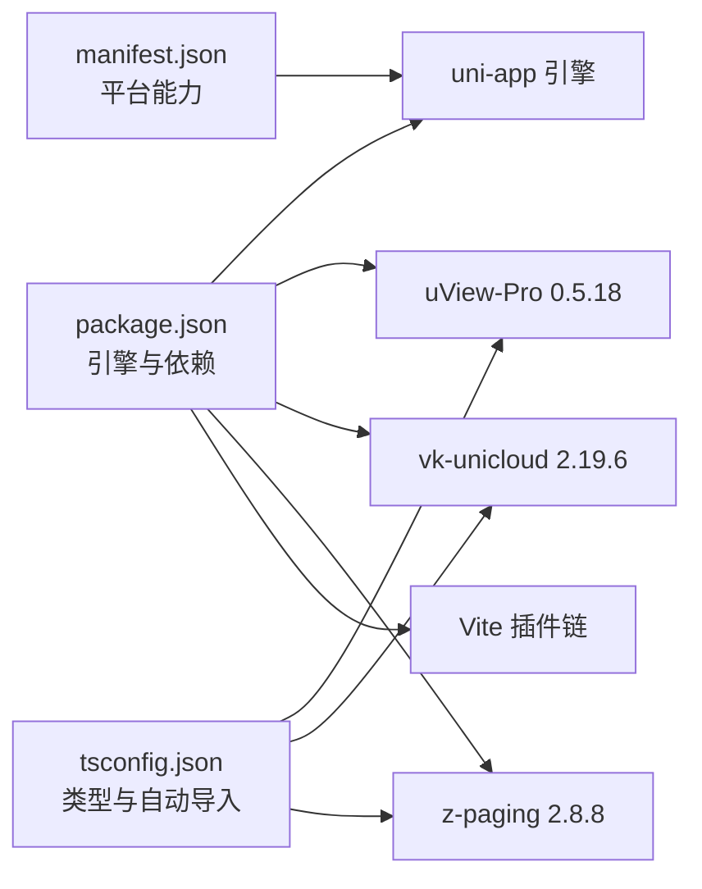

# 技术栈

<cite>
**本文引用的文件**
- [package.json](file://package.json)
- [manifest.json](file://manifest.json)
- [vite.config.js](file://vite.config.js)
- [tsconfig.json](file://tsconfig.json)
- [main.js](file://main.js)
- [store/index.js](file://store/index.js)
- [pages.json](file://pages.json)
- [uni_modules/uview-pro/package.json](file://uni_modules/uview-pro/package.json)
- [uni_modules/uview-pro/index.ts](file://uni_modules/uview-pro/index.ts)
- [uni_modules/uview-pro/readme.md](file://uni_modules/uview-pro/readme.md)
- [uni_modules/vk-unicloud/package.json](file://uni_modules/vk-unicloud/package.json)
- [uni_modules/vk-unicloud/index.js](file://uni_modules/vk-unicloud/index.js)
- [uni_modules/z-paging/package.json](file://uni_modules/z-paging/package.json)
- [uni_modules/z-paging/readme.md](file://uni_modules/z-paging/readme.md)
</cite>

## 目录
1. [简介](#简介)
2. [项目结构](#项目结构)
3. [核心组件](#核心组件)
4. [架构总览](#架构总览)
5. [详细组件分析](#详细组件分析)
6. [依赖分析](#依赖分析)
7. [性能考虑](#性能考虑)
8. [故障排查指南](#故障排查指南)
9. [结论](#结论)
10. [附录](#附录)

## 简介
本技术栈文档围绕“挪车助手”项目，系统梳理并解释项目采用的核心技术与框架，包括：
- uni-app 3.1.0+ 跨平台开发框架
- Vue 3 + TypeScript
- uView-Pro UI 组件库
- vk-unicloud 云开发框架
- z-paging 分页组件
- 构建工具与开发环境（Vite、HBuilderX、TailwindCSS）

文档同时给出各技术选型的原因与优势、技术栈间的协作关系、依赖版本信息、构建工具配置要点、学习路径建议与不同水平开发者所需掌握的知识点。

## 项目结构
项目采用 uni-app 标准目录组织，结合 HBuilderX 与 Vite 插件链路，形成“前端应用 + 云开发”的一体化工程。关键结构与职责如下：
- 应用入口与状态管理：main.js、store/
- 页面与路由：pages/、pages.json
- UI 组件库：uni_modules/uview-pro/
- 云开发框架：uni_modules/vk-unicloud/
- 分页组件：uni_modules/z-paging/
- 构建与样式：vite.config.js、tsconfig.json、uni.scss、tailwind.config.js
- 应用元信息与平台能力：manifest.json
- 依赖与引擎约束：package.json

图表来源
- [main.js:1-49](file://main.js#L1-L49)
- [store/index.js:1-136](file://store/index.js#L1-L136)
- [pages.json:1-87](file://pages.json#L1-L87)
- [vite.config.js:1-58](file://vite.config.js#L1-L58)
- [tsconfig.json:1-38](file://tsconfig.json#L1-L38)
- [manifest.json:1-271](file://manifest.json#L1-L271)

章节来源
- [main.js:1-49](file://main.js#L1-L49)
- [store/index.js:1-136](file://store/index.js#L1-L136)
- [pages.json:1-87](file://pages.json#L1-L87)
- [vite.config.js:1-58](file://vite.config.js#L1-L58)
- [tsconfig.json:1-38](file://tsconfig.json#L1-L38)
- [manifest.json:1-271](file://manifest.json#L1-L271)

## 核心组件
本节从技术选型、版本与特性、与项目协作关系三个维度，系统阐述核心组件。

- uni-app 3.1.0+
  - 作用：跨平台开发框架，统一 Vue 3 应用在 H5、App、小程序等多端的运行时与构建体系。
  - 版本与引擎约束：package.json 中声明 HBuilderX 与 uni-app 引擎版本范围，确保构建与运行兼容性。
  - 与项目协作：pages.json 定义页面与 tabbar；manifest.json 提供平台能力与权限；main.js 作为应用入口注册插件与状态。
  
  章节来源
  - [package.json:26-30](file://package.json#L26-L30)
  - [manifest.json:252](file://manifest.json#L252)
  - [pages.json:1-87](file://pages.json#L1-L87)
  - [main.js:22-48](file://main.js#L22-L48)

- Vue 3 + TypeScript
  - 作用：提供响应式与组合式 API，配合 TS 提升类型安全与开发体验。
  - 配置要点：tsconfig.json 启用严格模式、ESNext 模块解析、类型声明包含 uview-pro/types 等。
  - 与项目协作：Vite 插件 AutoImport 自动注入 Vue 与 uni-app API；pages.json 的 easycom 与组件命名约定降低引入成本。
  
  章节来源
  - [tsconfig.json:1-38](file://tsconfig.json#L1-L38)
  - [vite.config.js:34-42](file://vite.config.js#L34-L42)
  - [pages.json:2-8](file://pages.json#L2-L8)

- uView-Pro UI 组件库
  - 作用：提供 80+ 组件、多主题、暗黑模式、国际化，覆盖多端（H5/App/Harmony/小程序）。
  - 版本与特性：版本 0.5.18，支持 Vue3 + TS，提供主题初始化、国际化、调试模式等能力。
  - 与项目协作：main.js 中按需注册并配置主题与暗黑模式；pages.json 通过 easycom 自动引入组件。
  
  章节来源
  - [uni_modules/uview-pro/package.json:1-109](file://uni_modules/uview-pro/package.json#L1-L109)
  - [uni_modules/uview-pro/index.ts:15-96](file://uni_modules/uview-pro/index.ts#L15-L96)
  - [uni_modules/uview-pro/readme.md:104-221](file://uni_modules/uview-pro/readme.md#L104-L221)
  - [main.js:27-33](file://main.js#L27-L33)
  - [pages.json:2-8](file://pages.json#L2-L8)

- vk-unicloud 云开发框架
  - 作用：提供云函数路由、数据库 API、uni-id 集成、统一 API 管理，加速前后端一体化开发。
  - 版本与特性：版本 2.19.6，支持多云厂商（阿里云/腾讯云/支付宝），提供路由与中间件体系。
  - 与项目协作：main.js 引入 vk-unicloud 并注入配置；项目内存在大量云函数与数据库 schema，体现其在后端侧的深度使用。
  
  章节来源
  - [uni_modules/vk-unicloud/package.json:1-90](file://uni_modules/vk-unicloud/package.json#L1-L90)
  - [uni_modules/vk-unicloud/index.js:1-4](file://uni_modules/vk-unicloud/index.js#L1-L4)
  - [main.js:14-36](file://main.js#L14-L36)

- z-paging 分页组件
  - 作用：高性能分页，支持下拉刷新、上拉加载、虚拟列表、全平台兼容，简化复杂列表交互。
  - 版本与特性：版本 2.8.8，强调“低耦合、低侵入、全平台兼容、高性能”。
  - 与项目协作：项目中存在 yy-paging.vue 等封装组件，体现对 z-paging 的复用与定制。
  
  章节来源
  - [uni_modules/z-paging/package.json:1-87](file://uni_modules/z-paging/package.json#L1-L87)
  - [uni_modules/z-paging/readme.md:17-24](file://uni_modules/z-paging/readme.md#L17-L24)
  - [components/yy-paging.vue](file://components/yy-paging.vue)

- 构建工具与开发环境
  - Vite 插件链：@dcloudio/vite-plugin-uni、AutoImport、weapp-tailwindcss、code-inspector-plugin、@uni-ku/root。
  - CSS 工具链：TailwindCSS + Autoprefixer，按平台条件启用 weapp-tailwindcss。
  - 类型与自动导入：AutoImport 注入 Vue 与 uni-app API，tsconfig.json 声明类型。
  
  章节来源
  - [vite.config.js:1-58](file://vite.config.js#L1-L58)
  - [tsconfig.json:1-38](file://tsconfig.json#L1-L38)
  - [package.json:8-124](file://package.json#L8-L124)

## 架构总览
整体架构由“前端应用 + 云开发 + 分页组件 + 构建工具”构成，形成“多端一致、前后端协同”的开发范式。

图表来源
- [main.js:1-49](file://main.js#L1-L49)
- [store/index.js:1-136](file://store/index.js#L1-L136)
- [pages.json:1-87](file://pages.json#L1-L87)
- [vite.config.js:1-58](file://vite.config.js#L1-L58)
- [tsconfig.json:1-38](file://tsconfig.json#L1-L38)
- [manifest.json:1-271](file://manifest.json#L1-L271)

## 详细组件分析

### 组件 A：应用入口与插件注册（main.js）
- 职责：创建应用实例、注册 uView-Pro、vk-unicloud、Vuex、HTTP 拦截器与 API 管理。
- 关键点：通过 app.use 注入插件；配置 uView-Pro 主题与暗黑模式；注入全局分页默认参数。
- 与 store、pages.json 的协作：store 在入口处注册；pages.json 控制页面与组件自动引入。

图表来源
- [main.js:22-48](file://main.js#L22-L48)

章节来源
- [main.js:1-49](file://main.js#L1-L49)

### 组件 B：状态管理（store/index.js）
- 职责：模块化管理、持久化策略、严格模式（开发环境）、通用 mutations。
- 关键点：根据 Vue 2/3 条件加载模块；通过 saveLifeData 将状态持久化至本地存储；提供 updateStore 通用更新接口。
- 与入口协作：main.js 在创建应用时注册 store。

图表来源
- [store/index.js:17-133](file://store/index.js#L17-L133)

章节来源
- [store/index.js:1-136](file://store/index.js#L1-L136)

### 组件 C：页面与路由（pages.json）
- 职责：定义页面路径、样式、tabBar、全局样式占位符；通过 easycom 自动引入组件。
- 关键点：yy- 与 u- 前缀映射至自定义组件与 uView-Pro 组件；占位符变量与主题配置联动。
- 与 UI 协作：uView-Pro 通过 easycom 自动注册，减少手动引入。

章节来源
- [pages.json:1-87](file://pages.json#L1-L87)

### 组件 D：uView-Pro（安装与主题）
- 职责：提供主题初始化、国际化、调试模式配置，并将 $u 挂载至全局。
- 关键点：支持多主题数组、对象合并覆盖默认主题；支持 locale 列表与默认语言；设置调试模式。
- 与入口协作：main.js 在应用创建阶段调用 install 并传入主题配置。

图表来源
- [uni_modules/uview-pro/index.ts:15-96](file://uni_modules/uview-pro/index.ts#L15-L96)
- [main.js:27-33](file://main.js#L27-L33)

章节来源
- [uni_modules/uview-pro/index.ts:1-101](file://uni_modules/uview-pro/index.ts#L1-L101)
- [uni_modules/uview-pro/readme.md:104-221](file://uni_modules/uview-pro/readme.md#L104-L221)

### 组件 E：vk-unicloud（云开发框架）
- 职责：提供云函数路由、数据库 API、中间件、统一 API 管理。
- 关键点：入口导出 vk-unicloud-page 模块；与 uni_modules 依赖 uni-config-center。
- 与入口协作：main.js 引入并注册 vk-unicloud，注入应用配置。

章节来源
- [uni_modules/vk-unicloud/package.json:1-90](file://uni_modules/vk-unicloud/package.json#L1-L90)
- [uni_modules/vk-unicloud/index.js:1-4](file://uni_modules/vk-unicloud/index.js#L1-L4)
- [main.js:14-36](file://main.js#L14-L36)

### 组件 F：z-paging（分页组件）
- 职责：高性能分页，支持下拉刷新、上拉加载、虚拟列表、多端兼容。
- 关键点：强调“低耦合、低侵入、全平台兼容、高性能”；支持本地分页、聊天模式、吸顶等。
- 与项目协作：项目中存在 yy-paging.vue 等封装，体现对 z-paging 的复用与定制。

章节来源
- [uni_modules/z-paging/package.json:1-87](file://uni_modules/z-paging/package.json#L1-L87)
- [uni_modules/z-paging/readme.md:17-24](file://uni_modules/z-paging/readme.md#L17-L24)
- [components/yy-paging.vue](file://components/yy-paging.vue)

## 依赖分析
- 引擎与平台约束：package.json 声明 HBuilderX 与 uni-app 引擎版本范围，确保多端构建一致性。
- 依赖版本：uView-Pro 0.5.18、vk-unicloud 2.19.6、z-paging 2.8.8；构建工具链包含 @dcloudio/vite-plugin-uni、AutoImport、weapp-tailwindcss、code-inspector-plugin 等。
- 类型与自动导入：tsconfig.json 声明 @dcloudio/types、@types/html5plus、@types/uni-app、uview-pro/types；Vite AutoImport 自动注入 Vue 与 uni-app API。
- 平台能力：manifest.json 配置 App、H5、小程序等平台的权限、SDK、图标、启动页等。

图表来源
- [package.json:26-30](file://package.json#L26-L30)
- [package.json:116-124](file://package.json#L116-L124)
- [tsconfig.json:29](file://tsconfig.json#L29)
- [manifest.json:1-271](file://manifest.json#L1-L271)

章节来源
- [package.json:1-124](file://package.json#L1-L124)
- [tsconfig.json:1-38](file://tsconfig.json#L1-L38)
- [manifest.json:1-271](file://manifest.json#L1-L271)

## 性能考虑
- 分页性能：z-paging 强调高性能与虚拟列表，适合长列表场景；建议结合懒加载与本地分页策略优化首屏与滚动性能。
- 构建性能：Vite 插件链按平台禁用 weapp-tailwindcss（H5/App 不启用），减少不必要的转换开销。
- 类型检查：tsconfig.json 启用严格模式与 noEmit，有助于在开发期发现潜在问题，减少运行时错误。
- 云开发：vk-unicloud 提供统一 API 与中间件，建议合理拆分云函数与数据库操作，避免单点瓶颈。

## 故障排查指南
- 组件未自动引入
  - 检查 pages.json 的 easycom 规则与组件命名前缀是否匹配。
  - 章节来源
    - [pages.json:2-8](file://pages.json#L2-L8)

- uView-Pro 主题/暗黑模式异常
  - 确认 main.js 中传入的主题配置与默认主题/暗黑模式设置正确。
  - 章节来源
    - [main.js:27-33](file://main.js#L27-L33)
    - [uni_modules/uview-pro/index.ts:15-96](file://uni_modules/uview-pro/index.ts#L15-L96)

- 分页数据为空或加载异常
  - 检查 z-paging 使用方式与数据源绑定；确认网络请求方法与分页结果数组绑定正确。
  - 章节来源
    - [uni_modules/z-paging/readme.md:18-21](file://uni_modules/z-paging/readme.md#L18-L21)
    - [components/yy-paging.vue](file://components/yy-paging.vue)

- 构建报错或样式失效
  - 确认 vite.config.js 中 TailwindCSS 配置与平台条件（H5/App 禁用 weapp-tailwindcss）一致。
  - 章节来源
    - [vite.config.js:11-33](file://vite.config.js#L11-L33)
    - [vite.config.js:46-56](file://vite.config.js#L46-L56)

- 类型提示缺失
  - 确认 tsconfig.json 的 types 声明包含 uview-pro/types，并在 Vite 插件中启用 AutoImport。
  - 章节来源
    - [tsconfig.json:29](file://tsconfig.json#L29)
    - [vite.config.js:34-42](file://vite.config.js#L34-L42)

## 结论
“挪车助手”项目以 uni-app 为核心，结合 Vue 3 + TypeScript、uView-Pro、vk-unicloud 与 z-paging，形成了“多端一致、前后端协同、高性能分页”的技术栈组合。通过合理的构建工具链与严格的类型配置，项目在开发效率与运行性能之间取得良好平衡。建议后续在云函数路由设计、分页策略与主题体系方面持续优化，以支撑业务迭代与多端体验的一致性。

## 附录
- 学习路径建议
  - 初学者（零基础）
    - uni-app 基础：页面、路由、生命周期、条件编译
    - uView-Pro 快速上手：组件使用、主题与暗黑模式
    - 分页组件：z-paging 基础用法与性能优化
    - 云开发：vk-unicloud 基础 API 与中间件
  - 进阶者（有 Vue/TS 基础）
    - Vue 3 组合式 API 与 TS 高级用法
    - Vite 插件链与 TailwindCSS 工程化
    - 多端差异化适配与性能优化
    - 云函数路由设计与数据库模型
  - 专家（追求极致性能与架构）
    - 虚拟列表与长列表优化
    - 多端构建与资源裁剪
    - 云开发中间件与安全策略
    - 多端权限与 SDK 集成最佳实践

- 开发环境要求
  - HBuilderX 与 uni-app 引擎版本满足 package.json 中的 engines 约束
  - Node.js 与包管理器（建议 pnpm）满足 uView-Pro 与项目依赖
  - 各端 SDK 与权限在 manifest.json 中按需配置