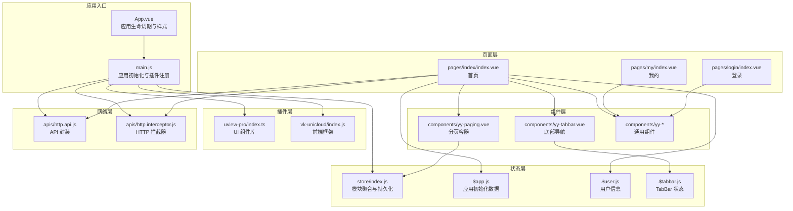
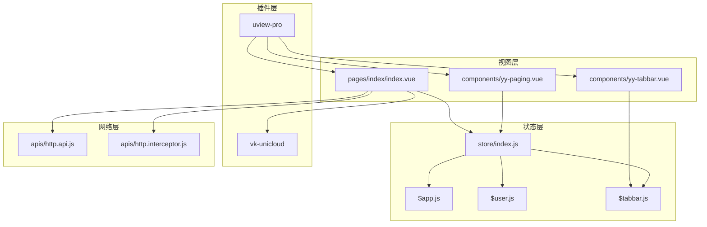
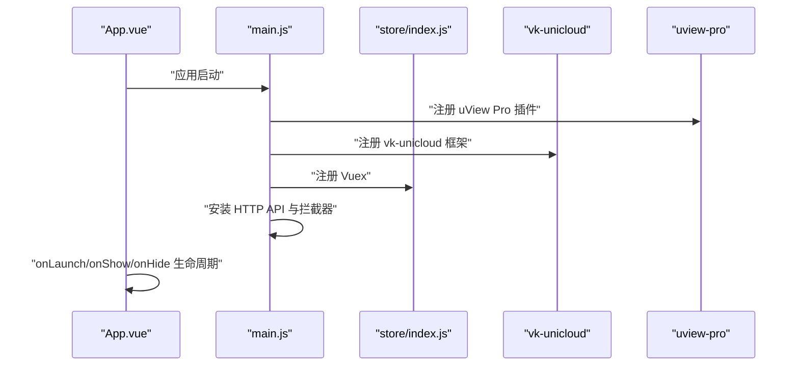
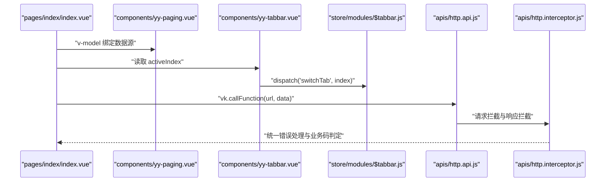
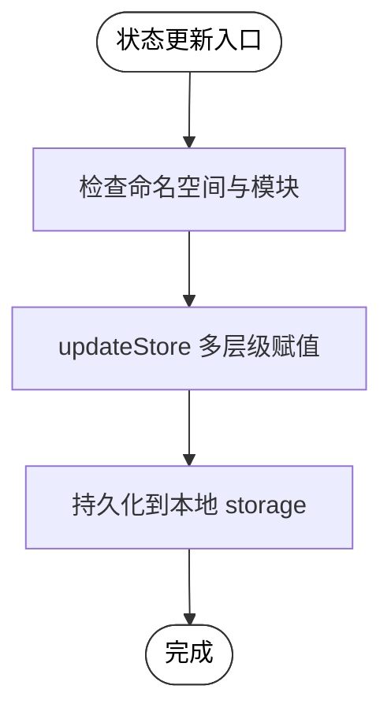
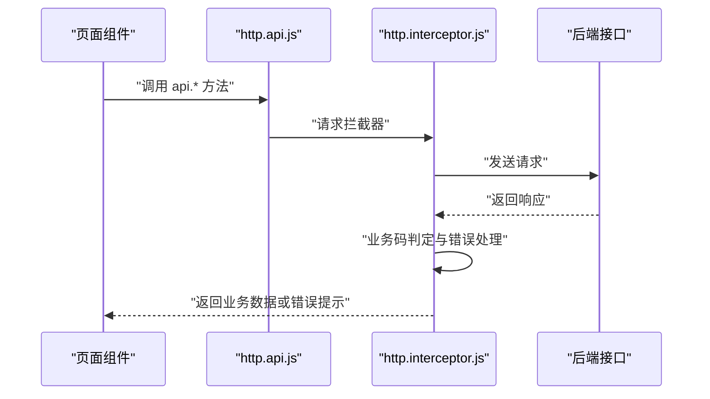
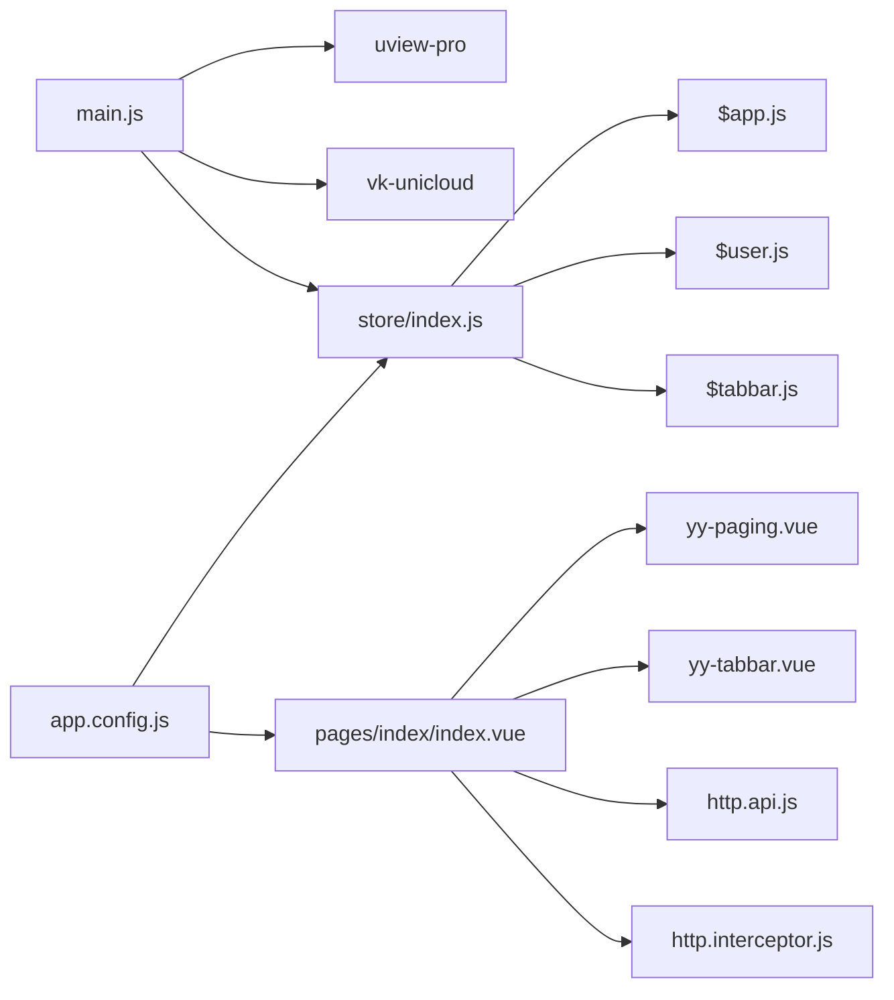

# 架构概览

<cite>
**本文引用的文件**   
- [App.vue](file://App.vue)
- [main.js](file://main.js)
- [store/index.js](file://store/index.js)
- [store/modules/$app.js](file://store/modules/$app.js)
- [store/modules/$user.js](file://store/modules/$user.js)
- [store/modules/$tabbar.js](file://store/modules/$tabbar.js)
- [pages.json](file://pages.json)
- [pages/index/index.vue](file://pages/index/index.vue)
- [components/yy-tabbar.vue](file://components/yy-tabbar.vue)
- [components/yy-paging.vue](file://components/yy-paging.vue)
- [apis/http.api.js](file://apis/http.api.js)
- [apis/http.interceptor.js](file://apis/http.interceptor.js)
- [app.config.js](file://app.config.js)
- [uni_modules/uview-pro/index.ts](file://uni_modules/uview-pro/index.ts)
- [uni_modules/vk-unicloud/index.js](file://uni_modules/vk-unicloud/index.js)
</cite>

## 目录
1. [简介](#简介)
2. [项目结构](#项目结构)
3. [核心组件](#核心组件)
4. [架构总览](#架构总览)
5. [详细组件分析](#详细组件分析)
6. [依赖分析](#依赖分析)
7. [性能考虑](#性能考虑)
8. [故障排查指南](#故障排查指南)
9. [结论](#结论)
10. [附录](#附录)

## 简介
本项目为“挪车助手”小程序应用，采用前端 MVVM 架构与模块化、插件化设计，结合统一的 HTTP 拦截与 API 管理、基于 uView Pro 的 UI 组件体系以及 vk-unicloud 的前端框架能力，构建出可维护、可扩展、跨平台的一体化解决方案。本文档旨在帮助开发者建立系统性的架构理解框架，涵盖从用户输入到数据存储的完整流程，并给出架构图表与组件关系图。

## 项目结构
项目采用“页面-组件-状态-插件-云服务”的分层组织方式：
- 页面层：pages/ 下按功能划分页面，如首页、我的、登录、测试等
- 组件层：components/ 下封装通用 UI 与业务组件，如分页、TabBar、加载、空数据等
- 状态层：store/ 下以模块化形式组织 Vuex 状态，如 $app、$user、$tabbar
- 插件层：uni_modules/ 下集成第三方与自研插件，如 uview-pro、vk-unicloud
- 云服务层：uniCloud-aliyun/ 下提供云函数、中间件、DAO 层与数据库 schema

**图表来源**
- [App.vue:1-48](file://App.vue#L1-L48)
- [main.js:1-49](file://main.js#L1-L49)
- [store/index.js:1-136](file://store/index.js#L1-L136)
- [store/modules/$app.js:1-36](file://store/modules/$app.js#L1-L36)
- [store/modules/$user.js:1-26](file://store/modules/$user.js#L1-L26)
- [store/modules/$tabbar.js:1-78](file://store/modules/$tabbar.js#L1-L78)
- [components/yy-paging.vue:1-339](file://components/yy-paging.vue#L1-L339)
- [components/yy-tabbar.vue:1-38](file://components/yy-tabbar.vue#L1-L38)
- [apis/http.api.js:1-32](file://apis/http.api.js#L1-L32)
- [apis/http.interceptor.js:1-116](file://apis/http.interceptor.js#L1-L116)
- [uni_modules/uview-pro/index.ts:1-101](file://uni_modules/uview-pro/index.ts#L1-L101)
- [uni_modules/vk-unicloud/index.js:1-4](file://uni_modules/vk-unicloud/index.js#L1-L4)

**章节来源**
- [pages.json:1-87](file://pages.json#L1-L87)
- [main.js:1-49](file://main.js#L1-L49)

## 核心组件
- App.vue：应用生命周期钩子（启动、显示、隐藏、404 跳转）、全局样式引入
- main.js：应用创建、uView Pro 插件注册、vk-unicloud 框架接入、Vuex 注册、HTTP API 与拦截器安装
- store/index.js：模块自动加载、命名空间规范化、持久化策略、统一 updateStore mutation
- store/modules：按领域拆分的状态模块，分别负责应用初始化、用户信息、TabBar 状态
- components：通用组件，如分页容器 yy-paging、TabBar 控制器 yy-tabbar
- apis：HTTP 基础配置、API 方法封装、统一响应拦截与错误处理
- uni_modules：uview-pro UI 库与 vk-unicloud 前端框架

**章节来源**
- [App.vue:1-48](file://App.vue#L1-L48)
- [main.js:1-49](file://main.js#L1-L49)
- [store/index.js:1-136](file://store/index.js#L1-L136)
- [store/modules/$app.js:1-36](file://store/modules/$app.js#L1-L36)
- [store/modules/$user.js:1-26](file://store/modules/$user.js#L1-L26)
- [store/modules/$tabbar.js:1-78](file://store/modules/$tabbar.js#L1-L78)
- [components/yy-paging.vue:1-339](file://components/yy-paging.vue#L1-L339)
- [components/yy-tabbar.vue:1-38](file://components/yy-tabbar.vue#L1-L38)
- [apis/http.api.js:1-32](file://apis/http.api.js#L1-L32)
- [apis/http.interceptor.js:1-116](file://apis/http.interceptor.js#L1-L116)
- [uni_modules/uview-pro/index.ts:1-101](file://uni_modules/uview-pro/index.ts#L1-L101)
- [uni_modules/vk-unicloud/index.js:1-4](file://uni_modules/vk-unicloud/index.js#L1-L4)

## 架构总览
本项目采用 MVVM 架构与模块化、插件化设计：
- 视图层（MVVM）：Vue 3 + Composition API，页面组件通过 v-model 与计算属性绑定状态
- 模块化：store/modules 下按领域拆分模块，统一通过 store/index.js 自动加载与持久化
- 插件化：uview-pro 提供 UI 组件与主题能力，vk-unicloud 提供前端框架能力（状态读写、工具函数）
- 数据流：页面组件通过 vk.vuex 读写 store，调用 uni.$u.http 发起请求，经拦截器统一处理
- 云服务：uniCloud-aliyun 提供云函数、中间件、DAO 与数据库 schema，支撑业务逻辑

**图表来源**
- [pages/index/index.vue:1-755](file://pages/index/index.vue#L1-L755)
- [components/yy-tabbar.vue:1-38](file://components/yy-tabbar.vue#L1-L38)
- [components/yy-paging.vue:1-339](file://components/yy-paging.vue#L1-L339)
- [store/index.js:1-136](file://store/index.js#L1-L136)
- [store/modules/$app.js:1-36](file://store/modules/$app.js#L1-L36)
- [store/modules/$user.js:1-26](file://store/modules/$user.js#L1-L26)
- [store/modules/$tabbar.js:1-78](file://store/modules/$tabbar.js#L1-L78)
- [apis/http.api.js:1-32](file://apis/http.api.js#L1-L32)
- [apis/http.interceptor.js:1-116](file://apis/http.interceptor.js#L1-L116)
- [uni_modules/uview-pro/index.ts:1-101](file://uni_modules/uview-pro/index.ts#L1-L101)
- [uni_modules/vk-unicloud/index.js:1-4](file://uni_modules/vk-unicloud/index.js#L1-L4)

## 详细组件分析

### 根组件与应用初始化
- App.vue：监听应用生命周期，处理 404 跳转、启动日志输出、小程序版本更新提示
- main.js：创建应用实例，注册 uView Pro（主题、国际化、调试模式），接入 vk-unicloud，注册 Vuex，安装 HTTP API 与拦截器

**图表来源**
- [App.vue:1-48](file://App.vue#L1-L48)
- [main.js:1-49](file://main.js#L1-L49)
- [store/index.js:1-136](file://store/index.js#L1-L136)
- [uni_modules/uview-pro/index.ts:1-101](file://uni_modules/uview-pro/index.ts#L1-L101)
- [uni_modules/vk-unicloud/index.js:1-4](file://uni_modules/vk-unicloud/index.js#L1-L4)

**章节来源**
- [App.vue:1-48](file://App.vue#L1-L48)
- [main.js:1-49](file://main.js#L1-L49)

### 页面组件与状态交互
- pages/index/index.vue：首页业务逻辑，包含车牌输入、历史记录、扫码、联系车主等交互；通过 vk.vuex 读写状态，调用 vk.callFunction 访问云函数
- components/yy-paging.vue：分页容器，封装 z-paging，提供统一的加载、刷新、空数据、TabBar 展示等能力
- components/yy-tabbar.vue：TabBar 控制器，双向绑定 activeIndex，派发切换动作

**图表来源**
- [pages/index/index.vue:1-755](file://pages/index/index.vue#L1-L755)
- [components/yy-paging.vue:1-339](file://components/yy-paging.vue#L1-L339)
- [components/yy-tabbar.vue:1-38](file://components/yy-tabbar.vue#L1-L38)
- [store/modules/$tabbar.js:1-78](file://store/modules/$tabbar.js#L1-L78)
- [apis/http.api.js:1-32](file://apis/http.api.js#L1-L32)
- [apis/http.interceptor.js:1-116](file://apis/http.interceptor.js#L1-L116)

**章节来源**
- [pages/index/index.vue:1-755](file://pages/index/index.vue#L1-L755)
- [components/yy-paging.vue:1-339](file://components/yy-paging.vue#L1-L339)
- [components/yy-tabbar.vue:1-38](file://components/yy-tabbar.vue#L1-L38)

### 状态管理与持久化
- store/index.js：自动加载 modules、规范化命名空间、统一 updateStore mutation 实现多层级状态更新与本地持久化
- store/modules/$app.js：应用初始化数据、颜色、网络状态、授权信息等
- store/modules/$user.js：用户信息、权限、邀请码、历史数据等
- store/modules/$tabbar.js：TabBar 列表、当前激活索引、角标与红点更新

**图表来源**
- [store/index.js:1-136](file://store/index.js#L1-L136)
- [store/modules/$app.js:1-36](file://store/modules/$app.js#L1-L36)
- [store/modules/$user.js:1-26](file://store/modules/$user.js#L1-L26)
- [store/modules/$tabbar.js:1-78](file://store/modules/$tabbar.js#L1-L78)

**章节来源**
- [store/index.js:1-136](file://store/index.js#L1-L136)
- [store/modules/$app.js:1-36](file://store/modules/$app.js#L1-L36)
- [store/modules/$user.js:1-26](file://store/modules/$user.js#L1-L26)
- [store/modules/$tabbar.js:1-78](file://store/modules/$tabbar.js#L1-L78)

### HTTP 网络层与错误处理
- apis/http.api.js：统一设置基础 URL，封装 API 方法，暴露全局 api 对象
- apis/http.interceptor.js：请求头注入、响应码映射、错误弹窗与复制错误摘要、未登录/权限/服务器错误分支处理

**图表来源**
- [apis/http.api.js:1-32](file://apis/http.api.js#L1-L32)
- [apis/http.interceptor.js:1-116](file://apis/http.interceptor.js#L1-L116)

**章节来源**
- [apis/http.api.js:1-32](file://apis/http.api.js#L1-L32)
- [apis/http.interceptor.js:1-116](file://apis/http.interceptor.js#L1-L116)

## 依赖分析
- 插件依赖：main.js 中注册 uview-pro 与 vk-unicloud，二者通过 uni.$u 与 vk 能力贯穿全链路
- 页面依赖：pages/index/index.vue 依赖组件层与状态层，同时依赖 HTTP 层进行数据交互
- 状态依赖：组件通过 vk.vuex 读写 store，store 通过统一 mutation 实现持久化
- 配置依赖：app.config.js 提供全局配置（登录校验、静态资源、加密请求等）

**图表来源**
- [main.js:1-49](file://main.js#L1-L49)
- [pages/index/index.vue:1-755](file://pages/index/index.vue#L1-L755)
- [components/yy-paging.vue:1-339](file://components/yy-paging.vue#L1-L339)
- [components/yy-tabbar.vue:1-38](file://components/yy-tabbar.vue#L1-L38)
- [apis/http.api.js:1-32](file://apis/http.api.js#L1-L32)
- [apis/http.interceptor.js:1-116](file://apis/http.interceptor.js#L1-L116)
- [store/index.js:1-136](file://store/index.js#L1-L136)
- [store/modules/$app.js:1-36](file://store/modules/$app.js#L1-L36)
- [store/modules/$user.js:1-26](file://store/modules/$user.js#L1-L26)
- [store/modules/$tabbar.js:1-78](file://store/modules/$tabbar.js#L1-L78)
- [app.config.js:1-111](file://app.config.js#L1-L111)

**章节来源**
- [main.js:1-49](file://main.js#L1-L49)
- [pages/index/index.vue:1-755](file://pages/index/index.vue#L1-L755)
- [store/index.js:1-136](file://store/index.js#L1-L136)
- [app.config.js:1-111](file://app.config.js#L1-L111)

## 性能考虑
- 分页与虚拟滚动：yy-paging 支持 useVirtualList、cellHeightMode、virtualScrollFps 等参数，适合大数据场景
- 首屏加载：yy-paging 默认 auto=true，减少首屏等待；支持 showRefresherWhenReload 控制首次刷新行为
- 状态持久化：store/index.js 对非敏感状态进行本地持久化，降低重复请求与初始化成本
- 插件主题与国际化：uview-pro 主题与国际化在安装时初始化，避免运行时重复计算

[本节为通用建议，不直接分析具体文件]

## 故障排查指南
- 登录过期/权限不足：http.interceptor.js 对 401/403 做统一错误提示，必要时引导重新登录
- 服务器异常：对 500 统一提示“服务器错误”，建议前端重试或提示稍后重试
- 未处理响应码：对未知业务码进行告警与日志输出，便于定位问题
- 网络超时/限流：app.config.js 中提供全局错误码映射，便于统一提示

**章节来源**
- [apis/http.interceptor.js:1-116](file://apis/http.interceptor.js#L1-L116)
- [app.config.js:94-110](file://app.config.js#L94-L110)

## 结论
本项目通过 MVVM 架构与模块化、插件化设计，实现了清晰的职责分离与良好的可维护性。统一的状态管理与持久化策略、完善的 HTTP 拦截与错误处理、以及丰富的 UI 组件与前端框架能力，共同构成了稳定高效的前端体系。开发者可在此基础上快速扩展页面与功能，同时保持一致的交互体验与数据流。

[本节为总结，不直接分析具体文件]

## 附录
- 页面路由与 TabBar 配置：pages.json 中集中声明页面、导航栏与 TabBar 样式
- 配置中心：app.config.js 提供全局开关与策略（登录校验、分享控制、加密请求、云存储等）

**章节来源**
- [pages.json:1-87](file://pages.json#L1-L87)
- [app.config.js:1-111](file://app.config.js#L1-L111)