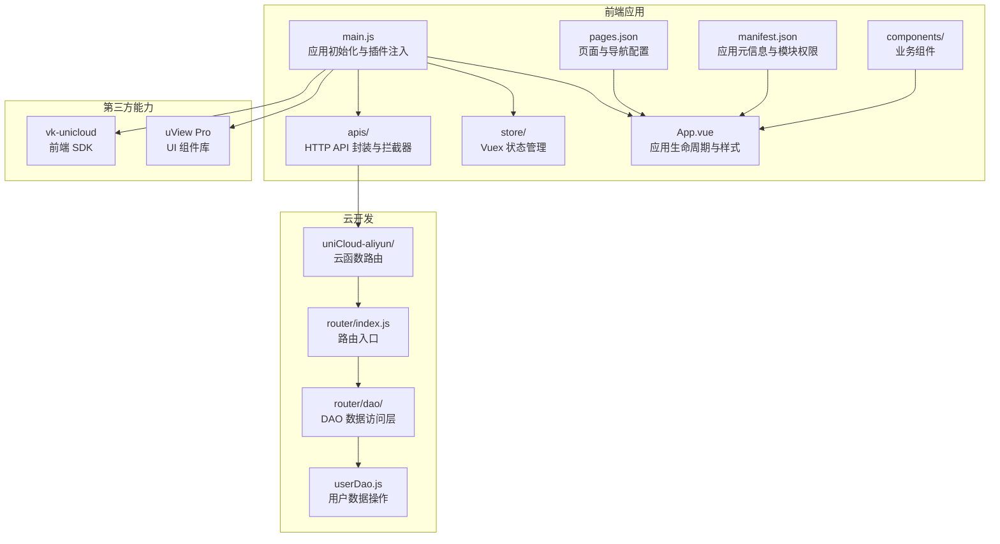
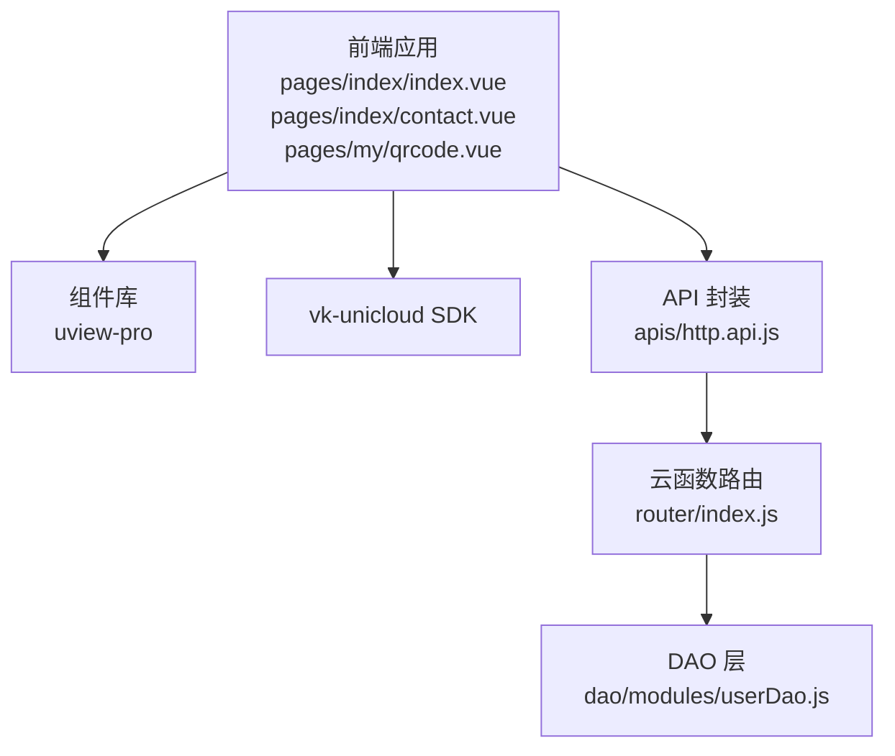
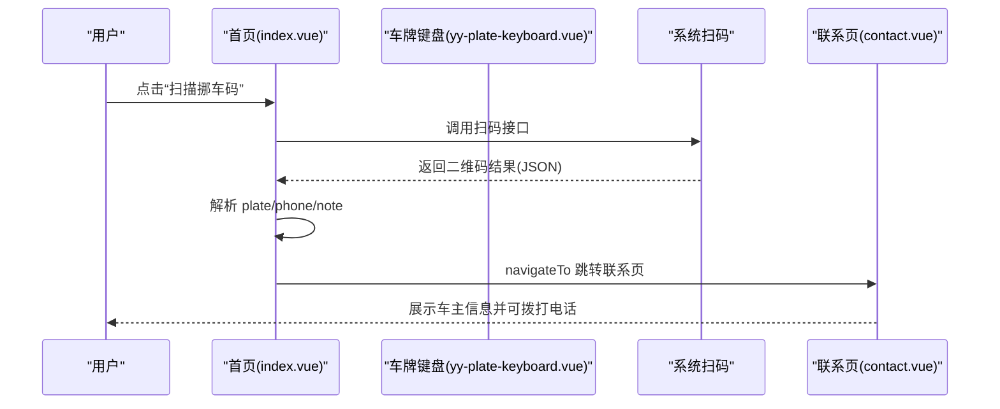
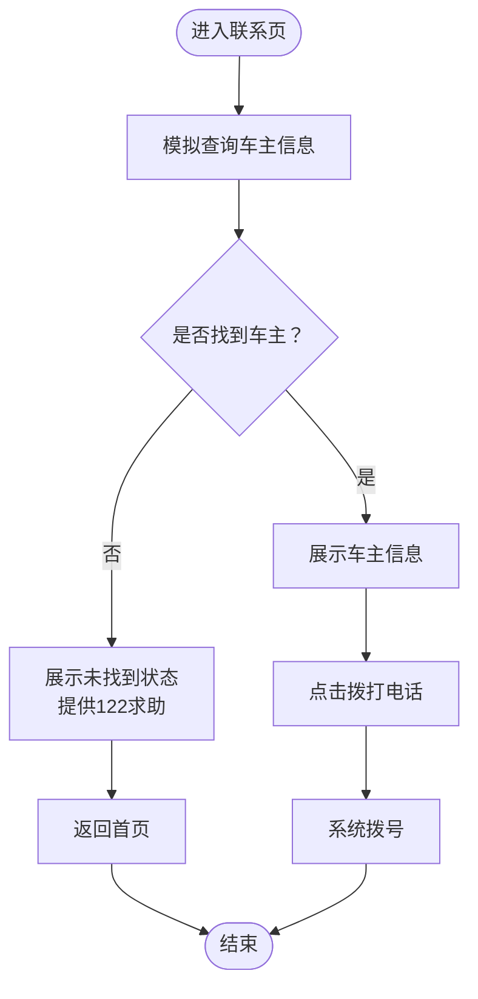
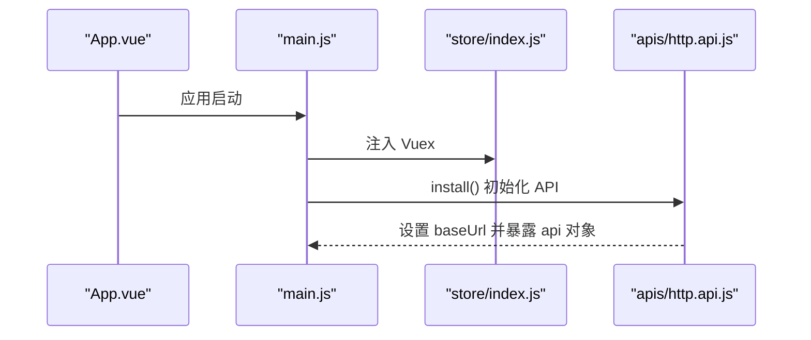
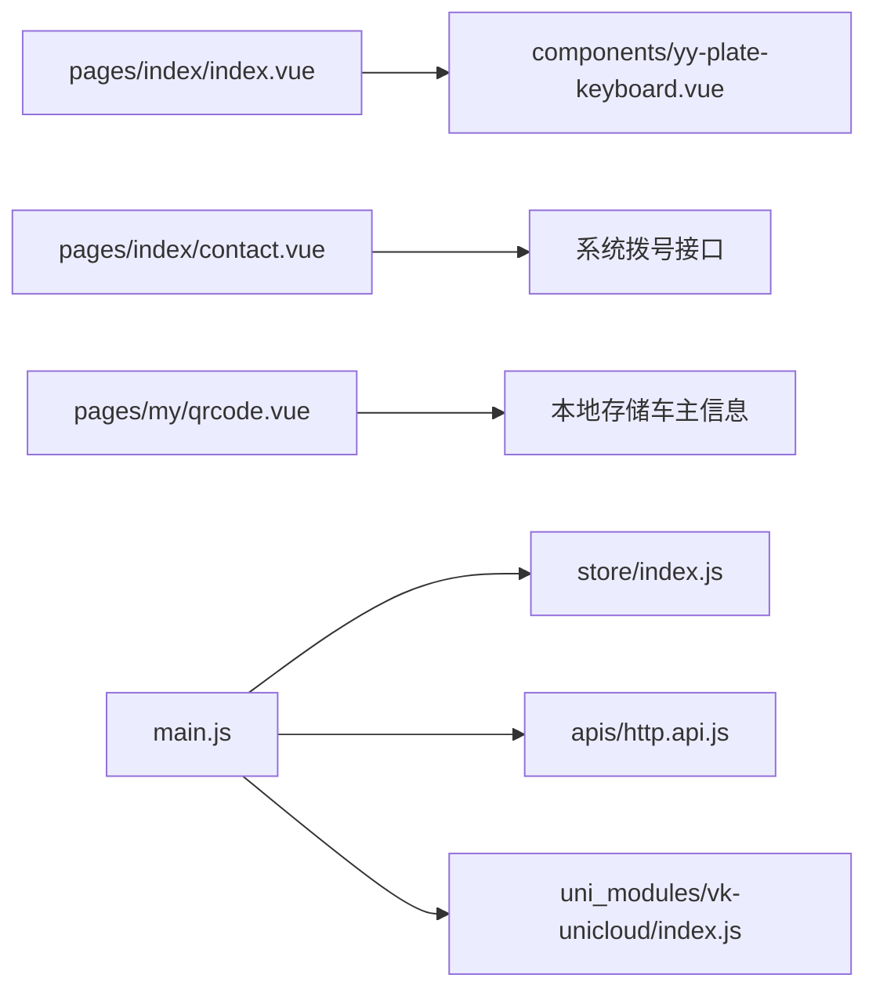

# 项目介绍

<cite>
**本文引用的文件**
- [README.md](file://README.md)
- [App.vue](file://App.vue)
- [main.js](file://main.js)
- [pages.json](file://pages.json)
- [manifest.json](file://manifest.json)
- [pages/index/index.vue](file://pages/index/index.vue)
- [pages/index/contact.vue](file://pages/index/contact.vue)
- [pages/my/qrcode.vue](file://pages/my/qrcode.vue)
- [components/yy-plate-keyboard.vue](file://components/yy-plate-keyboard.vue)
- [store/modules/$user.js](file://store/modules/$user.js)
- [store/index.js](file://store/index.js)
- [apis/http.api.js](file://apis/http.api.js)
- [uniCloud-aliyun/cloudfunctions/router/index.js](file://uniCloud-aliyun/cloudfunctions/router/index.js)
- [uniCloud-aliyun/cloudfunctions/router/dao/modules/userDao.js](file://uniCloud-aliyun/cloudfunctions/router/dao/modules/userDao.js)
- [uni_modules/vk-unicloud/index.js](file://uni_modules/vk-unicloud/index.js)
- [common/function/myPubFunction.js](file://common/function/myPubFunction.js)
</cite>

## 目录
1. [引言](#引言)
2. [项目结构](#项目结构)
3. [核心组件](#核心组件)
4. [架构总览](#架构总览)
5. [详细组件分析](#详细组件分析)
6. [依赖关系分析](#依赖关系分析)
7. [性能考虑](#性能考虑)
8. [故障排查指南](#故障排查指南)
9. [结论](#结论)
10. [附录](#附录)

## 引言
挪车助手是一个基于 uni-app 的跨平台小程序应用，旨在简化“挪车”过程中的沟通成本。用户可以通过输入车牌号或扫描车主提供的挪车码，快速联系到车辆所有人，并在需要时生成自己的专属挪车码供他人扫码联系。项目通过简洁直观的交互设计与前后端分离的架构，帮助用户在现实生活中高效解决问题。

- 解决的问题
  - 车辆违停或阻碍通行时，难以快速联系到车主
  - 车主希望以更便捷的方式被联系，避免电话拨号的繁琐
  - 需要标准化的挪车流程与文明沟通提示

- 业务价值
  - 提升交通效率，减少因挪车引发的纠纷
  - 降低沟通成本，提升用户体验
  - 为车主提供可分享的二维码名片，便于他人联系

- 技术背景
  - 前端采用 uni-app + Vue 3 + uView Pro UI 框架
  - 云开发采用 uniCloud（阿里云），通过 vk-unicloud 快速搭建服务端能力
  - 通过云函数路由统一处理 API 请求，DAO 层封装数据库操作

- 为什么选择开发
  - 场景真实、需求明确，具备良好的落地性
  - 通过二维码名片与车牌输入两种入口，覆盖不同使用场景
  - 易于扩展（如短信模板、联系记录、车主隐私保护等）

## 项目结构
项目采用典型的 uni-app 分层组织方式：
- 应用入口与全局配置：main.js、App.vue、manifest.json、pages.json
- 页面与组件：pages、components
- 状态管理：store（Vuex）
- API 与拦截器：apis
- 云开发：uniCloud-aliyun（云函数路由、DAO 层）
- 工具函数：common/function
- UI 组件库：uni_modules/uview-pro
- 通用能力封装：uni_modules/vk-unicloud

图表来源
- [App.vue:1-48](file://App.vue#L1-L48)
- [main.js:1-49](file://main.js#L1-L49)
- [pages.json:1-87](file://pages.json#L1-L87)
- [manifest.json:1-271](file://manifest.json#L1-L271)
- [store/index.js:1-136](file://store/index.js#L1-L136)
- [apis/http.api.js:1-32](file://apis/http.api.js#L1-L32)
- [uniCloud-aliyun/cloudfunctions/router/index.js:1-8](file://uniCloud-aliyun/cloudfunctions/router/index.js#L1-L8)
- [uniCloud-aliyun/cloudfunctions/router/dao/modules/userDao.js:1-568](file://uniCloud-aliyun/cloudfunctions/router/dao/modules/userDao.js#L1-L568)
- [uni_modules/vk-unicloud/index.js:1-4](file://uni_modules/vk-unicloud/index.js#L1-L4)

章节来源
- [App.vue:1-48](file://App.vue#L1-L48)
- [main.js:1-49](file://main.js#L1-L49)
- [pages.json:1-87](file://pages.json#L1-L87)
- [manifest.json:1-271](file://manifest.json#L1-L271)

## 核心组件
- 首页（输入车牌/扫码入口）
  - 功能：输入车牌号、历史记录、扫码入口、跳转“我的车辆”“挪车码”
  - 关键实现：yy-plate-keyboard 车牌键盘、历史搜索持久化、扫码解析
- 联系车主页
  - 功能：根据车牌查询车主信息、展示联系信息、拨打电话、文明提示
  - 关键实现：模拟查询、电话拨号、状态卡片切换
- 我的挪车码页
  - 功能：展示车主信息、保存/分享提示、使用说明
  - 关键实现：信息脱敏显示、空态引导、步骤指引
- 车牌键盘组件
  - 功能：省份首字专用键盘、字母数字输入、删除、光标动画
  - 关键实现：输入状态计算、禁用非法字符、弹出式布局
- 用户状态管理
  - 功能：用户信息、权限、邀请码等状态管理
  - 关键实现：Vuex 模块化、本地持久化、公共 mutations
- API 与拦截器
  - 功能：统一 API 封装、环境切换、请求拦截
  - 关键实现：http.api.js、http.interceptor.js
- 云函数路由与 DAO
  - 功能：统一路由入口、用户数据 CRUD、邀请码生成等
  - 关键实现：router/index.js、userDao.js

章节来源
- [pages/index/index.vue:1-720](file://pages/index/index.vue#L1-L720)
- [pages/index/contact.vue:1-654](file://pages/index/contact.vue#L1-L654)
- [pages/my/qrcode.vue:1-402](file://pages/my/qrcode.vue#L1-L402)
- [components/yy-plate-keyboard.vue:1-317](file://components/yy-plate-keyboard.vue#L1-L317)
- [store/modules/$user.js:1-26](file://store/modules/$user.js#L1-L26)
- [store/index.js:1-136](file://store/index.js#L1-L136)
- [apis/http.api.js:1-32](file://apis/http.api.js#L1-L32)
- [uniCloud-aliyun/cloudfunctions/router/index.js:1-8](file://uniCloud-aliyun/cloudfunctions/router/index.js#L1-L8)
- [uniCloud-aliyun/cloudfunctions/router/dao/modules/userDao.js:1-568](file://uniCloud-aliyun/cloudfunctions/router/dao/modules/userDao.js#L1-L568)

## 架构总览
应用采用“前端 + 云开发”的分层架构：
- 前端负责页面与交互（pages、components、store、apis）
- 云函数路由集中处理请求，DAO 层封装数据库操作
- vk-unicloud 提供前端 SDK，简化云开发接入
- uView Pro 提供统一 UI 组件与主题

图表来源
- [pages/index/index.vue:1-720](file://pages/index/index.vue#L1-L720)
- [pages/index/contact.vue:1-654](file://pages/index/contact.vue#L1-L654)
- [pages/my/qrcode.vue:1-402](file://pages/my/qrcode.vue#L1-L402)
- [uni_modules/vk-unicloud/index.js:1-4](file://uni_modules/vk-unicloud/index.js#L1-L4)
- [apis/http.api.js:1-32](file://apis/http.api.js#L1-L32)
- [uniCloud-aliyun/cloudfunctions/router/index.js:1-8](file://uniCloud-aliyun/cloudfunctions/router/index.js#L1-L8)
- [uniCloud-aliyun/cloudfunctions/router/dao/modules/userDao.js:1-568](file://uniCloud-aliyun/cloudfunctions/router/dao/modules/userDao.js#L1-L568)

## 详细组件分析

### 首页：输入车牌与扫码入口
- 功能要点
  - 车牌输入：支持点击进入 yy-plate-keyboard，实时光标高亮与省份首字强调
  - 历史记录：本地存储最近 10 条车牌，支持清除
  - 联系方式：输入完整车牌后显示“电话联系”入口
  - 扫码入口：调用系统扫码，解析 JSON 数据，跳转联系页
  - 快捷入口：我的车辆、挪车码
- 交互流程（扫码联系车主）

图表来源
- [pages/index/index.vue:242-262](file://pages/index/index.vue#L242-L262)
- [components/yy-plate-keyboard.vue:142-165](file://components/yy-plate-keyboard.vue#L142-L165)
- [pages/index/contact.vue:157-193](file://pages/index/contact.vue#L157-L193)

章节来源
- [pages/index/index.vue:1-720](file://pages/index/index.vue#L1-L720)
- [components/yy-plate-keyboard.vue:1-317](file://components/yy-plate-keyboard.vue#L1-L317)

### 联系车主页：查询与拨号
- 功能要点
  - 加载状态：模拟查询耗时，展示加载动画
  - 未找到：引导通过 122 求助或返回
  - 找到车主：展示车辆描述、电话、联系说明
  - 拨打电话：调用系统拨号接口
- 流程图（查询与拨号）

图表来源
- [pages/index/contact.vue:157-221](file://pages/index/contact.vue#L157-L221)

章节来源
- [pages/index/contact.vue:1-654](file://pages/index/contact.vue#L1-L654)

### 我的挪车码：生成与使用
- 功能要点
  - 信息展示：车牌、车辆描述、电话（脱敏显示）、联系说明
  - 操作按钮：保存到相册（提示开发中）、分享（提示使用右上角）
  - 使用说明：三步法（保存/打印、贴在车窗、等待扫码联系）
- 状态与样式
  - 有信息：展示卡片与操作按钮
  - 无信息：空态卡片，引导前往“我的”设置

章节来源
- [pages/my/qrcode.vue:1-402](file://pages/my/qrcode.vue#L1-L402)

### 车牌键盘组件：输入体验
- 功能要点
  - 省份首字专用键盘，限制非法字符（I/O）
  - 实时光标高亮、输入框视觉反馈
  - 删除键、完成按钮、弹出式底部面板
- 关键实现
  - 计算属性：当前索引、显示字符数组
  - 输入与删除事件：更新 modelValue 并触发 change

章节来源
- [components/yy-plate-keyboard.vue:1-317](file://components/yy-plate-keyboard.vue#L1-L317)

### 用户状态管理与 API
- 用户状态模块
  - 管理 userInfo、permission、inviteCode、historyData、positioning 等
  - 提供获取用户信息的异步动作
- API 封装
  - 环境切换（prod/pre/test）
  - 统一请求方法（get/post）
  - 集中导出接口（如获取 openid、手机号、用户信息）
- 初始化流程

图表来源
- [App.vue:11-36](file://App.vue#L11-L36)
- [main.js:24-48](file://main.js#L24-L48)
- [store/index.js:1-136](file://store/index.js#L1-L136)
- [apis/http.api.js:11-32](file://apis/http.api.js#L11-L32)

章节来源
- [store/modules/$user.js:1-26](file://store/modules/$user.js#L1-L26)
- [store/index.js:1-136](file://store/index.js#L1-L136)
- [apis/http.api.js:1-32](file://apis/http.api.js#L1-L32)

### 云函数路由与 DAO
- 路由入口
  - 通过 vk.router 统一处理事件与上下文
- DAO 层
  - UserDao 继承 BaseDao，提供 findById、findByWhereJson、add、adds、listByIds 等常用方法
  - 用户信息默认过滤 token 与 password 字段
  - 提供邀请码生成、注册登录、账号注销/恢复等业务方法

章节来源
- [uniCloud-aliyun/cloudfunctions/router/index.js:1-8](file://uniCloud-aliyun/cloudfunctions/router/index.js#L1-L8)
- [uniCloud-aliyun/cloudfunctions/router/dao/modules/userDao.js:1-568](file://uniCloud-aliyun/cloudfunctions/router/dao/modules/userDao.js#L1-L568)

## 依赖关系分析
- 前端依赖
  - uView Pro：提供统一 UI 组件与主题
  - vk-unicloud：前端 SDK，简化云开发
  - Vuex：状态管理
  - API 封装：统一请求与环境配置
- 页面依赖
  - 首页依赖车牌键盘组件与历史记录存储
  - 联系页依赖拨号接口与模拟查询
  - 我的挪车码依赖本地存储的车主信息

图表来源
- [pages/index/index.vue:1-720](file://pages/index/index.vue#L1-L720)
- [components/yy-plate-keyboard.vue:1-317](file://components/yy-plate-keyboard.vue#L1-L317)
- [pages/index/contact.vue:1-654](file://pages/index/contact.vue#L1-L654)
- [pages/my/qrcode.vue:1-402](file://pages/my/qrcode.vue#L1-L402)
- [main.js:1-49](file://main.js#L1-L49)
- [store/index.js:1-136](file://store/index.js#L1-L136)
- [apis/http.api.js:1-32](file://apis/http.api.js#L1-L32)
- [uni_modules/vk-unicloud/index.js:1-4](file://uni_modules/vk-unicloud/index.js#L1-L4)

章节来源
- [main.js:1-49](file://main.js#L1-L49)
- [store/index.js:1-136](file://store/index.js#L1-L136)
- [apis/http.api.js:1-32](file://apis/http.api.js#L1-L32)

## 性能考虑
- 页面渲染
  - 使用虚拟列表组件（yy-paging）优化长列表滚动性能
  - 图片预览与多图预览采用原生接口，避免额外开销
- 网络请求
  - API 封装统一 baseUrl 与超时配置，避免重复请求
  - 云函数路由集中处理，减少前端直连复杂度
- 本地存储
  - 历史记录与车主信息使用本地缓存，减少重复查询
- 交互体验
  - 车牌键盘输入即时反馈，减少误操作
  - 扫码入口与拨号入口直达，降低路径成本

## 故障排查指南
- 扫码失败
  - 确认二维码格式为 JSON，包含 plate/phone/note 字段
  - 检查扫码权限与相机权限
- 拨号失败
  - 确认系统拨号权限已授权
  - 检查电话号码是否为空或格式异常
- 未找到车主信息
  - 确认输入车牌完整且符合规则
  - 可通过 122 求助或返回首页重新尝试
- 本地存储异常
  - 清除历史记录或重启应用后重试
- 云函数路由
  - 检查云函数部署状态与日志输出
  - 确认 DAO 层查询条件与字段过滤

章节来源
- [pages/index/index.vue:242-262](file://pages/index/index.vue#L242-L262)
- [pages/index/contact.vue:204-221](file://pages/index/contact.vue#L204-L221)
- [common/function/myPubFunction.js:1-88](file://common/function/myPubFunction.js#L1-L88)

## 结论
挪车助手通过“输入车牌/扫码联系车主 + 生成专属挪车码”的双入口设计，有效降低了挪车沟通成本，提升了交通效率与用户体验。项目采用 uni-app + uniCloud 的轻量架构，结合 vk-unicloud 与 uView Pro，实现了快速开发与良好扩展性。未来可在隐私保护、短信模板、联系记录等方面进一步增强，满足更复杂的业务场景。

## 附录
- 主要功能列表
  - 输入车牌号并联系车主
  - 扫描挪车码直接联系
  - 设置我的车辆信息
  - 生成专属挪车码并分享
  - 历史记录与快捷入口
- 目标用户群体
  - 需要快速联系车主的司机或行人
  - 希望被他人便捷联系的车主
- 使用场景
  - 停车阻塞通道、临时挪车
  - 社区/停车场管理辅助
  - 陌生人之间礼貌沟通的桥梁