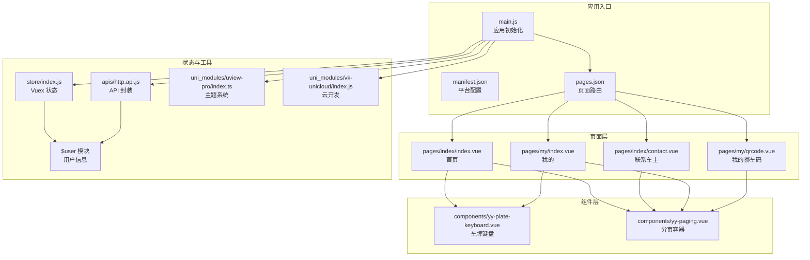
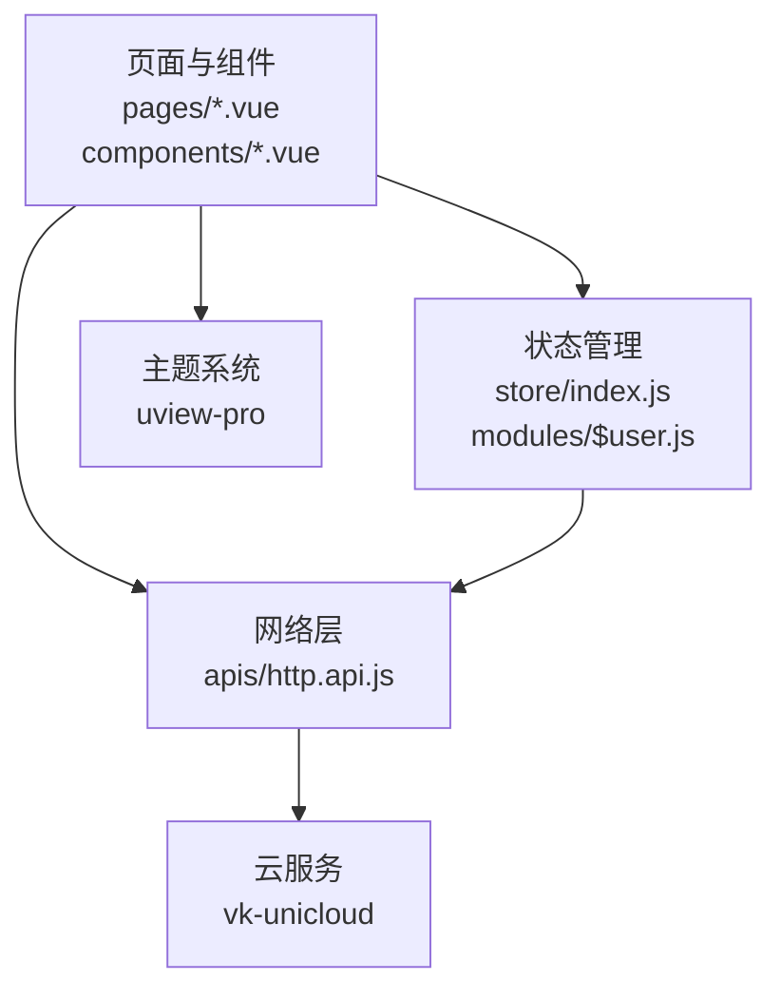
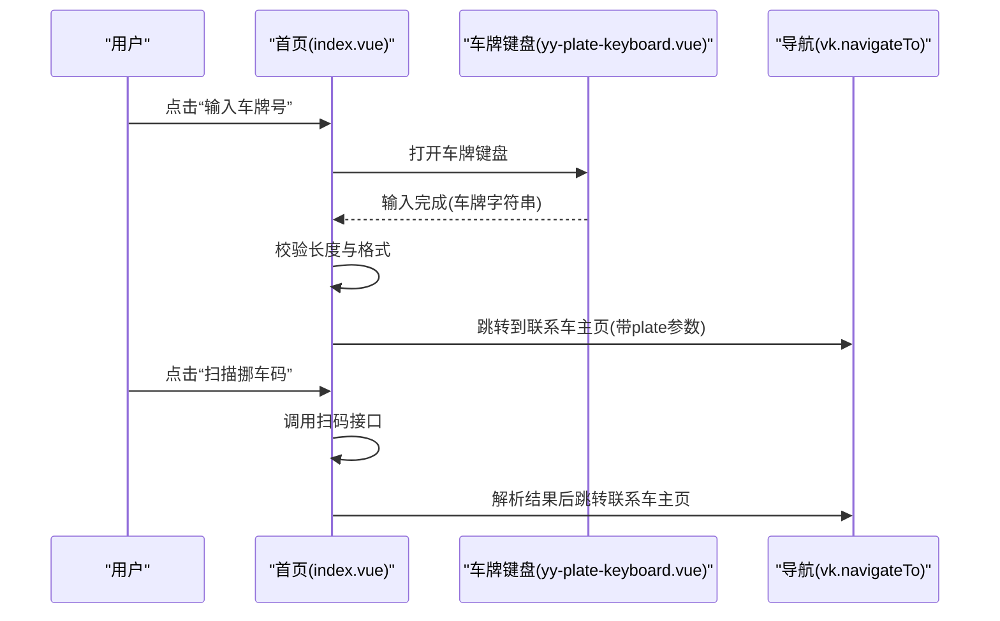
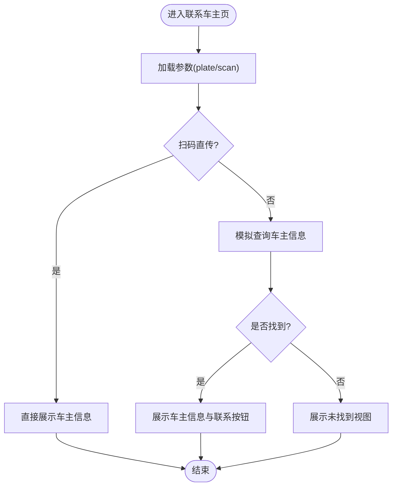
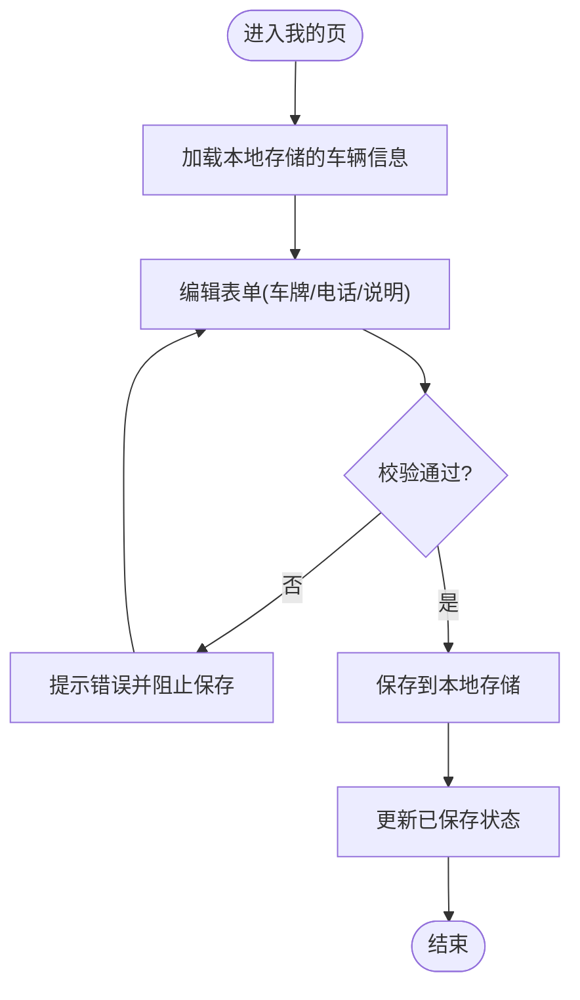
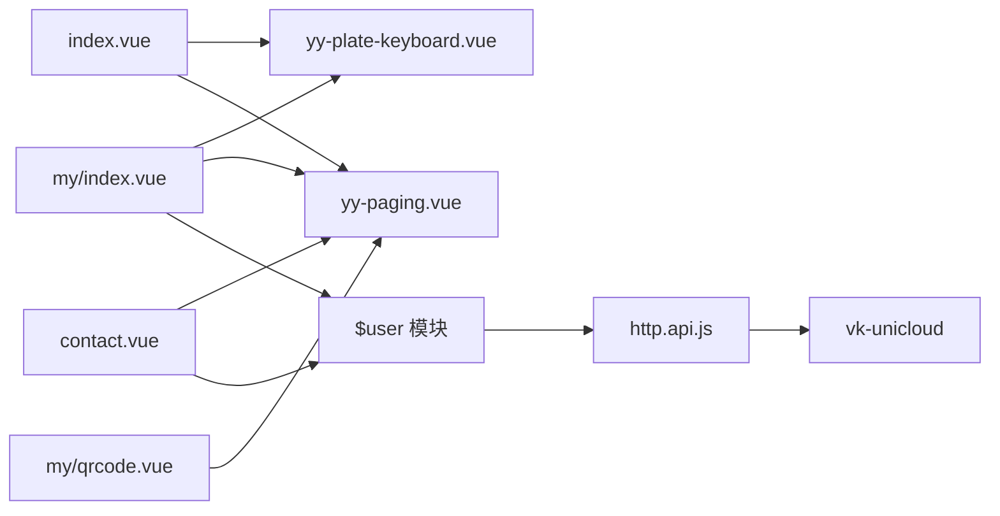

# 项目概述

<cite>
**本文档引用的文件**
- [README.md](file://README.md)
- [main.js](file://main.js)
- [pages.json](file://pages.json)
- [manifest.json](file://manifest.json)
- [store/index.js](file://store/index.js)
- [store/modules/$user.js](file://store/modules/$user.js)
- [pages/index/index.vue](file://pages/index/index.vue)
- [pages/index/contact.vue](file://pages/index/contact.vue)
- [pages/my/index.vue](file://pages/my/index.vue)
- [pages/my/qrcode.vue](file://pages/my/qrcode.vue)
- [apis/http.api.js](file://apis/http.api.js)
- [uni_modules/uview-pro/index.ts](file://uni_modules/uview-pro/index.ts)
- [uni_modules/vk-unicloud/index.js](file://uni_modules/vk-unicloud/index.js)
- [components/yy-plate-keyboard.vue](file://components/yy-plate-keyboard.vue)
- [components/yy-paging.vue](file://components/yy-paging.vue)
</cite>

## 目录
1. [简介](#简介)
2. [项目结构](#项目结构)
3. [核心组件](#核心组件)
4. [架构总览](#架构总览)
5. [详细组件分析](#详细组件分析)
6. [依赖分析](#依赖分析)
7. [性能考虑](#性能考虑)
8. [故障排查指南](#故障排查指南)
9. [结论](#结论)
10. [附录](#附录)

## 简介
挪车助手是一个基于 uni-app 的跨平台小程序与 App 应用，旨在简化“挪车沟通”的流程。用户可以通过输入车牌号或扫描挪车码快速联系车主，车主也可在应用中设置自身车辆信息并生成专属挪车码，便于他人扫码联系。项目围绕“车牌识别/输入”、“车主信息管理”、“挪车码生成与展示”、“联系车主”等核心功能展开，提供简洁直观的操作体验。

本项目面向初学者提供清晰的概念介绍，同时为有经验的开发者提供足够的技术深度，涵盖页面路由、组件化设计、状态管理、主题系统、云开发集成与基础网络请求封装等内容。

## 项目结构
项目采用 uni-app 标准目录组织，结合模块化与组件化思想，形成“页面-组件-工具库-状态管理-云服务”的分层架构。

- 页面层：pages 目录包含首页、联系车主页、我的资料页、我的挪车码页等。
- 组件层：components 目录包含通用业务组件，如车牌键盘、分页容器等。
- 工具与主题：uni_modules 下集成 uView-Pro 主题与 vk-unicloud 云开发能力。
- 状态管理：store 目录采用模块化 Vuex 结构，支持持久化与命名空间。
- 网络与拦截：apis 目录提供 API 封装与请求拦截器安装。
- 应用配置：manifest.json 定义平台能力、权限与第三方 SDK；pages.json 定义页面路由与全局样式。

**图表来源**
- [main.js:1-49](file://main.js#L1-L49)
- [pages.json:1-87](file://pages.json#L1-L87)
- [manifest.json:1-271](file://manifest.json#L1-L271)
- [store/index.js:1-136](file://store/index.js#L1-L136)
- [store/modules/$user.js:1-26](file://store/modules/$user.js#L1-L26)
- [apis/http.api.js:1-32](file://apis/http.api.js#L1-L32)
- [uni_modules/uview-pro/index.ts:1-101](file://uni_modules/uview-pro/index.ts#L1-L101)
- [uni_modules/vk-unicloud/index.js:1-4](file://uni_modules/vk-unicloud/index.js#L1-L4)
- [components/yy-plate-keyboard.vue:1-317](file://components/yy-plate-keyboard.vue#L1-L317)
- [components/yy-paging.vue:1-339](file://components/yy-paging.vue#L1-L339)

**章节来源**
- [main.js:1-49](file://main.js#L1-L49)
- [pages.json:1-87](file://pages.json#L1-L87)
- [manifest.json:1-271](file://manifest.json#L1-L271)

## 核心组件
- 车牌键盘组件：提供省份选择与字母数字输入，支持光标高亮与删除交互，适配中国车牌输入规范。
- 分页容器组件：封装 z-paging，提供下拉刷新、空数据视图、加载更多、导航栏与 Tabbar 集成等能力。
- 页面容器：首页负责输入车牌/扫码入口与历史记录；联系车主页负责查询与展示车主信息；我的页面负责设置车辆信息与隐私开关；我的挪车码页负责展示与使用说明。

这些组件通过统一的主题系统与工具库进行样式与行为的一致化，提升开发效率与用户体验。

**章节来源**
- [components/yy-plate-keyboard.vue:1-317](file://components/yy-plate-keyboard.vue#L1-L317)
- [components/yy-paging.vue:1-339](file://components/yy-paging.vue#L1-L339)

## 架构总览
项目采用“页面-组件-状态-网络-云服务”分层架构，页面通过组件与状态管理实现业务逻辑，网络层通过 API 封装与拦截器处理请求，云服务通过 vk-unicloud 提供统一接入。

**图表来源**
- [store/index.js:1-136](file://store/index.js#L1-L136)
- [store/modules/$user.js:1-26](file://store/modules/$user.js#L1-L26)
- [apis/http.api.js:1-32](file://apis/http.api.js#L1-L32)
- [uni_modules/vk-unicloud/index.js:1-4](file://uni_modules/vk-unicloud/index.js#L1-L4)
- [uni_modules/uview-pro/index.ts:1-101](file://uni_modules/uview-pro/index.ts#L1-L101)

## 详细组件分析

### 页面：首页（输入车牌/扫码）
- 功能要点
  - 车牌输入：通过车牌键盘组件实现逐位输入与光标高亮，支持历史记录读取与清理。
  - 联系车主：当输入满足条件时显示“电话联系”按钮，跳转至联系车主页。
  - 扫码入口：调用系统扫码接口解析二维码，解析出车牌与电话后跳转联系车主页。
  - 功能入口：跳转至“我的车辆”与“我的挪车码”页面。
- 数据流
  - 输入状态由页面局部状态维护，历史记录通过本地存储读写。
  - 跳转参数通过路由携带，联系车主页根据参数决定查询策略。

**图表来源**
- [pages/index/index.vue:174-270](file://pages/index/index.vue#L174-L270)
- [components/yy-plate-keyboard.vue:83-166](file://components/yy-plate-keyboard.vue#L83-L166)

**章节来源**
- [pages/index/index.vue:174-270](file://pages/index/index.vue#L174-L270)

### 页面：联系车主（查询与展示）
- 功能要点
  - 查询状态：显示“正在查询车主信息”加载态。
  - 未找到：展示“未找到该车辆信息”，提供“通过 122 求助”与“返回”操作。
  - 找到车主：展示车主信息（含隐藏手机号脱敏显示）、联系说明与“拨打电话”按钮。
- 数据流
  - 支持两种来源：扫码直传参数与模拟查询（实际应对接后端 API）。
  - 电话号码支持隐藏中间四位，体现隐私保护。

**图表来源**
- [pages/index/contact.vue:157-193](file://pages/index/contact.vue#L157-L193)

**章节来源**
- [pages/index/contact.vue:157-193](file://pages/index/contact.vue#L157-L193)

### 页面：我的（设置车辆信息与隐私）
- 功能要点
  - 车辆信息：车牌、车型/颜色、联系电话、联系说明。
  - 隐私设置：隐藏真实手机号、允许语音通话、接收挪车通知。
  - 保存校验：车牌长度与手机号格式校验，保存至本地存储。
  - 跳转：进入“我的挪车码”页。
- 数据流
  - 表单状态通过页面局部状态维护，保存后更新“已保存”状态。

**图表来源**
- [pages/my/index.vue:283-328](file://pages/my/index.vue#L283-L328)

**章节来源**
- [pages/my/index.vue:283-328](file://pages/my/index.vue#L283-L328)

### 页面：我的挪车码（展示与使用说明）
- 功能要点
  - 展示：当存在有效车辆信息时，展示车牌、脱敏电话与联系说明。
  - 操作：保存到相册（预留）、分享（提示使用右上角）。
  - 使用说明：三步式指导（保存/打印、贴在车窗、等待扫码联系）。
- 数据流
  - 从本地存储读取车辆信息，若无则引导前往设置。

**章节来源**
- [pages/my/qrcode.vue:146-175](file://pages/my/qrcode.vue#L146-L175)

### 组件：车牌键盘
- 功能要点
  - 省份选择与字母数字输入，限制第 1 位为省份，后续位排除特定字符。
  - 实时光标高亮与删除键，支持完成回调。
- 数据流
  - 通过 v-model 双向绑定，向外发出 change 事件。

**章节来源**
- [components/yy-plate-keyboard.vue:83-166](file://components/yy-plate-keyboard.vue#L83-L166)

### 组件：分页容器
- 功能要点
  - 封装 z-paging，提供下拉刷新、空数据视图、加载更多、导航栏与 Tabbar 集成。
  - 支持页面滚动模式与虚拟列表配置。
- 数据流
  - 通过 v-model 同步列表数据，向上抛出 query/onRefresh/scrolltolower 等事件。

**章节来源**
- [components/yy-paging.vue:129-331](file://components/yy-paging.vue#L129-L331)

### 状态管理与用户模块
- 功能要点
  - store/index.js：自动扫描 modules 目录，支持命名空间模块与本地持久化。
  - $user 模块：提供用户信息获取动作，调用 API 并更新状态。
- 数据流
  - 页面通过 vuex 调用 actions 获取用户信息，再由工具库写入本地存储。

**章节来源**
- [store/index.js:1-136](file://store/index.js#L1-L136)
- [store/modules/$user.js:1-26](file://store/modules/$user.js#L1-L26)

### 网络与 API 封装
- 功能要点
  - http.api.js：定义环境映射与基础 URL，提供统一的请求封装与全局注入。
  - 支持 openid、手机号、用户信息等接口。
- 数据流
  - 页面通过全局 api 对象调用接口，统一走 uView http 配置。

**章节来源**
- [apis/http.api.js:1-32](file://apis/http.api.js#L1-L32)

### 主题系统与云开发
- 功能要点
  - uview-pro：提供主题初始化、国际化与调试配置，挂载到 uni.$u。
  - vk-unicloud：提供云开发统一入口，便于后续扩展数据库与云函数。
- 数据流
  - 应用启动时安装主题与云开发插件，页面与组件通过统一 API 访问。

**章节来源**
- [uni_modules/uview-pro/index.ts:1-101](file://uni_modules/uview-pro/index.ts#L1-L101)
- [uni_modules/vk-unicloud/index.js:1-4](file://uni_modules/vk-unicloud/index.js#L1-L4)

## 依赖分析
- 页面依赖
  - 首页依赖车牌键盘与分页容器；联系车主页依赖分页容器；我的页依赖车牌键盘与分页容器；我的挪车码页依赖分页容器。
- 状态与网络
  - 页面通过 store 与 api 进行数据交互，$user 模块提供用户信息获取。
- 平台与权限
  - manifest.json 中声明相机、蓝牙、定位、支付、OAuth 等模块与权限，确保扫码、地图、支付等功能可用。

**图表来源**
- [pages/index/index.vue:174-270](file://pages/index/index.vue#L174-L270)
- [pages/index/contact.vue:157-193](file://pages/index/contact.vue#L157-L193)
- [pages/my/index.vue:283-328](file://pages/my/index.vue#L283-L328)
- [pages/my/qrcode.vue:146-175](file://pages/my/qrcode.vue#L146-L175)
- [store/modules/$user.js:17-22](file://store/modules/$user.js#L17-L22)
- [apis/http.api.js:19-28](file://apis/http.api.js#L19-L28)
- [uni_modules/vk-unicloud/index.js:1-4](file://uni_modules/vk-unicloud/index.js#L1-L4)

**章节来源**
- [manifest.json:30-43](file://manifest.json#L30-L43)

## 性能考虑
- 列表优化：分页容器支持虚拟列表与预加载页数配置，适合大数据场景。
- 本地存储：历史记录与用户信息通过本地存储缓存，减少重复请求。
- 主题与组件：统一主题系统减少重复样式计算，组件按需引入降低包体积。
- 网络请求：统一的请求封装与环境配置，便于后续接入缓存与重试策略。

[本节为通用建议，无需具体文件引用]

## 故障排查指南
- 扫码失败
  - 确认 manifest.json 中已开启相机模块与权限。
  - 检查首页扫码回调中的 JSON 解析与参数校验逻辑。
- 联系车主无结果
  - 确认本地存储中是否存在匹配的车辆信息；若无，引导用户前往“我的”设置。
- 保存失败
  - 检查表单校验逻辑（车牌长度与手机号格式），确保符合要求后再保存。
- 主题或云开发异常
  - 确认 main.js 中已正确安装 uView-Pro 与 vk-unicloud，并检查全局配置。

**章节来源**
- [manifest.json:30-43](file://manifest.json#L30-L43)
- [pages/index/index.vue:242-262](file://pages/index/index.vue#L242-L262)
- [pages/index/contact.vue:174-192](file://pages/index/contact.vue#L174-L192)
- [pages/my/index.vue:312-328](file://pages/my/index.vue#L312-L328)
- [main.js:24-48](file://main.js#L24-L48)

## 结论
挪车助手项目以“便捷沟通”为核心目标，围绕车牌输入/扫码、车主信息管理与挪车码生成三大功能构建，采用 uni-app 跨平台方案与模块化组件化架构，结合主题系统与云开发能力，既满足初学者的学习需求，也为进阶开发者提供了良好的扩展空间。通过统一的状态管理与网络封装，项目具备清晰的数据流与可维护性，适合在多端部署与持续迭代。

[本节为总结性内容，无需具体文件引用]

## 附录
- 技术栈概览
  - 框架：uni-app/Vue3
  - 状态管理：Vuex（模块化）
  - UI 组件：uView-Pro
  - 分页组件：z-paging
  - 云开发：vk-unicloud
  - 网络：uView http 封装
  - 平台：微信小程序、App、H5（通过 manifest.json 配置）

[本节为概览性内容，无需具体文件引用]