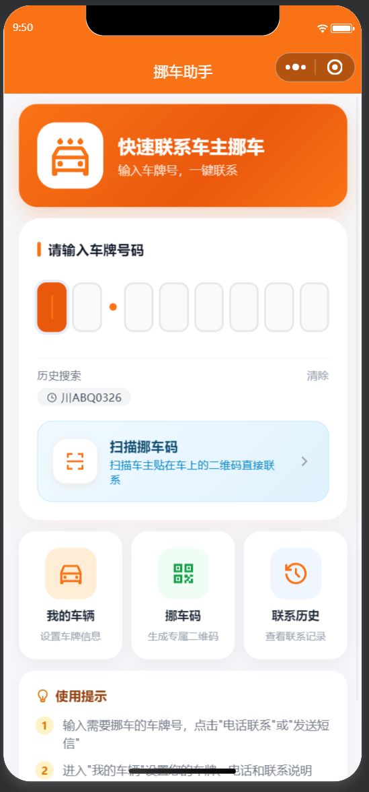
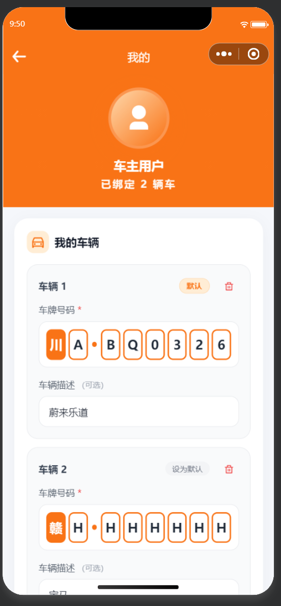
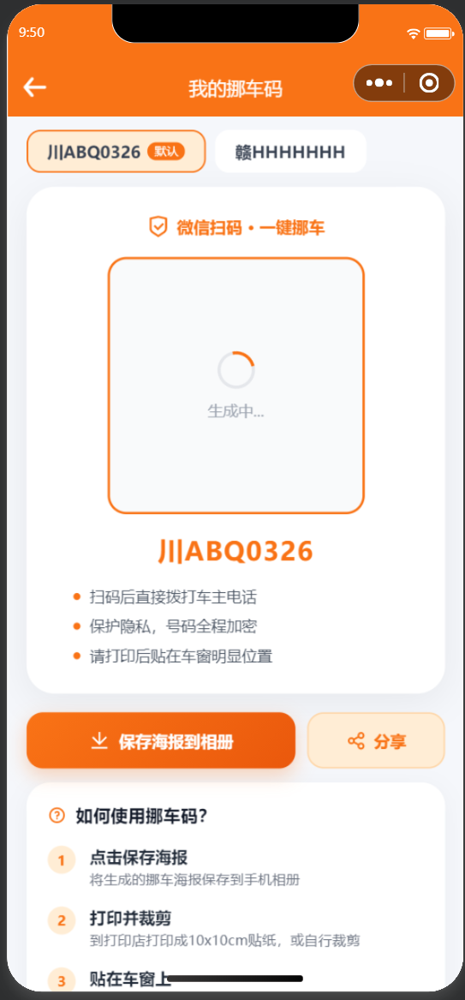
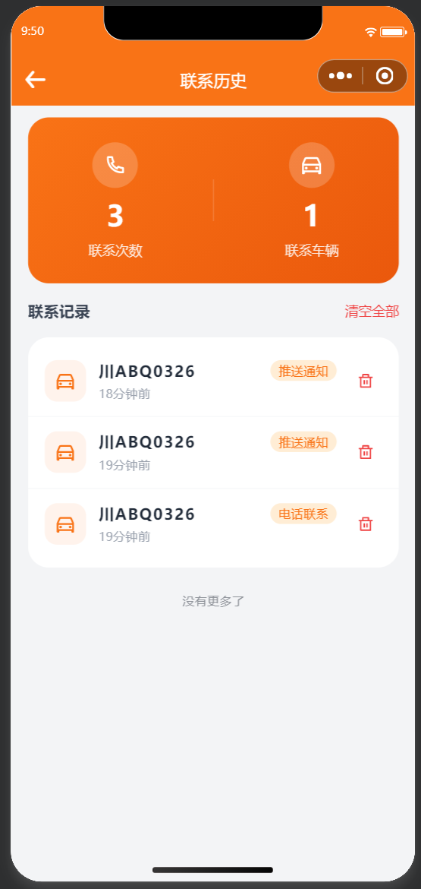

# 挪车助手

便捷的挪车助手工具，输入车牌号或扫码即可联系车主，设置自己的车辆信息生成专属挪车码，让挪车沟通更高效。

## 功能介绍

- **快速联系车主**：输入车牌号码，一键拨打电话或发送短信通知车主挪车
- **扫描挪车码**：扫描车主贴在车窗上的二维码，直接联系车主
- **我的车辆**：管理自己的车辆信息，支持绑定多辆车
- **挪车码生成**：为每辆车生成专属微信扫码挪车码，可保存海报打印张贴
- **联系历史**：查看所有的挪车联系记录，支持推送通知和电话联系两种方式

## 技术栈

- [uni-app](https://uniapp.dcloud.net.cn/) + Vue 3 + Vite
- [uView Pro](https://www.uviewui.com/) UI 组件库
- [VK UniCloud](https://vkdoc.fsq.pub/) 云开发框架
- [TailwindCSS](https://tailwindcss.com/) 原子化 CSS
- [Iconify](https://iconify.design/) 图标库

## 项目截图

### 首页

输入车牌号码快速联系车主，支持扫描挪车码和历史搜索。



### 我的车辆

管理已绑定的车辆信息，支持多辆车切换和设置默认车辆。



### 我的挪车码

生成专属挪车二维码海报，可保存到相册并打印张贴在车窗上。



### 联系历史

查看所有挪车联系记录，统计联系次数和联系车辆数。



## 开发环境

- HBuilderX 3.1.2+
- Node.js 16+
- pnpm

## 运行项目

1. 使用 HBuilderX 打开项目
2. 安装依赖：
   ```bash
   pnpm install
   ```
3. 在 HBuilderX 中点击「运行」→ 选择「微信开发者工具」或「H5」

## 目录结构

```
├── apis/                  # HTTP API 接口管理
├── common/                # 公共样式和工具函数
├── components/            # 自定义业务组件（yy-* 前缀）
├── pages/                 # 页面目录
│   ├── index/             # 首页、联系车主
│   ├── my/                # 我的、挪车码、联系历史
│   └── login/             # 登录页
├── static/                # 静态资源
├── store/                 # Vuex 状态管理
├── uni_modules/           # uni-app 插件
│   ├── uview-pro/         # UI 组件库
│   └── vk-unicloud/       # VK 云开发框架
├── uniCloud-aliyun/       # 阿里云云函数
└── manifest.json          # 应用配置
```

## 许可证

MIT
